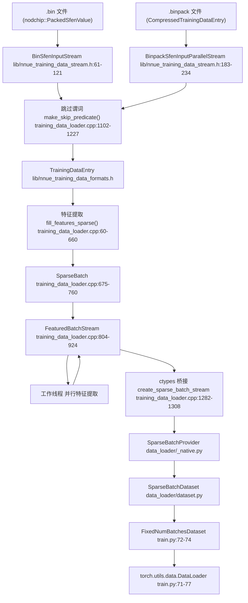
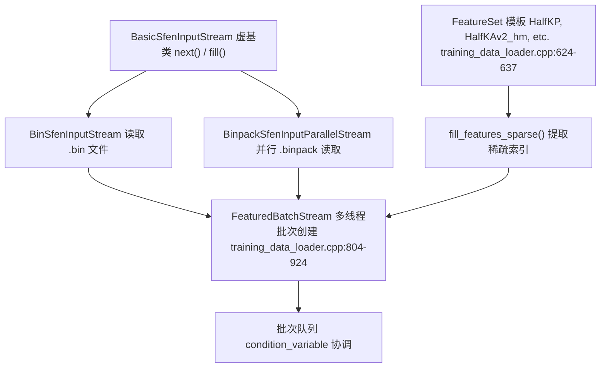
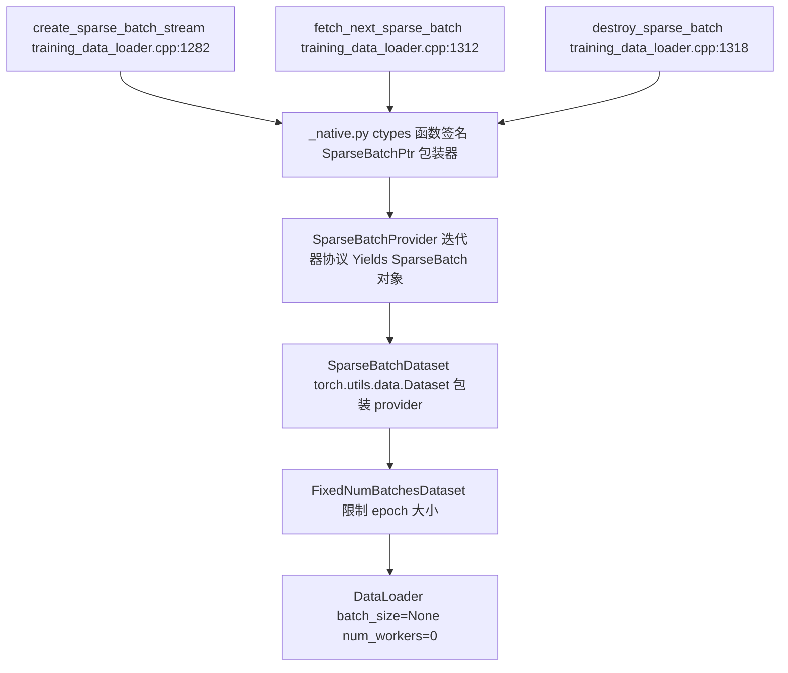

# 数据流水线

-   [lib/nnue\_training\_data\_formats.h](https://github.com/Chesszyh/nnue-pytorch/blob/024b2064/lib/nnue_training_data_formats.h)
-   [lib/nnue\_training\_data\_stream.h](https://github.com/Chesszyh/nnue-pytorch/blob/024b2064/lib/nnue_training_data_stream.h)
-   [train.py](https://github.com/Chesszyh/nnue-pytorch/blob/024b2064/train.py)
-   [training\_data\_loader.cpp](https://github.com/Chesszyh/nnue-pytorch/blob/024b2064/training_data_loader.cpp)

## 目的与范围

本文档提供了 nnue-pytorch 中训练数据加载系统的全面概述，该系统将二进制国际象棋局面文件转换为 PyTorch 兼容的稀疏特征张量。该流水线由用于 I/O 和特征提取的高性能 C++ 后端，以及用于与 PyTorch 训练基础设施集成的 Python 前端组成。

有关特定特征集及其实现的详细信息，请参阅 [特征集](#4.2)。有关使用这些数据的模型架构信息，请参阅 [NNUE 网络结构](#4.1)。有关训练编排详情，请参阅 [基础训练](#2.1)。

## 系统概览

数据流水线弥合了压缩训练数据文件（`.bin` 和 `.binpack` 格式）与 PyTorch 训练循环之间的差距。它专为最大吞吐量而设计，使用 C++ 进行性能关键型操作，并公开简单的 Python 接口。

**关键设计原则：**

-   **性能**：C++ 实现，带有 SIMD 优化和并行解压缩
-   **灵活性**：可配置的过滤和跳过机制，用于局面选择
-   **稀疏表示**：特征提取生成稀疏索引，以最小化内存传输
-   **流式处理**：对循环数据集进行无限迭代，无需将所有内容加载到内存中

## 完整数据流


**来源：** [train.py44-89](https://github.com/Chesszyh/nnue-pytorch/blob/024b2064/train.py#L44-L89) [training\_data\_loader.cpp762-924](https://github.com/Chesszyh/nnue-pytorch/blob/024b2064/training_data_loader.cpp#L762-L924) [lib/nnue\_training\_data\_stream.h41-256](https://github.com/Chesszyh/nnue-pytorch/blob/024b2064/lib/nnue_training_data_stream.h#L41-L256)

## 二进制训练数据格式

该流水线支持两种国际象棋训练数据的二进制格式：

| 格式 | 扩展名 | 描述 | 并行化 |
| --- | --- | --- | --- |
| **纯二进制** | `.bin` | 使用 `nodchip::PackedSfenValue` 的未压缩局面（每条目 40 字节） | 仅顺序读取 |
| **Binpack** | `.binpack` | 带有交错块的压缩格式，文件更小 | 通过 `CompressedTrainingDataEntryParallelReader` 并行解压缩 |

两种格式存储相同的信息：

-   棋盘局面（棋子位置、走棋方、王车易位权、吃过路兵）
-   评估分数（厘兵）
-   对弈结果（胜/平/负）
-   从该局面走出的着法
-   Ply 计数

通过 `open_sfen_input_file_parallel()` 在 [lib/nnue\_training\_data\_stream.h246-255](https://github.com/Chesszyh/nnue-pytorch/blob/024b2064/lib/nnue_training_data_stream.h#L246-L255) 中根据文件扩展名自动检测格式。

**有关详细的格式规范，请参阅 [训练数据格式](#3.1)。**

**来源：** [lib/nnue\_training\_data\_stream.h61-234](https://github.com/Chesszyh/nnue-pytorch/blob/024b2064/lib/nnue_training_data_stream.h#L61-L234) [lib/nnue\_training\_data\_formats.h](https://github.com/Chesszyh/nnue-pytorch/blob/024b2064/lib/nnue_training_data_formats.h)

## C++ 数据加载器架构

### 核心组件


**来源：** [training\_data\_loader.cpp762-924](https://github.com/Chesszyh/nnue-pytorch/blob/024b2064/training_data_loader.cpp#L762-L924) [lib/nnue\_training\_data\_stream.h41-58](https://github.com/Chesszyh/nnue-pytorch/blob/024b2064/lib/nnue_training_data_stream.h#L41-L58)

### SparseBatch 数据结构

`SparseBatch` 类 [training\_data\_loader.cpp675-760](https://github.com/Chesszyh/nnue-pytorch/blob/024b2064/training_data_loader.cpp#L675-L760) 是表示稀疏特征格式局面批次的核心数据结构：

**关键字段：**

-   `int* white` / `int* black`：每方的稀疏特征索引（维度：`size * MAX_ACTIVE_FEATURES`）
-   `float* white_values` / `float* black_values`：对应的特征值（通常为 1.0，对于虚拟特征为棋子数）
-   `float* is_white`：走棋方指示器（1.0 = 白方，0.0 = 黑方）
-   `float* score`：厘兵单位的评估分数
-   `float* outcome`：归一化到 \[0, 1\] 的对弈结果（0 = 负，0.5 = 平，1 = 胜）
-   `int* psqt_indices`：PSQT 桶索引（基于棋子数）
-   `int* layer_stack_indices`：层堆栈桶索引

构造函数 [training\_data\_loader.cpp678-709](https://github.com/Chesszyh/nnue-pytorch/blob/024b2064/training_data_loader.cpp#L678-L709) 通过以下方式填充此结构：

1.  为批次大小分配数组
2.  为每个局面和两种颜色调用 `fill_features_sparse()`
3.  初始化索引为 -1 以进行填充

### 多线程批次生产

`FeaturedBatchStream` 类 [training\_data\_loader.cpp804-924](https://github.com/Chesszyh/nnue-pytorch/blob/024b2064/training_data_loader.cpp#L804-L924) 实现了生产者-消费者模式：

1.  **工作线程** [training\_data\_loader.cpp826-859](https://github.com/Chesszyh/nnue-pytorch/blob/024b2064/training_data_loader.cpp#L826-L859)：多个线程并行提取特征

    -   每个线程从共享流读取（由 `m_stream_mutex` 保护）
    -   用 `batch_size` 个条目填充 `std::vector<TrainingDataEntry>`
    -   从条目创建 `SparseBatch`
    -   将批次添加到队列（由 `m_batch_mutex` 保护）
2.  **协调**：使用条件变量进行流控制

    -   `m_batches_not_full`：当队列有空间时发出信号
    -   `m_batches_any`：当有批次可供消费时发出信号
3.  **并发**：可配置的线程数 [training\_data\_loader.cpp861-873](https://github.com/Chesszyh/nnue-pytorch/blob/024b2064/training_data_loader.cpp#L861-L873)

    -   通常使用 `concurrency = std::thread::hardware_concurrency()`
    -   一些线程从磁盘读取，其他线程提取特征

**有关详细的线程模型和 SIMD 优化，请参阅 [C++ 数据加载器架构](#3.2)。**

**来源：** [training\_data\_loader.cpp804-924](https://github.com/Chesszyh/nnue-pytorch/blob/024b2064/training_data_loader.cpp#L804-L924)

## Python 数据接口

### 通过 ctypes 集成

C++ 数据加载器通过导出的 C 函数公开 ABI 稳定的接口 [training\_data\_loader.cpp1229-1321](https://github.com/Chesszyh/nnue-pytorch/blob/024b2064/training_data_loader.cpp#L1229-L1321)：

| C 函数 | 目的 | Python 包装器 |
| --- | --- | --- |
| `create_sparse_batch_stream` | 创建 `FeaturedBatchStream` 实例 | `SparseBatchProvider.__init__` |
| `fetch_next_sparse_batch` | 检索下一个批次指针 | `SparseBatchProvider.__next__` |
| `destroy_sparse_batch` | 释放批次内存 | `SparseBatchProvider` 清理 |
| `destroy_sparse_batch_stream` | 释放流资源 | `SparseBatchProvider.__del__` |

### Python 包装层


**来源：** [train.py44-89](https://github.com/Chesszyh/nnue-pytorch/blob/024b2064/train.py#L44-L89)

### SparseBatchDataset

`SparseBatchDataset` 类提供 C++ 数据加载器的 PyTorch 接口。关键用法来自 [train.py56-68](https://github.com/Chesszyh/nnue-pytorch/blob/024b2064/train.py#L56-L68)：

```
train_infinite = data_loader.SparseBatchDataset(
    features_name,      # 例如 "HalfKAv2_hm^"
    train_filenames,    # .binpack 文件列表
    batch_size,         # 每批次局面数
    num_workers=num_workers,
    config=config       # DataloaderSkipConfig
)
```
数据集：

-   迭代时返回无限批次（循环读取）
-   将每个 `SparseBatch*` 指针包装在 Python 对象中
-   通过 `__del__` 方法管理 C++ 内存生命周期
-   通过 `ctypes` 指针提供对批次数据的零拷贝访问

`FixedNumBatchesDataset` 包装器 [train.py72-74](https://github.com/Chesszyh/nnue-pytorch/blob/024b2064/train.py#L72-L74) 将迭代限制为特定数量的批次，以定义 epoch 边界。

**有关详细的 Python API 文档，请参阅 [Python 数据接口](#3.3)。**

**来源：** [train.py44-89](https://github.com/Chesszyh/nnue-pytorch/blob/024b2064/train.py#L44-L89)

## 数据过滤和局面选择

### DataloaderSkipConfig

`DataloaderSkipConfig` 结构体 [training\_data\_loader.cpp1092-1100](https://github.com/Chesszyh/nnue-pytorch/blob/024b2064/training_data_loader.cpp#L1092-L1100) 控制哪些局面包含在训练中：

| 参数 | 类型 | 目的 |
| --- | --- | --- |
| `filtered` | bool | 跳过被将军或有吃子的局面 |
| `random_fen_skipping` | int | 随机跳过局面（例如 3 = 保留 1/4） |
| `wld_filtered` | bool | 基于 WDL 概率不匹配跳过局面 |
| `early_fen_skipping` | int | 跳过每局游戏的前 N 个 plies |
| `simple_eval_skipping` | int | 跳过 `abs(simple_eval) < N` 的局面 |
| `pc_y1`, `pc_y2`, `pc_y3` | double | 棋子数量分布控制（拉格朗日插值） |

### 跳过谓词实现

`make_skip_predicate()` 函数 [training\_data\_loader.cpp1102-1227](https://github.com/Chesszyh/nnue-pytorch/blob/024b2064/training_data_loader.cpp#L1102-L1227) 创建在数据加载期间使用的过滤 lambda：

**关键过滤逻辑：**

1.  **预定过滤** [training\_data\_loader.cpp1151-1152](https://github.com/Chesszyh/nnue-pytorch/blob/024b2064/training_data_loader.cpp#L1151-L1152)：跳过标记为 `VALUE_NONE` (32002) 的局面
2.  **早期游戏过滤** [training\_data\_loader.cpp1154-1155](https://github.com/Chesszyh/nnue-pytorch/blob/024b2064/training_data_loader.cpp#L1154-L1155)：跳过 `ply <= early_fen_skipping` 的局面
3.  **随机跳过** [training\_data\_loader.cpp1157-1158](https://github.com/Chesszyh/nnue-pytorch/blob/024b2064/training_data_loader.cpp#L1157-L1158)：概率为 `prob` 的伯努利分布
4.  **智能 FEN 过滤** [training\_data\_loader.cpp1160-1161](https://github.com/Chesszyh/nnue-pytorch/blob/024b2064/training_data_loader.cpp#L1160-L1161)：跳过吃子或将军
5.  **WDL 过滤** [training\_data\_loader.cpp1163-1164](https://github.com/Chesszyh/nnue-pytorch/blob/024b2064/training_data_loader.cpp#L1163-L1164)：基于 `score_result_prob()` 不匹配跳过
6.  **简单评估过滤** [training\_data\_loader.cpp1166-1168](https://github.com/Chesszyh/nnue-pytorch/blob/024b2064/training_data_loader.cpp#L1166-L1168)：跳过平静局面
7.  **棋子数量分布** [training\_data\_loader.cpp1182-1220](https://github.com/Chesszyh/nnue-pytorch/blob/024b2064/training_data_loader.cpp#L1182-L1220)：自适应跳过以匹配目标分布

棋子数量过滤使用拉格朗日插值 [training\_data\_loader.cpp1115-1124](https://github.com/Chesszyh/nnue-pytorch/blob/024b2064/training_data_loader.cpp#L1115-L1124) 定义所需分布，并动态调整接受率以匹配它。这允许在开局、中局和残局的均衡混合上进行训练。

**有关详细的过滤算法和配置，请参阅 [数据过滤和跳过配置](#3.4)。**

**来源：** [training\_data\_loader.cpp1092-1227](https://github.com/Chesszyh/nnue-pytorch/blob/024b2064/training_data_loader.cpp#L1092-L1227) [train.py525-535](https://github.com/Chesszyh/nnue-pytorch/blob/024b2064/train.py#L525-L535)

## 特征提取过程

### 特征集模板系统

特征提取是在特征集类型上模板化的 [training\_data\_loader.cpp624-637](https://github.com/Chesszyh/nnue-pytorch/blob/024b2064/training_data_loader.cpp#L624-L637)：

```
template<typename... Ts>
struct FeatureSet {
    static constexpr int INPUTS = T::INPUTS;
    static constexpr int MAX_ACTIVE_FEATURES = T::MAX_ACTIVE_FEATURES;
    
    static std::pair<int, int>
    fill_features_sparse(const TrainingDataEntry& e,
                          int* features,
                          float* values,
                          Color color);
};
```
每个特征块（例如 `HalfKP`, `HalfKAv2_hm`, `Full_Threats`）实现：

-   `INPUTS`：总特征空间维度
-   `MAX_ACTIVE_FEATURES`：每个局面的最大激活特征数
-   `fill_features_sparse()`：填充稀疏索引数组

### 特征提取示例：HalfKAv2\_hm

`HalfKAv2_hm` 特征集 [training\_data\_loader.cpp291-342](https://github.com/Chesszyh/nnue-pytorch/blob/024b2064/training_data_loader.cpp#L291-L342) 演示了提取过程：

1.  **王分桶 (King Bucketing)** [training\_data\_loader.cpp302-311](https://github.com/Chesszyh/nnue-pytorch/blob/024b2064/training_data_loader.cpp#L302-L311)：将王的位置映射到 32 个桶（水平镜像）
2.  **棋子迭代** [training\_data\_loader.cpp332-338](https://github.com/Chesszyh/nnue-pytorch/blob/024b2064/training_data_loader.cpp#L332-L338)：循环遍历棋盘上的所有棋子
3.  **索引计算** [training\_data\_loader.cpp316-322](https://github.com/Chesszyh/nnue-pytorch/blob/024b2064/training_data_loader.cpp#L316-L322)：基于以下内容计算稀疏特征索引：
    -   定向王方格桶
    -   定向棋子方格
    -   棋子类型和颜色（11 种棋子类型：打包的王）
4.  **输出**：返回 `(num_active_features, total_input_dimensions)`

对于因子化特征（后缀 `^`），也会提取虚拟特征 [training\_data\_loader.cpp357-376](https://github.com/Chesszyh/nnue-pytorch/blob/024b2064/training_data_loader.cpp#L357-L376)，其值设置为棋子数。

**来源：** [training\_data\_loader.cpp60-621](https://github.com/Chesszyh/nnue-pytorch/blob/024b2064/training_data_loader.cpp#L60-L621)

## 线程模型和性能

### 并发配置

数据加载器根据 `concurrency` 参数创建工作线程 [training\_data\_loader.cpp861-873](https://github.com/Chesszyh/nnue-pytorch/blob/024b2064/training_data_loader.cpp#L861-L873)：

```
const int num_feature_threads = std::max(
    1,
     concurrency - std::max(1, concurrency / num_feature_threads_per_reading_thread));
```
使用 `num_feature_threads_per_reading_thread = 2` [training\_data\_loader.cpp811](https://github.com/Chesszyh/nnue-pytorch/blob/024b2064/training_data_loader.cpp#L811-L811)，线程分配为：

-   **读取线程**：`concurrency / 2`（解压缩 binpack 块）
-   **特征提取线程**：`concurrency - (concurrency / 2)`（计算稀疏索引）

### 性能特征

典型吞吐量（来自基准测试 [training\_data\_loader.cpp1323-1414](https://github.com/Chesszyh/nnue-pytorch/blob/024b2064/training_data_loader.cpp#L1323-L1414)）：

-   **局面/秒**：100-300 万（取决于特征集复杂度和跳过率）
-   **字节/局面**：压缩后 20-40 字节
-   **批次延迟**：每批次个位数毫秒

瓶颈通常是：

1.  `.binpack` 文件的 **解压缩**（并行化）
2.  复杂特征集如 `Full_Threats` 的 **特征提取**（并行化）
3.  跳过率很高时的 **过滤**（每局面顺序执行）

系统在可用时使用 SIMD 指令（在 include 中引用）进行棋子迭代期间的位操作。

**来源：** [training\_data\_loader.cpp804-924](https://github.com/Chesszyh/nnue-pytorch/blob/024b2064/training_data_loader.cpp#L804-L924) [training\_data\_loader.cpp1323-1414](https://github.com/Chesszyh/nnue-pytorch/blob/024b2064/training_data_loader.cpp#L1323-L1414)

## 与训练循环的集成

### 在 train.py 中的使用

完整的集成来自 [train.py519-538](https://github.com/Chesszyh/nnue-pytorch/blob/024b2064/train.py#L519-L538)：

```
train, val = make_data_loaders(
    train_datasets,          # .binpack 文件列表
    val_datasets,           # 验证文件
    feature_set,            # FeatureSet 对象
    args.num_workers,       # 线程数
    batch_size,             # 每批次局面数
    data_loader.DataloaderSkipConfig(
        filtered=not args.no_smart_fen_skipping,
        random_fen_skipping=args.random_fen_skipping,
        wld_filtered=not args.no_wld_fen_skipping,
        early_fen_skipping=args.early_fen_skipping,
        simple_eval_skipping=args.simple_eval_skipping,
        param_index=args.param_index,
        pc_y1=args.pc_y1,
        pc_y2=args.pc_y2,
        pc_y3=args.pc_y3,
    ),
    args.epoch_size,        # 每 epoch 局面数
    args.validation_size,   # 验证局面数
)
```
返回的 `DataLoader` 对象随后直接在 Lightning 训练循环中使用：

```
trainer.fit(nnue, train, val)
```
### 模型消耗的数据格式

数据加载器生成的每个批次包含：

-   **稀疏索引**：`white`, `black` (形状：`[batch_size, MAX_ACTIVE_FEATURES]`)
-   **稀疏值**：`white_values`, `black_values` (形状：`[batch_size, MAX_ACTIVE_FEATURES]`)
-   **目标**：`score`, `outcome` (形状：`[batch_size]`)
-   **元数据**：`is_white`, `psqt_indices`, `layer_stack_indices` (形状：`[batch_size]`)

这些由 `FeatureTransformer` 在前向传播期间直接消耗。有关稀疏特征如何处理的详细信息，请参阅 [特征变换器](#4.3)。

**来源：** [train.py519-543](https://github.com/Chesszyh/nnue-pytorch/blob/024b2064/train.py#L519-L543)

## 总结

数据流水线是一个高性能、多阶段的系统，它：

1.  使用并行 I/O 从磁盘 **读取** 压缩的国际象棋局面
2.  基于可配置的标准 **过滤** 局面以提高训练质量
3.  **提取** 特定于所选特征集的稀疏特征索引
4.  将局面 **分批** 为固定大小的组，以便高效的 GPU 处理
5.  通过 ctypes **暴露** 与 PyTorch 兼容的接口

该架构通过利用以下方面实现每秒数百万局面的吞吐量：

-   C++ 用于 I/O 和特征提取性能
-   并行解压缩和特征提取
-   稀疏表示以最小化内存传输
-   C++ 和 Python 之间的零拷贝数据传输

该系统足够灵活，支持多种特征集、数据格式和过滤策略，同时在不同的硬件配置上保持高性能。