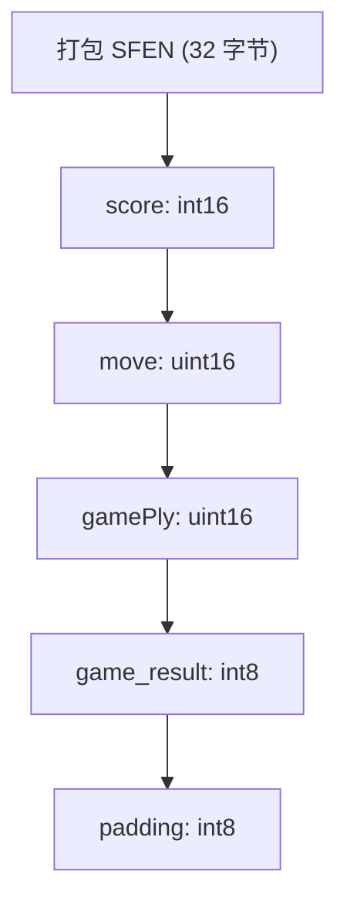

# 训练数据格式

-   [lib/nnue\_training\_data\_formats.h](https://github.com/Chesszyh/nnue-pytorch/blob/024b2064/lib/nnue_training_data_formats.h)
-   [lib/nnue\_training\_data\_stream.h](https://github.com/Chesszyh/nnue-pytorch/blob/024b2064/lib/nnue_training_data_stream.h)
-   [training\_data\_loader.cpp](https://github.com/Chesszyh/nnue-pytorch/blob/024b2064/training_data_loader.cpp)

## 目的与范围

本文档描述了 nnue-pytorch 仓库中用于存储国际象棋训练数据的二进制文件格式。训练数据由国际象棋局面以及配对的评估分数和对弈结果组成，这些数据用于训练 NNUE 神经网络。

有关如何读取和处理这些格式的信息，请参阅 [C++ 数据加载器架构](#3.2)。有关过滤和跳过配置，请参阅 [数据过滤和跳过配置](#3.4)。

## 概览

该仓库支持两种二进制训练数据格式：

| 格式 | 扩展名 | 压缩 | 并行读取 | 典型用例 |
| --- | --- | --- | --- | --- |
| 纯二进制 (Plain Binary) | `.bin` | 无 | 否 | 遗留数据集，简单工作流 |
| Binpack | `.binpack` | LEB128 + 位打包 | 是 | 现代数据集，生产级训练 |

这两种格式存储相同的逻辑数据结构 (`TrainingDataEntry`)，但使用不同的磁盘表示形式。`.binpack` 格式提供了卓越的压缩（通常文件小 3-5 倍）并支持多线程并行解压缩。

**来源：** [lib/nnue\_training\_data\_stream.h61-181](https://github.com/Chesszyh/nnue-pytorch/blob/024b2064/lib/nnue_training_data_stream.h#L61-L181)

## TrainingDataEntry 结构


`TrainingDataEntry` 是单个训练样本的内存表示。它包含：

-   **`pos`**：完整的国际象棋局面（棋盘状态、走棋方、王车易位权、吃过路兵方格）
-   **`score`**：从引擎视角的评估分数（厘兵）
-   **`result`**：从走棋方视角的对弈结果（-1.0 = 负，0.0 = 平，1.0 = 胜）
-   **`move`**：从该局面走出的着法（存储为压缩的 16 位值）
-   **`ply`**：从对局开始的 Ply 计数（半回合数）

**来源：** [training\_data\_loader.cpp740-747](https://github.com/Chesszyh/nnue-pytorch/blob/024b2064/training_data_loader.cpp#L740-L747) [lib/nnue\_training\_data\_formats.h1548-1594](https://github.com/Chesszyh/nnue-pytorch/blob/024b2064/lib/nnue_training_data_formats.h#L1548-L1594)

## .bin 格式（纯二进制）


`.bin` 格式将训练条目存储为固定大小的 `PackedSfenValue` 结构，顺序写入，没有任何文件头或元数据。每个条目正好 **40 字节**。

### 二进制布局

| 偏移量 | 大小 | 字段 | 描述 |
| --- | --- | --- | --- |
| 0 | 32 字节 | `sfen` | 霍夫曼编码的国际象棋局面 (Stockfish 格式) |
| 32 | 2 字节 | `score` | 评估分数 (int16, 小端序) |
| 34 | 2 字节 | `move` | 压缩着法 (uint16, 小端序) |
| 36 | 2 字节 | `gamePly` | Ply 计数 (uint16, 小端序) |
| 38 | 1 字节 | `game_result` | 对弈结果：0=负, 1=平, 2=胜 |
| 39 | 1 字节 | `padding` | 未使用的对齐字节 |

打包的 SFEN 表示使用霍夫曼编码，其中：

-   棋子位置使用可变长度代码进行压缩
-   王车易位权、吃过路兵和走棋方在剩余位中编码
-   空方格使用游程编码

**读取过程：**

**来源：** [lib/nnue\_training\_data\_stream.h61-121](https://github.com/Chesszyh/nnue-pytorch/blob/024b2064/lib/nnue_training_data_stream.h#L61-L121)

## .binpack 格式（压缩）

`.binpack` 格式使用复杂的压缩技术来实现更小的文件大小，同时保持快速解压缩。它支持跨多个线程的并行读取。

### 压缩技术

`.binpack` 格式应用多种压缩策略：

1.  **基于块的组织**：条目被分组为可以独立解压缩的块
2.  **LEB128 编码**：用于块大小和元数据的可变长度整数编码
3.  **位打包 (Bitpacking)**：局面数据在位级别打包，消除了字节边界
4.  **增量编码 (Delta encoding)**：分数值在块内进行增量编码
5.  **着法压缩**：着法使用 16 位压缩表示存储

### 并行读取架构

多个线程并发解压缩不同的块，将条目送入同步队列。这种架构可以有效地扩展到高核心数。

**来源：** [lib/nnue\_training\_data\_stream.h123-234](https://github.com/Chesszyh/nnue-pytorch/blob/024b2064/lib/nnue_training_data_stream.h#L123-L234)

## 格式选择与流创建

数据加载器根据文件扩展名自动选择适当的读取器：

**流接口：**

-   **`next()`**：返回下一个 `std::optional<TrainingDataEntry>`
-   **`fill(vec, n)`**：用最多 `n` 个条目填充向量
-   **`eof()`**：当流耗尽时返回 true

两个读取器都支持循环模式，当到达 EOF 时自动从头重新打开文件（对于连续训练很有用）。

**来源：** [lib/nnue\_training\_data\_stream.h236-256](https://github.com/Chesszyh/nnue-pytorch/blob/024b2064/lib/nnue_training_data_stream.h#L236-L256) [training\_data\_loader.cpp770-781](https://github.com/Chesszyh/nnue-pytorch/blob/024b2064/training_data_loader.cpp#L770-L781)

## 局面编码细节

两种格式中的国际象棋局面都编码了以下信息：

### 棋盘表示

| 组件 | 编码方法 | 大小 |
| --- | --- | --- |
| 棋子位置 | 霍夫曼编码的方格 | 可变（通常 20-28 字节） |
| 走棋方 | 1 bit | \- |
| 王车易位权 | 4 bits (KQkq) | \- |
| 吃过路兵方格 | 0-6 bits | \- |
| 50 回合计数器 | 未存储（训练不需要） | \- |
| 回合计数器 | 未存储（ply 是单独字段） | \- |

### 着法编码

着法使用 `CompressedMove` 压缩为 16 位：

| 位 | 字段 | 描述 |
| --- | --- | --- |
| 15-14 | 着法类型 | 0=正常, 1=升变, 2=王车易位, 3=吃过路兵 |
| 13-8 | 起始方格 | 0-63 (6 bits) |
| 7-2 | 目标方格 | 0-63 (6 bits) |
| 1-0 | 升变棋子 | 0=马, 1=象, 2=车, 3=后 |

**来源：** [lib/nnue\_training\_data\_formats.h1611-1750](https://github.com/Chesszyh/nnue-pytorch/blob/024b2064/lib/nnue_training_data_formats.h#L1611-L1750)

## 数据转换流程

转换流水线：

1.  **磁盘 → TrainingDataEntry**：二进制格式解码为完整的局面表示
2.  **TrainingDataEntry → SparseBatch**：特征提取（见 [特征集](#4.2)）将局面转换为稀疏神经网络输入
3.  **SparseBatch → PyTorch**：ctypes 桥接传输到 GPU 张量（见 [Python 数据接口](#3.3)）

**来源：** [training\_data\_loader.cpp675-760](https://github.com/Chesszyh/nnue-pytorch/blob/024b2064/training_data_loader.cpp#L675-L760) [lib/nnue\_training\_data\_stream.h76-106](https://github.com/Chesszyh/nnue-pytorch/blob/024b2064/lib/nnue_training_data_stream.h#L76-L106)

## 特殊值和标志

### 哨兵值

| 字段 | 哨兵值 | 含义 | 用法 |
| --- | --- | --- | --- |
| `score` | 32002 (`VALUE_NONE`) | 局面应被跳过 | 允许无需修改数据集即可进行预标记过滤 |
| `move` | 0 (空着法) | 未指定着法 | 用于终局局面 |
| `result` | \-1, 0, 1 | 负, 平, 胜 | 始终从走棋方视角 |

`VALUE_NONE` 哨兵值对于数据集管理尤为重要。局面可以在数据生成时标记为跳过，而无需重新压缩数据集：

```
// 来自 DataloaderSkipConfig 跳过谓词
if (e.score == VALUE_NONE)
    return true;  // 跳过此局面
```
**来源：** [training\_data\_loader.cpp1112-1152](https://github.com/Chesszyh/nnue-pytorch/blob/024b2064/training_data_loader.cpp#L1112-L1152)

## 格式比较总结

| 方面 | .bin | .binpack |
| --- | --- | --- |
| **压缩率** | 1.0x (基准) | 3-5x 更好 |
| **读取速度 (单线程)** | 快 | 中等 (解压缩开销) |
| **读取速度 (多线程)** | 受限于单流 | 随核心数线性扩展 |
| **写入复杂度** | 简单 (直接序列化) | 复杂 (需要分块) |
| **随机访问** | 是 (40 字节/条目) | 有限 (块边界) |
| **文件大小** | ~40 字节/局面 | ~8-12 字节/局面 |
| **生产使用** | 遗留 | 推荐 |

对于具有大型数据集（数十亿个局面）的现代训练工作流，`.binpack` 因以下原因被强烈推荐：

-   减少存储需求（对于网络/云端训练很重要）
-   并行解压缩充分利用多核 CPU
-   流式传输期间更好的缓存效率

**来源：** [lib/nnue\_training\_data\_stream.h61-234](https://github.com/Chesszyh/nnue-pytorch/blob/024b2064/lib/nnue_training_data_stream.h#L61-L234) [training\_data\_loader.cpp1323-1414](https://github.com/Chesszyh/nnue-pytorch/blob/024b2064/training_data_loader.cpp#L1323-L1414)