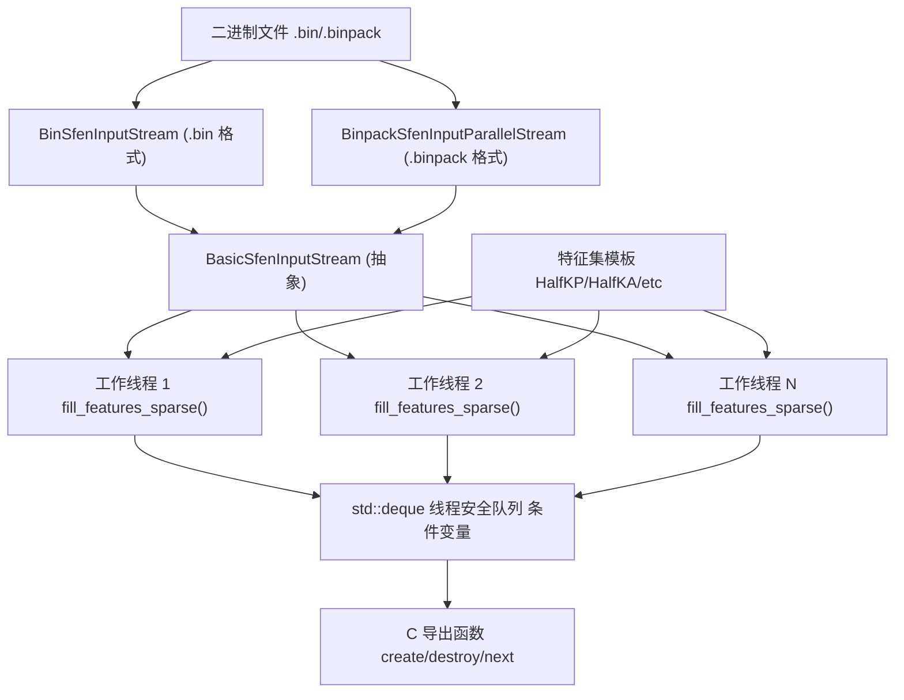
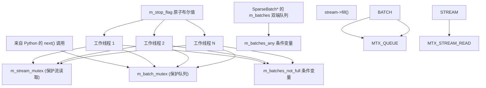
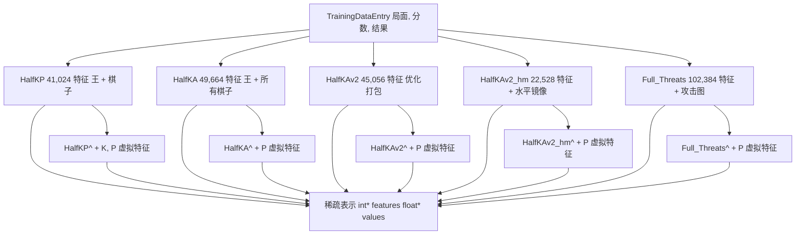
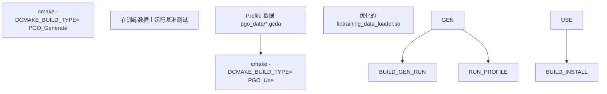
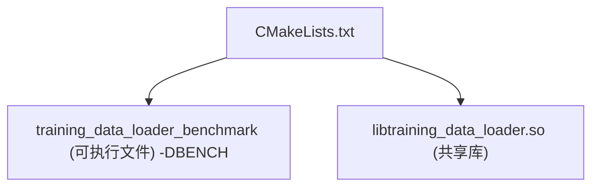

# C++ 数据加载器架构

-   [.pgo/small.binpack](https://github.com/Chesszyh/nnue-pytorch/blob/024b2064/.pgo/small.binpack)
-   [CMakeLists.txt](https://github.com/Chesszyh/nnue-pytorch/blob/024b2064/CMakeLists.txt)
-   [compile\_data\_loader.bat](https://github.com/Chesszyh/nnue-pytorch/blob/024b2064/compile_data_loader.bat)
-   [lib/nnue\_training\_data\_formats.h](https://github.com/Chesszyh/nnue-pytorch/blob/024b2064/lib/nnue_training_data_formats.h)
-   [lib/nnue\_training\_data\_stream.h](https://github.com/Chesszyh/nnue-pytorch/blob/024b2064/lib/nnue_training_data_stream.h)
-   [training\_data\_loader.cpp](https://github.com/Chesszyh/nnue-pytorch/blob/024b2064/training_data_loader.cpp)

## 目的与范围

本文档描述了原生的 C++ 数据加载器实现，该实现处理读取二进制训练数据文件并将国际象棋局面转换为稀疏特征表示这一性能关键任务。C++ 加载器被编译为共享库 (`libtraining_data_loader.so`) 并通过 ctypes 从 Python 访问。

有关此加载器的 Python 接口的信息，请参阅 [Python 数据接口](#3.3)。有关正在解析的二进制文件格式的详细信息，请参阅 [训练数据格式](#3.1)。有关过滤和跳过配置，请参阅 [数据过滤和跳过配置](#3.4)。

## 架构概览

C++ 数据加载器实现了一种多线程生产者-消费者架构，最大限度地提高了 I/O 和 CPU 利用率：


**关键设计原则：**

-   **关注点分离**：流读取、特征提取和批次构建是分开的层
-   **无锁读取**：每个工作线程在共享锁下从流中读取，最大限度地减少争用
-   **批处理**：工作线程生成完整的批次以分摊同步成本
-   **内存效率**：直接分配用于稀疏特征的平面数组，避免间接寻址

来源：[training\_data\_loader.cpp762-924](https://github.com/Chesszyh/nnue-pytorch/blob/024b2064/training_data_loader.cpp#L762-L924) [lib/nnue\_training\_data\_stream.h41-59](https://github.com/Chesszyh/nnue-pytorch/blob/024b2064/lib/nnue_training_data_stream.h#L41-L59)

## 流架构

流层将不同的二进制格式抽象为通用接口：


**流实现细节：**

| 流类型 | 文件格式 | 并行读取 | 压缩 | 用例 |
| --- | --- | --- | --- | --- |
| `BinSfenInputStream` | `.bin` | 否 | 无 | 遗留格式，单线程 |
| `BinpackSfenInputStream` | `.binpack` | 否 | LZ4 + Huffman | 小规模训练 |
| `BinpackSfenInputParallelStream` | `.binpack` | 是 | LZ4 + Huffman | 生产级训练（默认） |

并行流通过 `CompressedTrainingDataEntryParallelReader`（定义在 `lib/nnue_training_data_formats.h` 中）管理的多个解压缩线程分发文件读取。每个线程维护自己的解压缩上下文以避免锁争用。

**循环读取**：所有流都支持循环模式，即在到达 EOF 后自动从头重新打开文件，从而实现对有限数据集的无限迭代。这由 `cyclic` 构造函数参数控制。

**跳过谓词**：每个流都接受一个 `std::function<bool(const TrainingDataEntry&)>`，在读取期间过滤条目。这实现了高效的数据过滤，而无需将不需要的局面加载到内存中。

来源：[lib/nnue\_training\_data\_stream.h61-234](https://github.com/Chesszyh/nnue-pytorch/blob/024b2064/lib/nnue_training_data_stream.h#L61-L234) [lib/nnue\_training\_data\_stream.h236-255](https://github.com/Chesszyh/nnue-pytorch/blob/024b2064/lib/nnue_training_data_stream.h#L236-L255)

## 线程模型

`FeaturedBatchStream` 类实现了多线程批次生产系统：


**工作线程生命周期：**

每个工作线程执行以下循环（[training\_data\_loader.cpp826-859](https://github.com/Chesszyh/nnue-pytorch/blob/024b2064/training_data_loader.cpp#L826-L859)）：

1.  **读取条目**：获取 `m_stream_mutex`，调用 `stream->fill()` 读取 `m_batch_size` 个条目
2.  **提取特征**：释放流锁，为每个条目调用 `fill_features_sparse()`（CPU 密集型）
3.  **创建批次**：分配带有提取特征的 `SparseBatch` 对象
4.  **入队批次**：获取 `m_batch_mutex`，等待直到队列大小 < `m_concurrency + 1`，推送批次
5.  **信号消费者**：通知 `m_batches_any` 条件变量
6.  **重复**：继续直到流耗尽或停止标志被设置

**线程数配置：**

构造函数计算线程分配（[training\_data\_loader.cpp861-873](https://github.com/Chesszyh/nnue-pytorch/blob/024b2064/training_data_loader.cpp#L861-L873)）：

-   `num_feature_threads_per_reading_thread = 2`（常数比率）
-   读取线程：`max(1, concurrency / 2)`
-   特征线程：`max(1, concurrency - reading_threads)`

这种 2:1 的比率平衡了 I/O（读取/解压缩）与 CPU（特征提取）。

**同步保证：**

-   队列永远不会超过 `concurrency + 1` 个批次（防止内存溢出）
-   `next()` 阻塞直到批次可用或所有工作线程完成
-   析构函数设置停止标志并干净地合并所有线程

来源：[training\_data\_loader.cpp804-924](https://github.com/Chesszyh/nnue-pytorch/blob/024b2064/training_data_loader.cpp#L804-L924)

## 特征提取流水线

特征提取将国际象棋局面转换为表示激活特征的稀疏整数索引：

### 特征集实现


每个特征集实现：

-   `static constexpr int INPUTS` - 总特征数
-   `static constexpr int MAX_ACTIVE_FEATURES` - 每个局面的最大特征数（通常为 32）
-   `static std::pair<int, int> fill_features_sparse(entry, features, values, color)` - 提取函数

**示例：HalfKP 特征提取**（[training\_data\_loader.cpp76-96](https://github.com/Chesszyh/nnue-pytorch/blob/024b2064/training_data_loader.cpp#L76-L96)）：

```
// 对于每个棋子（不包括王）：
//   feature_index = 1 + oriented_square + piece_type_offset + king_square * NUM_PLANES
//   其中 piece_type_offset = piece_type * 2 + (piece_color != perspective_color)
```
该函数填充两个数组：

-   `features[]` - 特征空间的整数索引
-   `values[]` - 对于基础特征始终为 1.0f（因子化变体不同）

**坐标变换：**

不同的特征集使用不同的棋盘方向：

-   `orient()` - 黑方旋转 180°（[training\_data\_loader.cpp35-47](https://github.com/Chesszyh/nnue-pytorch/blob/024b2064/training_data_loader.cpp#L35-L47)）
-   `orient_flip()` - 仅垂直翻转（[training\_data\_loader.cpp49-58](https://github.com/Chesszyh/nnue-pytorch/blob/024b2064/training_data_loader.cpp#L49-L58)）
-   `orient_flip_2()` - 垂直翻转 + 基于王所在文件的水平镜像（[training\_data\_loader.cpp282-289](https://github.com/Chesszyh/nnue-pytorch/blob/024b2064/training_data_loader.cpp#L282-L289)）

**因子化特征：**

因子化变体（后缀 `^`）添加表示仅棋子信息的虚拟特征：

-   基础特征：王相关的局面
-   虚拟特征：王无关的棋子位置
-   虚拟特征的值编码基础特征的计数

通过提供独立于王位置的棋子信息，这加速了早期训练。虚拟特征在序列化期间被合并回基础特征（见 [权重合并和压缩](#5.3)）。

来源：[training\_data\_loader.cpp60-622](https://github.com/Chesszyh/nnue-pytorch/blob/024b2064/training_data_loader.cpp#L60-L622) [training\_data\_loader.cpp624-673](https://github.com/Chesszyh/nnue-pytorch/blob/024b2064/training_data_loader.cpp#L624-L673)

## 批次构建

`SparseBatch` 结构将多个训练条目聚合到单个内存分配中：


**构建过程**（[training\_data\_loader.cpp678-709](https://github.com/Chesszyh/nnue-pytorch/blob/024b2064/training_data_loader.cpp#L678-L709)）：

1.  **分配数组**：创建大小为 `batch_size * MAX_ACTIVE_FEATURES` 的平面数组
2.  **初始化为哨兵**：将所有特征索引设置为 `-1`（标记未使用的插槽）
3.  **填充条目**：对于每个局面，提取两个视角（白/黑）的特征
4.  **计算索引**：基于棋子数计算 PSQT 和层堆栈桶索引
5.  **返回批次**：通过指针将所有权转移给 Python

**内存布局：**

局面 `i` 的特征占据平面数组中的索引 `[i * MAX_ACTIVE_FEATURES, (i+1) * MAX_ACTIVE_FEATURES)`。未使用的插槽（当实际特征 < MAX\_ACTIVE\_FEATURES 时）包含 `-1` 哨兵值。

**双视角提取：**

每个局面生成来自白方和黑方视角的特征：

-   `white[]` - 白王视角的特征
-   `black[]` - 黑王视角的特征

这种双重提取使模型能够从任一侧进行评估，并支持 NNUE 架构的对称性要求。

**桶索引：**

两个桶系统划分特征/输出空间：

-   `psqt_indices[i] = (piece_count - 1) / 4` - 用于 PSQT（兵子价值表）值
-   `layer_stack_indices[i] = psqt_indices[i]` - 用于层堆栈选择

这使网络能够根据材料数量（残局与中局）专门化行为。

来源：[training\_data\_loader.cpp675-760](https://github.com/Chesszyh/nnue-pytorch/blob/024b2064/training_data_loader.cpp#L675-L760)

## C/Python 接口

加载器通过 ctypes 导出一个 C 兼容的 API 用于 Python 互操作：

### 导出宏

特定于平台的导出声明（[training\_data\_loader.cpp19-30](https://github.com/Chesszyh/nnue-pytorch/blob/024b2064/training_data_loader.cpp#L19-L30)）：

```
x86_64:  EXPORT = (empty), CDECL = (empty)
Windows: EXPORT = __declspec(dllexport), CDECL = __cdecl
Others:  EXPORT = (empty), CDECL = __attribute__((__cdecl__))
```
### 流管理函数

> **[Mermaid sequence]**
> *(图表结构无法解析)*

**主要 API 函数**（[training\_data\_loader.cpp1078-1180](https://github.com/Chesszyh/nnue-pytorch/blob/024b2064/training_data_loader.cpp#L1078-L1180)）：

| 函数 | 目的 | 返回 |
| --- | --- | --- |
| `create_sparse_batch_stream` | 使用特征集、文件、批次大小初始化流 | `AnyStream*` |
| `sparse_batch_stream_next` | 获取下一个批次（阻塞） | `SparseBatch*` |
| `destroy_sparse_batch` | 释放批次内存 | void |
| `destroy_sparse_batch_stream` | 关闭流并合并线程 | void |

**特征集选择：**

`create_sparse_batch_stream` 函数接受特征集名称字符串，并使用 `std::variant` 进行运行时分发，以实例化适当的模板特化（[training\_data\_loader.cpp661-673](https://github.com/Chesszyh/nnue-pytorch/blob/024b2064/training_data_loader.cpp#L661-L673) [training\_data\_loader.cpp1078-1180](https://github.com/Chesszyh/nnue-pytorch/blob/024b2064/training_data_loader.cpp#L1078-L1180)）。

**生命周期管理：**

-   **流**：由 `create_*` 创建，由 Python 拥有，由 `destroy_*` 销毁
-   **批次**：由工作线程创建，在 `next()` 后由 Python 拥有，由 `destroy_sparse_batch()` 销毁
-   析构函数确保在释放资源之前合并所有工作线程

**跳过谓词集成：**

C API 支持通过构建器模式配置跳过谓词：

-   `create_sparse_batch_stream_filtered` - 接受 `DataloaderSkipConfig*` 参数
-   跳过配置被转换为传递给流构造函数的 C++ lambda
-   过滤发生在流读取期间，特征提取之前

来源：[training\_data\_loader.cpp1078-1414](https://github.com/Chesszyh/nnue-pytorch/blob/024b2064/training_data_loader.cpp#L1078-L1414)

## 性能优化

### SIMD 和特定于架构的代码

**BMI2 支持检测**（[CMakeLists.txt24-60](https://github.com/Chesszyh/nnue-pytorch/blob/024b2064/CMakeLists.txt#L24-L60)）：

构建系统在编译时检测 CPU 能力：

-   检查 `/proc/cpuinfo` 中的 `bmi2` 标志
-   AMD CPU：需要 family ≥ 23 (Zen+)
-   Intel CPU：如果 `bmi2` 存在则启用
-   可用时定义 `HAS_BMI2` 宏

**BMI2 优化**（[lib/nnue\_training\_data\_formats.h274-310](https://github.com/Chesszyh/nnue-pytorch/blob/024b2064/lib/nnue_training_data_formats.h#L274-L310)）：

```
int nthSetBitIndex(uint64_t v, uint64_t n) {
#ifdef HAS_BMI2
    return intrin::msb(_pdep_u64(1ULL << n, v));
#else
    // Fallback implementation with byte-level lookup
#endif
}
```
`_pdep_u64` 内在函数加速了局面解析中使用的稀疏位板操作。这对于 `.binpack` 文件的解压缩性能至关重要。

### 配置文件引导优化 (PGO)

**两阶段构建过程**（[compile\_data\_loader.bat1-12](https://github.com/Chesszyh/nnue-pytorch/blob/024b2064/compile_data_loader.bat#L1-L12)）：


**CMake 配置**（[CMakeLists.txt13-17](https://github.com/Chesszyh/nnue-pytorch/blob/024b2064/CMakeLists.txt#L13-L17)）：

```
PGO_Generate: -fprofile-generate=${PGO_PROFILE_DATA_DIR}
PGO_Use:      -fprofile-use=${PGO_PROFILE_DATA_DIR} -fprofile-correction
```
配置文件引导构建：

1.  带插桩编译 (`-fprofile-generate`)
2.  在代表性数据上运行 `training_data_loader_benchmark`
3.  使用配置文件反馈重新编译 (`-fprofile-use`)

典型加速：数据加载路径提升 10-20%。

### 线程配置

**并发调优**（[training\_data\_loader.cpp811](https://github.com/Chesszyh/nnue-pytorch/blob/024b2064/training_data_loader.cpp#L811-L811)）：

`num_feature_threads_per_reading_thread = 2` 常数平衡了：

-   **I/O 密集型**：解压缩和文件读取
-   **CPU 密集型**：特征索引计算

对于具有 `N` 个核心的系统：

-   读取线程：`N / 2`（向上取整为最少 1 个）
-   特征线程：`N - reading_threads`

这假设对于典型的 `.binpack` 文件，特征提取比读取/解压缩慢大约 2 倍。

### 内存访问模式

**合并的特征排序：**

特征索引在提取期间进行排序，以确保在 PyTorch 中创建合并张量。当在稀疏矩阵构建期间按顺序访问特征时，缓存局部性显着提高。

对于 HalfKP：`features[j] = 1 + sq + p_idx * 64 + ksq * 641` 在按方格顺序迭代棋子时产生单调递增的索引。

来源：[CMakeLists.txt1-82](https://github.com/Chesszyh/nnue-pytorch/blob/024b2064/CMakeLists.txt#L1-L82) [training\_data\_loader.cpp811](https://github.com/Chesszyh/nnue-pytorch/blob/024b2064/training_data_loader.cpp#L811-L811) [lib/nnue\_training\_data\_formats.h274-310](https://github.com/Chesszyh/nnue-pytorch/blob/024b2064/lib/nnue_training_data_formats.h#L274-L310)

## 构建系统

### CMake 配置

**构建类型：**

| 类型 | 标志 | 目的 |
| --- | --- | --- |
| `Debug` | `-g` | 带有调试符号的开发 |
| `Release` | `-O3 -march=native -DNDEBUG` | 标准优化构建 |
| `RelWithDebInfo` | `-g -O3 -march=native -DNDEBUG` | 带优化的分析 |
| `PGO_Generate` | `-O3 -march=native -fprofile-generate` | PGO 插桩 |
| `PGO_Use` | `-g -O3 -march=native -fprofile-use` | PGO 优化的最终构建 |

**编译目标**（[CMakeLists.txt64-81](https://github.com/Chesszyh/nnue-pytorch/blob/024b2064/CMakeLists.txt#L64-L81)）：


**依赖项：**

-   `Threads::Threads` - 用于工作池的 POSIX 线程
-   需要 C++20 标准（特性：concepts, designated initializers）

**条件编译：**

同一源文件 (`training_data_loader.cpp`) 编译为：

-   **库**：导出用于 Python 的 C API 函数
-   **基准测试**：定义 `BENCH` 宏，构建用于分析的独立可执行文件

**安装：**

```
cmake --build ./build --target install
```
将 `libtraining_data_loader.so` 安装到项目根目录，Python 可以通过以下方式加载它：

```
ctypes.CDLL("./libtraining_data_loader.so")
```
来源：[CMakeLists.txt1-82](https://github.com/Chesszyh/nnue-pytorch/blob/024b2064/CMakeLists.txt#L1-L82)

---

## 总结

C++ 数据加载器通过以下方式为 NNUE 训练提供了高性能基础：

1.  **高效解析**：使用并行读取器对 `.binpack` 格式进行原生解压缩
2.  **多线程**：生产者-消费者架构最大限度地提高了 CPU/I/O 重叠
3.  **灵活特征**：基于模板的设计支持多种特征集
4.  **低开销**：直接内存分配和 C ABI 最小化了 Python 互操作成本
5.  **优化构建**：PGO 和特定于架构的 SIMD 提高了吞吐量

该加载器实现了比纯 Python 实现快约 10-100 倍的加速，使其成为大规模 NNUE 训练的无瓶颈基础。