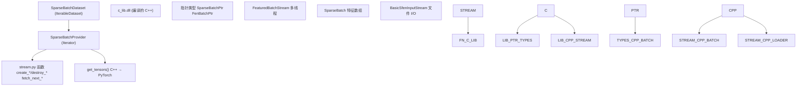
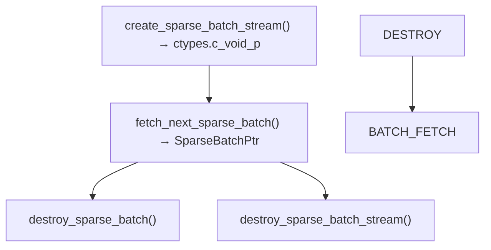
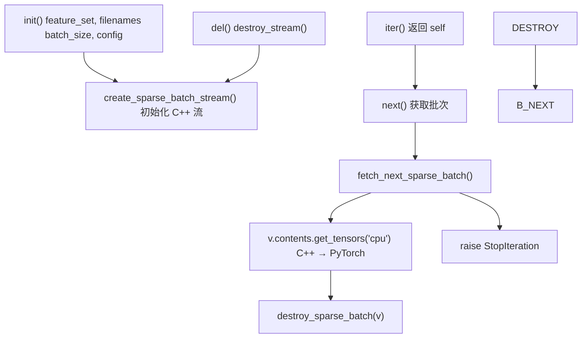
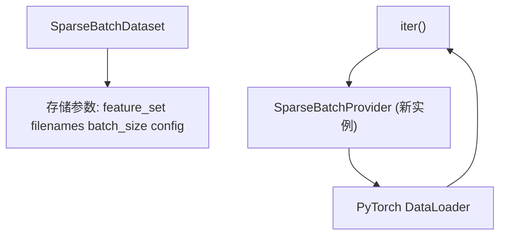
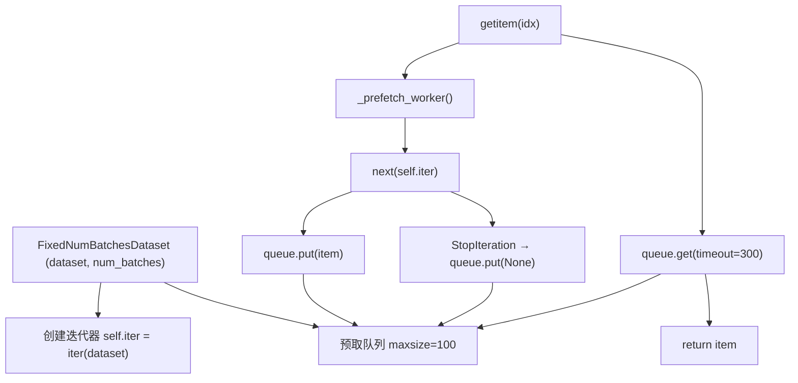

# Python 数据接口

-   [data\_loader/dataset.py](https://github.com/Chesszyh/nnue-pytorch/blob/024b2064/data_loader/dataset.py)
-   [data\_loader/stream.py](https://github.com/Chesszyh/nnue-pytorch/blob/024b2064/data_loader/stream.py)
-   [lib/nnue\_training\_data\_formats.h](https://github.com/Chesszyh/nnue-pytorch/blob/024b2064/lib/nnue_training_data_formats.h)
-   [lib/nnue\_training\_data\_stream.h](https://github.com/Chesszyh/nnue-pytorch/blob/024b2064/lib/nnue_training_data_stream.h)
-   [perf\_sigmoid\_fitter.py](https://github.com/Chesszyh/nnue-pytorch/blob/024b2064/perf_sigmoid_fitter.py)
-   [training\_data\_loader.cpp](https://github.com/Chesszyh/nnue-pytorch/blob/024b2064/training_data_loader.cpp)

## 目的与范围

Python 数据接口提供了对 [3.2](#3.2) 中描述的高性能 C++ 数据加载器的 Python 级访问。它通过基于 ctypes 的接口将原生的 C++ 流式实现与 PyTorch 的训练基础设施连接起来。该模块由迭代器协议、数据集包装器和流管理函数组成，将 C++ `SparseBatch` 对象作为 PyTorch 张量公开。

有关底层二进制格式的信息，请参阅 [3.1](#3.1)。有关数据过滤和跳过配置的详细信息，请参阅 [3.4](#3.4)。

## 架构概览

Python 数据接口使用分层架构，将流管理、迭代逻辑和 PyTorch 集成即分开：


**来源**: [data\_loader/dataset.py1-226](https://github.com/Chesszyh/nnue-pytorch/blob/024b2064/data_loader/dataset.py#L1-L226) [data\_loader/stream.py1-89](https://github.com/Chesszyh/nnue-pytorch/blob/024b2064/data_loader/stream.py#L1-L89)

该架构遵循提供者-消费者模式，其中：

-   **流函数** 通过 ctypes 管理 C++ 对象生命周期
-   **提供者类** 实现 Python 迭代器协议
-   **数据集类** 与 PyTorch 的 `DataLoader` 集成

## 流管理函数

[data\_loader/stream.py1-89](https://github.com/Chesszyh/nnue-pytorch/blob/024b2064/data_loader/stream.py#L1-L89) 模块提供了低级函数，用于通过 ctypes 与 C++ 流进行交互。这些函数处理对象创建、数据检索和清理。

### 流生命周期


**来源**: [data\_loader/stream.py42-88](https://github.com/Chesszyh/nnue-pytorch/blob/024b2064/data_loader/stream.py#L42-L88)

### 关键函数

| 函数 | 目的 | C++ 映射 |
| --- | --- | --- |
| `create_sparse_batch_stream()` | 初始化多线程批次流 | [training\_data\_loader.cpp1106-1148](https://github.com/Chesszyh/nnue-pytorch/blob/024b2064/training_data_loader.cpp#L1106-L1148) |
| `fetch_next_sparse_batch()` | 从流中检索下一个批次 | 返回 `SparseBatch*` 指针 |
| `destroy_sparse_batch()` | 释放批次内存 | 调用 C++ 析构函数 |
| `destroy_sparse_batch_stream()` | 关闭流和线程 | [training\_data\_loader.cpp1150-1154](https://github.com/Chesszyh/nnue-pytorch/blob/024b2064/training_data_loader.cpp#L1150-L1154) |
| `get_sparse_batch_from_fens()` | 从 FEN 字符串创建批次 | 用于测试/调试 |

**来源**: [data\_loader/stream.py42-88](https://github.com/Chesszyh/nnue-pytorch/blob/024b2064/data_loader/stream.py#L42-L88)

### 字符串数组转换

`_to_c_str_array()` 辅助函数 [data\_loader/stream.py7-10](https://github.com/Chesszyh/nnue-pytorch/blob/024b2064/data_loader/stream.py#L7-L10) 将 Python 字符串列表转换为 C 兼容的 `char**` 数组：

```
c_str_array = (ctypes.c_char_p * len(str_list))()
c_str_array[:] = [s.encode("utf-8") for s in str_list]
```
这用于将文件名列表传递给 C++ 构造函数。

**来源**: [data\_loader/stream.py7-10](https://github.com/Chesszyh/nnue-pytorch/blob/024b2064/data_loader/stream.py#L7-L10)

## 提供者类

提供者实现了 Python 的迭代器协议，以持续从 C++ 流中生成批次。它们管理流的生命周期并将 C++ 数据结构转换为 Python 张量。

### SparseBatchProvider

[data\_loader/dataset.py113-134](https://github.com/Chesszyh/nnue-pytorch/blob/024b2064/data_loader/dataset.py#L113-L134) 是训练数据的主要迭代器：


**来源**: [data\_loader/dataset.py113-134](https://github.com/Chesszyh/nnue-pytorch/blob/024b2064/data_loader/dataset.py#L113-L134)

`__next__()` 方法 [data\_loader/dataset.py99-107](https://github.com/Chesszyh/nnue-pytorch/blob/024b2064/data_loader/dataset.py#L99-L107)：

1.  调用 `fetch_next_sparse_batch()` 获取 `SparseBatchPtr`
2.  通过 `v.contents.get_tensors("cpu")` 提取张量
3.  销毁批次以释放 C++ 内存
4.  返回张量元组

这种设计确保了确定性的内存清理，同时保持了 Python 的迭代器语义。

### TrainingDataProvider

[data\_loader/dataset.py57-111](https://github.com/Chesszyh/nnue-pytorch/blob/024b2064/data_loader/dataset.py#L57-L111) 是一个泛化提供者模式的抽象基类。它通过流创建/销毁函数进行参数化，允许不同类型的批次（稀疏批次、FEN 批次）共享相同的迭代逻辑。

**来源**: [data\_loader/dataset.py57-111](https://github.com/Chesszyh/nnue-pytorch/blob/024b2064/data_loader/dataset.py#L57-L111)

### FenBatchProvider

[data\_loader/dataset.py11-54](https://github.com/Chesszyh/nnue-pytorch/blob/024b2064/data_loader/dataset.py#L11-L54) 提供 FEN 字符串而不是特征张量。用于调试或需要局面表示而不是神经网络特征的外部评估工具。

**来源**: [data\_loader/dataset.py11-54](https://github.com/Chesszyh/nnue-pytorch/blob/024b2064/data_loader/dataset.py#L11-L54)

## 数据集类

数据集类包装提供者以与 PyTorch 的训练基础设施集成。

### SparseBatchDataset

[data\_loader/dataset.py137-163](https://github.com/Chesszyh/nnue-pytorch/blob/024b2064/data_loader/dataset.py#L137-L163) 实现了 `torch.utils.data.IterableDataset` 以兼容 `DataLoader`：


**来源**: [data\_loader/dataset.py137-163](https://github.com/Chesszyh/nnue-pytorch/blob/024b2064/data_loader/dataset.py#L137-L163)

主要特征：

-   **工厂模式**：每次调用 `__iter__()` 创建一个新的 `SparseBatchProvider` 实例
-   **无状态**：数据集对象仅存储配置，不存储迭代状态
-   **工作线程安全**：多个 DataLoader 工作线程可以各自创建独立的迭代器

这与 `DataLoader(batch_size=None)` 一起使用，因为批处理在 C++ 中发生 [training\_data\_loader.cpp813-824](https://github.com/Chesszyh/nnue-pytorch/blob/024b2064/training_data_loader.cpp#L813-L824)

### FixedNumBatchesDataset

[data\_loader/dataset.py166-226](https://github.com/Chesszyh/nnue-pytorch/blob/024b2064/data_loader/dataset.py#L166-L226) 包装一个可迭代数据集以提供固定数量的批次。这对于验证至关重要，因为验证中的 epoch 必须具有一致的长度：


**来源**: [data\_loader/dataset.py166-226](https://github.com/Chesszyh/nnue-pytorch/blob/024b2064/data_loader/dataset.py#L166-L226)

#### 预取机制

数据集使用后台线程 [data\_loader/dataset.py179-191](https://github.com/Chesszyh/nnue-pytorch/blob/024b2064/data_loader/dataset.py#L179-L191) 来预取批次：

-   **延迟启动**：预取线程在第一次 `__getitem__()` 调用时启动 [data\_loader/dataset.py193-200](https://github.com/Chesszyh/nnue-pytorch/blob/024b2064/data_loader/dataset.py#L193-L200)
-   **队列大小**：100 个批次的缓冲区防止停顿 [data\_loader/dataset.py173](https://github.com/Chesszyh/nnue-pytorch/blob/024b2064/data_loader/dataset.py#L173-L173)
-   **超时**：300 秒超时检测数据加载卡死 [data\_loader/dataset.py209](https://github.com/Chesszyh/nnue-pytorch/blob/024b2064/data_loader/dataset.py#L209-L209)
-   **清理**：通过事件标志关闭线程 [data\_loader/dataset.py221-225](https://github.com/Chesszyh/nnue-pytorch/blob/024b2064/data_loader/dataset.py#L221-L225)

这是必要的，因为 PyTorch 的 `DataLoader` 需要 `__len__()` 和索引访问来进行验证集，但底层的 C++ 流是一个无限迭代器。

**来源**: [data\_loader/dataset.py173-226](https://github.com/Chesszyh/nnue-pytorch/blob/024b2064/data_loader/dataset.py#L173-L226)

## 数据流和内存管理

从 C++ 到 PyTorch 张量的完整数据流：

```mermaid
flowchart TD
    WORKER["工作线程"]
    ENTRIES["vector"]
    SPARSE["new SparseBatch(FeatureSet, entries)"]
    BATCH["SparseBatch 对象 white/black 数组 outcome/score 数组"]
    QUEUE_CPP["std::deque m_batches"]
    PTR["SparseBatchPtr (void* 包装器)"]
    CONTENTS["ptr.contents (SparseBatch 结构)"]
    GET_TENSORS["get_tensors('cpu')"]
    US["us: torch.Tensor (走棋方)"]
    THEM["them: torch.Tensor"]
    WHITE_IDX["white_indices: torch.Tensor (稀疏特征)"]
    WHITE_VAL["white_values: torch.Tensor"]
    BLACK_IDX["black_indices: torch.Tensor"]
    BLACK_VAL["black_values: torch.Tensor"]
    OUTCOME["outcome: torch.Tensor"]
    SCORE["score: torch.Tensor"]
    PSQT["psqt_indices: torch.Tensor"]
    LS["layer_stack_indices: torch.Tensor"]

    WORKER --> ENTRIES
    ENTRIES --> SPARSE
    SPARSE --> BATCH
    BATCH --> QUEUE_CPP
    QUEUE --> CPP_PTR
    PTR --> CONTENTS
    CONTENTS --> GET_TENSORS
    GET --> TENSORS_US
    GET --> TENSORS_THEM
    GET --> TENSORS_WHITE_IDX
    GET --> TENSORS_WHITE_VAL
    GET --> TENSORS_BLACK_IDX
    GET --> TENSORS_BLACK_VAL
    GET --> TENSORS_OUTCOME
    GET --> TENSORS_SCORE
    GET --> TENSORS_PSQT
    GET --> TENSORS_LS
    PTR --> BATCH
```


**来源**: [training\_data\_loader.cpp675-760](https://github.com/Chesszyh/nnue-pytorch/blob/024b2064/training_data_loader.cpp#L675-L760) [data\_loader/dataset.py99-107](https://github.com/Chesszyh/nnue-pytorch/blob/024b2064/data_loader/dataset.py#L99-L107)

### 内存所有权

该接口使用显式所有权转移：

1.  **C++ 分配**：工作线程中的 `new SparseBatch()` [training\_data\_loader.cpp843](https://github.com/Chesszyh/nnue-pytorch/blob/024b2064/training_data_loader.cpp#L843-L843)
2.  **Python 借用**：`get_tensors()` 创建 PyTorch 张量，从 C++ 数组 **复制** 数据
3.  **Python 释放 C++**：在提取张量后立即调用 `destroy_sparse_batch()` [data\_loader/dataset.py104](https://github.com/Chesszyh/nnue-pytorch/blob/024b2064/data_loader/dataset.py#L104-L104)

这避免了生命周期问题，因为 PyTorch 张量独立于 C++ 对象拥有其数据。

**来源**: [data\_loader/dataset.py99-107](https://github.com/Chesszyh/nnue-pytorch/blob/024b2064/data_loader/dataset.py#L99-L107)

## 张量格式

`get_tensors()` 方法返回 10 个张量的元组：

| 索引 | 名称 | 形状 | 类型 | 描述 |
| --- | --- | --- | --- | --- |
| 0 | `us` | `(batch_size,)` | float32 | 如果白方走棋为 1.0，黑方为 0.0 |
| 1 | `them` | `(batch_size,)` | float32 | `us` 的反转 |
| 2 | `white_indices` | `(batch_size, max_features)` | int32 | 白方的激活特征索引 |
| 3 | `white_values` | `(batch_size, max_features)` | float32 | 特征值（通常为 1.0，或因子化计数） |
| 4 | `black_indices` | `(batch_size, max_features)` | int32 | 黑方的激活特征索引 |
| 5 | `black_values` | `(batch_size, max_features)` | float32 | 特征值 |
| 6 | `outcome` | `(batch_size,)` | float32 | 游戏结果：0.0 (负), 0.5 (平), 1.0 (胜) |
| 7 | `score` | `(batch_size,)` | float32 | 厘兵单位的评估 |
| 8 | `psqt_indices` | `(batch_size,)` | int32 | PSQT 桶索引（棋子数 / 4） |
| 9 | `layer_stack_indices` | `(batch_size,)` | int32 | 层堆栈桶索引 |

填充值：

-   特征索引：`-1` 表示无特征（稀疏填充）[training\_data\_loader.cpp697-699](https://github.com/Chesszyh/nnue-pytorch/blob/024b2064/training_data_loader.cpp#L697-L699)
-   特征值：对于填充位置为 `0.0` [training\_data\_loader.cpp701-703](https://github.com/Chesszyh/nnue-pytorch/blob/024b2064/training_data_loader.cpp#L701-L703)

**来源**: [training\_data\_loader.cpp711-759](https://github.com/Chesszyh/nnue-pytorch/blob/024b2064/training_data_loader.cpp#L711-L759)

## 使用模式

### 基础训练循环

```
from data_loader import SparseBatchDataset, DataloaderSkipConfig

# 创建数据集
dataset = SparseBatchDataset(
    feature_set='HalfKAv2_hm^',
    filenames=['data/training.binpack'],
    batch_size=16384,
    cyclic=True,
    num_workers=4,
    config=DataloaderSkipConfig(filtered=True)
)

# 与 PyTorch DataLoader 一起使用（batch_size=None 因为批处理在 C++ 中）
loader = torch.utils.data.DataLoader(dataset, batch_size=None, num_workers=0)

for batch in loader:
    us, them, w_idx, w_val, b_idx, b_val, outcome, score, psqt, ls = batch
    # 使用稀疏特征的前向传播
```
**来源**: [data\_loader/dataset.py137-163](https://github.com/Chesszyh/nnue-pytorch/blob/024b2064/data_loader/dataset.py#L137-L163)

### 固定长度验证

```
from data_loader import SparseBatchDataset, FixedNumBatchesDataset

# 创建无限数据集
infinite_dataset = SparseBatchDataset(...)

# 包装用于固定长度验证
val_dataset = FixedNumBatchesDataset(infinite_dataset, num_batches=100)

# 现在具有 __len__() 用于进度条
val_loader = torch.utils.data.DataLoader(val_dataset, batch_size=None)
```
此模式在 [train.py](https://github.com/Chesszyh/nnue-pytorch/blob/024b2064/train.py) 中用于创建具有一致 epoch 长度的验证集，而训练集无限迭代。

**来源**: [data\_loader/dataset.py166-226](https://github.com/Chesszyh/nnue-pytorch/blob/024b2064/data_loader/dataset.py#L166-L226)

### 特征集选择

`feature_set` 参数 [data\_loader/dataset.py138-139](https://github.com/Chesszyh/nnue-pytorch/blob/024b2064/data_loader/dataset.py#L138-L139) 传递给 C++ [data\_loader/stream.py51](https://github.com/Chesszyh/nnue-pytorch/blob/024b2064/data_loader/stream.py#L51-L51)，在那里它与特征实现匹配 [training\_data\_loader.cpp661-673](https://github.com/Chesszyh/nnue-pytorch/blob/024b2064/training_data_loader.cpp#L661-L673) 可用选项包括：

-   `"HalfKP"`, `"HalfKP^"` (因子化)
-   `"HalfKA"`, `"HalfKA^"`
-   `"HalfKAv2"`, `"HalfKAv2^"`
-   `"HalfKAv2_hm"`, `"HalfKAv2_hm^"` (默认，半镜像王)
-   `"Full_Threats"`, `"Full_Threats^"`

有关详细的特征集文档，请参阅 [4.2](#4.2)。

**来源**: [data\_loader/dataset.py138-139](https://github.com/Chesszyh/nnue-pytorch/blob/024b2064/data_loader/dataset.py#L138-L139) [data\_loader/stream.py50-58](https://github.com/Chesszyh/nnue-pytorch/blob/024b2064/data_loader/stream.py#L50-L58) [training\_data\_loader.cpp661-673](https://github.com/Chesszyh/nnue-pytorch/blob/024b2064/training_data_loader.cpp#L661-L673)

## 线程安全

Python 接口专为多进程 PyTorch `DataLoader` 设计：

1.  **数据集对象** 被 pickle 并发送到工作进程
2.  每个工作进程调用 `__iter__()` 以创建自己的 `Provider` 实例
3.  每个 `Provider` 创建具有独立线程的单独 C++ 流 [training\_data\_loader.cpp813-874](https://github.com/Chesszyh/nnue-pytorch/blob/024b2064/training_data_loader.cpp#L813-L874)

这避免了进程之间的共享状态。但是，`DataLoader` 中的 `num_workers` 通常应为 `0` 或 `1`，因为 C++ 端已经使用了多线程（由提供者的 `num_workers` 参数控制）。

**来源**: [data\_loader/dataset.py137-163](https://github.com/Chesszyh/nnue-pytorch/blob/024b2064/data_loader/dataset.py#L137-L163) [training\_data\_loader.cpp813-874](https://github.com/Chesszyh/nnue-pytorch/blob/024b2064/training_data_loader.cpp#L813-L874)

## 错误处理

接口将错误从 C++ 传播到 Python：

-   **EOF 处理**：当流耗尽时，`fetch_next()` 返回 `None`，触发 `StopIteration` [data\_loader/dataset.py106-107](https://github.com/Chesszyh/nnue-pytorch/blob/024b2064/data_loader/dataset.py#L106-L107)
-   **超时**：如果预取停顿，`FixedNumBatchesDataset` 引发 `RuntimeError` [data\_loader/dataset.py219](https://github.com/Chesszyh/nnue-pytorch/blob/024b2064/data_loader/dataset.py#L219-L219)
-   **无效参数**：针对无效特征集或格式错误数据的 C++ 断言

**来源**: [data\_loader/dataset.py99-107](https://github.com/Chesszyh/nnue-pytorch/blob/024b2064/data_loader/dataset.py#L99-L107) [data\_loader/dataset.py208-219](https://github.com/Chesszyh/nnue-pytorch/blob/024b2064/data_loader/dataset.py#L208-L219)