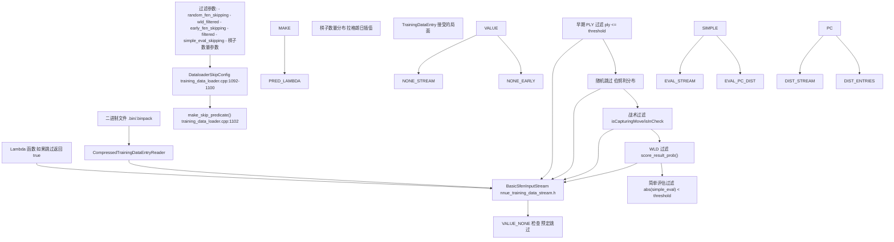
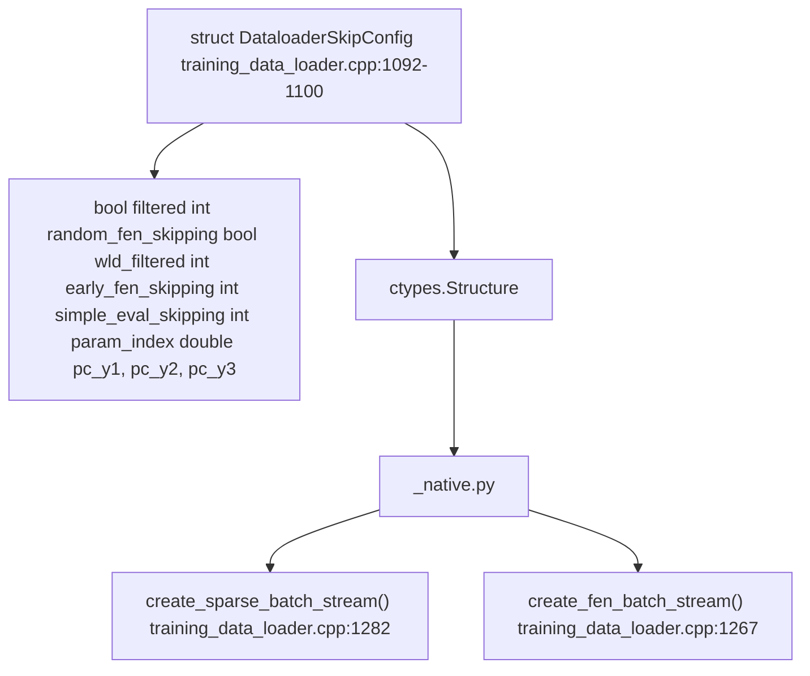
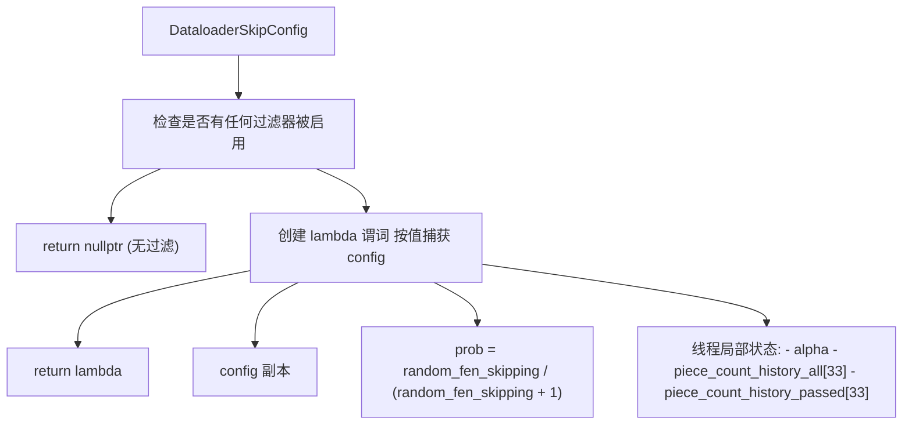
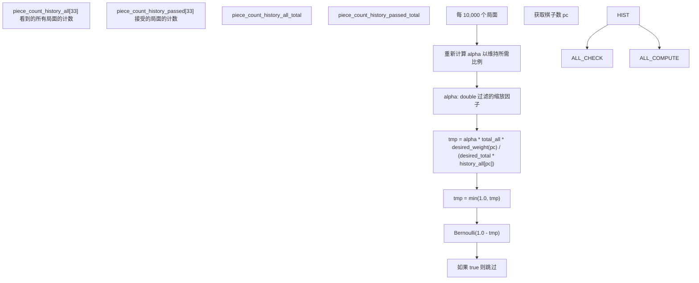

# 数据过滤和跳过配置

-   [lib/nnue_training_data_formats.h](https://github.com/Chesszyh/nnue-pytorch/blob/024b2064/lib/nnue_training_data_formats.h)
-   [lib/nnue_training_data_stream.h](https://github.com/Chesszyh/nnue-pytorch/blob/024b2064/lib/nnue_training_data_stream.h)
-   [training_data_loader.cpp](https://github.com/Chesszyh/nnue-pytorch/blob/024b2064/training_data_loader.cpp)

本页面记录了数据过滤系统，该系统控制哪些训练局面被加载，哪些在训练期间被跳过。该系统允许对训练数据进行选择性采样，通过过滤掉低质量的局面或平衡局面类型的分布，来提高训练质量和效率。

有关二进制训练数据格式本身的信息，请参阅 [训练数据格式](#3.1)。有关执行这些过滤器的 C++ 数据加载器架构，请参阅 [C++ 数据加载器架构](#3.2)。

## 概览

数据过滤系统提供了对哪些来自训练文件的局面被实际用于训练的细粒度控制。在数据加载期间，每个局面都会根据可配置的跳过谓词进行评估，该谓词可以基于多个标准拒绝局面。这使得：

-   **质量过滤**：移除可能具有扭曲评估的战术局面（吃子/将军）
-   **分布平衡**：控制棋子数量分布，防止偏向残局或中局
-   **效率**：跳过局面以减少有效数据集大小或平衡胜/平/负比例
-   **游戏阶段选择**：过滤可能是开局库着法的早期开局局面

过滤发生在 C++ 数据加载器中，在局面转换为特征向量之前，最大限度地减少了计算开销。

**系统架构概览：**


来源：[training_data_loader.cpp1092-1227](https://github.com/Chesszyh/nnue-pytorch/blob/024b2064/training_data_loader.cpp#L1092-L1227) [lib/nnue_training_data_stream.h41-59](https://github.com/Chesszyh/nnue-pytorch/blob/024b2064/lib/nnue_training_data_stream.h#L41-L59)

## DataloaderSkipConfig 结构

过滤配置由 `DataloaderSkipConfig` 结构体定义，该结构体通过 ctypes 从 Python 传递到 C++ 数据加载器。

**配置结构：**

| 字段 | 类型 | 目的 |
| --- | --- | --- |
| `filtered` | `bool` | 启用战术局面过滤（吃子/将军） |
| `random_fen_skipping` | `int` | 随机跳过率（N 表示以 N/(N+1) 的概率跳过） |
| `wld_filtered` | `bool` | 启用基于胜/平/负概率的过滤 |
| `early_fen_skipping` | `int` | 跳过 ply 计数 ≤ 此值的局面 |
| `simple_eval_skipping` | `int` | 跳过 `abs(simple_eval) < threshold` 的局面 |
| `param_index` | `int` | 参数索引（目前未使用） |
| `pc_y1`, `pc_y2`, `pc_y3` | `double` | 用于棋子数量分布的拉格朗日插值权重 |

**代码结构映射：**


来源：[training_data_loader.cpp1092-1100](https://github.com/Chesszyh/nnue-pytorch/blob/024b2064/training_data_loader.cpp#L1092-L1100) [training_data_loader.cpp1267-1277](https://github.com/Chesszyh/nnue-pytorch/blob/024b2064/training_data_loader.cpp#L1267-L1277) [training_data_loader.cpp1282-1308](https://github.com/Chesszyh/nnue-pytorch/blob/024b2064/training_data_loader.cpp#L1282-L1308)

## 跳过谓词构建

`make_skip_predicate()` 函数将 `DataloaderSkipConfig` 转换为可执行的过滤函数。如果所有过滤选项都被禁用，它返回 `nullptr` 以获得最大效率。否则，它返回一个评估每个 `TrainingDataEntry` 的 lambda 函数。

**谓词构建流程：**


来源：[training_data_loader.cpp1102-1227](https://github.com/Chesszyh/nnue-pytorch/blob/024b2064/training_data_loader.cpp#L1102-L1227)

谓词返回 `true` 表示 **跳过** 局面，返回 `false` 表示 **接受** 局面。在阅读代码时理解这种反转很重要。

## 过滤方法

### VALUE_NONE 过滤

`score == VALUE_NONE` (32002) 的局面总是被跳过。这允许在不从数据集中移除局面的情况下进行预定过滤，保持压缩效率。

```c++
static constexpr int VALUE_NONE = 32002;
if (e.score == VALUE_NONE)
    return true;  // skip
```
来源：[training_data_loader.cpp1112-1152](https://github.com/Chesszyh/nnue-pytorch/blob/024b2064/training_data_loader.cpp#L1112-L1152)

### 早期游戏过滤

基于 ply 计数过滤开局阶段的局面。这移除了可能是开局库着法以及不能代表真实对弈的早期局面。

```c++
if (e.ply <= config.early_fen_skipping)
    return true;  // skip
```
**配置示例：**

-   `early_fen_skipping = 5`：跳过前 5 个 plies 的局面

来源：[training_data_loader.cpp1154-1155](https://github.com/Chesszyh/nnue-pytorch/blob/024b2064/training_data_loader.cpp#L1154-L1155)

### 随机 FEN 跳过

随机拒绝局面的概率下采样。使用概率为 `N/(N+1)` 的伯努利分布。

```c++
auto do_skip = [&]() {
    std::bernoulli_distribution distrib(prob);
    auto& prng = rng::get_thread_local_rng();
    return distrib(prng);
};
if (config.random_fen_skipping && do_skip())
    return true;  // skip
```
**配置示例：**

-   `random_fen_skipping = 0`：无随机跳过
-   `random_fen_skipping = 3`：跳过 75% 的局面 (3/4)
-   `random_fen_skipping = 9`：跳过 90% 的局面 (9/10)

来源：[training_data_loader.cpp1142-1146](https://github.com/Chesszyh/nnue-pytorch/blob/024b2064/training_data_loader.cpp#L1142-L1146) [training_data_loader.cpp1157-1158](https://github.com/Chesszyh/nnue-pytorch/blob/024b2064/training_data_loader.cpp#L1157-L1158)

### 战术局面过滤

过滤走棋方被将军或上一着是吃子的局面。这些局面通常由于战术复杂性而具有扭曲的评估。

```c++
auto do_filter = [&]() {
     return (e.isCapturingMove() || e.isInCheck());
 };
if (config.filtered && do_filter())
    return true;  // skip
```
`isCapturingMove()` 和 `isInCheck()` 方法在二进制格式定义中的 `TrainingDataEntry` 上定义。

来源：[training_data_loader.cpp1148-1149](https://github.com/Chesszyh/nnue-pytorch/blob/024b2064/training_data_loader.cpp#L1148-L1149) [training_data_loader.cpp1160-1161](https://github.com/Chesszyh/nnue-pytorch/blob/024b2064/training_data_loader.cpp#L1160-L1161)

### WLD (胜/负/平) 过滤

基于静态评估分数与游戏结果之间的相关性过滤局面。分数与结果不匹配的局面被拒绝。这使用 `score_result_prob()` 来衡量评估与实际游戏结果之间的一致性。

```c++
auto do_wld_skip = [&]() {
    std::bernoulli_distribution distrib(1.0 - e.score_result_prob());
    auto& prng = rng::get_thread_local_rng();
    return distrib(prng);
};
if (config.wld_filtered && do_wld_skip())
    return true;  // skip
```
较高的 `score_result_prob()` 意味着局面评估与游戏结果吻合良好，使其更有可能被保留。

来源：[training_data_loader.cpp1136-1140](https://github.com/Chesszyh/nnue-pytorch/blob/024b2064/training_data_loader.cpp#L1136-L1140) [training_data_loader.cpp1163-1164](https://github.com/Chesszyh/nnue-pytorch/blob/024b2064/training_data_loader.cpp#L1163-L1164)

### 简单评估过滤

过滤静态评估（材料 + 简单位置因素）低于阈值的平静局面。这有助于将训练重点放在更复杂的局面上。

```c++
if (config.simple_eval_skipping > 0
    && std::abs(e.pos.simple_eval()) < config.simple_eval_skipping)
    return true;  // skip
```
来源：[training_data_loader.cpp1166-1168](https://github.com/Chesszyh/nnue-pytorch/blob/024b2064/training_data_loader.cpp#L1166-L1168)

## 棋子数量分布控制

最复杂的过滤器平衡训练数据中棋子数量的分布。如果没有这一点，数据集往往会偏向残局（棋子较少），因为游戏自然从开局发展到残局。

### 用于期望分布的拉格朗日插值

具有给定棋子数量的局面的期望相对频率由通过三个控制点的拉格朗日插值定义：

```c++
auto desired_piece_count_weights = [&config](int pc) -> double {
    double x  = pc;
    double x1 = 0,  y1 = config.pc_y1;
    double x2 = 16, y2 = config.pc_y2;
    double x3 = 32, y3 = config.pc_y3;
    
    double l1 = (x - x2) * (x - x3) / ((x1 - x2) * (x1 - x3));
    double l2 = (x - x1) * (x - x3) / ((x2 - x1) * (x2 - x3));
    double l3 = (x - x1) * (x - x2) / ((x3 - x1) * (x3 - x2));
    
    return l1 * y1 + l2 * y2 + l3 * y3;
};
```
**控制点：**

-   `(0, pc_y1)`：空棋盘（0 棋子）的权重
-   `(16, pc_y2)`：中局（16 棋子）的权重
-   `(32, pc_y3)`：初始局面（32 棋子）的权重

**配置示例：**

| 配置 | 效果 |
| --- | --- |
| `pc_y1=0.5, pc_y2=1.0, pc_y3=0.5` | 偏好中局局面 |
| `pc_y1=1.0, pc_y2=1.0, pc_y3=1.0` | 均匀分布 |
| `pc_y1=0.0, pc_y2=2.0, pc_y3=1.0` | 严重偏向中局，减少残局 |

来源：[training_data_loader.cpp1115-1124](https://github.com/Chesszyh/nnue-pytorch/blob/024b2064/training_data_loader.cpp#L1115-L1124)

### 自适应过滤算法

系统维护线程局部统计信息，并自适应地调整过滤概率以实现所需的分布：

**状态跟踪：**


**算法步骤：**

1.  **跟踪统计**：对于每个棋子数，维护看到和接受的局面计数
2.  **计算目标**：根据拉格朗日权重计算期望比例
3.  **自适应缩放**：每 10,000 个局面，重新计算 `alpha` 以保持跳过率有界
4.  **过滤决策**：根据当前与期望分布的概率接受局面

**最大跳过率：**

```c++
static constexpr double max_skipping_rate = 10.0;
```
这确保没有任何棋子数区间被过滤超过 90% 的拒绝率，防止完全消除任何棋子数范围。

来源：[training_data_loader.cpp1126-1222](https://github.com/Chesszyh/nnue-pytorch/blob/024b2064/training_data_loader.cpp#L1126-L1222)

### 实现细节

具有棋子数 `pc` 的局面的保留概率为：

```c++
probability_keep = min(1.0, alpha * N_total * weight(pc) / (W_total * N_pc))
```
其中：

-   `N_total`：处理的总局面数
-   `N_pc`：处理的具有棋子数 `pc` 的局面数
-   `weight(pc)`：来自拉格朗日插值的期望权重
-   `W_total`：所有拉格朗日权重的总和
-   `alpha`：自适应缩放因子

`alpha` 因子每 10,000 个局面重新计算一次，以确保在所有棋子数区间满足最大跳过率约束。

来源：[training_data_loader.cpp1211-1217](https://github.com/Chesszyh/nnue-pytorch/blob/024b2064/training_data_loader.cpp#L1211-L1217)

## 与数据流水线的集成

跳过谓词集成在流级别，在特征提取或批次创建之前。

**集成点：**

```mermaid
flowchart TD
    DATASET["SparseBatchDataset"]
    PROVIDER["SparseBatchProvider"]
    CREATE_STREAM["create_sparse_batch_stream() training_data_loader.cpp:1282"]
    CREATE_FEN["create_fen_batch_stream() training_data_loader.cpp:1267"]
    CONFIG_PARAM["DataloaderSkipConfig config"]
    MAKE_PRED["make_skip_predicate(config) training_data_loader.cpp:1102"]
    PREDICATE["std::function"]
    OPEN_PARALLEL["open_sfen_input_file_parallel() nnue_training_data_stream.h:246"]
    BINPACK_STREAM["BinpackSfenInputParallelStream"]
    BIN_STREAM["BinSfenInputStream"]
    READER["CompressedTrainingDataEntryParallelReader"]
    FILTER["应用 skipPredicate"]
    ENTRIES["TrainingDataEntry (已过滤)"]

    DATASET --> PROVIDER
    PROVIDER --> CREATE_STREAM
    PROVIDER --> CREATE_FEN
    CREATE --> STREAM_CONFIG_PARAM
    CREATE --> FEN_CONFIG_PARAM
    CONFIG --> PARAM_MAKE_PRED
    MAKE --> PRED_PREDICATE
    PREDICATE --> OPEN_PARALLEL
    OPEN --> PARALLEL_BINPACK_STREAM
    OPEN --> PARALLEL_BIN_STREAM
    BINPACK --> STREAM_READER
    BIN --> STREAM_READER
    READER --> FILTER
    FILTER --> ENTRIES
```


来源：[training_data_loader.cpp1267-1308](https://github.com/Chesszyh/nnue-pytorch/blob/024b2064/training_data_loader.cpp#L1267-L1308) [lib/nnue_training_data_stream.h246-255](https://github.com/Chesszyh/nnue-pytorch/blob/024b2064/lib/nnue_training_data_stream.h#L246-L255)

### 流类型和过滤

**BinSfenInputStream** (单线程)：

```c++
BinSfenInputStream(std::string filename, bool cyclic,
                   std::function<bool(const TrainingDataEntry&)> skipPredicate)
```
谓词在 `next()` 方法中应用：

```c++
if (!m_skipPredicate || !m_skipPredicate(entry))
    return entry;
```
**BinpackSfenInputParallelStream** (多线程)：

```c++
BinpackSfenInputParallelStream(int concurrency,
                               const std::vector<std::string>& filenames,
                               bool cyclic,
                               std::function<bool(const TrainingDataEntry&)> skipPredicate)
```
谓词传递给并行读取器，后者在解压缩期间应用它，将过滤工作分配给各个线程。

来源：[lib/nnue_training_data_stream.h61-121](https://github.com/Chesszyh/nnue-pytorch/blob/024b2064/lib/nnue_training_data_stream.h#L61-L121) [lib/nnue_training_data_stream.h183-234](https://github.com/Chesszyh/nnue-pytorch/blob/024b2064/lib/nnue_training_data_stream.h#L183-L234)

## 实践示例

### 典型训练配置

来自数据加载器中的基准测试代码：

```c++
const DataloaderSkipConfig config = {
    .filtered               = true,    // 跳过吃子/将军
    .random_fen_skipping    = 3,       // 保留 1/4 的局面
    .wld_filtered           = true,    // 启用 WLD 过滤
    .early_fen_skipping     = 5,       // 跳过前 5 个 plies
    .simple_eval_skipping   = 0,       // 无简单评估过滤
    .param_index            = 0,
    .pc_y1                  = 1.0,     // 棋子数量分布
    .pc_y2                  = 2.0,     // 偏好中局
    .pc_y3                  = 1.0
};
```
此配置：

-   移除战术局面
-   将数据集减少到原始大小的 25%
-   通过 WLD 相关性过滤
-   跳过开局库着法
-   相对于开局/残局，以 2:1 的比例偏好中局局面（16 个棋子）

来源：[training_data_loader.cpp1366-1374](https://github.com/Chesszyh/nnue-pytorch/blob/024b2064/training_data_loader.cpp#L1366-L1374)

### 无过滤配置

禁用所有过滤：

```c++
const DataloaderSkipConfig config = {
    .filtered               = false,
    .random_fen_skipping    = 0,
    .wld_filtered           = false,
    .early_fen_skipping     = 0,
    .simple_eval_skipping   = 0,
    .param_index            = 0,
    .pc_y1                  = 1.0,
    .pc_y2                  = 1.0,
    .pc_y3                  = 1.0
};
```
这将从 `make_skip_predicate()` 返回 `nullptr`，绕过所有过滤开销。

来源：[training_data_loader.cpp1102-1227](https://github.com/Chesszyh/nnue-pytorch/blob/024b2064/training_data_loader.cpp#L1102-L1227)

## 性能考量

### 线程局部状态

每个过滤线程维护其自己的统计信息 (`piece_count_history_all`, `piece_count_history_passed`, `alpha`)。这避免了同步开销，但意味着棋子数量分布是按线程平衡的，而不是全局平衡的。对于多线程读取器，这是可以接受的，因为每个线程处理大量的局面。

### 过滤开销

过滤发生在二进制反序列化期间，在昂贵的特征提取步骤之前。被拒绝的局面永远不会转换为稀疏特征向量，从而节省大量计算。谓词评估主要由以下因素决定：

1.  棋子数量计算：O(1) 使用 `piecesBB().count()`
2.  随机数生成：快速线程局部 PRNG
3.  统计更新：简单的数组索引

来源：[training_data_loader.cpp1126-1220](https://github.com/Chesszyh/nnue-pytorch/blob/024b2064/training_data_loader.cpp#L1126-L1220)

### 调试输出

可以启用调试打印以监控过滤行为：

```c++
constexpr bool do_debug_print = false;
if (do_debug_print) {
    if (uint64_t(piece_count_history_all_total) % 10000 == 0) {
        std::cout << "Total  : " << piece_count_history_all_total << '\n';
        std::cout << "Passed: " << piece_count_history_passed_total << '\n';
        for (int i = 0; i < 33; ++i)
            std::cout << i << ' ' << piece_count_history_passed[i] << '\n';
    }
}
```
这每 10,000 个局面显示每个棋子数量的接受率。

来源：[training_data_loader.cpp1170-1180](https://github.com/Chesszyh/nnue-pytorch/blob/024b2064/training_data_loader.cpp#L1170-L1180)
