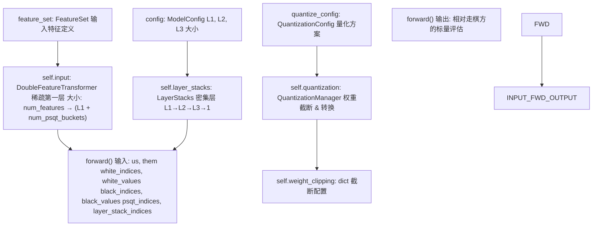
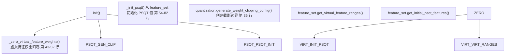
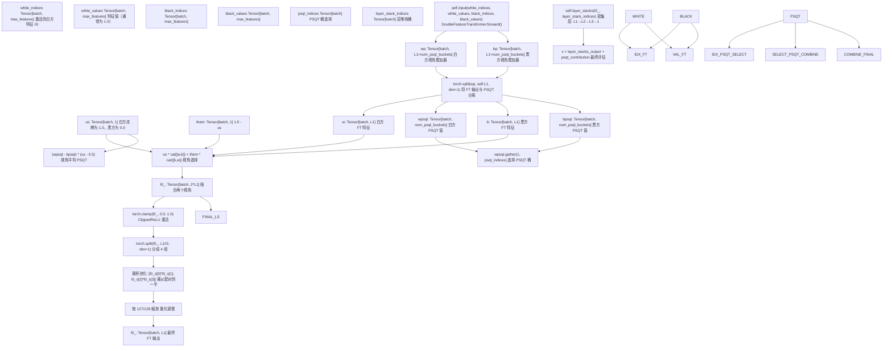
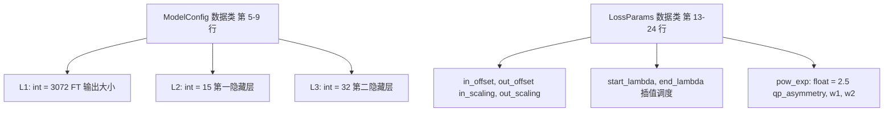
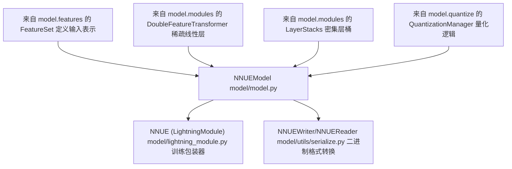
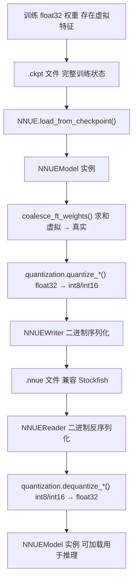
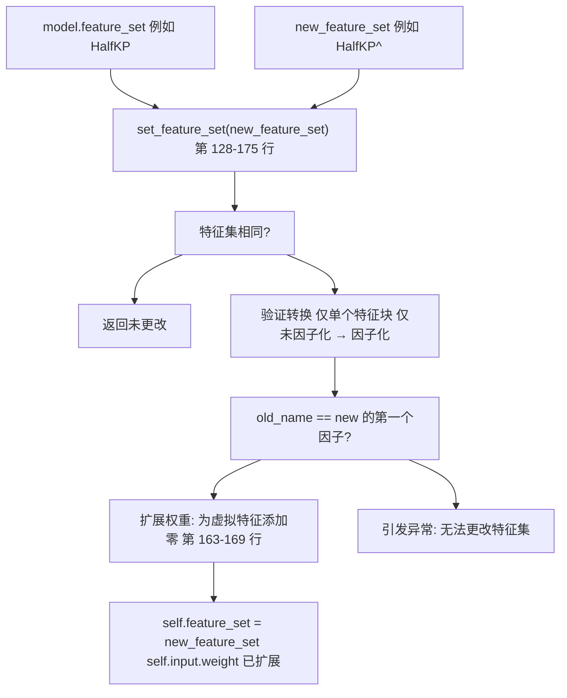

# 模型架构

-   [data\_loader/\_\_init\_\_.py](https://github.com/Chesszyh/nnue-pytorch/blob/024b2064/data_loader/__init__.py)
-   [data\_loader/\_native.py](https://github.com/Chesszyh/nnue-pytorch/blob/024b2064/data_loader/_native.py)
-   [data\_loader/config.py](https://github.com/Chesszyh/nnue-pytorch/blob/024b2064/data_loader/config.py)
-   [docs/img/SFNNv4\_architecture.drawio](https://github.com/Chesszyh/nnue-pytorch/blob/024b2064/docs/img/SFNNv4_architecture.drawio)
-   [docs/nnue.md](https://github.com/Chesszyh/nnue-pytorch/blob/024b2064/docs/nnue.md)
-   [model/config.py](https://github.com/Chesszyh/nnue-pytorch/blob/024b2064/model/config.py)
-   [model/lightning\_module.py](https://github.com/Chesszyh/nnue-pytorch/blob/024b2064/model/lightning_module.py)
-   [model/model.py](https://github.com/Chesszyh/nnue-pytorch/blob/024b2064/model/model.py)
-   [model/utils/coalesce\_weights.py](https://github.com/Chesszyh/nnue-pytorch/blob/024b2064/model/utils/coalesce_weights.py)
-   [model/utils/serialize.py](https://github.com/Chesszyh/nnue-pytorch/blob/024b2064/model/utils/serialize.py)

本页面提供了 `NNUEModel` 架构的综合文档，解释了各个组件如何组合在一起以创建一个高效评估的国际象棋局面评估器。它在高层次上涵盖了整体模型结构、数据流和组件交互。

有关特定子系统的详细信息，请参阅：

-   网络层结构和计算流：[NNUE 网络结构](#4.1)
-   特征工程和输入表示：[特征集](#4.2)
-   第一层稀疏计算：[特征变换器](#4.3)
-   密集层架构：[层堆栈和密集层](#4.4)
-   整数量化方案：[量化系统](#4.5)
-   通过因子化加速训练：[虚拟特征和因子化](#4.6)

## NNUE 设计原则

NNUE (ƎUИИ - Efficiently Updatable Neural Network) 是一种针对国际象棋局面评估进行优化的神经网络架构，其运作基于三个核心原则：

1.  **稀疏输入**：网络保持相对较低数量的非零输入（对于大型网络通常约为 0.1% 的稀疏度），在保持性能的同时允许巨大的第一层。

2.  **增量更新**：输入特征在局面之间变化极小，允许高效的累加器更新而不是完全重新计算。

3.  **整数量化**：网络设计用于低精度整数推理 (int8/int16)，通过 SIMD 操作实现最大的 CPU 性能。

这些原则使 NNUE 网络能够实现每个线程每秒数百万次的评估，这对国际象棋引擎的搜索性能至关重要。

**来源：** [docs/nnue.md144-164](https://github.com/Chesszyh/nnue-pytorch/blob/024b2064/docs/nnue.md#L144-L164)

## NNUEModel 类结构

[model/model.py10-209](https://github.com/Chesszyh/nnue-pytorch/blob/024b2064/model/model.py#L10-L209) 中的 `NNUEModel` 类作为主要的神经网络实现。它编排所有模型组件并定义完整的前向传播计算。

**关键组件：**

| 组件 | 类型 | 目的 | 大小/配置 |
| --- | --- | --- | --- |
| `self.input` | `DoubleFeatureTransformer` | 带有稀疏输入的第一层，处理两个视角 | `num_features → (L1 + num_psqt_buckets)` |
| `self.feature_set` | `FeatureSet` | 定义输入特征表示 | 通常是 HalfKAv2\_hm: ~45K 特征 |
| `self.layer_stacks` | `LayerStacks` | 特征变换器后的密集层 | L1→L2→L3→1 带分桶 |
| `self.quantization` | `QuantizationManager` | 管理量化方案 | FT 为 int16，FC 层为 int8 |
| `self.num_psqt_buckets` | `int` | PSQT 输出桶的数量 | 默认：8 |
| `self.num_ls_buckets` | `int` | 层堆栈桶的数量 | 默认：8 |

**来源：** [model/model.py10-38](https://github.com/Chesszyh/nnue-pytorch/blob/024b2064/model/model.py#L10-L38) [model/config.py1-25](https://github.com/Chesszyh/nnue-pytorch/blob/024b2064/model/config.py#L1-L25)

## 模型初始化和权重设置

模型执行专门的初始化以支持 NNUE 训练要求：

**虚拟特征初始化：** 虚拟特征在训练期间用于加速学习相关的真实特征。模型在初始化时将其权重归零 [model/model.py43-52](https://github.com/Chesszyh/nnue-pytorch/blob/024b2064/model/model.py#L43-L52)，因为它们仅作为训练辅助，将在序列化期间合并回真实特征中（见 [虚拟特征和因子化](#4.6)）。

**PSQT 初始化：** PSQT（兵子价值表）输出使用来自特征集的传统国际象棋兵子价值进行初始化 [model/model.py54-82](https://github.com/Chesszyh/nnue-pytorch/blob/024b2064/model/model.py#L54-L82)。这些值按 `1 / quantization.nnue2score` 缩放以匹配网络的输出比例。偏置设为零，因为它在视角平均期间被抵消。

**来源：** [model/model.py39-82](https://github.com/Chesszyh/nnue-pytorch/blob/024b2064/model/model.py#L39-L82)

## 前向传播数据流

前向传播通过多阶段流水线将稀疏特征索引转换为最终评估分数：

**前向传播实现：** [model/model.py177-208](https://github.com/Chesszyh/nnue-pytorch/blob/024b2064/model/model.py#L177-L208)

**关键阶段：**

1.  **特征变换器** [第 188 行](https://github.com/Chesszyh/nnue-pytorch/blob/024b2064/line 188)：通过 `DoubleFeatureTransformer` 处理稀疏索引，产生两个视角累加器。

2.  **分离与视角组合** [第 189-192 行](https://github.com/Chesszyh/nnue-pytorch/blob/024b2064/lines 189-192)：将特征变换器输出与 PSQT 值分离，然后根据走棋方组合视角。公式 `us * cat([w,b]) + them * cat([b,w])` 在白方走棋时首先选择白方视角，黑方走棋时首先选择黑方视角。

3.  **乘积池化** [第 194-198 行](https://github.com/Chesszyh/nnue-pytorch/blob/024b2064/lines 194-198)：将 L1 神经元分成 4 组，并对配对进行逐元素乘法，在增加非线性的同时降低维度。`127/128` 缩放补偿了量化，其中 `1.0` 表示为 `127`。

4.  **层堆栈** [第 206 行](https://github.com/Chesszyh/nnue-pytorch/blob/024b2064/line 206)：密集层通过分桶层堆栈处理池化后的特征（见 [层堆栈和密集层](#4.4)）。

5.  **PSQT 集成** [第 200-206 行](https://github.com/Chesszyh/nnue-pytorch/blob/024b2064/lines 200-206)：PSQT 值按局面特征分桶，通过 `psqt_indices` 选择，并使用公式 `(wpsqt - bpsqt) * (us - 0.5)` 对视角进行平均。

**来源：** [model/model.py177-208](https://github.com/Chesszyh/nnue-pytorch/blob/024b2064/model/model.py#L177-L208) [docs/nnue.md525-559](https://github.com/Chesszyh/nnue-pytorch/blob/024b2064/docs/nnue.md#L525-L559)

## 用于量化兼容性的权重截断

模型在训练期间维持与目标量化方案兼容的权重边界：

```mermaid
flowchart TD
    WC_GEN["quantization.generate_weight_clipping_config(model) 创建截断配置 返回参数组列表"]
    WC_STORE["self.weight_clipping List[dict] 每个 dict 包含 params, min_weight, max_weight"]
    WC_CALL["clip_weights() 由 WeightClippingCallback 调用 每次优化器步骤后"]
    WC_ITER["对于 weight_clipping 中的每组:"]
    WC_PARAMS["对于 group['params'] 中的每个参数:"]
    WC_CHECK["检查 'virtual_params' 因子化特征的特殊处理"]
    WC_CLAMP["p.data.clamp_(min_weight, max_weight) 就地截断"]
    VIRTUAL["虚拟特征处理: 通过减去虚拟层值调整边界 第 96-111 行"]
    THREAT["Full_Threats 特征集: clip_threat_weights() 威胁特征的 int8 范围 第 119-126 行"]

    WC --> GEN_WC_STORE
    WC --> CALL_WC_ITER
    WC --> ITER_WC_PARAMS
    WC --> PARAMS_WC_CHECK
    WC --> CHECK_WC_CLAMP
    WC --> CHECK_VIRTUAL
```

`clip_weights()` 方法 [model/model.py84-117](https://github.com/Chesszyh/nnue-pytorch/blob/024b2064/model/model.py#L84-L117) 确保所有权重保持在量化兼容范围内。例如：

-   特征变换器权重：对于 int16 量化，范围为 `-127/255` 到 `127/255`
-   全连接层权重：int8 兼容范围

虚拟特征需要特殊处理 [第 96-111 行](https://github.com/Chesszyh/nnue-pytorch/blob/024b2064/lines 96-111)，通过减去虚拟参数张量来调整边界，以考虑其合并后的贡献。

**来源：** [model/model.py84-127](https://github.com/Chesszyh/nnue-pytorch/blob/024b2064/model/model.py#L84-L127)

## 模型配置类

**ModelConfig** [model/config.py5-9](https://github.com/Chesszyh/nnue-pytorch/blob/024b2064/model/config.py#L5-L9) 定义网络层大小：

-   `L1`：特征变换器输出大小（默认 3072），决定累加器的大小和第一稀疏层的神经元数量
-   `L2`：第一密集隐藏层大小（默认 15）
-   `L3`：第二密集隐藏层大小（默认 32）
-   输出层大小始终为 1（标量评估）

**LossParams** [model/config.py13-24](https://github.com/Chesszyh/nnue-pytorch/blob/024b2064/model/config.py#L13-L24) 控制损失函数计算（详见 [损失函数和训练配置](#2.3)）。

**来源：** [model/config.py1-25](https://github.com/Chesszyh/nnue-pytorch/blob/024b2064/model/config.py#L1-L25)

## 组件关系

**NNUEModel** 作为中央集成点：

-   **特征集** [model/features](https://github.com/Chesszyh/nnue-pytorch/blob/024b2064/model/features)：提供 `num_features`, `hash`, `get_virtual_feature_ranges()`, `get_initial_psqt_features()` 和特征索引生成逻辑
-   **DoubleFeatureTransformer** [model/modules](https://github.com/Chesszyh/nnue-pytorch/blob/024b2064/model/modules)：实现带有自定义 CUDA 内核的稀疏第一层，用于高效的稀疏矩阵运算
-   **LayerStacks** [model/modules](https://github.com/Chesszyh/nnue-pytorch/blob/024b2064/model/modules)：管理带有因子化线性变换的分桶密集层
-   **QuantizationManager** [model/quantize](https://github.com/Chesszyh/nnue-pytorch/blob/024b2064/model/quantize)：转换 float32 权重为 int8/int16，并提供 `nnue2score` 缩放常数

该模型被以下组件包装：

-   **NNUE (Lightning 模块)** [model/lightning\_module.py16-162](https://github.com/Chesszyh/nnue-pytorch/blob/024b2064/model/lightning_module.py#L16-L162)：添加训练循环、优化器配置和损失计算
-   **NNUEWriter/NNUEReader** [model/utils/serialize.py69-360](https://github.com/Chesszyh/nnue-pytorch/blob/024b2064/model/utils/serialize.py#L69-L360)：序列化为/自二进制 `.nnue` 格式，用于 Stockfish 部署

**来源：** [model/model.py1-8](https://github.com/Chesszyh/nnue-pytorch/blob/024b2064/model/model.py#L1-L8) [model/lightning\_module.py1-14](https://github.com/Chesszyh/nnue-pytorch/blob/024b2064/model/lightning_module.py#L1-L14) [model/utils/serialize.py1-18](https://github.com/Chesszyh/nnue-pytorch/blob/024b2064/model/utils/serialize.py#L1-L18)

## 特征集集成

```mermaid
flowchart TD
    NUM["feature_set.num_features 用于输入层大小"]
    HASH["feature_set.hash 用于 .nnue 文件头"]
    VIRT_RANGES["feature_set.get_virtual_feature_ranges() 返回 [(start, end), ...] 用于归零虚拟权重"]
    PSQT_INIT["feature_set.get_initial_psqt_features() 返回浮点数列表 传统 PSQ 值"]
    NUM_REAL["feature_set.num_real_features 在权重合并期间使用"]
    V2R["feature_set.get_virtual_to_real_features_gather_indices() 用于合并的映射"]
    INIT["init() 创建带有 num_features 的 DoubleFeatureTransformer"]
    ZERO["_zero_virtual_feature_weights() 使用 get_virtual_feature_ranges()"]
    INIT_PSQT["_init_psqt() 使用 get_initial_psqt_features()"]
    COALESCE["coalesce_ft_weights() model/utils/coalesce_weights.py 使用 num_real_features 和映射"]

    NUM --> INIT
    VIRT --> RANGES_ZERO
    PSQT --> INIT_INIT_PSQT
    NUM --> REAL_COALESCE
    V2R --> COALESCE
```

特征集抽象允许模型使用不同的输入表示（HalfKP, HalfKA, HalfKAv2\_hm 等），而无需更改核心模型代码。有关可用的特征块及其特性，请参阅 [特征集](#4.2)。

**来源：** [model/model.py28-52](https://github.com/Chesszyh/nnue-pytorch/blob/024b2064/model/model.py#L28-L52) [model/utils/coalesce\_weights.py7-19](https://github.com/Chesszyh/nnue-pytorch/blob/024b2064/model/utils/coalesce_weights.py#L7-L19)

## 模型持久化和转换

模型支持多种序列化格式：

| 格式 | 类型 | 目的 | 工具 |
| --- | --- | --- | --- |
| `.ckpt` | PyTorch Lightning 检查点 | 训练状态，全 float32 | 训练期间自动 |
| `.pt` | PyTorch 状态字典 | 仅模型权重，float32 | `serialize.py` 转换 |
| `.nnue` | 二进制量化格式 | Stockfish 部署，int8/int16 | `serialize.py` 转换 |

**权重合并：** 虚拟特征必须在序列化之前合并 [model/utils/coalesce\_weights.py7-19](https://github.com/Chesszyh/nnue-pytorch/blob/024b2064/model/utils/coalesce_weights.py#L7-L19)。`coalesce_ft_weights()` 函数使用来自 `feature_set.get_virtual_to_real_features_gather_indices()` 的映射，将虚拟特征权重求和回它们对应的真实特征中。

**量化：** `QuantizationManager` [model/quantize](https://github.com/Chesszyh/nnue-pytorch/blob/024b2064/model/quantize) 在 float32 训练权重和 int8/int16 推理权重之间进行转换，同时保持精度。详情请参阅 [量化系统](#4.5)。

**二进制格式：** `NNUEWriter` [model/utils/serialize.py69-217](https://github.com/Chesszyh/nnue-pytorch/blob/024b2064/model/utils/serialize.py#L69-L217) 写入二进制 `.nnue` 格式，包含版本头、特征变换器权重 (int16) 和全连接层权重 (int8)。可选的 LEB128 压缩可减小文件大小。格式规范见 [NNUE 二进制格式](#5.2)。

**来源：** [model/utils/serialize.py69-360](https://github.com/Chesszyh/nnue-pytorch/blob/024b2064/model/utils/serialize.py#L69-L360) [model/utils/coalesce\_weights.py7-33](https://github.com/Chesszyh/nnue-pytorch/blob/024b2064/model/utils/coalesce_weights.py#L7-L33)

## 动态特征集转换

模型支持特征集之间有限的运行时转换：

`set_feature_set()` 方法 [model/model.py128-175](https://github.com/Chesszyh/nnue-pytorch/blob/024b2064/model/model.py#L128-L175) 允许通过对虚拟特征的权重矩阵进行零填充，从非因子化特征集（例如 `HalfKP`）转换为其因子化版本（例如 `HalfKP^`）。这使得：

1.  最初使用基础特征集进行训练
2.  在训练中途切换到因子化特征以加速

由于更通用的转换实现复杂性较高，该方法仅支持这种特定的转换模式。

**来源：** [model/model.py128-175](https://github.com/Chesszyh/nnue-pytorch/blob/024b2064/model/model.py#L128-L175)

## 总结

`NNUEModel` 类提供了一个完整的 NNUE 国际象棋评估网络，具有：

-   **稀疏输入处理**：`DoubleFeatureTransformer` 高效处理约 0.1% 的稀疏输入
-   **双视角架构**：为白方和黑方视角提供单独的累加器
-   **乘积池化**：特征变换器后的非线性降维
-   **分桶层堆栈**：通过 PSQT 和层堆栈分桶实现位置自适应密集层
-   **量化集成**：用于 int8/int16 部署的权重截断和缩放
-   **虚拟特征支持**：因子化加速了相关特征的训练
-   **灵活序列化**：支持用于训练、推理和部署的多种格式

该架构平衡了准确性和推理速度，实现了每秒数百万次的评估，同时保持了强大的棋力。模块化设计将关注点分离到特征集、层实现和量化逻辑中。

**来源：** [model/model.py1-209](https://github.com/Chesszyh/nnue-pytorch/blob/024b2064/model/model.py#L1-L209) [docs/nnue.md144-347](https://github.com/Chesszyh/nnue-pytorch/blob/024b2064/docs/nnue.md#L144-L347)