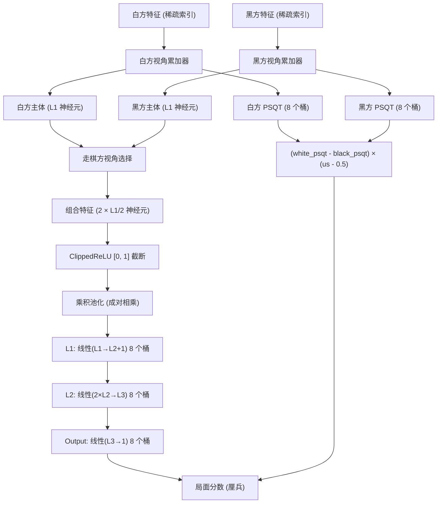
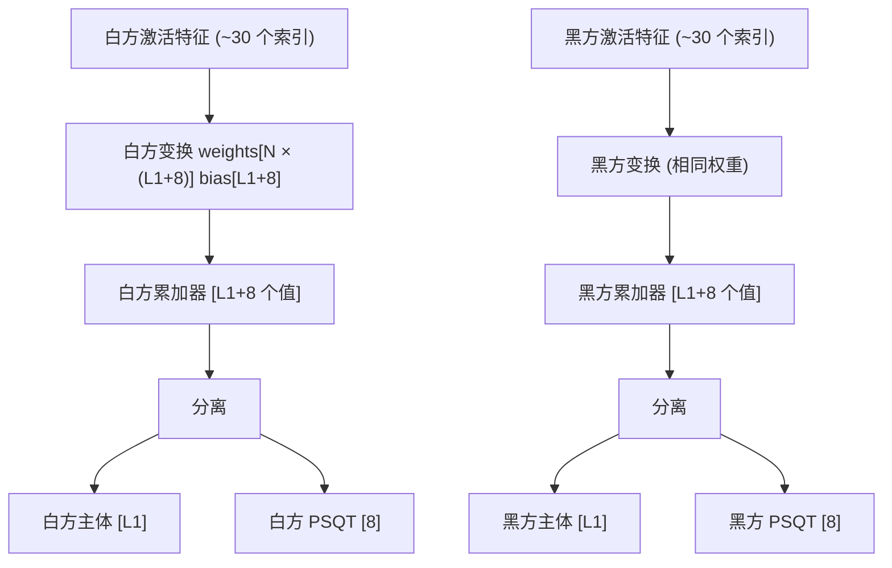
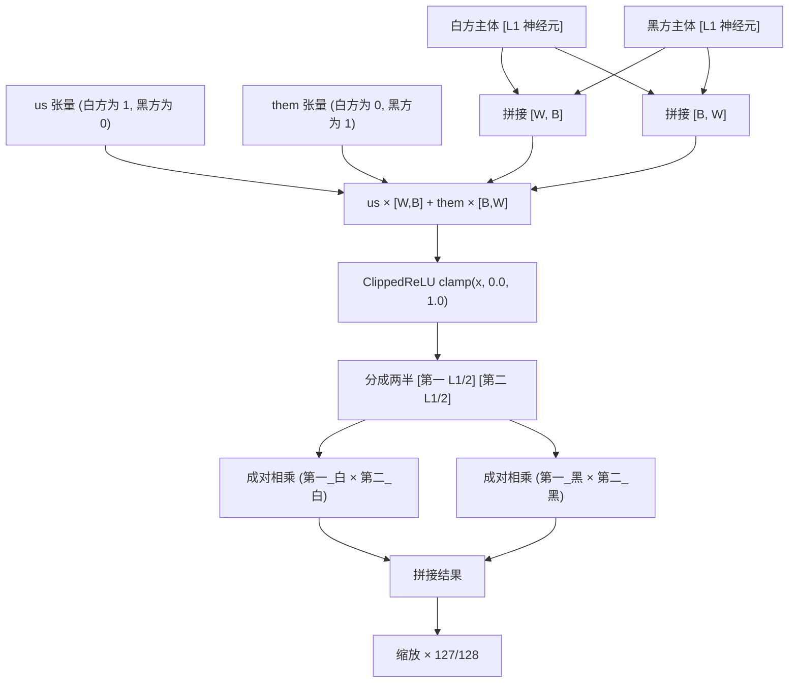
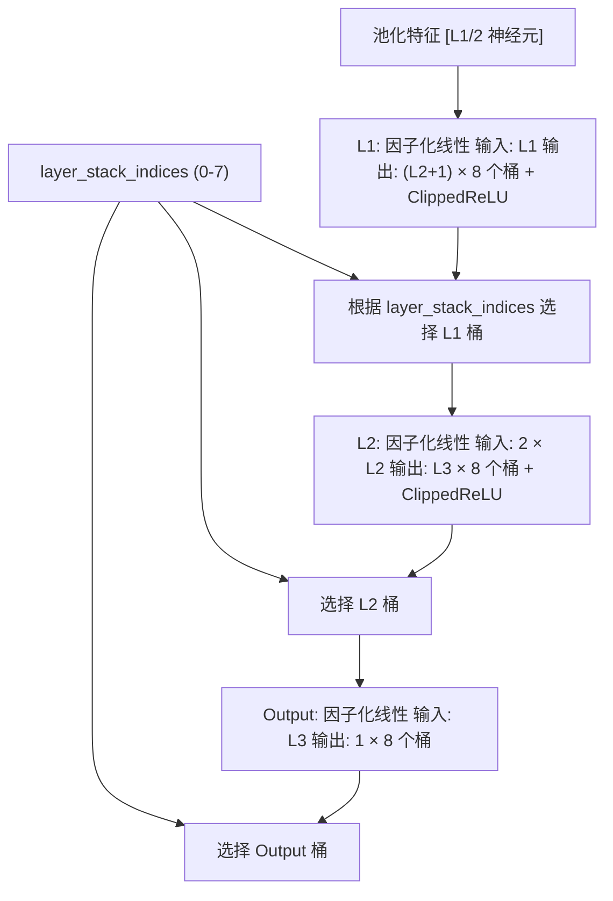
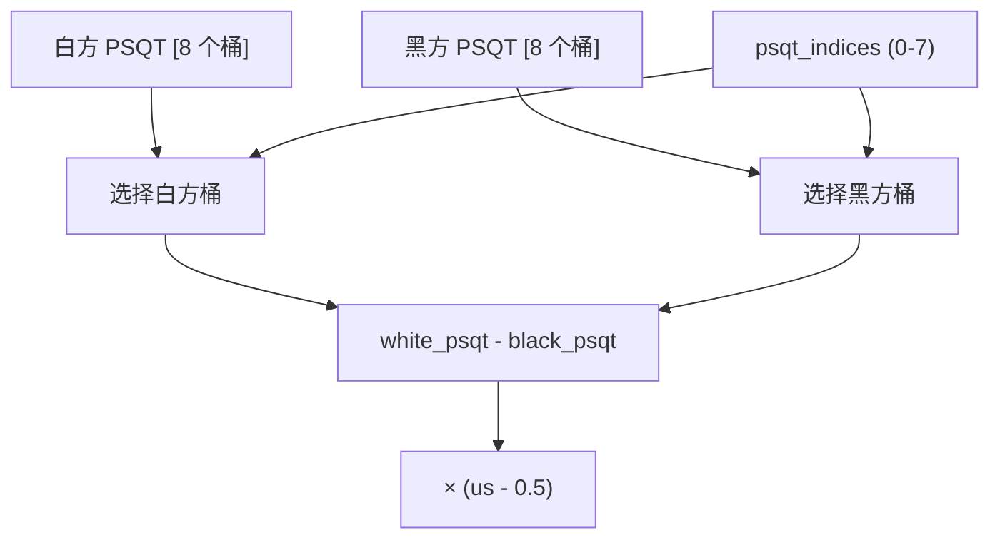
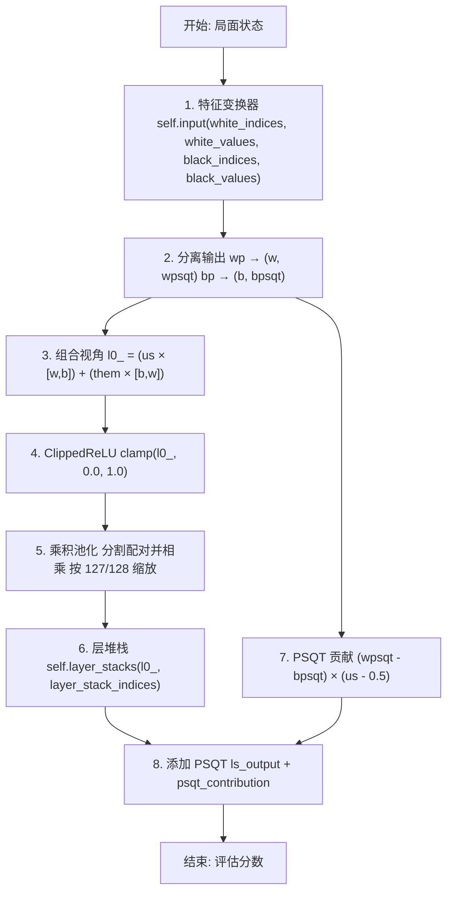
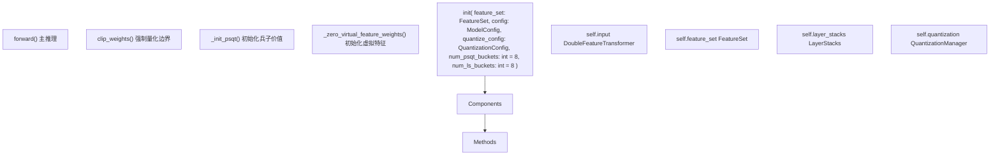
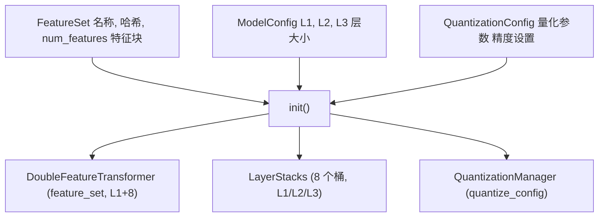

# NNUE 网络结构

-   [docs/img/SFNNv4\_architecture.drawio](https://github.com/Chesszyh/nnue-pytorch/blob/024b2064/docs/img/SFNNv4_architecture.drawio)
-   [docs/nnue.md](https://github.com/Chesszyh/nnue-pytorch/blob/024b2064/docs/nnue.md)
-   [model/model.py](https://github.com/Chesszyh/nnue-pytorch/blob/024b2064/model/model.py)
-   [model/utils/coalesce\_weights.py](https://github.com/Chesszyh/nnue-pytorch/blob/024b2064/model/utils/coalesce_weights.py)
-   [model/utils/serialize.py](https://github.com/Chesszyh/nnue-pytorch/blob/024b2064/model/utils/serialize.py)

## 目的与范围

本页面提供了本仓库中实现的 NNUE 网络架构的高级概览，解释了主要组件（特征变换器、层堆栈和 PSQT 值）如何协同工作以产生国际象棋局面评估。有关特定特征集（如 HalfKP 或 HalfKA）的详细信息，请参阅 [特征集](#4.2)。有关特征变换器的实现细节，请参阅 [特征变换器](#4.3)。有关层堆栈的内部结构，请参阅 [层堆栈和密集层](#4.4)。

## 架构概览

NNUE 网络由三个主要组件组成，它们协同工作以评估国际象棋局面：


**来源：** [model/model.py177-208](https://github.com/Chesszyh/nnue-pytorch/blob/024b2064/model/model.py#L177-L208) [docs/nnue.md263-346](https://github.com/Chesszyh/nnue-pytorch/blob/024b2064/docs/nnue.md#L263-L346)

## 网络组件

### 特征变换器

特征变换器是网络的第一层，也是最大的一层。它将稀疏输入特征（棋子位置）转换为称为 **累加器 (accumulator)** 的密集向量表示。

| 属性 | 值 | 描述 |
| --- | --- | --- |
| 类 | `DoubleFeatureTransformer` | 维护白方和黑方视角的独立累加器 |
| 输入大小 | `feature_set.num_features` | 通常 40k-100k 稀疏特征 |
| 输出大小 | `L1 + num_psqt_buckets` | 密集向量 (例如 1024 + 8 = 1032) |
| 视角 | 2 | 一个白方，一个黑方 |
| 更新策略 | 增量式 | 每步仅更新变化的特征 |

特征变换器为每个视角产生两个输出：

-   **主要特征**：用于神经网络路径的 `L1` 个神经元
-   **PSQT 特征**：用于兵子价值评估的 `num_psqt_buckets` 个神经元（通常为 8）


**关键实现细节：**

-   变换使用稀疏线性操作以提高效率 [model/modules/\_\_init\_\_.py](https://github.com/Chesszyh/nnue-pytorch/blob/024b2064/model/modules/__init__.py)
-   虚拟特征（如果使用）初始化为零并在序列化期间合并 [model/model.py43-52](https://github.com/Chesszyh/nnue-pytorch/blob/024b2064/model/model.py#L43-L52)
-   两个视角可以使用相同的权重（通过棋盘方向）或独立的权重

**来源：** [model/model.py28-30](https://github.com/Chesszyh/nnue-pytorch/blob/024b2064/model/model.py#L28-L30) [model/modules/\_\_init\_\_.py](https://github.com/Chesszyh/nnue-pytorch/blob/024b2064/model/modules/__init__.py) [docs/nnue.md287-347](https://github.com/Chesszyh/nnue-pytorch/blob/024b2064/docs/nnue.md#L287-L347)

### 视角组合与激活

在特征变换器之后，网络根据轮到谁走棋来组合两个视角的累加器：


**代码参考：** [model/model.py191-198](https://github.com/Chesszyh/nnue-pytorch/blob/024b2064/model/model.py#L191-L198)

视角组合的公式为：

```
l0_ = (us * cat([w, b], dim=1)) + (them * cat([b, w], dim=1))
```
其中：

-   `us` 对于走棋方为 1，否则为 0
-   `them` 相反：走棋方为 0，否则为 1
-   这确保了走棋方的视角排在前面

**乘积池化** 步骤将成对的神经元相乘，在增加非线性的同时降低维度。乘以 127/128 的缩放是为了考虑量化表示，其中 1.0 由 127 而不是 128 表示。

**来源：** [model/model.py191-198](https://github.com/Chesszyh/nnue-pytorch/blob/024b2064/model/model.py#L191-L198) [docs/nnue.md241](https://github.com/Chesszyh/nnue-pytorch/blob/024b2064/docs/nnue.md#L241-L241)

### 层堆栈

层堆栈通过多个带有分桶的全连接层处理激活后的特征：


**分桶策略：**

网络使用 8 个桶来基于游戏阶段和材料对评估进行专门化：

| 桶索引 | 典型用例 |
| --- | --- |
| 0-7 | 基于材料数量或游戏阶段启发式选择 |

每个桶都有自己的一组权重，允许网络为不同类型的局面学习不同的评估策略。

**层细节：**

1.  **L1 层**：将 `L1` 个输入映射到 `L2 + 1` 个输出（+1 在某些架构中用于内部用途）
2.  **L2 层**：将 `2 × L2` 个输入（加倍是因为 ClippedReLU 保留正值和截断值）映射到 `L3` 个输出
3.  **Output 层**：将 `L3` 个输入映射到单个标量输出

**来源：** [model/model.py32](https://github.com/Chesszyh/nnue-pytorch/blob/024b2064/model/model.py#L32-L32) [model/modules/\_\_init\_\_.py](https://github.com/Chesszyh/nnue-pytorch/blob/024b2064/model/modules/__init__.py) [docs/nnue.md273-285](https://github.com/Chesszyh/nnue-pytorch/blob/024b2064/docs/nnue.md#L273-L285)

### PSQT（兵子价值表）路径

PSQT 路径提供了一种绕过神经网络的快速、传统的兵子价值评估：


PSQT 贡献计算如下：

```
psqt_contribution = (wpsqt - bpsqt) × (us - 0.5)
```
其中：

-   对于白方走棋，`us - 0.5` 为 0.5；对于黑方走棋，为 -0.5
-   这既平均了视角，又为黑方反转了符号

PSQT 值初始化为传统的兵子价值，并与神经网络一起训练 [model/model.py54-82](https://github.com/Chesszyh/nnue-pytorch/blob/024b2064/model/model.py#L54-L82)

**来源：** [model/model.py54-82](https://github.com/Chesszyh/nnue-pytorch/blob/024b2064/model/model.py#L54-L82) [model/model.py200-206](https://github.com/Chesszyh/nnue-pytorch/blob/024b2064/model/model.py#L200-L206) [docs/nnue.md130](https://github.com/Chesszyh/nnue-pytorch/blob/024b2064/docs/nnue.md#L130-L130)

## 前向传播流程

通过网络的完整前向传播遵循此顺序：


**完整代码参考：** [model/model.py177-208](https://github.com/Chesszyh/nnue-pytorch/blob/024b2064/model/model.py#L177-L208)

**关键点：**

1.  **稀疏特征处理**：仅处理激活的特征（通常 40k+ 中约 30 个）
2.  **双视角**：白方和黑方视角独立计算
3.  **走棋方选择**：网络通过 `us`/`them` 张量知道轮到谁走棋
4.  **乘积池化**：增加非线性并高效降维
5.  **分桶评估**：为不同类型的局面使用不同的权重
6.  **PSQT 旁路**：快速兵子价值评估与神经网络并行运行

**来源：** [model/model.py177-208](https://github.com/Chesszyh/nnue-pytorch/blob/024b2064/model/model.py#L177-L208)

## 典型网络大小

生产中使用的常见配置：

| 配置 | L1 | L2 | L3 | 参数量 | 大小 (量化后) |
| --- | --- | --- | --- | --- | --- |
| 经典 (Classic) | 256 | 32 | 32 | ~10M | ~20 MB |
| 现代小型 (Modern Small) | 512 | 16 | 32 | ~20M | ~40 MB |
| 现代大型 (Modern Large) | 1024 | 8 | 32 | ~40M | ~80 MB |

参数主要由特征变换器决定：

-   特征变换器：`num_features × L1` (例如 41k × 1024 = 42M 权重)
-   层堆栈：`(L1 × L2) + (2×L2 × L3) + (L3 × 1)` 每个桶 × 8 个桶

**权衡：**

-   **更大的 L1**：特征变换器容量更大，但增量更新更慢
-   **更小的 L2/L3**：密集层更快，但复杂模式的容量更小
-   **更多桶**：更好的专门化，但参数更多，模型更大

**来源：** [docs/nnue.md269-285](https://github.com/Chesszyh/nnue-pytorch/blob/024b2064/docs/nnue.md#L269-L285) [model/config.py](https://github.com/Chesszyh/nnue-pytorch/blob/024b2064/model/config.py)

## NNUEModel 类结构

主模型类将所有组件连接在一起：


**主要职责：**

1.  **组件初始化**：创建特征变换器、层堆栈和量化管理器 [model/model.py28-35](https://github.com/Chesszyh/nnue-pytorch/blob/024b2064/model/model.py#L28-L35)
2.  **权重管理**：处理用于量化兼容性的权重截断 [model/model.py84-118](https://github.com/Chesszyh/nnue-pytorch/blob/024b2064/model/model.py#L84-L118)
3.  **PSQT 初始化**：设置传统的兵子价值作为起点 [model/model.py54-82](https://github.com/Chesszyh/nnue-pytorch/blob/024b2064/model/model.py#L54-L82)
4.  **虚拟特征处理**：在初始化期间将虚拟特征归零 [model/model.py43-52](https://github.com/Chesszyh/nnue-pytorch/blob/024b2064/model/model.py#L43-L52)
5.  **前向传播编排**：在推理期间协调所有组件 [model/model.py177-208](https://github.com/Chesszyh/nnue-pytorch/blob/024b2064/model/model.py#L177-L208)

**来源：** [model/model.py10-208](https://github.com/Chesszyh/nnue-pytorch/blob/024b2064/model/model.py#L10-L208)

## 架构配置

网络架构通过几个对象进行配置：


**ModelConfig 字段：**

-   `L1`：特征变换器输出大小（例如 1024）
-   `L2`：第一密集层输出大小（例如 8）
-   `L3`：第二密集层输出大小（例如 32）

**QuantizationConfig 字段：**

-   定义不同层的量化方案
-   指定权重和偏置的 int8/int16/int32 精度
-   详见 [量化系统](#4.5)

**来源：** [model/config.py](https://github.com/Chesszyh/nnue-pytorch/blob/024b2064/model/config.py) [model/model.py11-18](https://github.com/Chesszyh/nnue-pytorch/blob/024b2064/model/model.py#L11-L18) [model/quantize.py](https://github.com/Chesszyh/nnue-pytorch/blob/024b2064/model/quantize.py)

## 历史背景

架构经历了多个 Stockfish 版本的演变：

| 版本 | L1 大小 | 变化 |
| --- | --- | --- |
| SFNNv1-v2 | 256×2 | 原始 HalfKP 架构 |
| SFNNv3-v4 | 256×2 | 添加 PSQT 输出 |
| SFNNv5-v6 | 512×2 | 特征变换器大小翻倍 |
| SFNNv7+ | 1024×2 | 现代大型架构 |

近期的创新包括：

-   **乘积池化**：成对相乘，实现高效的非线性
-   **分桶评估**：用于不同局面的多个专用网络
-   **因子化特征**：加速训练的虚拟特征（见 [虚拟特征](#4.6)）

**来源：** [docs/nnue.md132-142](https://github.com/Chesszyh/nnue-pytorch/blob/024b2064/docs/nnue.md#L132-L142) [docs/img/SFNNv4\_architecture.drawio1](https://github.com/Chesszyh/nnue-pytorch/blob/024b2064/docs/img/SFNNv4_architecture.drawio#L1-L1)