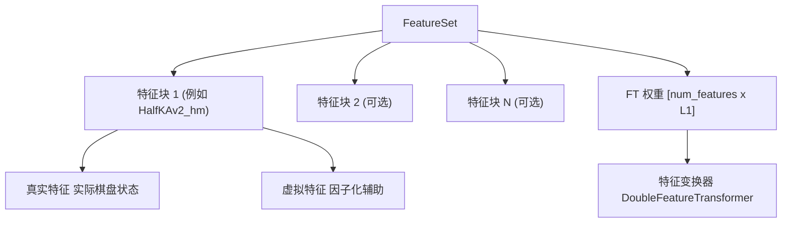
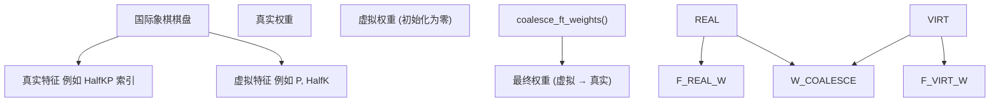
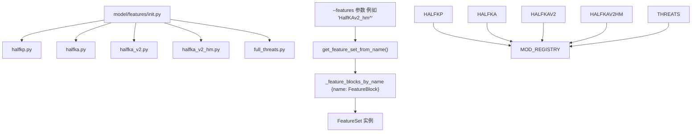
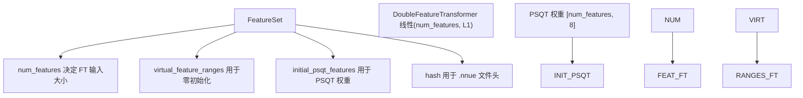

# 特征集

-   [model/callbacks.py](https://github.com/Chesszyh/nnue-pytorch/blob/024b2064/model/callbacks.py)
-   [model/features/\_\_init\_\_.py](https://github.com/Chesszyh/nnue-pytorch/blob/024b2064/model/features/__init__.py)
-   [model/features/feature\_set.py](https://github.com/Chesszyh/nnue-pytorch/blob/024b2064/model/features/feature_set.py)
-   [model/features/full\_threats.py](https://github.com/Chesszyh/nnue-pytorch/blob/024b2064/model/features/full_threats.py)
-   [model/features/halfkp.py](https://github.com/Chesszyh/nnue-pytorch/blob/024b2064/model/features/halfkp.py)
-   [model/modules/layer\_stacks.py](https://github.com/Chesszyh/nnue-pytorch/blob/024b2064/model/modules/layer_stacks.py)
-   [model/quantize.py](https://github.com/Chesszyh/nnue-pytorch/blob/024b2064/model/quantize.py)

本文档描述了 nnue-pytorch 中的特征集系统，包括可用的特征块、因子化机制和特征注册架构。特征集定义了如何将国际象棋棋盘局面编码为 NNUE 神经网络的稀疏输入向量。

有关神经网络如何转换特征的信息，请参阅 [特征变换器](#4.3)。有关在模型序列化期间如何合并虚拟特征的详细信息，请参阅 [虚拟特征和因子化](#4.6)。

## 概览

**特征集 (Feature Set)** 是一个或多个 **特征块 (Feature Block)** 的组合，这些特征块将国际象棋局面的不同方面编码为稀疏二进制向量。每个特征块代表一种特定的编码方案（例如，王-棋子关系、攻击图），并为整体输入空间贡献一个独特的特征索引范围。

特征集决定了：

-   特征变换器的输入维度
-   编码哪些棋盘方面（棋子位置、王的安全、威胁等）
-   是否使用因子化来加速训练
-   用于网络识别的哈希值


**图表：特征集架构**

来源：[model/features/feature\_set.py1-129](https://github.com/Chesszyh/nnue-pytorch/blob/024b2064/model/features/feature_set.py#L1-L129) [model/features/feature\_block.py](https://github.com/Chesszyh/nnue-pytorch/blob/024b2064/model/features/feature_block.py)

## 特征块类型

该仓库提供了几个预实现的特征块，每个都有不同的特性和用例。

### 可用的特征块

| 特征块 | 哈希 | 真实特征数 | 描述 | 因子化变体 |
| --- | --- | --- | --- | --- |
| `HalfKP` | `0x5D69D5B8` | 40,960 (64×640) | 王的位置 + 每个方格单个棋子 | `HalfKP^` |
| `HalfKA` | `0x7546FA1C` | 49,152 (64×768) | 王的位置 + 包括王在内的所有棋子 | `HalfKA^` |
| `HalfKAv2` | `0x3C778D2C` | 45,056 (64×704) | 优化的 HalfKA 变体 | `HalfKAv2^` |
| `HalfKAv2_hm` | `0x41A443B5` | 22,528 (32×704) | 带有王分桶的 HalfKAv2 | `HalfKAv2_hm^` |
| `Full_Threats` | `0x8F234CB8` | 102,464 | HalfKA + 棋子攻击/威胁信息 | `Full_Threats^` |

默认特征集是 `HalfKAv2_hm^`（因子化）。

来源：[model/features/\_\_init\_\_.py57](https://github.com/Chesszyh/nnue-pytorch/blob/024b2064/model/features/__init__.py#L57-L57) [model/features/halfkp.py26](https://github.com/Chesszyh/nnue-pytorch/blob/024b2064/model/features/halfkp.py#L26-L26) [model/features/halfka\_v2\_hm.py](https://github.com/Chesszyh/nnue-pytorch/blob/024b2064/model/features/halfka_v2_hm.py) [model/features/full\_threats.py135](https://github.com/Chesszyh/nnue-pytorch/blob/024b2064/model/features/full_threats.py#L135-L135)

### HalfKP 特征

`HalfKP` 特征块编码玩家的王和棋盘上每个非王棋子的位置。对于每个视角（白/黑），它基于以下内容创建一个特征索引：

-   王方格（64 种可能性）
-   棋子方格（64 种可能性）
-   棋子类型和颜色（10 种棋子类型：5 种棋子类型 × 2 种颜色，不包括王）

```
# 来自 halfkp.py 的特征索引计算
def halfkp_idx(is_white_pov: bool, king_sq: int, sq: int, p: chess.Piece) -> int:
    p_idx = (p.piece_type - 1) * 2 + (p.color != is_white_pov)
    return 1 + orient(is_white_pov, sq) + p_idx * NUM_SQ + king_sq * NUM_PLANES
```
总特征数：`1 + 64 × 64 × 10 = 40,960`

来源：[model/features/halfkp.py18-20](https://github.com/Chesszyh/nnue-pytorch/blob/024b2064/model/features/halfkp.py#L18-L20) [model/features/halfkp.py23-45](https://github.com/Chesszyh/nnue-pytorch/blob/024b2064/model/features/halfkp.py#L23-L45)

### HalfKA 及其变体

`HalfKA` 通过将对手的王的位置作为特征扩展了 `HalfKP`。这提供了有关王的安全和王-王关系的额外信息。

`HalfKAv2` 通过使用王分桶来优化编码，在保持表达能力的同时减少特征空间。它不对 64 个不同的王位置进行编码，而是将对称等效的位置分组。

`HalfKAv2_hm` 通过使用水平镜像进一步减少特征空间，产生 32 个王桶而不是 64 个。由于其表达能力和效率的平衡，这是 **默认特征集**。

来源：[model/features/halfka.py](https://github.com/Chesszyh/nnue-pytorch/blob/024b2064/model/features/halfka.py) [model/features/halfka\_v2.py](https://github.com/Chesszyh/nnue-pytorch/blob/024b2064/model/features/halfka_v2.py) [model/features/halfka\_v2\_hm.py](https://github.com/Chesszyh/nnue-pytorch/blob/024b2064/model/features/halfka_v2_hm.py)

### Full\_Threats 特征

`Full_Threats` 特征块是最复杂的，编码了棋子位置以及攻击/威胁信息：

-   标准的 HalfKA 风格的棋子-方格特征（79,856 个基础特征）
-   每种棋子类型的攻击图，显示哪些方格受到攻击
-   基于攻击模式对每种棋子类型的不同处理

```
# 特征空间构成
NUM_INPUTS = 79856 + NUM_PLANES_REAL * NUM_SQ // 2
# 其中 NUM_PLANES_REAL = 64 * 11 = 704
# 总计: 79,856 + 22,528 = 102,384 特征
```
此特征集提供了最丰富的表示，但也需要更多的计算和内存。

来源：[model/features/full\_threats.py74](https://github.com/Chesszyh/nnue-pytorch/blob/024b2064/model/features/full_threats.py#L74-L74) [model/features/full\_threats.py132-144](https://github.com/Chesszyh/nnue-pytorch/blob/024b2064/model/features/full_threats.py#L132-L144)

## 因子化和虚拟特征

带有 `^` 后缀的特征块使用 **因子化 (factorization)** 来加速训练。因子化添加了辅助的“虚拟特征”，帮助网络在早期训练期间更快地学习，然后在序列化时消除这些特征。


**图表：特征因子化流程**

来源：[model/features/feature\_block.py](https://github.com/Chesszyh/nnue-pytorch/blob/024b2064/model/features/feature_block.py) [model/features/halfkp.py48-96](https://github.com/Chesszyh/nnue-pytorch/blob/024b2064/model/features/halfkp.py#L48-L96)

### 因子化示例：HalfKP^

对于 `HalfKP^` 因子化变体：

**真实特征**（总共 40,960）：

-   `HalfKP`：与标准 HalfKP 中的王-棋子组合相同

**虚拟特征**（总共 704）：

-   `HalfK`（64 个特征）：按棋子数加权的王的位置
-   `P`（640 个特征）：独立于王的棋子位置

每个真实特征 `HalfKP[k, p]` 被因子化为：

```
HalfKP[k, p] = HalfKP[k, p] + HalfK[k] + P[p]
```
虚拟特征初始化为零，但在训练期间可以学习有用的模式。在序列化时，虚拟权重通过 `get_feature_factors()` 加回到真实权重中。

来源：[model/features/halfkp.py82-93](https://github.com/Chesszyh/nnue-pytorch/blob/024b2064/model/features/halfkp.py#L82-L93) [model/features/feature\_set.py88-100](https://github.com/Chesszyh/nnue-pytorch/blob/024b2064/model/features/feature_set.py#L88-L100)

### 虚拟特征初始化

虚拟特征权重初始化为零，以确保障子化模型的起始有效表示与非因子化版本相同：

```
# 来自 FeatureSet.get_virtual_feature_ranges()
def get_virtual_feature_ranges(self) -> list[tuple[int, int]]:
    ranges = []
    offset = 0
    for feature in self.features:
        if feature.num_virtual_features:
            ranges.append(
                (offset + feature.num_real_features, offset + feature.num_features)
            )
        offset += feature.num_features
    return ranges
```
这些范围在模型初始化期间用于选择性地将虚拟特征权重归零。

来源：[model/features/feature\_set.py38-54](https://github.com/Chesszyh/nnue-pytorch/blob/024b2064/model/features/feature_set.py#L38-L54)

## 特征注册和选择

特征系统使用动态注册模式进行特征块的发现和实例化。


**图表：特征注册架构**

来源：[model/features/\_\_init\_\_.py16-72](https://github.com/Chesszyh/nnue-pytorch/blob/024b2064/model/features/__init__.py#L16-L72)

### 特征选择

特征集通过 `--features` 命令行参数选择。语法支持：

-   **单个块**：`--features HalfKAv2_hm`
-   **因子化块**：`--features HalfKAv2_hm^`
-   **多个块**：`--features HalfKP+HalfKA`（拼接）

```
# 来自 model/features/__init__.py
def get_feature_set_from_name(name: str) -> FeatureSet:
    feature_block_names = name.split("+")
    blocks = get_feature_blocks_from_names(feature_block_names)
    return FeatureSet(blocks)
```
解析器按 `+` 分割，允许将多个特征块组合成一个特征集。

来源：[model/features/\_\_init\_\_.py46-49](https://github.com/Chesszyh/nnue-pytorch/blob/024b2064/model/features/__init__.py#L46-L49) [model/features/\_\_init\_\_.py56-64](https://github.com/Chesszyh/nnue-pytorch/blob/024b2064/model/features/__init__.py#L56-L64)

### 注册流程

每个特征模块必须定义一个 `get_feature_block_clss()` 函数，该函数返回特征块类的列表：

```
# 来自 halfkp.py 的示例
def get_feature_block_clss() -> list[type[FeatureBlock]]:
    return [Features, FactorizedFeatures]
```
模块加载时的 `_init()` 函数迭代所有特征模块并填充 `_feature_blocks_by_name`：

```
def _add_feature_block(feature_block_cls: Callable[[], FeatureBlock]) -> None:
    feature_block = feature_block_cls()
    _feature_blocks_by_name[feature_block.name] = feature_block
```
来源：[model/features/\_\_init\_\_.py27-35](https://github.com/Chesszyh/nnue-pytorch/blob/024b2064/model/features/__init__.py#L27-L35) [model/features/\_\_init\_\_.py67-72](https://github.com/Chesszyh/nnue-pytorch/blob/024b2064/model/features/__init__.py#L67-L72) [model/features/halfkp.py104-105](https://github.com/Chesszyh/nnue-pytorch/blob/024b2064/model/features/halfkp.py#L104-L105)

## 特征块接口

所有特征块必须实现 `FeatureBlock` 接口：

**图表：FeatureBlock 类层次结构**

来源：[model/features/feature\_block.py](https://github.com/Chesszyh/nnue-pytorch/blob/024b2064/model/features/feature_block.py) [model/features/halfkp.py23-27](https://github.com/Chesszyh/nnue-pytorch/blob/024b2064/model/features/halfkp.py#L23-L27) [model/features/halfkp.py48-57](https://github.com/Chesszyh/nnue-pytorch/blob/024b2064/model/features/halfkp.py#L48-L57)

### 关键方法

**`get_active_features(board: chess.Board) -> tuple[torch.Tensor, torch.Tensor]`**

-   返回两个张量：白方视角特征和黑方视角特征
-   每个张量包含激活特征的索引（非零元素）
-   主要用于推理；训练使用 C++ 数据加载器

**`get_feature_factors(idx: int) -> list[int]`**

-   对于因子化块，返回有助于 `idx` 处真实特征的特征索引列表（真实 + 虚拟）
-   在序列化时的权重合并期间使用
-   非因子化块会引发异常

**`get_initial_psqt_features() -> list[int]`**

-   返回 PSQT（兵子价值表）特征的初始值
-   基于传统的国际象棋兵子价值（兵=126, 马=781 等）
-   用于初始化模型中的 PSQT 权重

来源：[model/features/feature\_block.py](https://github.com/Chesszyh/nnue-pytorch/blob/024b2064/model/features/feature_block.py) [model/features/halfkp.py82-93](https://github.com/Chesszyh/nnue-pytorch/blob/024b2064/model/features/halfkp.py#L82-L93) [model/features/full\_threats.py109-129](https://github.com/Chesszyh/nnue-pytorch/blob/024b2064/model/features/full_threats.py#L109-L129)

## 特征集哈希计算

每个特征集都有一个从其组成特征块计算出的唯一哈希值：

```
def _calculate_features_hash(features):
    if len(features) == 1:
        return features[0].hash
    
    tail_hash = _calculate_features_hash(features[1:])
    return features[0].hash ^ (tail_hash << 1) ^ (tail_hash >> 1) & 0xFFFFFFFF
```
此哈希值嵌入在 `.nnue` 文件格式中，并由国际象棋引擎用于验证兼容性。更改特征集会导致不同的哈希值，从而防止加载不兼容的网络。

来源：[model/features/feature\_set.py7-12](https://github.com/Chesszyh/nnue-pytorch/blob/024b2064/model/features/feature_set.py#L7-L12)

## 创建自定义特征块

要添加新的特征块：

1.  在 `model/features/` 中 **创建一个新模块**（例如 `my_features.py`）

2.  **定义特征块类**，继承自 `FeatureBlock`：

    ```
    from collections import OrderedDict
    from .feature_block import FeatureBlock
    
    class MyFeatures(FeatureBlock):
        def __init__(self):
            super().__init__(
                "MyFeatures",
                0x12345678,  # 唯一哈希
                OrderedDict([("MyFeatures", num_features)])
            )
        
        def get_active_features(self, board):
            # 返回 (white_features, black_features)
            ...
        
        def get_initial_psqt_features(self):
            # 返回初始 PSQT 值
            ...
    ```

3.  **定义发现函数**：

    ```
    def get_feature_block_clss() -> list[type[FeatureBlock]]:
        return [MyFeatures]
    ```

4.  在 **`__init__.py` 中注册**：

    ```
    from . import my_features
    
    feature_modules: list[types.ModuleType] = [
        ...,
        my_features,
    ]
    ```

5.  **实现 C++ 特征提取**（如果需要训练）：

    -   将特征提取逻辑添加到 `training_data_loader.cpp`
    -   为您的编码方案实现稀疏特征生成

来源：[model/features/\_\_init\_\_.py8-22](https://github.com/Chesszyh/nnue-pytorch/blob/024b2064/model/features/__init__.py#L8-L22) [model/features/halfkp.py23-45](https://github.com/Chesszyh/nnue-pytorch/blob/024b2064/model/features/halfkp.py#L23-L45) [model/features/feature\_block.py](https://github.com/Chesszyh/nnue-pytorch/blob/024b2064/model/features/feature_block.py)

## 模型中的特征集使用

`FeatureSet` 传递给 `NNUEModel` 构造函数，并决定：


**图表：FeatureSet 与 NNUEModel 的集成**

来源：[model/features/feature\_set.py15-129](https://github.com/Chesszyh/nnue-pytorch/blob/024b2064/model/features/feature_set.py#L15-L129) [model/model.py](https://github.com/Chesszyh/nnue-pytorch/blob/024b2064/model/model.py)

### 权重截断和量化

特征权重必须在训练期间截断到量化边界。`QuantizationManager` 生成截断配置，但它不直接依赖于特征集。但是，威胁特征（来自 `Full_Threats`）有特殊的截断边界：

```
# 来自 QuantizationManager
self.max_threat_weight = config.ft_quantized_one / 512
```
模型的 `clip_threat_weights()` 方法仅在存在威胁特征时应用此特殊截断。

来源：[model/quantize.py35](https://github.com/Chesszyh/nnue-pytorch/blob/024b2064/model/quantize.py#L35-L35) [model/callbacks.py6-17](https://github.com/Chesszyh/nnue-pytorch/blob/024b2064/model/callbacks.py#L6-L17)

## 总结

特征集系统为编码国际象棋局面提供了一个模块化、可扩展的架构：

-   **特征块** 定义编码方案（HalfKP, HalfKA, 变体）
-   **因子化** 使用虚拟特征加速训练
-   **注册模式** 启用动态特征选择
-   **灵活组合** 支持组合多个块
-   **基于哈希的版本控制** 确保模型兼容性

默认的 `HalfKAv2_hm^` 为大多数用例提供了表达能力、训练速度和模型大小的最佳平衡。

来源：[model/features/\_\_init\_\_.py1-80](https://github.com/Chesszyh/nnue-pytorch/blob/024b2064/model/features/__init__.py#L1-L80) [model/features/feature\_set.py1-129](https://github.com/Chesszyh/nnue-pytorch/blob/024b2064/model/features/feature_set.py#L1-L129) [model/features/feature\_block.py](https://github.com/Chesszyh/nnue-pytorch/blob/024b2064/model/features/feature_block.py)