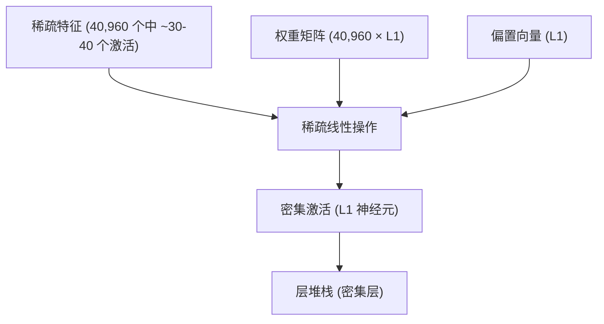
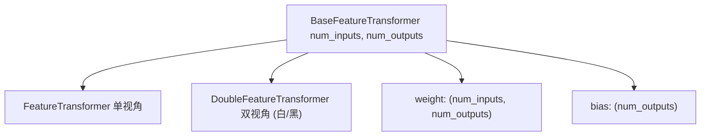
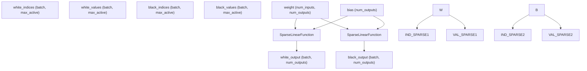
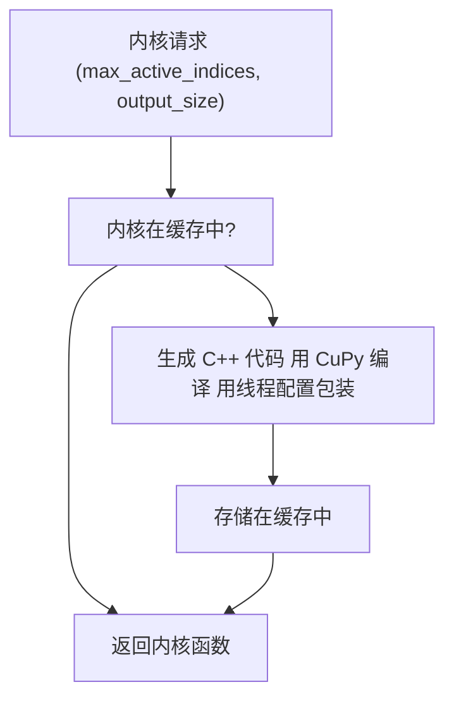
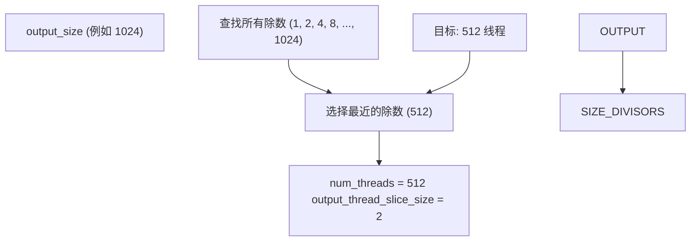

# 特征变换器

-   [docs/img/SFNNv4\_architecture.drawio](https://github.com/Chesszyh/nnue-pytorch/blob/024b2064/docs/img/SFNNv4_architecture.drawio)
-   [docs/nnue.md](https://github.com/Chesszyh/nnue-pytorch/blob/024b2064/docs/nnue.md)
-   [model/model.py](https://github.com/Chesszyh/nnue-pytorch/blob/024b2064/model/model.py)
-   [model/modules/\_\_init\_\_.py](https://github.com/Chesszyh/nnue-pytorch/blob/024b2064/model/modules/__init__.py)
-   [model/modules/feature\_transformer/\_\_init\_\_.py](https://github.com/Chesszyh/nnue-pytorch/blob/024b2064/model/modules/feature_transformer/__init__.py)
-   [model/modules/feature\_transformer/functions.py](https://github.com/Chesszyh/nnue-pytorch/blob/024b2064/model/modules/feature_transformer/functions.py)
-   [model/modules/feature\_transformer/kernel.py](https://github.com/Chesszyh/nnue-pytorch/blob/024b2064/model/modules/feature_transformer/kernel.py)
-   [model/modules/feature\_transformer/module.py](https://github.com/Chesszyh/nnue-pytorch/blob/024b2064/model/modules/feature_transformer/module.py)
-   [model/utils/coalesce\_weights.py](https://github.com/Chesszyh/nnue-pytorch/blob/024b2064/model/utils/coalesce_weights.py)
-   [model/utils/serialize.py](https://github.com/Chesszyh/nnue-pytorch/blob/024b2064/model/utils/serialize.py)
-   [tests/test\_feature\_transformer.py](https://github.com/Chesszyh/nnue-pytorch/blob/024b2064/tests/test_feature_transformer.py)

## 目的与范围

本页面记录了特征变换器 (Feature Transformer)，这是 NNUE 网络架构中的第一层也是最大的一层。特征变换器接收稀疏输入特征（代表国际象棋棋盘状态）并将其转换为密集的隐藏层激活。本页面涵盖：

-   特征变换器在 NNUE 中的作用和重要性
-   稀疏线性操作的实现
-   类层次结构 (`BaseFeatureTransformer`, `FeatureTransformer`, `DoubleFeatureTransformer`)
-   用于前向和反向传播的自定义 CUDA 内核
-   用于白方和黑方的双视角架构

有关输入特征集的信息，请参阅 [特征集](#4.2)。有关特征变换器权重权量化的详细信息，请参阅 [量化系统](#4.5)。有关虚拟特征处理的信息，请参阅 [虚拟特征和因子化](#4.6)。

## 概览

### 在 NNUE 架构中的角色

特征变换器是 NNUE 网络的第一层。它将稀疏二进制输入特征（40,000+ 个可能特征中通常只有 30-40 个激活）转换为隐藏神经元激活的密集向量。该层占网络参数的大部分（通常为 1000-2000 万个权重），但由于输入的稀疏性，其运行速度仍然很快。


**图表：网络中特征变换器的位置**

关键的创新在于，只需要处理对应于激活特征的权重矩阵列。对于一个有 32 个激活特征的局面，这意味着只处理 32 列，而不是全部 40,960 列。

来源：[docs/nnue.md144-300](https://github.com/Chesszyh/nnue-pytorch/blob/024b2064/docs/nnue.md#L144-L300) [model/model.py28-30](https://github.com/Chesszyh/nnue-pytorch/blob/024b2064/model/model.py#L28-L30)

### 累加器概念

特征变换器实现了“累加器 (accumulator)”——这是一个至关重要的优化，即该层的输出在局面之间增量更新，而不是从头重新计算。当走出一着棋时：

-   **特征移除**：从累加器中减去相应的权重列
-   **特征添加**：向累加器添加相应的权重列
-   **王移动**：刷新整个累加器（所有特征都改变）

这种增量更新由国际象棋引擎在搜索期间处理，而不是由训练器处理。在训练期间，每个批次局面都是独立评估的。

来源：[docs/nnue.md287-299](https://github.com/Chesszyh/nnue-pytorch/blob/024b2064/docs/nnue.md#L287-L299) [docs/nnue.md370-448](https://github.com/Chesszyh/nnue-pytorch/blob/024b2064/docs/nnue.md#L370-L448)

## 类层次结构

### BaseFeatureTransformer

基类定义了核心参数和初始化逻辑。


**图表：特征变换器类层次结构**

来自 [model/modules/feature\_transformer/module.py9-24](https://github.com/Chesszyh/nnue-pytorch/blob/024b2064/model/modules/feature_transformer/module.py#L9-L24) 的关键实现细节：

| 组件 | 类型 | 形状 | 初始化 |
| --- | --- | --- | --- |
| `weight` | `nn.Parameter` | `(num_inputs, num_outputs)` | Uniform(-σ, σ) 其中 σ = sqrt(1/num\_inputs) |
| `bias` | `nn.Parameter` | `(num_outputs)` | Uniform(-σ, σ) 其中 σ = sqrt(1/num\_inputs) |

权重矩阵在概念上使用 **列优先布局**（每个特征对应一列），这有利于稀疏操作，即我们对选定的列求和。

来源：[model/modules/feature\_transformer/module.py9-24](https://github.com/Chesszyh/nnue-pytorch/blob/024b2064/model/modules/feature_transformer/module.py#L9-L24)

### FeatureTransformer

单视角特征变换器处理来自一方视角的特征。

```
# 来自 model/modules/feature_transformer/module.py:27-30 的前向签名
def forward(self, feature_indices, feature_values):
    return SparseLinearFunction.apply(
        feature_indices, feature_values, self.weight, self.bias
    )
```
**输入格式：**

-   `feature_indices`: `(batch_size, max_active_features)` - 激活特征索引的 int32 张量
-   `feature_values`: `(batch_size, max_active_features)` - 特征值的 float32 张量（元数）

**输出：**

-   `(batch_size, num_outputs)` - 激活的 float32 张量

来源：[model/modules/feature\_transformer/module.py26-30](https://github.com/Chesszyh/nnue-pytorch/blob/024b2064/model/modules/feature_transformer/module.py#L26-L30)

### DoubleFeatureTransformer

双视角变换器同时处理白方和黑方的特征，共享相同的权重矩阵。


**图表：DoubleFeatureTransformer 数据流**

[model/modules/feature\_transformer/module.py33-50](https://github.com/Chesszyh/nnue-pytorch/blob/024b2064/model/modules/feature_transformer/module.py#L33-L50) 中的实现对不同的输入应用相同的 `SparseLinearFunction` 两次，但共享权重。

来源：[model/modules/feature\_transformer/module.py33-50](https://github.com/Chesszyh/nnue-pytorch/blob/024b2064/model/modules/feature_transformer/module.py#L33-L50) [model/model.py28-30](https://github.com/Chesszyh/nnue-pytorch/blob/024b2064/model/model.py#L28-L30)

## 稀疏线性操作

### 数学基础

稀疏线性操作计算 `y = Wx + b`，其中 `x` 是稀疏的。不计算：

```
y[i] = sum(W[j,i] * x[j] for j in 0..num_inputs) + b[i]
```
我们计算：

```
y[i] = sum(W[j,i] * x[j] for j in active_features) + b[i]
```
这不仅将复杂度从 O(num\_inputs × num\_outputs) 降低到 O(num\_active × num\_outputs)，通常有 1000 倍的改进。

来源：[docs/nnue.md173-190](https://github.com/Chesszyh/nnue-pytorch/blob/024b2064/docs/nnue.md#L173-L190)

### SparseLinearFunction 实现

`SparseLinearFunction` 是一个自定义的 PyTorch autograd 函数，它使用自定义 CUDA 内核实现了前向和反向传播。

```mermaid
flowchart TD
    B_IN["grad_output"]
    B_KERNEL["获取/编译反向内核 make_sparse_input_linear_backward_kernel"]
    B_EXEC["执行内核 grid=(batch_size,)"]
    B_OUT["weight_grad, bias_grad"]
    F_IN["feature_indices, feature_values weight, bias"]
    F_VALIDATE["输入验证 形状, dtypes, 设备"]
    F_KERNEL["获取/编译前向内核 make_sparse_input_linear_forward_kernel"]
    F_EXEC["执行内核 grid=(batch_size,)"]
    F_OUT["output (batch_size, output_size)"]

    B --> IN_B_KERNEL
    B --> KERNEL_B_EXEC
    B --> EXEC_B_OUT
    F --> IN_F_VALIDATE
    F --> VALIDATE_F_KERNEL
    F --> KERNEL_F_EXEC
    F --> EXEC_F_OUT
```


**图表：SparseLinearFunction 流程**

来自 [model/modules/feature\_transformer/functions.py15-40](https://github.com/Chesszyh/nnue-pytorch/blob/024b2064/model/modules/feature_transformer/functions.py#L15-L40) 的关键断言：

| 要求 | 验证 |
| --- | --- |
| 形状兼容性 | `feature_indices.shape == feature_values.shape` |
| 数据类型 | `feature_indices: int32`, `feature_values: float32`, `weight: float32`, `bias: float32` |
| 设备 | 所有张量必须在 CUDA 上 |
| 内存布局 | 所有张量必须是连续的 |

来源：[model/modules/feature\_transformer/functions.py10-104](https://github.com/Chesszyh/nnue-pytorch/blob/024b2064/model/modules/feature_transformer/functions.py#L10-L104)

## 自定义 CUDA 内核

### 内核编译和缓存

系统根据架构参数动态生成、编译和缓存 CUDA 内核。


**图表：内核编译流程**

[model/modules/feature\_transformer/kernel.py47-173](https://github.com/Chesszyh/nnue-pytorch/blob/024b2064/model/modules/feature_transformer/kernel.py#L47-L173) 中的内核生成代码使用以下缓存策略：

-   缓存键：`(max_active_indices, output_size, num_threads)`
-   全局字典：`_sparse_input_linear_forward_kernel_cache`, `_sparse_input_linear_backward_kernel_cache`
-   最佳线程数：512 个线程，调整为 `output_size` 的最近除数

来源：[model/modules/feature\_transformer/kernel.py5-45](https://github.com/Chesszyh/nnue-pytorch/blob/024b2064/model/modules/feature_transformer/kernel.py#L5-L45)

### 前向内核

前向内核并行计算整个批次的稀疏线性变换。

**来自 [model/modules/feature\_transformer/kernel.py68-173](https://github.com/Chesszyh/nnue-pytorch/blob/024b2064/model/modules/feature_transformer/kernel.py#L68-L173) 的关键特性：**

| 方面 | 实现 |
| --- | --- |
| 线程组织 | `grid=(batch_size,)`, `block=(num_threads,)` |
| 输出切片 | 每个线程处理 `output_size // num_threads` 个输出 |
| 共享内存 | `shared_output[output_size]` 减少全局内存访问 |
| 循环优化 | `#pragma unroll` 用于内部循环 |
| 提前终止 | 当 `input_index == -1` 时中断 |

**内核结构：**

1.  将偏置切片复制到共享内存
2.  对于每个激活特征：
    -   加载特征索引和值
    -   如果 index != -1：累加 `weight[index, :] * value`
    -   否则：中断（没有更多激活特征）
3.  将共享内存写入全局输出

来源：[model/modules/feature\_transformer/kernel.py68-173](https://github.com/Chesszyh/nnue-pytorch/blob/024b2064/model/modules/feature_transformer/kernel.py#L68-L173)

### 反向内核

反向内核计算关于权重和偏置的梯度。

**与前向内核的关键区别 ([model/modules/feature\_transformer/kernel.py197-311](https://github.com/Chesszyh/nnue-pytorch/blob/024b2064/model/modules/feature_transformer/kernel.py#L197-L311))：**

| 组件 | 实现 |
| --- | --- |
| 权重梯度 | 使用 `atomicAdd` 进行累加（处理竞态条件） |
| 偏置梯度 | 使用 `atomicAdd` 进行累加 |
| 零跳过 | 仅当 `shared_output_grad[s] != 0.0f` 时累加 |
| 输入梯度 | 不计算（特征是索引，不可微） |

`atomicAdd` 操作是必要的，因为多个线程可能会在同一特征出现在不同批次位置时更新相同的权重梯度行。

来源：[model/modules/feature\_transformer/kernel.py197-311](https://github.com/Chesszyh/nnue-pytorch/blob/024b2064/model/modules/feature_transformer/kernel.py#L197-L311)

### 线程配置优化

系统优化线程数以平衡并行性和效率：


**图表：线程数选择**

这确保：

-   每个线程处理整数个输出
-   线程数接近最优值 (512)
-   没有浪费的线程

来源：[model/modules/feature\_transformer/kernel.py5-45](https://github.com/Chesszyh/nnue-pytorch/blob/024b2064/model/modules/feature_transformer/kernel.py#L5-L45)

## 双视角架构

### 为什么需要双视角

NNUE 维护白方和黑方视角的独立累加器，使网络能够理解相对于每方王的局面特征。这提供了：

-   同时从双方进行局面评估
-   学习节奏的能力（轮到谁走）
-   更好的局面理解（例如，白王安全 vs 黑王安全）

来源：[docs/nnue.md311-328](https://github.com/Chesszyh/nnue-pytorch/blob/024b2064/docs/nnue.md#L311-L328)

### 权重共享

两个视角使用 **相同的权重矩阵**。特征集旨在将等效局面映射到等效特征。例如，使用 HalfKP：

-   白王在 e1，白兵在 e2（白方视角）
-   黑王在 e8，黑兵在 e7（黑方视角，棋盘翻转）

两者生成相同的特征索引，因此它们使用相同的权重。

替代方案：某些引擎对白/黑视角使用单独的权重，但这会使模型大小增加一倍。

来源：[docs/nnue.md323-328](https://github.com/Chesszyh/nnue-pytorch/blob/024b2064/docs/nnue.md#L323-L328)

### NNUEModel 中的 DoubleFeatureTransformer

[model/model.py28-30](https://github.com/Chesszyh/nnue-pytorch/blob/024b2064/model/model.py#L28-L30) 中的集成展示了特征变换器是如何实例化的：

```
self.input = DoubleFeatureTransformer(
    feature_set.num_features, self.L1 + self.num_psqt_buckets)
```
注意：输出大小包括 L1 神经元和 PSQT（兵子价值表）桶。PSQT 值随后被分离并单独使用。

[model/model.py188](https://github.com/Chesszyh/nnue-pytorch/blob/024b2064/model/model.py#L188-L188) 处的前向传播返回两个输出：

```
wp, bp = self.input(white_indices, white_values, black_indices, black_values)
```
其中 `wp` 和 `bp` 是白方和黑方视角的输出，每个形状为 `(batch_size, L1 + num_psqt_buckets)`。

来源：[model/model.py28-30](https://github.com/Chesszyh/nnue-pytorch/blob/024b2064/model/model.py#L28-L30) [model/model.py177-208](https://github.com/Chesszyh/nnue-pytorch/blob/024b2064/model/model.py#L177-L208)

## 初始化

### 权重初始化

使用按 Xavier/He 初始化原则缩放的均匀分布初始化权重：

```
sigma = math.sqrt(1 / num_inputs)
weight = torch.rand(...) * (2 * sigma) - sigma  # Uniform(-sigma, sigma)
```
这提供了：

-   均值：0
-   方差：σ²/3 其中 σ = 1/√num\_inputs
-   防止梯度消失/爆炸

来源：[model/modules/feature\_transformer/module.py15-23](https://github.com/Chesszyh/nnue-pytorch/blob/024b2064/model/modules/feature_transformer/module.py#L15-L23)

### 虚拟特征初始化

虚拟特征（用于因子化特征集）在 [model/model.py43-52](https://github.com/Chesszyh/nnue-pytorch/blob/024b2064/model/model.py#L43-L52) 处初始化为零：

```
def _zero_virtual_feature_weights(self):
    weights = self.input.weight
    with torch.no_grad():
        for a, b in self.feature_set.get_virtual_feature_ranges():
            weights[a:b, :] = 0.0
    self.input.weight = nn.Parameter(weights)
```
这样做是因为虚拟特征仅在训练期间用于帮助学习相关的真实特征。它们从零开始，仅在训练期间发展。

来源：[model/model.py43-52](https://github.com/Chesszyh/nnue-pytorch/blob/024b2064/model/model.py#L43-L52)

### PSQT 初始化

PSQT（兵子价值表）神经元在 [model/model.py54-82](https://github.com/Chesszyh/nnue-pytorch/blob/024b2064/model/model.py#L54-L82) 处用经典的国际象棋评估值初始化：

```
initial_values = self.feature_set.get_initial_psqt_features()
new_weights = torch.tensor(initial_values, ...) * scale
for i in range(self.num_psqt_buckets):
    input_weights[:, self.L1 + i] = new_weights
    input_bias[self.L1 + i] = 0.0
```
这在网络在训练期间学会调整这些值之前提供了一个合理的起点。

来源：[model/model.py54-82](https://github.com/Chesszyh/nnue-pytorch/blob/024b2064/model/model.py#L54-L82)

## 序列化和权重合并

### 权重合并

在序列化之前，虚拟特征权重被合并回真实特征权重中。[model/utils/coalesce\_weights.py7-19](https://github.com/Chesszyh/nnue-pytorch/blob/024b2064/model/utils/coalesce_weights.py#L7-L19) 处的 `coalesce_ft_weights` 函数将虚拟特征权重求和到其对应的真实特征中：

```
def coalesce_ft_weights(feature_set, layer):
    weight = layer.weight.data
    indices = feature_set.get_virtual_to_real_features_gather_indices()
    weight_coalesced = weight.new_zeros((feature_set.num_real_features, weight.shape[1]))
    for i_real, is_virtual in enumerate(indices):
        weight_coalesced[i_real, :] = sum(weight[i_virtual, :] for i_virtual in is_virtual)
    return weight_coalesced
```
这不仅将模型减少到仅包含真实特征，这是国际象棋引擎所理解的。

来源：[model/utils/coalesce\_weights.py7-19](https://github.com/Chesszyh/nnue-pytorch/blob/024b2064/model/utils/coalesce_weights.py#L7-L19) [model/utils/serialize.py149](https://github.com/Chesszyh/nnue-pytorch/blob/024b2064/model/utils/serialize.py#L149-L149)

### 二进制序列化

特征变换器在 [model/utils/serialize.py144-174](https://github.com/Chesszyh/nnue-pytorch/blob/024b2064/model/utils/serialize.py#L144-L174) 处序列化为 .nnue 格式：

**序列化顺序：**

1.  偏置向量（L1 为 int16，PSQT 为 int32）
2.  权重矩阵（int16 或 int8，取决于特征集）
3.  PSQT 权重矩阵 (int32)

可以应用可选的 LEB128 压缩以进一步减小文件大小。

来源：[model/utils/serialize.py144-174](https://github.com/Chesszyh/nnue-pytorch/blob/024b2064/model/utils/serialize.py#L144-L174)

## 性能考量

### 基准测试结果

来自 [tests/test\_feature\_transformer.py80-122](https://github.com/Chesszyh/nnue-pytorch/blob/024b2064/tests/test_feature_transformer.py#L80-L122) 的典型性能指标：

| 配置 | 性能 |
| --- | --- |
| 输入特征 | 40,960 |
| 批次大小 | 8,192 |
| 激活特征 | ~48 (最大 64, 75% 填充) |
| 输出大小 | 264 |
| 吞吐量 | ~100 万局面/秒 (单 GPU) |

基准测试显示，稀疏实现实现了高吞吐量，归功于：

-   针对稀疏操作优化的自定义 CUDA 内核
-   高效的内存访问模式
-   线程级并行

来源：[tests/test\_feature\_transformer.py80-122](https://github.com/Chesszyh/nnue-pytorch/blob/024b2064/tests/test_feature_transformer.py#L80-L122)

### 内存布局

权重矩阵在 PyTorch 中以行优先顺序存储（默认），但在稀疏操作期间概念上按列访问。每个激活特征对应于收集权重矩阵的一列（或存储布局中的一行）。

这种布局之所以高效，是因为：

-   每个线程处理连续的输出切片
-   权重访问模式是可预测的
-   CUDA 中的内存访问合并

来源：[docs/nnue.md365-367](https://github.com/Chesszyh/nnue-pytorch/blob/024b2064/docs/nnue.md#L365-L367)

### 量化影响

在训练期间，权重保持为 float32。量化方案限制其范围以确保安全转换为 int16：

-   FT 权重：通常量化为 int16，比例因子为 127
-   FT 偏置：通常量化为 int32

权重截断回调确保在训练期间权重保持在量化边界内。详情请参阅 [量化系统](#4.5)。

来源：[model/model.py84-117](https://github.com/Chesszyh/nnue-pytorch/blob/024b2064/model/model.py#L84-L117)

## 测试和验证

位于 [tests/test\_feature\_transformer.py36-77](https://github.com/Chesszyh/nnue-pytorch/blob/024b2064/tests/test_feature_transformer.py#L36-L77) 的测试套件验证：

1.  **前向传播正确性**：CUDA 内核输出与 CPU 参考实现匹配
2.  **反向传播正确性**：梯度与 CPU 参考实现匹配
3.  **数值精度**：float32 的最大误差 < 1e-4

CPU 参考实现使用密集矩阵运算进行验证：

```
def SparseLinearFunctionEmulate(input_indices, input_values, weight, bias):
    # 从稀疏表示构建密集输入
    inputs = torch.zeros(batch_size, num_inputs, dtype=torch.float32)
    for i in range(batch_size):
        for j in range(max_active_indices):
            feature = input_indices[i, j]
            value = input_values[i, j]
            inputs[i, feature] += value
    return torch.mm(inputs, weight) + bias
```
来源：[tests/test\_feature\_transformer.py15-77](https://github.com/Chesszyh/nnue-pytorch/blob/024b2064/tests/test_feature_transformer.py#L15-L77)

---

**关键要点：**

1.  特征变换器是最大的一层，但由于稀疏输入而保持快速
2.  自定义 CUDA 内核提供优化的前向/反向传播
3.  双视角（白/黑）共享权重以提高参数效率
4.  虚拟特征有助于训练，但在序列化之前被合并
5.  累加器概念（由引擎实现）支持增量更新
6.  线程级并行和内存优化对性能至关重要