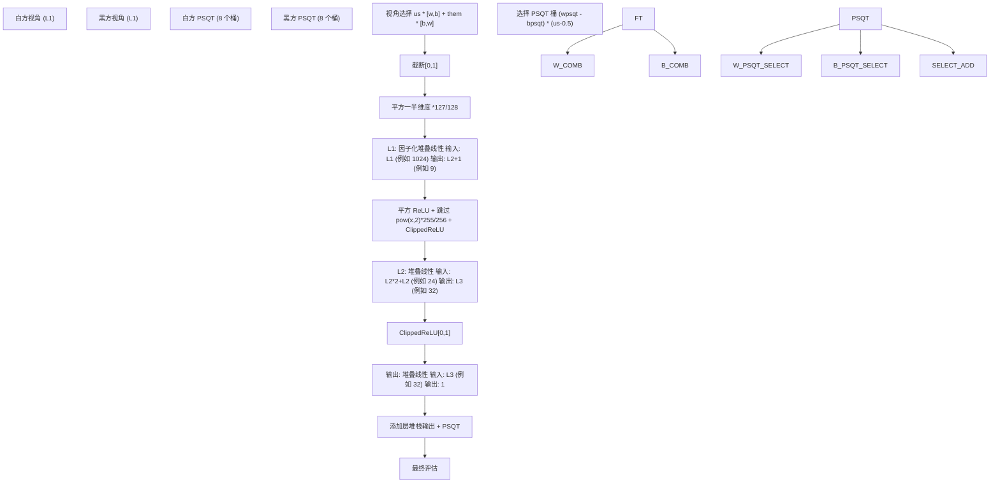
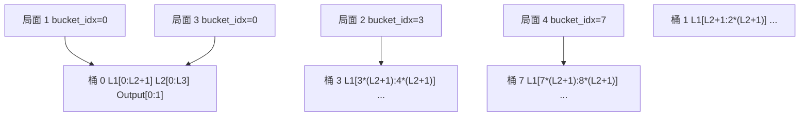
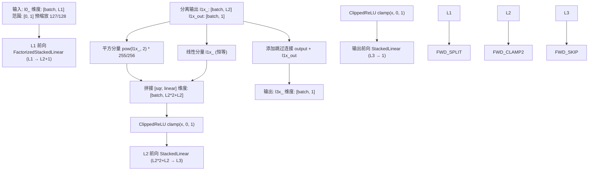
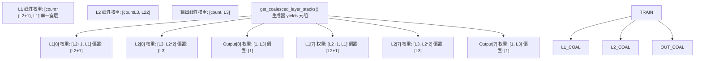

# 层堆栈和密集层

-   [model/callbacks.py](https://github.com/Chesszyh/nnue-pytorch/blob/024b2064/model/callbacks.py)
-   [model/features/\_\_init\_\_.py](https://github.com/Chesszyh/nnue-pytorch/blob/024b2064/model/features/__init__.py)
-   [model/features/full\_threats.py](https://github.com/Chesszyh/nnue-pytorch/blob/024b2064/model/features/full_threats.py)
-   [model/model.py](https://github.com/Chesszyh/nnue-pytorch/blob/024b2064/model/model.py)
-   [model/modules/layer\_stacks.py](https://github.com/Chesszyh/nnue-pytorch/blob/024b2064/model/modules/layer_stacks.py)
-   [model/quantize.py](https://github.com/Chesszyh/nnue-pytorch/blob/024b2064/model/quantize.py)
-   [model/utils/coalesce\_weights.py](https://github.com/Chesszyh/nnue-pytorch/blob/024b2064/model/utils/coalesce_weights.py)
-   [model/utils/serialize.py](https://github.com/Chesszyh/nnue-pytorch/blob/024b2064/model/utils/serialize.py)

## 目的与范围

本文档描述了处理特征变换器输出的密集神经网络层，以产生最终的局面评估。在特征变换器将稀疏国际象棋特征转换为密集的 L1 维向量后，层堆栈应用一系列带有非线性激活函数的全连接层来计算局面分数。

有关这些层之前的特征变换器的信息，请参阅 [特征变换器](#4.3)。有关这些层量化的详细信息，请参阅 [量化系统](#4.5)。有关整体网络结构，请参阅 [NNUE 网络结构](#4.1)。

来源：[model/modules/layer\_stacks.py1-59](https://github.com/Chesszyh/nnue-pytorch/blob/024b2064/model/modules/layer_stacks.py#L1-L59)

## 架构概览

层堆栈由三个依次应用的全连接层组成，位于特征变换器输出之后。该架构使用分桶系统，其中多个独立的层堆栈同时处理不同类型的局面。

**架构概览：从特征变换器输出到层堆栈再到最终评估的完整流程**

来源：[model/model.py177-208](https://github.com/Chesszyh/nnue-pytorch/blob/024b2064/model/model.py#L177-L208) [model/modules/layer\_stacks.py30-44](https://github.com/Chesszyh/nnue-pytorch/blob/024b2064/model/modules/layer_stacks.py#L30-L44)

## LayerStacks 模块

`LayerStacks` 类实现了密集神经网络层。它维护了三个带有专门激活函数的连续线性层，组织成多个独立的“桶”以进行位置类型专门化。

### 类结构

| 组件 | 类型 | 维度 | 目的 |
| --- | --- | --- | --- |
| `l1` | `FactorizedStackedLinear` | `L1 → L2+1` | 带有因子化的第一隐藏层 |
| `l2` | `StackedLinear` | `L2*2 → L3` | 第二隐藏层 |
| `output` | `StackedLinear` | `L3 → 1` | 输出层 |
| `count` | `int` | 默认：8 | 层堆栈桶的数量 |

类构造函数初始化这些层并将输出偏置设为零：

[model/modules/layer\_stacks.py10-29](https://github.com/Chesszyh/nnue-pytorch/blob/024b2064/model/modules/layer_stacks.py#L10-L29)

来源：[model/modules/layer\_stacks.py10-29](https://github.com/Chesszyh/nnue-pytorch/blob/024b2064/model/modules/layer_stacks.py#L10-L29)

## 分桶系统

分桶系统允许模型针对不同的局面特征专门化不同的层堆栈。每个桶是三层权重的独立集合。

**分桶系统：局面根据桶索引被路由到不同的层堆栈**

在训练和推理期间，批次中的每个局面都与一个 `layer_stack_indices` 张量相关联，该张量选择哪个桶处理该局面。桶被实现为一个单一的宽层，其中每个桶占据输出维度的连续切片。

来源：[model/modules/layer\_stacks.py11-25](https://github.com/Chesszyh/nnue-pytorch/blob/024b2064/model/modules/layer_stacks.py#L11-L25) [model/model.py25-26](https://github.com/Chesszyh/nnue-pytorch/blob/024b2064/model/model.py#L25-L26)

## 堆叠线性层实现

`StackedLinear` 和 `FactorizedStackedLinear` 类实现了分桶的全连接层。虽然这些类的源代码在 `model/modules/stacked_linear.py` 中（未详细提供），我们可以从用法推断其行为：

### StackedLinear

`StackedLinear(in_features, out_features, count)` 层创建一个单一的 `nn.Linear` 层，维度为 `[count * out_features, in_features]`。在前向传播期间，`ls_indices` 参数选择每个局面在批次中使用的输出切片。

### FactorizedStackedLinear

第一层使用 `FactorizedStackedLinear`，它包含额外的因子化机制以跨桶共享权重。这仅应用于 L1，因为后续层中的非线性破坏了线性因子化假设。

[model/modules/layer\_stacks.py19-23](https://github.com/Chesszyh/nnue-pytorch/blob/024b2064/model/modules/layer_stacks.py#L19-L23)

来源：[model/modules/layer\_stacks.py19-25](https://github.com/Chesszyh/nnue-pytorch/blob/024b2064/model/modules/layer_stacks.py#L19-L25)

## 激活函数和前向传播

通过层堆栈的前向传播在层之间应用专门的激活函数：

**前向传播流程：通过三层的数据转换和激活**

### 详细的前向传播步骤

1.  **L1 层**：应用 `FactorizedStackedLinear` 并将输出分为 `L2` 维度和单个跳过连接值

2.  **平方 ReLU 激活**：L2 维输出通过以下方式转换：

    -   平方：`pow(l1x_, 2.0)`
    -   缩放：`* (255/256)` 以匹配量化行为
    -   与线性分量拼接：`cat([sqr, linear], dim=1)`
    -   截断：`clamp(0.0, 1.0)`
3.  **L2 层**：应用维度为 `L2*2+L2 → L3` 的 `StackedLinear`

4.  **ClippedReLU**：标准 `clamp(0.0, 1.0)`

5.  **输出层**：到单个值的最终线性变换

6.  **跳过连接**：添加来自 L1 输出的 1 维跳过值

[model/modules/layer\_stacks.py30-44](https://github.com/Chesszyh/nnue-pytorch/blob/024b2064/model/modules/layer_stacks.py#L30-L44)

来源：[model/modules/layer\_stacks.py30-44](https://github.com/Chesszyh/nnue-pytorch/blob/024b2064/model/modules/layer_stacks.py#L30-L44)

## 量化兼容性

层堆栈架构设计为在训练期间匹配量化推理行为。几个缩放因子确保浮点训练产生等同于整数推理的结果：

| 操作 | 浮点缩放 | 量化等效 |
| --- | --- | --- |
| L1 的输入 | `* (127/128)` | int8 中除以 128 |
| 平方激活 | `* (255/256)` | int8 中 1.0 表示为 255 |
| 权重范围 | 截断到量化边界 | 直接 int8 表示 |

`WeightClippingCallback` 在训练期间强制执行这些边界：

[model/callbacks.py6-18](https://github.com/Chesszyh/nnue-pytorch/blob/024b2064/model/callbacks.py#L6-L18)

权重截断配置由 `QuantizationManager` 生成：

[model/quantize.py40-60](https://github.com/Chesszyh/nnue-pytorch/blob/024b2064/model/quantize.py#L40-L60)

来源：[model/modules/layer\_stacks.py33-35](https://github.com/Chesszyh/nnue-pytorch/blob/024b2064/model/modules/layer_stacks.py#L33-L35) [model/callbacks.py6-18](https://github.com/Chesszyh/nnue-pytorch/blob/024b2064/model/callbacks.py#L6-L18) [model/quantize.py40-60](https://github.com/Chesszyh/nnue-pytorch/blob/024b2064/model/quantize.py#L40-L60)

## L1 中的因子化

第一层使用 `FactorizedStackedLinear` 而不是常规的 `StackedLinear`。这种因子化允许跨桶共享权重以提高训练效率。

因子化仅应用于 L1，因为：

-   后续层具有破坏线性因子化假设的非线性
-   按照设计，L2 和 L3 中的权重应该跨桶发散

[model/modules/layer\_stacks.py19-23](https://github.com/Chesszyh/nnue-pytorch/blob/024b2064/model/modules/layer_stacks.py#L19-L23)

`coalesce_weights` 方法组合因子化权重：

[model/modules/layer\_stacks.py56-59](https://github.com/Chesszyh/nnue-pytorch/blob/024b2064/model/modules/layer_stacks.py#L56-L59)

来源：[model/modules/layer\_stacks.py19-23](https://github.com/Chesszyh/nnue-pytorch/blob/024b2064/model/modules/layer_stacks.py#L19-L23) [model/modules/layer\_stacks.py56-59](https://github.com/Chesszyh/nnue-pytorch/blob/024b2064/model/modules/layer_stacks.py#L56-L59)

## 序列化和导出

当导出为 `.nnue` 格式时，层堆栈从其训练表示（单一宽层）分解为用于推理的单个每桶层。

### 序列化过程

**序列化过程：从训练表示转换为单个桶层**

`get_coalesced_layer_stacks()` 生成器方法为每个桶生成单独的线性层：

[model/modules/layer\_stacks.py46-54](https://github.com/Chesszyh/nnue-pytorch/blob/024b2064/model/modules/layer_stacks.py#L46-L54)

在序列化期间，每个桶的层都带有自己的哈希值单独写入：

[model/utils/serialize.py92-96](https://github.com/Chesszyh/nnue-pytorch/blob/024b2064/model/utils/serialize.py#L92-L96)

### 导出期间的量化

FC 层被量化为 int8 权重和 int32 偏置：

[model/utils/serialize.py176-213](https://github.com/Chesszyh/nnue-pytorch/blob/024b2064/model/utils/serialize.py#L176-L213)

量化比例为：

-   **隐藏层**：`weight_scale_hidden = 64.0`
-   **输出层**：`weight_scale_out = 16.0`
-   **偏置比例 (隐藏)**：`64.0 * 127.0`
-   **偏置比例 (输出)**：`16.0 * 600.0`

来源：[model/modules/layer\_stacks.py46-54](https://github.com/Chesszyh/nnue-pytorch/blob/024b2064/model/modules/layer_stacks.py#L46-L54) [model/utils/serialize.py92-96](https://github.com/Chesszyh/nnue-pytorch/blob/024b2064/model/utils/serialize.py#L92-L96) [model/utils/serialize.py176-213](https://github.com/Chesszyh/nnue-pytorch/blob/024b2064/model/utils/serialize.py#L176-L213)

## 配置参数

层堆栈架构由 `ModelConfig` 控制：

| 参数 | 默认值 | 描述 |
| --- | --- | --- |
| `L1` | 1024 | 特征变换器输出大小 |
| `L2` | 8 | 第一隐藏层大小（每桶） |
| `L3` | 32 | 第二隐藏层大小（每桶） |

`NNUEModel` 中的其他参数：

| 参数 | 默认值 | 描述 |
| --- | --- | --- |
| `num_ls_buckets` | 8 | 层堆栈桶的数量 |
| `num_psqt_buckets` | 8 | PSQT 桶的数量 |

具有默认配置的层堆栈的总参数计数：

-   **L1**：`8 * (1024 * 9 + 9) = 73,800` 参数
-   **L2**：`8 * (24 * 32 + 32) = 6,400` 参数
-   **Output**：`8 * (32 * 1 + 1) = 264` 参数
-   **总计**：~80,000 参数

来源：[model/model.py11-26](https://github.com/Chesszyh/nnue-pytorch/blob/024b2064/model/model.py#L11-L26)

## 与 PSQT 的集成

层堆栈产生的评估与兵子价值表 (PSQT) 值相结合。PSQT 分量在特征变换器中单独计算并在视角之间平均：

[model/model.py200-206](https://github.com/Chesszyh/nnue-pytorch/blob/024b2064/model/model.py#L200-L206)

公式 `(wpsqt - bpsqt) * (us - 0.5)` 执行：

-   视角差异：`wpsqt - bpsqt`
-   黑方走棋的符号翻转：`us - 0.5` 对于白方是 `+0.5`，对于黑方是 `-0.5`
-   跨两个视角的平均

这种分离允许模型独立学习位置因素（通过层堆栈）和基于材料的评估（通过 PSQT）。

来源：[model/model.py200-206](https://github.com/Chesszyh/nnue-pytorch/blob/024b2064/model/model.py#L200-L206)