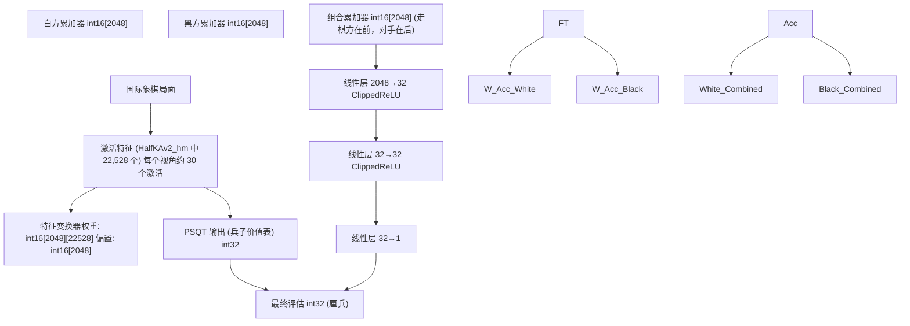
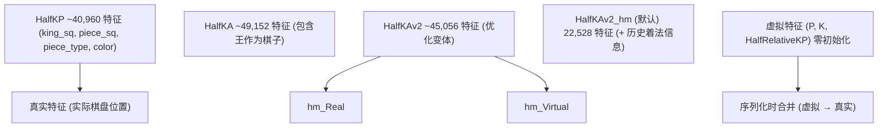
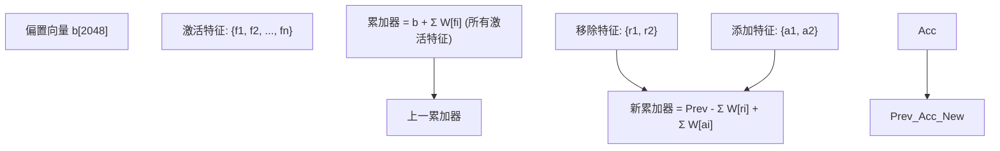
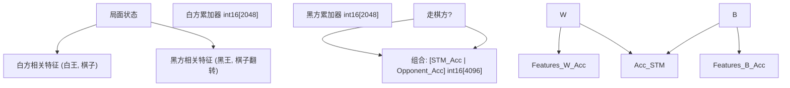
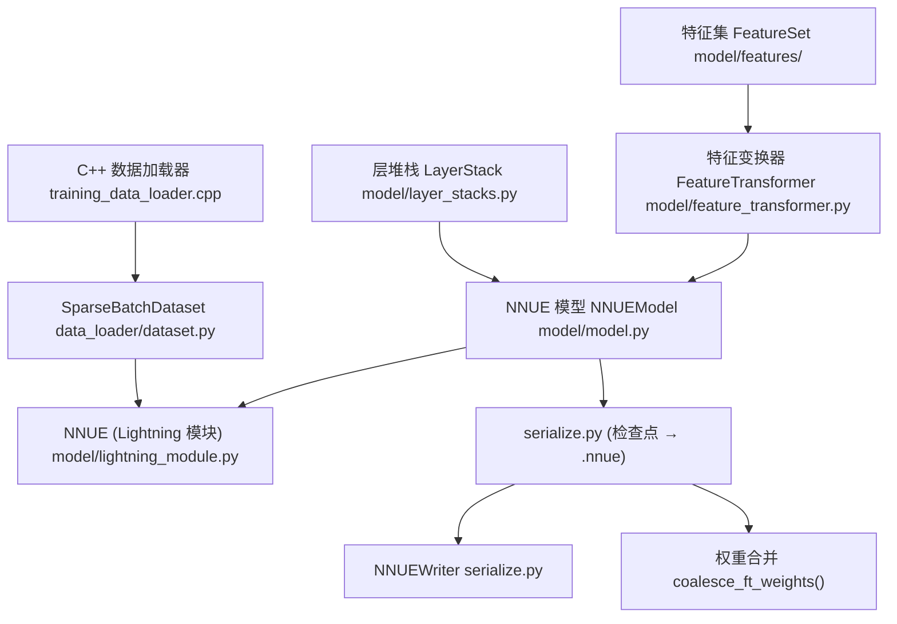
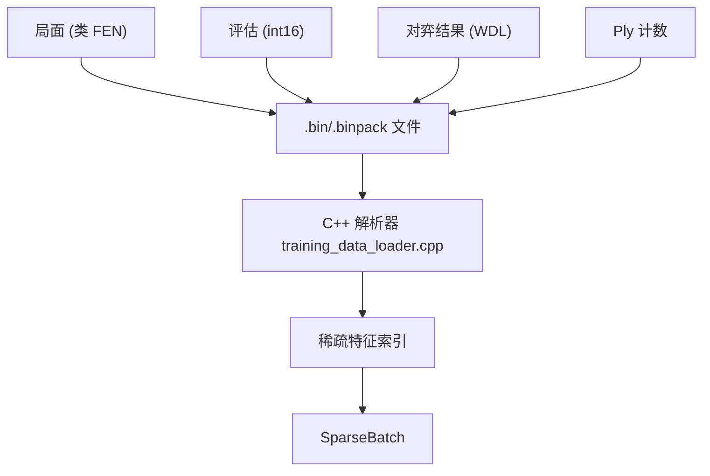

# 什么是 NNUE

-   [docs/img/SFNNv4\_architecture.drawio](https://github.com/Chesszyh/nnue-pytorch/blob/024b2064/docs/img/SFNNv4_architecture.drawio)
-   [docs/img/SFNNv7\_architecture.drawio](https://github.com/Chesszyh/nnue-pytorch/blob/024b2064/docs/img/SFNNv7_architecture.drawio)
-   [docs/img/SFNNv7\_architecture\_detailed.drawio](https://github.com/Chesszyh/nnue-pytorch/blob/024b2064/docs/img/SFNNv7_architecture_detailed.drawio)
-   [docs/img/SFNNv7\_architecture\_detailed\_v2.drawio](https://github.com/Chesszyh/nnue-pytorch/blob/024b2064/docs/img/SFNNv7_architecture_detailed_v2.drawio)
-   [docs/nnue.md](https://github.com/Chesszyh/nnue-pytorch/blob/024b2064/docs/nnue.md)

本页面提供了关于 NNUE (Efficiently Updatable Neural Network，高效可更新神经网络) 架构、其核心设计原则以及在本仓库中的实现的详细技术介绍。有关设置训练环境的信息，请参阅 [环境设置](#1.2)。有关模型架构实现的详细信息，请参阅 [模型架构](#4)。

## 概览

NNUE (ƎUИИ - "Efficiently Updatable Neural Network") 是一种专门为具有极低延迟要求的实时棋盘游戏评估而设计的神经网络架构。它最初由 Yu Nasu 发明用于将棋（Shogi），并于 2018 年 5 月集成到 YaneuraOu 中，随后于 2019 年 6 月由 Hisayori Noda 移植到 Stockfish 国际象棋引擎中。

NNUE 通过利用国际象棋局面的三个关键属性，实现了每个线程每秒数百万次的评估：

1.  **稀疏输入 (Sparse inputs)**：在任何局面下，只有极少部分的可能特征是激活的
2.  **增量更新 (Incremental updates)**：连续的局面仅相差几个特征
3.  **整数量化 (Integer quantization)**：所有计算都可以使用低精度整数算术执行

来源：[docs/nnue.md146-161](https://github.com/Chesszyh/nnue-pytorch/blob/024b2064/docs/nnue.md#L146-L161)

## 核心设计原则

NNUE 基于以下基本原则运行，这些原则使其区别于传统的神经网络：

| 原则 | 描述 | 影响 |
| --- | --- | --- |
| **稀疏输入** | 网络输入具有约 0.1% 的稀疏度（40,000+ 个特征中仅 30-40 个激活） | 允许巨大的第一层而无需计算惩罚 |
| **最小输入变化** | 每一步平均仅改变 2-4 个特征 | 允许增量累加器更新，而不是完全评估 |
| **量化推理** | 所有操作使用 int8/int16/int32 算术 | 最大化 CPU SIMD 吞吐量 (AVX2/AVX-512) |
| **浅层架构** | 通常总共 2-4 层 | 最小化量化误差累积 |

来源：[docs/nnue.md146-165](https://github.com/Chesszyh/nnue-pytorch/blob/024b2064/docs/nnue.md#L146-L165)

## 高层架构

NNUE 架构由一个大型稀疏第一层（特征变换器，Feature Transformer）后跟小型密集层（层堆栈，Layer Stacks）组成：


来源：[docs/nnue.md262-347](https://github.com/Chesszyh/nnue-pytorch/blob/024b2064/docs/nnue.md#L262-L347) [docs/img/SFNNv7\_architecture.drawio1-100](https://github.com/Chesszyh/nnue-pytorch/blob/024b2064/docs/img/SFNNv7_architecture.drawio#L1-L100)

## 特征集

NNUE 使用 **因子化特征集 (factorized feature sets)**，从双方视角表示棋盘状态。最常见的特征集有：


每个特征是一个表示棋子相对于王的位置的元组。对于 HalfKP：

-   `(our_king_square, piece_square, piece_type, piece_color)`
-   `piece_type` ∈ {pawn, knight, bishop, rook, queen} (王除外)
-   特征索引：`piece_square + (piece_type * 2 + piece_color + king_square * 10) * 64`

来源：[docs/nnue.md300-347](https://github.com/Chesszyh/nnue-pytorch/blob/024b2064/docs/nnue.md#L300-L347) [model/features/](https://github.com/Chesszyh/nnue-pytorch/blob/024b2064/model/features/)

## 累加器：高效增量更新

**累加器 (accumulator)** 是实现 NNUE 效率的核心创新。NNUE 不会为每个局面重新计算第一层，而是维护累加状态并增量更新它：


**刷新 (Refresh) vs 更新 (Update) 操作：**

| 操作 | 何时使用 | 代价 | 实现 |
| --- | --- | --- | --- |
| **刷新 (Refresh)** | 王移动，第一次评估 | O(num\_active\_features) | `refresh_accumulator()` 见 [docs/nnue.md393-412](https://github.com/Chesszyh/nnue-pytorch/blob/024b2064/docs/nnue.md#L393-L412) |
| **更新 (Update)** | 普通移动（非王） | O(num\_changed\_features) | `update_accumulator()` 见 [docs/nnue.md414-448](https://github.com/Chesszyh/nnue-pytorch/blob/024b2064/docs/nnue.md#L414-L448) |

每步平均特征变化：**~2.5** (一个棋子移动，可能有一个被吃)。

来源：[docs/nnue.md287-450](https://github.com/Chesszyh/nnue-pytorch/blob/024b2064/docs/nnue.md#L287-L450)

## 双视角架构

NNUE 维护 **两个独立的累加器**，每个玩家视角一个：


**视角处理选项：**

1.  **每个视角独立权重**：模型更大，学习特定颜色的模式
2.  **共享权重带方向**：黑方的棋盘状态被镜像/旋转

本仓库默认使用 **独立权重**。组合累加器始终将走棋方的视角排在前面，允许网络学习节奏 (tempo)。

来源：[docs/nnue.md311-347](https://github.com/Chesszyh/nnue-pytorch/blob/024b2064/docs/nnue.md#L311-L347)

## 量化方案

NNUE 在整个推理过程中使用定点整数算术：

| 层类型 | 权重类型 | 偏置类型 | 激活类型 | 缩放因子 |
| --- | --- | --- | --- | --- |
| 特征变换器 | `int16` | `int16` | `int16` | 127 |
| 层堆栈线性层 | `int8` | `int32` | `int8` | 127 |
| PSQT | `int32` | `int32` | `int32` | 9600 (600×16) |

量化方案表示为 `FP<type, scale>`，其中：

-   `type`: 整数类型 (i8, i16, i32)
-   `scale`: 定点缩放因子

例如，`FP<i16, 127>` 意味着浮点值 `x` 存储为 `int16(x * 127)`。

**量化感知训练 (Quantization-Aware Training)**：训练保持 float32 权重，但在训练期间使用 `WeightClippingCallback` 将其截断到量化边界。详情请参阅 [量化系统](#4.5)。

来源：[docs/nnue.md162-164](https://github.com/Chesszyh/nnue-pytorch/blob/024b2064/docs/nnue.md#L162-L164) [docs/nnue.md80-165](https://github.com/Chesszyh/nnue-pytorch/blob/024b2064/docs/nnue.md#L80-L165)

## 本仓库中的 NNUE 模型组件

本仓库中的 NNUE 实现组织为以下关键组件：


**关键类及其作用：**

| 类/模块 | 位置 | 目的 |
| --- | --- | --- |
| `FeatureSet` | [model/features/](https://github.com/Chesszyh/nnue-pytorch/blob/024b2064/model/features/)(多个) | 定义特征因子化 (HalfKP, HalfKAv2\_hm 等) |
| `FeatureTransformer` | [model/feature\_transformer.py](https://github.com/Chesszyh/nnue-pytorch/blob/024b2064/model/feature_transformer.py) | 带有自定义 CUDA 内核的稀疏线性层 |
| `LayerStack` | [model/layer\_stacks.py](https://github.com/Chesszyh/nnue-pytorch/blob/024b2064/model/layer_stacks.py) | 支持分桶的密集层 |
| `NNUEModel` | [model/model.py](https://github.com/Chesszyh/nnue-pytorch/blob/024b2064/model/model.py) | 结合 FT + LS + PSQT 的完整模型 |
| `NNUE` | [model/lightning\_module.py](https://github.com/Chesszyh/nnue-pytorch/blob/024b2064/model/lightning_module.py) | 用于训练的 PyTorch Lightning 包装器 |
| `SparseBatchDataset` | [data\_loader/dataset.py](https://github.com/Chesszyh/nnue-pytorch/blob/024b2064/data_loader/dataset.py) | C++ 数据加载器的 Python 接口 |
| `NNUEWriter` | [serialize.py](https://github.com/Chesszyh/nnue-pytorch/blob/024b2064/serialize.py) | 写入量化的二进制 .nnue 格式 |

来源：[model/model.py](https://github.com/Chesszyh/nnue-pytorch/blob/024b2064/model/model.py) [model/feature\_transformer.py](https://github.com/Chesszyh/nnue-pytorch/blob/024b2064/model/feature_transformer.py) [model/lightning\_module.py](https://github.com/Chesszyh/nnue-pytorch/blob/024b2064/model/lightning_module.py) [serialize.py](https://github.com/Chesszyh/nnue-pytorch/blob/024b2064/serialize.py)

## 训练数据格式

NNUE 模型使用具有以下结构的二进制打包对弈数据进行训练：


数据加载器提取：

-   每个视角的 **激活特征索引**
-   **评估** (厘兵分数)
-   **游戏结果** (胜/平/负)

这些被转换为稀疏张量以进行高效的 GPU 训练。有关详细信息，请参阅 [训练数据格式](#3.1)。

来源：[halfkp\_1024x2-8-32asm/training\_data\_loader.cpp](https://github.com/Chesszyh/nnue-pytorch/blob/024b2064/halfkp_1024x2-8-32asm/training_data_loader.cpp) [data\_loader/dataset.py](https://github.com/Chesszyh/nnue-pytorch/blob/024b2064/data_loader/dataset.py)

## 性能特征

NNUE 通过多项优化实现其速度：

| 优化 | 技术 | 影响 |
| --- | --- | --- |
| **稀疏第一层** | 仅处理激活特征 | ~30 列而不是 40,960 |
| **累加器更新** | 增量而不是完全刷新 | ~2-4 特征更新而不是 ~30 |
| **SIMD 指令** | 用于 int8/int16 操作的 AVX2/AVX-512 | 每条指令 16-32 个操作 |
| **低精度** | int8/int16 算术 | 比 float32 更高的吞吐量 |

**推理速度：** 现代 CPU 上每个线程每秒数百万次评估。

**模型大小：** 典型的 Stockfish NNUE 压缩后约为 20-40MB。

来源：[docs/nnue.md154-161](https://github.com/Chesszyh/nnue-pytorch/blob/024b2064/docs/nnue.md#L154-L161) [docs/nnue.md269-286](https://github.com/Chesszyh/nnue-pytorch/blob/024b2064/docs/nnue.md#L269-L286)

## 与 Stockfish 的关系

本仓库训练的 NNUE 模型旨在由 Stockfish 国际象棋引擎加载：

1.  **训练**：PyTorch 使用 float32 训练，并进行量化感知截断
2.  **序列化**：[serialize.py](https://github.com/Chesszyh/nnue-pytorch/blob/024b2064/serialize.py) 转换为量化二进制格式
3.  **部署**：Stockfish 加载 `.nnue` 文件并执行整数推理

Stockfish 中的评估流程：

```
局面 (Position) → 激活特征 (Active Features) → 累加器更新 (Accumulator Update) → 密集层 (Dense Layers) → 评估 (Evaluation)
```
有关与 Stockfish 兼容的文件格式规范，请参阅 [NNUE 二进制格式](#5.2)。

来源：[docs/nnue.md1-143](https://github.com/Chesszyh/nnue-pytorch/blob/024b2064/docs/nnue.md#L1-L143) [serialize.py](https://github.com/Chesszyh/nnue-pytorch/blob/024b2064/serialize.py)