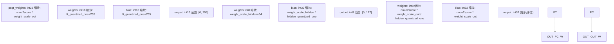
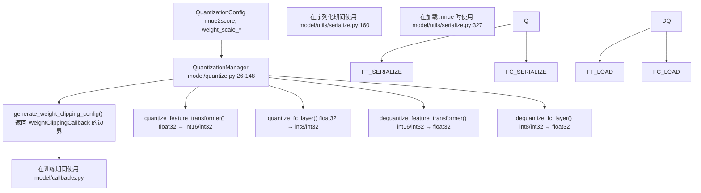
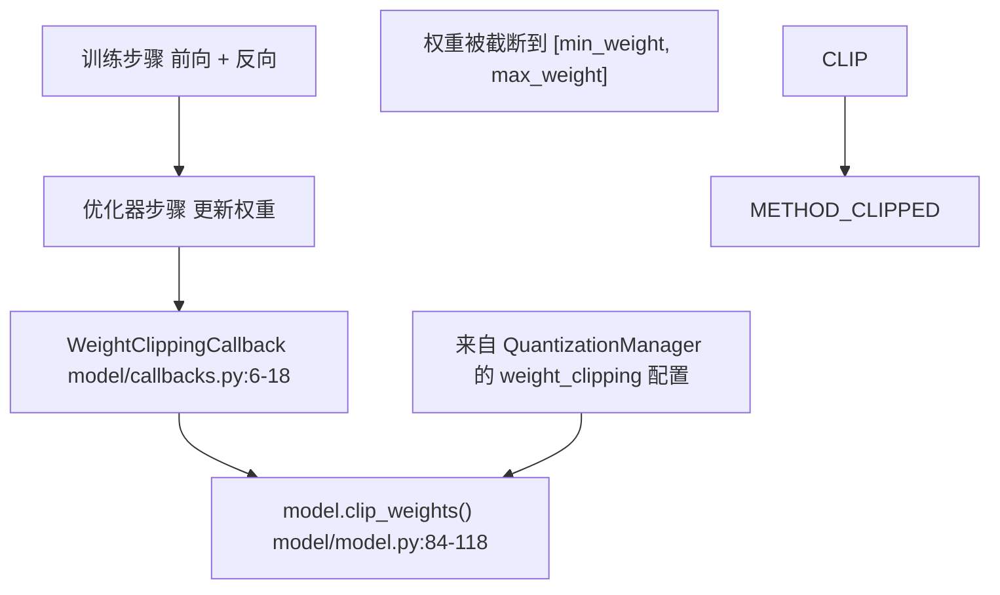
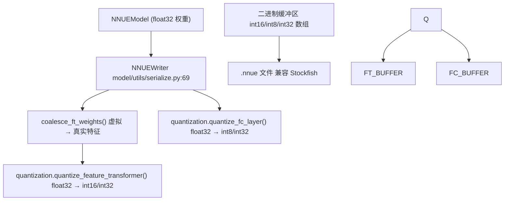

# 量化系统

-   [docs/img/SFNNv4\_architecture.drawio](https://github.com/Chesszyh/nnue-pytorch/blob/024b2064/docs/img/SFNNv4_architecture.drawio)
-   [docs/nnue.md](https://github.com/Chesszyh/nnue-pytorch/blob/024b2064/docs/nnue.md)
-   [model/callbacks.py](https://github.com/Chesszyh/nnue-pytorch/blob/024b2064/model/callbacks.py)
-   [model/features/\_\_init\_\_.py](https://github.com/Chesszyh/nnue-pytorch/blob/024b2064/model/features/__init__.py)
-   [model/features/full\_threats.py](https://github.com/Chesszyh/nnue-pytorch/blob/024b2064/model/features/full_threats.py)
-   [model/model.py](https://github.com/Chesszyh/nnue-pytorch/blob/024b2064/model/model.py)
-   [model/modules/layer\_stacks.py](https://github.com/Chesszyh/nnue-pytorch/blob/024b2064/model/modules/layer_stacks.py)
-   [model/quantize.py](https://github.com/Chesszyh/nnue-pytorch/blob/024b2064/model/quantize.py)
-   [model/utils/coalesce\_weights.py](https://github.com/Chesszyh/nnue-pytorch/blob/024b2064/model/utils/coalesce_weights.py)
-   [model/utils/serialize.py](https://github.com/Chesszyh/nnue-pytorch/blob/024b2064/model/utils/serialize.py)

本页面记录了量化系统，该系统将浮点 NNUE 模型转换为低精度整数格式，以实现高效推理。量化对于 NNUE 评估速度至关重要，它使用整数算术 (int8/int16/int32) 代替浮点运算，实现了每秒数百万次的评估。

有关整体模型架构的信息，请参阅 [NNUE 网络结构](#4.1)。有关应用量化的模型序列化的详细信息，请参阅 [检查点转换](#5.1) 和 [NNUE 二进制格式](#5.2)。

## 量化概览

NNUE 网络设计为在推理期间在量化整数域中运行，而训练在 float32 中进行。量化系统通过以下方式连接这两种表示：

1.  **定义缩放因子**：将浮点范围映射到整数范围
2.  **训练期间截断权重**：保持在可量化的边界内
3.  **序列化和加载期间的量化/反量化**：转换权重
4.  **考虑量化误差**：在训练期间的前向传播中

量化方案对不同层使用不同的整数类型，以平衡精度和性能：

| 层类型 | 权重类型 | 偏置类型 | 激活输出 |
| --- | --- | --- | --- |
| 特征变换器 | int16 | int16 | int16 (截断到 \[0, 255\]) |
| FC 隐藏层 | int8 | int32 | int8 (截断到 \[0, 127\]) |
| FC 输出层 | int8 | int32 | int32 |

**图表：各层量化数据类型**


来源：[docs/nnue.md80-164](https://github.com/Chesszyh/nnue-pytorch/blob/024b2064/docs/nnue.md#L80-L164) [model/quantize.py17-148](https://github.com/Chesszyh/nnue-pytorch/blob/024b2064/model/quantize.py#L17-L148)

## 量化配置

`QuantizationConfig` 数据类定义了量化过程中使用的缩放因子：

**QuantizationConfig 参数：**

| 参数 | 默认值 | 描述 |
| --- | --- | --- |
| `nnue2score` | 600.0 | 将网络输出转换为厘兵评估的缩放因子 |
| `weight_scale_hidden` | 64.0 | 隐藏层 int8 量化的权重缩放 |
| `weight_scale_out` | 16.0 | 输出层量化的权重缩放 |
| `ft_quantized_one` | 255.0 | 特征变换器激活范围 (1.0 → 255) |
| `hidden_quantized_one` | 127.0 | 隐藏层激活范围 (1.0 → 127) |

这些参数决定了量化值的数值范围和精度。默认值针对 Stockfish 兼容性进行了调整，并在精度和防止溢出之间取得了平衡。

来源：[model/quantize.py17-24](https://github.com/Chesszyh/nnue-pytorch/blob/024b2064/model/quantize.py#L17-L24)

## QuantizationManager

`QuantizationManager` 类处理所有量化操作。它使用 `QuantizationConfig` 实例化，并提供以下方法：

-   生成用于训练的权重截断边界
-   将权重/偏置量化为整数格式
-   将权重/偏置反量化回 float32

**图表：QuantizationManager 集成**


来源：[model/quantize.py26-148](https://github.com/Chesszyh/nnue-pytorch/blob/024b2064/model/quantize.py#L26-L148) [model/model.py34-35](https://github.com/Chesszyh/nnue-pytorch/blob/024b2064/model/model.py#L34-L35) [model/callbacks.py6-18](https://github.com/Chesszyh/nnue-pytorch/blob/024b2064/model/callbacks.py#L6-L18)

### 计算的最大权重

`QuantizationManager` 根据配置计算最大允许权重：

```
self.max_hidden_weight = hidden_quantized_one / weight_scale_hidden
# 127 / 64 ≈ 1.984
self.max_out_weight = (hidden_quantized_one * hidden_quantized_one) / (nnue2score * weight_scale_out)
# (127 * 127) / (600 * 16) ≈ 1.68
```
这些边界确保权重在转换为 int8/int16 时不会溢出。

来源：[model/quantize.py34-38](https://github.com/Chesszyh/nnue-pytorch/blob/024b2064/model/quantize.py#L34-L38)

## 特征变换器量化

特征变换器的权重和偏置都使用 int16，并具有特殊的缩放因子 `ft_quantized_one = 255.0`：

**量化公式：**

```
quantized_weight = round(float_weight * 255.0) as int16
quantized_bias = round(float_bias * 255.0) as int16
```
**PSQT 权重**（兵子价值表值）使用不同的缩放：

```
quantized_psqt = round(float_psqt * nnue2score * weight_scale_out) as int32
                = round(float_psqt * 600 * 16) as int32
```
特征变换器的输出被截断到 \[0, 255\]，以匹配推理期间的量化表示。

**实现：**

[model/quantize.py62-91](https://github.com/Chesszyh/nnue-pytorch/blob/024b2064/model/quantize.py#L62-L91)

```
def quantize_feature_transformer(self, bias, weight, psqt_weight, callback):
    bias = bias.mul(self.ft_quantized_one).round().to(torch.int16)
    weight = weight.mul(self.ft_quantized_one).round().to(torch.int16)
    psqt_weight = (psqt_weight.mul(self.nnue2score * self.weight_scale_out)
                   .round().to(torch.int32))
    return bias, weight, psqt_weight
```
来源：[model/quantize.py62-91](https://github.com/Chesszyh/nnue-pytorch/blob/024b2064/model/quantize.py#L62-L91) [model/utils/serialize.py144-174](https://github.com/Chesszyh/nnue-pytorch/blob/024b2064/model/utils/serialize.py#L144-L174)

## 全连接层量化

全连接层权重使用 int8，偏置使用 int32。隐藏层和输出层的缩放因子不同。

**隐藏层量化：**

```
kWeightScale = weight_scale_hidden = 64.0
kBiasScale = weight_scale_hidden * hidden_quantized_one = 64 * 127 = 8128

quantized_weight = round(clamp(float_weight, -127/64, 127/64) * 64) as int8
quantized_bias = round(float_bias * 8128) as int32
```
**输出层量化：**

```
kWeightScale = (nnue2score * weight_scale_out) / hidden_quantized_one
             = (600 * 16) / 127 ≈ 75.59

kBiasScale = nnue2score * weight_scale_out = 600 * 16 = 9600

quantized_weight = round(clamp(float_weight, -max, max) * 75.59) as int8
quantized_bias = round(float_bias * 9600) as int32
```
截断防止了转换为 int8 时的溢出（范围：-128 到 127）。

**实现：**

[model/quantize.py93-127](https://github.com/Chesszyh/nnue-pytorch/blob/024b2064/model/quantize.py#L93-L127)

```
def quantize_fc_layer(self, bias, weight, output_layer=False, callback):
    kWeightScale = kWeightScaleOut if output_layer else kWeightScaleHidden
    kBiasScale = kBiasScaleOut if output_layer else kBiasScaleHidden
    kMaxWeight = self.hidden_quantized_one / kWeightScale
    
    bias = bias.mul(kBiasScale).round().to(torch.int32)
    weight = (weight.clamp(-kMaxWeight, kMaxWeight)
              .mul(kWeightScale).round().to(torch.int8))
    return bias, weight
```
来源：[model/quantize.py93-127](https://github.com/Chesszyh/nnue-pytorch/blob/024b2064/model/quantize.py#L93-L127) [model/utils/serialize.py176-213](https://github.com/Chesszyh/nnue-pytorch/blob/024b2064/model/utils/serialize.py#L176-L213)

## 训练期间的权重截断

为了确保权重在训练期间保持可量化，模型在每个训练批次后使用 `WeightClippingCallback` 截断权重。这防止梯度将权重推到有效的量化范围之外。

**图表：权重截断流程**


权重截断配置由 `QuantizationManager.generate_weight_clipping_config()` 生成：

[model/quantize.py40-60](https://github.com/Chesszyh/nnue-pytorch/blob/024b2064/model/quantize.py#L40-L60)

```
def generate_weight_clipping_config(self, model):
    return [
        {
            "params": [model.layer_stacks.l1.linear.weight],
            "min_weight": -self.max_hidden_weight,
            "max_weight": self.max_hidden_weight,
            "virtual_params": model.layer_stacks.l1.factorized_linear.weight,
        },
        {
            "params": [model.layer_stacks.l2.linear.weight],
            "min_weight": -self.max_hidden_weight,
            "max_weight": self.max_hidden_weight,
        },
        {
            "params": [model.layer_stacks.output.linear.weight],
            "min_weight": -self.max_out_weight,
            "max_weight": self.max_out_weight,
        },
    ]
```
截断在 `NNUEModel.clip_weights()` 中应用：

[model/model.py84-118](https://github.com/Chesszyh/nnue-pytorch/blob/024b2064/model/model.py#L84-L118)

对于具有虚拟特征的层（因子化层），截断考虑了虚拟参数的贡献，以避免过度约束真实权重。

来源：[model/model.py84-118](https://github.com/Chesszyh/nnue-pytorch/blob/024b2064/model/model.py#L84-L118) [model/callbacks.py6-18](https://github.com/Chesszyh/nnue-pytorch/blob/024b2064/model/callbacks.py#L6-L18) [model/quantize.py40-60](https://github.com/Chesszyh/nnue-pytorch/blob/024b2064/model/quantize.py#L40-L60)

## 序列化期间的量化

当将训练好的模型转换为 `.nnue` 格式时，`NNUEWriter` 使用 `QuantizationManager` 来量化所有权重和偏置：

**图表：序列化量化流水线**


量化过程包括可选的直方图回调，以检查量化值的分布：

[model/utils/serialize.py153-162](https://github.com/Chesszyh/nnue-pytorch/blob/024b2064/model/utils/serialize.py#L153-L162)

```
def histogram_callback(bias, weight, psqt_weight):
    ascii_hist("ft bias:", bias.numpy())
    ascii_hist("ft weight:", weight.numpy())
    ascii_hist("ft psqt weight:", psqt_weight.numpy())

bias, weight, psqt_weight = model.quantization.quantize_feature_transformer(
    bias, weight, psqt_weight, histogram_callback)
```
对于全连接层，回调还会报告截断统计信息：

[model/utils/serialize.py183-196](https://github.com/Chesszyh/nnue-pytorch/blob/024b2064/model/utils/serialize.py#L183-L196)

```
def histogram_callback(bias, weight, clipped, total_elements, clipped_max, kMaxWeight):
    ascii_hist("fc bias:", bias.numpy())
    print("layer has {}/{} clipped weights. Exceeding by {} the maximum {}.".format(
        clipped, total_elements, clipped_max, kMaxWeight))
    ascii_hist("fc weight:", weight.numpy())
```
来源：[model/utils/serialize.py69-217](https://github.com/Chesszyh/nnue-pytorch/blob/024b2064/model/utils/serialize.py#L69-L217) [model/utils/coalesce\_weights.py7-19](https://github.com/Chesszyh/nnue-pytorch/blob/024b2064/model/utils/coalesce_weights.py#L7-L19)

## 模型加载期间的反量化

当将 `.nnue` 文件加载回 PyTorch 格式时，`NNUEReader` 使用逆操作对权重进行反量化：

**特征变换器反量化：**

```
float_weight = int16_weight / ft_quantized_one
float_bias = int16_bias / ft_quantized_one
float_psqt = int32_psqt / (nnue2score * weight_scale_out)
```
**FC 层反量化：**

```
float_weight = int8_weight / kWeightScale
float_bias = int32_bias / kBiasScale
```
[model/quantize.py81-91](https://github.com/Chesszyh/nnue-pytorch/blob/024b2064/model/quantize.py#L81-L91) 和 [model/quantize.py129-147](https://github.com/Chesszyh/nnue-pytorch/blob/024b2064/model/quantize.py#L129-L147)

这允许在 PyTorch 中对预训练网络进行微调或分析。

来源：[model/quantize.py81-91](https://github.com/Chesszyh/nnue-pytorch/blob/024b2064/model/quantize.py#L81-L91) [model/quantize.py129-147](https://github.com/Chesszyh/nnue-pytorch/blob/024b2064/model/quantize.py#L129-L147) [model/utils/serialize.py327-350](https://github.com/Chesszyh/nnue-pytorch/blob/024b2064/model/utils/serialize.py#L327-L350)

## 特殊情况：Full\_Threats 特征集

`Full_Threats` 特征集使用混合量化方案，其中威胁特征（前 79856 个特征）使用 int8 量化，而剩余的 HalfKA 风格特征使用 int16：

[model/utils/serialize.py167-174](https://github.com/Chesszyh/nnue-pytorch/blob/024b2064/model/utils/serialize.py#L167-L174)

```
if model.feature_set.name.startswith("Full_Threats"):
    threat_weight = weight[:79856].to(torch.int8)
    psq_weight = weight[79856:]
    self.write_tensor(threat_weight.flatten().numpy())
    self.write_tensor(psq_weight.flatten().numpy(), ft_compression)
```
威胁权重在训练期间也会被更积极地截断：

[model/model.py119-127](https://github.com/Chesszyh/nnue-pytorch/blob/024b2064/model/model.py#L119-L127)

```
def clip_threat_weights(self):
    if self.feature_set.name.startswith("Full_Threats"):
        p = self.input.weight[0:79856]
        min_weight = -128 / 255
        max_weight = 127 / 255
        p.data.clamp_(min_weight, max_weight)
```
来源：[model/model.py119-127](https://github.com/Chesszyh/nnue-pytorch/blob/024b2064/model/model.py#L119-L127) [model/utils/serialize.py167-174](https://github.com/Chesszyh/nnue-pytorch/blob/024b2064/model/utils/serialize.py#L167-L174) [model/features/full\_threats.py1-185](https://github.com/Chesszyh/nnue-pytorch/blob/024b2064/model/features/full_threats.py#L1-L185)

## 总结

量化系统提供：

1.  **一致的量化方案**，匹配 Stockfish 的预期
2.  **训练期间的权重截断**，以维持量化兼容性
3.  **无缝转换**，在 float32（训练）和 int8/int16/int32（推理）之间
4.  **层特定的缩放因子**，针对精度和性能进行了优化
5.  **支持混合量化方案**（例如，Full\_Threats）

关键类包括：

-   `QuantizationConfig`: 配置参数
-   `QuantizationManager`: 核心量化逻辑
-   `WeightClippingCallback`: 训练时权重边界强制执行
-   `NNUEWriter`/`NNUEReader`: 带量化的序列化

来源：[model/quantize.py1-148](https://github.com/Chesszyh/nnue-pytorch/blob/024b2064/model/quantize.py#L1-L148) [model/model.py1-209](https://github.com/Chesszyh/nnue-pytorch/blob/024b2064/model/model.py#L1-L209) [model/callbacks.py1-18](https://github.com/Chesszyh/nnue-pytorch/blob/024b2064/model/callbacks.py#L1-L18) [model/utils/serialize.py1-361](https://github.com/Chesszyh/nnue-pytorch/blob/024b2064/model/utils/serialize.py#L1-L361)