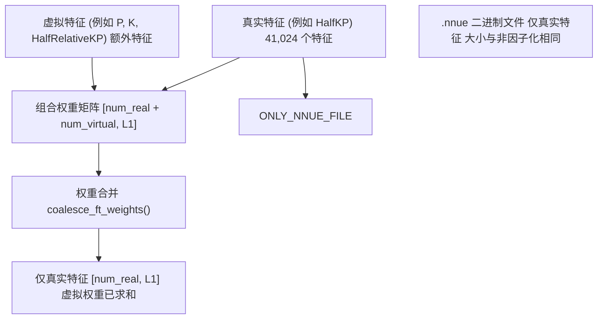
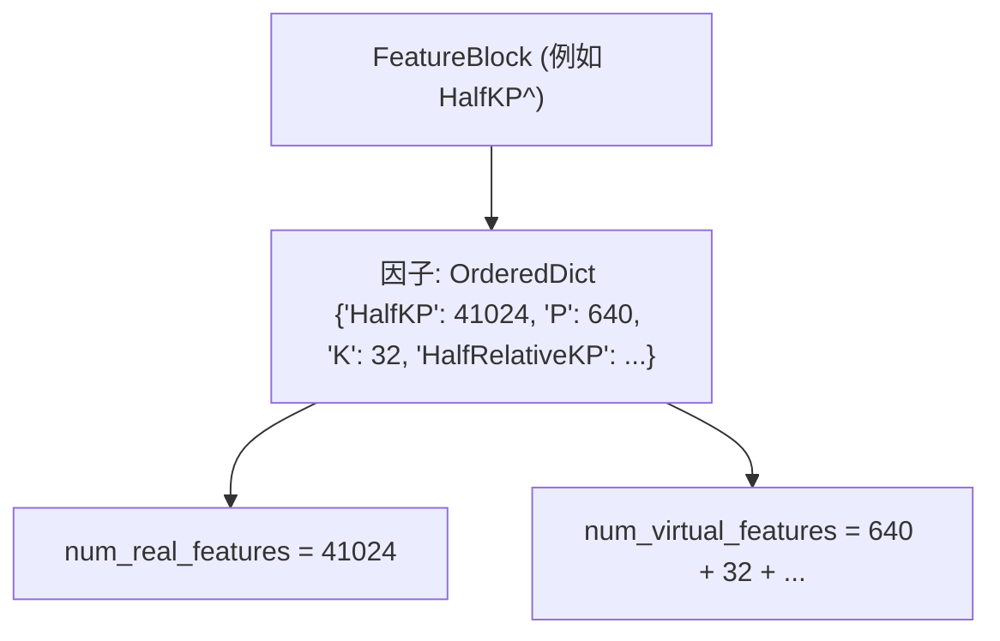
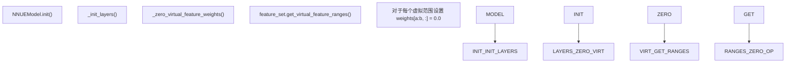
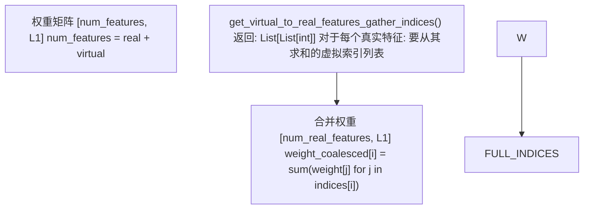
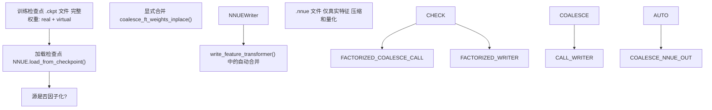
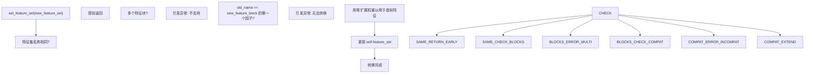

# 虚拟特征和因子化

-   [model/\_\_init\_\_.py](https://github.com/Chesszyh/nnue-pytorch/blob/024b2064/model/__init__.py)
-   [model/model.py](https://github.com/Chesszyh/nnue-pytorch/blob/024b2064/model/model.py)
-   [model/utils/\_\_init\_\_.py](https://github.com/Chesszyh/nnue-pytorch/blob/024b2064/model/utils/__init__.py)
-   [model/utils/coalesce\_weights.py](https://github.com/Chesszyh/nnue-pytorch/blob/024b2064/model/utils/coalesce_weights.py)
-   [model/utils/serialize.py](https://github.com/Chesszyh/nnue-pytorch/blob/024b2064/model/utils/serialize.py)
-   [serialize.py](https://github.com/Chesszyh/nnue-pytorch/blob/024b2064/serialize.py)
-   [visualize.py](https://github.com/Chesszyh/nnue-pytorch/blob/024b2064/visualize.py)
-   [visualize\_multi\_hist.py](https://github.com/Chesszyh/nnue-pytorch/blob/024b2064/visualize_multi_hist.py)

本页面记录了 NNUE 训练架构中的虚拟特征系统和因子化机制。虚拟特征是额外的特征表示，通过允许模型更有效地学习相关特征来加速训练。在训练期间，模型维护真实特征和虚拟特征，但在序列化时，虚拟特征被“合并”（求和）回真实特征，从而在部署的网络中没有参数开销。

有关特征集及其特性的信息，请参阅 [特征集](#4.2)。有关模型序列化的详细信息，请参阅 [模型序列化](#5)。

## 虚拟特征概览

虚拟特征是仅在训练期间存在的辅助特征表示。它们为模型提供了额外的自由度来学习相关模式，但在通过称为权重合并的过程转换为部署格式时被消除。

**关键特性：**

-   **零初始化**：虚拟特征权重从零开始，在训练期间学习
-   **仅限训练**：它们仅存在于训练模型中，不存在于最终的 `.nnue` 文件中
-   **序列化时合并**：在保存模型时，虚拟特征权重被求和到相应的真实特征中
-   **无推理开销**：部署的网络大小与没有虚拟特征训练的网络相同


**来源：** [model/model.py39-52](https://github.com/Chesszyh/nnue-pytorch/blob/024b2064/model/model.py#L39-L52) [model/utils/coalesce\_weights.py7-19](https://github.com/Chesszyh/nnue-pytorch/blob/024b2064/model/utils/coalesce_weights.py#L7-L19)

## 因子化命名约定

具有因子化的特征集通过名称中的 `^` 后缀来指示。例如：

| 基础特征集 | 因子化版本 | 添加的虚拟特征 |
| --- | --- | --- |
| `HalfKP` | `HalfKP^` | P, K, HalfRelativeKP |
| `HalfKAv2` | `HalfKAv2^` | 类似的因子化 |
| `HalfKAv2_hm` | `HalfKAv2_hm^` | 默认配置 |

因子化版本包含原始的真实特征和代表同一位置信息的子组件或替代表示的额外虚拟特征。


**来源：** [model/model.py128-175](https://github.com/Chesszyh/nnue-pytorch/blob/024b2064/model/model.py#L128-L175) `model/features/` 中的特征块实现

## 权重初始化和训练

在模型初始化期间，虚拟特征权重被显式归零，以确保它们开始时对模型的预测没有影响。这至关重要，因为虚拟特征被设计为帮助相关真实特征的学习表示。

### 初始化过程


归零操作在 [model/model.py43-52](https://github.com/Chesszyh/nnue-pytorch/blob/024b2064/model/model.py#L43-L52) 中执行：

```
def _zero_virtual_feature_weights(self):
    """
    我们将所有虚拟特征权重归零，因为不需要初始化它们；
    它们仅辅助相关特征的训练。
    """
    weights = self.input.weight
    with torch.no_grad():
        for a, b in self.feature_set.get_virtual_feature_ranges():
            weights[a:b, :] = 0.0
    self.input.weight = nn.Parameter(weights)
```
**来源：** [model/model.py39-52](https://github.com/Chesszyh/nnue-pytorch/blob/024b2064/model/model.py#L39-L52)

### 训练行为

在训练期间，真实和虚拟特征权重都通过梯度下降进行更新。优化器对它们一视同仁，允许网络在虚拟特征中学习有用的表示，这些表示与真实特征相关并支持真实特征。

**权重截断考量：**

量化感知的权重截断机制考虑了虚拟特征。当存在虚拟特征权重时，调整截断边界以确保当虚拟权重最终与真实权重合并（求和）时，结果保持在量化边界内。

参见 [model/model.py84-117](https://github.com/Chesszyh/nnue-pytorch/blob/024b2064/model/model.py#L84-L117) 中的 `clip_weights()` 实现，该实现通过 `virtual_params` 机制专门处理虚拟特征。

**来源：** [model/model.py84-117](https://github.com/Chesszyh/nnue-pytorch/blob/024b2064/model/model.py#L84-L117)

## 权重合并过程

权重合并是将虚拟特征权重组合回真实特征权重的过程。这发生在序列化时，产生一个仅包含真实特征的权重矩阵。

### 合并算法

合并过程使用由特征集的从虚拟到真实特征的映射定义的收集和求和操作：


核心实现在 [model/utils/coalesce\_weights.py7-19](https://github.com/Chesszyh/nnue-pytorch/blob/024b2064/model/utils/coalesce_weights.py#L7-L19)：

```
def coalesce_ft_weights(
    feature_set: FeatureSet, layer: BaseFeatureTransformer) -> torch.Tensor:
    weight = layer.weight.data
    indices = feature_set.get_virtual_to_real_features_gather_indices()
    weight_coalesced = weight.new_zeros(
        (feature_set.num_real_features, weight.shape[1])
    )
    for i_real, is_virtual in enumerate(indices):
        weight_coalesced[i_real, :] = sum(
            weight[i_virtual, :] for i_virtual in is_virtual
        )
    return weight_coalesced
```
**关键点：**

-   `indices` 是一个列表，其中 `indices[i]` 包含所有有助于真实特征 `i` 的特征索引（真实和虚拟）
-   对于真实特征，这通常包括特征本身加上相关的虚拟特征
-   求和操作组合所有贡献权重

**来源：** [model/utils/coalesce\_weights.py7-19](https://github.com/Chesszyh/nnue-pytorch/blob/024b2064/model/utils/coalesce_weights.py#L7-L19)

### 就地合并

对于内存效率至关重要的场景，存在一个就地变体：

```
def coalesce_ft_weights_inplace(
    feature_set: FeatureSet, layer: BaseFeatureTransformer) -> None:
    # 创建一个新的归零权重矩阵并替换 layer.weight.data
    # 参见 model/utils/coalesce_weights.py:22-32
```
**来源：** [model/utils/coalesce\_weights.py22-32](https://github.com/Chesszyh/nnue-pytorch/blob/024b2064/model/utils/coalesce_weights.py#L22-L32)

## 与序列化的集成

合并在模型序列化期间自动调用，以确保输出 `.nnue` 文件仅包含真实特征。

### 带有合并的序列化流水线


**来源：** [serialize.py118-152](https://github.com/Chesszyh/nnue-pytorch/blob/024b2064/serialize.py#L118-L152) [model/utils/serialize.py144-174](https://github.com/Chesszyh/nnue-pytorch/blob/024b2064/model/utils/serialize.py#L144-L174)

### 序列化代码流程

在 [serialize.py](https://github.com/Chesszyh/nnue-pytorch/blob/024b2064/serialize.py) 中，当准备优化或排列时：

```
# 第 122-124, 144-145 行
if not args.source.endswith(".nnue"):
    M.coalesce_ft_weights_inplace(nnue.model.feature_set, nnue.model.input)
    nnue.model.layer_stacks.coalesce_layer_stacks_inplace()
```
在 [model/utils/serialize.py144-174](https://github.com/Chesszyh/nnue-pytorch/blob/024b2064/model/utils/serialize.py#L144-L174) 中，`NNUEWriter.write_feature_transformer()` 方法自动合并：

```
# 第 149 行
all_weight = coalesce_ft_weights(model.feature_set, layer)
weight = all_weight[:, : model.L1]
psqt_weight = all_weight[:, model.L1 :]
```
**来源：** [serialize.py118-152](https://github.com/Chesszyh/nnue-pytorch/blob/024b2064/serialize.py#L118-L152) [model/utils/serialize.py144-174](https://github.com/Chesszyh/nnue-pytorch/blob/024b2064/model/utils/serialize.py#L144-L174)

## 动态特征集转换

模型支持在训练或加载期间从非因子化动态转换为因子化特征集。这对于迁移学习或从预训练的非因子化网络开始很有用。

### 转换算法

[model/model.py128-175](https://github.com/Chesszyh/nnue-pytorch/blob/024b2064/model/model.py#L128-L175) 中的 `set_feature_set()` 方法处理此转换：


转换检查当前特征块名称是否匹配新因子化特征块中的第一个因子。例如，允许从 `HalfKP` 转换为 `HalfKP^`，因为 `HalfKP` 是 `HalfKP^` 的 `factors` OrderedDict 中的第一个因子。

**来源：** [model/model.py128-175](https://github.com/Chesszyh/nnue-pytorch/blob/024b2064/model/model.py#L128-L175)

## 合并权重的可视化

可视化工具在显示之前自动合并权重，以显示将要部署的有效权重：

```
# visualize.py:42-44
weights = M.coalesce_ft_weights(self.model.feature_set, self.model.input)
weights = weights[:, : self.model.L1]
weights = weights.flatten().numpy()
```
这确保可视化反映实际部署的网络行为，而不是带有虚拟特征的训练时表示。

**来源：** [visualize.py40-52](https://github.com/Chesszyh/nnue-pytorch/blob/024b2064/visualize.py#L40-L52) [visualize\_multi\_hist.py91-96](https://github.com/Chesszyh/nnue-pytorch/blob/024b2064/visualize_multi_hist.py#L91-L96)

## 好处和用例

### 训练加速

虚拟特征允许网络学习分解表示。例如，在 `HalfKP^` 中：

-   真实特征：`HalfKP` (王位置 + 棋子位置)
-   虚拟特征：`P` (仅棋子), `K` (仅王), `HalfRelativeKP` (相对位置)

网络可以学习某些模式主要取决于棋子位置，而其他模式取决于王-棋子关系。这种分解通常会导致更快的收敛。

### 无推理成本

因为虚拟特征在序列化时合并：

-   最终的 `.nnue` 文件大小与非因子化网络相同
-   推理速度相同
-   所有训练优势在部署时都是“免费”的

### 兼容性

合并机制确保：

-   使用因子化训练的网络与期望非因子化特征的推理引擎兼容
-   部署网络中的特征集名称与基础特征集匹配（例如，`HalfKP`，而不是 `HalfKP^`）

**来源：** [model/model.py39-52](https://github.com/Chesszyh/nnue-pytorch/blob/024b2064/model/model.py#L39-L52) [model/utils/serialize.py144-174](https://github.com/Chesszyh/nnue-pytorch/blob/024b2064/model/utils/serialize.py#L144-L174)

## 总结表

| 方面 | 训练 | 序列化 | 部署 |
| --- | --- | --- | --- |
| **特征计数** | 真实 + 虚拟 | 虚拟合并到真实 | 仅真实 |
| **权重矩阵大小** | `[num_real + num_virtual, L1]` | 中间状态 | `[num_real, L1]` |
| **虚拟权重** | 通过梯度下降学习 | 求和到真实权重 | 不存在 |
| **内存开销** | 较高 (虚拟特征) | 转换期间临时 | 无 |
| **文件格式** | `.ckpt` (PyTorch) | `.pt` 或 `.nnue` | `.nnue` |
| **推理成本** | 不适用 | 不适用 | 与非因子化相同 |

**来源：** [model/model.py10-209](https://github.com/Chesszyh/nnue-pytorch/blob/024b2064/model/model.py#L10-L209) [model/utils/coalesce\_weights.py1-33](https://github.com/Chesszyh/nnue-pytorch/blob/024b2064/model/utils/coalesce_weights.py#L1-L33) [model/utils/serialize.py69-217](https://github.com/Chesszyh/nnue-pytorch/blob/024b2064/model/utils/serialize.py#L69-L217)