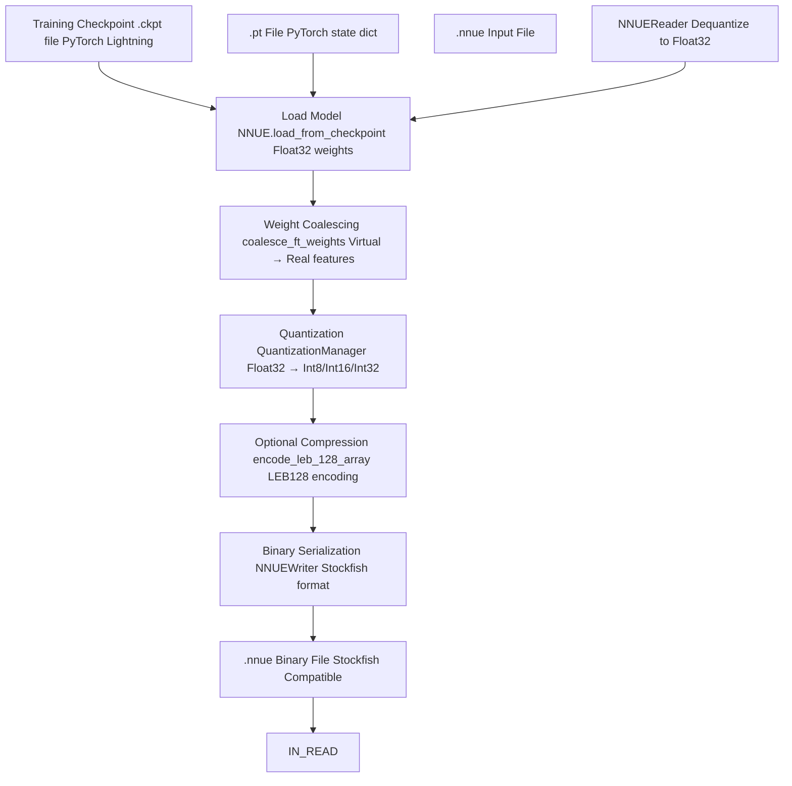
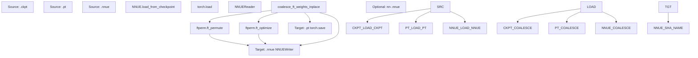
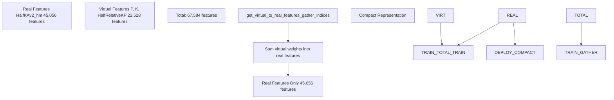
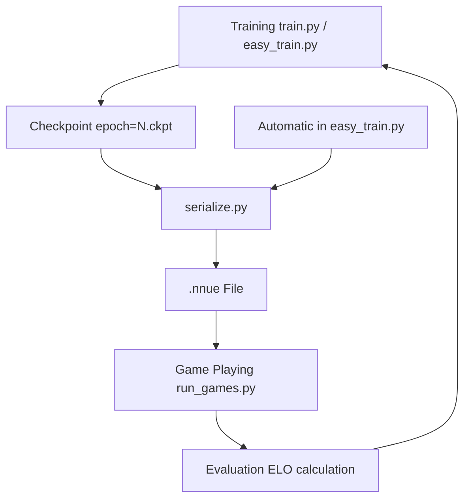

# 模型序列化 (Model Serialization)

-   [model/\_\_init\_\_.py](https://github.com/Chesszyh/nnue-pytorch/blob/024b2064/model/__init__.py)
-   [model/model.py](https://github.com/Chesszyh/nnue-pytorch/blob/024b2064/model/model.py)
-   [model/utils/\_\_init\_\_.py](https://github.com/Chesszyh/nnue-pytorch/blob/024b2064/model/utils/__init__.py)
-   [model/utils/coalesce\_weights.py](https://github.com/Chesszyh/nnue-pytorch/blob/024b2064/model/utils/coalesce_weights.py)
-   [model/utils/serialize.py](https://github.com/Chesszyh/nnue-pytorch/blob/024b2064/model/utils/serialize.py)
-   [serialize.py](https://github.com/Chesszyh/nnue-pytorch/blob/024b2064/serialize.py)
-   [visualize.py](https://github.com/Chesszyh/nnue-pytorch/blob/024b2064/visualize.py)
-   [visualize\_multi\_hist.py](https://github.com/Chesszyh/nnue-pytorch/blob/024b2064/visualize_multi_hist.py)

本文档涵盖了模型序列化系统，该系统处理训练检查点与可部署 NNUE 二进制文件之间的转换。序列化管道支持三种格式：PyTorch Lightning 检查点 (`.ckpt`)、PyTorch 状态字典 (`.pt`) 和兼容 Stockfish 的 NNUE 二进制文件 (`.nnue`)。这包括权重合并、量化、压缩以及可选的特征变换器优化。

关于量化方案本身的详细信息，请参阅 [量化系统 (Quantization System)](#4.5)。关于通过排列进行的特征变换器优化，请参阅 [特征变换器排列 (Feature Transformer Permutation)](#6.1)。关于序列化模型的可视化，请参阅 [模型可视化 (Model Visualization)](#5.4)。

## 转换管道概览

序列化系统将浮点训练检查点转换为适合国际象棋引擎快速推理的紧凑型整数/量化二进制文件。该管道处理几个关键的转换：


**来源：** [serialize.py1-186](https://github.com/Chesszyh/nnue-pytorch/blob/024b2064/serialize.py#L1-L186) [model/utils/serialize.py1-361](https://github.com/Chesszyh/nnue-pytorch/blob/024b2064/model/utils/serialize.py#L1-L361)

## 格式转换脚本

`serialize.py` 脚本为所有格式转换提供了命令行接口。它支持 `.ckpt`、`.pt` 和 `.nnue` 格式之间的双向转换。

### 命令行接口

| 参数 | 类型 | 描述 |
| --- | --- | --- |
| `source` | 位置参数 | 源文件（`.ckpt`、`.pt` 或 `.nnue`）|
| `target` | 位置参数 | 目标文件（`.pt` 或 `.nnue`）|
| `--out-sha` | 标志 | 根据内容哈希将输出命名为 `nn-<sha>.nnue` |
| `--description` | 字符串 | 嵌入到 `.nnue` 头部的描述字符串 |
| `--ft_compression` | 字符串 | 压缩方法：`none` 或 `leb128`（默认：`leb128`）|
| `--ft_perm` | 路径 | 应用预计算的特征变换器排列 |
| `--ft_optimize` | 标志 | 运行完整的特征变换器优化（耗时）|
| `--ft_optimize_data` | 路径 | 用于 FT 优化的数据集路径 |
| `--ft_optimize_count` | 整数 | 用于 FT 优化的局面数量（默认：10000）|
| `--l1` | 整数 | 特征变换器大小（必须与训练好的模型匹配）|

### 转换流程


**来源：** [serialize.py10-182](https://github.com/Chesszyh/nnue-pytorch/blob/024b2064/serialize.py#L10-L182)

### 加载模型

该脚本处理三种源格式：

**PyTorch Lightning 检查点 (`.ckpt`)：**

```
# serialize.py:83-91nnue = M.NNUE.load_from_checkpoint(    args.source,    feature_set=feature_set,    config=M.ModelConfig(L1=args.l1),    quantize_config=M.QuantizationConfig(),    map_location=torch.device("cpu"))
```
**PyTorch 状态字典 (`.pt`)：**

```
# serialize.py:92-93nnue = torch.load(args.source, weights_only=False)
```
**NNUE 二进制文件 (`.nnue`)：**

```
# serialize.py:94-104with open(args.source, 'rb') as f:    nnue = M.NNUE(feature_set, M.ModelConfig(L1=args.l1), M.QuantizationConfig())    reader = M.NNUEReader(f, feature_set, M.ModelConfig(L1=args.l1), M.QuantizationConfig())    nnue.model = reader.model
```
**来源：** [serialize.py83-106](https://github.com/Chesszyh/nnue-pytorch/blob/024b2064/serialize.py#L83-L106)

### 序列化前处理

在写入 `.nnue` 格式之前，脚本可能会执行权重合并和特征变换器优化：

**权重合并：** 当从分解后的特征集（带有虚拟特征）转换为紧凑的二进制格式时，这是必需的。此操作将虚拟特征权重求和到其对应的真实特征中。

```
# serialize.py:122-123, 144-145M.coalesce_ft_weights_inplace(nnue.model.feature_set, nnue.model.input)nnue.model.layer_stacks.coalesce_layer_stacks_inplace()
```
**特征变换器排列：** 重新排序特征变换器权重以最大化零值块，从而提高推理期间的 SIMD 效率。

```
# serialize.py:118-125if args.ft_perm is not None and target_is_nnue:    import ftperm    if not args.source.endswith('.nnue'):        M.coalesce_ft_weights_inplace(nnue.model.feature_set, nnue.model.input)        nnue.model.layer_stacks.coalesce_layer_stacks_inplace()    ftperm.ft_permute(nnue.model, args.ft_perm)
```
**来源：** [serialize.py115-152](https://github.com/Chesszyh/nnue-pytorch/blob/024b2064/serialize.py#L115-L152)

## NNUE 二进制格式结构

`.nnue` 二进制格式是神经网络的一种紧凑的、兼容 Stockfish 的表示形式。所有值都以小端字节序存储。

### 文件结构

```mermaid
flowchart TD
    FILE["NNUE Binary File"]
    HEADER["Header Version: 0x7AF32F20 Hash: Feature set + Architecture Description: UTF-8 string"]
    FT_SECTION["Feature Transformer Section Hash: feature_set.hash ^ (L1 * 2)"]
    FT_BIAS["FT Bias int16[L1] or compressed"]
    FT_WEIGHT["FT Weights int16[num_features][L1] or compressed"]
    FT_PSQT["PSQT Weights int32[num_features][num_psqt_buckets]"]
    FC_SECTIONS["FC Layer Sections (8 buckets)"]
    FC_HASH["FC Hash Architecture signature"]
    L1["L1 Layer Bias: int32[L2+1] Weight: int8[L2+1][L1*2] (padded to 32)"]
    L2["L2 Layer Bias: int32[L3] Weight: int8[L3][2*L2] (padded to 32)"]
    OUTPUT["Output Layer Bias: int32[1] Weight: int8[1][L3] (padded to 32)"]

    FILE --> HEADER
    FILE --> FT_SECTION
    FT --> SECTION_FT_BIAS
    FT --> SECTION_FT_WEIGHT
    FT --> SECTION_FT_PSQT
    FILE --> FC_SECTIONS
    FC --> SECTIONS_FC_HASH
    FC --> SECTIONS_L1
    FC --> SECTIONS_L2
    FC --> SECTIONS_OUTPUT
```


**来源：** [model/utils/serialize.py64-217](https://github.com/Chesszyh/nnue-pytorch/blob/024b2064/model/utils/serialize.py#L64-L217)

### 头部格式

头部包含版本信息、架构哈希和可选描述：

| 偏移量 | 类型 | 字段 | 描述 |
| --- | --- | --- | --- |
| 0x00 | uint32 | 版本 (Version) | 固定值：`0x7AF32F20` |
| 0x04 | uint32 | 哈希 (Hash) | `fc_hash ^ feature_set.hash ^ (L1 * 2)` |
| 0x08 | uint32 | 描述长度 | UTF-8 描述字符串的长度 |
| 0x0C | bytes | 描述 | UTF-8 编码的描述 |

```
# model/utils/serialize.py:121-128def write_header(self, model: NNUEModel, fc_hash: int, description: str) -> None:    self.int32(VERSION)  # version    self.int32(fc_hash ^ model.feature_set.hash ^ (model.L1 * 2))  # network hash    encoded_description = description.encode('utf-8')    self.int32(len(encoded_description))    self.buf.extend(encoded_description)
```
**来源：** [model/utils/serialize.py64-128](https://github.com/Chesszyh/nnue-pytorch/blob/024b2064/model/utils/serialize.py#L64-L128)

### 架构哈希

该文件使用加密哈希来确保架构兼容性：

```
# model/utils/serialize.py:98-119@staticmethoddef fc_hash(model: NNUEModel) -> int:    # InputSlice hash    prev_hash = 0xEC42E90D    prev_hash ^= model.L1 * 2        # Fully connected layers    layers = [model.layer_stacks.l1.linear, model.layer_stacks.l2.linear,               model.layer_stacks.output.linear]    for layer in layers:        layer_hash = 0xCC03DAE4        layer_hash += layer.out_features // model.num_ls_buckets        layer_hash ^= prev_hash >> 1        layer_hash ^= (prev_hash << 31) & 0xFFFFFFFF        if layer.out_features // model.num_ls_buckets != 1:            layer_hash = (layer_hash + 0x538D24C7) & 0xFFFFFFFF  # Clipped ReLU hash        prev_hash = layer_hash    return layer_hash
```
**来源：** [model/utils/serialize.py98-119](https://github.com/Chesszyh/nnue-pytorch/blob/024b2064/model/utils/serialize.py#L98-L119)

## 权重量化

序列化过程根据量化方案将浮点权重转换为整数类型：

| 层 | 权重类型 | 偏置类型 | 缩放因子 |
| --- | --- | --- | --- |
| 特征变换器 (Feature Transformer) | int16 | int16 | 127 |
| 特征变换器 (Full\_Threats 子集) | int8 | int16 | 127 |
| PSQT | int32 | n/a | 600 \* 127 |
| 全连接层 (FC Layers) | int8 | int32 | 127 |
| 输出层 (Output Layer) | int8 | int32 | 127 \* 9600 |

### 特征变换器量化

```
# model/utils/serialize.py:144-174def write_feature_transformer(self, model: NNUEModel, ft_compression: str) -> None:    layer = model.input    bias = layer.bias.data[:model.L1]        all_weight = coalesce_ft_weights(model.feature_set, layer)    weight = all_weight[:, :model.L1]    psqt_weight = all_weight[:, model.L1:]        bias, weight, psqt_weight = model.quantization.quantize_feature_transformer(        bias, weight, psqt_weight, histogram_callback    )        # Weights stored as [num_features][outputs]    self.write_tensor(bias.flatten().numpy(), ft_compression)        # Special handling for Full_Threats feature set    if model.feature_set.name.startswith('Full_Threats'):        threat_weight = weight[:79856].to(torch.int8)        psq_weight = weight[79856:]        self.write_tensor(threat_weight.flatten().numpy())        self.write_tensor(psq_weight.flatten().numpy(), ft_compression)    else:        self.write_tensor(weight.flatten().numpy(), ft_compression)        self.write_tensor(psqt_weight.flatten().numpy(), ft_compression)
```
**来源：** [model/utils/serialize.py144-174](https://github.com/Chesszyh/nnue-pytorch/blob/024b2064/model/utils/serialize.py#L144-L174)

### 全连接层量化

全连接层使用带有 32 元素输入填充的 int8 权重：

```
# model/utils/serialize.py:176-213def write_fc_layer(self, model: NNUEModel, layer: nn.Linear, is_output=False) -> None:    bias = layer.bias.data    weight = layer.weight.data        bias, weight = model.quantization.quantize_fc_layer(        bias, weight, is_output, histogram_callback    )        # FC inputs are padded to 32 elements by spec    num_input = weight.shape[1]    if num_input % 32 != 0:        num_input += 32 - (num_input % 32)        new_w = torch.zeros(weight.shape[0], num_input, dtype=torch.int8)        new_w[:, :weight.shape[1]] = weight        weight = new_w        self.buf.extend(bias.flatten().numpy().tobytes())    self.buf.extend(weight.flatten().numpy().tobytes())
```
**来源：** [model/utils/serialize.py176-213](https://github.com/Chesszyh/nnue-pytorch/blob/024b2064/model/utils/serialize.py#L176-L213)

## 权重合并

权重合并将分解后的特征集（包括用于加速训练的虚拟特征）转换为适合部署的紧凑型纯真实特征表示。

### 虚拟到真实特征映射


**来源：** [model/utils/coalesce\_weights.py1-33](https://github.com/Chesszyh/nnue-pytorch/blob/024b2064/model/utils/coalesce_weights.py#L1-L33)

### 合并实现

`coalesce_ft_weights` 函数将虚拟特征映射到它们对应的真实特征：

```
# model/utils/coalesce_weights.py:7-19def coalesce_ft_weights(    feature_set: FeatureSet, layer: BaseFeatureTransformer) -> torch.Tensor:    weight = layer.weight.data    indices = feature_set.get_virtual_to_real_features_gather_indices()    weight_coalesced = weight.new_zeros(        (feature_set.num_real_features, weight.shape[1])    )    for i_real, is_virtual in enumerate(indices):        weight_coalesced[i_real, :] = sum(            weight[i_virtual, :] for i_virtual in is_virtual        )    return weight_coalesced
```
就地（in-place）变体直接修改层：

```
# model/utils/coalesce_weights.py:22-33def coalesce_ft_weights_inplace(    feature_set: FeatureSet, layer: BaseFeatureTransformer) -> None:    weight = layer.weight.data    indices = feature_set.get_virtual_to_real_features_gather_indices()    weight_coalesced = torch.zeros_like(weight)    for i_real, is_virtual in enumerate(indices):        weight_coalesced[i_real, :] = sum(            weight[i_virtual, :] for i_virtual in is_virtual        )    layer.weight.data = weight_coalesced
```
**来源：** [model/utils/coalesce\_weights.py7-33](https://github.com/Chesszyh/nnue-pytorch/blob/024b2064/model/utils/coalesce_weights.py#L7-L33)

### 为什么需要合并

在训练过程中，虚拟特征允许网络更有效地学习相关模式。例如，“格子上的一枚棋子”特征可能对应于“任意位置的棋子”和“王的位置”的虚拟特征。来自虚拟特征的梯度有助于更快地训练真实特征。

在部署时，仅评估真实特征，因此必须将虚拟特征权重加回其对应的真实副本中。这在保持模型精度的同时，对于 `HalfKAv2_hm^`，减少了大约 33% 的特征数量。

**来源：** [model/model.py43-52](https://github.com/Chesszyh/nnue-pytorch/blob/024b2064/model/model.py#L43-L52) [serialize.py122-145](https://github.com/Chesszyh/nnue-pytorch/blob/024b2064/serialize.py#L122-L145)

## 压缩

NNUE 格式支持对特征变换器权重和偏置进行 LEB128（Little Endian Base 128）压缩，这通常可以将文件大小减少 20-40%。

### LEB128 编码

LEB128 是一种变长整数编码，每个字节使用 7 位用于数据，1 位作为连续标志：

```
# model/utils/serialize.py:32-43@njitdef encode_leb_128_array(arr: npt.NDArray) -> list:    res = []    for v in arr:        while True:            byte = v & 0x7F            v = v >> 7            if (v == 0 and byte & 0x40 == 0) or (v == -1 and byte & 0x40 != 0):                res.append(byte)                break            res.append(byte | 0x80)    return res
```
### 压缩格式

压缩的张量以魔术字符串为前缀：

```
# model/utils/serialize.py:135-142def write_tensor(self, arr: npt.NDArray, compression='none') -> None:    if compression == 'none':        self.buf.extend(arr.tobytes())    elif compression == 'leb128':        self.buf.extend('COMPRESSED_LEB128'.encode('utf-8'))        self.write_leb_128_array(arr)    else:        raise Exception('Invalid compression method.')
```
### 压缩权衡

| 方面 | 未压缩 | LEB128 压缩 |
| --- | --- | --- |
| 文件大小 | ~50-100 MB | ~30-70 MB |
| 加载时间 | 更快 | 更慢（~10-20% 开销）|
| 用例 | 本地开发 | 分发 |

压缩对于特征变换器权重特别有效，因为许多权重是小的整数，压缩效果很好。因此 `--ft_compression` 参数默认为 `leb128`。

**来源：** [model/utils/serialize.py32-310](https://github.com/Chesszyh/nnue-pytorch/blob/024b2064/model/utils/serialize.py#L32-L310) [serialize.py30-35](https://github.com/Chesszyh/nnue-pytorch/blob/024b2064/serialize.py#L30-L35)

## 读取 NNUE 文件

`NNUEReader` 类将 `.nnue` 文件反序列化回 PyTorch 模型：

```
# model/utils/serialize.py:219-264class NNUEReader:    def __init__(self, f: BinaryIO, feature_set: FeatureSet,                  config: ModelConfig, quantize_config: QuantizationConfig):        self.f = f        self.feature_set = feature_set        self.model = NNUEModel(feature_set, config, quantize_config)        self.config = config        fc_hash = NNUEWriter.fc_hash(self.model)                self.read_header(feature_set, fc_hash)        self.read_int32(feature_set.hash ^ (self.config.L1 * 2))  # FT hash        self.read_feature_transformer(self.model.input, self.model.num_psqt_buckets)                # Read FC layers for each bucket        for i in range(self.model.num_ls_buckets):            l1 = nn.Linear(2 * self.config.L1 // 2, self.config.L2 + 1)            l2 = nn.Linear(self.config.L2 * 2, self.config.L3)            output = nn.Linear(self.config.L3, 1)                        self.read_int32(fc_hash)  # FC layers hash            self.read_fc_layer(l1)            self.read_fc_layer(l2)            self.read_fc_layer(output, is_output=True)                        # Copy into bucketed layer stacks            self.model.layer_stacks.l1.linear.weight.data[i*(self.config.L2+1):(i+1)*(self.config.L2+1), :] = l1.weight            # ... similar for biases and other layers
```
### 解压缩

读取器自动检测并处理压缩的张量：

```
# model/utils/serialize.py:291-310def determine_compression(self) -> str:    leb128_magic = b'COMPRESSED_LEB128'    if self.peek(len(leb128_magic)) == leb128_magic:        self.f.read(len(leb128_magic))  # actually advance the file pointer        return 'leb128'    else:        return 'none'def tensor(self, dtype: npt.DTypeLike, shape: Sequence[int]) -> torch.Tensor:    compression = self.determine_compression()        if compression == 'none':        d = np.fromfile(self.f, dtype, reduce(operator.mul, shape, 1))        d = torch.from_numpy(d.astype(np.float32))        d = d.reshape(shape)        return d    elif compression == 'leb128':        return self.read_leb_128_array(dtype, shape)
```
**来源：** [model/utils/serialize.py219-310](https://github.com/Chesszyh/nnue-pytorch/blob/024b2064/model/utils/serialize.py#L219-L310)

## 模型加载工具

`load_model` 工具提供了一个统一的接口，用于从任何格式加载模型：

```
# model/utils/load_model.py (inferred from usage)def load_model(path, feature_set, config, quantize_config):    if path.endswith('.ckpt'):        return NNUE.load_from_checkpoint(path, feature_set=feature_set,                                         config=config, quantize_config=quantize_config)    elif path.endswith('.pt'):        return torch.load(path, weights_only=False)    elif path.endswith('.nnue'):        with open(path, 'rb') as f:            nnue = NNUE(feature_set, config, quantize_config)            reader = NNUEReader(f, feature_set, config, quantize_config)            nnue.model = reader.model            return nnue.model
```
可视化工具和评估脚本使用此实用程序来统一加载模型。

**来源：** [visualize.py666-668](https://github.com/Chesszyh/nnue-pytorch/blob/024b2064/visualize.py#L666-L668) [model/\_\_init\_\_.py10](https://github.com/Chesszyh/nnue-pytorch/blob/024b2064/model/__init__.py#L10-L10)

## 内容寻址存储

`--out-sha` 选项基于网络的 SHA256 哈希值生成文件名：

```
# serialize.py:170-175if args.out_sha:    sha = hashlib.sha256(buf).hexdigest()    final_path = os.path.join(out_dir, f'nn-{sha[:12]}.nnue')    with open(final_path, 'wb') as f:        f.write(buf)    print(f'Wrote {final_path}')
```
这确保了相同的网络具有相同的文件名，从而易于：

-   在训练运行之间对网络进行去重
-   按内容对网络进行版本控制
-   验证网络完整性

Stockfish 项目使用此命名约定（例如，`nn-1111cefa1111.nnue`）。

**来源：** [serialize.py17-175](https://github.com/Chesszyh/nnue-pytorch/blob/024b2064/serialize.py#L17-L175)

## 使用示例

### 基本转换

将训练检查点转换为 NNUE 格式：

```
python serialize.py epoch=50.ckpt output.nnue --features HalfKAv2_hm^ --l1 1024
```
### 内容寻址输出

生成内容哈希文件名：

```
python serialize.py epoch=50.ckpt output_dir/ --out-sha --features HalfKAv2_hm^# Creates output_dir/nn-<hash>.nnue
```
### 压缩选项

禁用压缩以加快加载速度：

```
python serialize.py model.ckpt output.nnue --ft_compression none
```
### 带有特征变换器优化

应用完整的 FT 优化（耗时）：

```
python serialize.py model.ckpt output.nnue \    --ft_optimize \    --ft_optimize_data training_data.bin \    --ft_optimize_count 50000
```
### 应用预计算的排列

使用预计算的排列文件：

```
python serialize.py model.ckpt output.nnue --ft_perm perm.txt
```
### 往返转换

将 NNUE 转换回 PyTorch 以进行进一步训练：

```
python serialize.py model.nnue model.pt --features HalfKAv2_hm --l1 1024
```
**来源：** [serialize.py10-82](https://github.com/Chesszyh/nnue-pytorch/blob/024b2064/serialize.py#L10-L82)

## 与训练管道集成

序列化系统通过自动检查点转换与训练管道集成：


`easy_train.py` 编排器会自动将新检查点转换为 NNUE 格式并提交以进行评估，从而创建一个持续的训练-评估循环。

**来源：** [serialize.py1-186](https://github.com/Chesszyh/nnue-pytorch/blob/024b2064/serialize.py#L1-L186) 系统概览中的图 3
