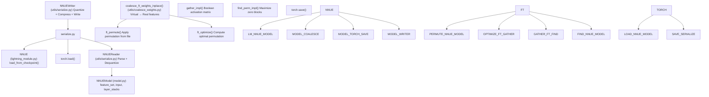

# 检查点转换 (serialize.py)

-   [model/\_\_init\_\_.py](https://github.com/Chesszyh/nnue-pytorch/blob/024b2064/model/__init__.py)
-   [model/utils/\_\_init\_\_.py](https://github.com/Chesszyh/nnue-pytorch/blob/024b2064/model/utils/__init__.py)
-   [serialize.py](https://github.com/Chesszyh/nnue-pytorch/blob/024b2064/serialize.py)
-   [visualize.py](https://github.com/Chesszyh/nnue-pytorch/blob/024b2064/visualize.py)
-   [visualize\_multi\_hist.py](https://github.com/Chesszyh/nnue-pytorch/blob/024b2064/visualize_multi_hist.py)

## 目的与范围

本文档记录了 `serialize.py` 脚本，该脚本用于在不同文件格式之间转换 NNUE 模型：PyTorch Lightning 检查点 (`.ckpt`)、PyTorch 状态字典 (`.pt`) 和兼容 Stockfish 的二进制文件 (`.nnue`)。该脚本还支持在转换过程中进行可选的优化步骤，包括权重合并、压缩和特征变换器排列。

关于 `.nnue` 二进制文件格式结构的详细信息，请参阅 [NNUE 二进制格式 (NNUE Binary Format)](#5.2)。关于权重合并和压缩算法的深入文档，请参阅 [权重合并与压缩 (Weight Coalescing and Compression)](#5.3)。关于检查转换后模型的工具，请参阅 [模型可视化 (Model Visualization)](#5.4)。

## 支持的格式转换

`serialize.py` 脚本支持三种文件格式之间的转换：

| 源格式 | 目标格式 | 说明 |
| --- | --- | --- |
| `.ckpt` | `.pt` | 将 PyTorch Lightning 检查点转换为普通 PyTorch 模型 |
| `.ckpt` | `.nnue` | 将检查点转换为可部署的 Stockfish 二进制文件 |
| `.pt` | `.nnue` | 将 PyTorch 模型转换为 Stockfish 二进制文件 |
| `.nnue` | `.pt` | 将二进制格式加载回 PyTorch（用于检查）|
| `.nnue` | `.nnue` | 使用不同选项（压缩、排列）重新序列化 |

**注意**：不支持转换 **为** `.ckpt` 格式 [serialize.py154-155](https://github.com/Chesszyh/nnue-pytorch/blob/024b2064/serialize.py#L154-L155)

来源：[serialize.py1-186](https://github.com/Chesszyh/nnue-pytorch/blob/024b2064/serialize.py#L1-L186)

## 命令行接口

### 基本用法

```
python serialize.py SOURCE TARGET [OPTIONS]
```
### 参数与选项

| 参数/选项 | 类型 | 默认值 | 描述 |
| --- | --- | --- | --- |
| `source` | 位置参数 | 必需 | 源文件（`.ckpt`、`.pt` 或 `.nnue`）|
| `target` | 位置参数 | 必需 | 目标文件（`.pt` 或 `.nnue`）|
| `--out-sha` | 标志 | false | 保存为 `nn-<sha256>.nnue` 而不是使用目标名称 |
| `--description` | 字符串 | None | 嵌入到 `.nnue` 头部的描述字符串 |
| `--ft_compression` | 字符串 | `"leb128"` | 压缩方法：`"none"` 或 `"leb128"`（仅用于 `.nnue` 输出）|
| `--ft_perm` | 路径 | None | 应用指定文件中的排列 |
| `--ft_optimize` | 标志 | false | 执行完整的特征变换器优化（耗时）|
| `--ft_optimize_data` | 路径 | None | 用于 FT 优化的数据集路径 |
| `--ft_optimize_count` | 整数 | 10000 | 用于 FT 优化的局面数量 |
| `--no-cupy` | 标志 | false | 使用 numpy 代替 cupy 进行优化（较慢）|
| `--device` | 整数 | 0 | cupy 操作的 CUDA 设备 |
| `--l1` | 整数 | 2048 | 特征变换器输出大小 |
| `--features` | 字符串 | 必需 | 特征集名称（例如，`HalfKAv2_hm^`）|

来源：[serialize.py11-74](https://github.com/Chesszyh/nnue-pytorch/blob/024b2064/serialize.py#L11-L74)

## 转换工作流

### 高级流程图

```mermaid
flowchart TD
    START["serialize.py main()"]
    PARSE["Parse command-line arguments"]
    LOAD_CKPT["Load from .ckpt NNUE.load_from_checkpoint()"]
    LOAD_PT["Load from .pt torch.load()"]
    LOAD_NNUE["Load from .nnue NNUEReader"]
    CHECK_PERM["--ft_perm provided?"]
    COALESCE1["coalesce_ft_weights_inplace() layer_stacks.coalesce_layer_stacks_inplace()"]
    APPLY_PERM["ftperm.ft_permute()"]
    CHECK_OPT["--ft_optimize flag set?"]
    COALESCE2["coalesce_ft_weights_inplace() layer_stacks.coalesce_layer_stacks_inplace()"]
    RUN_OPT["ftperm.ft_optimize() use_cupy"]
    SAVE_PT["Save to .pt torch.save()"]
    SAVE_NNUE["Save to .nnue NNUEWriter"]
    COMPUTE_SHA["Compute SHA256 save as nn-.nnue"]

    START --> PARSE
    PARSE --> LOAD_CKPT
    PARSE --> LOAD_PT
    PARSE --> LOAD_NNUE
    LOAD --> CKPT_CHECK_PERM
    LOAD --> PT_CHECK_PERM
    LOAD --> NNUE_CHECK_PERM
    CHECK --> PERM_COALESCE1
    CHECK --> PERM_CHECK_OPT
    COALESCE1 --> APPLY_PERM
    APPLY --> PERM_CHECK_OPT
    CHECK --> OPT_COALESCE2
    CHECK --> OPT_SAVE_PT
    COALESCE2 --> RUN_OPT
    RUN --> OPT_SAVE_PT
```


来源：[serialize.py10-185](https://github.com/Chesszyh/nnue-pytorch/blob/024b2064/serialize.py#L10-L185)

### 详细转换步骤

#### 步骤 1：源加载

加载过程根据源格式而异：

**从 `.ckpt` (PyTorch Lightning 检查点) 加载**

[serialize.py83-91](https://github.com/Chesszyh/nnue-pytorch/blob/024b2064/serialize.py#L83-L91) 使用 Lightning 模块的 `load_from_checkpoint` 方法加载检查点：

```
nnue = M.NNUE.load_from_checkpoint(    args.source,    feature_set=feature_set,    config=M.ModelConfig(L1=args.l1),    quantize_config=M.QuantizationConfig(),    map_location=torch.device("cpu"))nnue.eval()
```
这将创建一个完整的 `NNUE` Lightning 模块，其中包含完整的训练/验证逻辑。

**从 `.pt` (PyTorch 状态字典) 加载**

[serialize.py92-93](https://github.com/Chesszyh/nnue-pytorch/blob/024b2064/serialize.py#L92-L93) 使用标准 PyTorch 加载：

```
nnue = torch.load(args.source, weights_only=False)
```
这将直接加载先前序列化的 `NNUE` 对象。

**从 `.nnue` (二进制格式) 加载**

[serialize.py94-104](https://github.com/Chesszyh/nnue-pytorch/blob/024b2064/serialize.py#L94-L104) 使用 `NNUEReader` 解析二进制格式：

```
nnue = M.NNUE(feature_set, M.ModelConfig(L1=args.l1), M.QuantizationConfig())reader = M.NNUEReader(    f, feature_set, M.ModelConfig(L1=args.l1), M.QuantizationConfig())nnue.model = reader.modelif args.description is None:    args.description = reader.description
```
读取器从二进制头部提取描述字段以供潜在的重用。

来源：[serialize.py83-106](https://github.com/Chesszyh/nnue-pytorch/blob/024b2064/serialize.py#L83-L106)

#### 步骤 2：可选的权重合并

当应用排列或完全优化时 [serialize.py121-124](https://github.com/Chesszyh/nnue-pytorch/blob/024b2064/serialize.py#L121-L124) [serialize.py143-145](https://github.com/Chesszyh/nnue-pytorch/blob/024b2064/serialize.py#L143-L145)，脚本首先将虚拟特征合并为真实特征：

```
M.coalesce_ft_weights_inplace(nnue.model.feature_set, nnue.model.input)nnue.model.layer_stacks.coalesce_layer_stacks_inplace()
```
**目的**：训练期间使用的虚拟特征（P, K, HalfRelativeKP）必须在优化或最终序列化之前合并为真实特征。有关虚拟特征系统的详细信息，请参阅 [虚拟特征与分解 (Virtual Features and Factorization)](#4.6)。

**注意**：仅当源 **不是** 已经存在的 `.nnue` 文件时才执行合并，因为 `.nnue` 文件仅包含合并后的权重。

来源：[serialize.py121-124](https://github.com/Chesszyh/nnue-pytorch/blob/024b2064/serialize.py#L121-L124) [serialize.py143-145](https://github.com/Chesszyh/nnue-pytorch/blob/024b2064/serialize.py#L143-L145)

#### 步骤 3：可选的特征变换器优化

有两种优化模式可用：

**模式 1：应用预计算的排列** (`--ft_perm`)

[serialize.py118-125](https://github.com/Chesszyh/nnue-pytorch/blob/024b2064/serialize.py#L118-L125) 从文件应用排列：

```
import ftpermftperm.ft_permute(nnue.model, args.ft_perm)
```
排列文件指定如何重新排序特征变换器权重，以最大化零值的 4 神经元块，从而提高 SIMD 效率。

**模式 2：计算最佳排列** (`--ft_optimize`)

[serialize.py127-152](https://github.com/Chesszyh/nnue-pytorch/blob/024b2064/serialize.py#L127-L152) 执行完整优化：

```
import ftpermif args.use_cupy:    if args.device is not None:        ftperm.set_cupy_device(args.device)ftperm.ft_optimize(    nnue.model,    args.ft_optimize_data,    args.ft_optimize_count,    use_cupy=args.use_cupy)
```
此优化：

1.  从 `--ft_optimize_data` 中采样局面
2.  收集特征激活
3.  计算最大化零块的排列
4.  将排列应用于模型权重

**互斥性**：这两种模式是互斥的 [serialize.py115-116](https://github.com/Chesszyh/nnue-pytorch/blob/024b2064/serialize.py#L115-L116)

有关优化算法的详细文档，请参阅 [特征变换器排列 (Feature Transformer Permutation)](#6.1)。

来源：[serialize.py115-152](https://github.com/Chesszyh/nnue-pytorch/blob/024b2064/serialize.py#L115-L152)

#### 步骤 4：目标保存

**保存为 `.pt` 格式**

[serialize.py156-157](https://github.com/Chesszyh/nnue-pytorch/blob/024b2064/serialize.py#L156-L157) 使用 PyTorch 序列化：

```
torch.save(nnue, args.target)
```
这将保存包含 Lightning 模块包装器的整个 `NNUE` 对象。

**保存为 `.nnue` 格式**

[serialize.py158-179](https://github.com/Chesszyh/nnue-pytorch/blob/024b2064/serialize.py#L158-L179) 使用 `NNUEWriter` 创建二进制格式：

```
writer = M.NNUEWriter(    nnue.model, args.description, ft_compression=args.ft_compression)buf = writer.bufif args.out_sha:    sha = hashlib.sha256(buf).hexdigest()    final_path = os.path.join(out_dir, f"nn-{sha[:12]}.nnue")    with open(final_path, "wb") as f:        f.write(buf)else:    with open(args.target, "wb") as f:        f.write(buf)
```
`NNUEWriter` 处理：

-   量化 (float32 → int8/int16)
-   压缩 (可选 LEB128 编码)
-   二进制格式序列化
-   头部生成

`--out-sha` 标志启用基于输出的 SHA256 哈希的自动命名，遵循 Stockfish 的命名约定。

来源：[serialize.py154-179](https://github.com/Chesszyh/nnue-pytorch/blob/024b2064/serialize.py#L154-L179)

## 与核心组件集成


来源：[serialize.py1-186](https://github.com/Chesszyh/nnue-pytorch/blob/024b2064/serialize.py#L1-L186) [model/\_\_init\_\_.py1-31](https://github.com/Chesszyh/nnue-pytorch/blob/024b2064/model/__init__.py#L1-L31) [model/utils/\_\_init\_\_.py1-12](https://github.com/Chesszyh/nnue-pytorch/blob/024b2064/model/utils/__init__.py#L1-L12)

## 常见用例

### 用例 1：基本检查点到 NNUE 转换

将训练检查点转换为可部署的网络：

```
python serialize.py epoch=50.ckpt output.nnue \    --features HalfKAv2_hm^ \    --l1 2048 \    --description "Training run XYZ, epoch 50"
```
这会生成 `output.nnue`，其中：

-   默认启用 LEB128 压缩
-   嵌入了自定义描述
-   自动合并了虚拟特征

### 用例 2：SHA 命名输出

生成具有自动哈希命名约定的网络：

```
python serialize.py epoch=50.ckpt output/ \    --features HalfKAv2_hm^ \    --out-sha
```
这将创建 `output/nn-<sha256>.nnue`，其中文件名源自网络的哈希值。这是 Stockfish 使用的标准命名约定。

### 用例 3：带有排列的优化网络

在转换过程中应用特征变换器优化：

```
python serialize.py epoch=50.ckpt optimized.nnue \    --features HalfKAv2_hm^ \    --ft_optimize \    --ft_optimize_data training_data.binpack \    --ft_optimize_count 10000
```
这将通过以下方式执行 PGO 风格的优化：

1.  从训练数据中加载 10,000 个局面
2.  计算哪些特征频繁激活
3.  查找最大化零值 4 神经元块的排列
4.  将排列应用于模型

**警告**：此过程非常耗时 [serialize.py47](https://github.com/Chesszyh/nnue-pytorch/blob/024b2064/serialize.py#L47-L47) 并且需要大量的 GPU 内存。

### 用例 4：重新压缩现有的 NNUE

使用不同的压缩方式重新序列化现有的 `.nnue` 文件：

```
# Remove compressionpython serialize.py compressed.nnue uncompressed.nnue \    --features HalfKAv2_hm^ \    --ft_compression none# Add compressionpython serialize.py uncompressed.nnue compressed.nnue \    --features HalfKAv2_hm^ \    --ft_compression leb128
```
### 用例 5：应用预计算的排列

如果您已经计算出最佳排列并保存了它：

```
python serialize.py base.nnue optimized.nnue \    --features HalfKAv2_hm^ \    --ft_perm permutation.txt
```
这将从 `permutation.txt` 应用排列，而无需重新计算。

来源：[serialize.py1-186](https://github.com/Chesszyh/nnue-pytorch/blob/024b2064/serialize.py#L1-L186)

## 验证与错误处理

### 格式验证

脚本在关键点验证格式：

| 验证 | 位置 | 错误 |
| --- | --- | --- |
| 无效的源扩展名 | [serialize.py106](https://github.com/Chesszyh/nnue-pytorch/blob/024b2064/serialize.py#L106-L106) | "Invalid network input format." |
| 目标是 `.ckpt` | [serialize.py154-155](https://github.com/Chesszyh/nnue-pytorch/blob/024b2064/serialize.py#L154-L155) | "Cannot convert into .ckpt" |
| 无效的目标扩展名 | [serialize.py181](https://github.com/Chesszyh/nnue-pytorch/blob/024b2064/serialize.py#L181-L181) | "Invalid network output format." |
| 无效的压缩方法 | [serialize.py112-113](https://github.com/Chesszyh/nnue-pytorch/blob/024b2064/serialize.py#L112-L113) | "Invalid compression method." |

### 优化约束

当使用 `--ft_optimize` 时：

| 约束 | 检查位置 | 错误 |
| --- | --- | --- |
| 必须提供 `--ft_optimize_data` | [serialize.py130-133](https://github.com/Chesszyh/nnue-pytorch/blob/024b2064/serialize.py#L130-L133) | "Invalid dataset path for FT optimization." |
| 必须具有有效的 `--ft_optimize_count` | [serialize.py134-137](https://github.com/Chesszyh/nnue-pytorch/blob/024b2064/serialize.py#L134-L137) | "Invalid number of positions to optimize FT with." |
| 不能与 `--ft_perm` 结合使用 | [serialize.py115-116](https://github.com/Chesszyh/nnue-pytorch/blob/024b2064/serialize.py#L115-L116) | "Options --ft\_perm and --ft\_optimize are mutually exclusive." |

### 自动更正

脚本自动处理一些不一致之处：

**非 NNUE 目标的压缩**：如果指定了 `--ft_compression` 但目标不是 `.nnue`，则脚本会静默地将其重置为 `"none"` [serialize.py108-110](https://github.com/Chesszyh/nnue-pytorch/blob/024b2064/serialize.py#L108-L110)

来源：[serialize.py106-137](https://github.com/Chesszyh/nnue-pytorch/blob/024b2064/serialize.py#L106-L137) [serialize.py154-181](https://github.com/Chesszyh/nnue-pytorch/blob/024b2064/serialize.py#L154-L181)

## 性能考量

### 内存需求

| 操作 | 内存使用 | 说明 |
| --- | --- | --- |
| 基本转换 | ~1 GB | 模型保存在 CPU 内存中 |
| 带有 cupy 的 `--ft_optimize` | ~8-16 GB GPU | 激活矩阵可能很大 |
| 带有 numpy 的 `--ft_optimize` | ~16-32 GB RAM | 较慢但使用系统内存 |

### 压缩影响

| 压缩 | 文件大小 | 加载时间 | 推理速度 |
| --- | --- | --- | --- |
| `none` | 100% | 最快 | 相同 |
| `leb128` | ~60-70% | ~10% 较慢 | 相同 |

LEB128 压缩主要影响文件大小和初始加载时间，不影响推理性能。

### 优化时间

完整的特征变换器优化 (`--ft_optimize`) 通常需要：

-   使用 cupy (GPU) 需要 10-30 分钟
-   使用 numpy (CPU) 需要 1-2 小时

时间取决于：

-   局面数量 (`--ft_optimize_count`)
-   特征集大小
-   L1 维度大小
-   硬件能力

来源：[serialize.py1-186](https://github.com/Chesszyh/nnue-pytorch/blob/024b2064/serialize.py#L1-L186)

## 文件格式版本兼容性

`NNUEWriter` 和 `NNUEReader` 在二进制格式头部维护版本信息。当前的实现支持：

-   **特征变换器哈希 (Feature Transformer Hash)**：标识特征集结构
-   **版本号 (Version Number)**：指示格式版本
-   **架构哈希 (Architecture Hash)**：标识网络架构

加载 `.nnue` 文件时，读取器会根据提供的 `feature_set` 和 `ModelConfig` 验证这些哈希值。不匹配将导致加载失败。

有关详细的格式规范，请参阅 [NNUE 二进制格式 (NNUE Binary Format)](#5.2)。

来源：[serialize.py94-104](https://github.com/Chesszyh/nnue-pytorch/blob/024b2064/serialize.py#L94-L104) [serialize.py165-167](https://github.com/Chesszyh/nnue-pytorch/blob/024b2064/serialize.py#L165-L167)
