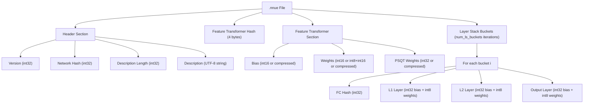
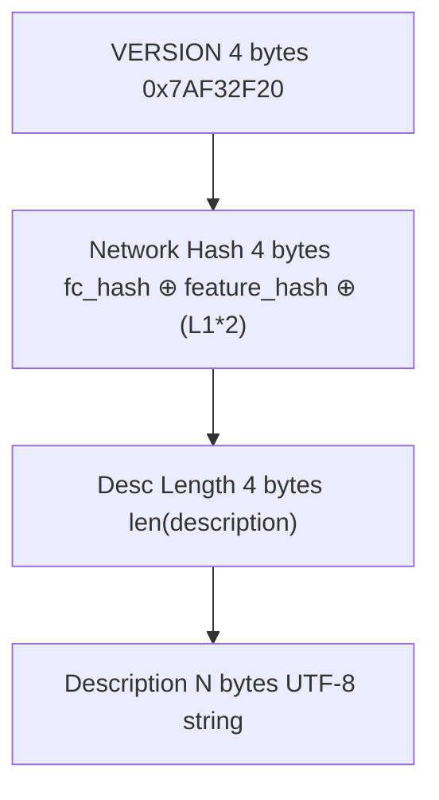
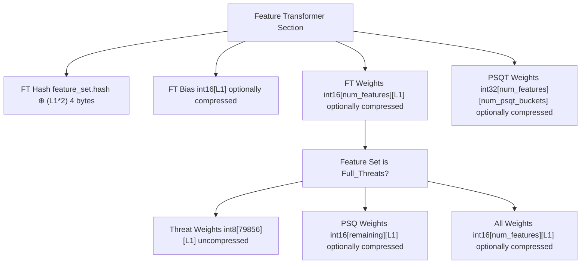
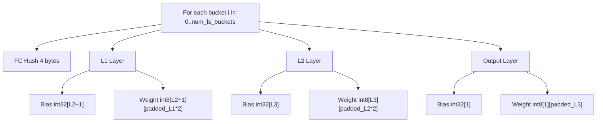
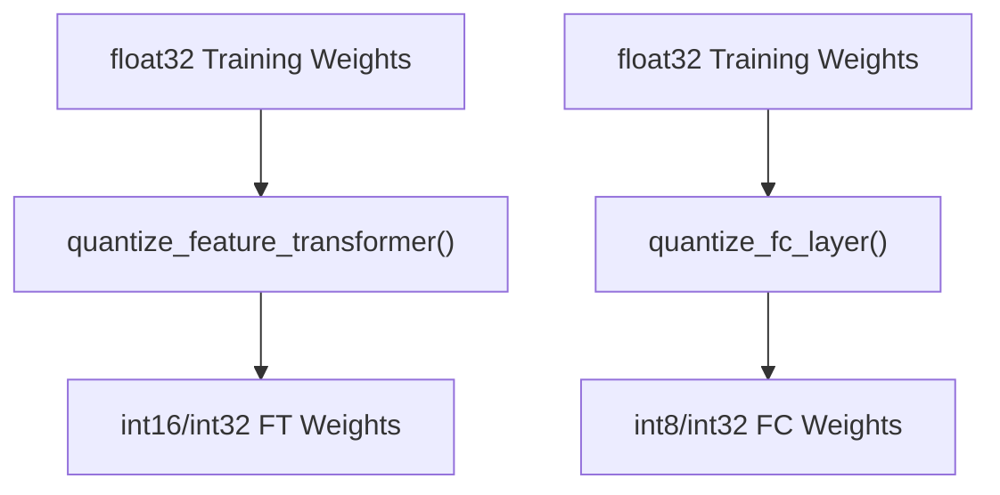
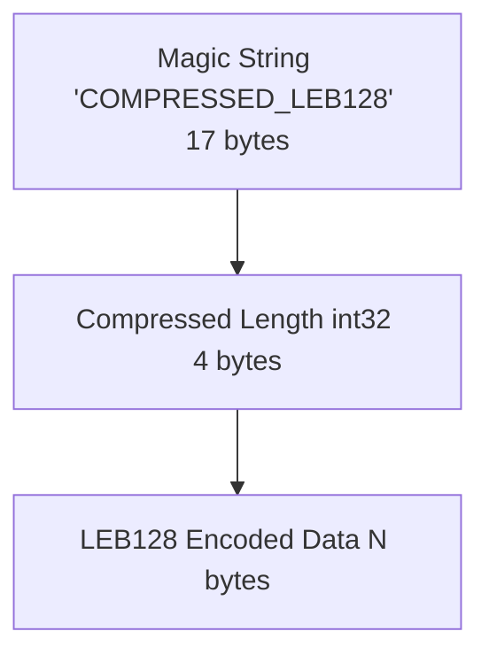
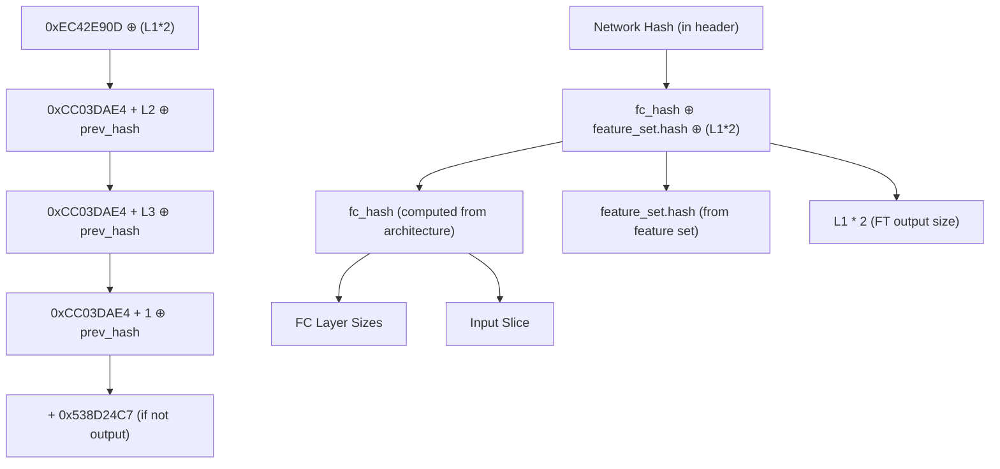
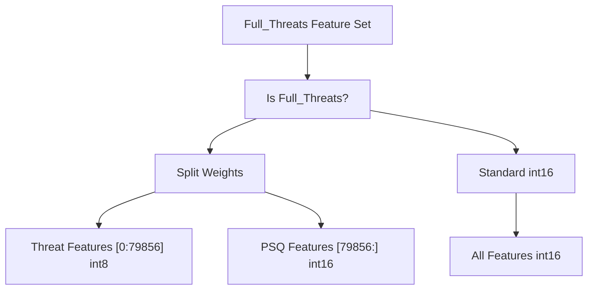
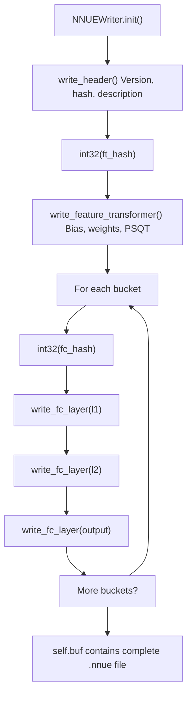
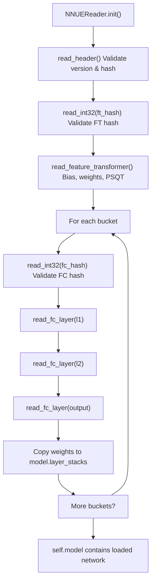

# NNUE 二进制格式 (NNUE Binary Format)

-   [model/__init__.py](https://github.com/Chesszyh/nnue-pytorch/blob/024b2064/model/__init__.py)
-   [model/model.py](https://github.com/Chesszyh/nnue-pytorch/blob/024b2064/model/model.py)
-   [model/utils/__init__.py](https://github.com/Chesszyh/nnue-pytorch/blob/024b2064/model/utils/__init__.py)
-   [model/utils/coalesce_weights.py](https://github.com/Chesszyh/nnue-pytorch/blob/024b2064/model/utils/coalesce_weights.py)
-   [model/utils/serialize.py](https://github.com/Chesszyh/nnue-pytorch/blob/024b2064/model/utils/serialize.py)
-   [serialize.py](https://github.com/Chesszyh/nnue-pytorch/blob/024b2064/serialize.py)
-   [visualize.py](https://github.com/Chesszyh/nnue-pytorch/blob/024b2064/visualize.py)
-   [visualize_multi_hist.py](https://github.com/Chesszyh/nnue-pytorch/blob/024b2064/visualize_multi_hist.py)

本文档指定了 `.nnue` 文件的二进制文件格式，该格式用于以兼容 Stockfish 和其他国际象棋引擎的紧凑、可部署格式存储训练好的 NNUE 网络。该格式针对推理效率进行了优化，使用了整数量化和可选的压缩。

关于在检查点格式之间进行转换的信息，请参阅 [检查点转换 (Checkpoint Conversion)](#5.1)。关于压缩方法和权重合并的详细信息，请参阅 [权重合并与压缩 (Weight Coalescing and Compression)](#5.3)。

## 概览

`.nnue` 二进制格式存储具有以下特征的完整 NNUE 网络：

-   所有多字节值均采用 **小端字节序 (Little-endian byte order)**
-   **整数量化**：特征变换器使用 int16/int32，全连接层使用 int8/int32
-   **可选的 LEB128 压缩**：用于特征变换器权重以减小文件大小
-   **版本控制和哈希验证**：确保兼容性
-   **填充要求**：全连接层输入需要填充（32 元素对齐）

该格式由 [`NNUEWriter`](https://github.com/Chesszyh/nnue-pytorch/blob/024b2064/NNUEWriter) 写入，并由 [`NNUEReader`](https://github.com/Chesszyh/nnue-pytorch/blob/024b2064/NNUEReader) 读取。

来源：[model/utils/serialize.py1-361](https://github.com/Chesszyh/nnue-pytorch/blob/024b2064/model/utils/serialize.py#L1-L361)

## 文件结构概览


**图表：.nnue 二进制文件的整体结构**

来源：[model/utils/serialize.py69-217](https://github.com/Chesszyh/nnue-pytorch/blob/024b2064/model/utils/serialize.py#L69-L217)

## 二进制格式规范

### 字节序和基本类型

所有多字节值都使用 **小端 (little-endian)** 字节序。该格式使用以下基本操作：

| 方法 | 类型 | 大小 | 描述 |
| --- | --- | --- | --- |
| `int32(v)` | `uint32` | 4 字节 | 无符号 32 位整数 |
| `tensor(dtype, shape)` | 可变 | 可变 | 带有可选压缩的值数组 |
| `buf.extend(bytes)` | 可变 | 可变 | 原始字节数组 |

来源：[model/utils/serialize.py215-216](https://github.com/Chesszyh/nnue-pytorch/blob/024b2064/model/utils/serialize.py#L215-L216) [model/utils/serialize.py135-143](https://github.com/Chesszyh/nnue-pytorch/blob/024b2064/model/utils/serialize.py#L135-L143)

### 头部部分

头部包含版本信息、验证哈希和人类可读的描述：


**图表：头部部分字节布局**

版本常量定义为：

```
VERSION = 0x7AF32F20
```
网络哈希通过异或 (XOR) 计算：

-   `fc_hash`：全连接层架构的哈希
-   `feature_set.hash`：特征集的哈希
-   `L1 * 2`：特征变换器输出大小（因视角原因加倍）

描述默认为：

```
"Network trained with the https://github.com/official-stockfish/nnue-pytorch trainer."
```
来源：[model/utils/serialize.py65-66](https://github.com/Chesszyh/nnue-pytorch/blob/024b2064/model/utils/serialize.py#L65-L66) [model/utils/serialize.py121-128](https://github.com/Chesszyh/nnue-pytorch/blob/024b2064/model/utils/serialize.py#L121-L128) [model/utils/serialize.py265-269](https://github.com/Chesszyh/nnue-pytorch/blob/024b2064/model/utils/serialize.py#L265-L269)

### 特征变换器部分

在头部之后，文件包含特征变换器哈希和权重：


**图表：特征变换器部分结构**

特征变换器存储：

1.  **偏置 (Bias)**：`int16[L1]` - 每个输出神经元一个偏置值
2.  **权重 (Weights)**：`int16[num_features][L1]` - 输入到隐藏层的权重（对于 `Full_Threats` 可能会拆分）
3.  **PSQT 权重 (PSQT Weights)**：`int32[num_features][num_psqt_buckets]` - 子力-位置价值表值

对于 `Full_Threats` 特征集，权重被拆分：

-   前 79856 个特征使用 `int8`（威胁特征）
-   其余特征使用 `int16`（子力-位置特征）

来源：[model/utils/serialize.py144-174](https://github.com/Chesszyh/nnue-pytorch/blob/024b2064/model/utils/serialize.py#L144-L174) [model/utils/serialize.py312-334](https://github.com/Chesszyh/nnue-pytorch/blob/024b2064/model/utils/serialize.py#L312-L334)

### 全连接层部分

紧随特征变换器之后，文件包含 `num_ls_buckets`（通常为 8）份全连接层的副本：


**图表：一个桶 (bucket) 的全连接层部分结构**

每个全连接层存储：

1.  **偏置 (Bias)**：`int32[outputs]` - 每个输出神经元一个偏置
2.  **权重 (Weight)**：`int8[outputs][padded_inputs]` - 量化权重

**重要**：根据 NNUE 规范要求，输入维度被填充到 32 的下一个倍数。

来源：[model/utils/serialize.py92-96](https://github.com/Chesszyh/nnue-pytorch/blob/024b2064/model/utils/serialize.py#L92-L96) [model/utils/serialize.py176-213](https://github.com/Chesszyh/nnue-pytorch/blob/024b2064/model/utils/serialize.py#L176-L213) [model/utils/serialize.py336-354](https://github.com/Chesszyh/nnue-pytorch/blob/024b2064/model/utils/serialize.py#L336-L354)

## 数据类型和量化

二进制格式对不同组件使用不同的量化类型：

| 组件 | 类型 | 范围 | 缩放因子 |
| --- | --- | --- | --- |
| FT 偏置 (FT Bias) | `int16` | \[-32768, 32767\] | 由 `QuantizationManager` 确定 |
| FT 权重 (FT Weight) | `int16` | \[-32768, 32767\] | 由 `QuantizationManager` 确定 |
| FT 权重 (威胁) | `int8` | \[-128, 127\] | `Full_Threats` 的特殊情况 |
| FT PSQT | `int32` | \[-2³¹, 2³¹-1\] | 由 `QuantizationManager` 确定 |
| FC 偏置 (FC Bias) | `int32` | \[-2³¹, 2³¹-1\] | 由 `QuantizationManager` 确定 |
| FC 权重 (FC Weight) | `int8` | \[-128, 127\] | 由 `QuantizationManager` 确定 |

量化过程由 [`QuantizationManager`](https://github.com/Chesszyh/nnue-pytorch/blob/024b2064/QuantizationManager) 管理，并在序列化期间应用：


**图表：序列化期间的量化管道**

来源：[model/utils/serialize.py160-162](https://github.com/Chesszyh/nnue-pytorch/blob/024b2064/model/utils/serialize.py#L160-L162) [model/utils/serialize.py199-201](https://github.com/Chesszyh/nnue-pytorch/blob/024b2064/model/utils/serialize.py#L199-L201)

## 压缩

特征变换器部分支持可选的 LEB128（Little Endian Base 128）压缩，以减小文件大小。压缩由 `serialize.py` 中的 `--ft_compression` 标志控制。

### 压缩张量格式

当启用压缩时，每个压缩张量具有以下结构：


**图表：压缩张量结构**

### LEB128 编码

LEB128 编码每个字节使用 7 位用于数据，高位作为连续标志：

| 字节结构 | 含义 |
| --- | --- |
| `0xxxxxxx` | 最后一个字节（位 7 = 0）|
| `1xxxxxxx` | 后续还有字节（位 7 = 1）|

编码/解码函数为：

-   [`encode_leb_128_array(arr)`](https://github.com/Chesszyh/nnue-pytorch/blob/024b2064/encode_leb_128_array(arr)): 将 numpy 数组编码为 LEB128
-   [`decode_leb_128_array(arr, n)`](https://github.com/Chesszyh/nnue-pytorch/blob/024b2064/decode_leb_128_array(arr, n)): 将 LEB128 字节解码为 numpy 数组

来源：[model/utils/serialize.py32-61](https://github.com/Chesszyh/nnue-pytorch/blob/024b2064/model/utils/serialize.py#L32-L61) [model/utils/serialize.py130-143](https://github.com/Chesszyh/nnue-pytorch/blob/024b2064/model/utils/serialize.py#L130-L143) [model/utils/serialize.py271-310](https://github.com/Chesszyh/nnue-pytorch/blob/024b2064/model/utils/serialize.py#L271-L310)

## 版本与哈希系统

该格式使用多层哈希系统进行验证：


**图表：用于版本验证的哈希计算系统**

哈希系统确保：

1.  **架构兼容性**：不同的层大小产生不同的哈希
2.  **特征集兼容性**：不同的特征集产生不同的哈希
3.  **版本兼容性**：来自不兼容版本的文件被拒绝

来源：[model/utils/serialize.py98-119](https://github.com/Chesszyh/nnue-pytorch/blob/024b2064/model/utils/serialize.py#L98-L119) [model/utils/serialize.py121-128](https://github.com/Chesszyh/nnue-pytorch/blob/024b2064/model/utils/serialize.py#L121-L128) [model/utils/serialize.py265-269](https://github.com/Chesszyh/nnue-pytorch/blob/024b2064/model/utils/serialize.py#L265-L269)

## 填充要求

全连接层输入必须填充到 32 元素的下一个倍数，这是 NNUE 规范为高效 SIMD 操作所要求的：

```
# Example: If layer.weight.shape[1] = 50# Padded shape = 64 (next multiple of 32)num_input = weight.shape[1]if num_input % 32 != 0:
    num_input += 32 - (num_input % 32)
    new_w = torch.zeros(weight.shape[0], num_input, dtype=torch.int8)
    new_w[:, :weight.shape[1]] = weight
    weight = new_w
```
| 层 | 未填充输入 | 填充后输入 |
| --- | --- | --- |
| L1 | `L1 * 2` (例如 1024) | `L1 * 2` (已经是 32 的倍数) |
| L2 | `L2 * 2` (例如 16) | 32 (从 16 填充) |
| 输出 | `L3` (例如 32) | 32 (已经是 32 的倍数) |

在读取期间，填充被剥离：

```
layer.weight.data = layer.weight.data[:non_padded_shape[0], :non_padded_shape[1]]
```
来源：[model/utils/serialize.py203-209](https://github.com/Chesszyh/nnue-pytorch/blob/024b2064/model/utils/serialize.py#L203-L209) [model/utils/serialize.py336-354](https://github.com/Chesszyh/nnue-pytorch/blob/024b2064/model/utils/serialize.py#L336-L354)

## 特殊情况

### Full_Threats 特征集

`Full_Threats` 特征集有特殊处理，其中威胁特征使用 `int8` 量化，而子力-位置特征使用 `int16`：


**图表：Full_Threats 特征集的特殊处理**

这在写入和读取中都有处理：

**写入：**

```
if model.feature_set.name.startswith("Full_Threats"):
    threat_weight = weight[:79856].to(torch.int8)
    psq_weight = weight[79856:]
    self.write_tensor(threat_weight.flatten().numpy())
    self.write_tensor(psq_weight.flatten().numpy(), ft_compression)
```
**读取：**

```
if self.feature_set.name.startswith("Full_Threats"):
    threat_weight = self.tensor(np.int8, [79856, shape[1] - num_psqt_buckets])
    psq_weight = self.tensor(np.int16, [shape[0] - 79856, shape[1] - num_psqt_buckets])
    weight = torch.cat([threat_weight, psq_weight], dim=0)
```
来源：[model/utils/serialize.py167-172](https://github.com/Chesszyh/nnue-pytorch/blob/024b2064/model/utils/serialize.py#L167-L172) [model/utils/serialize.py319-322](https://github.com/Chesszyh/nnue-pytorch/blob/024b2064/model/utils/serialize.py#L319-L322)

## 读写实现

### 写入工作流


**图表：NNUEWriter 中的写入工作流**

### 读取工作流


**图表：NNUEReader 中的读取工作流**

序列化的主要入口点是：

| 操作 | 入口点 | 关键方法 |
| --- | --- | --- |
| 写入 .nnue | [`serialize.py165-167`](https://github.com/Chesszyh/nnue-pytorch/blob/024b2064/serialize.py#L165-L167) | `NNUEWriter(model, description, ft_compression)` |
| 从 .nnue 读取 | [`serialize.py95-104`](https://github.com/Chesszyh/nnue-pytorch/blob/024b2064/serialize.py#L95-L104) | `NNUEReader(f, feature_set, config, quantize_config)` |
| 转换格式 | [`serialize.py10-182`](https://github.com/Chesszyh/nnue-pytorch/blob/024b2064/serialize.py#L10-L182) | `main()` 处理 .ckpt → .nnue, .pt → .nnue, .nnue → .pt |

来源：[model/utils/serialize.py69-217](https://github.com/Chesszyh/nnue-pytorch/blob/024b2064/model/utils/serialize.py#L69-L217) [model/utils/serialize.py219-361](https://github.com/Chesszyh/nnue-pytorch/blob/024b2064/model/utils/serialize.py#L219-L361) [serialize.py10-185](https://github.com/Chesszyh/nnue-pytorch/blob/024b2064/serialize.py#L10-L185)

## 使用示例

要从检查点创建 `.nnue` 文件：

```
# Basic conversionpython serialize.py model.ckpt output.nnue# With compressionpython serialize.py model.ckpt output.nnue --ft_compression leb128# With custom descriptionpython serialize.py model.ckpt output.nnue --description "My custom network"# With SHA-based namingpython serialize.py model.ckpt output_dir/ --out-sha# Creates: output_dir/nn-<sha12>.nnue
```
要读取 `.nnue` 文件以进行检查：

```
import model as M
with open('network.nnue', 'rb') as f:
    reader = M.NNUEReader(
        f,
        feature_set=M.get_feature_set_from_name('HalfKAv2_hm'),
        config=M.ModelConfig(),
        quantize_config=M.QuantizationConfig()
    )
    model = reader.model
    description = reader.description
```
来源：[serialize.py10-185](https://github.com/Chesszyh/nnue-pytorch/blob/024b2064/serialize.py#L10-L185) [model/utils/serialize.py219-264](https://github.com/Chesszyh/nnue-pytorch/blob/024b2064/model/utils/serialize.py#L219-L264)
