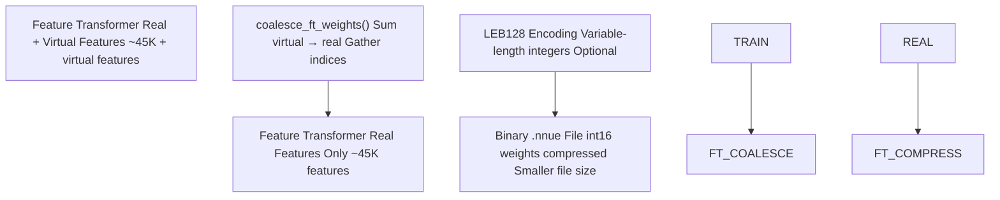
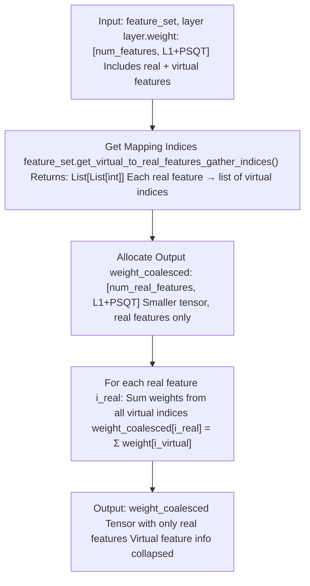
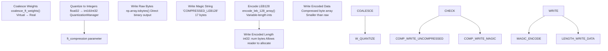
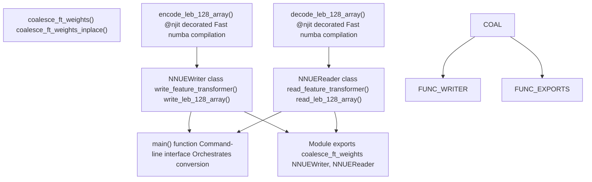

# 权重合并与压缩 (Weight Coalescing and Compression)

-   [model/\_\_init\_\_.py](https://github.com/Chesszyh/nnue-pytorch/blob/024b2064/model/__init__.py)
-   [model/model.py](https://github.com/Chesszyh/nnue-pytorch/blob/024b2064/model/model.py)
-   [model/utils/\_\_init\_\_.py](https://github.com/Chesszyh/nnue-pytorch/blob/024b2064/model/utils/__init__.py)
-   [model/utils/coalesce\_weights.py](https://github.com/Chesszyh/nnue-pytorch/blob/024b2064/model/utils/coalesce_weights.py)
-   [model/utils/serialize.py](https://github.com/Chesszyh/nnue-pytorch/blob/024b2064/model/utils/serialize.py)
-   [serialize.py](https://github.com/Chesszyh/nnue-pytorch/blob/024b2064/serialize.py)
-   [visualize.py](https://github.com/Chesszyh/nnue-pytorch/blob/024b2064/visualize.py)
-   [visualize\_multi\_hist.py](https://github.com/Chesszyh/nnue-pytorch/blob/024b2064/visualize_multi_hist.py)

本文档描述了在模型序列化期间应用的权重合并和压缩技术。权重合并通过将虚拟特征（仅在训练期间使用）折叠回真实特征来减小模型大小。压缩通过 LEB128 编码进一步减小二进制文件大小。

关于整体序列化工作流的信息，请参阅 [检查点转换 (Checkpoint Conversion)](#5.1)。关于二进制文件格式结构的详细信息，请参阅 [NNUE 二进制格式 (NNUE Binary Format)](#5.2)。

## 概览

NNUE 训练系统在训练期间使用 **虚拟特征** 来加速相关特征模式的学习。在序列化时，必须将这些虚拟特征 **合并**（折叠）回其对应的真实特征，以生成可部署的网络。此外，可以对特征变换器权重应用 **LEB128 压缩**，以在不损失精度的情况下减小文件大小。


**来源：** [serialize.py118-125](https://github.com/Chesszyh/nnue-pytorch/blob/024b2064/serialize.py#L118-L125) [model/utils/coalesce\_weights.py7-19](https://github.com/Chesszyh/nnue-pytorch/blob/024b2064/model/utils/coalesce_weights.py#L7-L19) [model/utils/serialize.py144-174](https://github.com/Chesszyh/nnue-pytorch/blob/024b2064/model/utils/serialize.py#L144-L174)

## 权重合并

### 虚拟特征的目的

虚拟特征是仅在训练期间存在的附加特征索引。它们在分解特征集中定义（由 `^` 后缀指示，例如 `HalfKAv2_hm^`）。虚拟特征使网络能够在训练期间更有效地学习相关特征之间的相关性，但它们不存在于最终部署的网络中。

在模型初始化期间，所有虚拟特征权重都被清零：

[model/model.py43-52](https://github.com/Chesszyh/nnue-pytorch/blob/024b2064/model/model.py#L43-L52)

在序列化时，为虚拟特征学习到的权重被加回其对应的真实特征中，有效地合并了学习到的表示。

### 合并实现

合并过程在 `coalesce_ft_weights()` 函数中实现：


**代码实现：**

[model/utils/coalesce\_weights.py7-19](https://github.com/Chesszyh/nnue-pytorch/blob/024b2064/model/utils/coalesce_weights.py#L7-L19)

该函数创建一个维度为 `(num_real_features, output_size)` 的新张量，并根据虚拟到真实特征的映射，通过收集和求和原始张量中的权重来填充它。

**来源：** [model/utils/coalesce\_weights.py1-33](https://github.com/Chesszyh/nnue-pytorch/blob/024b2064/model/utils/coalesce_weights.py#L1-L33)

### 就地合并

对于序列化，使用就地变体以避免创建临时副本：

[model/utils/coalesce\_weights.py22-33](https://github.com/Chesszyh/nnue-pytorch/blob/024b2064/model/utils/coalesce_weights.py#L22-L33)

此变体直接修改 `layer.weight.data`，将完整的权重张量（真实 + 虚拟）替换为合并后的纯真实权重。

**来源：** [model/utils/coalesce\_weights.py22-33](https://github.com/Chesszyh/nnue-pytorch/blob/024b2064/model/utils/coalesce_weights.py#L22-L33) [serialize.py122-124](https://github.com/Chesszyh/nnue-pytorch/blob/024b2064/serialize.py#L122-L124)

### 序列化管道中的合并

合并发生在序列化管道的两个点：

1.  **在特征变换器排列优化之前**（如果启用）：[serialize.py118-125](https://github.com/Chesszyh/nnue-pytorch/blob/024b2064/serialize.py#L118-L125)

2.  **在 NNUEWriter 内部写入特征变换器时**：[model/utils/serialize.py144-151](https://github.com/Chesszyh/nnue-pytorch/blob/024b2064/model/utils/serialize.py#L144-L151)


合并在主特征变换器权重和层堆栈权重（如果它们使用分解）上均执行：

[serialize.py122-123](https://github.com/Chesszyh/nnue-pytorch/blob/024b2064/serialize.py#L122-L123)

**来源：** [serialize.py118-153](https://github.com/Chesszyh/nnue-pytorch/blob/024b2064/serialize.py#L118-L153) [model/utils/serialize.py144-151](https://github.com/Chesszyh/nnue-pytorch/blob/024b2064/model/utils/serialize.py#L144-L151)

## 压缩

### LEB128 编码

LEB128 (Little Endian Base 128) 是一种变长整数编码，通过对较小的绝对值使用较少的字节来压缩数据。每个字节编码 7 位数据加上一个连续位。

| 编码属性 | 描述 |
| --- | --- |
| **格式** | 变长，每字节 7 个数据位 + 1 个连续位 |
| **有符号** | 是，使用符号扩展 |
| **效率** | 小值使用较少字节（权重通常为 1-2 字节）|
| **适用性** | 特征变换器权重和偏置 (int16/int32) |
| **不适用于** | 全连接层权重（int8，已经很紧凑）|

编码算法：

[model/utils/serialize.py32-43](https://github.com/Chesszyh/nnue-pytorch/blob/024b2064/model/utils/serialize.py#L32-L43)

解码算法：

[model/utils/serialize.py46-61](https://github.com/Chesszyh/nnue-pytorch/blob/024b2064/model/utils/serialize.py#L46-L61)

**来源：** [model/utils/serialize.py32-61](https://github.com/Chesszyh/nnue-pytorch/blob/024b2064/model/utils/serialize.py#L32-L61)

### 压缩工作流


**来源：** [model/utils/serialize.py144-174](https://github.com/Chesszyh/nnue-pytorch/blob/024b2064/model/utils/serialize.py#L144-L174) [model/utils/serialize.py130-142](https://github.com/Chesszyh/nnue-pytorch/blob/024b2064/model/utils/serialize.py#L130-L142)

### 压缩应用

压缩由 `serialize.py` 中的 `--ft_compression` 命令行参数控制：

[serialize.py29-34](https://github.com/Chesszyh/nnue-pytorch/blob/024b2064/serialize.py#L29-L34)

默认行为是 `"leb128"`。压缩应用于：

1.  **特征变换器偏置** (int16 → int32 量化)
2.  **特征变换器权重** (int16 量化)
3.  **PSQT 权重** (int32 量化)

全连接层权重 **不** 进行压缩，因为它们已经存储为 int8，非常紧凑。

对于像 `Full_Threats` 这样的特殊特征集，有选择地应用压缩：

[model/utils/serialize.py167-174](https://github.com/Chesszyh/nnue-pytorch/blob/024b2064/model/utils/serialize.py#L167-L174)

在这里，威胁权重使用 int8（无压缩），而 PSQ 权重使用 int16（带有可选压缩）。

**来源：** [serialize.py29-34](https://github.com/Chesszyh/nnue-pytorch/blob/024b2064/serialize.py#L29-L34) [model/utils/serialize.py167-174](https://github.com/Chesszyh/nnue-pytorch/blob/024b2064/model/utils/serialize.py#L167-L174)

### 读取时解压缩

`NNUEReader` 通过检查魔术字符串自动检测压缩：

[model/utils/serialize.py291-297](https://github.com/Chesszyh/nnue-pytorch/blob/024b2064/model/utils/serialize.py#L291-L297)

`tensor()` 方法透明地处理压缩和未压缩数据：

[model/utils/serialize.py299-310](https://github.com/Chesszyh/nnue-pytorch/blob/024b2064/model/utils/serialize.py#L299-L310)

**来源：** [model/utils/serialize.py291-310](https://github.com/Chesszyh/nnue-pytorch/blob/024b2064/model/utils/serialize.py#L291-L310)

## 完整序列化流程

下图显示了合并和压缩如何集成到完整的序列化管道中：

```mermaid
flowchart TD
    CKPT["PyTorch Checkpoint .ckpt file Float32 weights + virtual features"]
    LOAD["NNUE.load_from_checkpoint() Restore full training state"]
    FT_OPT["--ft_optimize or --ft_perm"]
    COALESCE_PRE["coalesce_ft_weights_inplace() Required before FT optimization"]
    FT_PERM["ftperm.ft_permute() or ftperm.ft_optimize() Reorder for SIMD efficiency"]
    WRITER_INIT["NNUEWriter(model, description, ft_compression)"]
    WRITE_HEADER["write_header() Version + hash + description"]
    WRITE_FT["write_feature_transformer() 1. Coalesce weights 2. Quantize to int16/int32 3. Optionally compress (LEB128) 4. Write to buffer"]
    WRITE_FC["write_fc_layer() × N For each layer stack bucket: 1. Quantize to int8/int32 2. Pad to 32-byte alignment 3. Write raw (no compression)"]
    NNUE_FILE["Binary .nnue File Stockfish-compatible format Reduced size with compression"]

    CKPT --> LOAD
    LOAD --> FT_OPT
    FT --> OPT_COALESCE_PRE
    COALESCE --> PRE_FT_PERM
    FT --> PERM_WRITER_INIT
    FT --> OPT_WRITER_INIT
    WRITER --> INIT_WRITE_HEADER
    WRITE --> HEADER_WRITE_FT
    WRITE --> FT_WRITE_FC
    WRITE --> FC_NNUE_FILE
```


**来源：** [serialize.py83-179](https://github.com/Chesszyh/nnue-pytorch/blob/024b2064/serialize.py#L83-L179) [model/utils/serialize.py69-216](https://github.com/Chesszyh/nnue-pytorch/blob/024b2064/model/utils/serialize.py#L69-L216)

## 使用示例

### 带有压缩的基本序列化

将检查点转换为具有默认 LEB128 压缩的 NNUE 格式：

```
python serialize.py model.ckpt output.nnue --features HalfKAv2_hm^
```
这将同时应用合并（由于 `^` 分解特征集）和压缩（默认 `leb128`）。

### 禁用压缩

要在不压缩的情况下进行序列化（文件更大，读写更快）：

```
python serialize.py model.ckpt output.nnue --features HalfKAv2_hm^ --ft_compression none
```
### 带有 FT 优化的序列化

当应用特征变换器优化时，合并会自动发生：

```
python serialize.py model.ckpt output.nnue \  --features HalfKAv2_hm^ \  --ft_optimize \  --ft_optimize_data training.binpack \  --ft_optimize_count 10000
```
合并在调用 `ftperm.ft_optimize()` 之前在 [serialize.py143-145](https://github.com/Chesszyh/nnue-pytorch/blob/024b2064/serialize.py#L143-L145) 处执行。

**来源：** [serialize.py10-185](https://github.com/Chesszyh/nnue-pytorch/blob/024b2064/serialize.py#L10-L185)

## 实现细节

### 合并函数签名

| 函数 | 目的 | 就地修改 |
| --- | --- | --- |
| `coalesce_ft_weights(feature_set, layer)` | 返回合并后的权重作为新张量 | 否 |
| `coalesce_ft_weights_inplace(feature_set, layer)` | 直接修改 layer.weight.data | 是 |

这两个函数都从 `model` 模块导出：

[model/\_\_init\_\_.py8-9](https://github.com/Chesszyh/nnue-pytorch/blob/024b2064/model/__init__.py#L8-L9)

### 压缩统计

`NNUEWriter` 在序列化期间使用 ASCII 直方图打印压缩统计信息：

[model/utils/serialize.py20-29](https://github.com/Chesszyh/nnue-pytorch/blob/024b2064/model/utils/serialize.py#L20-L29)

这提供了量化前后权重分布的可见性，有助于识别潜在问题。

### 压缩效率

LEB128 压缩对于以下情况最有效：

-   **小幅度权重**：在训练良好的网络中很常见
-   **稀疏激活**：许多权重接近零
-   **特征变换器层**：较大的参数数量从压缩中获益更多

特征变换器权重的典型压缩比：

-   未压缩 int16：每个权重 2 字节
-   LEB128 压缩：每个权重 1-2 字节（平均 ~1.3-1.5 字节）
-   总体文件大小减少：15-30%

**来源：** [model/utils/serialize.py20-43](https://github.com/Chesszyh/nnue-pytorch/blob/024b2064/model/utils/serialize.py#L20-L43) [model/utils/serialize.py130-142](https://github.com/Chesszyh/nnue-pytorch/blob/024b2064/model/utils/serialize.py#L130-L142)

## 代码组织


**来源：** [model/utils/coalesce\_weights.py1-33](https://github.com/Chesszyh/nnue-pytorch/blob/024b2064/model/utils/coalesce_weights.py#L1-L33) [model/utils/serialize.py1-361](https://github.com/Chesszyh/nnue-pytorch/blob/024b2064/model/utils/serialize.py#L1-L361) [serialize.py1-186](https://github.com/Chesszyh/nnue-pytorch/blob/024b2064/serialize.py#L1-L186) [model/\_\_init\_\_.py1-31](https://github.com/Chesszyh/nnue-pytorch/blob/024b2064/model/__init__.py#L1-L31)

## 性能考量

### 内存使用

-   **合并**：创建一个大小为 `(num_real_features, output_size)` 的临时张量，由于删除了虚拟特征，通常小于输入
-   **就地合并**：重用现有张量存储，无额外内存分配
-   **压缩编码**：在编码期间构建 Python 列表；内存开销与权重数量成正比

### CPU 时间

-   **合并**：O(num\_features × output\_size) 操作，主要受内存访问模式影响
-   **LEB128 编码**：O(num\_values × avg\_bytes\_per\_value)，通常每个值 ~1-2 次迭代
-   **Numba JIT 编译**：第一次调用会产生编译开销（~1 秒），后续调用很快

来自 Numba 的 `@njit` 装饰器将 LEB128 函数编译为本机代码：

[model/utils/serialize.py32](https://github.com/Chesszyh/nnue-pytorch/blob/024b2064/model/utils/serialize.py#L32-L32)

这为编码/解码操作提供了接近 C 的性能。

**来源：** [model/utils/serialize.py32-61](https://github.com/Chesszyh/nnue-pytorch/blob/024b2064/model/utils/serialize.py#L32-L61)

## 与可视化集成

可视化工具（`visualize.py`、`visualize_multi_hist.py`）使用合并来显示权重：

[visualize.py41-44](https://github.com/Chesszyh/nnue-pytorch/blob/024b2064/visualize.py#L41-L44)

这确保了可视化显示最终权重，就像它们在部署网络中出现的一样，从而更容易调试和分析训练后的模型。

**来源：** [visualize.py40-52](https://github.com/Chesszyh/nnue-pytorch/blob/024b2064/visualize.py#L40-L52) [visualize\_multi\_hist.py91-100](https://github.com/Chesszyh/nnue-pytorch/blob/024b2064/visualize_multi_hist.py#L91-L100)
