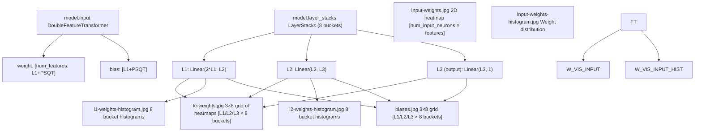

# 模型可视化 (Model Visualization)

-   [model/\_\_init\_\_.py](https://github.com/Chesszyh/nnue-pytorch/blob/024b2064/model/__init__.py)
-   [model/utils/\_\_init\_\_.py](https://github.com/Chesszyh/nnue-pytorch/blob/024b2064/model/utils/__init__.py)
-   [serialize.py](https://github.com/Chesszyh/nnue-pytorch/blob/024b2064/serialize.py)
-   [visualize.py](https://github.com/Chesszyh/nnue-pytorch/blob/024b2064/visualize.py)
-   [visualize\_multi\_hist.py](https://github.com/Chesszyh/nnue-pytorch/blob/024b2064/visualize_multi_hist.py)

本文档记录了用于检查训练好的 NNUE 模型的工具。这些工具生成模型权重、偏置及其分布的可视化表示，以帮助理解模型行为、调试训练问题以及比较不同的网络。

关于在可视化之前在格式之间转换模型的信息，请参阅 [检查点转换 (Checkpoint Conversion)](#5.1)。关于正在可视化的二进制格式结构的详细信息，请参阅 [NNUE 二进制格式 (NNUE Binary Format)](#5.2)。

## 概览

该仓库提供了两个主要的可视化脚本：

-   **`visualize.py`**：单模型检查工具，生成特征变换器权重、层堆栈权重和偏置的详细可视化。支持两个模型之间的差异可视化。
-   **`visualize_multi_hist.py`**：多模型比较工具，生成比较多个网络之间权重分布的直方图。

这两个工具都接受 `.ckpt`、`.pt` 或 `.nnue` 格式的模型，并生成基于 matplotlib 的可视化，这些可视化可以保存到磁盘或交互式显示。

**来源：** [visualize.py1-712](https://github.com/Chesszyh/nnue-pytorch/blob/024b2064/visualize.py#L1-L712) [visualize\_multi\_hist.py1-170](https://github.com/Chesszyh/nnue-pytorch/blob/024b2064/visualize_multi_hist.py#L1-L170)

## 可视化管道

下图显示了模型如何被处理以进行可视化：

```mermaid
flowchart TD
    CKPT[".ckpt file (Lightning checkpoint)"]
    PT[".pt file (PyTorch serialized)"]
    NNUE[".nnue file (Binary format)"]
    LOAD["load_model() or NNUE.load_from_checkpoint()"]
    COALESCE["coalesce_ft_weights() Virtual → Real features"]
    VIS_CLASS["NNUEVisualizer class"]
    PLOT_INPUT["plot_input_weights() Feature transformer"]
    PLOT_FC["plot_fc_weights() Layer stack weights"]
    PLOT_BIAS["plot_fc_biases() Layer stack biases"]
    MULTI_LOAD["Load multiple models"]
    HIST_FT["plot_hists() FT weight distributions"]
    HIST_LS["plot_hists() L1/L2/L3 distributions"]
    MATSHOW["matplotlib matshow() 2D weight matrices"]
    HIST["matplotlib hist() Weight histograms"]
    SAVE["Save to .jpg/.png or show interactively"]

    CKPT --> LOAD
    PT --> LOAD
    NNUE --> LOAD
    LOAD --> COALESCE
    COALESCE --> VIS_CLASS
    VIS --> CLASS_PLOT_INPUT
    VIS --> CLASS_PLOT_FC
    VIS --> CLASS_PLOT_BIAS
    PLOT --> INPUT_MATSHOW
    PLOT --> INPUT_HIST
    PLOT --> FC_MATSHOW
    PLOT --> FC_HIST
    PLOT --> BIAS_MATSHOW
    LOAD --> MULTI_LOAD
    MULTI --> LOAD_HIST_FT
    MULTI --> LOAD_HIST_LS
    HIST --> FT_HIST
    HIST --> LS_HIST
    MATSHOW --> SAVE
    HIST --> SAVE
```


**来源：** [visualize.py9-549](https://github.com/Chesszyh/nnue-pytorch/blob/024b2064/visualize.py#L9-L549) [visualize\_multi\_hist.py57-162](https://github.com/Chesszyh/nnue-pytorch/blob/024b2064/visualize_multi_hist.py#L57-L162) [model/utils/load\_model.py](https://github.com/Chesszyh/nnue-pytorch/blob/024b2064/model/utils/load_model.py)

## 模型组件映射

可视化工具映射到 NNUE 架构的特定组件：


**来源：** [visualize.py40-549](https://github.com/Chesszyh/nnue-pytorch/blob/024b2064/visualize.py#L40-L549) [model/model.py](https://github.com/Chesszyh/nnue-pytorch/blob/024b2064/model/model.py)

## 单模型可视化 (visualize.py)

### 基本用法

```
# Visualize a checkpointpython visualize.py model.ckpt --features HalfKAv2_hm --l1 1024# Visualize and save to directorypython visualize.py model.nnue --save-dir ./plots --features HalfKAv2_hm# Compare two models (visualize difference)python visualize.py new.nnue --ref-model baseline.nnue --features HalfKAv2_hm
```
**来源：** [visualize.py551-711](https://github.com/Chesszyh/nnue-pytorch/blob/024b2064/visualize.py#L551-L711)

### 特征变换器可视化

`plot_input_weights()` 方法创建了特征变换器权重的综合可视化。布局按以下方式排列权重：

1.  **水平轴**：输入神经元（L1 大小，例如 1024 或 2048）
2.  **垂直轴**：按棋子类型和棋盘位置组织的输入特征
3.  **颜色强度**：权重幅度（如果 `--input-weights-vmin ≥ 0` 则为绝对值）

可视化使用以下两种排序之一：

-   **`piece-centric-flipped-king`**（默认）：特征按棋子组织，王的位置翻转，匹配 Stockfish 评估指南布局
-   **`king-centric`**：特征按王的位置组织

每个输入神经元的部分将所有特征权重显示为一条垂直条纹，棋子按标准模式排列：兵在顶部，然后是马、象、车、后和王。

**来源：** [visualize.py40-316](https://github.com/Chesszyh/nnue-pytorch/blob/024b2064/visualize.py#L40-L316)

### 层堆栈可视化

`plot_fc_weights()` 方法生成一个 3×N 网格，其中：

-   **行**：L1、L2 和输出层
-   **列**：层堆栈桶（通常为 8）
-   **内容**：作为热图的权重矩阵

对于 L1 权重，水平线分隔对应于不同输出神经元的权重组，显示每对特征变换器输出（白方和黑方视角）的贡献。

**来源：** [visualize.py317-476](https://github.com/Chesszyh/nnue-pytorch/blob/024b2064/visualize.py#L317-L476)

### 偏置可视化

`plot_fc_biases()` 方法创建一个类似的 3×N 网格，显示每层和每个桶的偏置值。偏置显示为单行矩阵，以便于跨桶比较。

**来源：** [visualize.py477-549](https://github.com/Chesszyh/nnue-pytorch/blob/024b2064/visualize.py#L477-L549)

### 神经元排序

当启用 `--sort-input-neurons` 时，神经元按其关联权重的 L1 范数（绝对值之和）重新排序。这揭示了哪些神经元最重要，并可以突出显示死亡或未充分利用的神经元。

```
# From visualize.py:74-82neuron_weights_norm = np.zeros(hd)for i in range(hd):    neuron_weights_norm[i] = np.sum(np.abs(weights[i::hd]))self.sorted_input_neurons = np.flip(np.argsort(neuron_weights_norm))
```
**来源：** [visualize.py74-289](https://github.com/Chesszyh/nnue-pytorch/blob/024b2064/visualize.py#L74-L289)

## 命令行选项

### visualize.py 选项

| 选项 | 类型 | 默认值 | 描述 |
| --- | --- | --- | --- |
| `model` | 位置参数 | 必需 | 源模型（.ckpt、.pt 或 .nnue）|
| `--ref-model` | 字符串 | None | 用于差异可视化的参考模型 |
| `--ref-features` | 字符串 | 与模型相同 | 参考模型的特征集 |
| `--features` | 字符串 | 必需 | 特征集 (HalfKAv2\_hm, HalfKAv2\_hm^) |
| `--l1` | 整数 | 256 | 特征变换器输出大小 |
| `--input-weights-vmin` | 浮点数 | \-1 | 输入权重色图的最小值 |
| `--input-weights-vmax` | 浮点数 | 1 | 输入权重色图的最大值 |
| `--input-weights-auto-scale` | 标志 | False | 自动缩放输入权重色图 |
| `--input-weights-order` | 选择 | piece-centric-flipped-king | 权重排序 (piece-centric-flipped-king, king-centric) |
| `--sort-input-neurons` | 标志 | False | 按权重的 L1 范数对神经元进行排序 |
| `--fc-weights-vmin` | 浮点数 | \-2 | 全连接权重的色图最小值 |
| `--fc-weights-vmax` | 浮点数 | 2 | 全连接权重的色图最大值 |
| `--fc-weights-auto-scale` | 标志 | False | 自动缩放全连接权重色图 |
| `--no-hist` | 标志 | False | 跳过直方图生成 |
| `--no-biases` | 标志 | False | 跳过偏置可视化 |
| `--no-input-weights` | 标志 | False | 跳过输入权重可视化 |
| `--no-fc-weights` | 标志 | False | 跳过全连接权重可视化 |
| `--default-width` | 整数 | 1600 | 绘图宽度（像素）|
| `--default-height` | 整数 | 900 | 绘图高度（像素）|
| `--save-dir` | 字符串 | None | 保存绘图的目录 |
| `--dont-show` | 标志 | False | 不交互式显示绘图 |
| `--label` | 字符串 | 模型文件名 | 绘图标题和文件名的标签 |

**来源：** [visualize.py551-656](https://github.com/Chesszyh/nnue-pytorch/blob/024b2064/visualize.py#L551-L656)

### visualize\_multi\_hist.py 选项

| 选项 | 类型 | 默认值 | 描述 |
| --- | --- | --- | --- |
| `models` | 位置参数 | 必需 | 要比较的模型列表 |
| `--features` | 字符串 | 必需 | 特征集 (HalfKAv2, HalfKAv2^, HalfKAv2\_hm, HalfKAv2\_hm^) |
| `--l1` | 整数 | 256 | 特征变换器输出大小 |
| `--dont-show` | 标志 | False | 不交互式显示绘图 |

**来源：** [visualize\_multi\_hist.py57-69](https://github.com/Chesszyh/nnue-pytorch/blob/024b2064/visualize_multi_hist.py#L57-L69)

## 多模型比较

### visualize\_multi\_hist.py

此工具生成跨多个模型的直方图比较，产生四个输出文件：

1.  **`input_weights_hist.png`**：特征变换器权重分布
2.  **`input_weights_psqt_hist.png`**：PSQT 权重分布（按 600 缩放到 Stockfish 内部单位）
3.  **`l1_weights_hist.png`**：每个桶的 L1 层权重分布
4.  **`l2_weights_hist.png`**：每个桶的 L2 层权重分布
5.  **`output_weights_hist.png`**：每个桶的输出层权重分布

每个直方图使用对数 Y 轴缩放来显示包括尾部在内的完整分布。

```
# Compare three modelspython visualize_multi_hist.py net1.nnue net2.nnue net3.nnue \    --features HalfKAv2_hm --l1 1024
```
**来源：** [visualize\_multi\_hist.py91-162](https://github.com/Chesszyh/nnue-pytorch/blob/024b2064/visualize_multi_hist.py#L91-L162)

### 差异可视化

使用带有 `--ref-model` 的 `visualize.py` 会在可视化之前从目标模型中减去参考模型的权重：

```
# From visualize.py:46-52if self.args.ref_model:    ref_weights = M.coalesce_ft_weights(        self.ref_model.feature_set, self.ref_model.input    )    ref_weights = ref_weights[:, : self.model.L1]    ref_weights = ref_weights.flatten().numpy()    weights -= ref_weights
```
这对于以下方面很有用：

-   通过比较检查点来跟踪训练进度
-   分析微调变化
-   理解架构修改

**来源：** [visualize.py46-514](https://github.com/Chesszyh/nnue-pytorch/blob/024b2064/visualize.py#L46-L514)

## 可视化解释

### 配色方案

工具根据值范围使用两种色图：

-   **coolwarm**（发散）：当 `vmin < 0` 时使用，以红色显示正权重，以蓝色显示负权重
-   **viridis**（顺序）：当 `vmin ≥ 0` 时使用，从暗到亮显示绝对值

**来源：** [visualize.py207-502](https://github.com/Chesszyh/nnue-pytorch/blob/024b2064/visualize.py#L207-L502)

### 特征变换器布局

特征变换器可视化使用网格布局，其中每个输入神经元占据一个垂直条纹。在每个条纹内：

-   宽度：128 像素（64 用于白棋 + 64 用于黑棋）
-   高度：368 像素（按棋子类型组织）
-   布局段：
    -   兵：每行 8 像素（共 48，不包括第一/最后一行）
    -   马、象、车、后、王：每个 64 像素

王桶信息编码在特征位置中，半盘表示有 32 个王桶。

**来源：** [visualize.py108-176](https://github.com/Chesszyh/nnue-pytorch/blob/024b2064/visualize.py#L108-L176)

### 直方图分箱

直方图使用感知量化的分箱：

-   **输入权重**：每个整数 127 个箱（int16 量化刻度）
-   **L1 权重**：每个整数 64 个箱（int8 量化刻度）
-   **L2 权重**：每个整数 64 个箱
-   **多模型直方图**：跨所有模型根据最小/最大值计算共享箱

**来源：** [visualize.py305-474](https://github.com/Chesszyh/nnue-pytorch/blob/024b2064/visualize.py#L305-L474) [visualize\_multi\_hist.py9-18](https://github.com/Chesszyh/nnue-pytorch/blob/024b2064/visualize_multi_hist.py#L9-L18)

## 交互功能

当以交互方式显示（不使用 `--dont-show`）时，特征变换器可视化提供鼠标悬停信息，显示：

-   输入神经元 ID（排序后或原始）
-   棋子类型和颜色
-   棋子格
-   王格

这是通过 matplotlib 的 `format_coord` 函数实现的：

```
# From visualize.py:249-296def format_coord(x, y):    # ... coordinate calculations ...    return "{}, {} on {}, white king on {}".format(        neuron_label, piece_name, piece_square_name, king_square_name    )ax = plt.gca()ax.format_coord = format_coord
```
**来源：** [visualize.py249-296](https://github.com/Chesszyh/nnue-pytorch/blob/024b2064/visualize.py#L249-L296)

## 实现细节

### 权重合并

两个可视化工具都在可视化之前使用 `coalesce_ft_weights()` 将虚拟特征合并回真实特征。这确保了分解训练（具有虚拟 P、K、HalfRelativeKP 特征）与非分解模型在相同的特征空间中进行可视化。

**来源：** [visualize.py42-44](https://github.com/Chesszyh/nnue-pytorch/blob/024b2064/visualize.py#L42-L44) [visualize\_multi\_hist.py91-93](https://github.com/Chesszyh/nnue-pytorch/blob/024b2064/visualize_multi_hist.py#L91-L93) [model/utils/coalesce\_weights.py](https://github.com/Chesszyh/nnue-pytorch/blob/024b2064/model/utils/coalesce_weights.py)

### 层堆栈迭代

工具使用 `get_coalesced_layer_stacks()` 方法迭代层堆栈，该方法为每个桶返回 `(l1, l2, output)` 元组：

```
# From visualize.py:374-376for bucket_id, (l1, l2, output) in enumerate(    self.model.layer_stacks.get_coalesced_layer_stacks()):
```
**来源：** [visualize.py374-506](https://github.com/Chesszyh/nnue-pytorch/blob/024b2064/visualize.py#L374-L506) [visualize\_multi\_hist.py127-131](https://github.com/Chesszyh/nnue-pytorch/blob/024b2064/visualize_multi_hist.py#L127-L131)

### 图形管理

`_process_fig()` 方法处理保存和显示：

-   如果指定了 `--save-dir`，则保存到 `{save_dir}/{label}_{name}.jpg`
-   如果未指定，则使用 `plt.show()` 交互式显示
-   支持可选的标签前缀用于有组织的输出

**来源：** [visualize.py24-38](https://github.com/Chesszyh/nnue-pytorch/blob/024b2064/visualize.py#L24-L38)

### 模型加载

两个工具都使用统一的 `load_model()` 实用程序函数，该函数处理所有三种格式：

```
# From visualize.py:666-668model = M.load_model(    args.model, feature_set, M.ModelConfig(L1=args.l1), M.QuantizationConfig())
```
此函数在 `model/utils/load_model.py` 中定义，并通过文件扩展名自动检测格式。

**来源：** [visualize.py666-668](https://github.com/Chesszyh/nnue-pytorch/blob/024b2064/visualize.py#L666-L668) [visualize\_multi\_hist.py86-89](https://github.com/Chesszyh/nnue-pytorch/blob/024b2064/visualize_multi_hist.py#L86-L89) [model/utils/load\_model.py](https://github.com/Chesszyh/nnue-pytorch/blob/024b2064/model/utils/load_model.py)
