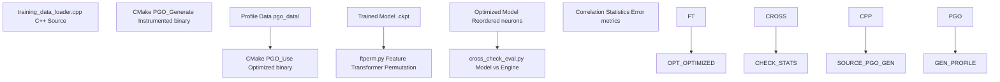
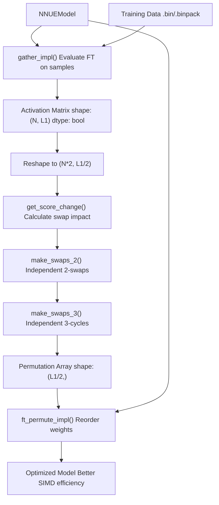
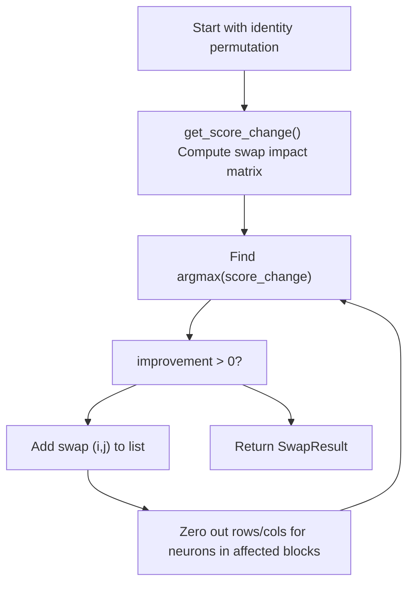
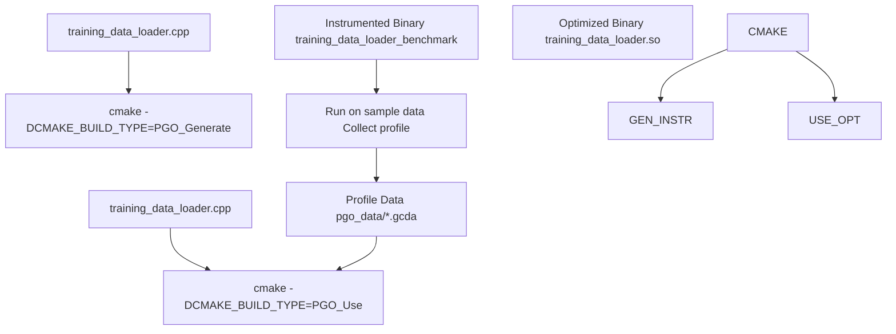
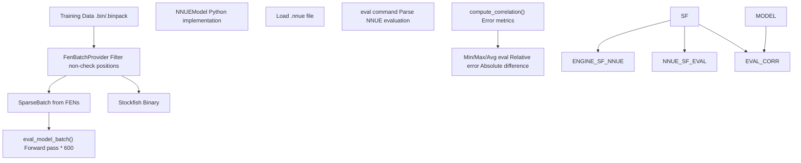
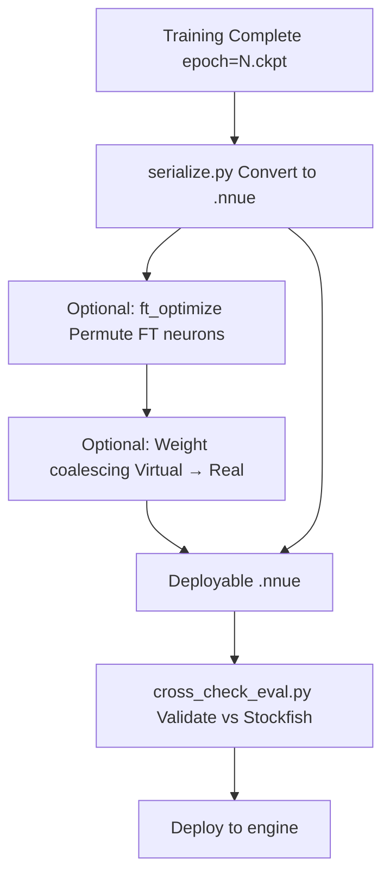

# 优化技术 (Optimization Techniques)

-   [.pgo/small.binpack](https://github.com/Chesszyh/nnue-pytorch/blob/024b2064/.pgo/small.binpack)
-   [CMakeLists.txt](https://github.com/Chesszyh/nnue-pytorch/blob/024b2064/CMakeLists.txt)
-   [compile\_data\_loader.bat](https://github.com/Chesszyh/nnue-pytorch/blob/024b2064/compile_data_loader.bat)
-   [cross\_check\_eval.py](https://github.com/Chesszyh/nnue-pytorch/blob/024b2064/cross_check_eval.py)
-   [ftperm.py](https://github.com/Chesszyh/nnue-pytorch/blob/024b2064/ftperm.py)

## 目的与范围

本文档涵盖了 nnue-pytorch 中使用的用于提高模型推理性能和训练管道效率的高级优化技术。这些优化主要发生在模型训练之后，将训练好的网络转换为适合在国际象棋引擎中部署的高度优化形式。

本文档记录的技术包括：

-   **特征变换器排列 (Feature Transformer Permutation)**：重新排序特征变换器神经元，以最大化零值 SIMD 块
-   **配置文件引导优化 (Profile-Guided Optimization, PGO)**：C++ 数据加载器的编译器级优化
-   **性能分析工具 (Performance Analysis Tools)**：验证和交叉检查实用程序

关于模型序列化和格式转换，请参阅 [模型序列化 (Model Serialization)](#5)。关于训练时优化（如感知量化训练），请参阅 [量化系统 (Quantization System)](#4.5)。

---

## 概览

优化管道通过互补技术增强了模型推理速度和数据加载吞吐量：


**来源**: [ftperm.py1-749](https://github.com/Chesszyh/nnue-pytorch/blob/024b2064/ftperm.py#L1-L749) [CMakeLists.txt1-82](https://github.com/Chesszyh/nnue-pytorch/blob/024b2064/CMakeLists.txt#L1-L82) [cross\_check\_eval.py1-222](https://github.com/Chesszyh/nnue-pytorch/blob/024b2064/cross_check_eval.py#L1-L222)

### 性能影响摘要

| 优化 | 目标组件 | 典型改进 | 成本 |
| --- | --- | --- | --- |
| FT 排列 (FT Permutation) | 特征变换器推理 | 2-10% 加速 | 高显存 (VRAM)，5-30 分钟计算 |
| PGO | C++ 数据加载器 | 10-20% 吞吐量 | 两阶段编译 |
| 权重合并 (Weight Coalescing) | 模型大小 | 10-30% 缩减 | 可忽略 |

---

## 特征变换器排列

### 算法概览

特征变换器排列优化在 `ftperm.py` 中实现，它重新排序 L1/2 神经元，以最大化推理期间评估为零的 4 神经元块的数量。这利用了可以跳过全零块计算的 SIMD 指令集。

**算法由 Daniel Monroe (@Ergodice) 提供**

优化在激活矩阵上进行，其中 `True` 表示裁剪后的零值激活。


**来源**: [ftperm.py58-677](https://github.com/Chesszyh/nnue-pytorch/blob/024b2064/ftperm.py#L58-L677)

### 核心数据结构

该算法使用几个关键数据结构：

| 结构 | 类型 | 形状 | 目的 |
| --- | --- | --- | --- |
| `actmat` | `np.bool_` | `(N, L1)` | 布尔矩阵：True = 零激活 |
| `actmat_chunked` | `np.bool_` | `(N, L1/2/4, 4)` | 分组为 4 神经元 SIMD 块 |
| `score_change` | `np.int_` | `(L1/2, L1/2)` | 交换神经元 i,j 的影响 |
| `perm` | `np.int_` | `(L1/2,)` | 最终排列索引 |

**来源**: [ftperm.py99-204](https://github.com/Chesszyh/nnue-pytorch/blob/024b2064/ftperm.py#L99-L204)

### 交换算法实现

排列搜索使用两种类型的独立操作：

#### 2-交换操作

`make_swaps_2()` 查找神经元对 `(i, j)`，其交换会增加全零 4 神经元块的数量：


**来源**: [ftperm.py215-271](https://github.com/Chesszyh/nnue-pytorch/blob/024b2064/ftperm.py#L215-L271)

关键见解在于 `get_swapped_zero_positive_count()` [ftperm.py99-154](https://github.com/Chesszyh/nnue-pytorch/blob/024b2064/ftperm.py#L99-L154)：

1.  将激活分组为 4 神经元块：`actmat_chunked` 形状 `(N, L1/2/4, 4)`
2.  计算每个块的零值数量：`num_zeros = sum(actmat_chunked, axis=2)`
3.  标记块中其余部分为零的元素：`rest_zero_indicator = (num_zeros - actmat_chunked == 3)`
4.  计算交换收益：`einsum("bi,bj->ij", actmat_flat, rest_zero_indicator)`

#### 3-循环操作

`make_swaps_3()` 查找三元组 `(i, j, k)` 进行右旋，以改善目标：

**来源**: [ftperm.py273-362](https://github.com/Chesszyh/nnue-pytorch/blob/024b2064/ftperm.py#L273-L362)

算法：

1.  计算 3D 分数变化张量：`score_changes[i,j,k] = change[i,j] + change[j,k] + change[k,i]`
2.  压缩到块级粒度以减少内存
3.  查找最佳三元组，确保所有三个神经元都在不同的块中
4.  迭代选择独立的旋转

### 与序列化集成

可以通过两个工作流在序列化期间应用排列：

**手动多步工作流**：

```
# 1. Gather activation datapython ftperm.py gather --data=data.binpack --net=model.nnue \    --count=1000000 --features=HalfKAv2_hm --out=ftact.npy# 2. Find permutationpython ftperm.py find_perm --data=ftact.npy --out=ftact.perm# 3. Evaluate permutationpython ftperm.py eval_perm --data=ftact.npy --perm=ftact.perm# 4. Apply during serializationpython serialize.py model.nnue optimized.nnue \    --features=HalfKAv2_hm --ft_perm=ftact.perm
```
**自动单步工作流**：

```
python serialize.py model.nnue optimized.nnue \    --features=HalfKAv2_hm --ft_optimize \    --ft_optimize_data=data.binpack --ft_optimize_count=1000000
```
**来源**: [ftperm.py1-32](https://github.com/Chesszyh/nnue-pytorch/blob/024b2064/ftperm.py#L1-L32) [ftperm.py652-677](https://github.com/Chesszyh/nnue-pytorch/blob/024b2064/ftperm.py#L652-L677)

### 实现细节

#### 权重排列

`ft_permute_impl()` 函数 [ftperm.py520-541](https://github.com/Chesszyh/nnue-pytorch/blob/024b2064/ftperm.py#L520-L541) 将排列应用于模型权重：

```
Input:  perm shape (L1/2,)
Extend: permutation += [x + L1/2 for x in perm]  # Both FT sides
Add:    permutation += range(L1, num_outputs)    # PSQT weights unchanged

Apply to:
  - input.weight[:, ft_permutation]    # Feature transformer weights
  - input.bias[ft_permutation]         # Feature transformer biases
  - l1.linear.weight[:, permutation]   # First layer stack weights
```
排列必须对称地应用于白方和黑方视角，因为特征变换器是共享的。

#### GPU 加速

该算法支持 NumPy 和 CuPy 后端。CuPy 路径 [ftperm.py102-139](https://github.com/Chesszyh/nnue-pytorch/blob/024b2064/ftperm.py#L102-L139) 显著加速了大型激活矩阵上的 `einsum` 操作：

```
swapped_zero_count = cp.einsum("bi,bj->ij", actmat_flat, rest_zero_indicator)
```
对于显存有限的系统，`--no-cupy` 标志 [ftperm.py687-691](https://github.com/Chesszyh/nnue-pytorch/blob/024b2064/ftperm.py#L687-L691) 回退到带有批处理的 NumPy。

**来源**: [ftperm.py99-188](https://github.com/Chesszyh/nnue-pytorch/blob/024b2064/ftperm.py#L99-L188) [ftperm.py520-541](https://github.com/Chesszyh/nnue-pytorch/blob/024b2064/ftperm.py#L520-L541)

---

## 配置文件引导优化 (PGO)

### 构建系统配置

CMake 构建系统通过 `CMakeLists.txt` 中定义的两阶段编译过程支持 C++ 数据加载器的 PGO。


**来源**: [CMakeLists.txt13-81](https://github.com/Chesszyh/nnue-pytorch/blob/024b2064/CMakeLists.txt#L13-L81)

### CMake 构建类型

构建系统定义了三种相关的构建类型：

| 构建类型 | 标志 | 目的 |
| --- | --- | --- |
| `PGO_Generate` | `-fprofile-generate=${PGO_PROFILE_DATA_DIR}` | 创建插桩二进制文件 |
| `PGO_Use` | `-fprofile-use=${PGO_PROFILE_DATA_DIR} -fprofile-correction` | 使用配置文件数据进行编译 |
| `RelWithDebInfo` | `-g -O3 -march=native -DNDEBUG` | 标准优化构建 |

**来源**: [CMakeLists.txt14-17](https://github.com/Chesszyh/nnue-pytorch/blob/024b2064/CMakeLists.txt#L14-L17)

### PGO 工作流

两阶段过程在 `compile_data_loader.bat` 中自动化：

**阶段 1 - 配置文件生成** [compile\_data\_loader.bat1-4](https://github.com/Chesszyh/nnue-pytorch/blob/024b2064/compile_data_loader.bat#L1-L4)：

```
cmake -S . -B build-pgo-generate -DCMAKE_BUILD_TYPE=PGO_Generatecmake --build ./build-pgo-generate --config PGO_Generate./build-pgo-generate/training_data_loader_benchmark .pgo/small.binpack
```
这将创建带有 `-DBENCH` 标志的 `training_data_loader_benchmark` 可执行文件 [CMakeLists.txt68](https://github.com/Chesszyh/nnue-pytorch/blob/024b2064/CMakeLists.txt#L68-L68)。在代表性数据上运行它会在 `build-pgo-generate/pgo_data/` 中生成配置文件信息。

**阶段 2 - 优化编译** [compile\_data\_loader.bat6-10](https://github.com/Chesszyh/nnue-pytorch/blob/024b2064/compile_data_loader.bat#L6-L10)：

```
cmake -S . -B build \    -DCMAKE_BUILD_TYPE=PGO_Use \    -DPGO_PROFILE_DATA_DIR=build-pgo-generate/pgo_data \    -DCMAKE_INSTALL_PREFIX="./"cmake --build ./build --config PGO_Use --target install
```
这将生成 Python 训练脚本使用的优化后的 `training_data_loader.so` 库。

**来源**: [compile\_data\_loader.bat1-12](https://github.com/Chesszyh/nnue-pytorch/blob/024b2064/compile_data_loader.bat#L1-L12)

### 启用的编译器优化

PGO 使编译器能够：

1.  **分支预测 (Branch Prediction)**：优化配置文件数据中识别的热点路径
2.  **函数内联 (Function Inlining)**：内联频繁调用的函数
3.  **代码布局 (Code Layout)**：将热点代码安排在一起以获得更好的缓存利用率
4.  **死代码消除 (Dead Code Elimination)**：移除冷路径

`-fprofile-correction` 标志 [CMakeLists.txt17](https://github.com/Chesszyh/nnue-pytorch/blob/024b2064/CMakeLists.txt#L17-L17) 处理配置文件数据不完整或不一致的情况。

### BMI2 支持检测

构建系统检测 BMI2 CPU 指令支持 [CMakeLists.txt24-60](https://github.com/Chesszyh/nnue-pytorch/blob/024b2064/CMakeLists.txt#L24-L60)：

```
check_bmi2_support()if(CPU_SUPPORTS_BMI2)    message(STATUS "Adding BMI2 support")    add_definitions(-DHAS_BMI2)endif()
```
对于 AMD CPU，由于早期代次上的 PDEP/PEXT 较慢，BMI2 仅对 family 23+ 启用。这种优化对于国际象棋局面解析中的高效位棋盘操作至关重要。

**来源**: [CMakeLists.txt24-60](https://github.com/Chesszyh/nnue-pytorch/blob/024b2064/CMakeLists.txt#L24-L60)

---

## 性能分析工具

### 与 Stockfish 交叉检查

`cross_check_eval.py` 脚本针对 Stockfish 的 NNUE 评估验证模型输出，以检测量化错误、实现错误或训练问题。


**来源**: [cross\_check\_eval.py1-222](https://github.com/Chesszyh/nnue-pytorch/blob/024b2064/cross_check_eval.py#L1-L222)

### 评估过程

#### 模型评估路径

`eval_model_batch()` 函数 [cross\_check\_eval.py42-73](https://github.com/Chesszyh/nnue-pytorch/blob/024b2064/cross_check_eval.py#L42-L73) 使用 Python 模型评估局面：

1.  从 `SparseBatchPtr` 提取张量
2.  前向传递：`model.forward(...) * 600.0`（转换为分）
3.  对于黑方走棋的局面翻转符号

#### 引擎评估路径

`eval_engine_batch()` 函数 [cross\_check\_eval.py136-151](https://github.com/Chesszyh/nnue-pytorch/blob/024b2064/cross_check_eval.py#L136-L151) 查询 Stockfish：

1.  启动带有 stdin/stdout 管道的 Stockfish 子进程
2.  发送 UCI 命令：`uci`, `setoption name EvalFile value <net>`
3.  对于每个 FEN：`position fen <fen>`, `eval`
4.  使用正则表达式解析输出：`re_nnue_eval = re.compile(r"NNUE evaluation:?\s*?([-+]?\d*?\.\d*)")`
5.  转换为整数分：`int(float(v) * 208)`

**来源**: [cross\_check\_eval.py76-151](https://github.com/Chesszyh/nnue-pytorch/blob/024b2064/cross_check_eval.py#L76-L151)

### 统计指标

`compute_correlation()` 函数 [cross\_check\_eval.py88-133](https://github.com/Chesszyh/nnue-pytorch/blob/024b2064/cross_check_eval.py#L88-L133) 计算综合误差统计：

| 指标 | 公式 | 目的 |
| --- | --- | --- |
| **基本统计** |  |  |
| 最小/最大/平均评估 | `min()`, `max()`, `mean()` | 评估范围 |
| 平均绝对评估 | `mean(abs(eval))` | 评估幅度 |
| **误差指标** |  |  |
| 相对模型误差 | `mean(abs(m-e)/(abs(m)+0.001))` | 相对于模型的误差 |
| 相对引擎误差 | `mean(abs(m-e)/(abs(e)+0.001))` | 相对于引擎的误差 |
| 平均绝对差异 | `mean(abs(m-e))` | 平均分 (centipawn) 误差 |
| 最小/最大差异 | `min(abs(m-e))`, `max(abs(m-e))` | 误差界限 |

**来源**: [cross\_check\_eval.py88-133](https://github.com/Chesszyh/nnue-pytorch/blob/024b2064/cross_check_eval.py#L88-L133)

### 使用示例

```
python cross_check_eval.py \    --net=model.nnue \    --engine=/path/to/stockfish \    --data=validation.binpack \    --features=HalfKAv2_hm \    --count=10000
```
正确实现的模型的预期输出：

```
Min engine/model eval: -2500 / -2480
Max engine/model eval: 2500 / 2520
Avg engine/model eval: 12.3 / 12.5
Avg abs engine/model eval: 145.2 / 145.8
Relative engine error: 0.023
Relative model error: 0.022
Avg abs difference: 3.2
Min difference: 0
Max difference: 15
```
大于 ~5 分的平均差异表明存在实现问题。

**来源**: [cross\_check\_eval.py164-217](https://github.com/Chesszyh/nnue-pytorch/blob/024b2064/cross_check_eval.py#L164-L217)

### FEN 过滤

这两个工具都过滤掉王被将军的局面 [ftperm.py447-454](https://github.com/Chesszyh/nnue-pytorch/blob/024b2064/ftperm.py#L447-L454) [cross\_check\_eval.py154-161](https://github.com/Chesszyh/nnue-pytorch/blob/024b2064/cross_check_eval.py#L154-L161)：

```
def filter_fens(fens):    filtered_fens = []    for fen in fens:        board = chess.Board(fen=fen)        if not board.is_check():            filtered_fens.append(fen)    return filtered_fens
```
这是必要的，因为 Stockfish 无法评估王被将军的局面（在正常游戏中它们是非法局面）。

**来源**: [ftperm.py447-454](https://github.com/Chesszyh/nnue-pytorch/blob/024b2064/ftperm.py#L447-L454) [cross\_check\_eval.py154-161](https://github.com/Chesszyh/nnue-pytorch/blob/024b2064/cross_check_eval.py#L154-L161)

---

## 与训练管道集成

### 模型生命周期中的优化工作流

优化通常应用于模型生命周期的不同阶段：


**来源**: [ftperm.py24-32](https://github.com/Chesszyh/nnue-pytorch/blob/024b2064/ftperm.py#L24-L32) [cross\_check\_eval.py164-217](https://github.com/Chesszyh/nnue-pytorch/blob/024b2064/cross_check_eval.py#L164-L217)

### 性能考量

#### 内存需求

FT 排列需要大量的显存 (VRAM) 来进行 CuPy einsum 操作：

| L1 大小 | 激活矩阵 | 分数变化矩阵 | 近似 VRAM |
| --- | --- | --- | --- |
| 1024 | `(1M, 1024)` | `(512, 512)` | ~2 GB |
| 2048 | `(1M, 2048)` | `(1024, 1024)` | ~6 GB |

`--count` 参数控制采样局面的数量。如果遇到 VRAM 问题，请减小该值 [ftperm.py1-4](https://github.com/Chesszyh/nnue-pytorch/blob/024b2064/ftperm.py#L1-L4)

#### 计算时间

现代硬件上的典型优化时间：

-   **FT 排列** (1M 样本, L1=2048)：5-30 分钟，取决于 GPU
-   **PGO 编译**：两个阶段共 2-5 分钟
-   **交叉检查验证** (10k 局面)：1-2 分钟

**来源**: [ftperm.py550-583](https://github.com/Chesszyh/nnue-pytorch/blob/024b2064/ftperm.py#L550-L583) [compile\_data\_loader.bat1-12](https://github.com/Chesszyh/nnue-pytorch/blob/024b2064/compile_data_loader.bat#L1-L12)

### 最佳实践

1.  **FT 排列**：

    -   使用具有代表性的训练数据来收集激活
    -   典型数量：1M-10M 个局面以获得稳定的排列
    -   在应用之前始终使用 `eval_perm` 进行验证
2.  **PGO**：

    -   配置文件数据应涵盖不同的训练场景
    -   使用实际的 `.binpack` 文件，而不是玩具数据
    -   更改 CPU 架构时重新构建
3.  **验证**：

    -   在多个数据源上运行交叉检查
    -   与已知良好的基线网络进行比较
    -   对于生产模型，监控相对误差 <2.5%

**来源**: [ftperm.py1-32](https://github.com/Chesszyh/nnue-pytorch/blob/024b2064/ftperm.py#L1-L32) [compile\_data\_loader.bat1-12](https://github.com/Chesszyh/nnue-pytorch/blob/024b2064/compile_data_loader.bat#L1-L12) [cross\_check\_eval.py164-217](https://github.com/Chesszyh/nnue-pytorch/blob/024b2064/cross_check_eval.py#L164-L217)
