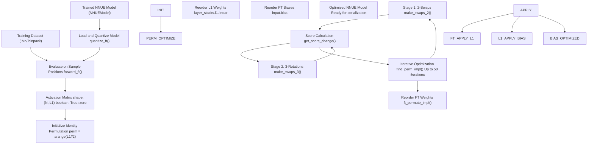
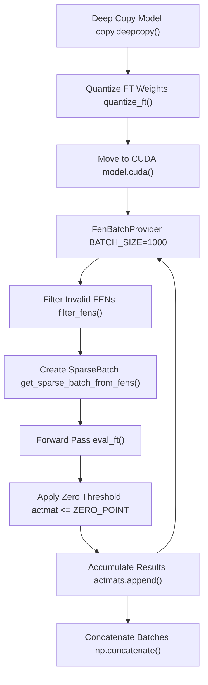
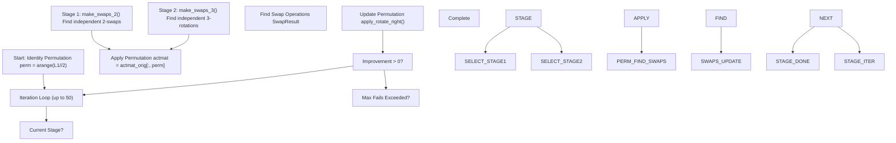
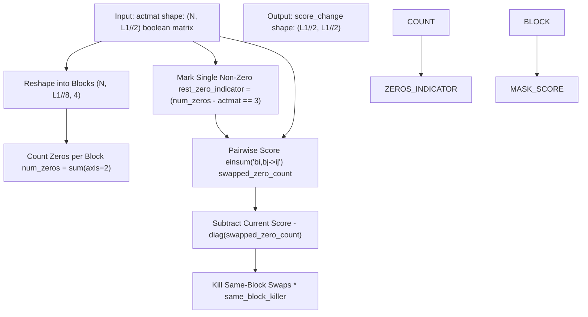
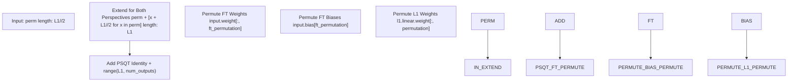
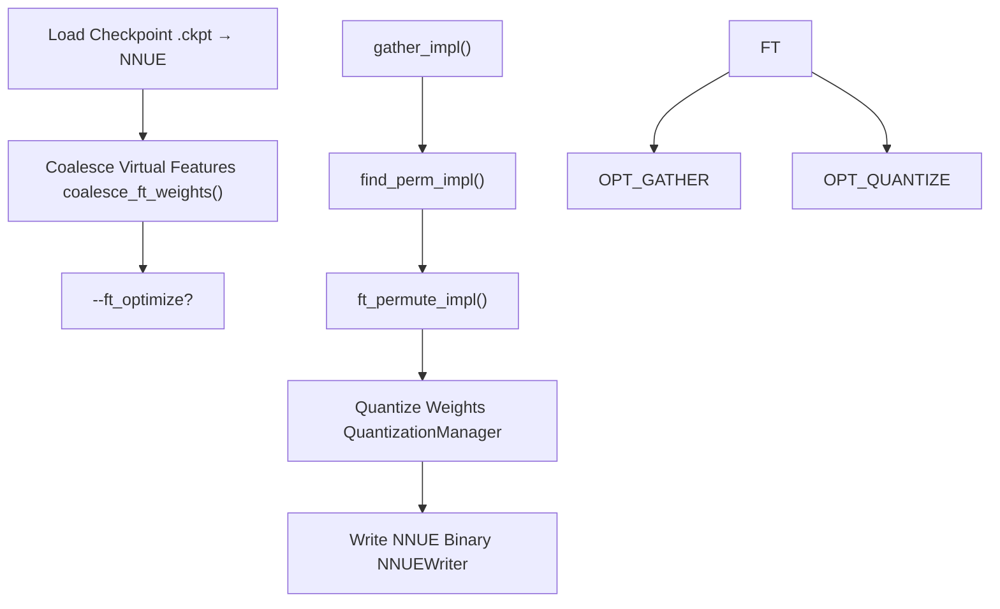

# 特征变换器排列 (Feature Transformer Permutation)

-   [cross\_check\_eval.py](https://github.com/Chesszyh/nnue-pytorch/blob/024b2064/cross_check_eval.py)
-   [ftperm.py](https://github.com/Chesszyh/nnue-pytorch/blob/024b2064/ftperm.py)

## 目的与范围

特征变换器排列 (`ftperm.py`) 实现了一种配置文件引导优化技术，该技术重新排序特征变换器层中的神经元，以最大化零值 4 神经元块。通过在块中所有神经元评估为零时启用整个块的跳过，此优化提高了 Stockfish 国际象棋引擎推理期间的 SIMD (单指令多数据) 效率。

这种优化作为训练后步骤应用于模型序列化期间。关于整体序列化工作流的信息，请参阅 [检查点转换 (Checkpoint Conversion)](#5.1)。关于特征变换器架构本身的详细信息，请参阅 [特征变换器 (Feature Transformer)](#4.3)。

**来源：** [ftperm.py1-62](https://github.com/Chesszyh/nnue-pytorch/blob/024b2064/ftperm.py#L1-L62)

## 概览

优化过程遵循类似于编译器优化的配置文件引导方法：

1.  **分析阶段 (Profile Phase)**：通过在数据集中的代表性局面上评估模型来收集激活模式
2.  **分析阶段 (Analysis Phase)**：找到最大化全零 4 神经元块数量的最佳神经元排列
3.  **应用阶段 (Application Phase)**：根据发现的排列重新排序特征变换器权重

该算法利用了这样一个事实：在推理过程中，为了 SIMD 效率，神经元以 4 个为一组进行处理。当块中的所有 4 个神经元都为零时，可以跳过整个块，从而加快评估速度。

**来源：** [ftperm.py58-65](https://github.com/Chesszyh/nnue-pytorch/blob/024b2064/ftperm.py#L58-L65) [ftperm.py550-677](https://github.com/Chesszyh/nnue-pytorch/blob/024b2064/ftperm.py#L550-L677)

## 工作流图


**来源：** [ftperm.py652-677](https://github.com/Chesszyh/nnue-pytorch/blob/024b2064/ftperm.py#L652-L677) [ftperm.py365-416](https://github.com/Chesszyh/nnue-pytorch/blob/024b2064/ftperm.py#L365-L416) [ftperm.py520-547](https://github.com/Chesszyh/nnue-pytorch/blob/024b2064/ftperm.py#L520-L547)

## 动机：SIMD 块处理

在 Stockfish 的推理过程中，特征变换器层以 4 个为一组处理神经元，以提高 SIMD 效率。常量 `ZERO_BLOCK_SIZE = 4` 定义了这种分组。

### 为什么排列很重要

当神经元评估为零（或量化后接近零）时，它对最终评估没有贡献。如果块中的所有 4 个神经元都为零，则可以跳过整个块：

| 块状态 | SIMD 操作 | 效率 |
| --- | --- | --- |
| \[0, 0, 0, 0\] | 跳过整个块 | **高** |
| \[0, 0, 0, X\] | 处理所有 4 个 | 低 |
| \[X, X, X, X\] | 处理所有 4 个 | 基线 |

通过重新排序神经元将零值分组在一起，更多的块变为全零，从而启用更多的跳过。

### 激活矩阵表示

激活矩阵是形状为 `(N, L1)` 的布尔数组，其中：

-   `N` 是样本局面的数量
-   `L1` 是特征变换器输出大小
-   `True` 表示神经元评估为零 (≤ ZERO\_POINT)
-   `False` 表示非零激活

**来源：** [ftperm.py64](https://github.com/Chesszyh/nnue-pytorch/blob/024b2064/ftperm.py#L64-L64) [ftperm.py550-552](https://github.com/Chesszyh/nnue-pytorch/blob/024b2064/ftperm.py#L550-L552) [ftperm.py608-611](https://github.com/Chesszyh/nnue-pytorch/blob/024b2064/ftperm.py#L608-L611)

## 激活收集阶段

### 过程概览


### 实现细节

收集过程 ([ftperm.py550-582](https://github.com/Chesszyh/nnue-pytorch/blob/024b2064/ftperm.py#L550-L582))：

1.  **模型准备**：创建模型的量化副本以匹配推理行为
2.  **批处理**：以 1000 个为一批处理局面以管理内存
3.  **FEN 过滤**：跳过王被将军的局面（无法评估）
4.  **前向传递**：使用 `forward_ft()` 仅通过特征变换器层进行评估
5.  **零检测**：应用阈值 (`ZERO_POINT = 0.0`) 来识别零激活
6.  **累积**：收集所有批次的布尔激活矩阵

量化步骤 ([ftperm.py457-463](https://github.com/Chesszyh/nnue-pytorch/blob/024b2064/ftperm.py#L457-L463)) 至关重要——它确保激活模式与推理期间发生的模式相匹配：

```
# Quantize to int16 for FT weights, int32 for biasesmodel.input.weight.data *= quantization.ft_quantized_onemodel.input.bias.data *= quantization.ft_quantized_one
```
**来源：** [ftperm.py550-582](https://github.com/Chesszyh/nnue-pytorch/blob/024b2064/ftperm.py#L550-L582) [ftperm.py457-463](https://github.com/Chesszyh/nnue-pytorch/blob/024b2064/ftperm.py#L457-L463) [ftperm.py466-489](https://github.com/Chesszyh/nnue-pytorch/blob/024b2064/ftperm.py#L466-L489) [ftperm.py492-517](https://github.com/Chesszyh/nnue-pytorch/blob/024b2064/ftperm.py#L492-L517)

## 排列搜索阶段

### 算法概览

搜索算法 ([ftperm.py365-416](https://github.com/Chesszyh/nnue-pytorch/blob/024b2064/ftperm.py#L365-L416)) 使用由 Daniel Monroe (@Ergodice) 开发的迭代多阶段方法：


该算法维护一个长度为 `L1/2`（特征变换器输出大小的一半）的排列数组 `perm`。两个视角（白方和黑方）使用相同的排列。

**来源：** [ftperm.py365-416](https://github.com/Chesszyh/nnue-pytorch/blob/024b2064/ftperm.py#L365-L416)

### 阶段 1：2-交换

`make_swaps_2()` 函数 ([ftperm.py215-270](https://github.com/Chesszyh/nnue-pytorch/blob/024b2064/ftperm.py#L215-L270)) 查找应该交换的一对神经元，以增加全零块的数量：

#### 分数计算


关键见解是，交换神经元 `i` 和 `j` 在以下情况下会提高分数：

-   神经元 `i` 在神经元 `j` 是其块中唯一的非零的局面中为零
-   神经元 `j` 在神经元 `i` 是其块中唯一的非零的局面中为零

`rest_zero_indicator` 矩阵标记块中所有其他神经元都为零的元素 ([ftperm.py119-131](https://github.com/Chesszyh/nnue-pytorch/blob/024b2064/ftperm.py#L119-L131))。

#### 贪婪选择

算法贪婪地选择交换 ([ftperm.py240-261](https://github.com/Chesszyh/nnue-pytorch/blob/024b2064/ftperm.py#L240-L261))：

1.  找到具有最大改进的交换 `(i, j)`
2.  如果改进 ≤ 0，则终止阶段
3.  将交换添加到列表并将受影响的块标记为不可用
4.  将与 `i` 和 `j` 处于同一块中的神经元的分数归零，确保所有选定的交换都是 **独立的**（可以按任何顺序应用）

**来源：** [ftperm.py215-270](https://github.com/Chesszyh/nnue-pytorch/blob/024b2064/ftperm.py#L215-L270) [ftperm.py190-203](https://github.com/Chesszyh/nnue-pytorch/blob/024b2064/ftperm.py#L190-L203) [ftperm.py157-187](https://github.com/Chesszyh/nnue-pytorch/blob/024b2064/ftperm.py#L157-L187) [ftperm.py99-154](https://github.com/Chesszyh/nnue-pytorch/blob/024b2064/ftperm.py#L99-L154)

### 阶段 2：3-旋转

`make_swaps_3()` 函数 ([ftperm.py273-362](https://github.com/Chesszyh/nnue-pytorch/blob/024b2064/ftperm.py#L273-L362)) 将优化扩展到 3 元素右旋：`(i, j, k) → (k, i, j)`。

#### 为什么旋转？

有些改进需要循环移动 3 个神经元。例如：

-   位置 A 的神经元应该去 B
-   位置 B 的神经元应该去 C
-   位置 C 的神经元应该去 A

仅用 2-交换无法实现这一点。

#### 算法差异

3-旋转算法 ([ftperm.py286-294](https://github.com/Chesszyh/nnue-pytorch/blob/024b2064/ftperm.py#L286-L294)) 计算 3D 分数张量：

```
# score_changes[i, j, k] = improvement from rotation (i, j, k)score_changes = (    score_changes[:, :, None]           # score_change[i, j]    + score_changes[None, :, :]         # score_change[j, k]    + (score_changes.T)[:, None, :]     # score_change[k, i])
```
为了避免内存问题，算法在选择最佳旋转之前压缩到块级最大值 ([ftperm.py301-311](https://github.com/Chesszyh/nnue-pytorch/blob/024b2064/ftperm.py#L301-L311))。

**来源：** [ftperm.py273-362](https://github.com/Chesszyh/nnue-pytorch/blob/024b2064/ftperm.py#L273-L362)

### 终止条件

优化在以下情况下终止：

1.  当前阶段未发现改进（阶段 1 允许 0 次失败，阶段 2 允许 0 次失败）
2.  所有阶段已用尽
3.  达到最大迭代限制 (50)

**来源：** [ftperm.py402-414](https://github.com/Chesszyh/nnue-pytorch/blob/024b2064/ftperm.py#L402-L414)

## 排列应用阶段

### 权重重新排序

`ft_permute_impl()` 函数 ([ftperm.py520-541](https://github.com/Chesszyh/nnue-pytorch/blob/024b2064/ftperm.py#L520-L541)) 将发现的排列应用于模型权重：


### 关键实现细节

1.  **视角对称性** ([ftperm.py529-530](https://github.com/Chesszyh/nnue-pytorch/blob/024b2064/ftperm.py#L529-L530))：将相同的排列应用于特征变换器的白方和黑方视角

2.  **PSQT 保留** ([ftperm.py532-533](https://github.com/Chesszyh/nnue-pytorch/blob/024b2064/ftperm.py#L532-L533))：PSQT（子力-位置价值表）权重附加了恒等排列——它们不会重新排序

3.  **三个权重更新**：

    -   特征变换器输入权重：`(num_features, num_outputs)` → 排列列
    -   特征变换器偏置：`(num_outputs,)` → 排列元素
    -   第一层堆栈权重：`(layer_size, L1)` → 排列列（不包括 PSQT 输入）

**来源：** [ftperm.py520-541](https://github.com/Chesszyh/nnue-pytorch/blob/024b2064/ftperm.py#L520-L541)

## 使用

### 独立使用

脚本为手动工作流提供了三个子命令：

#### 1\. 收集激活数据

```
python ftperm.py gather \    --net=nn-5af11540bbfe.nnue \    --data=data/fishpack32.binpack \    --count=1000000 \    --features=HalfKAv2_hm \    --out=ftact1m.npy
```
**参数：**

-   `--net`：`.nnue` 文件路径
-   `--data`：训练数据集（`.bin` 或 `.binpack`）
-   `--count`：要处理的局面数量
-   `--features`：特征集名称
-   `--out`：激活矩阵的输出文件

#### 2\. 查找最佳排列

```
python ftperm.py find_perm \    --data=ftact1m.npy \    --out=ftact.perm
```
#### 3\. 评估排列

```
python ftperm.py eval_perm \    --data=ftact1m.npy \    --perm=ftact.perm
```
这将打印统计信息：

-   **基本矩阵中的合并零 (Combined zeros in base matrix)**：排列前的全零块百分比
-   **排列矩阵中的合并零 (Combined zeros in perm matrix)**：排列后的百分比

#### 4\. 应用于模型

```
python serialize.py nn-5af11540bbfe.nnue permuted.nnue \    --features=HalfKAv2_hm \    --ft_perm=ftact.perm
```
**来源：** [ftperm.py5-32](https://github.com/Chesszyh/nnue-pytorch/blob/024b2064/ftperm.py#L5-L32) [ftperm.py585-649](https://github.com/Chesszyh/nnue-pytorch/blob/024b2064/ftperm.py#L585-L649)

### 集成使用

推荐的方法将所有步骤集成到序列化过程中：

```
python serialize.py nn-5af11540bbfe.nnue optimized.nnue \    --features=HalfKAv2_hm \    --ft_optimize \    --ft_optimize_data=data/fishpack32.binpack \    --ft_optimize_count=1000000
```
`ft_optimize()` 函数 ([ftperm.py652-677](https://github.com/Chesszyh/nnue-pytorch/blob/024b2064/ftperm.py#L652-L677)) 执行完整的管道：

| 步骤 | 函数 | 描述 |
| --- | --- | --- |
| 1 | `gather_impl()` | 收集激活矩阵 |
| 2 | `find_perm_impl()` | 查找最佳排列 |
| 3 | `eval_perm_impl()` | 评估改进 |
| 4 | `ft_permute_impl()` | 应用于模型权重 |

**来源：** [ftperm.py652-677](https://github.com/Chesszyh/nnue-pytorch/blob/024b2064/ftperm.py#L652-L677) [serialize.py](https://github.com/Chesszyh/nnue-pytorch/blob/024b2064/serialize.py#LNaN-LNaN)

## GPU 加速

### CuPy 集成

该算法通过 CuPy ([ftperm.py41](https://github.com/Chesszyh/nnue-pytorch/blob/024b2064/ftperm.py#L41-L41)) 支持 GPU 加速，用于计算密集型的分数计算：

```
--use-cupy      # Use GPU (default)--no-cupy       # Use NumPy (CPU fallback)--device=0      # GPU device index
```
### 内存考量

分数计算需要存储大矩阵：

-   对于 `L1 = 1024`：每批次分数矩阵为 `512 × 512`
-   对于 `L1 = 2048`：每批次分数矩阵为 `1024 × 1024`

该实现使用批处理 ([ftperm.py164-169](https://github.com/Chesszyh/nnue-pytorch/blob/024b2064/ftperm.py#L164-L169)) 分块处理激活数据：

```
BATCH_SIZE = 10000  # Positions per batch
```
如果 GPU 内存不足，请减少 `--count` 或使用 `--no-cupy` 回退到 CPU。

**来源：** [ftperm.py100-154](https://github.com/Chesszyh/nnue-pytorch/blob/024b2064/ftperm.py#L100-L154) [ftperm.py157-187](https://github.com/Chesszyh/nnue-pytorch/blob/024b2064/ftperm.py#L157-L187) [ftperm.py686-693](https://github.com/Chesszyh/nnue-pytorch/blob/024b2064/ftperm.py#L686-L693)

## 性能特征

### 计算复杂度

| 阶段 | 时间复杂度 | 空间复杂度 | 可并行化 |
| --- | --- | --- | --- |
| 激活收集 | O(N × L1) | O(N × L1) | 是 (GPU) |
| 2-交换分数 | O(N × L1²) | O(L1²) | 是 (GPU) |
| 2-交换选择 | O(L1² × iterations) | O(L1²) | 否 |
| 3-旋转分数 | O(N × L1³) | O(L1³) 压缩后 | 是 (GPU) |
| 3-旋转选择 | O(L1³ × iterations) | O(L1³) 压缩后 | 否 |

其中：

-   `N` = 样本局面数量
-   `L1` = 特征变换器输出大小（通常为 1024 或 2048）

### 典型性能

对于 `--count=1000000` 在现代 GPU 上：

-   激活收集：~2-5 分钟
-   排列搜索：~10-30 分钟
-   总体改进：0.5-2.0% 更多零块

### 改进指标

算法将改进跟踪为全零块增加的百分比：

```
Improvement = (new_zero_blocks - old_zero_blocks) / total_blocks * 100
```
典型结果 ([ftperm.py263-268](https://github.com/Chesszyh/nnue-pytorch/blob/024b2064/ftperm.py#L263-L268) [ftperm.py359-361](https://github.com/Chesszyh/nnue-pytorch/blob/024b2064/ftperm.py#L359-L361))：

-   阶段 1 (2-交换)：0.5-1.5% 改进
-   阶段 2 (3-旋转)：0.1-0.5% 额外改进

**来源：** [ftperm.py263-268](https://github.com/Chesszyh/nnue-pytorch/blob/024b2064/ftperm.py#L263-L268) [ftperm.py359-361](https://github.com/Chesszyh/nnue-pytorch/blob/024b2064/ftperm.py#L359-L361) [ftperm.py608-625](https://github.com/Chesszyh/nnue-pytorch/blob/024b2064/ftperm.py#L608-L625)

## 实现细节

### 数据结构

算法使用以下关键数据结构：

| 结构 | 类型 | 形状 | 描述 |
| --- | --- | --- | --- |
| `actmat` | `np.ndarray[np.bool_]` | `(N, L1//2)` | 激活矩阵（从 `(N, L1)` 重塑）|
| `perm` | `np.ndarray[np.int_]` | `(L1//2,)` | 当前神经元排列 |
| `score_change` | `np.ndarray[np.int_]` | `(L1//2, L1//2)` | 2-交换的改进矩阵 |
| `score_changes` | `np.ndarray[np.int_]` | `(L1//2, L1//2, L1//2)` | 3-旋转的改进张量 |

### 排列表示

由于对称性，排列在特征变换器的一半（一个视角）上操作。完整的排列映射为：

```
Neuron Index     Permutation Applied
────────────     ───────────────────
0 to L1//2-1     perm[0] to perm[L1//2-1]
L1//2 to L1-1    perm[0]+L1//2 to perm[L1//2-1]+L1//2
L1 to num_outputs  Identity (PSQT, unchanged)
```
**来源：** [ftperm.py368-374](https://github.com/Chesszyh/nnue-pytorch/blob/024b2064/ftperm.py#L368-L374) [ftperm.py520-533](https://github.com/Chesszyh/nnue-pytorch/blob/024b2064/ftperm.py#L520-L533)

### 交换操作

两个原始操作操纵排列：

#### apply\_swap

```
def apply_swap(perm: npt.NDArray, i: int, j: int) -> None:    """Swap i-th and j-th elements in the array perm."""    perm[i], perm[j] = perm[j], perm[i]
```
#### apply\_rotate\_right

```
def apply_rotate_right(perm: npt.NDArray, indices: tuple[int, ...]) -> None:    """Right-rotate values at selected indices."""    # (i, j, k) → (k, i, j)    values = [perm[i] for i in indices]    new_values = [values[-1]] + values[:-1]    for i, j in zip(indices, new_values):        perm[i] = j
```
这些操作应用于排列数组，而不是直接应用于权重。权重重新排序在最后发生一次。

**来源：** [ftperm.py80-96](https://github.com/Chesszyh/nnue-pytorch/blob/024b2064/ftperm.py#L80-L96)

### 块级独立性保证

算法通过将受影响块的分数归零来确保所有选定的交换/旋转都是独立的 ([ftperm.py256-261](https://github.com/Chesszyh/nnue-pytorch/blob/024b2064/ftperm.py#L256-L261) [ftperm.py354-357](https://github.com/Chesszyh/nnue-pytorch/blob/024b2064/ftperm.py#L354-L357))：

```
# After selecting a swap (i, j)indices_to_kill = all_indices_in_same_block(i) + all_indices_in_same_block(j)for index in indices_to_kill:    score_change[:, index] = 0  # Zero out columns    score_change[index, :] = 0  # Zero out rows
```
这防止了后续迭代选择重叠的交换，这会使分数计算无效。

**来源：** [ftperm.py232-261](https://github.com/Chesszyh/nnue-pytorch/blob/024b2064/ftperm.py#L232-L261) [ftperm.py354-357](https://github.com/Chesszyh/nnue-pytorch/blob/024b2064/ftperm.py#L354-L357)

## 与序列化管道集成

特征变换器排列作为可选的优化步骤集成到模型序列化管道中：


排列应用于虚拟特征合并 **之后** 但在量化 **之前**。这种排序确保：

1.  虚拟特征已经折叠，因此排列仅在真实特征上操作
2.  量化考虑了排列后的权重布局
3.  最终的二进制格式反映了优化的神经元顺序

**来源：** [ftperm.py652-677](https://github.com/Chesszyh/nnue-pytorch/blob/024b2064/ftperm.py#L652-L677) [serialize.py workflow implied by ftperm.py22-30](https://github.com/Chesszyh/nnue-pytorch/blob/024b2064/serialize.py workflow implied by ftperm.py#L22-L30)

---

**完整来源：** [ftperm.py1-749](https://github.com/Chesszyh/nnue-pytorch/blob/024b2064/ftperm.py#L1-L749) [cross\_check\_eval.py1-222](https://github.com/Chesszyh/nnue-pytorch/blob/024b2064/cross_check_eval.py#L1-L222)
