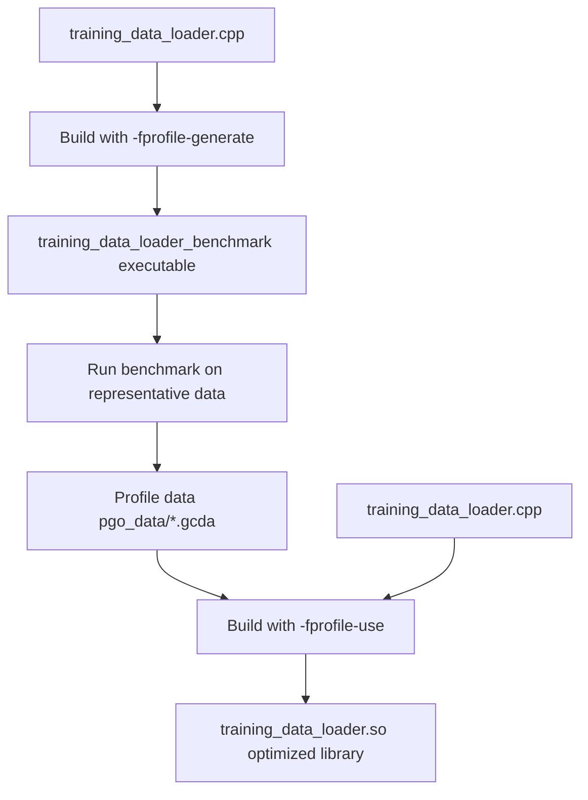
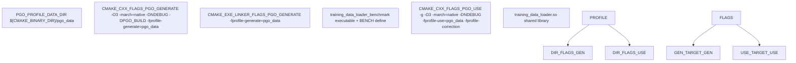
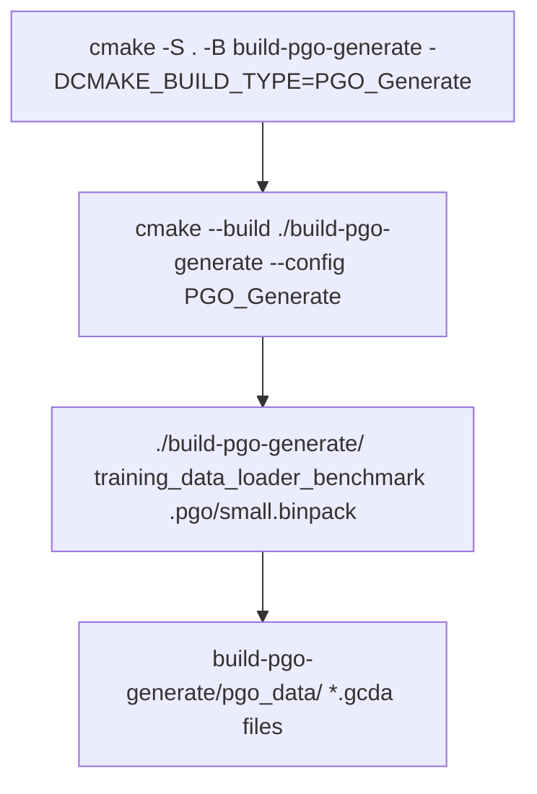
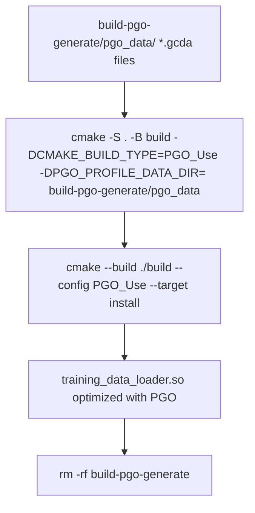
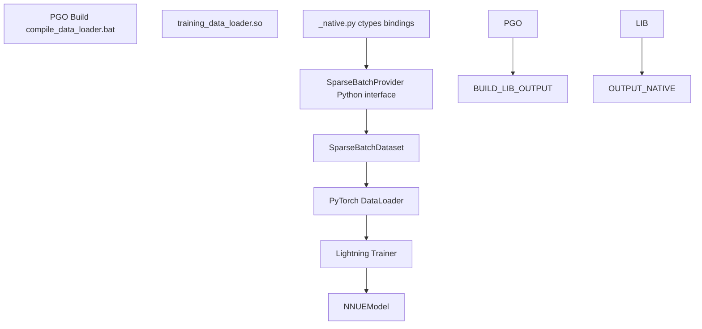

# 配置文件引导优化 (PGO)

-   [.pgo/small.binpack](https://github.com/Chesszyh/nnue-pytorch/blob/024b2064/.pgo/small.binpack)
-   [CMakeLists.txt](https://github.com/Chesszyh/nnue-pytorch/blob/024b2064/CMakeLists.txt)
-   [compile\_data\_loader.bat](https://github.com/Chesszyh/nnue-pytorch/blob/024b2064/compile_data_loader.bat)
-   [lib/nnue\_training\_data\_formats.h](https://github.com/Chesszyh/nnue-pytorch/blob/024b2064/lib/nnue_training_data_formats.h)
-   [lib/nnue\_training\_data\_stream.h](https://github.com/Chesszyh/nnue-pytorch/blob/024b2064/lib/nnue_training_data_stream.h)
-   [training\_data\_loader.cpp](https://github.com/Chesszyh/nnue-pytorch/blob/024b2064/training_data_loader.cpp)

本文档涵盖了 C++ 训练数据加载器的配置文件引导优化 (PGO) 构建过程。PGO 是一种编译器优化技术，它使用运行时分析信息来生成更高效的机器代码。关于模型本身的其他性能优化的信息，请参阅 [特征变换器排列 (Feature Transformer Permutation)](#6.1)。

C++ 数据加载器 ([training\_data\_loader.cpp](https://github.com/Chesszyh/nnue-pytorch/blob/024b2064/training_data_loader.cpp)) 是训练管道中性能最关键的组件，负责以高吞吐量读取、解析和转换训练数据。PGO 使编译器能够根据实际使用模式优化热代码路径，从而产生可测量的性能提升。

## PGO 概览

配置文件引导优化是一个两阶段的编译过程：

1.  **配置文件生成阶段 (Profile Generation Phase)**：使用插桩编译代码，以在运行时记录执行统计信息
2.  **配置文件使用阶段 (Profile Use Phase)**：使用记录的统计信息重新编译代码以指导优化

编译器使用配置文件数据对以下方面做出更好的决策：

-   函数内联
-   分支预测
-   代码布局和指令缓存优化
-   寄存器分配
-   循环展开


**图表：两阶段 PGO 构建过程**

来源：[CMakeLists.txt13-81](https://github.com/Chesszyh/nnue-pytorch/blob/024b2064/CMakeLists.txt#L13-L81) [compile\_data\_loader.bat1-12](https://github.com/Chesszyh/nnue-pytorch/blob/024b2064/compile_data_loader.bat#L1-L12)

## 构建系统配置

PGO 构建过程通过自定义构建类型和编译器标志在 CMake 构建系统中进行配置。

### CMake 构建类型

[CMakeLists.txt13-18](https://github.com/Chesszyh/nnue-pytorch/blob/024b2064/CMakeLists.txt#L13-L18) 定义了 PGO 配置变量和标志：


**图表：CMake PGO 配置**

来源：[CMakeLists.txt13-81](https://github.com/Chesszyh/nnue-pytorch/blob/024b2064/CMakeLists.txt#L13-L81)

### 编译器标志

下表显示了每个阶段使用的编译器标志：

| 阶段 | 编译器标志 | 链接器标志 | 目的 |
| --- | --- | --- | --- |
| **PGO\_Generate** | `-O3 -march=native -DNDEBUG -DPGO_BUILD -fprofile-generate=${PGO_PROFILE_DATA_DIR}` | `-fprofile-generate=${PGO_PROFILE_DATA_DIR}` | 启用插桩以收集配置文件数据 |
| **PGO\_USE** | `-g -O3 -march=native -DNDEBUG -fprofile-use=${PGO_PROFILE_DATA_DIR} -fprofile-correction` | (标准) | 使用配置文件数据指导优化 |
| **标准发布 (Standard Release)** | `-O3 -march=native -DNDEBUG` | (标准) | 无 PGO 的默认优化 |

**关键标志：**

-   `-fprofile-generate`：对代码进行插桩以收集执行计数
-   `-fprofile-use`：使用收集的数据来优化代码生成
-   `-fprofile-correction`：处理配置文件和源代码之间的细微不一致
-   `-march=native`：启用特定于 CPU 的优化
-   `-DPGO_BUILD`：用于分析期间条件编译的预处理器定义

来源：[CMakeLists.txt10-17](https://github.com/Chesszyh/nnue-pytorch/blob/024b2064/CMakeLists.txt#L10-L17)

## 构建逻辑

CMake 构建系统使用条件逻辑在 PGO 阶段和正常构建之间切换：

```mermaid
flowchart TD
    START["CMake Configuration"]
    CHECK_TYPE["CMAKE_BUILD_TYPE?"]
    PGO_GEN["Build Type: PGO_Generate"]
    PGO_USE["Build Type: PGO_USE"]
    NORMAL["Other Build Type"]
    GEN_FLAGS["Set CMAKE_CXX_FLAGS CMAKE_EXE_LINKER_FLAGS to PGO_Generate values"]
    USE_FLAGS["Set CMAKE_CXX_FLAGS to PGO_USE values"]
    GEN_TARGET["Build executable: training_data_loader_benchmark with BENCH definition"]
    USE_TARGET["Build shared library: training_data_loader.so"]
    NORMAL_TARGET["Build shared library: training_data_loader.so"]
    MKDIR["Create directory: ${PGO_PROFILE_DATA_DIR}"]

    START --> CHECK_TYPE
    CHECK --> TYPE_PGO_GEN
    CHECK --> TYPE_PGO_USE
    CHECK --> TYPE_NORMAL
    PGO --> GEN_GEN_FLAGS
    GEN --> FLAGS_GEN_TARGET
    GEN --> TARGET_MKDIR
    PGO --> USE_USE_FLAGS
    USE --> FLAGS_USE_TARGET
    NORMAL --> NORMAL_TARGET
```


**图表：CMake 构建逻辑流程**

来源：[CMakeLists.txt64-81](https://github.com/Chesszyh/nnue-pytorch/blob/024b2064/CMakeLists.txt#L64-L81)

### 构建目标

**配置文件生成构建** ([CMakeLists.txt64-70](https://github.com/Chesszyh/nnue-pytorch/blob/024b2064/CMakeLists.txt#L64-L70))：

-   创建 `training_data_loader_benchmark` 可执行文件
-   定义 `BENCH` 预处理器宏以启用基准测试代码
-   链接 `Threads::Threads`
-   为配置文件输出创建 `${PGO_PROFILE_DATA_DIR}` 目录

**配置文件使用构建** ([CMakeLists.txt72-74](https://github.com/Chesszyh/nnue-pytorch/blob/024b2064/CMakeLists.txt#L72-L74))：

-   创建 `training_data_loader.so` 共享库
-   使用上一生成阶段的配置文件数据

**标准构建** ([CMakeLists.txt75-80](https://github.com/Chesszyh/nnue-pytorch/blob/024b2064/CMakeLists.txt#L75-L80))：

-   创建无 PGO 的 `training_data_loader.so` 共享库
-   安装到 `CMAKE_INSTALL_PREFIX`

## 运行 PGO 构建

完整的 PGO 构建过程在 [compile\_data\_loader.bat](https://github.com/Chesszyh/nnue-pytorch/blob/024b2064/compile_data_loader.bat) 中自动化。此脚本按顺序执行两个阶段：

### 步骤 1：生成配置文件数据


**图表：配置文件生成命令**

[compile\_data\_loader.bat1-4](https://github.com/Chesszyh/nnue-pytorch/blob/024b2064/compile_data_loader.bat#L1-L4) 执行：

1.  **配置**：使用 `PGO_Generate` 构建类型创建构建目录
2.  **构建**：编译插桩基准测试可执行文件
3.  **运行**：在代表性训练数据 (`.pgo/small.binpack`) 上执行基准测试
    -   这会在 `build-pgo-generate/pgo_data/` 中生成 `*.gcda` 配置文件

### 步骤 2：使用配置文件数据构建


**图表：配置文件使用命令**

[compile\_data\_loader.bat6-12](https://github.com/Chesszyh/nnue-pytorch/blob/024b2064/compile_data_loader.bat#L6-L12) 执行：

1.  **配置**：使用 `PGO_USE` 构建类型创建构建目录，指向配置文件数据
2.  **构建**：使用配置文件信息编译优化库
3.  **安装**：将 `training_data_loader.so` 复制到安装目录
4.  **清理**：删除临时配置文件生成构建目录

来源：[compile\_data\_loader.bat1-12](https://github.com/Chesszyh/nnue-pytorch/blob/024b2064/compile_data_loader.bat#L1-L12)

## 配置文件数据要求

为了有效的 PGO 优化，分析运行必须 **代表** 实际工作负载：

### 基准测试数据

基准测试使用 `.pgo/small.binpack` 训练数据 ([compile\_data\_loader.bat4](https://github.com/Chesszyh/nnue-pytorch/blob/024b2064/compile_data_loader.bat#L4-L4))：

-   必须包含不同的国际象棋局面
-   应在数据加载器中运用常见代码路径
-   应代表典型的特征提取模式

### 配置文件数据文件

生成的配置文件数据以 `*.gcda` 格式存储：

-   位于 `${PGO_PROFILE_DATA_DIR}`（默认：`build-pgo-generate/pgo_data/`）
-   包含每个基本块的执行计数
-   在配置文件使用阶段被编译器使用

## 与训练管道集成

PGO 优化的数据加载器无缝集成到训练管道中：


**图表：PGO 库集成**

优化的 `training_data_loader.so` 库由 Python 训练代码通过 ctypes 加载。PGO 优化提高了：

-   特征提取吞吐量
-   批次创建性能
-   线程协调效率
-   内存访问模式

来源：[training\_data\_loader.cpp1-1500](https://github.com/Chesszyh/nnue-pytorch/blob/024b2064/training_data_loader.cpp#L1-L1500) [compile\_data\_loader.bat1-12](https://github.com/Chesszyh/nnue-pytorch/blob/024b2064/compile_data_loader.bat#L1-L12)

## 性能考量

### PGO 优化了什么

在 `training_data_loader.cpp` 的上下文中，PGO 特别有益于：

1.  **特征提取热路径** ([training\_data\_loader.cpp60-622](https://github.com/Chesszyh/nnue-pytorch/blob/024b2064/training_data_loader.cpp#L60-L622))：

    -   `HalfKP::fill_features_sparse`
    -   `HalfKAv2_hm::fill_features_sparse`
    -   `Full_Threats::fill_features_sparse`
    -   稀疏索引计算和排序
2.  **批处理** ([training\_data\_loader.cpp675-760](https://github.com/Chesszyh/nnue-pytorch/blob/024b2064/training_data_loader.cpp#L675-L760))：

    -   `SparseBatch` 构造函数
    -   特征合并循环
    -   内存分配模式
3.  **流线程** ([training\_data\_loader.cpp804-924](https://github.com/Chesszyh/nnue-pytorch/blob/024b2064/training_data_loader.cpp#L804-L924))：

    -   `FeaturedBatchStream` 工作线程
    -   互斥锁争用模式
    -   条件变量信号

### 预期性能收益

PGO 通常提供：

-   数据加载吞吐量提高 **5-15%**
-   更好的指令缓存利用率
-   减少分支预测错误
-   优化的函数内联决策

### BMI2 交互

PGO 与 BMI2 CPU 特性检测协同工作 ([CMakeLists.txt24-60](https://github.com/Chesszyh/nnue-pytorch/blob/024b2064/CMakeLists.txt#L24-L60))：

-   如果 CPU 支持 BMI2，则定义 `HAS_BMI2`
-   PGO 对 BMI2 代码路径的优化不同于回退路径
-   配置文件数据反映了实际的 BMI2 使用模式

来源：[training\_data\_loader.cpp1-1500](https://github.com/Chesszyh/nnue-pytorch/blob/024b2064/training_data_loader.cpp#L1-L1500) [CMakeLists.txt24-60](https://github.com/Chesszyh/nnue-pytorch/blob/024b2064/CMakeLists.txt#L24-L60)

## 故障排除

### 常见问题

| 问题 | 原因 | 解决方案 |
| --- | --- | --- |
| 找不到配置文件数据 | 配置文件使用阶段之前未运行基准测试 | 确保 `.pgo/small.binpack` 存在并且基准测试成功完成 |
| 配置文件版本不匹配 | 阶段之间更改了编译器版本 | 对两个 PGO 阶段使用相同的编译器版本 |
| 性能回归 | 非代表性分析数据 | 使用更大/更多样化的数据集进行分析运行 |
| 构建失败 `-fprofile-correction` | 严重的配置文件不匹配 | 使用当前源代码重新生成配置文件数据 |

### 验证

要验证 PGO 是否正常工作：

1.  **检查配置文件数据文件**：`ls build-pgo-generate/pgo_data/*.gcda`
2.  **比较文件大小**：PGO 优化的库的大小可能与正常构建不同
3.  **基准测试性能**：运行实际训练并测量数据加载器吞吐量

来源：[CMakeLists.txt1-82](https://github.com/Chesszyh/nnue-pytorch/blob/024b2064/CMakeLists.txt#L1-L82) [compile\_data\_loader.bat1-12](https://github.com/Chesszyh/nnue-pytorch/blob/024b2064/compile_data_loader.bat#L1-L12)

## 手动 PGO 构建

对于手动控制或调试，请分别执行 PGO 阶段：

### 阶段 1：生成

```
# Configure for profile generationcmake -S . -B build-pgo-generate -DCMAKE_BUILD_TYPE=PGO_Generate# Build benchmark executablecmake --build ./build-pgo-generate --config PGO_Generate# Run benchmark on representative data./build-pgo-generate/training_data_loader_benchmark /path/to/training/data.binpack
```
### 阶段 2：使用

```
# Configure for profile usecmake -S . -B build \    -DCMAKE_BUILD_TYPE=PGO_Use \    -DPGO_PROFILE_DATA_DIR=build-pgo-generate/pgo_data \    -DCMAKE_INSTALL_PREFIX="./"# Build optimized librarycmake --build ./build --config PGO_Use --target install
```
### 清理

```
# Remove temporary build directoryrm -rf build-pgo-generate
```
来源：[compile\_data\_loader.bat1-12](https://github.com/Chesszyh/nnue-pytorch/blob/024b2064/compile_data_loader.bat#L1-L12)

## 相关构建选项

PGO 构建系统与其他 CMake 配置集成：

-   **CPU 特性检测**：在配置时检测 BMI2 支持 ([CMakeLists.txt24-60](https://github.com/Chesszyh/nnue-pytorch/blob/024b2064/CMakeLists.txt#L24-L60))
-   **线程**：链接 `Threads::Threads` ([CMakeLists.txt62](https://github.com/Chesszyh/nnue-pytorch/blob/024b2064/CMakeLists.txt#L62-L62))
-   **优化标志**：使用 `-march=native` 进行 CPU 特定的指令 ([CMakeLists.txt10](https://github.com/Chesszyh/nnue-pytorch/blob/024b2064/CMakeLists.txt#L10-L10))
-   **调试符号**：PGO\_USE 构建包含 `-g` 用于带有调试信息的分析 ([CMakeLists.txt17](https://github.com/Chesszyh/nnue-pytorch/blob/024b2064/CMakeLists.txt#L17-L17))

关于运行时性能分析的信息，请参阅 [性能分析工具 (Performance Analysis Tools)](#6.3)。

来源：[CMakeLists.txt1-82](https://github.com/Chesszyh/nnue-pytorch/blob/024b2064/CMakeLists.txt#L1-L82)
