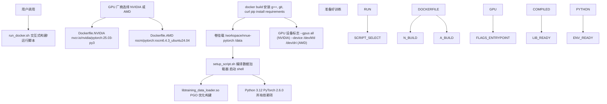
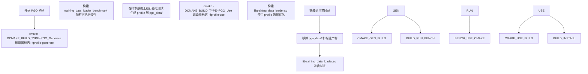
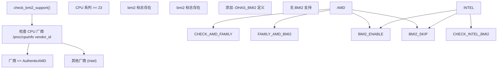

# 环境设置

-   [.gitignore](https://github.com/Chesszyh/nnue-pytorch/blob/024b2064/.gitignore)
-   [.pgo/small.binpack](https://github.com/Chesszyh/nnue-pytorch/blob/024b2064/.pgo/small.binpack)
-   [CMakeLists.txt](https://github.com/Chesszyh/nnue-pytorch/blob/024b2064/CMakeLists.txt)
-   [Dockerfile.AMD](https://github.com/Chesszyh/nnue-pytorch/blob/024b2064/Dockerfile.AMD)
-   [Dockerfile.NVIDIA](https://github.com/Chesszyh/nnue-pytorch/blob/024b2064/Dockerfile.NVIDIA)
-   [README.md](https://github.com/Chesszyh/nnue-pytorch/blob/024b2064/README.md)
-   [compile\_data\_loader.bat](https://github.com/Chesszyh/nnue-pytorch/blob/024b2064/compile_data_loader.bat)
-   [requirements.txt](https://github.com/Chesszyh/nnue-pytorch/blob/024b2064/requirements.txt)
-   [run\_docker.sh](https://github.com/Chesszyh/nnue-pytorch/blob/024b2064/run_docker.sh)
-   [setup\_script.sh](https://github.com/Chesszyh/nnue-pytorch/blob/024b2064/setup_script.sh)

本文档将指导您完成 nnue-pytorch 开发环境的设置。有两种设置方法可供选择：基于 Docker（推荐）和本地安装。这两种方法都将为训练 NNUE 神经网络准备环境，包括编译原生 C++ 数据加载器和安装 Python 依赖项。

有关训练数据格式以及设置后数据加载如何工作的信息，请参阅 [训练数据格式](#3.1) 和 [C++ 数据加载器架构](#3.2)。有关初始设置之外的构建系统详情，请参阅 [构建系统 (CMake)](#9.1)。

---

## 设置选项概览

该仓库支持两种安装方法，各有优缺点：

| 方法 | 优点 | 缺点 |
| --- | --- | --- |
| **Docker** | 零本地配置；包含 CUDA/ROCm；一致的环境；自动依赖管理 | 需要 30-60GB 磁盘空间；Docker 开销 |
| **本地** | 完全控制；无容器开销；更易于调试 | 手动依赖管理；Python/C++ 环境复杂性；需要 CUDA/ROCm 工具包 |

这两种方法最终都会产生相同的产物：编译好的 `libtraining_data_loader.so`（C++ 共享库）和包含所有必需包的 Python 环境。

---

## Docker 设置（推荐）

### 架构概览

基于 Docker 的设置使用来自 NVIDIA 或 AMD ROCm 的官方 PyTorch 容器，仅添加最小的构建工具和项目特定的依赖项。


**来源：** [run\_docker.sh](https://github.com/Chesszyh/nnue-pytorch/blob/024b2064/run_docker.sh) [Dockerfile.NVIDIA](https://github.com/Chesszyh/nnue-pytorch/blob/024b2064/Dockerfile.NVIDIA) [Dockerfile.AMD](https://github.com/Chesszyh/nnue-pytorch/blob/024b2064/Dockerfile.AMD) [setup\_script.sh](https://github.com/Chesszyh/nnue-pytorch/blob/024b2064/setup_script.sh)

### 先决条件

**对于 NVIDIA 用户：**

-   Docker Engine
-   最新的 NVIDIA 驱动程序（兼容 CUDA 12.x）
-   NVIDIA Container Toolkit

**对于 AMD 用户：**

-   Docker Engine
-   最新的 ROCm 驱动程序（6.4.3 或兼容版本）

驱动程序兼容性由容器运行时自动处理。您的主机不需要安装 CUDA 或 ROCm 工具包——只需要驱动程序。

**来源：** [README.md9-20](https://github.com/Chesszyh/nnue-pytorch/blob/024b2064/README.md#L9-L20)

### 运行设置脚本

执行交互式设置脚本：

```
./run_docker.sh
```
该脚本执行以下步骤：

1.  **GPU 厂商选择**：提示选择 NVIDIA 或 AMD
2.  **镜像构建**：选择 [Dockerfile.NVIDIA](https://github.com/Chesszyh/nnue-pytorch/blob/024b2064/Dockerfile.NVIDIA) 或 [Dockerfile.AMD](https://github.com/Chesszyh/nnue-pytorch/blob/024b2064/Dockerfile.AMD) 并构建镜像
3.  **数据目录输入**：提示输入要挂载为容器中 `/data` 的路径
4.  **容器启动**：使用适当的 GPU 标志启动容器

容器镜像标记为 `nnue-pytorch:nvidia` 或 `nnue-pytorch:amd`，无需重新构建即可重复使用。

**来源：** [run\_docker.sh1-46](https://github.com/Chesszyh/nnue-pytorch/blob/024b2064/run_docker.sh#L1-L46)

### 容器初始化流程

> **[Mermaid sequence]**
> *(图表结构无法解析)*

**来源：** [setup\_script.sh1-5](https://github.com/Chesszyh/nnue-pytorch/blob/024b2064/setup_script.sh#L1-L5) [compile\_data\_loader.bat1-12](https://github.com/Chesszyh/nnue-pytorch/blob/024b2064/compile_data_loader.bat#L1-L12)

### 容器配置详情

**NVIDIA 容器** ([Dockerfile.NVIDIA](https://github.com/Chesszyh/nnue-pytorch/blob/024b2064/Dockerfile.NVIDIA))：

-   基础镜像：`nvcr.io/nvidia/pytorch:25.03-py3`
-   包含：CUDA 12.x, cuDNN, PyTorch 2.6.0, Python 3.12
-   GPU 访问：`--gpus all` 标志

**AMD 容器** ([Dockerfile.AMD](https://github.com/Chesszyh/nnue-pytorch/blob/024b2064/Dockerfile.AMD))：

-   基础镜像：`rocm/pytorch:rocm6.4.3_ubuntu24.04_py3.12_pytorch_release_2.6.0`
-   包含：ROCm 6.4.3, PyTorch 2.6.0, Python 3.12
-   额外步骤：安装带有 HIP 后端的 CuPy ([Dockerfile.AMD14](https://github.com/Chesszyh/nnue-pytorch/blob/024b2064/Dockerfile.AMD#L14-L14))
-   GPU 访问：`--device /dev/kfd --device /dev/dri`

两个容器都安装了系统包 (g++, git, curl) 和来自 [requirements.txt](https://github.com/Chesszyh/nnue-pytorch/blob/024b2064/requirements.txt) 的 Python 依赖项。

**来源：** [Dockerfile.NVIDIA1-18](https://github.com/Chesszyh/nnue-pytorch/blob/024b2064/Dockerfile.NVIDIA#L1-L18) [Dockerfile.AMD1-20](https://github.com/Chesszyh/nnue-pytorch/blob/024b2064/Dockerfile.AMD#L1-L20)

---

## 本地安装

### 先决条件

本地安装需要手动设置以下组件：

| 组件 | 最低版本 | 目的 |
| --- | --- | --- |
| **CMake** | 3.10 | C++ 数据加载器的构建系统 |
| **C++ 编译器** | C++20 支持 | `training_data_loader.cpp` 所需 |
| **Python** | 3.10+ | PyTorch 和训练脚本 |
| **CUDA Toolkit** (NVIDIA) | 12.x | GPU 加速 |
| **ROCm** (AMD) | 6.x | GPU 加速 |

**来源：** [CMakeLists.txt1-20](https://github.com/Chesszyh/nnue-pytorch/blob/024b2064/CMakeLists.txt#L1-L20)

### Python 环境设置

1.  创建虚拟环境：

```
python3 -m venv env
source env/bin/activate  # Linux/Mac
# or: env\Scripts\activate  # Windows
```
2.  安装 Python 依赖项：

```
pip install -r requirements.txt
```
[requirements.txt](https://github.com/Chesszyh/nnue-pytorch/blob/024b2064/requirements.txt) 文件指定了：

-   `lightning`: 用于训练编排的 PyTorch Lightning 框架
-   `psutil`, `GPUtil`: 系统监控（由 `easy_train.py` 使用）
-   `asciimatics`: TUI 仪表板渲染
-   `python-chess==0.31.4`: 国际象棋特定工具
-   `matplotlib`, `tensorboard`: 可视化和日志记录
-   `numba`: 性能关键 Python 代码的 JIT 编译
-   `numpy<2.0`: 数值运算（兼容性版本约束）
-   `requests`: 用于下载依赖项的 HTTP 客户端

**来源：** [requirements.txt1-10](https://github.com/Chesszyh/nnue-pytorch/blob/024b2064/requirements.txt#L1-L10)

### C++ 数据加载器编译

C++ 数据加载器 (`training_data_loader.cpp`) 必须编译为共享库。有两种构建方法可用：标准构建和配置文件引导优化 (PGO) 构建。

#### 标准构建

```
cmake -S . -B build -DCMAKE_BUILD_TYPE=Release
cmake --build ./build
cmake --install ./build --prefix ./
```
这会生成 `libtraining_data_loader.so` (Linux) 或等效的特定平台库。

**来源：** [CMakeLists.txt1-82](https://github.com/Chesszyh/nnue-pytorch/blob/024b2064/CMakeLists.txt#L1-L82)

#### PGO 构建（推荐）

配置文件引导优化 (Profile-Guided Optimization) 通过基于运行时分析优化编译代码，可提供 10-20% 的性能提升。[compile\_data\_loader.bat](https://github.com/Chesszyh/nnue-pytorch/blob/024b2064/compile_data_loader.bat) 脚本自动化了这个两阶段过程：


执行 PGO 构建：

```
sh compile_data_loader.bat
```
脚本需要在 `.pgo/small.binpack` 处有一个样本 `.binpack` 文件用于分析。

**来源：** [compile\_data\_loader.bat1-12](https://github.com/Chesszyh/nnue-pytorch/blob/024b2064/compile_data_loader.bat#L1-L12) [CMakeLists.txt13-74](https://github.com/Chesszyh/nnue-pytorch/blob/024b2064/CMakeLists.txt#L13-L74)

### 构建系统配置

CMake 构建系统 ([CMakeLists.txt](https://github.com/Chesszyh/nnue-pytorch/blob/024b2064/CMakeLists.txt)) 提供了几个配置选项：

#### 构建类型

| 构建类型 | 编译器标志 | 用例 |
| --- | --- | --- |
| `Debug` | `-g` | 带有调试符号的开发 |
| `Release` | `-O3 -march=native -DNDEBUG` | 无调试信息的生产 |
| `RelWithDebInfo` | `-g -O3 -march=native -DNDEBUG` | 带有调试符号的生产 |
| `PGO_Generate` | `-O3 -march=native -fprofile-generate` | PGO 第一阶段 |
| `PGO_Use` | `-g -O3 -march=native -fprofile-use` | PGO 第二阶段 |

**来源：** [CMakeLists.txt5-74](https://github.com/Chesszyh/nnue-pytorch/blob/024b2064/CMakeLists.txt#L5-L74)

#### BMI2 CPU 特性检测

构建系统自动检测 BMI2 (Bit Manipulation Instruction Set 2) 支持：


BMI2 检测很重要，因为早期的 AMD Zen 处理器（系列 < 23）具有较慢的 BMI2 实现。当定义 `HAS_BMI2` 时，数据加载器使用优化的位操作运算。

**来源：** [CMakeLists.txt24-60](https://github.com/Chesszyh/nnue-pytorch/blob/024b2064/CMakeLists.txt#L24-L60)

---

## 验证

设置（Docker 或本地）完成后，验证环境：

### 检查 C++ 数据加载器

```
ls -lh libtraining_data_loader.so  # Linux
ls -lh libtraining_data_loader.dylib  # macOS
ls -lh libtraining_data_loader.dll  # Windows
```
该库应存在于仓库根目录中。

### 检查 Python 环境

```
import torch
import lightning
from data_loader import create_sparse_batch_data_loader
print(f"PyTorch: {torch.__version__}")
print(f"CUDA available: {torch.cuda.is_available()}")
print(f"Lightning: {lightning.__version__}")
```
预期输出显示 PyTorch 2.6+ 且启用了 CUDA/ROCm 支持。

### 测试数据加载器编译

Python `data_loader` 模块自动通过 ctypes 加载编译好的库。如果库丢失或不兼容，导入将失败并显示明确的错误消息。

**来源：** 这种验证方法是由数据流水线中的构建产物和模块结构所暗示的。

---

## 常见问题与故障排除

| 问题 | 原因 | 解决方案 |
| --- | --- | --- |
| `libtraining_data_loader.so not found` | C++ 库未编译 | 运行 `sh compile_data_loader.bat` |
| 构建期间 `CUDA out of memory` | 容器内存限制 | 增加 Docker 内存分配或减少并行度 |
| AMD Zen 1/2 上 `bmi2` 检测失败 | 针对慢速 BMI2 的有意设计 | 正常行为；代码将使用回退实现 |
| Docker 构建超出磁盘空间 | 基础镜像过大 | 清理 Docker 缓存：`docker system prune -a` |
| PGO profile 未找到 | 缺少 `.pgo/small.binpack` | 下载样本训练数据 |

**来源：** 基于构建系统复杂性和 Docker 配置衍生的常见问题。

---

## 下一步

环境设置成功后：

1.  准备训练数据（见 [训练数据格式](#3.1)）
2.  遵循 [快速入门教程](#1.3) 训练您的第一个网络
3.  或深入研究 [基础训练 (train.py)](#2.1) 以获取详细的训练文档

环境现已准备就绪，可进行本 wiki 中描述的所有训练和评估工作流。

**来源：** [README.md9-20](https://github.com/Chesszyh/nnue-pytorch/blob/024b2064/README.md#L9-L20)