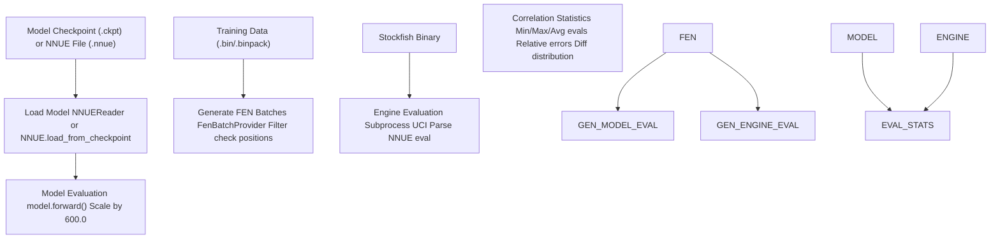
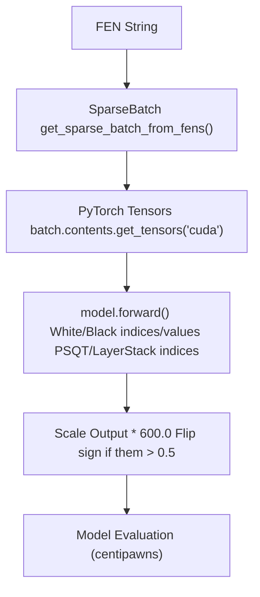
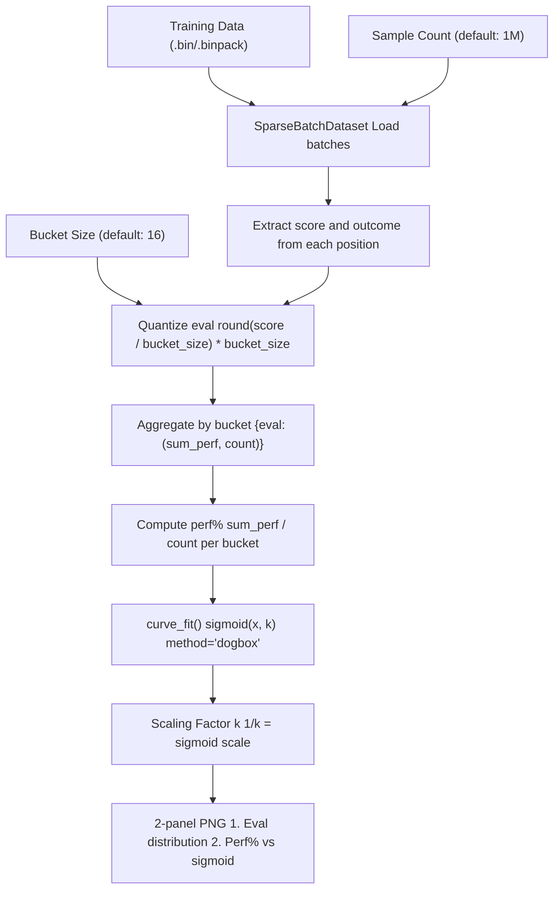
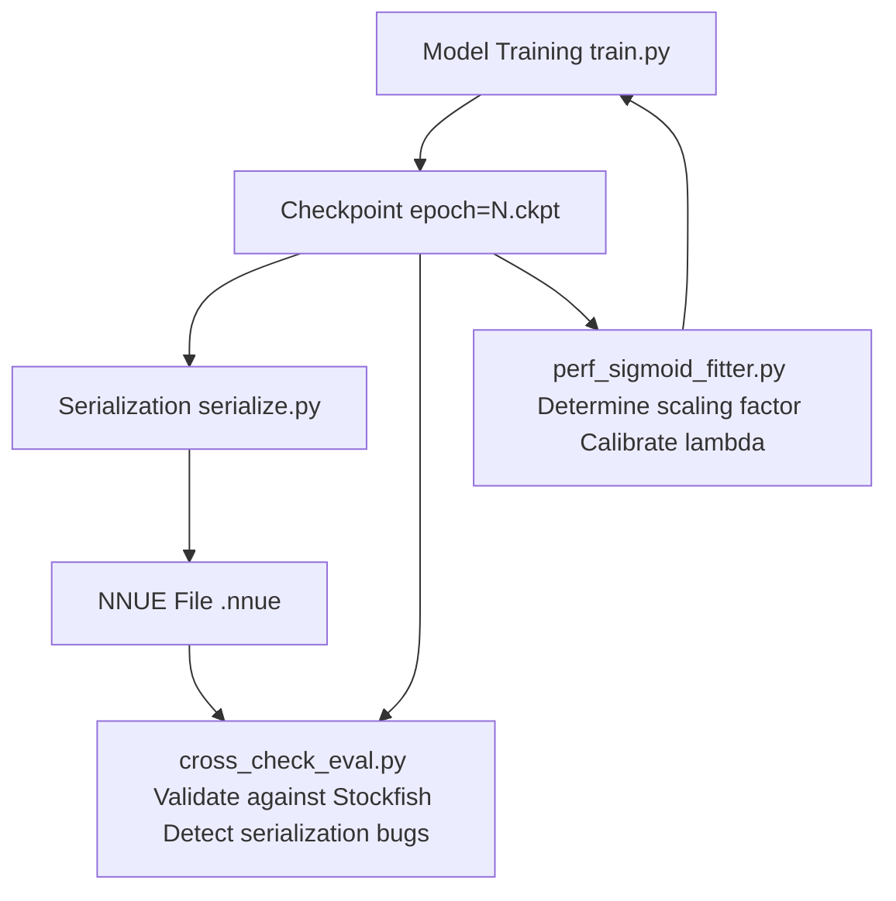

# 性能分析工具 (Performance Analysis Tools)

-   [cross\_check\_eval.py](https://github.com/Chesszyh/nnue-pytorch/blob/024b2064/cross_check_eval.py)
-   [data\_loader/dataset.py](https://github.com/Chesszyh/nnue-pytorch/blob/024b2064/data_loader/dataset.py)
-   [data\_loader/stream.py](https://github.com/Chesszyh/nnue-pytorch/blob/024b2064/data_loader/stream.py)
-   [ftperm.py](https://github.com/Chesszyh/nnue-pytorch/blob/024b2064/ftperm.py)
-   [perf\_sigmoid\_fitter.py](https://github.com/Chesszyh/nnue-pytorch/blob/024b2064/perf_sigmoid_fitter.py)

本文档记录了用于分析和验证 NNUE 模型性能的工具。这些实用程序有助于验证模型的正确性、校准输出缩放以及诊断训练问题。关于通过权重排列优化模型推理性能的信息，请参阅 [特征变换器排列 (Feature Transformer Permutation)](#6.1)。关于训练指标可视化和 ELO 跟踪，请参阅 [可视化与分析 (Visualization and Analysis)](#7.3)。

## 概览

nnue-pytorch 仓库提供了两个主要的性能分析工具：

| 工具 | 主要目的 | 关键输出 |
| --- | --- | --- |
| `cross_check_eval.py` | 针对 Stockfish 评估验证模型预测 | 相关性指标，误差统计 |
| `perf_sigmoid_fitter.py` | 将 Sigmoid 曲线拟合到 WDL 数据以获得最佳缩放 | Sigmoid 缩放因子 `k` |

这些工具独立于训练循环运行，但使用相同的数据加载基础设施来处理来自 `.bin` 或 `.binpack` 文件的局面。

## 针对 Stockfish 的交叉验证

`cross_check_eval.py` 脚本通过比较其评估与 Stockfish 在样本局面上的 NNUE 评估来验证训练好的 NNUE 模型。这对于检测量化错误、实现错误或序列化问题至关重要。

### 工作流


来源：[cross\_check\_eval.py1-221](https://github.com/Chesszyh/nnue-pytorch/blob/024b2064/cross_check_eval.py#L1-L221)

### 命令行接口

该脚本接受检查点文件（用于开发）和序列化的 `.nnue` 文件（用于部署验证）：

```
# Using a checkpoint filepython cross_check_eval.py \    --checkpoint=epoch=100.ckpt \    --features=HalfKAv2_hm \    --data=validation.binpack \    --engine=stockfish \    --count=10000# Using a serialized NNUE filepython cross_check_eval.py \    --net=nn-5af11540bbfe.nnue \    --features=HalfKAv2_hm \    --data=validation.binpack \    --engine=stockfish \    --count=10000
```
**关键参数：**

| 参数 | 描述 |
| --- | --- |
| `--checkpoint` | PyTorch Lightning 检查点 (`.ckpt`) 路径 |
| `--net` | 序列化 NNUE 文件 (`.nnue`) 路径 |
| `--engine` | 支持 NNUE 的 Stockfish 二进制文件路径 |
| `--data` | 用于局面采样的训练数据文件 |
| `--count` | 要评估的局面数量（默认：100）|
| `--features` | 特征集名称（必须与模型匹配）|
| `--l1` | L1 层大小（必须与模型匹配）|

来源：[cross\_check\_eval.py164-179](https://github.com/Chesszyh/nnue-pytorch/blob/024b2064/cross_check_eval.py#L164-L179)

### 模型评估管道

脚本通过 Python 模型实现评估局面：


模型评估使用完整的前向传递，包括特征变换器、层堆栈和输出头，并缩放到分 (centipawn) 单位 [cross\_check\_eval.py42-73](https://github.com/Chesszyh/nnue-pytorch/blob/024b2064/cross_check_eval.py#L42-L73)

来源：[cross\_check\_eval.py42-73](https://github.com/Chesszyh/nnue-pytorch/blob/024b2064/cross_check_eval.py#L42-L73)

### 通过 UCI 进行引擎评估

Stockfish 评估是通过启动引擎作为子进程并通过 UCI 协议进行通信获得的：

```
# Construct UCI command sequenceparts = ["uci", "setoption name EvalFile value {}".format(net_path)]for fen in fens:    parts.append("position fen {}".format(fen))    parts.append("eval")parts.append("quit")
```
引擎的 NNUE 评估输出使用正则表达式 `r"NNUE evaluation:?\s*?([-+]?\d*?\.\d*)"` 解析并转换为分 [cross\_check\_eval.py136-151](https://github.com/Chesszyh/nnue-pytorch/blob/024b2064/cross_check_eval.py#L136-L151)

来源：[cross\_check\_eval.py136-151](https://github.com/Chesszyh/nnue-pytorch/blob/024b2064/cross_check_eval.py#L136-L151)

### 局面过滤

王被将军的局面被过滤掉，因为 Stockfish 无法评估此类局面：

```
def filter_fens(fens):    # We don't want fens where a king is in check, as these cannot be evaluated by the engine.    filtered_fens = []    for fen in fens:        board = chess.Board(fen=fen)        if not board.is_check():            filtered_fens.append(fen)    return filtered_fens
```
来源：[cross\_check\_eval.py154-161](https://github.com/Chesszyh/nnue-pytorch/blob/024b2064/cross_check_eval.py#L154-L161)

### 相关性指标

该脚本计算模型和引擎评估之间的综合相关性统计数据：

**基本统计：**

-   最小、最大和平均评估（模型和引擎）
-   平均绝对评估幅度

**误差指标：**

-   **相对引擎误差 (Relative Engine Error)**：`sum(|model - engine| / (|engine| + 0.001)) / N`
-   **相对模型误差 (Relative Model Error)**：`sum(|model - engine| / (|model| + 0.001)) / N`
-   **平均绝对差异 (Average Absolute Difference)**：`|model - engine|` 的平均值
-   **最小/最大差异 (Min/Max Difference)**：绝对差异的范围

这些指标有助于识别：

-   **量化误差**（一个方向上的系统偏差）
-   **序列化错误**（大的随机误差）
-   **特征提取问题**（一致的缩放差异）

来源：[cross\_check\_eval.py79-133](https://github.com/Chesszyh/nnue-pytorch/blob/024b2064/cross_check_eval.py#L79-L133)

### 示例输出

```
Min engine/model eval: -523 / -519
Max engine/model eval: 487 / 482
Avg engine/model eval: 12.3 / 11.8
Avg abs engine/model eval: 156.2 / 154.7
Relative engine error: 0.0287
Relative model error: 0.0291
Avg abs difference: 4.2
Min difference: 0
Max difference: 18
```
典型的相关性应显示：

-   对于正确序列化的模型，平均绝对差异 < 10 分
-   对于生产质量模型，相对误差 < 5%
-   最大差异 < 50 分（较大的差异表明潜在的错误）

来源：[cross\_check\_eval.py79-133](https://github.com/Chesszyh/nnue-pytorch/blob/024b2064/cross_check_eval.py#L79-L133)

## WDL Sigmoid 拟合

`perf_sigmoid_fitter.py` 脚本分析国际象棋局面评估与游戏结果（胜/平/负）之间的关系，拟合 Sigmoid 曲线以确定最佳缩放因子。这对于校准模型的输出以匹配预期的获胜概率至关重要。

### 目的与理论

在国际象棋引擎中，评估函数理想情况下应根据 Sigmoid 关系预测获胜概率：

```
P(win | eval) = 1 / (1 + exp(-k * eval))
```
缩放因子 `k` 决定了评估如何映射到获胜概率。该脚本从训练数据中的实际游戏结果经验性地确定 `k`。

来源：[perf\_sigmoid\_fitter.py1-147](https://github.com/Chesszyh/nnue-pytorch/blob/024b2064/perf_sigmoid_fitter.py#L1-L147)

### 数据收集管道


来源：[perf\_sigmoid\_fitter.py56-93](https://github.com/Chesszyh/nnue-pytorch/blob/024b2064/perf_sigmoid_fitter.py#L56-L93) [perf\_sigmoid\_fitter.py95-121](https://github.com/Chesszyh/nnue-pytorch/blob/024b2064/perf_sigmoid_fitter.py#L95-L121)

### 命令行用法

```
# Analyze 1M positions with default bucketingpython perf_sigmoid_fitter.py data.binpack 1000000 16# Quick analysis with fewer positionspython perf_sigmoid_fitter.py data.binpack 100000 32
```
**参数：**

1.  `filename`：`.bin` 或 `.binpack` 文件路径
2.  `count`：要分析的局面数量（默认：1,000,000）
3.  `bucket_size`：评估分箱粒度，单位为分（默认：16）

来源：[perf\_sigmoid\_fitter.py134-146](https://github.com/Chesszyh/nnue-pytorch/blob/024b2064/perf_sigmoid_fitter.py#L134-L146)

### 数据聚合

脚本对评估进行分箱并聚合结果：

```
# Bucket evaluationsbucket = torch.round(score / bucket_size) * bucket_sizeperf = outcome  # Win=1.0, Draw=0.5, Loss=0.0# Aggregate into dictionaryfor b, p in zip(bucket, perf):    bucket_id = int(b)    pp = float(p)    if bucket_id in data:        t = data[bucket_id]        data[bucket_id] = (t[0] + pp, t[1] + 1)    else:        data[bucket_id] = (pp, 1)
```
结果：映射 `{eval: (total_perf, count)}` 的字典，其中 `perf%` 计算为 `total_perf / count`。

来源：[perf\_sigmoid\_fitter.py56-92](https://github.com/Chesszyh/nnue-pytorch/blob/024b2064/perf_sigmoid_fitter.py#L56-L92)

### 曲线拟合算法

拟合使用 SciPy 的 `curve_fit` 和 Dogbox 算法：

```
def sigmoid(x, k):    y = 1 / (1 + np.exp(-k * x))    return ydef fit_data(x, y, sigma):    # 1/361 is the initial guess. It's good enough to find the solution    p0 = [1 / 361]    popt, pcov = curve_fit(sigmoid, x, y, p0, sigma, method="dogbox")    return popt[0]
```
**拟合细节：**

-   初始猜测：`k = 1/361`（经验上对国际象棋很好）
-   加权：`sigma = 1 / count`（每个桶样本计数的倒数）
-   方法：Dogbox（有界优化，对异常值鲁棒）

来源：[perf\_sigmoid\_fitter.py9-18](https://github.com/Chesszyh/nnue-pytorch/blob/024b2064/perf_sigmoid_fitter.py#L9-L18)

### 输出可视化

脚本生成一个双面板 PNG，显示：

**面板 1：评估分布**

-   X 轴：评估（对数刻度）
-   Y 轴：密度（每个评估值的局面频率）
-   目的：了解数据分布

**面板 2：性能曲线**

-   X 轴：评估
-   Y 轴：性能（胜率）
-   散点图：来自数据的实际 perf%
-   曲线：拟合的 Sigmoid `1 / (1 + exp(-k * eval))`
-   图例：显示计算出的 `k` 值

来源：[perf\_sigmoid\_fitter.py21-53](https://github.com/Chesszyh/nnue-pytorch/blob/024b2064/perf_sigmoid_fitter.py#L21-L53)

### 典型结果

标准 NNUE 训练数据的示例输出：

```
k:  0.002809
inv k:  356.0
```
**解释：**

-   `k ≈ 1/356` 意味着 +356 分的评估对应于 ~73% 的获胜概率
-   对于 Stockfish NNUE，典型值：`k ∈ [0.0025, 0.0030]`（即 `1/k ∈ [333, 400]`）
-   超出此范围的值可能表示：
    -   **`k` 太低**（`1/k` 高）：模型输出过于激进
    -   **`k` 太高**（`1/k` 低）：模型输出过于保守

此 `k` 值可以为训练期间的 `--lambda` 参数提供信息，该参数控制 WDL 损失缩放 [perf\_sigmoid\_fitter.py40-42](https://github.com/Chesszyh/nnue-pytorch/blob/024b2064/perf_sigmoid_fitter.py#L40-L42)

来源：[perf\_sigmoid\_fitter.py40-42](https://github.com/Chesszyh/nnue-pytorch/blob/024b2064/perf_sigmoid_fitter.py#L40-L42)

## 作为模块集成

`perf_sigmoid_fitter.py` 可以作为 Python 模块导入，用于训练期间的在线分析：

```
import perf_sigmoid_fitter# Compute sigmoid scaling from batchesdata = perf_sigmoid_fitter.gather_statistics_from_batches(    training_batches,  # Iterator of batch tuples    bucket_size=16)# Extract k valuek = perf_sigmoid_fitter.fit_data(    list(data.keys()),    [data[eval][0] / data[eval][1] for eval in data.keys()],    [1 / data[eval][1] for eval in data.keys()])
```
这使得能够根据当前训练数据特征动态调整 lambda。

来源：[perf\_sigmoid\_fitter.py56-131](https://github.com/Chesszyh/nnue-pytorch/blob/024b2064/perf_sigmoid_fitter.py#L56-L131)

## 常见分析工作流

### 验证序列化网络

将检查点序列化为 `.nnue` 格式后，验证正确性：

```
# 1. Cross-check against Stockfishpython cross_check_eval.py \    --net=output.nnue \    --features=HalfKAv2_hm \    --data=test.binpack \    --engine=stockfish \    --count=10000# Expected: Avg abs difference < 5 cp
```
如果差异很大：

-   检查特征集是否匹配 (`--features`)
-   验证量化配置
-   检查序列化代码是否存在错误

来源：[cross\_check\_eval.py164-179](https://github.com/Chesszyh/nnue-pytorch/blob/024b2064/cross_check_eval.py#L164-L179)

### 校准训练 Lambda

为新的训练数据确定最佳 lambda：

```
# 1. Fit sigmoid to training datapython perf_sigmoid_fitter.py train.binpack 1000000 16# Output: k = 0.00281 (1/k = 356)# 2. Set lambda ≈ 1/k in trainingpython train.py --lambda=356 ...
```
训练中的 lambda 参数应大致匹配经验 Sigmoid 缩放，以正确加权 WDL 损失。

来源：[perf\_sigmoid\_fitter.py134-146](https://github.com/Chesszyh/nnue-pytorch/blob/024b2064/perf_sigmoid_fitter.py#L134-L146)

### 调试评估漂移

如果模型评估系统性地偏离 Stockfish：

```
# 1. Check correlation at different training stagespython cross_check_eval.py --checkpoint=epoch=50.ckpt ...python cross_check_eval.py --checkpoint=epoch=100.ckpt ...python cross_check_eval.py --checkpoint=epoch=150.ckpt ...# 2. Look for increasing divergence over time# - Increasing relative error → potential overtraining# - Increasing bias → quantization or clipping issues
```
来源：[cross\_check\_eval.py164-221](https://github.com/Chesszyh/nnue-pytorch/blob/024b2064/cross_check_eval.py#L164-L221)

## 性能考量

### 内存使用

两个工具都分批加载局面以管理内存：

| 工具 | 批大小 | 每批次内存 |
| --- | --- | --- |
| `cross_check_eval.py` | 1000 个局面 | ~50 MB（稀疏特征）|
| `perf_sigmoid_fitter.py` | 8192 个局面 | ~400 MB（稀疏特征）|

对于大规模分析（>1M 个局面），工具增量处理数据，而无需将所有内容加载到内存中。

来源：[cross\_check\_eval.py181](https://github.com/Chesszyh/nnue-pytorch/blob/024b2064/cross_check_eval.py#L181-L181) [perf\_sigmoid\_fitter.py100](https://github.com/Chesszyh/nnue-pytorch/blob/024b2064/perf_sigmoid_fitter.py#L100-L100)

### 执行时间

现代硬件上的典型执行时间：

-   **cross\_check\_eval.py**：~0.5 秒每个局面（Stockfish UCI 开销占主导地位）

    -   1000 个局面：~8-10 分钟
    -   10000 个局面：~80-100 分钟
-   **perf\_sigmoid\_fitter.py**：每秒 ~1000 个局面（受数据加载限制）

    -   100k 个局面：~2 分钟
    -   1M 个局面：~15-20 分钟

交叉检查的瓶颈是 Stockfish 评估时间。对于 Sigmoid 拟合，则是磁盘 I/O 和数据解析。

来源：[cross\_check\_eval.py136-151](https://github.com/Chesszyh/nnue-pytorch/blob/024b2064/cross_check_eval.py#L136-L151) [perf\_sigmoid\_fitter.py56-121](https://github.com/Chesszyh/nnue-pytorch/blob/024b2064/perf_sigmoid_fitter.py#L56-L121)

## 总结

性能分析工具提供了必要的验证和校准能力：


**关键要点：**

1.  **cross\_check\_eval.py** 通过与 Stockfish 比较来验证模型实现的正确性

    -   在序列化后使用以捕获量化/转换错误
    -   预期：平均绝对差异 < 10 分
2.  **perf\_sigmoid\_fitter.py** 确定评估与获胜概率之间的经验关系

    -   在训练前使用以设置最佳 lambda 参数
    -   典型 k 值：0.0025-0.0030 (1/k = 333-400)
3.  这两个工具独立于训练运行，可用于模型开发的任何阶段


来源：[cross\_check\_eval.py1-221](https://github.com/Chesszyh/nnue-pytorch/blob/024b2064/cross_check_eval.py#L1-L221) [perf\_sigmoid\_fitter.py1-147](https://github.com/Chesszyh/nnue-pytorch/blob/024b2064/perf_sigmoid_fitter.py#L1-L147)
