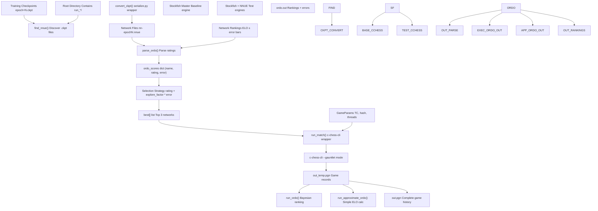
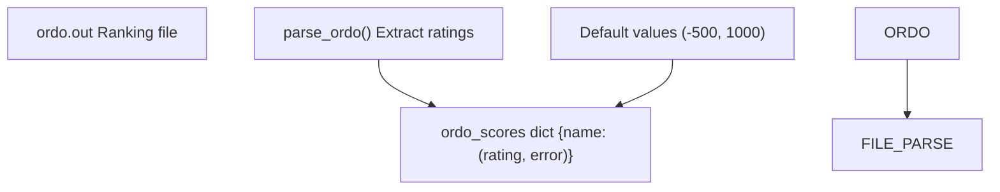
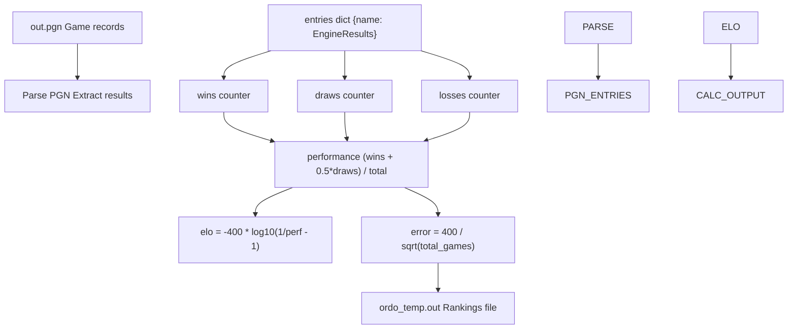
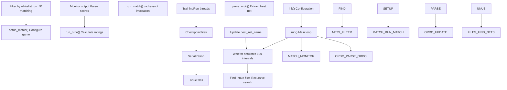
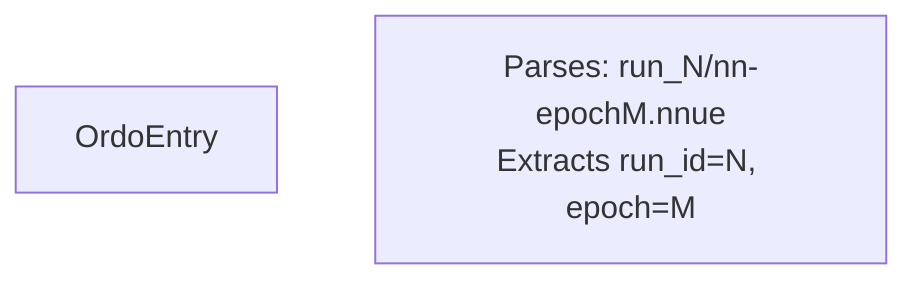
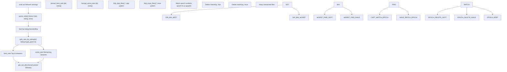

# 评估与测试 (Evaluation and Testing)

-   [delete_bad_nets.py](https://github.com/Chesszyh/nnue-pytorch/blob/024b2064/delete_bad_nets.py)
-   [do_plots.py](https://github.com/Chesszyh/nnue-pytorch/blob/024b2064/do_plots.py)
-   [run_games.py](https://github.com/Chesszyh/nnue-pytorch/blob/024b2064/run_games.py)
-   [scripts/easy_train.py](https://github.com/Chesszyh/nnue-pytorch/blob/024b2064/scripts/easy_train.py)
-   [scripts/easy_train_example.bat](https://github.com/Chesszyh/nnue-pytorch/blob/024b2064/scripts/easy_train_example.bat)
-   [scripts/easy_train_example.sh](https://github.com/Chesszyh/nnue-pytorch/blob/024b2064/scripts/easy_train_example.sh)

本页记录了通过自动国际象棋对弈和统计排名来评估训练好的 NNUE 网络的系统。评估管道将模型检查点转换为可部署的 NNUE 文件，使用 `c-chess-cli` 针对基线引擎运行擂台式锦标赛，使用 `ordo` 计算贝叶斯 ELO 评级，并提供用于跟踪训练进度的可视化工具。

关于生成检查点的训练过程的信息，请参阅 [训练系统 (Training System)](#2)。关于检查点转换和序列化的详细信息，请参阅 [模型序列化 (Model Serialization)](#5)。

## 评估管道概览

评估系统作为一个持续的反馈循环运行，在训练期间测试生成的网络。该系统可以通过 `run_games.py` 独立运行，也可以作为 `easy_train.py` 中集成训练编排的一部分运行。

**系统架构**


**来源：** [run_games.py1-605](https://github.com/Chesszyh/nnue-pytorch/blob/024b2064/run_games.py#L1-L605)

管道在每一轮中连续运行，其中每一轮：

1.  发现新的检查点文件
2.  将它们转换为 NNUE 格式
3.  根据之前的评级和不确定性选择最有希望的网络
4.  与基线进行对弈
5.  重新计算排名
6.  重复

## 使用 run_games.py 运行对弈

`run_games.py` 脚本提供了独立功能，用于运行擂台式锦标赛，其中候选网络与主基线引擎竞争。

### 核心组件

**GameParams 类**

`GameParams` 类封装了所有对弈配置参数：


**来源：** [run_games.py26-69](https://github.com/Chesszyh/nnue-pytorch/blob/024b2064/run_games.py#L26-L69)

`get_all_params()` 方法 [run_games.py46-68](https://github.com/Chesszyh/nnue-pytorch/blob/024b2064/run_games.py#L46-L68) 构造 `c-chess-cli` 的命令行参数，支持时间控制和每步节点数模式。

### 网络发现和转换

**检查点转换**

`convert_ckpt()` 函数 [run_games.py71-102](https://github.com/Chesszyh/nnue-pytorch/blob/024b2064/run_games.py#L71-L102) 递归搜索检查点文件并转换未转换的文件：

| 操作 | 模式 | 输出 |
| --- | --- | --- |
| 查找检查点 | `epoch*.ckpt` | 检查点路径列表 |
| 生成 .nnue 路径 | 移除 `default/version_N/checkpoints/` | 简化的路径结构 |
| 转换命名 | `epoch=3.ckpt` → `nn-epoch3.nnue` | 标准命名约定 |
| 调用序列化 | `serialize.py ckpt nnue --features=X` | 二进制 NNUE 文件 |

**来源：** [run_games.py71-102](https://github.com/Chesszyh/nnue-pytorch/blob/024b2064/run_games.py#L71-L102)

**网络发现**

`find_nnue()` 函数 [run_games.py104-106](https://github.com/Chesszyh/nnue-pytorch/blob/024b2064/run_games.py#L104-L106) 使用递归 glob 来定位所有匹配模式 `nn-epoch*.nnue` 的可用网络。

### Ordo 集成

**解析 Ordo 输出**

`parse_ordo()` 函数 [run_games.py109-129](https://github.com/Chesszyh/nnue-pytorch/blob/024b2064/run_games.py#L109-L129) 读取 `ordo.out` 文件并提取评级：


**来源：** [run_games.py109-129](https://github.com/Chesszyh/nnue-pytorch/blob/024b2064/run_games.py#L109-L129)

默认分数 (-500, 1000) 分配给没有评级的网络，代表最大的不确定性。

### 网络选择策略

选择算法 [run_games.py411-444](https://github.com/Chesszyh/nnue-pytorch/blob/024b2064/run_games.py#L411-L444) 实现置信上限 (UCB) 探索：

1.  **显示表现最好的网络** [run_games.py415-426](https://github.com/Chesszyh/nnue-pytorch/blob/024b2064/run_games.py#L415-L426) - 按评级降序排序
2.  **选择进行测试** [run_games.py429-444](https://github.com/Chesszyh/nnue-pytorch/blob/024b2064/run_games.py#L429-L444) - 按 `rating + explore_factor * error` 排序
3.  **选择前 3 名** [run_games.py438-444](https://github.com/Chesszyh/nnue-pytorch/blob/024b2064/run_games.py#L438-L444) - 平衡利用与探索

`explore_factor` 参数（默认 1.5）控制探索-利用权衡。较高的值倾向于测试不确定的网络；较低的值倾向于利用已知的强网络。

**来源：** [run_games.py385-492](https://github.com/Chesszyh/nnue-pytorch/blob/024b2064/run_games.py#L385-L492)

### 比赛执行

**比赛配置**

`run_match()` 函数 [run_games.py132-218](https://github.com/Chesszyh/nnue-pytorch/blob/024b2064/run_games.py#L132-L218) 构造并执行 `c-chess-cli` 命令：

```mermaid
flowchart TD
    CMD_BUILD["Command Construction"]
    GAUNTLET["--gauntlet One vs many mode"]
    ROUNDS["--rounds 1 Single round"]
    CONCUR["--concurrency N Parallel games"]
    TC["Game Parameters TC/nodes/hash/threads"]
    OPENINGS["--openings Book file + randomization"]
    RESIGN["--resign count=3 score=700"]
    DRAW["--draw count=8 score=10"]
    PGN_OUT["--pgn out_temp.pgn"]
    BASE_ENG["--engine cmd=stockfish_base name=master"]
    TEST_ENG["--engine cmd=stockfish_test name=netname option.EvalFile=path"]

    CMD --> BUILD_GAUNTLET
    CMD --> BUILD_ROUNDS
    CMD --> BUILD_CONCUR
    CMD --> BUILD_TC
    CMD --> BUILD_OPENINGS
    CMD --> BUILD_RESIGN
    CMD --> BUILD_DRAW
    CMD --> BUILD_PGN_OUT
    CMD --> BUILD_BASE_ENG
    CMD --> BUILD_TEST_ENG
```


**来源：** [run_games.py132-218](https://github.com/Chesszyh/nnue-pytorch/blob/024b2064/run_games.py#L132-L218)

**重试逻辑**

该函数实现自动重试 [run_games.py186-216](https://github.com/Chesszyh/nnue-pytorch/blob/024b2064/run_games.py#L186-L216)，最多尝试 10 次，以处理瞬态故障，如引擎挂起或 `c-chess-cli` 错误。

**进度监控**

实时输出解析 [run_games.py196-208](https://github.com/Chesszyh/nnue-pytorch/blob/024b2064/run_games.py#L196-L208) 在对弈完成时显示分数更新，并通过 Epoch 去重以避免输出混乱。

### ELO 计算方法

系统支持两种计算评级的方法：

#### 方法 1：完整 Ordo (贝叶斯)

`run_ordo()` 函数 [run_games.py351-382](https://github.com/Chesszyh/nnue-pytorch/blob/024b2064/run_games.py#L351-L382) 调用外部 `ordo` 工具：

| 参数 | 值 | 目的 |
| --- | --- | --- |
| `-q` | - | 安静模式 |
| `-g` | - | 使用对弈格式 |
| `-J` | - | 假设平局 |
| `-p {pgn}` | PGN 文件 | 输入对弈 |
| `-a 0.0 --anchor=master` | 锚定评级 | 将 master 固定在 0.0 |
| `--draw-auto --white-auto` | 自动检测 | 检测平局/白方优势 |
| `-s 100` | - | 模拟计数 |
| `--cpus={N}` | 并发 | 并行处理 |
| `-o {output}` | 文件路径 | 输出排名 |

**来源：** [run_games.py351-382](https://github.com/Chesszyh/nnue-pytorch/blob/024b2064/run_games.py#L351-L382)

#### 方法 2：近似 Ordo

`run_approximate_ordo()` 函数 [run_games.py280-348](https://github.com/Chesszyh/nnue-pytorch/blob/024b2064/run_games.py#L280-L348) 实现简化的 ELO 计算：


**来源：** [run_games.py280-348](https://github.com/Chesszyh/nnue-pytorch/blob/024b2064/run_games.py#L280-L348)

**EngineResults 类** [run_games.py221-277](https://github.com/Chesszyh/nnue-pytorch/blob/024b2064/run_games.py#L221-L277)

此辅助类跟踪每个引擎的对弈统计信息：

-   **属性：** `wins`, `draws`, `losses`, `total_games`, `points`, `performance`
-   **ELO 计算：** 使用 logistic 公式，假设所有对弈均针对 master（评级 0）
-   **误差估计：** 使用 `400 / sqrt(N)` 近似的 95% 置信区间

近似方法比完整的贝叶斯 ordo 更快，但不太准确，尤其是在对弈较少的情况下。

### 轮次执行

`run_round()` 函数 [run_games.py385-492](https://github.com/Chesszyh/nnue-pytorch/blob/024b2064/run_games.py#L385-L492) 编排完整的评估周期：

**并行执行策略**

> **[Mermaid sequence]**
> *(图表结构无法解析)*

**来源：** [run_games.py385-492](https://github.com/Chesszyh/nnue-pytorch/blob/024b2064/run_games.py#L385-L492)

这种并行设计允许 ordo 在进行新对弈的同时处理累积的对弈，从而最大化吞吐量。

### 命令行接口

**关键参数** [run_games.py494-601](https://github.com/Chesszyh/nnue-pytorch/blob/024b2064/run_games.py#L494-L601)

| 参数 | 类型 | 默认值 | 描述 |
| --- | --- | --- | --- |
| `root_dir` | str | 必需 | 搜索网络和存储结果的目录 |
| `--concurrency` | int | 8 | 并行对弈线程数 |
| `--explore_factor` | float | 1.5 | UCB 探索参数 |
| `--ordo_exe` | str | None | ordo 二进制文件路径（如果为 None，则使用近似）|
| `--c_chess_exe` | str | `./c-chess-cli` | c-chess-cli 路径 |
| `--stockfish_base` | str | `./stockfish` | 主基线引擎 |
| `--stockfish_test` | str | None | 测试引擎（默认为 base）|
| `--book_file_name` | str | `./noob_3moves.epd` | 开局库 |
| `--time_per_game` | float | 4.0 | 每局基础时间（秒）|
| `--time_increment_per_move` | float | 0.04 | 每步增量 |
| `--nodes_per_move` | int | None | 固定节点（覆盖时间）|
| `--hash` | int | 8 | 哈希表大小 (MB) |
| `--threads` | int | 1 | 引擎线程数 |
| `--games_per_round` | int | 200 | 每轮对弈数 |

**来源：** [run_games.py494-601](https://github.com/Chesszyh/nnue-pytorch/blob/024b2064/run_games.py#L494-L601)

## 与 easy_train.py 集成

`easy_train.py` 脚本集成了网络测试作为训练编排的一部分。`NetworkTesting` 类 [scripts/easy_train.py1389-1680](https://github.com/Chesszyh/nnue-pytorch/blob/024b2064/scripts/easy_train.py#L1389-L1680) 在单独的线程中运行测试。

### NetworkTesting 架构


**来源：** [scripts/easy_train.py1389-1680](https://github.com/Chesszyh/nnue-pytorch/blob/024b2064/scripts/easy_train.py#L1389-L1680)

### 与独立模式的主要区别

**自动序列化**

`NetworkTesting` 类自动序列化检查点 [scripts/easy_train.py1498-1546](https://github.com/Chesszyh/nnue-pytorch/blob/024b2064/scripts/easy_train.py#L1498-L1546)，无需手动转换，使用相同的 `serialize.py` 包装器。

**网络白名单**

`_network_matches_whitelist()` 方法 [scripts/easy_train.py1481-1496](https://github.com/Chesszyh/nnue-pytorch/blob/024b2064/scripts/easy_train.py#L1481-L1496) 根据训练运行 ID 过滤网络，确保仅测试当前实验中的相关网络。

**最佳网络跟踪**

该类维护 `best_net_name` [scripts/easy_train.py1448](https://github.com/Chesszyh/nnue-pytorch/blob/024b2064/scripts/easy_train.py#L1448-L1448) 并通过属性公开它 [scripts/easy_train.py1676-1678](https://github.com/Chesszyh/nnue-pytorch/blob/024b2064/scripts/easy_train.py#L1676-L1678)，允许 TUI 仪表板显示有关最强网络的实时信息。

**集成日志记录**

所有输出都与主 TUI 仪表板协调，而不是使用独立的控制台输出。

### OrdoEntry 类

`OrdoEntry` 类 [scripts/easy_train.py608-659](https://github.com/Chesszyh/nnue-pytorch/blob/024b2064/scripts/easy_train.py#L608-L659) 提供了对 ordo 输出行的结构化解析：


**来源：** [scripts/easy_train.py608-659](https://github.com/Chesszyh/nnue-pytorch/blob/024b2064/scripts/easy_train.py#L608-L659)

模式 `r".*?run_(\d+).*?nn-epoch(\d+)\.nnue"` [scripts/easy_train.py614](https://github.com/Chesszyh/nnue-pytorch/blob/024b2064/scripts/easy_train.py#L614-L614) 从网络路径中提取运行 ID 和 epoch 编号。

### 最佳检查点选择

`find_best_checkpoint()` 函数 [scripts/easy_train.py661-698](https://github.com/Chesszyh/nnue-pytorch/blob/024b2064/scripts/easy_train.py#L661-L698) 根据 ordo 排名确定最佳检查点：

**算法** [scripts/easy_train.py676-698](https://github.com/Chesszyh/nnue-pytorch/blob/024b2064/scripts/easy_train.py#L676-L698)

1.  解析 ordo 文件中包含 `nn-epoch` 的所有条目
2.  按 `rating - error` 排序（保守估计）
3.  从顶部条目提取 run_id 和 epoch
4.  搜索匹配模式 `run_{run_id}` 和 `epoch={epoch}` 的 `.ckpt` 文件
5.  如果找不到检查点，则回退到 `.nnue` 文件

这使得能够从表现最好的网络而不是最近的检查点恢复训练。

**来源：** [scripts/easy_train.py661-698](https://github.com/Chesszyh/nnue-pytorch/blob/024b2064/scripts/easy_train.py#L661-L698)

## 可视化与分析

`do_plots.py` 脚本提供了训练进度和网络强度的综合可视化。

### 绘图生成管道

```mermaid
flowchart TD
    FIND_EVENTS["find_event_files() Recursive search for events.out.tfevents*"]
    FIND_ORDO["find_ordo_file() Search for ordo.out"]
    TFEVENT["EventAccumulator TensorBoard parser"]
    VAL_LOSS["Extract val_loss Scalar values"]
    TRAIN_LOSS["Extract train_loss Scalar values"]
    ORDO_PARSE["parse_ordo_file() Extract ratings"]
    AGG_VAL["aggregate_dict() min/max/avg"]
    AGG_TRAIN["aggregate_dict() min/max/avg"]
    FILTER_LOSS["Filter by loss_range Best + range"]
    FILTER_ELO["Filter by elo_range Best - range"]
    PLOT_TRAIN["ax_train_loss subplot Step vs Loss"]
    PLOT_VAL["ax_val_loss subplot Step vs Loss"]
    PLOT_ELO["ax_elo subplot Epoch vs ELO ± error"]
    FIG["Figure output PNG file"]

    FIND --> EVENTS_TFEVENT
    FIND --> ORDO_ORDO_PARSE
    TFEVENT --> VAL_LOSS
    TFEVENT --> TRAIN_LOSS
    VAL --> LOSS_FILTER_LOSS
    TRAIN --> LOSS_FILTER_LOSS
    FILTER --> LOSS_AGG_VAL
    FILTER --> LOSS_AGG_TRAIN
    ORDO --> PARSE_FILTER_ELO
    AGG --> VAL_PLOT_VAL
    AGG --> TRAIN_PLOT_TRAIN
    FILTER --> ELO_PLOT_ELO
    PLOT --> TRAIN_FIG
    PLOT --> VAL_FIG
    PLOT --> ELO_FIG
```


**来源：** [do_plots.py1-267](https://github.com/Chesszyh/nnue-pytorch/blob/024b2064/do_plots.py#L1-L267)

### 损失曲线处理

**事件文件发现** [do_plots.py10-18](https://github.com/Chesszyh/nnue-pytorch/blob/024b2064/do_plots.py#L10-L18)

该函数搜索匹配模式 `events.out.tfevents.*` 的 TensorBoard 事件文件，并返回所有匹配的路径。

**损失提取和过滤** [do_plots.py86-159](https://github.com/Chesszyh/nnue-pytorch/blob/024b2064/do_plots.py#L86-L159)

```
# Pseudocode representation of the processfor tfevents_file in tfevents_files:
    events_acc = EventAccumulator(tfevents_file)
    events_acc.Reload()

    # Extract validation loss
    vv = events_acc.Scalars("val_loss")
    minloss = min([v[2] for v in vv])

    # Keep only values within range of minimum
    for v in vv:
        if v[2] < minloss + loss_range:
            step = v[1]
            val_losses[step].append(v[2])
        # Similar for train_loss
```
此过滤将绘图重点放在信息量最大的损失值上，排除异常值和早期训练噪声。

**来源：** [do_plots.py136-159](https://github.com/Chesszyh/nnue-pytorch/blob/024b2064/do_plots.py#L136-L159)

### 数据聚合

`aggregate_dict()` 函数 [do_plots.py40-53](https://github.com/Chesszyh/nnue-pytorch/blob/024b2064/do_plots.py#L40-L53) 支持三种聚合模式，用于组合多个运行：

| 模式 | 聚合器 | 用例 |
| --- | --- | --- |
| `min` | 最小值 | 最佳性能 |
| `max` | 最大值 | 最差性能 |
| `avg` | 平均值 | 平均性能 |

**来源：** [do_plots.py40-53](https://github.com/Chesszyh/nnue-pytorch/blob/024b2064/do_plots.py#L40-L53)

### ELO 可视化

**Ordo 文件解析** [do_plots.py65-79](https://github.com/Chesszyh/nnue-pytorch/blob/024b2064/do_plots.py#L65-L79)

`parse_ordo_file()` 函数提取：

-   网络路径
-   Epoch 编号（通过正则表达式 `.*nn-epoch(\d*)\.nnue`）
-   ELO 评级
-   评级误差（标准差）

**过滤和绘图** [do_plots.py181-202](https://github.com/Chesszyh/nnue-pytorch/blob/024b2064/do_plots.py#L181-L202)

```
# Filter to show only competitive networksmaxelo = max([row[2] for row in rows])for row in rows:
    epoch, elo, error = row[1], row[2], row[3]
    if elo > maxelo - elo_range:
        # Include in plot
        # Plot with error barsax_elo.errorbar(epochs, elos, yerr=errors, label=root_dir)
```
这将可视化重点放在可配置 ELO 范围内的表现最佳的网络上。

**来源：** [do_plots.py181-202](https://github.com/Chesszyh/nnue-pytorch/blob/024b2064/do_plots.py#L181-L202)

### 多实验支持

**拆分模式** [do_plots.py119-127](https://github.com/Chesszyh/nnue-pytorch/blob/024b2064/do_plots.py#L119-L127)

当启用 `--split` 时：

-   该工具将每个子目录视为一个单独的实验
-   在根级别使用共享的 `ordo.out` 文件
-   按子目录路径过滤 ordo 条目
-   将每个子目录绘制为单独的系列

这使得能够在单个图表上比较多个训练运行（例如，不同的超参数）。

**来源：** [do_plots.py119-127](https://github.com/Chesszyh/nnue-pytorch/blob/024b2064/do_plots.py#L119-L127)

### 命令行接口

**参数** [do_plots.py217-262](https://github.com/Chesszyh/nnue-pytorch/blob/024b2064/do_plots.py#L217-L262)

| 参数 | 类型 | 默认值 | 描述 |
| --- | --- | --- | --- |
| `root_dirs` | str+ | 必需 | 包含 tfevents 和 ordo 文件的目录 |
| `--output` | str | `experiment_loss_Elo.png` | 输出文件名 |
| `--elo_range` | float | 50.0 | 显示在最佳 ELO 范围内的网络 |
| `--loss_range` | float | 0.004 | 显示在最小值范围内的损失 |
| `--split` | 标志 | False | 将子目录拆分为单独的实验 |

**来源：** [do_plots.py217-262](https://github.com/Chesszyh/nnue-pytorch/blob/024b2064/do_plots.py#L217-L262)

## 使用 delete_bad_nets.py 进行网络管理

`delete_bad_nets.py` 脚本实现了对表现不佳的网络的自动清理，以节省磁盘空间。

### 删除策略


**来源：** [delete_bad_nets.py1-167](https://github.com/Chesszyh/nnue-pytorch/blob/024b2064/delete_bad_nets.py#L1-L167)

### 实现细节

**网络拆分** [delete_bad_nets.py49-53](https://github.com/Chesszyh/nnue-pytorch/blob/024b2064/delete_bad_nets.py#L49-L53)

```python
def split_nets_by_strength(nets, split_point=16):
    nets.sort(key=lambda x: -x[1])  # Sort by rating descending
    best_nets = nets[:min(split_point, len(nets))]
    worst_nets = nets[min(split_point, len(nets)):]
    return best_nets, worst_nets
```
**来源：** [delete_bad_nets.py49-53](https://github.com/Chesszyh/nnue-pytorch/blob/024b2064/delete_bad_nets.py#L49-L53)

**Epoch 匹配模式** [delete_bad_nets.py79-80](https://github.com/Chesszyh/nnue-pytorch/blob/024b2064/delete_bad_nets.py#L79-L80)

| 文件类型 | 模式 | 示例 |
| --- | --- | --- |
| .nnue | `.*epoch([0-9]*)\.nnue` | `nn-epoch100.nnue` → `100` |
| .ckpt | `.*epoch=([0-9]*).*\.ckpt` | `epoch=100-step=1000.ckpt` → `100` |

**来源：** [delete_bad_nets.py79-112](https://github.com/Chesszyh/nnue-pytorch/blob/024b2064/delete_bad_nets.py#L79-L112)

**安全功能**

1.  **Ordo 要求** [delete_bad_nets.py82-84](https://github.com/Chesszyh/nnue-pytorch/blob/024b2064/delete_bad_nets.py#L82-L84) - 如果未找到 ordo 文件，则退出
2.  **保守删除** - 仅删除 ordo 中明确列出的网络
3.  **按目录组织** [delete_bad_nets.py56-75](https://github.com/Chesszyh/nnue-pytorch/blob/024b2064/delete_bad_nets.py#L56-L75) - 按父目录对网络进行分箱，以避免交叉污染
4.  **详细日志记录** [delete_bad_nets.py103-119](https://github.com/Chesszyh/nnue-pytorch/blob/024b2064/delete_bad_nets.py#L103-L119) - 打印所有删除/保留决定

**来源：** [delete_bad_nets.py78-120](https://github.com/Chesszyh/nnue-pytorch/blob/024b2064/delete_bad_nets.py#L78-L120)

### 使用

```
python delete_bad_nets.py root_dir [num_best_to_keep]
```
**参数：**

-   `root_dir` - 包含 ordo.out 和网络文件的目录
-   `num_best_to_keep` - 要保留的顶级网络数量（默认：16）

**目录结构示例** [delete_bad_nets.py142-152](https://github.com/Chesszyh/nnue-pytorch/blob/024b2064/delete_bad_nets.py#L142-L152)

```
root_dir/
├── run_0/
│   ├── lightning_logs/version_0/checkpoints/*.ckpt
│   └── *.nnue
├── run_1/
│   ├── lightning_logs/version_0/checkpoints/*.ckpt
│   └── *.nnue
└── ordo.out
```
该脚本在全局范围内保留前 N 个网络，但按子目录组织删除，确保只有来自同一训练运行的网络才会竞争保留。

**来源：** [delete_bad_nets.py122-167](https://github.com/Chesszyh/nnue-pytorch/blob/024b2064/delete_bad_nets.py#L122-L167)

## 总结

评估与测试系统提供了一个完整的管道用于：

1.  **自动对弈** - 将检查点转换为 NNUE 文件并通过 `c-chess-cli` 运行擂台赛
2.  **统计排名** - 使用 `ordo` 或近似方法计算带有误差条的贝叶斯 ELO 评级
3.  **网络选择** - 使用置信上限 (Upper Confidence Bound) 探索来平衡测试强网络与不确定的网络
4.  **持续反馈** - 与 `easy_train.py` 集成，在训练期间进行自动评估
5.  **可视化** - 随时间绘制损失曲线和 ELO 进展
6.  **资源管理** - 自动清理表现不佳的网络

该系统支持通过 `run_games.py` 独立运行以进行重点评估，以及通过 `easy_train.py` 集成运行以进行带有自动质量评估的无人值守训练。

**关键设计原则：**

-   **并行执行** - 对弈和 ordo 计算并发运行
-   **容错** - 对瞬态故障进行自动重试
-   **探索-利用平衡** - 基于 UCB 的网络选择
-   **最少的人工干预** - 自动转换、测试和清理
-   **全面跟踪** - 完整的对弈历史和统计置信区间

**来源：** [run_games.py1-605](https://github.com/Chesszyh/nnue-pytorch/blob/024b2064/run_games.py#L1-L605) [scripts/easy_train.py608-1680](https://github.com/Chesszyh/nnue-pytorch/blob/024b2064/scripts/easy_train.py#L608-L1680) [do_plots.py1-267](https://github.com/Chesszyh/nnue-pytorch/blob/024b2064/do_plots.py#L1-L267) [delete_bad_nets.py1-167](https://github.com/Chesszyh/nnue-pytorch/blob/024b2064/delete_bad_nets.py#L1-L167)
