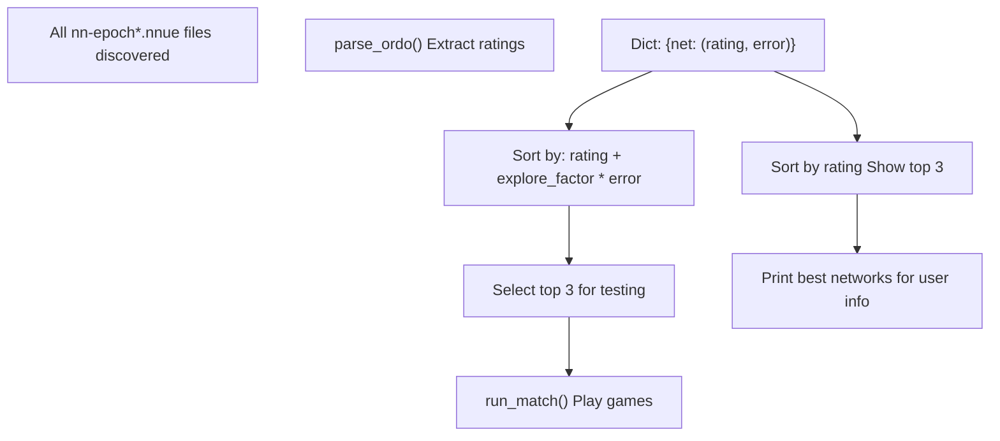
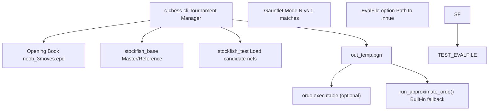
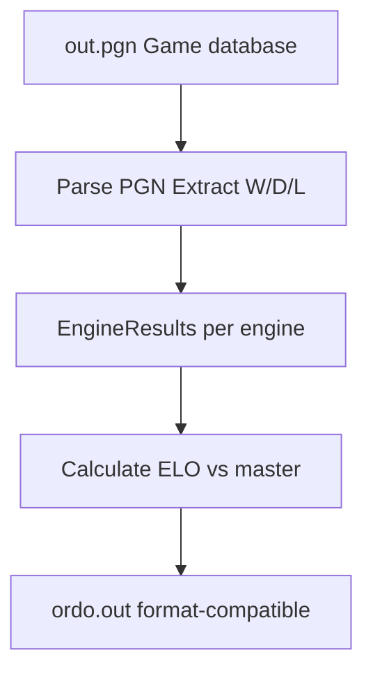
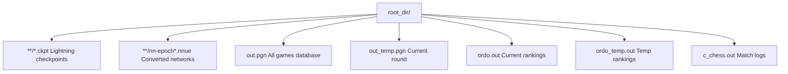
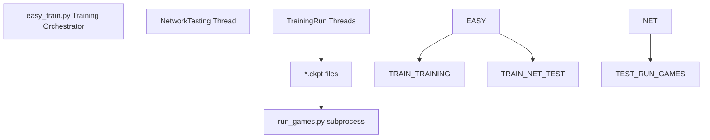

# 运行对弈 (run\_games.py)

-   [delete\_bad\_nets.py](https://github.com/Chesszyh/nnue-pytorch/blob/024b2064/delete_bad_nets.py)
-   [do\_plots.py](https://github.com/Chesszyh/nnue-pytorch/blob/024b2064/do_plots.py)
-   [run\_games.py](https://github.com/Chesszyh/nnue-pytorch/blob/024b2064/run_games.py)

## 目的与范围

本文档解释了 `run_games.py` 中实现的自动对弈和网络评估系统。该脚本持续发现训练好的 NNUE 网络（来自检查点文件），通过与基线进行国际象棋对弈来评估它们，并使用 ELO 评级对它们进行排名。该系统实施了一种探索-利用策略，以便在训练进行时有效地识别最强的网络。

关于模型序列化为 `.nnue` 格式的信息，请参阅 [检查点转换 (Checkpoint Conversion)](#5.1)。关于结果的可视化，请参阅 [可视化与分析 (Visualization and Analysis)](#7.3)。关于 ELO 计算的详细信息，请参阅 [使用 Ordo 进行 ELO 计算 (ELO Calculation with Ordo)](#7.2)。

**来源：** [run\_games.py1-605](https://github.com/Chesszyh/nnue-pytorch/blob/024b2064/run_games.py#L1-L605)

---

## 系统概览

`run_games.py` 脚本作为一个自主的评估循环，弥合了训练模型与经验棋力测量之间的差距。它集成了多个外部工具以创建一个全面的测试管道。

```mermaid
flowchart TD
    FIND_CKPT["convert_ckpt() Find *.ckpt files"]
    SERIALIZE["subprocess: serialize.py Convert to .nnue"]
    FIND_NNUE["find_nnue() Find nn-epoch*.nnue"]
    PARSE_ORDO["parse_ordo() Read ordo.out rating ± error"]
    EXPLORE["Exploration Strategy rating + factor * error Select top 3"]
    MATCH["run_match() c-chess-cli gauntlet test nets vs master"]
    PGN_TEMP["out_temp.pgn Current round games"]
    PGN_MAIN["out.pgn All games accumulated"]
    ORDO_CALC["run_ordo() or run_approximate_ordo() Bayesian ELO"]
    ORDO_OUT["ordo.out Rankings + errors"]
    RUN_ROUND["run_round() One evaluation cycle"]
    MAIN_LOOP["main() while True Continuous evaluation"]

    FIND --> CKPT_SERIALIZE
    SERIALIZE --> FIND_NNUE
    FIND --> NNUE_PARSE_ORDO
    PARSE --> ORDO_EXPLORE
    EXPLORE --> MATCH
    MATCH --> PGN_TEMP
    PGN --> TEMP_PGN_MAIN
    PGN --> MAIN_ORDO_CALC
    ORDO --> CALC_ORDO_OUT
    ORDO --> OUT_PARSE_ORDO
    RUN --> ROUND_FIND_CKPT
    RUN --> ROUND_EXPLORE
    RUN --> ROUND_MATCH
    RUN --> ROUND_ORDO_CALC
    MAIN --> LOOP_RUN_ROUND
```


**图表：整体系统架构**

该系统按轮次运行，每轮：

1.  发现并转换新的检查点
2.  使用当前评级选择有希望的网络
3.  与基线进行对弈
4.  根据结果更新评级

**来源：** [run\_games.py385-601](https://github.com/Chesszyh/nnue-pytorch/blob/024b2064/run_games.py#L385-L601)

---

## 评估循环

核心功能在 `run_round()` 中实现，通过 `main()` 函数的无限循环持续执行。

### 轮次执行流程

> **[Mermaid sequence]**
> *(图表结构无法解析)*

**图表：每轮执行流程**

比赛和 ordo 计算在并行线程中运行以最大化吞吐量，因为 ordo 是单线程的，并且对于大型对弈数据库可能很慢。

**来源：** [run\_games.py385-492](https://github.com/Chesszyh/nnue-pytorch/blob/024b2064/run_games.py#L385-L492) [run\_games.py448-474](https://github.com/Chesszyh/nnue-pytorch/blob/024b2064/run_games.py#L448-L474)

### 检查点转换

`convert_ckpt()` 函数发现检查点文件并将其转换为可部署的 `.nnue` 格式：

| 步骤 | 函数 | 目的 |
| --- | --- | --- |
| 1\. 发现 | `Path.rglob("epoch*.ckpt")` | 递归查找所有检查点文件 |
| 2\. 路径转换 | 正则表达式替换 | `run0/default/version_0/checkpoints/epoch=3.ckpt` → `run0/nn-epoch3.nnue` |
| 3\. 转换 | `subprocess: serialize.py` | 将检查点转换为 NNUE 二进制格式 |
| 4\. 跳过现有 | `os.path.exists()` 检查 | 仅当 `.nnue` 不存在时转换 |

**来源：** [run\_games.py71-102](https://github.com/Chesszyh/nnue-pytorch/blob/024b2064/run_games.py#L71-L102)

路径转换移除了 Lightning 特定的目录结构并规范化 epoch 命名：

```
# Pattern matching examples:"default/version_0/checkpoints/" -> ""  # Older Lightning"lightning_logs/version_0/checkpoints/" -> ""  # Newer Lightning"epoch=3.ckpt" -> "nn-epoch3.nnue""epoch=3-step=321151.ckpt" -> "nn-epoch3.nnue"  # Step info removed
```
**来源：** [run\_games.py78-89](https://github.com/Chesszyh/nnue-pytorch/blob/024b2064/run_games.py#L78-L89)

---

## 网络选择策略

该脚本实施了一种类似 **置信上限 (UCB)** 的探索策略，以平衡测试有希望的网络（利用）与减少网络强度的不确定性（探索）。

### 选择算法


**图表：网络选择过程**

**来源：** [run\_games.py397-444](https://github.com/Chesszyh/nnue-pytorch/blob/024b2064/run_games.py#L397-L444)

### 探索因子

`explore_factor` 参数（默认：1.5）控制探索-利用权衡：

-   **高因子**：更多探索，测试具有高不确定性的网络
-   **低因子**：更多利用，专注于当前评级最高的网络

选择标准计算如下：

```
expected_improvement = rating + explore_factor * error
```
网络按此指标排名，前 3 名被选中进行下一轮对弈。

**来源：** [run\_games.py515-519](https://github.com/Chesszyh/nnue-pytorch/blob/024b2064/run_games.py#L515-L519) [run\_games.py428-444](https://github.com/Chesszyh/nnue-pytorch/blob/024b2064/run_games.py#L428-L444)

### Ordo 分数解析

`parse_ordo()` 函数从 ordo 输出文件中提取评级：

| 字段 | 列 | 描述 |
| --- | --- | --- |
| 网络名称 | `fields[1]` | `.nnue` 文件路径（例如 `run0/nn-epoch10.nnue`）|
| 评级 | `fields[3]` | ELO 评级 (浮点数) |
| 误差 | `fields[4]` | 95% 置信区间 (浮点数) |

默认值 `(-500, 1000)` 分配给尚未在 ordo 文件中的网络，确保由于巨大的不确定性，它们获得高优先级测试。

**来源：** [run\_games.py109-129](https://github.com/Chesszyh/nnue-pytorch/blob/024b2064/run_games.py#L109-L129)

---

## 对弈配置

对弈通过 `GameParams` 类进行配置，该类封装了所有国际象棋引擎设置。

### GameParams 类


**图表：GameParams 配置**

**来源：** [run\_games.py26-68](https://github.com/Chesszyh/nnue-pytorch/blob/024b2064/run_games.py#L26-L68)

### 时间控制选项

脚本支持两种类型的时间控制：

**1\. 基于时间（默认）：**

```
# Example: 4 seconds per game + 0.04 seconds per movetime_per_game = 4.0time_increment_per_move = 0.04# Generates: tc=4.0+0.04
```
**2\. 基于节点（覆盖时间）：**

```
# Example: Fixed 10000 nodes per movenodes_per_move = 10000# Generates: tc=10000+10000, nodes=10000
```
**来源：** [run\_games.py549-556](https://github.com/Chesszyh/nnue-pytorch/blob/024b2064/run_games.py#L549-L556) [run\_games.py57-64](https://github.com/Chesszyh/nnue-pytorch/blob/024b2064/run_games.py#L57-L64)

### 标准参数

| 参数 | 默认值 | 描述 |
| --- | --- | --- |
| `hash` | 8 MB | 每个引擎的哈希表大小 |
| `threads` | 1 | 每个引擎的搜索线程数 |
| `games_per_round` | 200 | 每轮进行的对弈数量 |
| `concurrency` | 8 | 并行运行的对弈数量 |

**来源：** [run\_games.py554-556](https://github.com/Chesszyh/nnue-pytorch/blob/024b2064/run_games.py#L554-L556) [run\_games.py509-512](https://github.com/Chesszyh/nnue-pytorch/blob/024b2064/run_games.py#L509-L512)

---

## 外部工具集成

该脚本集成了三个外部工具以创建完整的评估管道。

### 工具依赖


**图表：外部工具集成**

**来源：** [run\_games.py527-547](https://github.com/Chesszyh/nnue-pytorch/blob/024b2064/run_games.py#L527-L547)

### c-chess-cli 命令构建

`run_match()` 函数为 c-chess-cli 构建复杂的命令行：

```
# Core structurecommand = [    "c-chess-cli",    "-gauntlet",        # N vs 1 tournament    "-rounds", "1",    "-concurrency", f"{concurrency}",    # Game parameters from GameParams.get_all_params()    # Opening book specification    # Draw/resign adjudication rules    # PGN output file    # Engine specifications]
```
**来源：** [run\_games.py132-183](https://github.com/Chesszyh/nnue-pytorch/blob/024b2064/run_games.py#L132-L183)

关键命令组件：

| 组件 | 目的 | 配置 |
| --- | --- | --- |
| 擂台模式 (Gauntlet Mode) | 多引擎对单一基线 | `-gauntlet` |
| 并发 (Concurrency) | 并行对弈执行 | `-concurrency 8` |
| 开局库 (Opening Book) | 起始局面 | `-openings file=noob_3moves.epd order=random` |
| 认输裁决 (Resign Adjudication) | 提前停止无望的对弈 | `-resign count=3 score=700` |
| 平局裁决 (Draw Adjudication) | 裁决平局局面 | `-draw count=8 score=10` |

**来源：** [run\_games.py149-172](https://github.com/Chesszyh/nnue-pytorch/blob/024b2064/run_games.py#L149-L172)

### 引擎规范

锦标赛中的每个引擎通过以下方式指定：

```
# Master/baseline enginecommand += ["-engine", f"cmd={stockfish_base}", "name=master"]# Test engines (candidate networks)for net in best:    evalfile = os.path.join(os.getcwd(), net)    netname = PurePath(*PurePath(evalfile).parts[-2:])    command += [        "-engine",        f"cmd={stockfish_test}",        f"name={netname}",        f"option.EvalFile={evalfile}"    ]
```
提取网络名称以包含最后两个路径组件（例如 `run0/nn-epoch10.nnue`），以便在结果中进行标识。

**来源：** [run\_games.py174-183](https://github.com/Chesszyh/nnue-pytorch/blob/024b2064/run_games.py#L174-L183)

### 错误处理和重试

由于引擎崩溃或 c-chess-cli 问题，对弈可能会失败。系统实施重试逻辑：

```
for i in range(tries):  # default: tries=10    # Run c-chess-cli    if process.wait() != 0:        if i == tries - 1:            print_atomic("Error running match!")        else:            print_atomic(f"Retrying running match ({i}/{tries}) in 10s ...")            time.sleep(10)    else:        break  # Success
```
**来源：** [run\_games.py187-216](https://github.com/Chesszyh/nnue-pytorch/blob/024b2064/run_games.py#L187-L216)

---

## 评级计算

该脚本支持两种计算 ELO 评级的方法：完整的 `ordo` 工具或内置的近似计算。

### Ordo 集成

当提供 `--ordo_exe` 路径时，脚本使用外部 ordo 工具：

```
command = [    ordo_exe,    "-q",                    # Quiet mode    "-g",                    # Games format    "-J",                    # Use Jeffreys prior    "-p", f"{pgn_file_name}",    "-a", "0.0",             # Anchor rating    "--anchor=master",       # Anchor on master engine    "--draw-auto",           # Auto-detect draw rate    "--white-auto",          # Auto-detect white advantage    "-s", "100",             # Number of simulations    f"--cpus={concurrency}",    "-o", f"{ordo_file_name_temp}"]
```
**来源：** [run\_games.py351-383](https://github.com/Chesszyh/nnue-pytorch/blob/024b2064/run_games.py#L351-L383)

### 近似 Ordo 计算

当 ordo 不可用时，`run_approximate_ordo()` 提供快速替代方案：


**图表：近似 Ordo 过程**

**来源：** [run\_games.py280-348](https://github.com/Chesszyh/nnue-pytorch/blob/024b2064/run_games.py#L280-L348)

### EngineResults 类

跟踪每个引擎的对弈结果：

| 属性 | 公式 | 描述 |
| --- | --- | --- |
| `wins` | 计数 | 获胜次数 |
| `draws` | 计数 | 平局次数 |
| `losses` | 计数 | 失败次数 |
| `points` | `wins + draws * 0.5` | 锦标赛得分 |
| `performance` | `points / total_games` | 胜率 |
| `elo` | `-400 * log10(1/performance - 1)` | ELO 评级 |
| `elo_error_95` | `400 / sqrt(total_games)` | 置信区间 |

**来源：** [run\_games.py221-278](https://github.com/Chesszyh/nnue-pytorch/blob/024b2064/run_games.py#L221-L278)

ELO 公式实现了从表现到评级的标准转换：

```
ELO = -400 * log₁₀(1/performance - 1)
```
带有 epsilon 钳位以避免完美分数的除以零错误。

**来源：** [run\_games.py265-273](https://github.com/Chesszyh/nnue-pytorch/blob/024b2064/run_games.py#L265-L273)

---

## 输出文件和目录结构

脚本管理指定 `root_dir` 内的多个输出文件：


**图表：输出文件结构**

**来源：** [run\_games.py145](https://github.com/Chesszyh/nnue-pytorch/blob/024b2064/run_games.py#L145-L145) [run\_games.py283](https://github.com/Chesszyh/nnue-pytorch/blob/024b2064/run_games.py#L283-L283) [run\_games.py354](https://github.com/Chesszyh/nnue-pytorch/blob/024b2064/run_games.py#L354-L354) [run\_games.py479](https://github.com/Chesszyh/nnue-pytorch/blob/024b2064/run_games.py#L479-L479)

### 文件累积策略

对弈跨轮次累积以建立全面的数据库：

1.  当前轮次对弈写入 `out_temp.pgn`
2.  在 ordo 计算开始后，对弈追加到 `out.pgn`
3.  成功追加后删除临时文件

这允许 ordo 在进行新对弈的同时并行运行于完整数据库。

**来源：** [run\_games.py476-491](https://github.com/Chesszyh/nnue-pytorch/blob/024b2064/run_games.py#L476-L491)

### 线程安全

脚本使用全局锁进行打印语句，以防止来自并发线程的输出混乱：

```
GLOBAL_LOCK = threading.Lock()def print_atomic(*args, **kwargs):    GLOBAL_LOCK.acquire()    try:        print(*args, **kwargs)    finally:        GLOBAL_LOCK.release()
```
**来源：** [run\_games.py15-23](https://github.com/Chesszyh/nnue-pytorch/blob/024b2064/run_games.py#L15-L23)

---

## 命令行接口

### 必需参数

| 参数 | 类型 | 描述 |
| --- | --- | --- |
| `root_dir` | str | 搜索检查点和存储结果的目录 |

**来源：** [run\_games.py500-507](https://github.com/Chesszyh/nnue-pytorch/blob/024b2064/run_games.py#L500-L507)

### 可选参数

| 参数 | 默认值 | 描述 |
| --- | --- | --- |
| `--concurrency` | 8 | 并行对弈数量 |
| `--explore_factor` | 1.5 | UCB 算法中的探索权重 |
| `--ordo_exe` | None | ordo 二进制文件路径（如果为 None，则使用近似）|
| `--c_chess_exe` | `./c-chess-cli` | c-chess-cli 路径 |
| `--stockfish_base` | `./stockfish` | 参考 Stockfish 路径 |
| `--stockfish_test` | (与 base 相同) | 测试 Stockfish 二进制文件路径 |
| `--book_file_name` | `./noob_3moves.epd` | 开局库路径 |
| `--time_per_game` | 4.0 | 每局秒数 |
| `--time_increment_per_move` | 0.04 | 每步增量 |
| `--nodes_per_move` | None | 每步固定节点数（覆盖时间）|
| `--hash` | 8 | 哈希表大小 (MB) |
| `--threads` | 1 | 引擎线程数 |
| `--games_per_round` | 200 | 每评估轮次的对弈数 |
| `--features` | (来自模型) | 检查点转换的特征集名称 |

**来源：** [run\_games.py509-557](https://github.com/Chesszyh/nnue-pytorch/blob/024b2064/run_games.py#L509-L557)

### 特征集参数

`--features` 参数在检查点转换期间传递给 `serialize.py`。它是通过 `model` 模块中的 `add_feature_args()` 函数添加的。

**来源：** [run\_games.py13](https://github.com/Chesszyh/nnue-pytorch/blob/024b2064/run_games.py#L13-L13) [run\_games.py557](https://github.com/Chesszyh/nnue-pytorch/blob/024b2064/run_games.py#L557-L557) [run\_games.py97](https://github.com/Chesszyh/nnue-pytorch/blob/024b2064/run_games.py#L97-L97)

### 验证

脚本在启动前验证所有必需的可执行文件和文件：

```
if not shutil.which(stockfish_base):    sys.exit("Stockfish base is not executable !")if not shutil.which(stockfish_test):    sys.exit("Stockfish test is not executable!")if args.ordo_exe and not shutil.which(args.ordo_exe):    sys.exit("ordo is not executable!")if not shutil.which(args.c_chess_exe):    sys.exit("c_chess_cli is not executable!")if not os.path.exists(args.book_file_name):    sys.exit("book does not exist!")
```
**来源：** [run\_games.py565-578](https://github.com/Chesszyh/nnue-pytorch/blob/024b2064/run_games.py#L565-L578)

---

## 使用示例

### 基本用法

```
python run_games.py training_output/ \    --stockfish_base ./stockfish \    --c_chess_exe ./c-chess-cli \    --book_file_name ./noob_3moves.epd
```
这将：

-   搜索 `training_output/` 中的 `.ckpt` 文件
-   将它们转换为 `.nnue` 格式
-   每轮以 4+0.04 时间控制运行 200 局对弈
-   使用近似 ordo 计算
-   持续循环直到中断

### 使用外部 Ordo

```
python run_games.py training_output/ \    --ordo_exe ./ordo \    --concurrency 16 \    --games_per_round 400
```
使用外部 ordo 二进制文件进行更准确的贝叶斯 ELO 计算，包含 16 个并发对弈和每轮 400 局对弈。

### 每步固定节点

```
python run_games.py training_output/ \    --nodes_per_move 10000 \    --threads 4 \    --hash 128
```
每个引擎每步精确搜索 10,000 个节点，使用 4 个线程和 128 MB 哈希。

### 高探索

```
python run_games.py training_output/ \    --explore_factor 2.5
```
增加探索，更积极地测试具有高不确定性的网络。

**来源：** [run\_games.py582-601](https://github.com/Chesszyh/nnue-pytorch/blob/024b2064/run_games.py#L582-L601)

---

## 与训练管道集成

`run_games.py` 脚本旨在通过 `easy_train.py` 与训练一起运行，后者生成一个单独的 `NetworkTesting` 线程来调用此脚本。


**图表：与 easy\_train.py 集成**

连续循环允许脚本在训练进行时自动发现并测试新网络，提供有关模型质量的实时反馈。

**来源：** [run\_games.py582-601](https://github.com/Chesszyh/nnue-pytorch/blob/024b2064/run_games.py#L582-L601)
