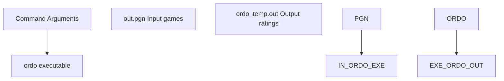
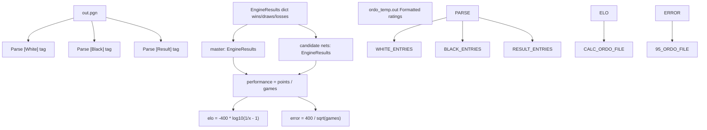
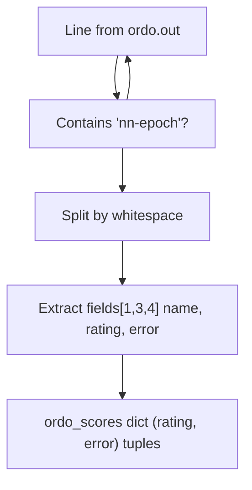
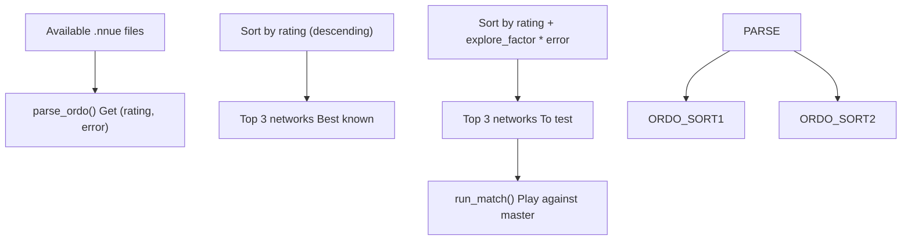
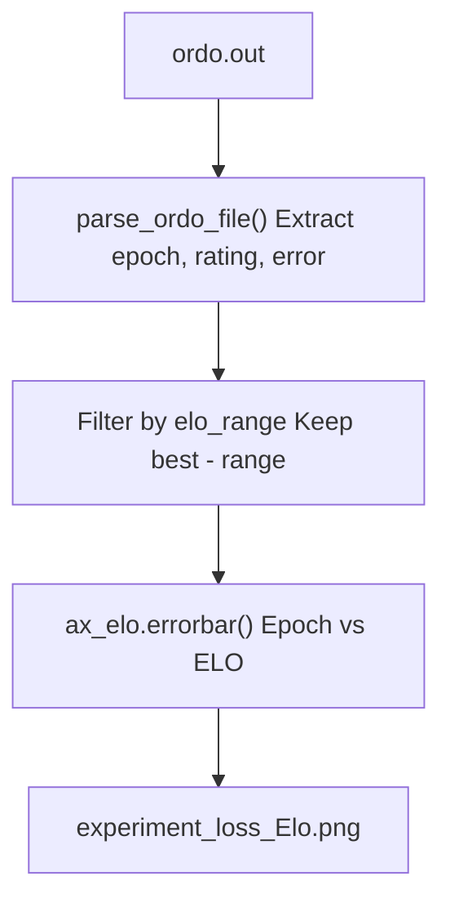
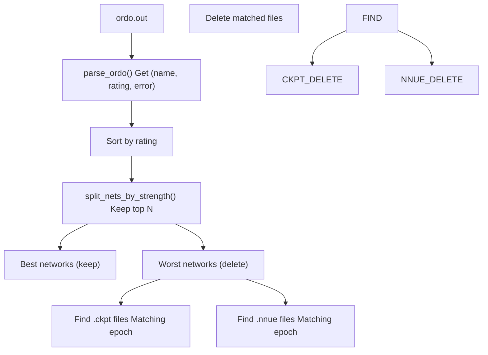

# 使用 Ordo 进行 ELO 计算 (ELO Calculation with Ordo)

-   [delete\_bad\_nets.py](https://github.com/Chesszyh/nnue-pytorch/blob/024b2064/delete_bad_nets.py)
-   [do\_plots.py](https://github.com/Chesszyh/nnue-pytorch/blob/024b2064/do_plots.py)
-   [run\_games.py](https://github.com/Chesszyh/nnue-pytorch/blob/024b2064/run_games.py)

## 目的与范围

本文档解释了 nnue-pytorch 系统如何使用 ordo 评级工具计算训练好的神经网络的 ELO 评级。ordo 系统提供带有误差条的贝叶斯 ELO 评级，从而能够在训练期间进行自动网络选择和质量跟踪。关于进行对弈以生成 ordo 数据的信息，请参阅 [运行对弈 (run\_games.py)](#7.1)。关于可视化 ordo 结果的信息，请参阅 [可视化与分析 (Visualization and Analysis)](#7.3)。

## Ordo 集成概览

该系统使用 **ordo**（一种用于国际象棋引擎的贝叶斯 ELO 评级计算器）根据对弈结果对训练好的神经网络进行排名。Ordo 分析 PGN 对弈文件并生成带有统计误差条的评级，系统使用这些评级来：

1.  **选择网络进行测试** - 优先考虑具有高 `rating + explore_factor * error` 的网络
2.  **跟踪训练进度** - 随 Epoch 变化的 ELO 评级表明了改进
3.  **识别弱网络** - 可以自动删除低评级的网络

该系统支持两种操作模式：

-   **完整 ordo** - 使用外部 ordo 可执行文件（推荐）
-   **近似 ordo** - 当 ordo 不可用时的内置计算

来源：[run\_games.py1-605](https://github.com/Chesszyh/nnue-pytorch/blob/024b2064/run_games.py#L1-L605)

## Ordo 执行架构

```mermaid
flowchart TD
    MATCH["run_match()"]
    PGN_TEMP["out_temp.pgn Temporary game records"]
    PGN_MAIN["out.pgn Accumulated games"]
    CHECK_ORDO["ordo_exe provided?"]
    FULL_ORDO["run_ordo() External ordo executable"]
    APPROX_ORDO["run_approximate_ordo() Built-in calculation"]
    ORDO_TEMP["ordo_temp.out Temporary ratings"]
    ORDO_OUT["ordo.out Final ratings"]
    PARSE["parse_ordo() Extract ratings + errors"]
    SELECTION["Network Selection rating + explore_factor * error"]
    PLOTS["do_plots.py ELO visualization"]
    DELETE["delete_bad_nets.py Cleanup"]

    MATCH --> PGN_TEMP
    PGN --> TEMP_PGN_MAIN
    PGN --> MAIN_CHECK_ORDO
    CHECK --> ORDO_FULL_ORDO
    CHECK --> ORDO_APPROX_ORDO
    FULL --> ORDO_ORDO_TEMP
    APPROX --> ORDO_ORDO_TEMP
    ORDO --> TEMP_ORDO_OUT
    ORDO --> OUT_PARSE
    PARSE --> SELECTION
    ORDO --> OUT_PLOTS
    ORDO --> OUT_DELETE
```


**图表：Ordo 执行流程**

系统在并行线程中运行对弈和 ordo 计算以最大化吞吐量，因为 ordo 可能是单线程的，并且在大型对弈数据库上比较耗时。

来源：[run\_games.py448-474](https://github.com/Chesszyh/nnue-pytorch/blob/024b2064/run_games.py#L448-L474) [run\_games.py476-491](https://github.com/Chesszyh/nnue-pytorch/blob/024b2064/run_games.py#L476-L491)

## 完整 Ordo 模式

### 命令行调用

`run_ordo()` 函数使用特定参数执行外部 ordo 二进制文件：


**图表：Ordo 命令结构**

| 参数 | 值 | 目的 |
| --- | --- | --- |
| `-q` | \- | 安静模式（较少输出）|
| `-g` | \- | 仅使用对弈结果 |
| `-J` | \- | 使用贝叶斯计算 |
| `-p` | `{pgn_file_name}` | 要分析的 PGN 文件 |
| `-a` | `0.0` | 锚定评级 |
| `--anchor` | `master` | 锚定引擎名称 |
| `--draw-auto` | \- | 自动检测平局率 |
| `--white-auto` | \- | 自动检测白方优势 |
| `-s` | `100` | 模拟计数 |
| `--cpus` | `{concurrency}` | 并行线程 |
| `-o` | `{ordo_file_name_temp}` | 输出文件 |

来源：[run\_games.py351-382](https://github.com/Chesszyh/nnue-pytorch/blob/024b2064/run_games.py#L351-L382)

### 锚定策略

系统将所有评级锚定到 **master** 引擎的 0.0 ELO。这提供了一个稳定的参考点，其中：

-   正评级表示比基线更强的网络
-   负评级表示比基线更弱的网络
-   所有候选网络都与同一基线进行比较

来源：[run\_games.py364-365](https://github.com/Chesszyh/nnue-pytorch/blob/024b2064/run_games.py#L364-L365)

### 原子输出文件更新

为了防止并发读取器的竞争条件，ordo 首先写入临时文件：

```
ordo_temp.out  →  (atomic rename)  →  ordo.out
```
这确保了 `ordo.out` 永远不会处于部分写入状态。

来源：[run\_games.py355](https://github.com/Chesszyh/nnue-pytorch/blob/024b2064/run_games.py#L355-L355) [run\_games.py380](https://github.com/Chesszyh/nnue-pytorch/blob/024b2064/run_games.py#L380-L380)

## 近似 Ordo 模式

当 ordo 可执行文件不可用时，系统通过 `run_approximate_ordo()` 提供内置计算。此模式利用了所有候选网络仅与 master 基线进行对弈的擂台锦标赛结构。

### 基于擂台赛的 ELO 计算


**图表：近似 Ordo 计算流程**

来源：[run\_games.py280-348](https://github.com/Chesszyh/nnue-pytorch/blob/024b2064/run_games.py#L280-L348)

### EngineResults 类

`EngineResults` 类跟踪对弈结果并计算评级：

| 属性 | 公式 | 描述 |
| --- | --- | --- |
| `wins` | 计数 | 获胜次数 |
| `draws` | 计数 | 平局次数 |
| `losses` | 计数 | 失败次数 |
| `total_games` | `wins + draws + losses` | 对弈总数 |
| `points` | `wins + draws * 0.5` | 总得分 |
| `performance` | `points / total_games` | 胜率 |
| `elo` | `-400 * log10(1/x - 1)` | ELO 评级，其中 x = 表现 |
| `elo_error_95` | `400 / sqrt(total_games)` | 95% 置信区间 |

ELO 公式使用带有钳位机制的 Logit 变换，以避免被零除：

```
epsilon = 1e-3
x = clamp(performance, epsilon, 1 - epsilon)
elo = -400 * log10(1/x - 1)
```
来源：[run\_games.py221-277](https://github.com/Chesszyh/nnue-pytorch/blob/024b2064/run_games.py#L221-L277)

### 近似模式的局限性

近似计算假设：

1.  **擂台结构** - 所有对弈都是针对 master，不是循环赛
2.  **独立评级** - 每个网络的评级是独立计算的
3.  **无传递性** - 无法从 A vs B 和 B vs C 的结果推断 A vs C

这对于训练管道来说已经足够了，但在网络之间直接对弈时，不如完整的贝叶斯 ordo 准确。

来源：[run\_games.py280-283](https://github.com/Chesszyh/nnue-pytorch/blob/024b2064/run_games.py#L280-L283)

## Ordo 输出格式

`ordo.out` 文件包含人类可读的评级表：

```
    # PLAYER                     :  RATING  ERROR    POINTS  PLAYED  (%)
    1 master                     :    0.0   ----     150.0     300   50
    2 run0/nn-epoch120.nnue      :   45.3    8.2     165.5     300   55
    3 run1/nn-epoch95.nnue       :   32.1    8.5     158.0     300   53
    4 run0/nn-epoch110.nnue      :   18.7    8.7     152.5     300   51
```
### 解析逻辑

`parse_ordo()` 函数从此格式提取评级：


**图表：Ordo 输出解析**

| 字段索引 | 内容 | 示例 |
| --- | --- | --- |
| `fields[1]` | 网络名称 | `run0/nn-epoch120.nnue` |
| `fields[3]` | 评级 | `45.3` |
| `fields[4]` | 误差 | `8.2` |

来源：[run\_games.py109-129](https://github.com/Chesszyh/nnue-pytorch/blob/024b2064/run_games.py#L109-L129)

### 未测试网络的默认分数

没有 ordo 条目的网络将获得悲观的默认分数：

```
ordo_scores[name] = (-500, 1000)
```
这确保了未测试的网络优先进行评估（高误差项）。

来源：[run\_games.py113-114](https://github.com/Chesszyh/nnue-pytorch/blob/024b2064/run_games.py#L113-L114)

## 网络选择策略

该系统使用 **置信上限 (UCB)** 策略来平衡探索和利用：

```
selection_score = rating + explore_factor * error
```
### 选择过程


**图表：网络选择算法**

`explore_factor` 参数控制探索-利用权衡：

-   **低值**（例如 0.5）：利用 - 专注于已知的强网络
-   **默认**（1.5）：平衡 - 测试强度不确定的网络
-   **高值**（例如 3.0）：探索 - 优先考虑具有高不确定性的网络

来源：[run\_games.py412-444](https://github.com/Chesszyh/nnue-pytorch/blob/024b2064/run_games.py#L412-L444) [run\_games.py515-518](https://github.com/Chesszyh/nnue-pytorch/blob/024b2064/run_games.py#L515-L518)

### 两阶段显示

系统显示两者：

1.  **目前最好的网络** - 仅按评级排序

    ```
    Best nets so far:
       run0/nn-epoch120.nnue : 45.3 +- 8.2
    ```

2.  **要测量的网络** - 按 `rating + explore_factor * error` 排序

    ```
    Measuring nets:
       run1/nn-epoch95.nnue : 32.1 +- 8.5
    ```


来源：[run\_games.py414-426](https://github.com/Chesszyh/nnue-pytorch/blob/024b2064/run_games.py#L414-L426) [run\_games.py428-444](https://github.com/Chesszyh/nnue-pytorch/blob/024b2064/run_games.py#L428-L444)

## 与其他工具集成

### 可视化 (do\_plots.py)

绘图工具解析 ordo.out 以创建 ELO 进展图：


**图表：Ordo 数据可视化管道**

解析器使用正则表达式从网络名称中提取 epoch 编号：

```
Pattern: nn-epoch(\d+)\.nnue
Example: run0/nn-epoch120.nnue → epoch=120
```
来源：[do\_plots.py65-79](https://github.com/Chesszyh/nnue-pytorch/blob/024b2064/do_plots.py#L65-L79) [do\_plots.py173-202](https://github.com/Chesszyh/nnue-pytorch/blob/024b2064/do_plots.py#L173-L202)

### 网络清理 (delete\_bad\_nets.py)

清理脚本使用 ordo 排名来识别要删除的弱网络：


**图表：基于 Ordo 评级的网络清理**

默认行为是按评级保留前 16 个网络并删除其余网络。

来源：[delete\_bad\_nets.py78-120](https://github.com/Chesszyh/nnue-pytorch/blob/024b2064/delete_bad_nets.py#L78-L120)

## 配置与使用

### 命令行参数 (run\_games.py)

| 参数 | 默认值 | 描述 |
| --- | --- | --- |
| `--ordo_exe` | `None` | ordo 可执行文件路径；如果为 None，则使用近似模式 |
| `--explore_factor` | `1.5` | UCB 探索系数 |
| `--concurrency` | `8` | 用于 ordo 和对弈的 CPU 核心数 |

来源：[run\_games.py520-525](https://github.com/Chesszyh/nnue-pytorch/blob/024b2064/run_games.py#L520-L525) [run\_games.py509-512](https://github.com/Chesszyh/nnue-pytorch/blob/024b2064/run_games.py#L509-L512)

### 示例使用

**使用外部 ordo：**

```
python run_games.py experiments/ \    --ordo_exe ./ordo \    --explore_factor 1.5 \    --concurrency 16
```
**不使用 ordo（近似模式）：**

```
python run_games.py experiments/ \    --explore_factor 1.5 \    --concurrency 16
```
来源：[run\_games.py494-605](https://github.com/Chesszyh/nnue-pytorch/blob/024b2064/run_games.py#L494-L605)

## 线程安全与并行化

系统在并行线程中运行 ordo 和对弈：

```
run_match_thread = threading.Thread(target=run_match, args=(...))run_ordo_thread = threading.Thread(target=run_ordo, args=(...))run_match_thread.start()run_ordo_thread.start()run_match_thread.join()run_ordo_thread.join()
```
这种并行化是安全的，因为：

1.  对弈写入 `out_temp.pgn`（临时）
2.  Ordo 读取 `out.pgn`（累积）
3.  Ordo 写入 `ordo_temp.out` 然后原子重命名
4.  两个线程完成后，临时 PGN 将追加到主 PGN

来源：[run\_games.py448-491](https://github.com/Chesszyh/nnue-pytorch/blob/024b2064/run_games.py#L448-L491)

## 统计解释

### 误差条

误差值表示评级估计的 **95% 置信区间**。对于近似 ordo：

```
error_95 = 400 / sqrt(total_games)
```
这意味着：

-   200 局 → ±28.3 ELO
-   400 局 → ±20.0 ELO
-   1000 局 → ±12.6 ELO

更多的对弈会减少不确定性，使评级更可靠。

来源：[run\_games.py276-277](https://github.com/Chesszyh/nnue-pytorch/blob/024b2064/run_games.py#L276-L277)

### 贝叶斯与频率论

完整的 ordo 使用 **贝叶斯 ELO** 计算和模拟 (`-s 100`)，这：

-   比频率论方法更好地处理稀疏数据
-   提供评级的后验分布
-   在循环锦标赛中考虑相关性

近似模式使用 **频率论 Logit 变换**，适用于擂台赛结构。

来源：[run\_games.py360](https://github.com/Chesszyh/nnue-pytorch/blob/024b2064/run_games.py#L360-L360) [run\_games.py265-269](https://github.com/Chesszyh/nnue-pytorch/blob/024b2064/run_games.py#L265-L269)
