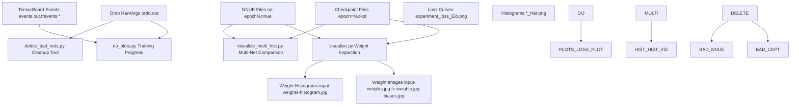
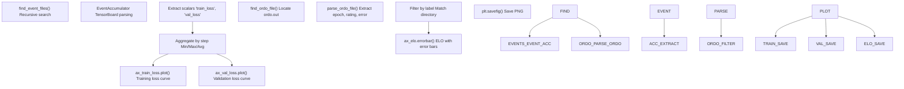
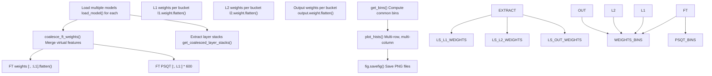
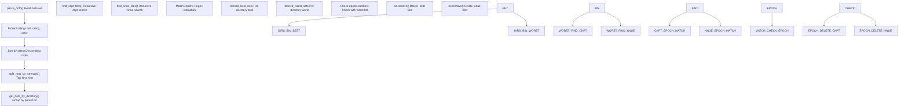
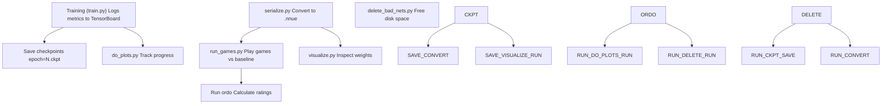

# 可视化与分析 (Visualization and Analysis)

-   [delete\_bad\_nets.py](https://github.com/Chesszyh/nnue-pytorch/blob/024b2064/delete_bad_nets.py)
-   [do\_plots.py](https://github.com/Chesszyh/nnue-pytorch/blob/024b2064/do_plots.py)
-   [model/\_\_init\_\_.py](https://github.com/Chesszyh/nnue-pytorch/blob/024b2064/model/__init__.py)
-   [model/utils/\_\_init\_\_.py](https://github.com/Chesszyh/nnue-pytorch/blob/024b2064/model/utils/__init__.py)
-   [run\_games.py](https://github.com/Chesszyh/nnue-pytorch/blob/024b2064/run_games.py)
-   [serialize.py](https://github.com/Chesszyh/nnue-pytorch/blob/024b2064/serialize.py)
-   [visualize.py](https://github.com/Chesszyh/nnue-pytorch/blob/024b2064/visualize.py)
-   [visualize\_multi\_hist.py](https://github.com/Chesszyh/nnue-pytorch/blob/024b2064/visualize_multi_hist.py)

## 概览

本文档涵盖了 nnue-pytorch 仓库中用于可视化训练进度、分析网络权重和管理网络质量的工具。这些工具使研究人员能够监控训练效果，理解学习到的特征，并维护有组织的实验目录。

可视化和分析系统包括：

-   **训练进度监控**：随时间跟踪损失曲线和 ELO 评级 ([do\_plots.py](https://github.com/Chesszyh/nnue-pytorch/blob/024b2064/do_plots.py))
-   **权重检查**：可视化特征变换器和层堆栈中的学习特征 ([visualize.py](https://github.com/Chesszyh/nnue-pytorch/blob/024b2064/visualize.py))
-   **网络比较**：比较多个训练网络之间的权重分布 ([visualize\_multi\_hist.py](https://github.com/Chesszyh/nnue-pytorch/blob/024b2064/visualize_multi_hist.py))
-   **质量管理**：自动清理表现不佳的网络 ([delete\_bad\_nets.py](https://github.com/Chesszyh/nnue-pytorch/blob/024b2064/delete_bad_nets.py))

关于运行对弈以生成评估数据的信息，请参阅 [运行对弈 (Running Games)](#7.1)。关于 ELO 计算的详细信息，请参阅 [使用 Ordo 进行 ELO 计算 (ELO Calculation with Ordo)](#7.2)。

## 可视化工作流


**图表**：可视化与分析工作流

来源：[do\_plots.py1-267](https://github.com/Chesszyh/nnue-pytorch/blob/024b2064/do_plots.py#L1-L267) [visualize.py1-712](https://github.com/Chesszyh/nnue-pytorch/blob/024b2064/visualize.py#L1-L712) [visualize\_multi\_hist.py1-170](https://github.com/Chesszyh/nnue-pytorch/blob/024b2064/visualize_multi_hist.py#L1-L170) [delete\_bad\_nets.py1-167](https://github.com/Chesszyh/nnue-pytorch/blob/024b2064/delete_bad_nets.py#L1-L167)

## 训练进度可视化

`do_plots.py` 脚本生成综合图表，显示训练和验证损失曲线以及随 Epoch 变化的 ELO 进展。这提供了优化指标和实际棋力的统一视图。

### 数据源

该脚本聚合来自两个来源的数据：

1.  **TensorBoard 事件文件**：训练期间记录的训练和验证损失指标
2.  **Ordo 排名文件**：根据对弈结果计算的 ELO 评级


**图表**：do\_plots.py 数据处理管道

来源：[do\_plots.py10-63](https://github.com/Chesszyh/nnue-pytorch/blob/024b2064/do_plots.py#L10-L63) [do\_plots.py86-215](https://github.com/Chesszyh/nnue-pytorch/blob/024b2064/do_plots.py#L86-L215)

### 使用

绘制单个实验的基本用法：

```
python do_plots.py experiment_dir/
```
比较多个实验：

```
python do_plots.py experiment1/ experiment2/ experiment3/ \    --output comparison.png
```
| 参数 | 默认值 | 描述 |
| --- | --- | --- |
| `root_dirs` | (必需) | 包含 TensorBoard 事件和 ordo.out 的一个或多个目录 |
| `--output` | `experiment_loss_Elo.png` | 生成的绘图的输出文件名 |
| `--elo_range` | `50.0` | 仅显示最佳结果此范围内的 ELO 数据 |
| `--loss_range` | `0.004` | 仅显示最佳结果此范围内的损失数据 |
| `--split` | `False` | 将每个 root\_dir 拆分为子目录以进行单独绘图 |

当在子目录中训练多个运行但在根级别维护单个 `ordo.out` 文件时，`--split` 标志很有用 ([do\_plots.py118-128](https://github.com/Chesszyh/nnue-pytorch/blob/024b2064/do_plots.py#L118-L128))。

### 实现细节

**事件文件发现**：脚本递归搜索匹配模式 `events.out.tfevents.*` 的文件 ([do\_plots.py10-18](https://github.com/Chesszyh/nnue-pytorch/blob/024b2064/do_plots.py#L10-L18))：

**损失聚合**：当存在多个 TensorBoard 运行时（例如，来自多 GPU 训练），脚本使用可配置的聚合模式按步骤聚合值 ([do\_plots.py40-53](https://github.com/Chesszyh/nnue-pytorch/blob/024b2064/do_plots.py#L40-L53))：

-   `min`：取每一步的最小损失
-   `max`：取每一步的最大损失
-   `avg`：取每一步的平均损失

**Ordo 解析**：脚本提取匹配模式 `nn-epoch(\d+).nnue` 的网络及其关联的 ELO 评级和误差条 ([do\_plots.py65-79](https://github.com/Chesszyh/nnue-pytorch/blob/024b2064/do_plots.py#L65-L79))。

来源：[do\_plots.py1-267](https://github.com/Chesszyh/nnue-pytorch/blob/024b2064/do_plots.py#L1-L267)

## 网络权重可视化

`visualize.py` 脚本提供了 NNUE 网络权重和偏置的详细可视化，特别支持复杂的特征变换器结构。它可以可视化单个网络或计算两个网络之间的差异。

### NNUEVisualizer 类

可视化逻辑封装在 `NNUEVisualizer` 类中 ([visualize.py9-549](https://github.com/Chesszyh/nnue-pytorch/blob/024b2064/visualize.py#L9-L549))：

```mermaid
flowchart TD
    INIT["init() Initialize models and args"]
    PROCESS["_process_fig() Save or display figures"]
    PLOT_INPUT["plot_input_weights() Feature transformer visualization"]
    PLOT_FC["plot_fc_weights() Layer stack weights"]
    PLOT_BIAS["plot_fc_biases() Layer stack biases"]
    COALESCE["coalesce_ft_weights() Merge virtual features"]
    MASK["Create img_mask Map features to pixels"]
    FILL["Fill image array Per-neuron visualization"]
    MATSHOW["plt.matshow() Display weight matrix"]
    HIST["plt.hist() Weight histogram"]
    GET_LAYERS["get_coalesced_layer_stacks() Per-bucket layers"]
    EXTRACT_L1["Extract L1 weights Feature transformer output"]
    EXTRACT_L2["Extract L2 weights 32 → 32 layer"]
    EXTRACT_OUT["Extract output weights 32 → 1 layer"]
    SUBPLOT["plt.subplots() Multi-bucket layout"]

    INIT --> PLOT_INPUT
    INIT --> PLOT_FC
    INIT --> PLOT_BIAS
    PLOT --> INPUT_COALESCE
    COALESCE --> MASK
    MASK --> FILL
    FILL --> MATSHOW
    FILL --> HIST
    PLOT --> FC_GET_LAYERS
    GET --> LAYERS_EXTRACT_L1
    GET --> LAYERS_EXTRACT_L2
    GET --> LAYERS_EXTRACT_OUT
    EXTRACT --> L1_SUBPLOT
    EXTRACT --> L2_SUBPLOT
    EXTRACT --> OUT_SUBPLOT
```


**图表**：NNUEVisualizer 架构

来源：[visualize.py9-23](https://github.com/Chesszyh/nnue-pytorch/blob/024b2064/visualize.py#L9-L23) [visualize.py40-316](https://github.com/Chesszyh/nnue-pytorch/blob/024b2064/visualize.py#L40-L316) [visualize.py317-476](https://github.com/Chesszyh/nnue-pytorch/blob/024b2064/visualize.py#L317-L476)

### 特征变换器可视化

最复杂的可视化是特征变换器权重 ([visualize.py40-316](https://github.com/Chesszyh/nnue-pytorch/blob/024b2064/visualize.py#L40-L316))，它将稀疏的 HalfKP/HalfKA 特征空间映射到 2D 图像，其中每个输入神经元占据一个矩形区域。

**布局策略**：可视化将神经元排列在具有首选 4:1 纵横比的网格中 ([visualize.py57-71](https://github.com/Chesszyh/nnue-pytorch/blob/024b2064/visualize.py#L57-L71))：

-   对于 `L1=1024` 神经元：256×4 网格（每行 64 个神经元，16 行）
-   每个神经元以按棋子类型和王/棋子位置组织的结构化布局显示所有特征

**两种排序模式** ([visualize.py117-167](https://github.com/Chesszyh/nnue-pytorch/blob/024b2064/visualize.py#L117-L167))：

1.  **以子力为中心并翻转王 (Piece-centric with flipped king)**（默认）：首先按棋子组织权重，与 Stockfish 评估指南可视化兼容
2.  **以王为中心 (King-centric)**：首先按王的位置组织权重

**神经元排序**：`--sort-input-neurons` 标志按权重的 L1 范数对神经元进行排序，将影响最大的神经元放在前面 ([visualize.py74-82](https://github.com/Chesszyh/nnue-pytorch/blob/024b2064/visualize.py#L74-L82))。

**交互式坐标显示**：当交互式显示绘图时，将鼠标悬停在像素上会显示该权重对应的棋子、棋子格和王格 ([visualize.py249-296](https://github.com/Chesszyh/nnue-pytorch/blob/024b2064/visualize.py#L249-L296))。

### 差异可视化

当通过 `--ref-model` 提供参考模型时，可视化工具会计算权重差异 ([visualize.py46-52](https://github.com/Chesszyh/nnue-pytorch/blob/024b2064/visualize.py#L46-L52))：

```
if self.args.ref_model:    ref_weights = M.coalesce_ft_weights(...)    weights -= ref_weights  # Subtract reference weights
```
这对于以下方面很有用：

-   比较不同训练 Epoch 的网络
-   分析超参数变化的影响
-   识别训练期间变化最大的特征

### 命令行接口

| 参数 | 默认值 | 描述 |
| --- | --- | --- |
| `model` | (必需) | 源模型（.ckpt、.pt 或 .nnue）|
| `--ref-model` | None | 用于差异可视化的参考模型 |
| `--ref-features` | 与模型相同 | 参考模型的特征集 |
| `--input-weights-vmin` | \-1 | 输入权重的色图最小值（≥0 绘制绝对值）|
| `--input-weights-vmax` | 1 | 输入权重的色图最大值 |
| `--input-weights-auto-scale` | False | 使用自动色图缩放 |
| `--input-weights-order` | `piece-centric-flipped-king` | 权重排序：`piece-centric-flipped-king` 或 `king-centric` |
| `--sort-input-neurons` | False | 按权重的 L1 范数对神经元进行排序 |
| `--fc-weights-vmin` | \-2 | 全连接层权重的色图最小值 |
| `--fc-weights-vmax` | 2 | 全连接层权重的色图最大值 |
| `--fc-weights-auto-scale` | False | 对全连接层使用自动色图缩放 |
| `--no-hist` | False | 跳过直方图生成 |
| `--no-biases` | False | 跳过偏置可视化 |
| `--no-input-weights` | False | 跳过输入权重可视化 |
| `--no-fc-weights` | False | 跳过全连接权重可视化 |
| `--save-dir` | None | 保存绘图的目录（如果未设置，则交互式显示）|
| `--label` | 模型的基本名称 | 绘图标题和文件名的标签 |

用法示例：

```
# Visualize a single networkpython visualize.py experiment/nn-epoch100.nnue --save-dir plots/# Compare two networkspython visualize.py epoch100.nnue \    --ref-model epoch50.nnue \    --label "epoch100_vs_50" \    --save-dir comparison/# Visualize with sorted neurons and king-centric orderingpython visualize.py model.nnue \    --sort-input-neurons \    --input-weights-order king-centric
```
来源：[visualize.py551-712](https://github.com/Chesszyh/nnue-pytorch/blob/024b2064/visualize.py#L551-L712)

## 多网络比较

`visualize_multi_hist.py` 脚本生成直方图，比较多个网络的权重分布。这对于分析训练动态和比较不同的训练运行很有用。

### 功能

该脚本生成四个直方图：

1.  **特征变换器权重**：所有神经元的 FT 权重分布
2.  **特征变换器 PSQT 权重**：PSQT（子力-位置价值表）组件的分布
3.  **L1 权重**：网络之间每个桶的分布
4.  **L2 权重**：网络之间每个桶的分布
5.  **输出权重**：网络之间每个桶的分布


**图表**：多网络直方图生成管道

来源：[visualize\_multi\_hist.py57-166](https://github.com/Chesszyh/nnue-pytorch/blob/024b2064/visualize_multi_hist.py#L57-L166)

### 实现细节

**分箱计算**：该脚本计算跨所有网络的通用直方图分箱，以确保一致的 X 轴缩放 ([visualize\_multi\_hist.py9-18](https://github.com/Chesszyh/nnue-pytorch/blob/024b2064/visualize_multi_hist.py#L9-L18))：

```
def get_bins(inputs_columns, num_bins):    a = float("+inf")    b = float("-inf")    for inputs in inputs_columns:        for inp in inputs:            a = min(a, float(np.min(inp)))            b = max(b, float(np.max(inp)))    a -= 0.001    b += 0.001    return [a + (b - a) / num_bins * i for i in range(num_bins + 1)]
```
**多网格布局**：`plot_hists()` 函数创建一个直方图网格，其中行代表不同的网络，列代表不同的组件（例如，层堆栈的桶）([visualize\_multi\_hist.py21-54](https://github.com/Chesszyh/nnue-pytorch/blob/024b2064/visualize_multi_hist.py#L21-L54))。

**PSQT 缩放**：特征变换器 PSQT 权重乘以 600 以转换为 Stockfish 内部单位 ([visualize\_multi\_hist.py98-100](https://github.com/Chesszyh/nnue-pytorch/blob/024b2064/visualize_multi_hist.py#L98-L100))。

### 使用

```
# Compare three networkspython visualize_multi_hist.py \    epoch50.nnue epoch100.nnue epoch150.nnue \    --features HalfKAv2_hm
```
这会生成 PNG 文件：

-   `input_weights_hist.png`：FT 权重分布
-   `input_weights_psqt_hist.png`：PSQT 权重分布
-   `l1_weights_hist.png`：L1 层权重分布（所有桶）
-   `l2_weights_hist.png`：L2 层权重分布（所有桶）
-   `output_weights_hist.png`：输出层权重分布（所有桶）

来源：[visualize\_multi\_hist.py1-170](https://github.com/Chesszyh/nnue-pytorch/blob/024b2064/visualize_multi_hist.py#L1-L170)

## 网络质量管理

`delete_bad_nets.py` 脚本根据 ordo 排名自动清理表现不佳的网络。这有助于在频繁检查点的长时间训练运行期间维持可管理的磁盘使用量。

### 清理工作流


**图表**：网络清理过程

来源：[delete\_bad\_nets.py7-120](https://github.com/Chesszyh/nnue-pytorch/blob/024b2064/delete_bad_nets.py#L7-L120)

### 安全功能

脚本包含几个安全机制：

1.  **Ordo 依赖**：如果未找到 `ordo.out`，则不会删除任何内容 ([delete\_bad\_nets.py82-84](https://github.com/Chesszyh/nnue-pytorch/blob/024b2064/delete_bad_nets.py#L82-L84))
2.  **白名单方法**：仅可删除 ordo 中明确列出的网络；未列出的网络始终保留 ([delete\_bad\_nets.py138-139](https://github.com/Chesszyh/nnue-pytorch/blob/024b2064/delete_bad_nets.py#L138-L139))
3.  **目录隔离**：网络按父目录分箱，防止跨目录删除 ([delete\_bad\_nets.py56-75](https://github.com/Chesszyh/nnue-pytorch/blob/024b2064/delete_bad_nets.py#L56-L75))
4.  **Epoch 匹配**：.ckpt 和 .nnue 文件必须具有匹配的 epoch 编号才能一起删除 ([delete\_bad\_nets.py95-119](https://github.com/Chesszyh/nnue-pytorch/blob/024b2064/delete_bad_nets.py#L95-L119))

### 使用

```
# Keep top 16 networks, delete restpython delete_bad_nets.py experiment_dir/# Keep top 32 networkspython delete_bad_nets.py experiment_dir/ 32
```
**参数**：

-   `root_dir`：要清理的目录（必须包含或具有包含 `ordo.out` 的子级）
-   `num_best_to_keep`：要保留的最佳网络数量（默认：16）

### 文件匹配模式

该脚本使用正则表达式来匹配文件 ([delete\_bad\_nets.py79-80](https://github.com/Chesszyh/nnue-pytorch/blob/024b2064/delete_bad_nets.py#L79-L80) [delete\_bad\_nets.py95-96](https://github.com/Chesszyh/nnue-pytorch/blob/024b2064/delete_bad_nets.py#L95-L96))：

| 文件类型 | 模式 | 示例 |
| --- | --- | --- |
| NNUE 文件 | `.*epoch([0-9]*).nnue` | `nn-epoch100.nnue` |
| 检查点文件 | `.*epoch=([0-9]*).*\.ckpt` | `epoch=100-step=250000.ckpt` |

提取 epoch 编号用于匹配对应的 .ckpt 和 .nnue 文件以进行删除。

来源：[delete\_bad\_nets.py1-167](https://github.com/Chesszyh/nnue-pytorch/blob/024b2064/delete_bad_nets.py#L1-L167)

## 与训练管道集成

可视化和分析工具与训练工作流无缝集成：


**图表**：训练管道中的可视化工具

来源：[do\_plots.py1-267](https://github.com/Chesszyh/nnue-pytorch/blob/024b2064/do_plots.py#L1-L267) [visualize.py1-712](https://github.com/Chesszyh/nnue-pytorch/blob/024b2064/visualize.py#L1-L712) [delete\_bad\_nets.py1-167](https://github.com/Chesszyh/nnue-pytorch/blob/024b2064/delete_bad_nets.py#L1-L167)

### 典型工作流

1.  **训练期间**：使用 `do_plots.py` 监控进度以跟踪损失和 ELO 改进
2.  **训练里程碑后**：使用 `visualize.py` 检查特定 Epoch 的学习特征
3.  **比较方法时**：使用 `visualize_multi_hist.py` 比较不同训练配置的权重分布
4.  **定期**：运行 `delete_bad_nets.py` 移除表现不佳的检查点并维护磁盘空间

可视化工具不需要特殊配置，可直接使用标准训练输出。所有工具都支持 `.ckpt`（训练检查点）和 `.nnue`（部署格式）文件，自动检测并加载适当的格式。

来源：[model/\_\_init\_\_.py1-32](https://github.com/Chesszyh/nnue-pytorch/blob/024b2064/model/__init__.py#L1-L32) [model/utils/\_\_init\_\_.py1-13](https://github.com/Chesszyh/nnue-pytorch/blob/024b2064/model/utils/__init__.py#L1-L13)
