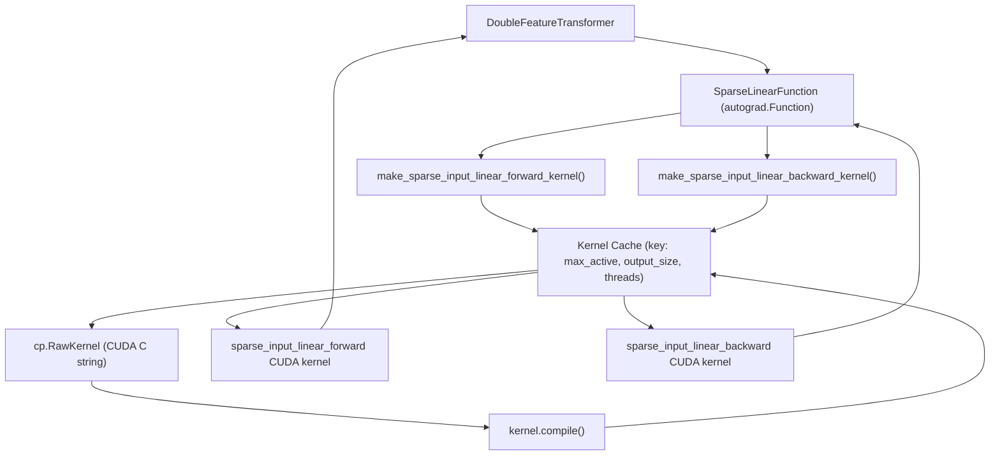
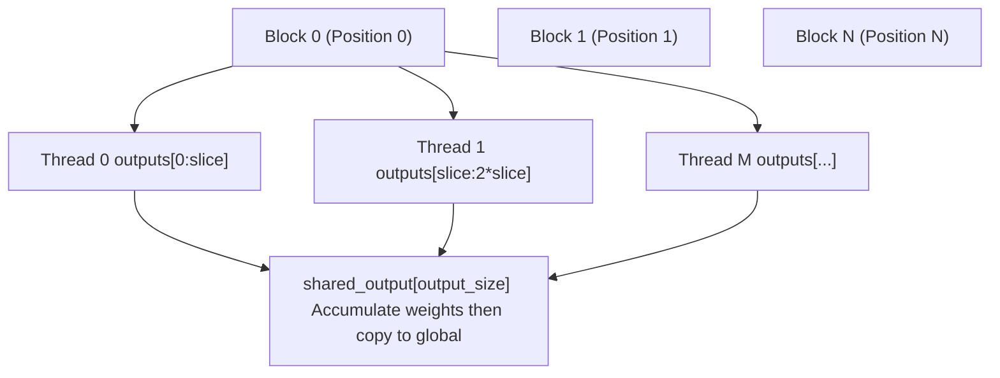
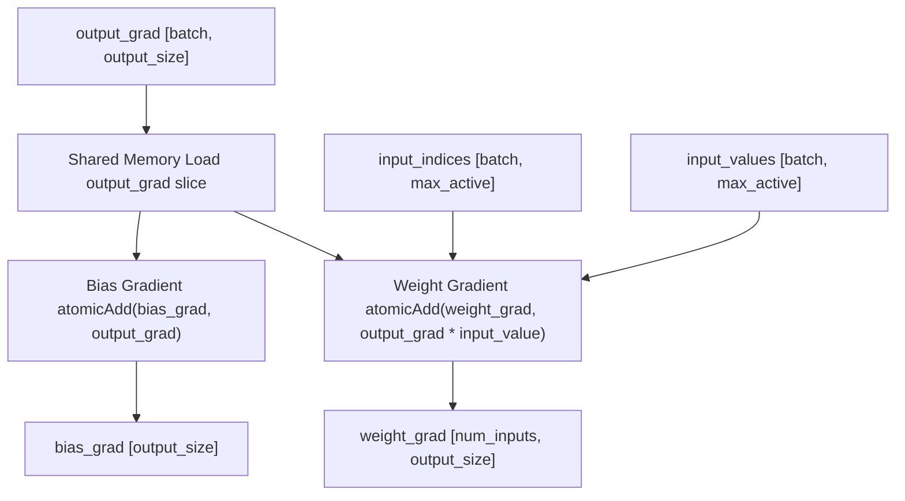
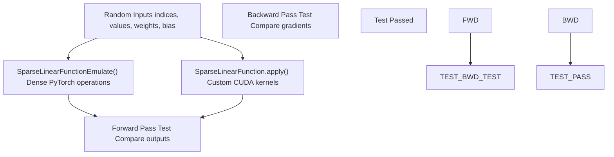
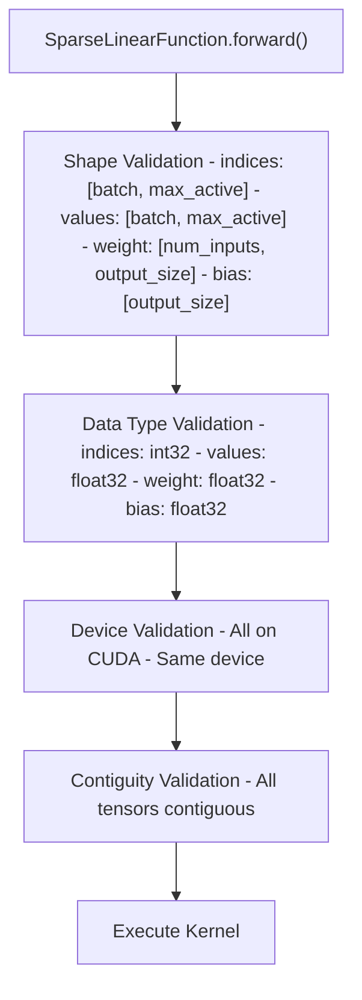
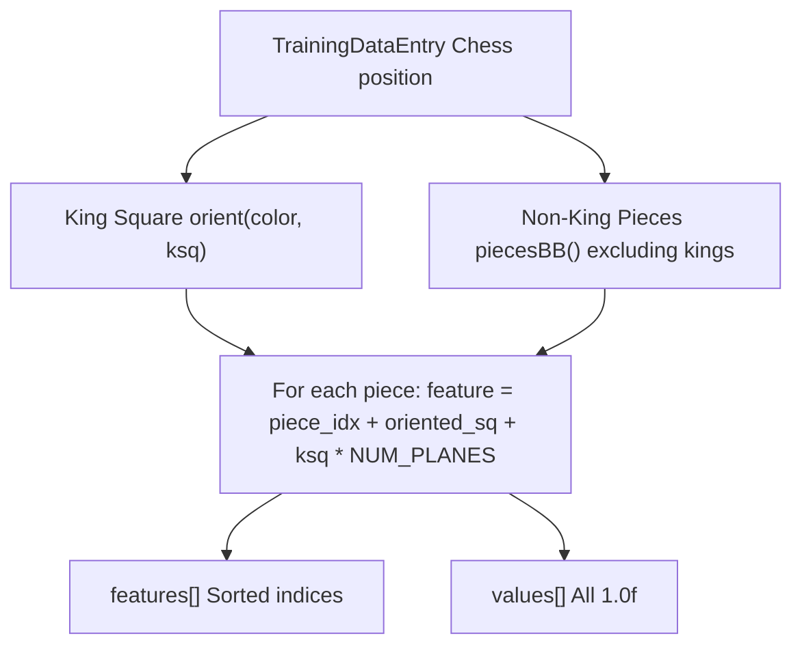
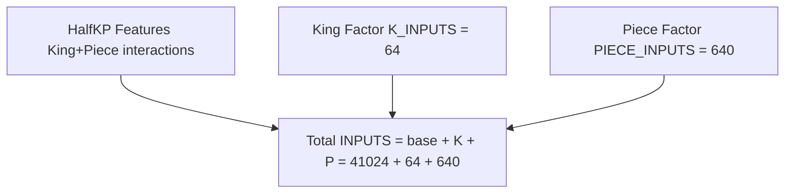
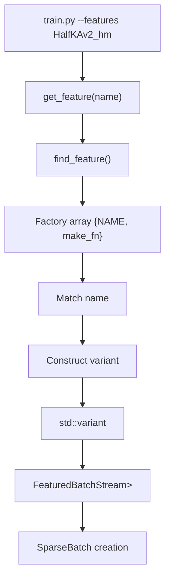
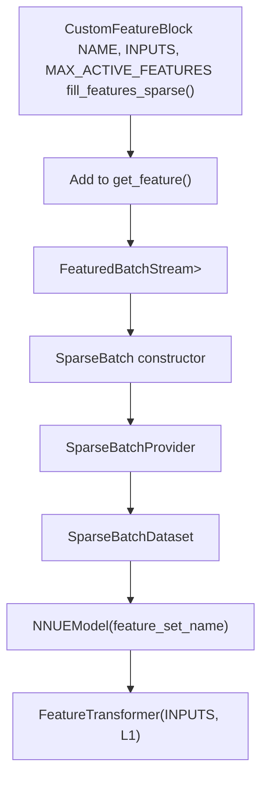

# 高级主题 (Advanced Topics)

-   [lib/nnue\_training\_data\_formats.h](https://github.com/Chesszyh/nnue-pytorch/blob/024b2064/lib/nnue_training_data_formats.h)
-   [lib/nnue\_training\_data\_stream.h](https://github.com/Chesszyh/nnue-pytorch/blob/024b2064/lib/nnue_training_data_stream.h)
-   [model/modules/\_\_init\_\_.py](https://github.com/Chesszyh/nnue-pytorch/blob/024b2064/model/modules/__init__.py)
-   [model/modules/feature\_transformer/\_\_init\_\_.py](https://github.com/Chesszyh/nnue-pytorch/blob/024b2064/model/modules/feature_transformer/__init__.py)
-   [model/modules/feature\_transformer/functions.py](https://github.com/Chesszyh/nnue-pytorch/blob/024b2064/model/modules/feature_transformer/functions.py)
-   [model/modules/feature\_transformer/kernel.py](https://github.com/Chesszyh/nnue-pytorch/blob/024b2064/model/modules/feature_transformer/kernel.py)
-   [model/modules/feature\_transformer/module.py](https://github.com/Chesszyh/nnue-pytorch/blob/024b2064/model/modules/feature_transformer/module.py)
-   [tests/test\_feature\_transformer.py](https://github.com/Chesszyh/nnue-pytorch/blob/024b2064/tests/test_feature_transformer.py)
-   [training\_data\_loader.cpp](https://github.com/Chesszyh/nnue-pytorch/blob/024b2064/training_data_loader.cpp)

本页涵盖了为需要深入了解系统内部的开发人员准备的高级实现细节。它记录了自定义 CUDA 内核、测试基础设施和特征集扩展机制。

关于基本模型架构概念，请参阅 [模型架构 (Model Architecture)](#4)。关于序列化细节，请参阅 [模型序列化 (Model Serialization)](#5)。关于 FT 排列等优化技术，请参阅 [优化技术 (Optimization Techniques)](#6)。

## 8.1 自定义 CUDA 内核

特征变换器使用自定义 CUDA 内核来高效处理稀疏输入特征。这些内核在运行时动态编译并缓存以供重用。

### 内核架构

稀疏线性操作分为前向和反向内核，用于处理 NNUE 特征输入的独特结构：


**来源：** [model/modules/feature\_transformer/kernel.py1-312](https://github.com/Chesszyh/nnue-pytorch/blob/024b2064/model/modules/feature_transformer/kernel.py#L1-L312) [model/modules/feature\_transformer/functions.py1-105](https://github.com/Chesszyh/nnue-pytorch/blob/024b2064/model/modules/feature_transformer/functions.py#L1-L105) [model/modules/feature\_transformer/module.py1-51](https://github.com/Chesszyh/nnue-pytorch/blob/024b2064/model/modules/feature_transformer/module.py#L1-L51)

### 前向内核实现

前向内核在写入全局内存之前将活动特征的权重累积到共享内存中：

| 组件 | 描述 | 代码位置 |
| --- | --- | --- |
| **输入索引 (Input Indices)** | `int32_t[batch_size, max_active_features]` - 特征 ID，-1 表示空槽 | [model/modules/feature\_transformer/kernel.py82-93](https://github.com/Chesszyh/nnue-pytorch/blob/024b2064/model/modules/feature_transformer/kernel.py#L82-L93) |
| **输入值 (Input Values)** | `float32[batch_size, max_active_features]` - 特征值 (arity) | [model/modules/feature\_transformer/kernel.py94-98](https://github.com/Chesszyh/nnue-pytorch/blob/024b2064/model/modules/feature_transformer/kernel.py#L94-L98) |
| **权重矩阵 (Weight Matrix)** | `float32[num_inputs, output_size]` - 可学习权重 | [model/modules/feature\_transformer/kernel.py100-102](https://github.com/Chesszyh/nnue-pytorch/blob/024b2064/model/modules/feature_transformer/kernel.py#L100-L102) |
| **偏置向量 (Bias Vector)** | `float32[output_size]` - 可学习偏置 | [model/modules/feature\_transformer/kernel.py104-106](https://github.com/Chesszyh/nnue-pytorch/blob/024b2064/model/modules/feature_transformer/kernel.py#L104-L106) |
| **输出 (Output)** | `float32[batch_size, output_size]` - 计算出的激活 | [model/modules/feature\_transformer/kernel.py108-113](https://github.com/Chesszyh/nnue-pytorch/blob/024b2064/model/modules/feature_transformer/kernel.py#L108-L113) |

内核在批处理维度（每个位置一个 CUDA 块）和输出维度（每个块多个线程）上并行化：


**关键优化：** 每个线程处理 `output_thread_slice_size = output_size // num_threads` 个连续输出，从而实现合并内存访问。

**来源：** [model/modules/feature\_transformer/kernel.py68-173](https://github.com/Chesszyh/nnue-pytorch/blob/024b2064/model/modules/feature_transformer/kernel.py#L68-L173)

### 反向内核实现

反向内核使用原子操作计算权重和偏置的梯度，以处理并发更新：


**原子操作：** 必需的，因为批次中的多个位置可能会激活相同的特征，导致并发写入相同的权重梯度位置 [model/modules/feature\_transformer/kernel.py276-277](https://github.com/Chesszyh/nnue-pytorch/blob/024b2064/model/modules/feature_transformer/kernel.py#L276-L277) [model/modules/feature\_transformer/kernel.py293](https://github.com/Chesszyh/nnue-pytorch/blob/024b2064/model/modules/feature_transformer/kernel.py#L293-L293)。

**来源：** [model/modules/feature\_transformer/kernel.py197-311](https://github.com/Chesszyh/nnue-pytorch/blob/024b2064/model/modules/feature_transformer/kernel.py#L197-L311)

### 内核编译和缓存

内核使用 CuPy 按需编译，并根据超参数进行缓存：

| 缓存键组件 | 目的 |
| --- | --- |
| `max_active_indices` | 决定循环展开和共享内存大小 |
| `output_size` | 决定线程数和内存布局 |
| `num_threads` | 给定输出大小的优化线程数 |

缓存机制：

```
# Forward kernel cache_sparse_input_linear_forward_kernel_cache = dict()def make_sparse_input_linear_forward_kernel(max_active_indices: int, output_size: int):    num_threads = _get_num_threads_for_forward(output_size)    output_thread_slice_size = output_size // num_threads    key = (max_active_indices, output_size, num_threads)        if key not in _sparse_input_linear_forward_kernel_cache:        # Compile CUDA kernel with template parameters        kernel = cp.RawKernel(cuda_source_string, "sparse_input_linear_forward")        kernel.compile()        _sparse_input_linear_forward_kernel_cache[key] = kernel        return _sparse_input_linear_forward_kernel_cache[key]
```
**线程数优化：** 系统找到最接近 512 个线程目标的 `output_size` 约数 [model/modules/feature\_transformer/kernel.py5-11](https://github.com/Chesszyh/nnue-pytorch/blob/024b2064/model/modules/feature_transformer/kernel.py#L5-L11)，确保 `output_size % num_threads == 0` 以实现均匀的工作分配。

**来源：** [model/modules/feature\_transformer/kernel.py14-24](https://github.com/Chesszyh/nnue-pytorch/blob/024b2064/model/modules/feature_transformer/kernel.py#L14-L24) [model/modules/feature\_transformer/kernel.py27-37](https://github.com/Chesszyh/nnue-pytorch/blob/024b2064/model/modules/feature_transformer/kernel.py#L27-L37) [model/modules/feature\_transformer/kernel.py47-173](https://github.com/Chesszyh/nnue-pytorch/blob/024b2064/model/modules/feature_transformer/kernel.py#L47-L173)

### 性能特征

稀疏线性内核通过以下方式实现高性能：

1.  **合并内存访问 (Coalesced Memory Access)：** 线程访问连续的内存位置 [model/modules/feature\_transformer/kernel.py125-138](https://github.com/Chesszyh/nnue-pytorch/blob/024b2064/model/modules/feature_transformer/kernel.py#L125-L138)
2.  **共享内存缓冲 (Shared Memory Buffering)：** 减少全局内存流量 [model/modules/feature\_transformer/kernel.py122](https://github.com/Chesszyh/nnue-pytorch/blob/024b2064/model/modules/feature_transformer/kernel.py#L122-L122)
3.  **提前终止 (Early Termination)：** 循环在第一个 -1 索引处中断 [model/modules/feature\_transformer/kernel.py152](https://github.com/Chesszyh/nnue-pytorch/blob/024b2064/model/modules/feature_transformer/kernel.py#L152-L152)
4.  **Pragma Unroll：** 内部循环的编译器提示 [model/modules/feature\_transformer/kernel.py134](https://github.com/Chesszyh/nnue-pytorch/blob/024b2064/model/modules/feature_transformer/kernel.py#L134-L134)

典型性能：在现代 GPU (RTX 3090) 上，批大小为 8192，输入特征为 40,960 时，每秒约 300,000 个位置 [tests/test\_feature\_transformer.py81-86](https://github.com/Chesszyh/nnue-pytorch/blob/024b2064/tests/test_feature_transformer.py#L81-L86)。

**来源：** [tests/test\_feature\_transformer.py80-122](https://github.com/Chesszyh/nnue-pytorch/blob/024b2064/tests/test_feature_transformer.py#L80-L122)

## 8.2 测试与验证

系统包括全面的测试基础设施，以验证内核正确性并测量性能。

### 单元测试架构


**来源：** [tests/test\_feature\_transformer.py36-78](https://github.com/Chesszyh/nnue-pytorch/blob/024b2064/tests/test_feature_transformer.py#L36-L78)

### 参考实现

测试套件包括一个纯 PyTorch 参考实现，作为基本事实：

```
def SparseLinearFunctionEmulate(    input_indices: torch.Tensor,    input_values: torch.Tensor,    weight: torch.Tensor,    bias: torch.Tensor,) -> torch.Tensor:    batch_size = input_indices.shape[0]    num_inputs = weight.shape[0]    max_active_indices = input_indices.shape[1]        # Expand sparse representation to dense    inputs = torch.zeros(batch_size, num_inputs, dtype=torch.float32, device=weight.device)    for i in range(batch_size):        for j in range(max_active_indices):            feature = input_indices[i, j]            value = input_values[i, j]            inputs[i, feature] += value        # Standard dense linear operation    return torch.mm(inputs, weight) + bias
```
此参考实现故意简单且明显正确，以性能换取清晰度 [tests/test\_feature\_transformer.py15-33](https://github.com/Chesszyh/nnue-pytorch/blob/024b2064/tests/test_feature_transformer.py#L15-L33)。

**来源：** [tests/test\_feature\_transformer.py15-33](https://github.com/Chesszyh/nnue-pytorch/blob/024b2064/tests/test_feature_transformer.py#L15-L33)

### 测试覆盖率

测试验证：

| 测试方面 | 验证方法 | 容差 |
| --- | --- | --- |
| **前向传递** | 逐元素比较输出张量 | `max_error < 1e-4` |
| **反向传递（权重）** | 逐元素比较权重梯度 | `max_error < 1e-4` |
| **反向传递（偏置）** | 逐元素比较偏置梯度 | `max_error < 1e-4` |
| **多个位置** | 两次独立的前向传递 | 相同的容差 |

测试使用固定的随机种子以实现可重复性 [tests/test\_feature\_transformer.py43-56](https://github.com/Chesszyh/nnue-pytorch/blob/024b2064/tests/test_feature_transformer.py#L43-L56)。

**来源：** [tests/test\_feature\_transformer.py36-78](https://github.com/Chesszyh/nnue-pytorch/blob/024b2064/tests/test_feature_transformer.py#L36-L78)

### 输入验证

`SparseLinearFunction` 在前向传递中执行广泛的验证，以及早发现错误：


每个验证都使用断言，在开发过程中提供清晰的错误消息 [model/modules/feature\_transformer/functions.py15-40](https://github.com/Chesszyh/nnue-pytorch/blob/024b2064/model/modules/feature_transformer/functions.py#L15-L40)。

**来源：** [model/modules/feature\_transformer/functions.py10-69](https://github.com/Chesszyh/nnue-pytorch/blob/024b2064/model/modules/feature_transformer/functions.py#L10-L69)

### 性能基准测试

基准测试以每秒位置数测量吞吐量：

```
def bench():    INPUT_SIZE = 40960    BATCH_SIZE = 8192    ITERS = 64    STRIDE = 264    MAX_ACTIVE_FEATURES = 64        layer = DoubleFeatureTransformer(INPUT_SIZE, STRIDE).cuda()        for _ in range(ITERS):        output0, output1 = layer(indices0, values0, indices1, values1)        output0 = torch.clamp(output0, 0.0, 1.0)        output1 = torch.clamp(output1, 0.0, 1.0)                g = ((output0 - output1) ** 2).mean()        g.backward()                torch.cuda.synchronize()        print("{} pos/s".format((ITERS * BATCH_SIZE) / elapsed))
```
基准测试模拟了真实的训练条件，包括：

-   稀疏索引（75% 活动，25% 使用 -1 填充）
-   前向和反向传递
-   激活裁剪
-   梯度计算
-   用于精确计时的 GPU 同步

**来源：** [tests/test\_feature\_transformer.py80-122](https://github.com/Chesszyh/nnue-pytorch/blob/024b2064/tests/test_feature_transformer.py#L80-L122)

## 8.3 扩展特征集

系统使用灵活的特征块架构，允许实现自定义特征提取器。

### 特征块接口

所有特征块必须实现此接口：


**来源：** [training\_data\_loader.cpp60-591](https://github.com/Chesszyh/nnue-pytorch/blob/024b2064/training_data_loader.cpp#L60-L591)

### 必需的静态成员

每个特征块结构体必须定义：

| 成员 | 类型 | 目的 | 示例 |
| --- | --- | --- | --- |
| `NAME` | `std::string_view` | 特征集标识符 | `"HalfKP"`, `"HalfKAv2_hm^"` |
| `INPUTS` | `constexpr int` | 可能的特征总数 | HalfKP 为 `41024` |
| `MAX_ACTIVE_FEATURES` | `constexpr int` | 每个位置的最大活动特征数 | 大多数为 `32`，Full\_Threats 为 `160` |

**分解变体：** 具有虚拟特征的特征块在名称后附加 `^` 并相应地增加 `INPUTS` 和 `MAX_ACTIVE_FEATURES` [training\_data\_loader.cpp100-110](https://github.com/Chesszyh/nnue-pytorch/blob/024b2064/training_data_loader.cpp#L100-L110)。

**来源：** [training\_data\_loader.cpp61-66](https://github.com/Chesszyh/nnue-pytorch/blob/024b2064/training_data_loader.cpp#L61-L66) [training\_data\_loader.cpp100-106](https://github.com/Chesszyh/nnue-pytorch/blob/024b2064/training_data_loader.cpp#L100-L106)

### 特征提取方法

核心方法签名：

```
static std::pair<int, int> fill_features_sparse(    const TrainingDataEntry& e,    int* features,        // Output: feature indices    float* values,        // Output: feature values (arity)    Color color           // Perspective (White or Black))
```
**返回值：** `{num_active_features, total_inputs}` 其中：

-   `num_active_features`：写入的特征数量 (≤ MAX\_ACTIVE\_FEATURES)
-   `total_inputs`：与 INPUTS 常量相同

**合约：**

1.  将特征索引写入 `features[0..num_active_features-1]`
2.  将相应的特征值写入 `values[0..num_active_features-1]`
3.  特征必须排序以实现高效的稀疏张量合并 [training\_data\_loader.cpp84-85](https://github.com/Chesszyh/nnue-pytorch/blob/024b2064/training_data_loader.cpp#L84-L85)
4.  返回写入的特征计数

**来源：** [training\_data\_loader.cpp76-96](https://github.com/Chesszyh/nnue-pytorch/blob/024b2064/training_data_loader.cpp#L76-L96)

### 示例：HalfKP 实现

HalfKP 特征集编码王的位置和棋子的位置：


关键实现细节：

```
static int feature_index(Color color, Square ksq, Square sq, Piece p) {    auto p_idx = static_cast<int>(p.type()) * 2 + (p.color() != color);    return 1 + static_cast<int>(orient(color, sq)) + p_idx * NUM_SQ         + static_cast<int>(ksq) * NUM_PLANES;}static std::pair<int, int>fill_features_sparse(const TrainingDataEntry& e, int* features, float* values, Color color) {    auto& pos = e.pos;    auto pieces = pos.piecesBB() & ~(pos.piecesBB(whitePiece) | pos.piecesBB(blackKing));    auto ksq = pos.kingSquare(color);        int j = 0;    for (Square sq : pieces) {        auto p = pos.pieceAt(sq);        values[j] = 1.0f;        features[j] = feature_index(color, orient(color, ksq), sq, p);        ++j;    }        return {j, INPUTS};}
```
**方向 (Orientation)：** `orient()` 函数应用透视变换（黑方旋转 180°）[training\_data\_loader.cpp35-47](https://github.com/Chesszyh/nnue-pytorch/blob/024b2064/training_data_loader.cpp#L35-L47)。

**来源：** [training\_data\_loader.cpp60-97](https://github.com/Chesszyh/nnue-pytorch/blob/024b2064/training_data_loader.cpp#L60-L97)

### 分解特征

分解特征块添加了加速早期训练的虚拟特征：


**实现模式：**

1.  调用基本特征块的 `fill_features_sparse()` 获取基本特征
2.  添加带有适当偏移量的虚拟特征
3.  返回组合计数

来自 HalfKPFactorized 的示例：

```
static std::pair<int, int>fill_features_sparse(const TrainingDataEntry& e, int* features, float* values, Color color) {    // Get base features    auto [start_j, offset] = HalfKP::fill_features_sparse(e, features, values, color);    int j = start_j;        // Add king square factor    auto ksq = e.pos.kingSquare(color);    features[j] = offset + static_cast<int>(orient(color, ksq));    values[j] = static_cast<float>(start_j);  // Arity = number of base features    ++j;    offset += K_INPUTS;        // Add piece factors    for (Square sq : pieces) {        auto p = e.pos.pieceAt(sq);        auto p_idx = static_cast<int>(p.type()) * 2 + (p.color() != color);        values[j] = 1.0f;        features[j] = offset + (p_idx * NUM_SQ) + static_cast<int>(orient(color, sq));        ++j;    }        return {j, INPUTS};}
```
**虚拟特征值：** 王因子使用基本特征的计数作为其值，产生学习到的缩放效果 [training\_data\_loader.cpp121](https://github.com/Chesszyh/nnue-pytorch/blob/024b2064/training_data_loader.cpp#L121-L121)。

**来源：** [training\_data\_loader.cpp99-144](https://github.com/Chesszyh/nnue-pytorch/blob/024b2064/training_data_loader.cpp#L99-L144)

### 特征注册系统

特征使用基于变体 (variant) 的查找进行注册：


注册在编译时发生：

```
auto get_feature(std::string_view name) {    return find_feature<HalfKP,                        HalfKPFactorized,                        HalfKA,                        HalfKAFactorized,                        HalfKAv2,                        HalfKAv2Factorized,                        HalfKAv2_hm,                        HalfKAv2_hmFactorized,                        Full_Threats,                        Full_ThreatsFactorized                        >(name);}template<typename... Ts>auto find_feature(std::string_view name) {    using Variant = std::variant<std::monostate, Ts...>;    using Factory = Variant (*)();        static constexpr Entry factories[] = {        {Ts::NAME, +[]() -> Variant { return Ts{}; }}...    };        for (auto& f : factories) {        if (name == f.name)            return f.make();    }        return Variant{std::monostate{}};}
```
**添加新特征集：**

1.  定义具有必需成员的特征块结构体
2.  实现 `fill_features_sparse()` 方法
3.  添加到 `get_feature()` 中的模板参数包 [training\_data\_loader.cpp661-673](https://github.com/Chesszyh/nnue-pytorch/blob/024b2064/training_data_loader.cpp#L661-L673)

**来源：** [training\_data\_loader.cpp624-673](https://github.com/Chesszyh/nnue-pytorch/blob/024b2064/training_data_loader.cpp#L624-L673)

### 特征集包装器

`FeatureSet<T>` 模板包装特征块以用于流系统：

```
template<typename T, typename... Ts>struct FeatureSet {    static_assert(sizeof...(Ts) == 0, "Currently only one feature subset supported.");        static constexpr int INPUTS = T::INPUTS;    static constexpr int MAX_ACTIVE_FEATURES = T::MAX_ACTIVE_FEATURES;    static constexpr std::string_view NAME = T::NAME;        static std::pair<int, int>    fill_features_sparse(const TrainingDataEntry& e, int* features, float* values, Color color) {        return T::fill_features_sparse(e, features, values, color);    }};
```
这种间接方式允许将来扩展到多特征块架构，同时保持简单的接口 [training\_data\_loader.cpp624-637](https://github.com/Chesszyh/nnue-pytorch/blob/024b2064/training_data_loader.cpp#L624-L637)。

**来源：** [training\_data\_loader.cpp624-637](https://github.com/Chesszyh/nnue-pytorch/blob/024b2064/training_data_loader.cpp#L624-L637)

### 与训练管道集成

自定义特征自动与数据管道集成：


特征集的 `INPUTS` 常量自动确定特征变换器输入大小，`MAX_ACTIVE_FEATURES` 确定稀疏批次的内存分配。

**来源：** [training\_data\_loader.cpp675-760](https://github.com/Chesszyh/nnue-pytorch/blob/024b2064/training_data_loader.cpp#L675-L760) [training\_data\_loader.cpp804-924](https://github.com/Chesszyh/nnue-pytorch/blob/024b2064/training_data_loader.cpp#L804-L924)
