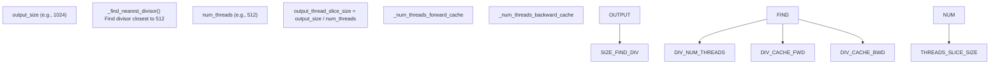
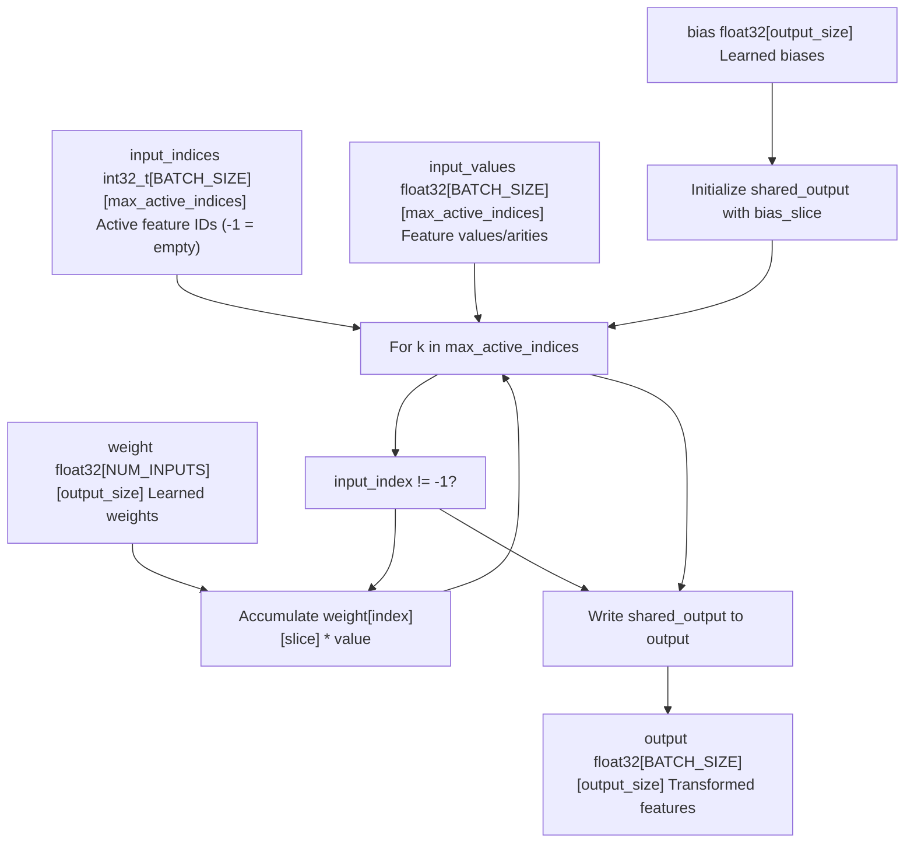
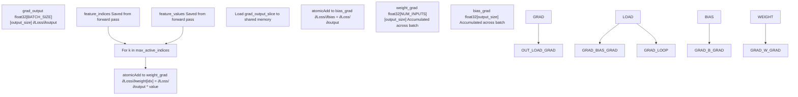
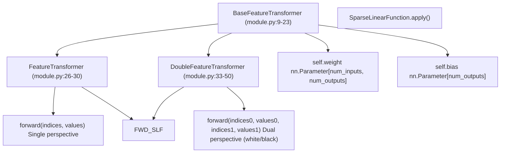
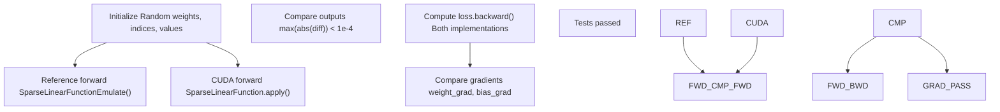

# 自定义 CUDA 内核 (Custom CUDA Kernels)

-   [model/modules/__init__.py](https://github.com/Chesszyh/nnue-pytorch/blob/024b2064/model/modules/__init__.py)
-   [model/modules/feature_transformer/__init__.py](https://github.com/Chesszyh/nnue-pytorch/blob/024b2064/model/modules/feature_transformer/__init__.py)
-   [model/modules/feature_transformer/functions.py](https://github.com/Chesszyh/nnue-pytorch/blob/024b2064/model/modules/feature_transformer/functions.py)
-   [model/modules/feature_transformer/kernel.py](https://github.com/Chesszyh/nnue-pytorch/blob/024b2064/model/modules/feature_transformer/kernel.py)
-   [model/modules/feature_transformer/module.py](https://github.com/Chesszyh/nnue-pytorch/blob/024b2064/model/modules/feature_transformer/module.py)
-   [tests/test_feature_transformer.py](https://github.com/Chesszyh/nnue-pytorch/blob/024b2064/tests/test_feature_transformer.py)

本文档描述了用于特征变换器中稀疏线性操作的自定义 CUDA 内核实现。这些内核对性能至关重要，因为它们利用了 NNUE 输入特征的稀疏性，在训练期间实现了高效的前向和反向传递。

关于使用这些内核的特征变换器架构的信息，请参阅 [特征变换器 (Feature Transformer)](#4.3)。关于测试基础设施，请参阅 [测试与验证 (Testing and Validation)](#8.2)。

## 目的与范围

NNUE 架构处理高度稀疏的输入，其中对于任何给定的国际象棋局面，只有一小部分特征（通常在 40,000+ 中有 30-64 个）处于活动状态。标准密集矩阵运算在这种情况下效率低下。自定义 CUDA 内核实现了优化的稀疏线性操作，这些操作：

-   仅处理活动特征索引，避免对零进行计算
-   使用共享内存存储中间结果
-   在输出维度上采用线程级并行
-   通过自定义反向传递支持高效的梯度计算

这些内核专门用于特征变换器层 ([model/modules/feature_transformer/module.py26-50](https://github.com/Chesszyh/nnue-pytorch/blob/024b2064/model/modules/feature_transformer/module.py#L26-L50))，是训练管道性能的核心。

## 系统架构

自定义 CUDA 内核系统由三个主要组件组成：内核生成和编译、通过 autograd 函数进行的 PyTorch 集成以及公开功能的特征变换器模块。

**图表：CUDA 内核系统架构**

```mermaid
flowchart TD
    FT["FeatureTransformer (module.py)"]
    DFT["DoubleFeatureTransformer (module.py)"]
    FT_FORWARD["forward() feature_indices, feature_values"]
    SLF["SparseLinearFunction (functions.py)"]
    SLF_FWD["forward() Validates inputs, calls CUDA"]
    SLF_BWD["backward() Computes weight/bias gradients"]
    MAKE_FWD["make_sparse_input_linear_forward_kernel() (kernel.py)"]
    MAKE_BWD["make_sparse_input_linear_backward_kernel() (kernel.py)"]
    FWD_CACHE["_sparse_input_linear_forward_kernel_cache Dict[(max_active, out_size, threads)]"]
    BWD_CACHE["_sparse_input_linear_backward_kernel_cache Dict[(max_active, out_size, threads)]"]
    RAW_KERNEL["cp.RawKernel() CUDA C++ source code"]
    COMPILE["kernel.compile() PTX/CUBIN generation"]
    FWD_KERNEL["sparse_input_linear_forward global kernel"]
    BWD_KERNEL["sparse_input_linear_backward global kernel"]
    SHARED_MEM["shared float[output_size] Per-block scratch space"]
    ATOMIC["atomicAdd() Gradient accumulation"]

    FT --> SLF
    DFT --> SLF
    FT --> FORWARD_SLF_FWD
    SLF --> FWD_MAKE_FWD
    SLF --> BWD_MAKE_BWD
    MAKE --> FWD_FWD_CACHE
    MAKE --> BWD_BWD_CACHE
    FWD --> CACHE_RAW_KERNEL
    BWD --> CACHE_RAW_KERNEL
    RAW --> KERNEL_COMPILE
    COMPILE --> FWD_CACHE
    COMPILE --> BWD_CACHE
    FWD --> CACHE_FWD_KERNEL
    BWD --> CACHE_BWD_KERNEL
    FWD --> KERNEL_SHARED_MEM
    BWD --> KERNEL_SHARED_MEM
    BWD --> KERNEL_ATOMIC
```


来源：[model/modules/feature_transformer/kernel.py1-312](https://github.com/Chesszyh/nnue-pytorch/blob/024b2064/model/modules/feature_transformer/kernel.py#L1-L312) [model/modules/feature_transformer/functions.py1-105](https://github.com/Chesszyh/nnue-pytorch/blob/024b2064/model/modules/feature_transformer/functions.py#L1-L105) [model/modules/feature_transformer/module.py1-51](https://github.com/Chesszyh/nnue-pytorch/blob/024b2064/model/modules/feature_transformer/module.py#L1-L51)

## 内核编译和缓存

CUDA 内核在运行时使用 CuPy 的 `RawKernel` 接口动态生成。这种方法允许根据问题维度进行内核特化，从而消除不必要的分支并启用激进的编译器优化。

### 内核工厂函数

两个工厂函数生成专用内核：

| 工厂函数 | 内核用途 | 缓存字典 | 关键维度 |
| --- | --- | --- | --- |
| `make_sparse_input_linear_forward_kernel()` | 前向传递计算 | `_sparse_input_linear_forward_kernel_cache` | `(max_active_indices, output_size, num_threads)` |
| `make_sparse_input_linear_backward_kernel()` | 梯度计算 | `_sparse_input_linear_backward_kernel_cache` | `(max_active_indices, output_size, num_threads)` |

每个工厂函数：

1.  为给定的 `output_size` 计算最佳线程数
2.  检查缓存中是否存在已编译的内核
3.  如果缓存未命中，则使用模板替换生成 CUDA C++ 源代码
4.  通过 `cp.RawKernel()` 编译内核
5.  使用线程配置包装内核
6.  将结果存储在缓存中

来源：[model/modules/feature_transformer/kernel.py50-173](https://github.com/Chesszyh/nnue-pytorch/blob/024b2064/model/modules/feature_transformer/kernel.py#L50-L173) [model/modules/feature_transformer/kernel.py179-311](https://github.com/Chesszyh/nnue-pytorch/blob/024b2064/model/modules/feature_transformer/kernel.py#L179-L311)

### 线程数优化

每个块的 CUDA 线程数是通过找到最接近最佳线程数 (512) 的 `output_size` 的除数来确定的：


这确保了：

-   每个线程处理相等切片的输出 (`output_thread_slice_size`)
-   线程数最大化 GPU 占用率（目标：512 线程/块）
-   所有输出在每个位置都被精确覆盖一次

来源：[model/modules/feature_transformer/kernel.py5-37](https://github.com/Chesszyh/nnue-pytorch/blob/024b2064/model/modules/feature_transformer/kernel.py#L5-L37)

## 前向传递内核

前向传递内核实现了稀疏线性变换：`output = weight[active_indices] @ values + bias`。

### 内核签名和参数

**图表：前向内核数据流**


来源：[model/modules/feature_transformer/kernel.py69-173](https://github.com/Chesszyh/nnue-pytorch/blob/024b2064/model/modules/feature_transformer/kernel.py#L69-L173)

### 线程组织和共享内存

前向内核使用 1D 块网格，其中：

-   **网格维度**：`(BATCH_SIZE,)` - 每个批次位置一个块
-   **块维度**：`(num_threads,)` - 通常为 512 个线程
-   **共享内存**：`float[output_size]` - 用于累积的暂存空间

每个线程负责计算 `output_thread_slice_size` 个连续输出。算法如下：

1.  **初始化** ([kernel.py134-138](https://github.com/Chesszyh/nnue-pytorch/blob/024b2064/kernel.py#L134-L138))：

    -   每个线程将其偏置切片复制到共享内存中

    ```
    for (uint32_t s = 0; s < output_thread_slice_size; ++s) {    shared_output_slice[s] = bias_slice[s];}
    ```

2.  **累积** ([kernel.py140-153](https://github.com/Chesszyh/nnue-pytorch/blob/024b2064/kernel.py#L140-L153))：

    -   迭代活动特征索引
    -   对于每个有效索引（非 -1），加载相应的权重行
    -   乘以特征值并累积到共享内存
    -   在第一个 -1 索引处提前退出（其余保证为空）
3.  **输出** ([kernel.py155-159](https://github.com/Chesszyh/nnue-pytorch/blob/024b2064/kernel.py#L155-L159))：

    -   将共享内存结果复制到全局输出

来源：[model/modules/feature_transformer/kernel.py114-161](https://github.com/Chesszyh/nnue-pytorch/blob/024b2064/model/modules/feature_transformer/kernel.py#L114-L161)

### 输入验证

`SparseLinearFunction.forward()` 方法在内核启动前执行广泛的验证：

| 验证检查 | 断言 | 目的 |
| --- | --- | --- |
| 张量形状 | `len(feature_indices.shape) == 2` | 确保 2D 索引矩阵 |
| 形状一致性 | `feature_indices.shape == feature_values.shape` | 索引/值必须对齐 |
| 数据类型 | `feature_indices.dtype == torch.int32` | 内核期望 int32 索引 |
| 设备放置 | `feature_indices.is_cuda` | 所有张量在 GPU 上 |
| 内存布局 | `feature_indices.is_contiguous()` | 内核假设连续内存 |

来源：[model/modules/feature_transformer/functions.py15-40](https://github.com/Chesszyh/nnue-pytorch/blob/024b2064/model/modules/feature_transformer/functions.py#L15-L40)

## 反向传递内核

反向传递内核根据输出梯度计算权重和偏置的梯度。

### 梯度计算算法

**图表：反向内核梯度流**


来源：[model/modules/feature_transformer/kernel.py197-311](https://github.com/Chesszyh/nnue-pytorch/blob/024b2064/model/modules/feature_transformer/kernel.py#L197-L311)

### 用于梯度累积的原子操作

由于多个线程和块可能会更新相同的梯度位置（不同的批次位置可以共享活动特征），反向内核使用原子操作：

-   **偏置梯度** ([kernel.py270-278](https://github.com/Chesszyh/nnue-pytorch/blob/024b2064/kernel.py#L270-L278))：

    ```
    for (uint32_t s = 0; s < output_thread_slice_size; ++s) {    const float sog = shared_output_grad_slice[s];    if (sog != 0.0f) {        atomicAdd(&bias_grad_slice[s], sog);    }}
    ```

-   **权重梯度** ([kernel.py286-295](https://github.com/Chesszyh/nnue-pytorch/blob/024b2064/kernel.py#L286-L295))：

    ```
    for (int s = 0; s < output_thread_slice_size; ++s) {    const float sog = shared_output_grad_slice[s];    if (sog != 0.0f) {        atomicAdd(&weight_grad_slice[s], sog * input_value);    }}
    ```


零检查优化 (`sog != 0.0f`) 通过跳过零梯度的更新来减少原子争用，这在神经网络训练中很常见。

来源：[model/modules/feature_transformer/kernel.py244-298](https://github.com/Chesszyh/nnue-pytorch/blob/024b2064/model/modules/feature_transformer/kernel.py#L244-L298)

## PyTorch 集成

`SparseLinearFunction` 类将 PyTorch 的 autograd 系统与自定义 CUDA 内核桥接起来。

### Autograd 函数接口

**图表：SparseLinearFunction 集成**

```mermaid
flowchart TD
    INPUTS["Inputs: feature_indices (no grad) feature_values (no grad) weight (requires_grad) bias (requires_grad)"]
    FWD_CALL["SparseLinearFunction.apply()"]
    OUTPUT["output requires_grad=True"]
    BACKWARD["Automatic backward() triggered by loss.backward()"]
    VALIDATE["Validate tensors Shape, dtype, device, contiguity"]
    ALLOC_OUT["Allocate output tensor torch.empty()"]
    GET_KERNEL["make_sparse_input_linear_forward_kernel()"]
    LAUNCH_FWD["kernel(grid=(batch_size,), args=(…))"]
    SAVE["ctx.save_for_backward() Stores input tensors"]
    ALLOC_GRAD["Allocate gradient tensors torch.zeros()"]
    GET_BKWD["make_sparse_input_linear_backward_kernel()"]
    LAUNCH_BKWD["kernel(grid=(batch_size,), args=(…))"]
    RETURN_GRAD["Return (None, None, weight_grad, bias_grad)"]

    INPUTS --> FWD_CALL
    FWD --> CALL_VALIDATE
    VALIDATE --> ALLOC_OUT
    ALLOC --> OUT_GET_KERNEL
    GET --> KERNEL_LAUNCH_FWD
    LAUNCH --> FWD_OUTPUT
    LAUNCH --> FWD_SAVE
    OUTPUT --> BACKWARD
    BACKWARD --> ALLOC_GRAD
    ALLOC --> GRAD_GET_BKWD
    GET --> BKWD_LAUNCH_BKWD
    LAUNCH --> BKWD_RETURN_GRAD
    SAVE --> LAUNCH_BKWD
```


来源：[model/modules/feature_transformer/functions.py10-104](https://github.com/Chesszyh/nnue-pytorch/blob/024b2064/model/modules/feature_transformer/functions.py#L10-L104)

### 张量生命周期

1.  **前向传递** ([functions.py12-69](https://github.com/Chesszyh/nnue-pytorch/blob/024b2064/functions.py#L12-L69))：

    -   验证所有输入张量（形状、dtype、设备、连续性）
    -   通过 `ctx.save_for_backward()` 保存张量以用于反向传递
    -   分配 `requires_grad=True` 的输出张量
    -   启动网格大小为 `(batch_size,)` 的前向内核
2.  **反向传递** ([functions.py72-104](https://github.com/Chesszyh/nnue-pytorch/blob/024b2064/functions.py#L72-L104))：

    -   断言索引/值不需要梯度（第 73-74 行）
    -   如果需要，使 grad_output 连续（第 76 行）
    -   从上下文检索保存的张量（第 78 行）
    -   零初始化梯度张量（第 85-88 行）
    -   启动反向内核
    -   返回与前向签名匹配的 `(None, None, weight_grad, bias_grad)`

来源：[model/modules/feature_transformer/functions.py10-104](https://github.com/Chesszyh/nnue-pytorch/blob/024b2064/model/modules/feature_transformer/functions.py#L10-L104)

## 特征变换器模块

内核通过两个模块类公开，这些类管理权重/偏置参数和前向调用。

### 模块层次结构


来源：[model/modules/feature_transformer/module.py1-51](https://github.com/Chesszyh/nnue-pytorch/blob/024b2064/model/modules/feature_transformer/module.py#L1-L51)

### 参数初始化

`BaseFeatureTransformer` 使用按 $\sigma = \sqrt{1/\text{num_inputs}}$ 缩放的均匀分布初始化权重和偏置：

```
sigma = math.sqrt(1 / num_inputs)self.weight = nn.Parameter(
    torch.rand(num_inputs, num_outputs, dtype=torch.float32)
    * (2 * sigma)
    - sigma)
self.bias = nn.Parameter(
    torch.rand(num_outputs, dtype=torch.float32)
    * (2 * sigma)
    - sigma)
```
此初始化方案为特征变换器在 NNUE 架构中的角色提供了适当的方差。

来源：[model/modules/feature_transformer/module.py15-23](https://github.com/Chesszyh/nnue-pytorch/blob/024b2064/model/modules/feature_transformer/module.py#L15-L23)

## 性能特征

自定义 CUDA 内核相比密集运算或朴素的稀疏实现提供了显着的性能优势。

### 稀疏性利用

对于典型的 NNUE 输入，在 40,960 个总特征中约有 32 个处于活动状态：

-   **稀疏比**：32/40,960 ≈ 0.078%
-   **计算减少**：比密集矩阵乘法少约 1,280 倍的操作
-   **内存访问模式**：权重行的顺序读取（对缓存友好）

### 共享内存优势

使用共享内存进行中间累积：

-   避免重复写入较慢的全局内存
-   启用偏置和权重的合并读取
-   减少累积期间的内存带宽压力

### 基准测试结果

测试套件包括一个基准测试 ([test_feature_transformer.py80-122](https://github.com/Chesszyh/nnue-pytorch/blob/024b2064/test_feature_transformer.py#L80-L122))：

| 配置 | 值 |
| --- | --- |
| 输入大小 | 40,960 特征 |
| 批大小 | 8,192 位置 |
| 输出大小 (L1) | 264 神经元 |
| 活动特征 | 最大 64 (平均 48) |
| 迭代次数 | 64 |

此配置模拟了真实的训练条件，并测量每秒处理的位置数。

来源：[tests/test_feature_transformer.py80-122](https://github.com/Chesszyh/nnue-pytorch/blob/024b2064/tests/test_feature_transformer.py#L80-L122)

## 测试与验证

测试套件通过与参考实现进行比较来验证内核的正确性。

### 参考实现

`SparseLinearFunctionEmulate()` 函数提供了基于 CPU 的参考：

```python
def SparseLinearFunctionEmulate(input_indices, input_values, weight, bias):
    # Convert sparse inputs to dense representation
    inputs = torch.zeros(batch_size, num_inputs, dtype=torch.float32, device=weight.device)
    for i in range(batch_size):
        for j in range(max_active_indices):
            feature = input_indices[i, j]
            value = input_values[i, j]
            inputs[i, feature] += value
        # Standard dense matrix multiplication
    return torch.mm(inputs, weight) + bias
```
来源：[tests/test_feature_transformer.py15-33](https://github.com/Chesszyh/nnue-pytorch/blob/024b2064/tests/test_feature_transformer.py#L15-L33)

### 测试覆盖率

`test()` 函数验证：

1.  **前向传递正确性**：

    -   比较 CUDA 内核输出与参考实现
    -   最大允许误差：1e-4（浮点容差）
2.  **反向传递正确性**：

    -   通过两种实现计算梯度
    -   比较权重和偏置梯度
    -   验证梯度累积是否正确
3.  **双视角处理**：

    -   测试具有两组索引/值的 `DoubleFeatureTransformer`
    -   确保白方/黑方视角独立处理

来源：[tests/test_feature_transformer.py36-77](https://github.com/Chesszyh/nnue-pytorch/blob/024b2064/tests/test_feature_transformer.py#L36-L77)

### 测试执行流程


来源：[tests/test_feature_transformer.py36-77](https://github.com/Chesszyh/nnue-pytorch/blob/024b2064/tests/test_feature_transformer.py#L36-L77)

## 内核限制和设计约束

### 固定线程配置

内核要求 `output_size` 可被选定的线程数整除。`_find_nearest_divisor()` 函数通过查找最接近 512 的 `output_size` 约数来确保这一点。这意味着：

-   不是常用线程数倍数的输出大小可能会使用次优的并行度
-   奇数或素数输出大小将强制使用较小的线程数

### 内存需求

每个线程块分配 `sizeof(float) * output_size` 字节的共享内存。对于较大的输出大小（例如 2048），这需要每个块 8KB 的共享内存，这可能会限制旧 GPU 架构上的占用率。

### 索引格式约束

内核假设：

-   索引已排序（或至少，-1 标记出现在末尾）
-   一旦遇到 -1 索引，该位置的所有后续索引均为 -1
-   这允许提前退出，但需要在 C++ 数据加载器中进行仔细的数据加载

来源：[model/modules/feature_transformer/kernel.py5-37](https://github.com/Chesszyh/nnue-pytorch/blob/024b2064/model/modules/feature_transformer/kernel.py#L5-L37) [model/modules/feature_transformer/kernel.py140-153](https://github.com/Chesszyh/nnue-pytorch/blob/024b2064/model/modules/feature_transformer/kernel.py#L140-L153)

## 与训练管道集成

CUDA 内核在每个训练步骤中被调用：

1.  **数据加载**：C++ 数据加载器生成稀疏索引/值 ([data_loader/training_data_loader.cpp](https://github.com/Chesszyh/nnue-pytorch/blob/024b2064/data_loader/training_data_loader.cpp))
2.  **前向传递**：特征变换器应用稀疏线性操作
3.  **网络传播**：输出流经层堆栈
4.  **损失计算**：计算 WDL 损失
5.  **反向传递**：梯度流回层堆栈
6.  **稀疏反向**：自定义 CUDA 内核计算特征变换器梯度
7.  **优化器步骤**：Ranger21 使用计算出的梯度更新权重

内核处理计算最密集的层（特征变换器有 40K+ 输入 → 256-2048 输出），使其对整体训练吞吐量至关重要。

来源：[model/modules/feature_transformer/functions.py1-105](https://github.com/Chesszyh/nnue-pytorch/blob/024b2064/model/modules/feature_transformer/functions.py#L1-L105) [tests/test_feature_transformer.py101-121](https://github.com/Chesszyh/nnue-pytorch/blob/024b2064/tests/test_feature_transformer.py#L101-L121)
