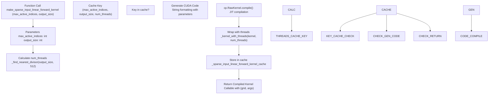
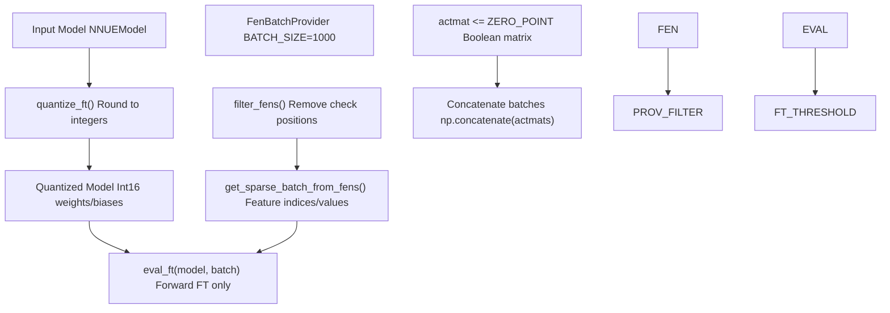

# 测试与验证 (Testing and Validation)

-   [cross\_check\_eval.py](https://github.com/Chesszyh/nnue-pytorch/blob/024b2064/cross_check_eval.py)
-   [ftperm.py](https://github.com/Chesszyh/nnue-pytorch/blob/024b2064/ftperm.py)
-   [model/modules/\_\_init\_\_.py](https://github.com/Chesszyh/nnue-pytorch/blob/024b2064/model/modules/__init__.py)
-   [model/modules/feature\_transformer/\_\_init\_\_.py](https://github.com/Chesszyh/nnue-pytorch/blob/024b2064/model/modules/feature_transformer/__init__.py)
-   [model/modules/feature\_transformer/functions.py](https://github.com/Chesszyh/nnue-pytorch/blob/024b2064/model/modules/feature_transformer/functions.py)
-   [model/modules/feature\_transformer/kernel.py](https://github.com/Chesszyh/nnue-pytorch/blob/024b2064/model/modules/feature_transformer/kernel.py)
-   [model/modules/feature\_transformer/module.py](https://github.com/Chesszyh/nnue-pytorch/blob/024b2064/model/modules/feature_transformer/module.py)
-   [tests/test\_feature\_transformer.py](https://github.com/Chesszyh/nnue-pytorch/blob/024b2064/tests/test_feature_transformer.py)

本文档记录了用于确保 NNUE 训练系统正确性的测试和验证基础设施。该系统包括用于自定义 CUDA 内核的单元测试、用于将模型输出与参考实现进行比较的验证工具，以及用于评估模型质量的分析工具。

**范围**：本页涵盖测试方法、验证脚本和质量保证工具。关于训练评估指标和基于对弈的测试信息，请参阅 [评估与测试 (Evaluation and Testing)](#7)。关于 CUDA 内核实现本身的信息，请参阅 [自定义 CUDA 内核 (Custom CUDA Kernels)](#8.1)。

## 测试架构概览

测试基础设施在多个层面上运行以确保正确性和质量：

```mermaid
flowchart TD
    UNIT_TEST["tests/test_feature_transformer.py Unit tests for CUDA kernels"]
    REF_IMPL["SparseLinearFunctionEmulate CPU reference implementation"]
    CUDA_IMPL["SparseLinearFunction Custom CUDA kernel"]
    CROSS_CHECK["cross_check_eval.py Model vs Stockfish comparison"]
    ACTMAT_EVAL["ftperm.py::eval_perm_impl Activation matrix analysis"]
    FT_MODULE["DoubleFeatureTransformer model/modules/feature_transformer/"]
    FT_KERNEL["CUDA Kernels kernel.py"]
    NNUE_MODEL["NNUEModel Complete network"]
    CORRECTNESS["Correctness Max error < 1e-4"]
    CORRELATION["Correlation Relative error analysis"]
    PERFORMANCE["Performance pos/s throughput"]

    UNIT --> TEST_REF_IMPL
    UNIT --> TEST_CUDA_IMPL
    REF --> IMPL_CORRECTNESS
    CUDA --> IMPL_CORRECTNESS
    CROSS --> CHECK_NNUE_MODEL
    CROSS --> CHECK_CORRELATION
    ACTMAT --> EVAL_FT_MODULE
    ACTMAT --> EVAL_CORRECTNESS
    UNIT --> TEST_FT_KERNEL
    FT --> KERNEL_FT_MODULE
    CROSS --> CHECK_NNUE_MODEL
    UNIT --> TEST_PERFORMANCE
```


**来源**: [tests/test\_feature\_transformer.py1-127](https://github.com/Chesszyh/nnue-pytorch/blob/024b2064/tests/test_feature_transformer.py#L1-L127) [cross\_check\_eval.py1-222](https://github.com/Chesszyh/nnue-pytorch/blob/024b2064/cross_check_eval.py#L1-L222) [ftperm.py608-677](https://github.com/Chesszyh/nnue-pytorch/blob/024b2064/ftperm.py#L608-L677)

## 单元测试：CUDA 内核正确性

主要的单元测试套件验证特征变换器中用于稀疏线性操作的自定义 CUDA 内核。

### 测试结构

`test_feature_transformer.py` 中的测试套件实现了两个主要的测试函数：

| 函数 | 目的 | 验证方法 |
| --- | --- | --- |
| `test()` | 正确性验证 | 将 CUDA 输出与 CPU 参考实现进行比较 |
| `bench()` | 性能基准测试 | 测量吞吐量（位置/秒）|

### 参考实现

该测试使用基于 CPU 的参考实现来验证 CUDA 内核的正确性：

```mermaid
flowchart TD
    INPUT_DATA["Random Test Data indices, values, weights, bias"]
    EMU["SparseLinearFunctionEmulate Dense matrix operations"]
    CPU_FWD["Forward Pass (CPU) torch.mm + bias"]
    CPU_BWD["Backward Pass (CPU) PyTorch autograd"]
    SPARSE_FN["SparseLinearFunction.apply Custom CUDA kernel"]
    CUDA_FWD["Forward Kernel sparse_input_linear_forward"]
    CUDA_BWD["Backward Kernel sparse_input_linear_backward"]
    COMPARE_FWD["Compare Outputs max(abs(diff)) < 1e-4"]
    COMPARE_BWD["Compare Gradients weight_grad, bias_grad"]

    INPUT --> DATA_EMU
    INPUT --> DATA_SPARSE_FN
    EMU --> CPU_FWD
    CPU --> FWD_CPU_BWD
    SPARSE --> FN_CUDA_FWD
    CUDA --> FWD_CUDA_BWD
    CPU --> FWD_COMPARE_FWD
    CUDA --> FWD_COMPARE_FWD
    CPU --> BWD_COMPARE_BWD
    CUDA --> BWD_COMPARE_BWD
```


**来源**: [tests/test\_feature\_transformer.py15-78](https://github.com/Chesszyh/nnue-pytorch/blob/024b2064/tests/test_feature_transformer.py#L15-L78)

### 前向传递验证

参考实现 `SparseLinearFunctionEmulate` 执行标准的密集矩阵乘法：

**关键验证步骤** [tests/test\_feature\_transformer.py58-72](https://github.com/Chesszyh/nnue-pytorch/blob/024b2064/tests/test_feature_transformer.py#L58-L72)：

1.  生成相同的随机输入（索引、值、权重、偏置）
2.  执行 CPU 参考：`SparseLinearFunctionEmulate(indices, values, weight, bias)`
3.  执行 CUDA 实现：`SparseLinearFunction.apply(indices.cuda(), values.cuda(), weight.cuda(), bias.cuda())`
4.  断言 `max(abs(output_cpu - output_cuda)) < MAX_ERROR` 其中 `MAX_ERROR = 1e-4`

**稀疏到密集转换** [tests/test\_feature\_transformer.py21-33](https://github.com/Chesszyh/nnue-pytorch/blob/024b2064/tests/test_feature_transformer.py#L21-L33)：

```
# The emulator reconstructs a dense input matrix from sparse representationinputs = torch.zeros(batch_size, num_inputs)for i in range(batch_size):    for j in range(max_active_indices):        feature = input_indices[i, j]        value = input_values[i, j]        inputs[i, feature] += value
```
### 反向传递验证

测试通过以下方式验证梯度计算：

1.  计算损失：`(output0 - output1).sum()`
2.  在 CPU 和 CUDA 路径上都调用 `.backward()`
3.  比较权重梯度：`max(abs(weight0.grad - weight1.grad)) < MAX_ERROR`
4.  比较偏置梯度：`max(abs(bias0.grad - bias1.grad)) < MAX_ERROR`

**来源**: [tests/test\_feature\_transformer.py73-76](https://github.com/Chesszyh/nnue-pytorch/blob/024b2064/tests/test_feature_transformer.py#L73-L76)

### 性能基准测试

`bench()` 函数使用实际参数测量吞吐量：

| 参数 | 值 | 描述 |
| --- | --- | --- |
| `INPUT_SIZE` | 40,960 | 输入特征总数 |
| `BATCH_SIZE` | 8,192 | 每批次位置数 |
| `STRIDE` | 264 | 输出维度 |
| `MAX_ACTIVE_FEATURES` | 64 | 每个位置的最大活动输入 |
| `ITERS` | 64 | 前向+反向迭代次数 |

基准测试通过测量包括前向和反向传递在内的所有迭代的总时间来报告 **位置/秒** 的吞吐量 [tests/test\_feature\_transformer.py107-121](https://github.com/Chesszyh/nnue-pytorch/blob/024b2064/tests/test_feature_transformer.py#L107-L121)

**来源**: [tests/test\_feature\_transformer.py80-122](https://github.com/Chesszyh/nnue-pytorch/blob/024b2064/tests/test_feature_transformer.py#L80-L122)

## CUDA 内核实现验证

自定义 CUDA 内核在运行时编译，并进行广泛的参数验证。

### 内核编译和缓存


**来源**: [model/modules/feature\_transformer/kernel.py47-173](https://github.com/Chesszyh/nnue-pytorch/blob/024b2064/model/modules/feature_transformer/kernel.py#L47-L173)

### 线程分配策略

内核使用启发式方法来确定最佳线程数 [model/modules/feature\_transformer/kernel.py5-24](https://github.com/Chesszyh/nnue-pytorch/blob/024b2064/model/modules/feature_transformer/kernel.py#L5-L24)：

1.  目标：512 个线程（对于大多数 GPU 来说是最佳的）
2.  查找最接近 512 的 `output_size` 的除数
3.  每个线程处理 `output_size / num_threads` 个元素

这确保：

-   所有线程具有相同的工作量 (`output_size % num_threads == 0`)
-   线程数接近硬件最佳值
-   内存访问是合并的

### 运行时断言

前向传递包括广泛的验证 [model/modules/feature\_transformer/functions.py15-40](https://github.com/Chesszyh/nnue-pytorch/blob/024b2064/model/modules/feature_transformer/functions.py#L15-L40)：

| 断言 | 目的 |
| --- | --- |
| `feature_indices.dtype == torch.int32` | 正确的索引类型 |
| `feature_values.dtype == torch.float32` | 正确的值类型 |
| `feature_indices.is_cuda` | 数据在 GPU 上 |
| `feature_indices.is_contiguous()` | 内存布局 |
| `feature_values.device == weight.device` | 相同的设备 |

**来源**: [model/modules/feature\_transformer/functions.py10-69](https://github.com/Chesszyh/nnue-pytorch/blob/024b2064/model/modules/feature_transformer/functions.py#L10-L69)

## 针对 Stockfish 的模型验证

`cross_check_eval.py` 脚本通过将其评估与 Stockfish 的内置 NNUE 评估进行比较来验证训练好的模型。

### 验证工作流

```mermaid
flowchart TD
    NET[".nnue file Trained network"]
    CKPT[".ckpt file Alternative: checkpoint"]
    DATA["Training data .bin or .binpack"]
    SF["Stockfish binary Chess engine"]
    FEN_PROVIDER["FenBatchProvider data_loader.FenBatchProvider"]
    FILTER["filter_fens() Remove check positions"]
    POSITIONS["Valid FEN strings Not in check"]
    LOAD_MODEL["Load Model NNUEReader or NNUE.load_from_checkpoint"]
    SPARSE_BATCH["get_sparse_batch_from_fens() Convert to sparse tensors"]
    MODEL_FWD["model.forward() Python evaluation"]
    MODEL_EVALS["Model evaluations Scaled by 600.0"]
    ENGINE_PROC["subprocess.Popen Stockfish process"]
    UCI_CMD["UCI commands position fen, eval"]
    REGEX["Regex extraction re_nnue_eval pattern"]
    ENGINE_EVALS["Engine evaluations int(float * 208)"]
    STATS["compute_correlation() Error metrics"]
    REPORT["Statistics Report Min/Max/Avg/Correlation"]

    NET --> LOAD_MODEL
    CKPT --> LOAD_MODEL
    DATA --> FEN_PROVIDER
    FEN --> PROVIDER_FILTER
    FILTER --> POSITIONS
    LOAD --> MODEL_MODEL_FWD
    POSITIONS --> SPARSE_BATCH
    SPARSE --> BATCH_MODEL_FWD
    MODEL --> FWD_MODEL_EVALS
    SF --> ENGINE_PROC
    POSITIONS --> UCI_CMD
    ENGINE --> PROC_UCI_CMD
    UCI --> CMD_REGEX
    REGEX --> ENGINE_EVALS
    MODEL --> EVALS_STATS
    ENGINE --> EVALS_STATS
    STATS --> REPORT
```


**来源**: [cross\_check\_eval.py1-222](https://github.com/Chesszyh/nnue-pytorch/blob/024b2064/cross_check_eval.py#L1-L222)

### 评估过程

**模型评估** [cross\_check\_eval.py42-73](https://github.com/Chesszyh/nnue-pytorch/blob/024b2064/cross_check_eval.py#L42-L73)：

1.  从 `.nnue` 或 `.ckpt` 文件加载模型
2.  对于每个位置批次：
    -   将 FEN 转换为稀疏批次表示
    -   通过模型进行前向传递
    -   按 600.0 缩放输出（分单位缩放）
    -   对于黑方走棋的局面翻转符号

**引擎评估** [cross\_check\_eval.py136-151](https://github.com/Chesszyh/nnue-pytorch/blob/024b2064/cross_check_eval.py#L136-L151)：

1.  启动 Stockfish 子进程
2.  发送 UCI 命令：

    ```
    uci
    setoption name EvalFile value <net_path>
    position fen <fen>
    eval
    ```

3.  使用正则表达式从输出中解析 NNUE 评估：`r"NNUE evaluation:?\s*?([-+]?\d*?\.\d*)"`
4.  缩放到整数分：`int(float(v) * 208)`

### 相关性指标

验证计算综合误差统计 [cross\_check\_eval.py79-133](https://github.com/Chesszyh/nnue-pytorch/blob/024b2064/cross_check_eval.py#L79-L133)：

| 指标 | 公式 | 目的 |
| --- | --- | --- |
| 最小/最大评估 | `min(evals)`, `max(evals)` | 范围检查 |
| 平均评估 | `sum(evals) / len(evals)` | 偏差检测 |
| 平均绝对评估 | `sum(abs(v) for v in evals) / len(evals)` | 规模检查 |
| 相对模型误差 | `sum(abs(model-engine)/(abs(engine)+0.001)) / N` | 模型准确性 |
| 相对引擎误差 | `sum(abs(model-engine)/(abs(model)+0.001)) / N` | 对称性检查 |
| 最小/最大差异 | `min/max(abs(model-engine))` | 异常值检测 |

**注意**：分母中添加了一个小的 epsilon (0.001) 以避免对于接近零的评估值除以零。

**来源**: [cross\_check\_eval.py79-133](https://github.com/Chesszyh/nnue-pytorch/blob/024b2064/cross_check_eval.py#L79-L133)

### 局面过滤

两个验证脚本都会过滤掉王被将军的局面 [cross\_check\_eval.py154-161](https://github.com/Chesszyh/nnue-pytorch/blob/024b2064/cross_check_eval.py#L154-L161)：

```
def filter_fens(fens):    filtered_fens = []    for fen in fens:        board = chess.Board(fen=fen)        if not board.is_check():            filtered_fens.append(fen)    return filtered_fens
```
**原因**：Stockfish 的 `eval` 命令无法评估王被将军的局面，因为评估这些局面是非法的（它们应该在上一着被吃掉）。

**来源**: [cross\_check\_eval.py154-161](https://github.com/Chesszyh/nnue-pytorch/blob/024b2064/cross_check_eval.py#L154-L161) [ftperm.py447-454](https://github.com/Chesszyh/nnue-pytorch/blob/024b2064/ftperm.py#L447-L454)

## 激活矩阵测试

`ftperm.py` 脚本包含用于分析特征变换器激活和验证排列的测试功能。

### 激活收集

`gather_impl` 函数收集用于验证的激活数据 [ftperm.py550-582](https://github.com/Chesszyh/nnue-pytorch/blob/024b2064/ftperm.py#L550-L582)：


**关键参数** [ftperm.py550-552](https://github.com/Chesszyh/nnue-pytorch/blob/024b2064/ftperm.py#L550-L552)：

-   `ZERO_POINT = 0.0`：将激活视为零的阈值
-   `BATCH_SIZE = 1000`：每批次的位置数
-   返回值：布尔矩阵 `(N, L1)`，其中 `True` 表示零激活

**来源**: [ftperm.py550-582](https://github.com/Chesszyh/nnue-pytorch/blob/024b2064/ftperm.py#L550-L582)

### 排列评估

`eval_perm_impl` 函数通过计算 4 神经元零块来测量排列的质量 [ftperm.py608-626](https://github.com/Chesszyh/nnue-pytorch/blob/024b2064/ftperm.py#L608-L626)：

**评估指标** [ftperm.py608-625](https://github.com/Chesszyh/nnue-pytorch/blob/024b2064/ftperm.py#L608-L625)：

1.  重塑激活矩阵：`(N*2, L1/2)`（拆分白/黑视角）
2.  分组为 4 神经元块：`(N*2, L1/8, 4)`
3.  检查所有 4 个神经元是否为零：`np.all(actmat, axis=2)`
4.  计算百分比：`count_nonzero(all_zero_blocks) / total_blocks * 100`

**比较输出**：

```
Combined zeros in base matrix: X.XXXXXX%
Combined zeros in perm matrix: Y.YYYYYY%
```
较高的百分比表示更好的排列质量，因为这意味着在 SIMD 推理期间可以跳过更多的 4 神经元块。

**来源**: [ftperm.py608-626](https://github.com/Chesszyh/nnue-pytorch/blob/024b2064/ftperm.py#L608-L626)

### 前向传递测试

`forward_ft` 函数实现了用于测试的参考前向传递 [ftperm.py466-489](https://github.com/Chesszyh/nnue-pytorch/blob/024b2064/ftperm.py#L466-L489)：

**实现细节**：

1.  特征变换器前向传递
2.  拆分为 L1 维向量：`w, b = torch.split(wp, model.L1, dim=1)`
3.  视角组合：`us * [w, b] + them * [b, w]`
4.  钳位到量化范围：`clamp(0.0, ft_quantized_one)`
5.  拆分并乘以对：`l0_s[0] * l0_s[1]`（平方 ReLU）
6.  比例因子：`1/512`（针对量化偏移进行调整）
7.  四舍五入为整数

此参考实现可以与实际模型前向传递进行比较，以验证正确性。

**来源**: [ftperm.py466-489](https://github.com/Chesszyh/nnue-pytorch/blob/024b2064/ftperm.py#L466-L489)

## 运行测试

### 单元测试

执行特征变换器测试套件：

```
python tests/test_feature_transformer.py
```
**预期输出**：

```
Tests passed.
<N> pos/s
```
测试验证正确性（前向和反向传递）并报告吞吐量。

**要求**：

-   支持 CUDA 的 GPU
-   具有 CUDA 支持的 PyTorch
-   已安装 CuPy

**来源**: [tests/test\_feature\_transformer.py124-126](https://github.com/Chesszyh/nnue-pytorch/blob/024b2064/tests/test_feature_transformer.py#L124-L126)

### 模型验证

针对 Stockfish 验证训练好的网络：

```
python cross_check_eval.py \    --net networks/nn-5af11540bbfe.nnue \    --engine path/to/stockfish \    --data training_data.binpack \    --features HalfKAv2_hm \    --count 1000
```
**必需参数**：

-   `--net`：`.nnue` 文件路径
-   `--engine`：Stockfish 二进制文件路径
-   `--data`：训练数据路径（`.bin` 或 `.binpack`）
-   `--features`：特征集名称（必须与网络匹配）

**可选参数**：

-   `--checkpoint`：使用 `.ckpt` 文件代替 `.nnue`
-   `--count`：要评估的局面数量（默认：100）
-   `--l1`：L1 维度（如果非默认）

**输出示例**：

```
Processed 1000 positions.
Min engine/model eval: -450 / -448
Max engine/model eval: 520 / 518
Avg engine/model eval: 12.3 / 12.5
Avg abs engine/model eval: 85.2 / 85.4
Relative engine error: 0.023
Relative model error: 0.024
Avg abs difference: 8.5
Min difference: 0.2
Max difference: 45.3
```
**来源**: [cross\_check\_eval.py164-221](https://github.com/Chesszyh/nnue-pytorch/blob/024b2064/cross_check_eval.py#L164-L221)

### 激活分析

收集并评估激活矩阵：

```
# 1. Gather activation datapython ftperm.py gather \    --net nn-5af11540bbfe.nnue \    --data training_data.binpack \    --count 100000 \    --features HalfKAv2_hm \    --out activations.npy# 2. Find optimal permutationpython ftperm.py find_perm \    --data activations.npy \    --out permutation.perm# 3. Evaluate permutation qualitypython ftperm.py eval_perm \    --data activations.npy \    --perm permutation.perm
```
`eval_perm` 命令输出应用排列前后 4 神经元零块的百分比，验证优化提高了 SIMD 效率。

**来源**: [ftperm.py585-677](https://github.com/Chesszyh/nnue-pytorch/blob/024b2064/ftperm.py#L585-L677) [ftperm.py684-745](https://github.com/Chesszyh/nnue-pytorch/blob/024b2064/ftperm.py#L684-L745)

## 测试覆盖率摘要

测试基础设施提供多个层面的验证：

| 测试类型 | 脚本 | 目标 | 验证方法 |
| --- | --- | --- | --- |
| **单元测试** | `test_feature_transformer.py` | CUDA 内核 | 与 CPU 参考进行比较 |
| **模型验证** | `cross_check_eval.py` | 完整网络 | 与 Stockfish 评估进行比较 |
| **激活分析** | `ftperm.py` | 特征变换器 | 测量零块百分比 |
| **梯度正确性** | `test_feature_transformer.py` | 反向传递 | 比较权重/偏置梯度 |
| **性能** | `test_feature_transformer.py` | 吞吐量 | 测量位置/秒 |

所有测试旨在部署网络之前或更改 CUDA 内核后运行，确保优化的实现在实现高性能的同时保持正确性。

**来源**: [tests/test\_feature\_transformer.py1-127](https://github.com/Chesszyh/nnue-pytorch/blob/024b2064/tests/test_feature_transformer.py#L1-L127) [cross\_check\_eval.py1-222](https://github.com/Chesszyh/nnue-pytorch/blob/024b2064/cross_check_eval.py#L1-L222) [ftperm.py1-749](https://github.com/Chesszyh/nnue-pytorch/blob/024b2064/ftperm.py#L1-L749)
