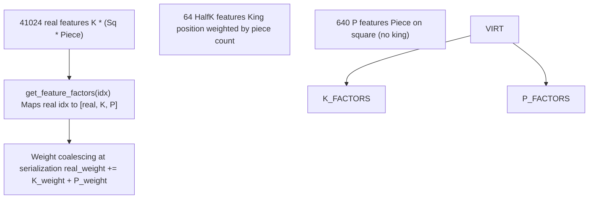
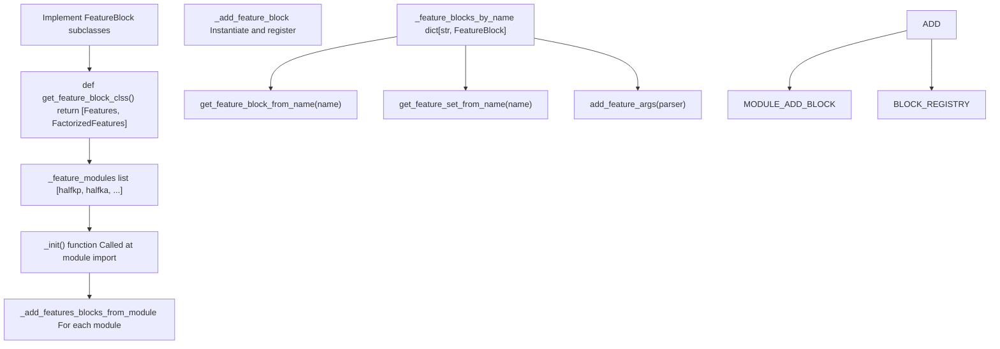
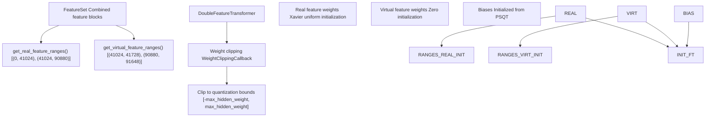

# 扩展特征集 (Extending Feature Sets)

-   [model/callbacks.py](https://github.com/Chesszyh/nnue-pytorch/blob/024b2064/model/callbacks.py)
-   [model/features/\_\_init\_\_.py](https://github.com/Chesszyh/nnue-pytorch/blob/024b2064/model/features/__init__.py)
-   [model/features/feature\_set.py](https://github.com/Chesszyh/nnue-pytorch/blob/024b2064/model/features/feature_set.py)
-   [model/features/full\_threats.py](https://github.com/Chesszyh/nnue-pytorch/blob/024b2064/model/features/full_threats.py)
-   [model/features/halfkp.py](https://github.com/Chesszyh/nnue-pytorch/blob/024b2064/model/features/halfkp.py)
-   [model/modules/layer\_stacks.py](https://github.com/Chesszyh/nnue-pytorch/blob/024b2064/model/modules/layer_stacks.py)
-   [model/quantize.py](https://github.com/Chesszyh/nnue-pytorch/blob/024b2064/model/quantize.py)

本页提供了实现自定义特征块并将其集成到 nnue-pytorch 特征注册系统中的技术指南。特征块是模块化组件，用于为神经网络输入层提取国际象棋局面特征。

关于可用特征集以及如何在训练期间选择它们的一般信息，请参阅 [特征集 (Feature Sets)](#4.2)。关于虚拟特征分解和权重合并的详细信息，请参阅 [虚拟特征与分解 (Virtual Features and Factorization)](#4.6)。

## 特征块接口概览

所有特征块必须继承自 `FeatureBlock` 基类，并实现特定方法以与训练管道集成。基类定义了特征提取、分解和 PSQT 初始化的契约。

### 核心特征块结构


**来源：** [model/features/halfkp.py23-45](https://github.com/Chesszyh/nnue-pytorch/blob/024b2064/model/features/halfkp.py#L23-L45) [model/features/halfkp.py48-96](https://github.com/Chesszyh/nnue-pytorch/blob/024b2064/model/features/halfkp.py#L48-L96) [model/features/full\_threats.py132-144](https://github.com/Chesszyh/nnue-pytorch/blob/024b2064/model/features/full_threats.py#L132-L144) [model/features/full\_threats.py147-176](https://github.com/Chesszyh/nnue-pytorch/blob/024b2064/model/features/full_threats.py#L147-L176)

### 必需的构造函数参数

`FeatureBlock.__init__` 构造函数需要三个参数：

| 参数 | 类型 | 描述 |
| --- | --- | --- |
| `name` | `str` | 特征块的唯一标识符（例如 "HalfKP", "HalfKA^"）|
| `hash` | `int` | 用于版本兼容性检查的 32 位哈希值 |
| `features` | `OrderedDict[str, int]` | 特征组件名称到其维度的映射 |

`features` OrderedDict 定义了真实特征和虚拟特征。真实特征首先出现，然后是虚拟特征。所有值的总和是 `num_features`，而仅第一个条目（在虚拟特征之前）的总和是 `num_real_features`。

**来源：** [model/features/halfkp.py24-27](https://github.com/Chesszyh/nnue-pytorch/blob/024b2064/model/features/halfkp.py#L24-L27) [model/features/halfkp.py50-56](https://github.com/Chesszyh/nnue-pytorch/blob/024b2064/model/features/halfkp.py#L50-L56)

## 实现基本特征块

一个基本的（非分解）特征块只需要实现两个方法：`get_active_features()` 和 `get_initial_psqt_features()`。

### 示例：HalfKP 特征块

```mermaid
flowchart TD
    BOARD["chess.Board"]
    TURN["Side to move (WHITE or BLACK)"]
    KING_SQ["King square board.king(turn)"]
    PIECE_MAP["Piece map board.piece_map()"]
    ORIENT_K["orient(turn, ksq) Flip if black POV"]
    ITER["For each (sq, piece)"]
    SKIP["piece == KING?"]
    NEXT["Skip"]
    CALC_IDX["idx = 1 + orient_sq + p_idx * 64 + orient_k * 641"]
    ORIENT_SQ["orient(turn, sq) Flip if black POV"]
    PIECE_IDX["p_idx = (pt-1)*2 + (color != turn)"]
    INDICES["indices[idx] = 1.0"]
    WHITE_FEAT["White perspective tensor"]
    BLACK_FEAT["Black perspective tensor"]
    RETURN["Return (white, black)"]

    BOARD --> KING_SQ
    BOARD --> PIECE_MAP
    KING --> SQ_ORIENT_K
    PIECE --> MAP_ITER
    ITER --> SKIP
    SKIP --> NEXT
    SKIP --> CALC_IDX
    ITER --> ORIENT_SQ
    ITER --> PIECE_IDX
    ORIENT --> K_CALC_IDX
    ORIENT --> SQ_CALC_IDX
    PIECE --> IDX_CALC_IDX
    CALC --> IDX_INDICES
    INDICES --> WHITE_FEAT
    INDICES --> BLACK_FEAT
    WHITE --> FEAT_RETURN
    BLACK --> FEAT_RETURN
```


**来源：** [model/features/halfkp.py14-21](https://github.com/Chesszyh/nnue-pytorch/blob/024b2064/model/features/halfkp.py#L14-L21) [model/features/halfkp.py29-42](https://github.com/Chesszyh/nnue-pytorch/blob/024b2064/model/features/halfkp.py#L29-L42)

### 实现步骤

1.  **在构造函数中定义特征维度：**

```
NUM_SQ = 64NUM_PT = 10NUM_PLANES = NUM_SQ * NUM_PT + 1class Features(FeatureBlock):    def __init__(self):        super().__init__(            "HalfKP",            0x5D69D5B8,  # Feature hash            OrderedDict([("HalfKP", NUM_PLANES * NUM_SQ)])        )
```
**来源：** [model/features/halfkp.py9-27](https://github.com/Chesszyh/nnue-pytorch/blob/024b2064/model/features/halfkp.py#L9-L27)

2.  **实现 `get_active_features()` 以返回稀疏特征索引：**

该方法接收一个 `chess.Board` 并必须返回两个张量的元组（白方视角，黑方视角）。每个张量都是一个稀疏表示，其中非零值表示活动特征。

```
def get_active_features(self, board: chess.Board) -> tuple[torch.Tensor, torch.Tensor]:    def piece_features(turn):        indices = torch.zeros(NUM_PLANES * NUM_SQ)        for sq, p in board.piece_map().items():            if p.piece_type == chess.KING:                continue            ksq = board.king(turn)            indices[halfkp_idx(turn, orient(turn, ksq), sq, p)] = 1.0        return indices        return (piece_features(chess.WHITE), piece_features(chess.BLACK))
```
**来源：** [model/features/halfkp.py29-42](https://github.com/Chesszyh/nnue-pytorch/blob/024b2064/model/features/halfkp.py#L29-L42)

3.  **为 PSQT 层初始化实现 `get_initial_psqt_features()`：**

此方法返回初始子力-位置价值表值的列表（以 Stockfish 内部单位表示）。对于不支持 PSQT 的简单特征块，引发异常。

```
def get_initial_psqt_features(self):    raise Exception("Not supported yet. See HalfKA")
```
**来源：** [model/features/halfkp.py44-45](https://github.com/Chesszyh/nnue-pytorch/blob/024b2064/model/features/halfkp.py#L44-L45) [model/features/full\_threats.py143-144](https://github.com/Chesszyh/nnue-pytorch/blob/024b2064/model/features/full_threats.py#L143-L144)

对于支持 PSQT 的特征块，计算每个特征索引的材质值。有关完整示例，请参阅 [model/features/full\_threats.py109-129](https://github.com/Chesszyh/nnue-pytorch/blob/024b2064/model/features/full_threats.py#L109-L129)。

## 实现分解特征

分解特征块添加了虚拟特征，将真实特征分解为因子，从而通过参数共享实现更快的早期阶段训练。分解变体通常包装基本特征块。

### 分解架构


**来源：** [model/features/halfkp.py48-96](https://github.com/Chesszyh/nnue-pytorch/blob/024b2064/model/features/halfkp.py#L48-L96) [model/features/feature\_set.py88-100](https://github.com/Chesszyh/nnue-pytorch/blob/024b2064/model/features/feature_set.py#L88-L100)

### 实现模式

1.  **使用虚拟特征扩展特征字典：**

```
class FactorizedFeatures(FeatureBlock):    def __init__(self):        super().__init__(            "HalfKP^",  # ^ suffix indicates factorization            0x5D69D5B8,  # Same hash as base            OrderedDict([                ("HalfKP", NUM_PLANES * NUM_SQ),  # Real features                ("HalfK", NUM_SQ),                # Virtual: King position                ("P", NUM_SQ * 10)                # Virtual: Piece on square            ])        )        self.base = Features()  # Wrap base implementation
```
**来源：** [model/features/halfkp.py48-57](https://github.com/Chesszyh/nnue-pytorch/blob/024b2064/model/features/halfkp.py#L48-L57)

2.  **扩展 `get_active_features()` 以包含虚拟特征：**

虚拟特征附加到基本特征张量。对于 HalfKP 分解：

-   HalfK 特征：按总棋子数加权的王格
-   P 特征：格子上的棋子（独立于王）

```
def get_active_features(self, board: chess.Board) -> tuple[torch.Tensor, torch.Tensor]:    white, black = self.base.get_active_features(board)        def piece_features(base, color):        indices = torch.zeros(NUM_SQ * 11)        piece_count = 0                # P features: piece on square        for sq, p in board.piece_map().items():            if p.piece_type == chess.KING:                continue            piece_count += 1            p_idx = (p.piece_type - 1) * 2 + (p.color != color)            indices[(p_idx + 1) * NUM_SQ + orient(color, sq)] = 1.0                # HalfK feature: king square weighted by piece count        ksq = board.king(color)        indices[orient(color, ksq)] = piece_count                return torch.cat((base, indices))        return (piece_features(white, chess.WHITE), piece_features(black, chess.BLACK))
```
**来源：** [model/features/halfkp.py59-80](https://github.com/Chesszyh/nnue-pytorch/blob/024b2064/model/features/halfkp.py#L59-L80)

3.  **实现 `get_feature_factors()` 以进行权重合并：**

此方法将每个真实特征索引映射到其分解：一个包含真实特征索引以及它分解成的所有虚拟特征索引的列表。

```
def get_feature_factors(self, idx: int) -> list[int]:    if idx >= self.num_real_features:        raise Exception("Feature must be real")        k_idx = idx // NUM_PLANES    p_idx = idx % NUM_PLANES - 1        return [        idx,                                         # Real feature        self.get_factor_base_feature("HalfK") + k_idx,  # King factor        self.get_factor_base_feature("P") + p_idx       # Piece factor    ]
```
**来源：** [model/features/halfkp.py82-93](https://github.com/Chesszyh/nnue-pytorch/blob/024b2064/model/features/halfkp.py#L82-L93)

`get_factor_base_feature(name)` 方法返回全局特征空间中命名的虚拟特征组件的起始索引。

### 高级分解：Full\_Threats

`Full_Threats^` 特征块演示了条件分解，其中只有某些真实特征分解：

```
def get_feature_factors(self, idx: int) -> list[int]:    if idx >= self.num_real_features:        raise Exception("Feature must be real")        # Threat features (idx < 79856) don't factorize    if idx < 79856:        return [idx]        # HalfKA features factorize into real + virtual A    a_idx = (idx - 79856) % NUM_PLANES_REAL    k_idx = (idx - 79856) // NUM_PLANES_REAL        # Special case: adjust for enemy king position    if a_idx // NUM_SQ == 10 and k_idx != KingBuckets[a_idx % NUM_SQ]:        a_idx += NUM_SQ        return [idx, self.get_factor_base_feature("A") + a_idx]
```
**来源：** [model/features/full\_threats.py160-172](https://github.com/Chesszyh/nnue-pytorch/blob/024b2064/model/features/full_threats.py#L160-L172)

## 特征注册集成

特征注册系统会自动发现并注册在 `model/features/` 下的模块中定义的特征块。

### 注册流程


**来源：** [model/features/\_\_init\_\_.py67-72](https://github.com/Chesszyh/nnue-pytorch/blob/024b2064/model/features/__init__.py#L67-L72) [model/features/\_\_init\_\_.py27-35](https://github.com/Chesszyh/nnue-pytorch/blob/024b2064/model/features/__init__.py#L27-L35)

### 集成步骤

1.  **在 `model/features/` 中创建一个新的 Python 模块：**

创建一个类似 `model/features/my_feature.py` 的文件，其中包含您的特征块实现。

2.  **实现发现函数：**

每个特征模块必须导出一个 `get_feature_block_clss()` 函数，该函数返回特征块类的列表：

```
def get_feature_block_clss() -> list[type[FeatureBlock]]:    return [Features, FactorizedFeatures]
```
**来源：** [model/features/halfkp.py104-105](https://github.com/Chesszyh/nnue-pytorch/blob/024b2064/model/features/halfkp.py#L104-L105) [model/features/full\_threats.py183-184](https://github.com/Chesszyh/nnue-pytorch/blob/024b2064/model/features/full_threats.py#L183-L184)

3.  **在 `model/features/__init__.py` 中注册模块：**

将您的模块添加到 `_feature_modules` 列表中：

```
from . import halfkp, halfka, halfka_v2, halfka_v2_hm, full_threats, my_feature_feature_modules: list[types.ModuleType] = [    halfkp,    halfka,    halfka_v2,    halfka_v2_hm,    full_threats,    my_feature,  # Add your module here]
```
**来源：** [model/features/\_\_init\_\_.py14-22](https://github.com/Chesszyh/nnue-pytorch/blob/024b2064/model/features/__init__.py#L14-L22)

4.  **通过命令行参数使用您的特征块：**

```
# Basic feature blockpython train.py --features MyFeature# Factorized feature blockpython train.py --features MyFeature^# Combined with other blockspython train.py --features MyFeature^+HalfKA^
```
`+` 运算符将多个特征块组合成一个 `FeatureSet`。`^` 后缀选择分解的变体。

**来源：** [model/features/\_\_init\_\_.py46-64](https://github.com/Chesszyh/nnue-pytorch/blob/024b2064/model/features/__init__.py#L46-L64)

## 特征初始化和量化

特征变换器需要仔细初始化以在训练期间保持与量化的兼容性。

### 权重初始化区域


**来源：** [model/features/feature\_set.py38-63](https://github.com/Chesszyh/nnue-pytorch/blob/024b2064/model/features/feature_set.py#L38-L63) [model/callbacks.py6-18](https://github.com/Chesszyh/nnue-pytorch/blob/024b2064/model/callbacks.py#L6-L18) [model/quantize.py40-60](https://github.com/Chesszyh/nnue-pytorch/blob/024b2064/model/quantize.py#L40-L60)

### PSQT 初始化

`get_initial_psqt_features()` 方法提供用于初始化特征变换器偏置的子力-位置价值表值。这些值通常是以 Stockfish 内部单位表示的材质值：

| 棋子类型 | Stockfish 值 |
| --- | --- |
| 兵 | 126 |
| 马 | 781 |
| 象 | 825 |
| 车 | 1276 |
| 后 | 2538 |

对于每个代表“从视角 Z 的 Y 格子上的棋子 X”的特征索引，分配材质值（自己棋子为正，对手棋子为负）。

**来源：** [model/features/full\_threats.py109-129](https://github.com/Chesszyh/nnue-pytorch/blob/024b2064/model/features/full_threats.py#L109-L129)

### 量化界限

在训练期间，权重必须保持在兼容量化的范围内。`QuantizationManager` 根据量化方案计算这些界限：

| 层 | 权重类型 | 缩放因子 | 最大权重 |
| --- | --- | --- | --- |
| 特征变换器 | `int16` | `ft_quantized_one = 255` | `255.0` |
| 层堆栈 L1 | `int8` | `weight_scale_hidden = 64` | `127/64 ≈ 1.984` |
| 层堆栈 L2+ | `int8` | `weight_scale_hidden = 64` | `127/64 ≈ 1.984` |
| 输出层 | `int8` | `weight_scale_out = 16` | 根据分数刻度计算 |

`WeightClippingCallback` 在每个训练批次执行这些界限。

**来源：** [model/quantize.py17-39](https://github.com/Chesszyh/nnue-pytorch/blob/024b2064/model/quantize.py#L17-L39) [model/callbacks.py6-17](https://github.com/Chesszyh/nnue-pytorch/blob/024b2064/model/callbacks.py#L6-L17)

## 测试您的特征块

### 单元测试清单

在训练中使用新特征块之前，请验证：

1.  **特征计数一致性：**

    -   `num_features = num_real_features + num_virtual_features`
    -   特征字典总和与 `num_features` 匹配
2.  **活动特征正确性：**

    -   在已知棋盘位置上测试 `get_active_features()`
    -   验证白方和黑方视角差异正确
    -   检查稀疏索引是否在 `[0, num_features)` 范围内
3.  **分解正确性（对于分解块）：**

    -   所有真实特征都有有效的分解
    -   `get_feature_factors(idx)` 返回 `[idx] + virtual_factors`
    -   虚拟因子索引在正确范围内
4.  **PSQT 初始化：**

    -   `get_initial_psqt_features()` 长度与 `num_features` 匹配
    -   材质值具有正确的符号（自己为正，对手为负）

### 示例测试模式

```
def test_my_feature_block():    feature_block = MyFeatureBlock()        # Test feature counts    assert feature_block.num_features > 0    assert feature_block.num_real_features <= feature_block.num_features        # Test on starting position    board = chess.Board()    white_features, black_features = feature_block.get_active_features(board)        assert white_features.shape[0] == feature_block.num_features    assert black_features.shape[0] == feature_block.num_features        # Verify sparse representation    assert torch.all(white_features >= 0)    assert torch.all(black_features >= 0)
```
### 使用数据加载器进行集成测试

使用 C++ 数据加载器测试您的特征块以确保兼容性：

```
# Create a small training dataset# Test data loading with your featurepython train.py --features MyFeature^ --max-epochs 1 --num-workers 1
```
监控：

-   数据加载器初始化错误
-   特征索引越界错误
-   特征变换器中意外的张量形状

**来源：** [model/features/feature\_set.py65-86](https://github.com/Chesszyh/nnue-pytorch/blob/024b2064/model/features/feature_set.py#L65-L86)

## 高级注意事项

### 性能优化

对于在实际训练中使用的特征（不仅是评估），实现高效的索引计算：

1.  **预计算查找表：** 用于复杂的方向或棋子类型映射
2.  **使用整数运算：** 在索引计算中避免浮点运算
3.  **最小化分支：** 使用算术技巧代替 if/else 链

**来源：** [model/features/halfkp.py14-21](https://github.com/Chesszyh/nnue-pytorch/blob/024b2064/model/features/halfkp.py#L14-L21)

### C++ 数据加载器支持

需要复杂棋盘分析的特征（如 `Full_Threats` 中的威胁图）应将活动特征提取委托给 C++ 数据加载器以获得性能：

```
def get_active_features(self, board: chess.Board):    raise Exception(        "Not supported yet, you must use the c++ data loader for support during training"    )
```
C++ 实现位于 [lib/training\_data\_loader.cpp](https://github.com/Chesszyh/nnue-pytorch/blob/024b2064/lib/training_data_loader.cpp) 中，带有相应的特征提取逻辑。

**来源：** [model/features/full\_threats.py138-141](https://github.com/Chesszyh/nnue-pytorch/blob/024b2064/model/features/full_threats.py#L138-L141) [model/features/full\_threats.py155-158](https://github.com/Chesszyh/nnue-pytorch/blob/024b2064/model/features/full_threats.py#L155-L158)

### 特征块组合

可以使用 `+` 运算符组合特征块以创建复合特征集：

```
# Combined feature setfeature_set = get_feature_set_from_name("HalfKP^+MyFeature")
```
`FeatureSet` 类将特征索引与适当的偏移量连接起来，确保每个块具有唯一的索引空间。

**来源：** [model/features/feature\_set.py15-36](https://github.com/Chesszyh/nnue-pytorch/blob/024b2064/model/features/feature_set.py#L15-L36) [model/features/\_\_init\_\_.py46-49](https://github.com/Chesszyh/nnue-pytorch/blob/024b2064/model/features/__init__.py#L46-L49)

### 特定于桶的特征

对于高级架构，特征可以是特定于桶的（依赖于王的位置）。`Full_Threats` 实现通过 `KingBuckets` 映射演示了这一点：

```
KingBuckets = [  -1, -1, -1, -1, 31, 30, 29, 28,  -1, -1, -1, -1, 27, 26, 25, 24,  # ... 32 unique bucket positions]
```
这将王所在的格子映射到桶索引，允许针对不同王的位置使用不同的特征子空间。

**来源：** [model/features/full\_threats.py77-86](https://github.com/Chesszyh/nnue-pytorch/blob/024b2064/model/features/full_threats.py#L77-L86) [model/features/full\_threats.py96-106](https://github.com/Chesszyh/nnue-pytorch/blob/024b2064/model/features/full_threats.py#L96-L106)

---

**关键要点：**

-   继承自 `FeatureBlock` 并实现必需的方法
-   使用分解（`^` 后缀）通过虚拟特征加速早期训练
-   在 `model/features/__init__.py` 中注册新模块
-   确保 PSQT 初始化和量化兼容性
-   在生产训练运行之前进行彻底测试
-   对于计算密集型特征，考虑 C++ 实现
