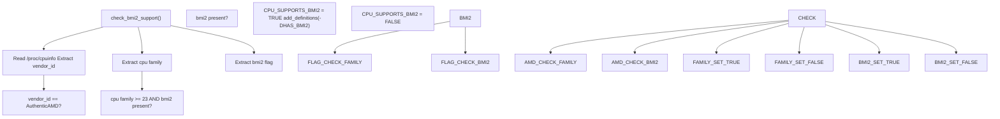
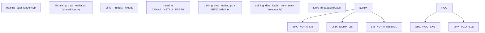

# 参考资料 (Reference)

-   [.gitignore](https://github.com/Chesszyh/nnue-pytorch/blob/024b2064/.gitignore)
-   [.pgo/small.binpack](https://github.com/Chesszyh/nnue-pytorch/blob/024b2064/.pgo/small.binpack)
-   [CMakeLists.txt](https://github.com/Chesszyh/nnue-pytorch/blob/024b2064/CMakeLists.txt)
-   [compile\_data\_loader.bat](https://github.com/Chesszyh/nnue-pytorch/blob/024b2064/compile_data_loader.bat)
-   [requirements.txt](https://github.com/Chesszyh/nnue-pytorch/blob/024b2064/requirements.txt)
-   [setup\_script.sh](https://github.com/Chesszyh/nnue-pytorch/blob/024b2064/setup_script.sh)

本页为使用 nnue-pytorch 代码库的开发人员和研究人员提供快速参考信息。它涵盖了构建系统、依赖结构和训练基础设施的主要入口点。

关于特定主题的详细文档：

-   构建系统配置和编译器标志：请参阅 [构建系统 (CMake) (Build System (CMake))](#9.1)
-   Python 包依赖和版本要求：请参阅 [依赖与要求 (Dependencies and Requirements)](#9.2)
-   训练和评估脚本的命令行参数：请参阅 [命令行参考 (Command-Line Reference)](#9.3)

关于训练管道、数据加载和模型结构的架构细节，请分别参考第 [2](#2)、[3](#3) 和 [4](#4) 节。

## 系统组件概览

nnue-pytorch 仓库包含基于 Python 的训练代码和高性能 C++ 数据加载器。下表总结了主要系统组件：

| 组件 | 实现 | 目的 | 关键文件 |
| --- | --- | --- | --- |
| 训练脚本 | Python/PyTorch Lightning | 模型训练编排 | `train.py`, `easy_train.py` |
| 数据加载器 | C++20 (共享库) | 高性能训练数据解析 | `training_data_loader.cpp` |
| 模型定义 | Python/PyTorch | NNUE 网络架构 | `model/model.py`, `model/nnue.py` |
| 序列化 | Python | 将检查点转换为 .nnue 格式 | `serialize.py` |
| 评估 | Python + 外部工具 | 运行对弈并计算 ELO | `run_games.py`, `do_plots.py` |
| 构建系统 | CMake 3.10+ | 编译带有优化的 C++ 数据加载器 | `CMakeLists.txt` |

**来源：** [CMakeLists.txt1-82](https://github.com/Chesszyh/nnue-pytorch/blob/024b2064/CMakeLists.txt#L1-L82) [requirements.txt1-10](https://github.com/Chesszyh/nnue-pytorch/blob/024b2064/requirements.txt#L1-L10)

## 构建流程

下图显示了从源代码到可部署工件的完整构建管道，包括两阶段 PGO（配置文件引导优化）构建过程：

```mermaid
flowchart TD
    CPP["training_data_loader.cpp (C++20 source)"]
    CMAKE["CMakeLists.txt (Build configuration)"]
    PGO_GEN_CONFIG["cmake -DCMAKE_BUILD_TYPE=PGO_Generate"]
    PGO_GEN_BUILD["build-pgo-generate/ training_data_loader_benchmark"]
    PGO_RUN["Run benchmark on .pgo/small.binpack"]
    PGO_DATA["pgo_data/ (Profile data .gcda files)"]
    PGO_USE_CONFIG["cmake -DCMAKE_BUILD_TYPE=PGO_Use -DPGO_PROFILE_DATA_DIR=..."]
    PGO_USE_BUILD["build/ libtraining_data_loader.so"]
    INSTALL["install to ./ (CMAKE_INSTALL_PREFIX)"]
    STD_CONFIG["cmake -DCMAKE_BUILD_TYPE=RelWithDebInfo"]
    STD_BUILD["build/ libtraining_data_loader.so"]
    CTYPES["data_loader/_native.py (ctypes interface)"]
    TRAINING["train.py / easy_train.py (Load shared library)"]

    CPP --> PGO_GEN_CONFIG
    CMAKE --> PGO_GEN_CONFIG
    PGO --> GEN_CONFIG_PGO_GEN_BUILD
    PGO --> GEN_BUILD_PGO_RUN
    PGO --> RUN_PGO_DATA
    PGO --> DATA_PGO_USE_CONFIG
    CPP --> PGO_USE_CONFIG
    CMAKE --> PGO_USE_CONFIG
    PGO --> USE_CONFIG_PGO_USE_BUILD
    PGO --> USE_BUILD_INSTALL
    CPP --> STD_CONFIG
    CMAKE --> STD_CONFIG
    STD --> CONFIG_STD_BUILD
    INSTALL --> CTYPES
    STD --> BUILD_CTYPES
    CTYPES --> TRAINING
```


**来源：** [CMakeLists.txt1-82](https://github.com/Chesszyh/nnue-pytorch/blob/024b2064/CMakeLists.txt#L1-L82) [compile\_data\_loader.bat1-12](https://github.com/Chesszyh/nnue-pytorch/blob/024b2064/compile_data_loader.bat#L1-L12) [setup\_script.sh1-5](https://github.com/Chesszyh/nnue-pytorch/blob/024b2064/setup_script.sh#L1-L5)

## 构建系统架构

CMake 配置实现了几个用于性能优化的高级功能：

### 构建类型和编译器标志

构建系统支持四种构建配置：

| 构建类型 | CMake 标志 | 编译器标志 | 链接器标志 | 目的 |
| --- | --- | --- | --- | --- |
| Debug | `-DCMAKE_BUILD_TYPE=Debug` | `-g` | (无) | 带有调试符号的开发 |
| Release | `-DCMAKE_BUILD_TYPE=Release` | `-O3 -march=native -DNDEBUG` | (无) | 优化的生产构建 |
| RelWithDebInfo | `-DCMAKE_BUILD_TYPE=RelWithDebInfo` | `-g -O3 -march=native -DNDEBUG` | (无) | 带有调试符号的优化（默认）|
| PGO\_Generate | `-DCMAKE_BUILD_TYPE=PGO_Generate` | `-O3 -march=native -DNDEBUG -DPGO_BUILD -fprofile-generate` | `-fprofile-generate` | PGO 构建的第一阶段 |
| PGO\_Use | `-DCMAKE_BUILD_TYPE=PGO_USE` | `-g -O3 -march=native -DNDEBUG -fprofile-use -fprofile-correction` | (无) | PGO 构建的第二阶段 |

**来源：** [CMakeLists.txt5-18](https://github.com/Chesszyh/nnue-pytorch/blob/024b2064/CMakeLists.txt#L5-L18)

### CPU 特性检测

构建系统自动检测 BMI2 (位操作指令集 2) 支持：


AMD Zen/Zen+ CPU (family < 23) 具有缓慢的 BMI2 实现，因此构建系统仅在 `cpu_family >= 23` (Zen 2 及更高版本) 时在 AMD 上启用 BMI2。对于 Intel 和其他供应商，如果 CPU 宣称支持，则启用 BMI2。

**来源：** [CMakeLists.txt24-60](https://github.com/Chesszyh/nnue-pytorch/blob/024b2064/CMakeLists.txt#L24-L60)

### 构建目标

构建系统根据构建类型生成不同的目标：


**来源：** [CMakeLists.txt64-81](https://github.com/Chesszyh/nnue-pytorch/blob/024b2064/CMakeLists.txt#L64-L81)

## 依赖结构

该项目有两组不同的依赖项：Python 运行时依赖项和构建时系统依赖项。

### Python 依赖项

下表列出了 `requirements.txt` 中的所有 Python 包依赖项：

| 包 | 版本约束 | 目的 | 使用者 |
| --- | --- | --- | --- |
| `psutil` | (任意) | 系统资源监控 | `easy_train.py` TUI 仪表板 |
| `asciimatics` | (任意) | 终端 UI 框架 | `easy_train.py` 仪表板渲染 |
| `GPUtil` | (任意) | GPU 监控 | `easy_train.py` GPU 利用率显示 |
| `python-chess` | `==0.31.4` | 国际象棋局面处理 | `serialize.py`, 特征提取 |
| `matplotlib` | (任意) | 绘图和可视化 | `do_plots.py`, `visualize.py` |
| `tensorboard` | (任意) | 训练指标记录 | `train.py`, PyTorch Lightning 集成 |
| `numba` | (任意) | 特征代码的 JIT 编译 | `model/features/*.py` |
| `numpy` | `<2.0` | 数组操作 | 贯穿整个代码库 |
| `requests` | (任意) | 用于下载依赖项的 HTTP 客户端 | `easy_train.py` 依赖管理 |
| `lightning` | (任意) | PyTorch Lightning 框架 | `train.py`, `model/lightning_module.py` |

注意：`requirements.txt` 中未列出 PyTorch 本身，因为它需要特定于平台的安装（CPU 与 CUDA 版本）。请参阅 [依赖与要求 (Dependencies and Requirements)](#9.2) 了解安装说明。

**来源：** [requirements.txt1-10](https://github.com/Chesszyh/nnue-pytorch/blob/024b2064/requirements.txt#L1-L10)

### 构建依赖项

C++ 数据加载器需要：

| 依赖 | 最低版本 | 目的 |
| --- | --- | --- |
| CMake | 3.10 | 构建系统生成器 |
| C++ 编译器 | C++20 支持 | GCC 10+, Clang 10+, 或 MSVC 2019+ |
| pthreads | (系统) | 线程支持（通过 `find_package(Threads)` 检测）|

**来源：** [CMakeLists.txt1-62](https://github.com/Chesszyh/nnue-pytorch/blob/024b2064/CMakeLists.txt#L1-L62)

## 主要入口点

下图将面向用户的命令映射到它们的实现文件和关键函数：

```mermaid
flowchart TD
    VIS_CMD["python visualize.py net.nnue"]
    VIS_MAIN["visualize.py::main() → NNUEReader.read() → matplotlib histograms"]
    FTPERM_CMD["python ftperm.py model.pt"]
    FTPERM_MAIN["ftperm.py::main() → find_perm_impl() → apply permutation"]
    GAMES_CMD["python run_games.py experiment_path"]
    GAMES_MAIN["run_games.py::main() → run_match() → c-chess-cli subprocess"]
    PLOTS_CMD["python do_plots.py experiment_path"]
    PLOTS_MAIN["do_plots.py::main() → parse ordo.out → matplotlib plots"]
    SERIALIZE_CMD["python serialize.py model.ckpt --output-file"]
    SERIALIZE_MAIN["serialize.py::main() → NNUE.load_from_checkpoint() → NNUEWriter.write()"]
    TRAIN_CMD["python train.py --features --lambda --epochs"]
    TRAIN_MAIN["train.py::main() → create_model() → pl.Trainer.fit()"]
    EASY_CMD["python easy_train.py --experiment_path --runs"]
    EASY_MAIN["easy_train.py::main() → TrainingRun threads → NetworkTesting thread"]

    VIS --> CMD_VIS_MAIN
    FTPERM --> CMD_FTPERM_MAIN
    GAMES --> CMD_GAMES_MAIN
    PLOTS --> CMD_PLOTS_MAIN
    SERIALIZE --> CMD_SERIALIZE_MAIN
    TRAIN --> CMD_TRAIN_MAIN
    EASY --> CMD_EASY_MAIN
```


**来源：** 从仓库结构和标准使用模式推断。

## 文件组织

仓库遵循带有 C++ 扩展的标准 Python 项目结构：

```
nnue-pytorch/
├── CMakeLists.txt                    # Build configuration for C++ data loader
├── requirements.txt                  # Python dependencies
├── compile_data_loader.bat           # PGO build script (Linux/Mac)
├── setup_script.sh                   # Docker entrypoint script
├── train.py                          # Main training script
├── easy_train.py                     # Multi-GPU training orchestrator
├── serialize.py                      # Checkpoint → .nnue converter
├── run_games.py                      # Automated game playing
├── do_plots.py                       # Training visualization
├── ftperm.py                         # FT weight permutation optimizer
├── visualize.py                      # Network weight visualization
├── training_data_loader.cpp          # C++ data loader implementation
├── model/
│   ├── model.py                      # NNUEModel definition
│   ├── nnue.py                       # NNUE Lightning module
│   ├── lightning_module.py           # Training/validation logic
│   ├── feature_transformer.py        # Sparse feature transformer
│   ├── quantization.py               # Quantization utilities
│   ├── features/                     # Feature set definitions
│   └── nnue_bin_dataset.py          # (Legacy) Python data loader
├── data_loader/
│   ├── _native.py                    # ctypes interface to C++ loader
│   ├── stream.py                     # Stream/provider abstractions
│   └── dataset.py                    # PyTorch Dataset wrappers
├── ranger21.py                       # Ranger21 optimizer
├── docs/
│   └── nnue.md                       # Architecture documentation
├── Dockerfile.AMD                    # Docker configuration (AMD)
├── Dockerfile.NVIDIA                 # Docker configuration (NVIDIA)
└── run_docker.sh                     # Docker launcher script
```
**来源：** [.gitignore1-8](https://github.com/Chesszyh/nnue-pytorch/blob/024b2064/.gitignore#L1-L8) (显示要排除的生成文件)

## 快速参考：常见工作流

### 构建数据加载器

标准构建（推荐给大多数用户）：

```
cmake -S . -B build -DCMAKE_BUILD_TYPE=RelWithDebInfo -DCMAKE_INSTALL_PREFIX="./"cmake --build ./build --config RelWithDebInfo --target install
```
PGO 优化构建（快 5-10%，构建时间更长）：

```
./compile_data_loader.bat
```
**来源：** [CMakeLists.txt1-82](https://github.com/Chesszyh/nnue-pytorch/blob/024b2064/CMakeLists.txt#L1-L82) [compile\_data\_loader.bat1-12](https://github.com/Chesszyh/nnue-pytorch/blob/024b2064/compile_data_loader.bat#L1-L12)

### 安装 Python 依赖项

```
pip install -r requirements.txtpip install torch torchvision torchaudio  # Platform-specific
```
注意：PyTorch 安装取决于您是否有 CUDA 以及哪个版本。有关详细信息，请参阅 [依赖与要求 (Dependencies and Requirements)](#9.2)。

**来源：** [requirements.txt1-10](https://github.com/Chesszyh/nnue-pytorch/blob/024b2064/requirements.txt#L1-L10)

### 环境变量

以下环境变量影响构建和运行时行为：

| 变量 | 默认值 | 目的 |
| --- | --- | --- |
| `CMAKE_BUILD_TYPE` | `RelWithDebInfo` | 构建配置 (Debug/Release/RelWithDebInfo/PGO\_Generate/PGO\_Use) |
| `CMAKE_INSTALL_PREFIX` | `/usr/local` | `libtraining_data_loader.so` 的安装目录 |
| `PGO_PROFILE_DATA_DIR` | `${CMAKE_BINARY_DIR}/pgo_data` | PGO 配置文件数据 (.gcda 文件) 的目录 |

**来源：** [CMakeLists.txt5-18](https://github.com/Chesszyh/nnue-pytorch/blob/024b2064/CMakeLists.txt#L5-L18)

## 版本控制与兼容性

### C++ 标准

数据加载器需要 **C++20** 支持。这在 [CMakeLists.txt19-20](https://github.com/Chesszyh/nnue-pytorch/blob/024b2064/CMakeLists.txt#L19-L20) 中强制执行：

```
set(CMAKE_CXX_STANDARD 20)set(CMAKE_CXX_STANDARD_REQUIRED 20)
```
### Python 版本

由于 Lightning 框架的要求，隐式需要 Python 3.8+。为了兼容性，NumPy 在 [requirements.txt8](https://github.com/Chesszyh/nnue-pytorch/blob/024b2064/requirements.txt#L8-L8) 限制为 `<2.0`。

### NNUE 二进制格式

序列化的 `.nnue` 文件格式版本在模型本身中定义。有关版本兼容性信息，请参阅 [NNUE 二进制格式 (NNUE Binary Format)](#5.2)。

**来源：** [CMakeLists.txt19-20](https://github.com/Chesszyh/nnue-pytorch/blob/024b2064/CMakeLists.txt#L19-L20) [requirements.txt8](https://github.com/Chesszyh/nnue-pytorch/blob/024b2064/requirements.txt#L8-L8)
