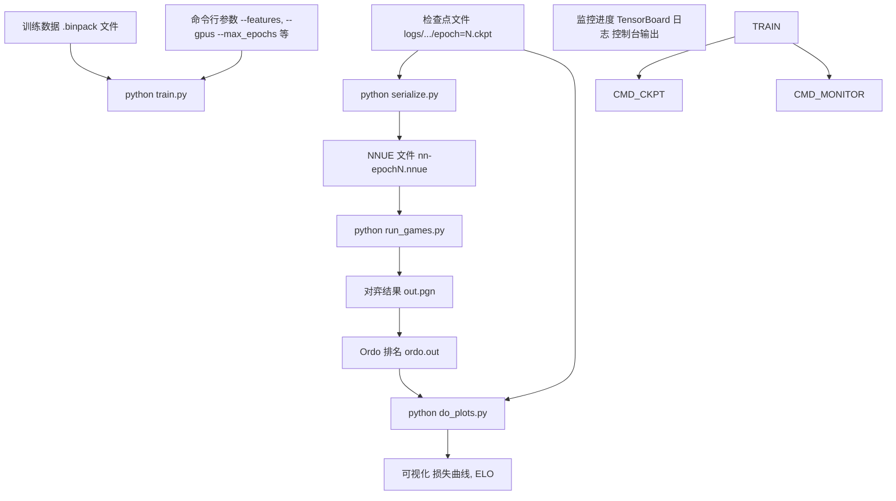
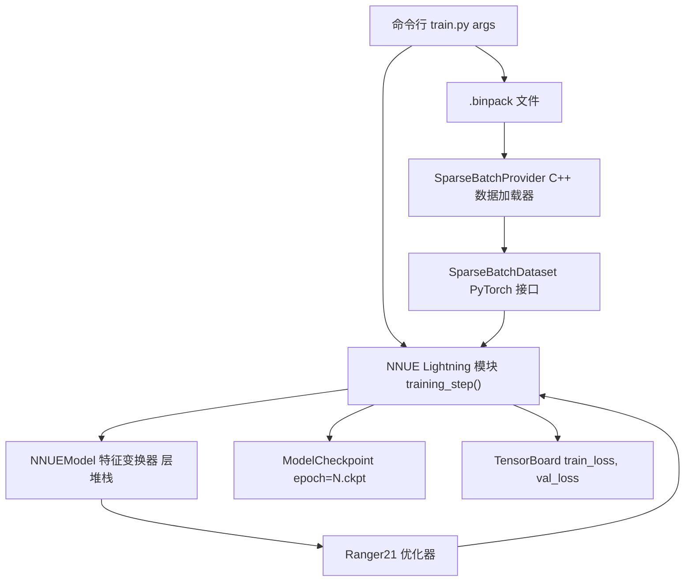
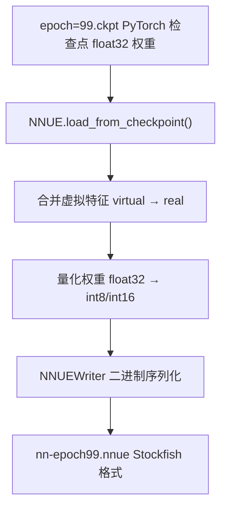
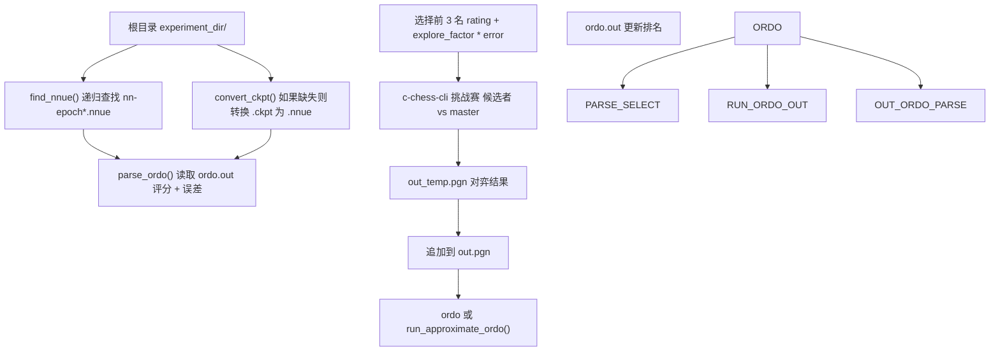
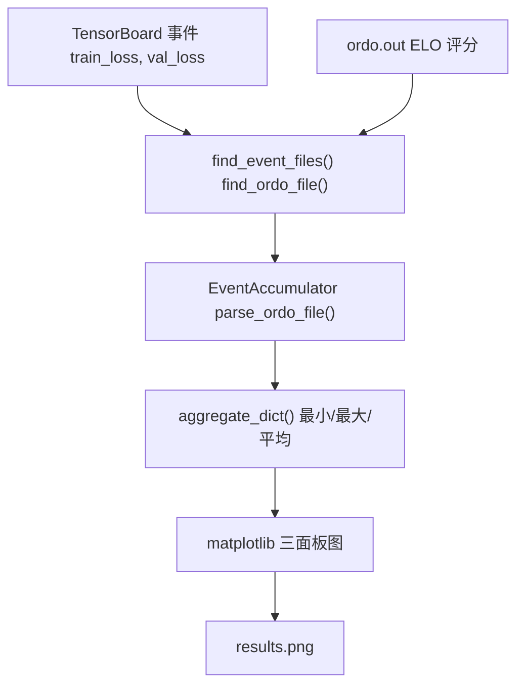

# 快速入门教程

-   [delete_bad_nets.py](https://github.com/Chesszyh/nnue-pytorch/blob/024b2064/delete_bad_nets.py)
-   [do_plots.py](https://github.com/Chesszyh/nnue-pytorch/blob/024b2064/do_plots.py)
-   [run_games.py](https://github.com/Chesszyh/nnue-pytorch/blob/024b2064/run_games.py)
-   [scripts/easy_train.py](https://github.com/Chesszyh/nnue-pytorch/blob/024b2064/scripts/easy_train.py)
-   [scripts/easy_train_example.bat](https://github.com/Chesszyh/nnue-pytorch/blob/024b2064/scripts/easy_train_example.bat)
-   [scripts/easy_train_example.sh](https://github.com/Chesszyh/nnue-pytorch/blob/024b2064/scripts/easy_train_example.sh)
-   [train.py](https://github.com/Chesszyh/nnue-pytorch/blob/024b2064/train.py)

本页面提供了一个逐步指南，用于训练您的第一个 NNUE 国际象棋评估网络，从准备训练数据到通过国际象棋对弈评估训练好的模型。在本教程结束时，您将训练出一个基础网络，将其转换为 Stockfish 兼容的格式，并评估其棋力。

**范围**：本教程涵盖单次训练运行的最小工作流。有关环境设置，请参阅 [环境设置](#1.2)。有关带有自动评估的高级多 GPU 编排，请参阅 [高级编排 (easy_train.py)](#2.2)。有关详细的训练配置选项，请参阅 [基础训练 (train.py)](#2.1)。

## 先决条件

开始之前，请确保您已完成 [1.2 页](#1.2) 中的环境设置：

-   安装了带有 PyTorch, Lightning 和必需依赖项的 Python 3.7+
-   用于构建数据加载器的 C++ 工具链 (CMake 3.4+, GCC 9.2+, Make 3+)
-   `.bin` 或 `.binpack` 格式的训练数据
-   (可选) Stockfish, c-chess-cli 和 ordo 用于评估

## 训练工作流概览


**快速入门工作流**：准备训练数据 → 运行 `train.py` → 监控检查点 → 序列化为 `.nnue` → 通过对弈评估 → 可视化结果。

来源：[train.py1-550](https://github.com/Chesszyh/nnue-pytorch/blob/024b2064/train.py#L1-L550) [run_games.py1-606](https://github.com/Chesszyh/nnue-pytorch/blob/024b2064/run_games.py#L1-L606) [do_plots.py1-267](https://github.com/Chesszyh/nnue-pytorch/blob/024b2064/do_plots.py#L1-L267)

## 步骤 1：准备训练数据

训练数据必须是包含局面评估和游戏结果的 `.bin` 或 `.binpack` 格式。这些文件通常由专门的数据生成工具生成（本教程不涵盖）。

**验证您的数据文件是否存在：**

```
ls -lh /path/to/training_data.binpack
```
**数据格式**：每个条目包含局面特征、评估分数和游戏结果（胜/平/负）。[training_data_loader.cpp](https://github.com/Chesszyh/nnue-pytorch/blob/024b2064/training_data_loader.cpp) 中的 C++ 数据加载器可高效解析这些格式。

来源：[train.py386-392](https://github.com/Chesszyh/nnue-pytorch/blob/024b2064/train.py#L386-L392)

## 步骤 2：开始基础训练

最简单的训练命令使用 [train.py](https://github.com/Chesszyh/nnue-pytorch/blob/024b2064/train.py) 并带有最少的参数：

```
python train.py \
    /path/to/training_data.binpack \
    --features=HalfKAv2_hm^ \
    --gpus=0 \
    --max_epochs=100
```
### 必要的命令行参数

| 参数 | 目的 | 默认值 | 示例 |
| --- | --- | --- | --- |
| `datasets` | 训练数据文件（位置参数） | 必须 | `data.binpack` |
| `--features` | 要使用的特征集 | 必须 | `HalfKAv2_hm^` |
| `--gpus` | GPU 设备（逗号分隔） | 所有可用 | `0,1` |
| `--max_epochs` | 训练 epoch 数量 | 800 | `100` |
| `--batch-size` | 每批次局面数 | 16384 (GPU) | `8192` |
| `--default_root_dir` | 日志/检查点输出目录 | `logs/` | `./experiment_1` |

来源：[train.py108-376](https://github.com/Chesszyh/nnue-pytorch/blob/024b2064/train.py#L108-L376)

### 训练系统组件


**训练流水线**：命令行参数配置 `NNUE` Lightning 模块，该模块通过 `SparseBatchDataset` 编排数据加载，通过 `NNUEModel` 进行前向/反向传播，并使用 `Ranger21` 进行优化器更新。检查点由 `ModelCheckpoint` 回调保存。

来源：[train.py44-89](https://github.com/Chesszyh/nnue-pytorch/blob/024b2064/train.py#L44-L89) [train.py428-438](https://github.com/Chesszyh/nnue-pytorch/blob/024b2064/train.py#L428-L438) [train.py496-543](https://github.com/Chesszyh/nnue-pytorch/blob/024b2064/train.py#L496-L543)

### 特征集选择

`--features` 参数决定输入特征表示。常见选择：

| 特征集 | 描述 | 特征数量 | 最适合 |
| --- | --- | --- | --- |
| `HalfKAv2_hm^` | 王+棋子 带历史（因子化） | ~45K 真实 | 默认，均衡 |
| `HalfKP` | 王+棋子（经典） | 41K | 简单，快速 |
| `HalfKAv2^` | 王+所有棋子（因子化） | ~45K 真实 | 良好的准确性 |

`^` 后缀表示因子化特征，带有可加速训练的虚拟特征。

来源：[train.py409](https://github.com/Chesszyh/nnue-pytorch/blob/024b2064/train.py#L409-L409) [train.py457-460](https://github.com/Chesszyh/nnue-pytorch/blob/024b2064/train.py#L457-L460)

## 步骤 3：监控训练进度

### 控制台输出

训练进度通过 TQDM 进度条显示：

```
Epoch 5:  45%|████▌     | 2250/5000 [02:15<02:45, 16.6it/s, loss=0.0234]
```
关键指标：

-   **Epoch**: 当前训练 epoch（0索引）
-   **Progress**: 已完成步数 / epoch 总步数
-   **it/s**: 每秒处理的迭代次数（批次）
-   **loss**: 当前训练损失值

来源：[train.py506](https://github.com/Chesszyh/nnue-pytorch/blob/024b2064/train.py#L506-L506)

### TensorBoard 日志

使用 TensorBoard 查看详细指标：

```
tensorboard --logdir logs/
```
访问 `http://localhost:6006` 查看：

-   `train_loss`: 随步数变化的训练损失
-   `val_loss`: 验证损失（如果 `--validation-size` > 0）
-   `lr`: 学习率计划

来源：[train.py486-488](https://github.com/Chesszyh/nnue-pytorch/blob/024b2064/train.py#L486-L488)

### 检查点文件

检查点定期保存到 `logs/lightning_logs/version_N/checkpoints/`：

```
logs/
└── lightning_logs/
    └── version_0/
        └── checkpoints/
            ├── epoch=0.ckpt
            ├── epoch=20.ckpt
            ├── epoch=40.ckpt
            └── last.ckpt
```
检查点保存配置：

| 参数 | 目的 | 默认值 |
| --- | --- | --- |
| `--network-save-period` | 每 N 个 epoch 保存一次 | 20 |
| `--save-last-network` | 始终保存最后一个检查点 | True |

来源：[train.py490-494](https://github.com/Chesszyh/nnue-pytorch/blob/024b2064/train.py#L490-L494) [train.py292-304](https://github.com/Chesszyh/nnue-pytorch/blob/024b2064/train.py#L292-L304)

## 步骤 4：将检查点转换为 NNUE 格式

训练后，将 PyTorch 检查点转换为 Stockfish 兼容的 `.nnue` 格式：

```
python serialize.py \
    logs/lightning_logs/version_0/checkpoints/epoch=99.ckpt \
    nn-epoch99.nnue \
    --features=HalfKAv2_hm^
```
### 序列化过程


**转换步骤**：加载检查点 → 合并因子化特征 → 量化为整数精度 → 写入二进制 `.nnue` 文件。

`--features` 参数必须与训练期间使用的参数匹配。

来源：[run_games.py71-102](https://github.com/Chesszyh/nnue-pytorch/blob/024b2064/run_games.py#L71-L102)

## 步骤 5：通过对弈评估网络

通过与基准 Stockfish 对弈来评估训练好的网络：

```
python run_games.py \
    ./experiment_dir \
    --c_chess_exe=./c-chess-cli \
    --stockfish_base=./stockfish \
    --book_file_name=./noob_3moves.epd \
    --features=HalfKAv2_hm^ \
    --games_per_round=200 \
    --concurrency=8
```
### 评估工作流


**评估循环**：发现网络 → 按评分 + 不确定性选择前 3 名 → 进行挑战赛对弈 → 更新 ELO 排名 → 重复。这通过 `--explore_factor` 实现了探索/利用权衡。

来源：[run_games.py104-107](https://github.com/Chesszyh/nnue-pytorch/blob/024b2064/run_games.py#L104-L107) [run_games.py109-130](https://github.com/Chesszyh/nnue-pytorch/blob/024b2064/run_games.py#L109-L130) [run_games.py132-218](https://github.com/Chesszyh/nnue-pytorch/blob/024b2064/run_games.py#L132-L218) [run_games.py280-347](https://github.com/Chesszyh/nnue-pytorch/blob/024b2064/run_games.py#L280-L347) [run_games.py385-474](https://github.com/Chesszyh/nnue-pytorch/blob/024b2064/run_games.py#L385-L474)

### 对弈参数

| 参数 | 目的 | 默认值 |
| --- | --- | --- |
| `root_dir` | 包含网络的目录 | 必须 |
| `--c_chess_exe` | c-chess-cli 的路径 | `./c-chess-cli` |
| `--stockfish_base` | 参考 Stockfish 二进制文件 | `./stockfish` |
| `--book_file_name` | 开局库 (.epd) | `./noob_3moves.epd` |
| `--games_per_round` | 每轮评估对局数 | 200 |
| `--concurrency` | 并行对弈线程数 | 8 |
| `--time_per_game` | 时间控制（秒） | 4.0 |
| `--time_increment_per_move` | 每步增量 | 0.04 |
| `--explore_factor` | 探索权重 | 1.5 |

来源：[run_games.py494-558](https://github.com/Chesszyh/nnue-pytorch/blob/024b2064/run_games.py#L494-L558)

### 读取 Ordo 输出

对弈完成后，检查 `experiment_dir/ordo.out`：

```
    # PLAYER                     :  RATING  ERROR    POINTS  PLAYED  (%)
    1 master                     :    0.0  ----      100.0     200   50
    2 run_0/nn-epoch99.nnue      :   45.2   28.4      82.5     200   41
    3 run_0/nn-epoch79.nnue      :   12.8   29.1      77.0     200   39
```
-   **RATING**: 相对于 master (0.0) 的 ELO 评分
-   **ERROR**: 95% 置信区间
-   **POINTS**: 游戏得分 (胜=1, 平=0.5, 负=0)

来源：[run_games.py280-347](https://github.com/Chesszyh/nnue-pytorch/blob/024b2064/run_games.py#L280-L347)

## 步骤 6：可视化训练结果

生成结合损失曲线和 ELO 进展的图表：

```
python do_plots.py \
    ./experiment_dir \
    --output=results.png
```
### 生成的可视化

脚本生成一个三面板图表：

1.  **训练损失 (Training Loss)**：随训练步数变化的损失
2.  **验证损失 (Validation Loss)**：验证指标
3.  **ELO vs Epoch**: 带有误差线的网络强度进展


**可视化流水线**：发现 TensorBoard 事件文件和 ordo 输出 → 解析指标 → 聚合多次运行 → 生成展示训练动态和棋力的组合图。

来源：[do_plots.py10-80](https://github.com/Chesszyh/nnue-pytorch/blob/024b2064/do_plots.py#L10-L80) [do_plots.py86-214](https://github.com/Chesszyh/nnue-pytorch/blob/024b2064/do_plots.py#L86-L214)

### 绘图参数

| 参数 | 目的 | 默认值 |
| --- | --- | --- |
| `root_dirs` | 要分析的目录（位置参数） | 必须 |
| `--output` | 输出文件名 | `experiment_loss_Elo.png` |
| `--elo_range` | 要显示的 ELO 范围 | 50.0 |
| `--loss_range` | 要显示的损失范围 | 0.004 |
| `--split` | 将子目录拆分为单独的图 | False |

来源：[do_plots.py217-262](https://github.com/Chesszyh/nnue-pytorch/blob/024b2064/do_plots.py#L217-L262)

## 完整示例：端到端训练

### 最小训练运行

```
# 1. 训练 10 个 epoch
python train.py \
    data/training.binpack \
    --features=HalfKAv2_hm^ \
    --gpus=0 \
    --max_epochs=10 \
    --default_root_dir=./quick_start

# 2. 转换最新检查点
python serialize.py \
    quick_start/lightning_logs/version_0/checkpoints/epoch=9.ckpt \
    quick_start/nn-epoch9.nnue \
    --features=HalfKAv2_hm^

# 3. 评估 (需要 stockfish, c-chess-cli, 开局库)
python run_games.py \
    ./quick_start \
    --features=HalfKAv2_hm^ \
    --games_per_round=100

# 4. 可视化结果
python do_plots.py ./quick_start --output=quick_start_results.png
```
来源：[train.py107-550](https://github.com/Chesszyh/nnue-pytorch/blob/024b2064/train.py#L107-L550) [run_games.py494-602](https://github.com/Chesszyh/nnue-pytorch/blob/024b2064/run_games.py#L494-L602) [do_plots.py217-262](https://github.com/Chesszyh/nnue-pytorch/blob/024b2064/do_plots.py#L217-L262)

### 预期输出结构

完成教程后，您的目录结构应如下所示：

```
quick_start/
├── lightning_logs/
│   └── version_0/
│       ├── checkpoints/
│       │   ├── epoch=0.ckpt
│       │   ├── epoch=9.ckpt
│       │   └── last.ckpt
│       └── events.out.tfevents.*
├── nn-epoch9.nnue
├── out.pgn            (如果执行了 run_games.py)
├── ordo.out           (如果执行了 run_games.py)
└── c_chess.out        (如果执行了 run_games.py)
```
## 进阶：使用 easy_train.py 进行自动化

对于带有自动评估和 TUI 监控的多 GPU 训练，请使用 [easy_train.py](https://github.com/Chesszyh/nnue-pytorch/blob/024b2064/easy_train.py)：

```
python scripts/easy_train.py \
    --training-dataset=data/training.binpack \
    --gpus="0,1" \
    --runs-per-gpu=2 \
    --batch-size=16384 \
    --max_epoch=100 \
    --do-network-training=True \
    --do-network-testing=True \
    --tui=True \
    --workspace-path=./easy_train_workspace \
    --experiment-name=experiment_1 \
    --features="HalfKAv2_hm^"
```
这将编排：

-   跨 GPU 的多个并行训练运行
-   自动检查点转换
-   持续的基于对弈的评估
-   带有资源监控的实时 TUI 仪表板

有关详细文档，请参阅 [高级编排 (easy_train.py)](#2.2)。

来源：[scripts/easy_train.py1-300](https://github.com/Chesszyh/nnue-pytorch/blob/024b2064/scripts/easy_train.py#L1-L300) [scripts/easy_train_example.sh1-36](https://github.com/Chesszyh/nnue-pytorch/blob/024b2064/scripts/easy_train_example.sh#L1-L36) [scripts/easy_train_example.bat1-38](https://github.com/Chesszyh/nnue-pytorch/blob/024b2064/scripts/easy_train_example.bat#L1-L38)

## 清理和管理

移除表现不佳的网络以节省磁盘空间：

```
python delete_bad_nets.py ./quick_start 5
```
这将仅保留按 ELO 评分排名的前 5 个网络，删除排名较低网络的相应 `.ckpt` 和 `.nnue` 文件。

来源：[delete_bad_nets.py78-120](https://github.com/Chesszyh/nnue-pytorch/blob/024b2064/delete_bad_nets.py#L78-L120) [delete_bad_nets.py122-153](https://github.com/Chesszyh/nnue-pytorch/blob/024b2064/delete_bad_nets.py#L122-L153)

## 常见问题故障排除

### CUDA Out of Memory (显存不足)

减小批次大小：

```
python train.py data.binpack --features=HalfKAv2_hm^ --batch-size=8192
```
### 未找到用于评估的网络

确保检查点正在被转换：

-   `run_games.py` 自动使用 `epoch=N.ckpt` → `nn-epochN.nnue` 的模式转换 `.ckpt` 为 `.nnue`
-   验证 `--features` 参数与训练配置匹配

来源：[run_games.py71-102](https://github.com/Chesszyh/nnue-pytorch/blob/024b2064/run_games.py#L71-L102)

### 训练在开始时挂起

C++ 数据加载器可能需要编译。检查：

-   CMake 构建是否成功完成（参见 [环境设置](#1.2)）
-   训练数据文件是否存在且可读

来源：[train.py518](https://github.com/Chesszyh/nnue-pytorch/blob/024b2064/train.py#L518-L518)

## 下一步

完成本教程后：

1.  **理解训练配置**：参见 [基础训练 (train.py)](#2.1) 获取详细参数参考
2.  **优化超参数**：在 [损失函数和训练配置](#2.3) 中探索损失函数、学习率和 lambda 调度
3.  **扩展到多 GPU**：使用 [高级编排 (easy_train.py)](#2.2) 进行生产级训练
4.  **自定义特征**：在 [特征集](#4.2) 中了解特征工程
5.  **理解架构**：在 [NNUE 网络结构](#4.1) 中研究模型内部结构

来源：[train.py1-550](https://github.com/Chesszyh/nnue-pytorch/blob/024b2064/train.py#L1-L550) [scripts/easy_train.py1-2500](https://github.com/Chesszyh/nnue-pytorch/blob/024b2064/scripts/easy_train.py#L1-L2500)
