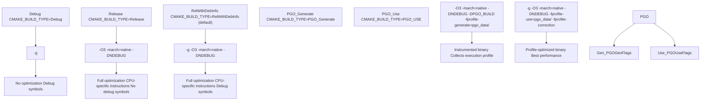
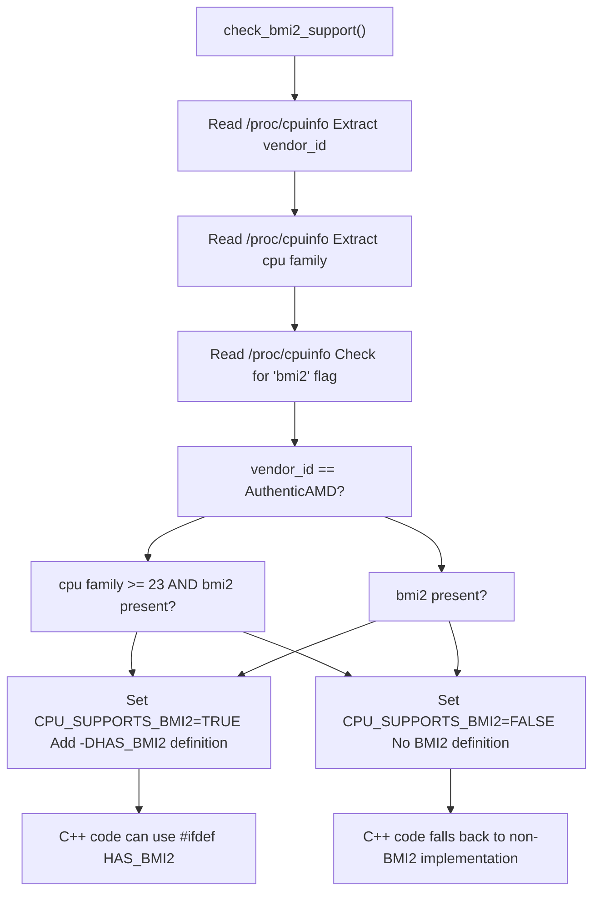
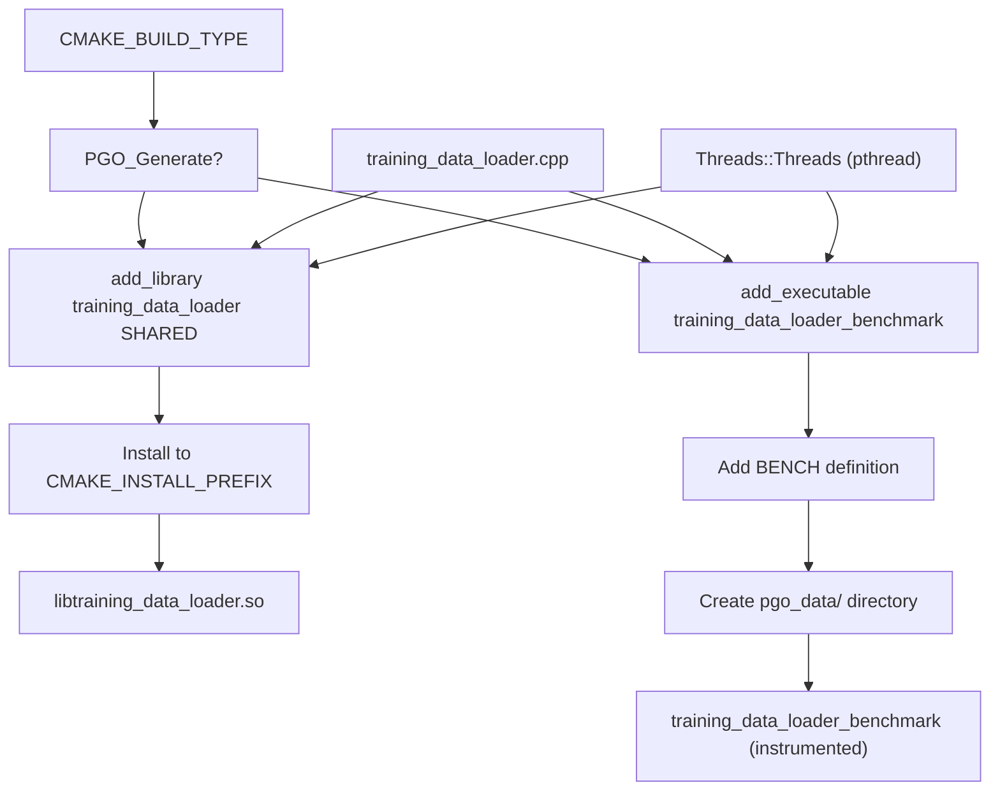

# 构建系统 (CMake) (Build System (CMake))

-   [.pgo/small.binpack](https://github.com/Chesszyh/nnue-pytorch/blob/024b2064/.pgo/small.binpack)
-   [CMakeLists.txt](https://github.com/Chesszyh/nnue-pytorch/blob/024b2064/CMakeLists.txt)
-   [compile\_data\_loader.bat](https://github.com/Chesszyh/nnue-pytorch/blob/024b2064/compile_data_loader.bat)

## 目的与范围

本文档描述了 nnue-pytorch 的 C++ 数据加载器组件的 CMake 构建系统。构建系统处理原生训练数据加载器共享库的编译，支持包括配置文件引导优化 (PGO) 在内的多种构建配置，并自动检测 CPU 特性以进行优化。

关于 PGO 工作流和性能优势的详细信息，请参阅 [配置文件引导优化 (PGO) (Profile-Guided Optimization (PGO))](#6.2)。关于 C++ 数据加载器本身的架构，请参阅 [C++ 数据加载器架构 (C++ Data Loader Architecture)](#3.2)。关于总体依赖要求，请参阅 [依赖与要求 (Dependencies and Requirements)](#9.2)。

## 项目配置

CMake 项目在 [CMakeLists.txt1-3](https://github.com/Chesszyh/nnue-pytorch/blob/024b2064/CMakeLists.txt#L1-L3) 中定义，项目名称为 `training_data_loader`，语言为 C++。构建系统需要 CMake 3.10 或更高版本，并强制执行 C++20 标准合规性 [CMakeLists.txt19-20](https://github.com/Chesszyh/nnue-pytorch/blob/024b2064/CMakeLists.txt#L19-L20)。

如果未显式指定构建类型，系统默认为 `RelWithDebInfo` [CMakeLists.txt5-7](https://github.com/Chesszyh/nnue-pytorch/blob/024b2064/CMakeLists.txt#L5-L7)，它同时提供优化和调试符号。

**构建输出：**

-   **共享库：** `libtraining_data_loader.so` (Linux) 或 `training_data_loader.dll` (Windows) - 由 Python 通过 ctypes 使用
-   **基准测试可执行文件：** `training_data_loader_benchmark` - 仅在 PGO 分析阶段使用

来源：[CMakeLists.txt1-20](https://github.com/Chesszyh/nnue-pytorch/blob/024b2064/CMakeLists.txt#L1-L20)

## 构建类型和编译器标志

构建系统支持五种不同的构建类型，每种类型都有特定的编译器标志配置：


### 编译器标志参考

| 构建类型 | CXX 标志 | 链接器标志 | 目的 |
| --- | --- | --- | --- |
| **Debug** | `-g` | \- | 开发调试 |
| **Release** | `-O3 -march=native -DNDEBUG` | \- | 无调试符号的生产环境 |
| **RelWithDebInfo** | `-g -O3 -march=native -DNDEBUG` | \- | 带调试符号的生产环境（默认）|
| **PGO\_Generate** | `-O3 -march=native -DNDEBUG -DPGO_BUILD -fprofile-generate=${PGO_PROFILE_DATA_DIR}` | `-fprofile-generate=${PGO_PROFILE_DATA_DIR}` | PGO 分析阶段 |
| **PGO\_Use** | `-g -O3 -march=native -DNDEBUG -fprofile-use=${PGO_PROFILE_DATA_DIR} -fprofile-correction` | \- | PGO 优化构建 |

**关键标志：**

-   `-march=native`：启用构建机器支持的所有 CPU 指令集（AVX2、BMI2 等）
-   `-DNDEBUG`：在发布构建中禁用断言
-   `-DPGO_BUILD`：指示 PGO 插桩构建的预处理器标志
-   `-fprofile-generate`：对代码进行插桩以收集执行配置文件
-   `-fprofile-use`：使用收集的配置文件来指导优化决策
-   `-fprofile-correction`：针对配置文件数据不一致进行调整

来源：[CMakeLists.txt9-18](https://github.com/Chesszyh/nnue-pytorch/blob/024b2064/CMakeLists.txt#L9-L18)

## CPU 特性检测

构建系统自动检测 CPU 功能以启用优化，特别是针对 BMI2 (位操作指令集 2) 指令集，这对于国际象棋中的高效位棋盘操作至关重要。


### BMI2 检测逻辑

由于旧 Zen 架构上的性能问题，`check_bmi2_support()` 函数 [CMakeLists.txt24-51](https://github.com/Chesszyh/nnue-pytorch/blob/024b2064/CMakeLists.txt#L24-L51) 实现了针对 AMD CPU 的特殊处理：

1.  **AMD CPU：** 仅当 CPU 系列 ≥ 23 (Zen 2+) 且存在 `bmi2` 标志时，才启用 BMI2
2.  **Intel/其他 CPU：** 如果存在 `bmi2` 标志，则启用 BMI2

这种保守的方法可以防止 AMD Zen 1 CPU 上的性能回归，这些 CPU 技术上支持 BMI2，但具有缓慢的微码实现。

**检测输出：**

```
-- Adding BMI2 support    (if enabled)
-- No BMI2 support        (if disabled)
```
结果通过 `HAS_BMI2` 预处理器定义 [CMakeLists.txt57](https://github.com/Chesszyh/nnue-pytorch/blob/024b2064/CMakeLists.txt#L57-L57) 暴露给 C++ 代码，允许数据加载器有条件地编译优化的位棋盘操作例程。

来源：[CMakeLists.txt24-60](https://github.com/Chesszyh/nnue-pytorch/blob/024b2064/CMakeLists.txt#L24-L60)

## 构建目标

构建系统根据构建类型生成不同的输出：


### 目标：training\_data\_loader (共享库)

为所有标准构建类型（Debug, Release, RelWithDebInfo, PGO\_Use）构建：

-   **源代码：** [training\_data\_loader.cpp](https://github.com/Chesszyh/nnue-pytorch/blob/024b2064/training_data_loader.cpp)
-   **输出：** 安装到 `CMAKE_INSTALL_PREFIX` 的共享库
-   **使用：** 由 Python 通过 `ctypes.CDLL()` 在 [data\_loader/\_native.py](https://github.com/Chesszyh/nnue-pytorch/blob/024b2064/data_loader/_native.py) 中加载
-   **链接：** 需要 `Threads::Threads` (pthread)

配置：[CMakeLists.txt75-81](https://github.com/Chesszyh/nnue-pytorch/blob/024b2064/CMakeLists.txt#L75-L81)

### 目标：training\_data\_loader\_benchmark (可执行文件)

仅为 `PGO_Generate` 构建类型构建：

-   **源代码：** [training\_data\_loader.cpp](https://github.com/Chesszyh/nnue-pytorch/blob/024b2064/training_data_loader.cpp)
-   **输出：** 用于分析的独立可执行文件
-   **预处理器：** 定义 `BENCH` [CMakeLists.txt68](https://github.com/Chesszyh/nnue-pytorch/blob/024b2064/CMakeLists.txt#L68-L68) 启用基准测试模式
-   **链接：** 需要 `Threads::Threads`
-   **配置文件数据：** 执行期间写入 `${PGO_PROFILE_DATA_DIR}`

配置：[CMakeLists.txt67-70](https://github.com/Chesszyh/nnue-pytorch/blob/024b2064/CMakeLists.txt#L67-L70)

来源：[CMakeLists.txt62-81](https://github.com/Chesszyh/nnue-pytorch/blob/024b2064/CMakeLists.txt#L62-L81)

## 构建流程

### 标准构建

对于典型的开发或生产构建：

```
# Configurecmake -S . -B build -DCMAKE_BUILD_TYPE=RelWithDebInfo# Buildcmake --build build# Install (copies shared library to current directory)cmake --build build --target install
```
安装后，Python 可以通过以下方式加载库：

```
lib = ctypes.CDLL('./libtraining_data_loader.so')
```
### PGO 两阶段构建

配置文件引导优化过程需要两次构建传递，由 [compile\_data\_loader.bat1-12](https://github.com/Chesszyh/nnue-pytorch/blob/024b2064/compile_data_loader.bat#L1-L12) 编排：

> **[Mermaid sequence]**
> *(图表结构无法解析)*

**阶段 1 - 生成配置文件 [compile\_data\_loader.bat1-4](https://github.com/Chesszyh/nnue-pytorch/blob/024b2064/compile_data_loader.bat#L1-L4)：**

1.  使用 `CMAKE_BUILD_TYPE=PGO_Generate` 进行配置
2.  构建插桩基准测试可执行文件
3.  使用代表性训练数据（例如 `.pgo/small.binpack`）运行基准测试
4.  编译器将配置文件数据写入 `build-pgo-generate/pgo_data/`

**阶段 2 - 使用配置文件 [compile\_data\_loader.bat6-10](https://github.com/Chesszyh/nnue-pytorch/blob/024b2064/compile_data_loader.bat#L6-L10)：**

1.  使用 `CMAKE_BUILD_TYPE=PGO_Use` 进行配置
2.  通过 `DPGO_PROFILE_DATA_DIR` 传递配置文件数据目录
3.  编译器根据收集的配置文件优化热代码路径
4.  将优化后的共享库安装到 `CMAKE_INSTALL_PREFIX`

**清理 [compile\_data\_loader.bat12](https://github.com/Chesszyh/nnue-pytorch/blob/024b2064/compile_data_loader.bat#L12-L12)：**

```
rm -rf build-pgo-generate
```
PGO 构建通常为数据加载带来 5-15% 的性能提升。关于详细的性能分析和最佳实践，请参阅 [配置文件引导优化 (PGO) (Profile-Guided Optimization (PGO))](#6.2)。

来源：[CMakeLists.txt13-18](https://github.com/Chesszyh/nnue-pytorch/blob/024b2064/CMakeLists.txt#L13-L18) [CMakeLists.txt64-74](https://github.com/Chesszyh/nnue-pytorch/blob/024b2064/CMakeLists.txt#L64-L74) [compile\_data\_loader.bat1-12](https://github.com/Chesszyh/nnue-pytorch/blob/024b2064/compile_data_loader.bat#L1-L12)

## CMake 变量参考

控制构建的关键 CMake 变量：

| 变量 | 类型 | 默认值 | 描述 |
| --- | --- | --- | --- |
| `CMAKE_BUILD_TYPE` | STRING | `RelWithDebInfo` | 构建配置 (Debug, Release, RelWithDebInfo, PGO\_Generate, PGO\_Use) |
| `CMAKE_CXX_STANDARD` | STRING | `20` | 需要的 C++ 标准版本 |
| `CMAKE_INSTALL_PREFIX` | PATH | 平台相关 | 共享库的安装目录 |
| `PGO_PROFILE_DATA_DIR` | PATH | `${CMAKE_BINARY_DIR}/pgo_data` | PGO 配置文件数据 (.gcda 文件) 的目录 |
| `CPU_SUPPORTS_BMI2` | BOOL | 自动检测 | 是否启用 BMI2 指令 |

**设置变量：**

```
# Set build typecmake -S . -B build -DCMAKE_BUILD_TYPE=Release# Set install prefixcmake -S . -B build -DCMAKE_INSTALL_PREFIX=/usr/local# Set PGO profile directorycmake -S . -B build -DPGO_PROFILE_DATA_DIR=/path/to/profiles
```
来源：[CMakeLists.txt5-7](https://github.com/Chesszyh/nnue-pytorch/blob/024b2064/CMakeLists.txt#L5-L7) [CMakeLists.txt14](https://github.com/Chesszyh/nnue-pytorch/blob/024b2064/CMakeLists.txt#L14-L14) [CMakeLists.txt19-20](https://github.com/Chesszyh/nnue-pytorch/blob/024b2064/CMakeLists.txt#L19-L20)

## 线程库依赖

数据加载器需要 POSIX 线程 (pthread) 来支持其多线程数据加载架构。构建系统使用 CMake 的 `find_package(Threads REQUIRED)` [CMakeLists.txt62](https://github.com/Chesszyh/nnue-pytorch/blob/024b2064/CMakeLists.txt#L62-L62) 来定位适当的线程库，并通过 `target_link_libraries(..., Threads::Threads)` 将其链接到两个目标 [CMakeLists.txt69-76](https://github.com/Chesszyh/nnue-pytorch/blob/024b2064/CMakeLists.txt#L69-L76)

此依赖关系对于 C++ 数据加载器的并发文件读取和批处理至关重要。关于线程模型的详细信息，请参阅 [C++ 数据加载器架构 (C++ Data Loader Architecture)](#3.2)。

来源：[CMakeLists.txt62](https://github.com/Chesszyh/nnue-pytorch/blob/024b2064/CMakeLists.txt#L62-L62) [CMakeLists.txt69](https://github.com/Chesszyh/nnue-pytorch/blob/024b2064/CMakeLists.txt#L69-L69) [CMakeLists.txt76](https://github.com/Chesszyh/nnue-pytorch/blob/024b2064/CMakeLists.txt#L76-L76)
