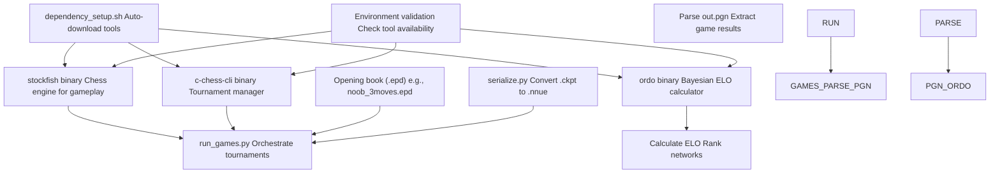

# 依赖与要求 (Dependencies and Requirements)

-   [.gitignore](https://github.com/Chesszyh/nnue-pytorch/blob/024b2064/.gitignore)
-   [Dockerfile.AMD](https://github.com/Chesszyh/nnue-pytorch/blob/024b2064/Dockerfile.AMD)
-   [Dockerfile.NVIDIA](https://github.com/Chesszyh/nnue-pytorch/blob/024b2064/Dockerfile.NVIDIA)
-   [README.md](https://github.com/Chesszyh/nnue-pytorch/blob/024b2064/README.md)
-   [requirements.txt](https://github.com/Chesszyh/nnue-pytorch/blob/024b2064/requirements.txt)
-   [run\_docker.sh](https://github.com/Chesszyh/nnue-pytorch/blob/024b2064/run_docker.sh)
-   [setup\_script.sh](https://github.com/Chesszyh/nnue-pytorch/blob/024b2064/setup_script.sh)

本页列出了运行 nnue-pytorch 训练系统所需的所有依赖项，包括 Python 包、系统级要求、GPU 驱动程序和外部工具。它涵盖了基于 Docker 和本地安装的方法。

关于构建系统配置细节，请参阅 [构建系统 (CMake) (Build System (CMake))](#9.1)。关于初始环境设置过程，请参阅 [环境设置 (Environment Setup)](#1.2)。

## Python 包依赖

核心 Python 依赖项在 [requirements.txt1-10](https://github.com/Chesszyh/nnue-pytorch/blob/024b2064/requirements.txt#L1-L10) 中指定。这些包为训练、数据可视化和系统监控提供了基础基础设施。

### 核心依赖项

| 包 | 目的 | 版本约束 |
| --- | --- | --- |
| `lightning` | 用于训练编排的 PyTorch Lightning 框架 | 最新 (Latest) |
| `pytorch` | 深度学习框架（通过 Docker 或单独安装）| ≥2.0 |
| `tensorboard` | 训练指标记录和可视化 | 最新 (Latest) |
| `numpy` | 数值计算库 | <2.0 |
| `python-chess` | 国际象棋局面操作和验证 | \==0.31.4 |
| `matplotlib` | 用于可视化脚本的绘图库 | 最新 (Latest) |
| `numba` | 用于性能关键型 Python 代码的 JIT 编译器 | 最新 (Latest) |
| `psutil` | 进程和系统实用程序监控 | 最新 (Latest) |
| `GPUtil` | GPU 监控和统计 | 最新 (Latest) |
| `asciimatics` | 用于 `easy_train.py` 仪表板的终端 UI 框架 | 最新 (Latest) |
| `requests` | 用于下载外部工具的 HTTP 库 | 最新 (Latest) |

**注意**：约束 `numpy<2.0` 对于与当前 `numba` 版本的兼容性至关重要，后者尚未完全支持 NumPy 2.x。

**来源**: [requirements.txt1-10](https://github.com/Chesszyh/nnue-pytorch/blob/024b2064/requirements.txt#L1-L10)

### GPU 特定依赖项

```mermaid
flowchart TD
    NVIDIA_DOCKER["nvcr.io/nvidia/pytorch:25.03-py3 FROM Dockerfile.NVIDIA"]
    NVIDIA_TORCH["PyTorch with CUDA 12.x"]
    NVIDIA_CUPY["cupy (installed via pip)"]
    AMD_DOCKER["rocm/pytorch:rocm6.4.3_ubuntu24.04 FROM Dockerfile.AMD"]
    AMD_TORCH["PyTorch with ROCm 6.4.3"]
    AMD_CUPY["cupy with HIP backend CUPY_INSTALL_USE_HIP=1"]
    LIGHTNING["lightning module"]
    TORCH_OPS["torch.compile operations"]
    CUSTOM_CUDA["Custom CUDA kernels compile.py"]

    NVIDIA --> DOCKER_NVIDIA_TORCH
    NVIDIA --> TORCH_NVIDIA_CUPY
    AMD --> DOCKER_AMD_TORCH
    AMD --> TORCH_AMD_CUPY
    NVIDIA --> CUPY_CUSTOM_CUDA
    AMD --> CUPY_CUSTOM_CUDA
    CUSTOM --> CUDA_TORCH_OPS
    TORCH --> OPS_LIGHTNING
```


**NVIDIA 环境**：

-   基础镜像：`nvcr.io/nvidia/pytorch:25.03-py3` [Dockerfile.NVIDIA1](https://github.com/Chesszyh/nnue-pytorch/blob/024b2064/Dockerfile.NVIDIA#L1-L1)
-   包含支持 CUDA 12.x 的 PyTorch
-   CuPy 自动兼容 CUDA 后端

**AMD 环境**：

-   基础镜像：`rocm/pytorch:rocm6.4.3_ubuntu24.04_py3.12_pytorch_release_2.6.0` [Dockerfile.AMD1](https://github.com/Chesszyh/nnue-pytorch/blob/024b2064/Dockerfile.AMD#L1-L1)
-   包含支持 ROCm 6.4.3 的 PyTorch
-   CuPy 需要特殊安装：`ROCM_HOME=/opt/rocm CUPY_INSTALL_USE_HIP=1 pip install cupy` [Dockerfile.AMD14](https://github.com/Chesszyh/nnue-pytorch/blob/024b2064/Dockerfile.AMD#L14-L14)

**来源**: [Dockerfile.NVIDIA1](https://github.com/Chesszyh/nnue-pytorch/blob/024b2064/Dockerfile.NVIDIA#L1-L1) [Dockerfile.AMD1](https://github.com/Chesszyh/nnue-pytorch/blob/024b2064/Dockerfile.AMD#L1-L1) [Dockerfile.AMD14](https://github.com/Chesszyh/nnue-pytorch/blob/024b2064/Dockerfile.AMD#L14-L14)

## 系统级依赖项

必须安装以下系统包以进行 C++ 编译和执行：

### 编译器和构建工具

| 工具 | 最低版本 | 目的 |
| --- | --- | --- |
| `g++` | GCC 9.0+ | 用于数据加载器编译的 C++ 编译器 |
| `cmake` | 3.17+ | 构建系统配置 |
| `git` | 任意 | 版本控制和依赖项克隆 |
| `curl` | 任意 | 下载外部工具 (ordo, c-chess-cli) |

这些通过 [Dockerfile.NVIDIA3-7](https://github.com/Chesszyh/nnue-pytorch/blob/024b2064/Dockerfile.NVIDIA#L3-L7) 和 [Dockerfile.AMD3-7](https://github.com/Chesszyh/nnue-pytorch/blob/024b2064/Dockerfile.AMD#L3-L7) 安装在两个 Docker 容器中：

```
RUN apt-get update && apt-get install -y \    g++ \    git \    curl \    && rm -rf /var/lib/apt/lists/*
```
**CPU 特性要求**：C++ 数据加载器受益于现代 CPU 特性：

-   **BMI2** (位操作指令集 2)：通过 CMake 自动检测并启用，以实现更快的位棋盘操作
-   **SIMD** (SSE4.2 / AVX2 / AVX512)：用于批处理优化

**来源**: [Dockerfile.NVIDIA3-7](https://github.com/Chesszyh/nnue-pytorch/blob/024b2064/Dockerfile.NVIDIA#L3-L7) [Dockerfile.AMD3-7](https://github.com/Chesszyh/nnue-pytorch/blob/024b2064/Dockerfile.AMD#L3-L7)

## GPU 驱动程序要求

```mermaid
flowchart TD
    NVIDIA_HOST["NVIDIA Host Driver: 550+ Container Toolkit"]
    AMD_HOST["AMD Host Driver: ROCm 6.x+ Docker support"]
    NVIDIA_RUNTIME["--gpus all flag GPU device passthrough"]
    AMD_RUNTIME["--device /dev/kfd --device /dev/dri Device access"]
    CUDA_CONTAINER["CUDA 12.x toolkit Inside container"]
    ROCM_CONTAINER["ROCm 6.4.3 toolkit Inside container"]
    TRAINING["Training execution"]

    NVIDIA --> HOST_NVIDIA_RUNTIME
    AMD --> HOST_AMD_RUNTIME
    NVIDIA --> RUNTIME_CUDA_CONTAINER
    AMD --> RUNTIME_ROCM_CONTAINER
    CUDA --> CONTAINER_TRAINING
    ROCM --> CONTAINER_TRAINING
```


### NVIDIA 要求

**主机系统** [README.md15-18](https://github.com/Chesszyh/nnue-pytorch/blob/024b2064/README.md#L15-L18)：

-   Docker
-   最新的 NVIDIA 驱动程序（≥550.x 以支持 CUDA 12.x）
-   NVIDIA Container Toolkit

**容器启动**：通过 `--gpus all` 标志启用 GPU 访问 [run\_docker.sh18](https://github.com/Chesszyh/nnue-pytorch/blob/024b2064/run_docker.sh#L18-L18)

**驱动程序文档**：[PyTorch 容器发布说明](https://docs.nvidia.com/deeplearning/frameworks/pytorch-release-notes/rel-25-04.html#rel-25-04)

### AMD 要求

**主机系统** [README.md11-13](https://github.com/Chesszyh/nnue-pytorch/blob/024b2064/README.md#L11-L13)：

-   Docker
-   最新的 ROCm 驱动程序 (≥6.0)

**容器启动**：GPU 访问需要设备直通 [run\_docker.sh23](https://github.com/Chesszyh/nnue-pytorch/blob/024b2064/run_docker.sh#L23-L23)：

```
--device /dev/kfd --device /dev/dri
```
**驱动程序文档**：[运行 ROCm Docker 容器](https://rocm.docs.amd.com/projects/install-on-linux/en/latest/how-to/docker.html)

**重要**：主机系统的 CUDA/ROCm 工具包版本不需要与容器版本匹配 [README.md22](https://github.com/Chesszyh/nnue-pytorch/blob/024b2064/README.md#L22-L22)，只有驱动程序版本重要。

**来源**: [README.md11-22](https://github.com/Chesszyh/nnue-pytorch/blob/024b2064/README.md#L11-L22) [run\_docker.sh18](https://github.com/Chesszyh/nnue-pytorch/blob/024b2064/run_docker.sh#L18-L18) [run\_docker.sh23](https://github.com/Chesszyh/nnue-pytorch/blob/024b2064/run_docker.sh#L23-L23)

## Docker 环境设置

基于 Docker 的设置是推荐的方法，因为它消除了本地环境配置的复杂性。

### Docker 构建过程

```mermaid
flowchart TD
    SELECT_GPU["Select GPU vendor NVIDIA or AMD"]
    DATA_PATH["Provide data directory path"]
    DOCKERFILE["Select Dockerfile Dockerfile.NVIDIA or Dockerfile.AMD"]
    BASE_IMAGE["Pull base image PyTorch container"]
    INSTALL_DEPS["Install system packages g++, git, curl"]
    INSTALL_PY["pip install -r requirements.txt"]
    INSTALL_CUPY["Install CuPy (AMD: HIP backend)"]
    SETUP_SCRIPT["Copy setup_script.sh chmod +x"]
    MOUNT_CODE["Mount -v pwd:/workspace/nnue-pytorch"]
    MOUNT_DATA["Mount -v DATA_PATH:/data"]
    GPU_FLAGS["Apply GPU flags --gpus all OR --device /dev/kfd /dev/dri"]
    ENTRYPOINT["ENTRYPOINT setup_script.sh Compile data loader"]
    BASH["Start interactive bash"]

    SELECT --> GPU_DOCKERFILE
    DOCKERFILE --> BASE_IMAGE
    BASE --> IMAGE_INSTALL_DEPS
    INSTALL --> DEPS_INSTALL_PY
    INSTALL --> PY_INSTALL_CUPY
    INSTALL --> CUPY_SETUP_SCRIPT
    SETUP --> SCRIPT_MOUNT_CODE
    DATA --> PATH_MOUNT_DATA
    MOUNT --> CODE_GPU_FLAGS
    MOUNT --> DATA_GPU_FLAGS
    GPU --> FLAGS_ENTRYPOINT
    ENTRYPOINT --> BASH
```


### 容器启动配置

[run\_docker.sh37-45](https://github.com/Chesszyh/nnue-pytorch/blob/024b2064/run_docker.sh#L37-L45) 脚本使用以下参数配置容器：

| 标志 | 目的 |
| --- | --- |
| `-u $(id -u)` | 以当前用户身份运行（避免权限问题）|
| `-v $(pwd):/workspace/nnue-pytorch` | 挂载源代码目录 |
| `-v $DATA_PATH:/data` | 挂载训练数据目录 |
| `--ipc=host` | 为数据加载器启用共享内存 |
| `--ulimit memlock=-1` | GPU 操作的无限锁定内存 |
| `--ulimit stack=67108864` | 用于深度递归的 64MB 堆栈限制 |

### 入口点脚本

容器启动时，[setup\_script.sh3](https://github.com/Chesszyh/nnue-pytorch/blob/024b2064/setup_script.sh#L3-L3) 执行：

```
sh compile_data_loader.bat
```
这将使用 CMake 编译 C++ 数据加载器库（`libtraining_data_loader.so` 或 `.dylib`）。编译后的库放置在仓库根目录中，并由 Python 通过 ctypes 加载。

**来源**: [run\_docker.sh1-46](https://github.com/Chesszyh/nnue-pytorch/blob/024b2064/run_docker.sh#L1-L46) [setup\_script.sh1-5](https://github.com/Chesszyh/nnue-pytorch/blob/024b2064/setup_script.sh#L1-L5) [Dockerfile.NVIDIA1-18](https://github.com/Chesszyh/nnue-pytorch/blob/024b2064/Dockerfile.NVIDIA#L1-L18) [Dockerfile.AMD1-19](https://github.com/Chesszyh/nnue-pytorch/blob/024b2064/Dockerfile.AMD#L1-L19)

## 外部工具依赖

评估管道需要几个外部工具，这些工具由 `easy_train.py` 自动下载：

### 国际象棋引擎和锦标赛工具


| 工具 | 目的 | 自动下载 | 手动使用 |
| --- | --- | --- | --- |
| `stockfish` | 用于评估的国际象棋引擎 | 是 (由 `easy_train.py`) | `run_games.py` 需要 |
| `c-chess-cli` | 并行锦标赛管理器 | 是 (由 `easy_train.py`) | `run_games.py` 需要 |
| `ordo` | 贝叶斯 ELO 计算 | 是 (由 `easy_train.py`) | `run_games.py` 需要 |
| 开局库 | 起始局面 (.epd 格式) | 否 (用户提供) | `run_games.py` 可选 |

### 手动工具设置

当直接运行 `run_games.py`（不使用 `easy_train.py`）时，必须通过命令行参数指定工具 [README.md56](https://github.com/Chesszyh/nnue-pytorch/blob/024b2064/README.md#L56-L56)：

```
python run_games.py \  --concurrency 16 \  --stockfish_exe ./stockfish.master \  --c_chess_exe ./c-chess-cli \  --ordo_exe ./ordo \  --book_file_name ./noob_3moves.epd \  run96
```
**来源**: [README.md56-60](https://github.com/Chesszyh/nnue-pytorch/blob/024b2064/README.md#L56-L60)

## 版本兼容性矩阵

### 已测试的配置

| 组件 | NVIDIA 版本 | AMD 版本 |
| --- | --- | --- |
| 基础容器 | `nvcr.io/nvidia/pytorch:25.03-py3` | `rocm/pytorch:rocm6.4.3_ubuntu24.04` |
| PyTorch | ≥2.6.0 | ≥2.6.0 |
| CUDA / ROCm | CUDA 12.x | ROCm 6.4.3 |
| Python | 3.10-3.12 | 3.12 |
| GCC | 9.x - 13.x | 9.x - 13.x |
| CMake | ≥3.17 | ≥3.17 |

### 关键版本约束

**NumPy < 2.0**：`numba` 兼容性需要 [requirements.txt8](https://github.com/Chesszyh/nnue-pytorch/blob/024b2064/requirements.txt#L8-L8)

**python-chess == 0.31.4**：稳定的 PGN 解析和局面验证的固定版本 [requirements.txt4](https://github.com/Chesszyh/nnue-pytorch/blob/024b2064/requirements.txt#L4-L4)

**PyTorch ≥ 2.0**：整个训练代码中使用的 `torch.compile` 支持需要

**Lightning**：使用最新版本，需要 PyTorch 2.x

**来源**: [requirements.txt4](https://github.com/Chesszyh/nnue-pytorch/blob/024b2064/requirements.txt#L4-L4) [requirements.txt8](https://github.com/Chesszyh/nnue-pytorch/blob/024b2064/requirements.txt#L8-L8) [Dockerfile.NVIDIA1](https://github.com/Chesszyh/nnue-pytorch/blob/024b2064/Dockerfile.NVIDIA#L1-L1) [Dockerfile.AMD1](https://github.com/Chesszyh/nnue-pytorch/blob/024b2064/Dockerfile.AMD#L1-L1)

## 磁盘空间要求

Docker 镜像和训练工件需要大量磁盘空间：

| 组件 | 大致大小 |
| --- | --- |
| Docker 基础镜像 | 20-40 GB |
| 构建的 Docker 容器 | 30-60 GB |
| 训练数据 (.bin/.binpack) | 变化很大（通常 100GB-1TB）|
| 检查点和日志 | 每次训练运行 1-10 GB |
| 评估工具 | <100 MB |

**注意**：[README.md34](https://github.com/Chesszyh/nnue-pytorch/blob/024b2064/README.md#L34-L34) 警告构建容器将需要时间和大量磁盘空间 (30-60GB)。

**来源**: [README.md34](https://github.com/Chesszyh/nnue-pytorch/blob/024b2064/README.md#L34-L34)

## 本地安装替代方案

虽然推荐使用 Docker，但也可以进行本地安装：

**先决条件**：

1.  使用 pip 安装 Python 3.10+
2.  安装 CUDA 工具包 (NVIDIA) 或 ROCm (AMD)
3.  安装系统包：`g++`, `cmake`, `git`, `curl`
4.  从 [pytorch.org](https://pytorch.org) 安装带有 GPU 支持的 PyTorch
5.  运行：`pip install -r requirements.txt`
6.  编译数据加载器：`sh compile_data_loader.bat` 或手动 `cmake`

**优点**：占用空间小，开发迭代快

**缺点**：手动依赖管理，潜在的版本冲突，特定于平台的问题

有关详细的构建说明，请参阅 [构建系统 (CMake) (Build System (CMake))](#9.1)。
