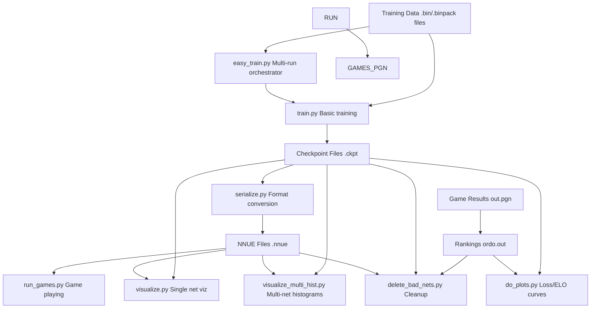
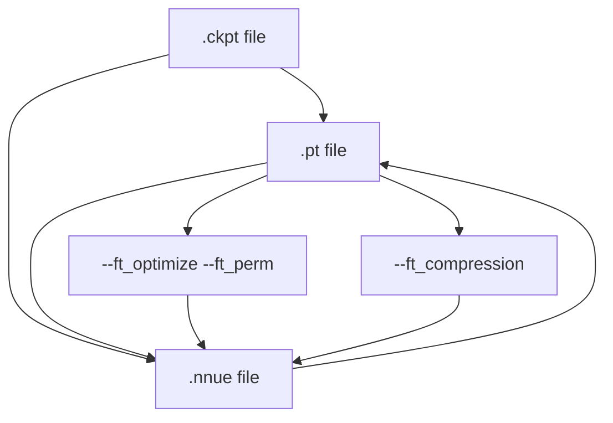
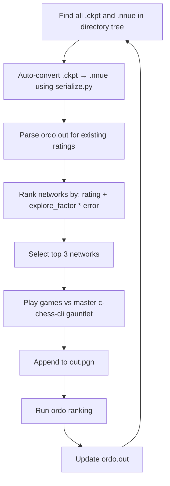
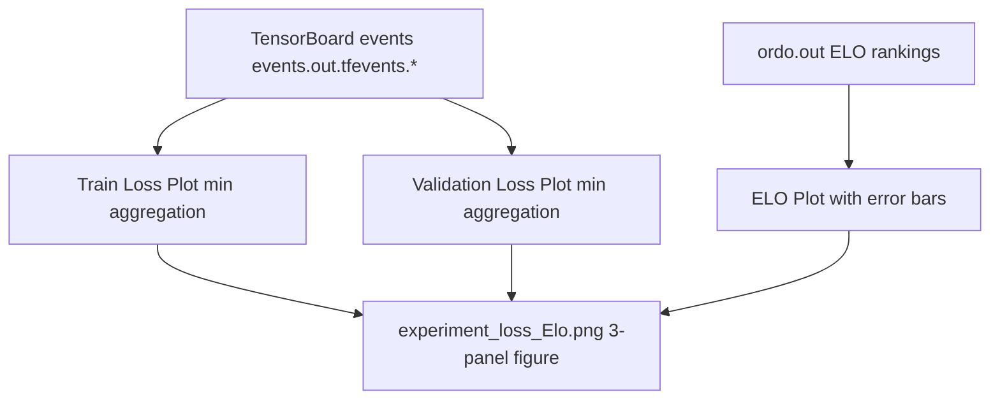
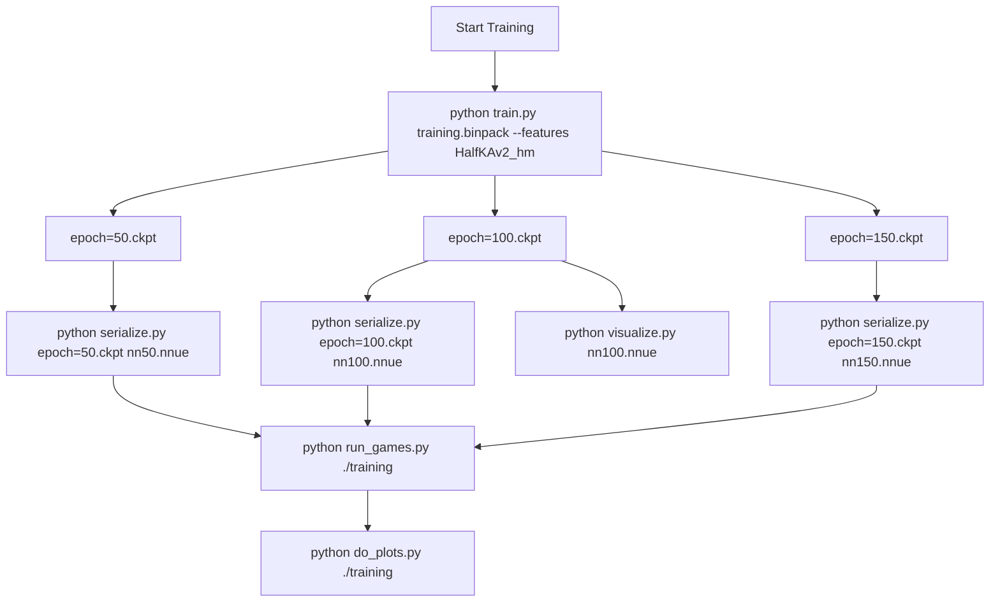

# 命令行参考 (Command-Line Reference)

-   [delete\_bad\_nets.py](https://github.com/Chesszyh/nnue-pytorch/blob/024b2064/delete_bad_nets.py)
-   [do\_plots.py](https://github.com/Chesszyh/nnue-pytorch/blob/024b2064/do_plots.py)
-   [model/\_\_init\_\_.py](https://github.com/Chesszyh/nnue-pytorch/blob/024b2064/model/__init__.py)
-   [model/utils/\_\_init\_\_.py](https://github.com/Chesszyh/nnue-pytorch/blob/024b2064/model/utils/__init__.py)
-   [run\_games.py](https://github.com/Chesszyh/nnue-pytorch/blob/024b2064/run_games.py)
-   [serialize.py](https://github.com/Chesszyh/nnue-pytorch/blob/024b2064/serialize.py)
-   [train.py](https://github.com/Chesszyh/nnue-pytorch/blob/024b2064/train.py)
-   [visualize.py](https://github.com/Chesszyh/nnue-pytorch/blob/024b2064/visualize.py)
-   [visualize\_multi\_hist.py](https://github.com/Chesszyh/nnue-pytorch/blob/024b2064/visualize_multi_hist.py)

本页提供了 nnue-pytorch 仓库中所有可执行脚本的命令行参数的综合参考。关于训练系统架构和工作流的信息，请参阅 [训练系统 (Training System)](#2)。关于模型序列化格式的详细信息，请参阅 [模型序列化 (Model Serialization)](#5)。

该仓库包含七个主要的命令行工具，按功能组织：

-   **训练**：`train.py` 用于基本训练，`easy_train.py` 用于编排的多运行训练
-   **模型转换**：`serialize.py` 用于在检查点和 NNUE 格式之间进行转换
-   **评估**：`run_games.py` 用于自动对弈和 ELO 计算
-   **分析**：`visualize.py`、`visualize_multi_hist.py`、`do_plots.py` 和 `delete_bad_nets.py`

## 脚本交互概览


**来源**: [train.py1-553](https://github.com/Chesszyh/nnue-pytorch/blob/024b2064/train.py#L1-L553) [serialize.py1-186](https://github.com/Chesszyh/nnue-pytorch/blob/024b2064/serialize.py#L1-L186) [run\_games.py1-606](https://github.com/Chesszyh/nnue-pytorch/blob/024b2064/run_games.py#L1-L606) [visualize.py1-712](https://github.com/Chesszyh/nnue-pytorch/blob/024b2064/visualize.py#L1-L712) [visualize\_multi\_hist.py1-170](https://github.com/Chesszyh/nnue-pytorch/blob/024b2064/visualize_multi_hist.py#L1-L170) [do\_plots.py1-267](https://github.com/Chesszyh/nnue-pytorch/blob/024b2064/do_plots.py#L1-L267) [delete\_bad\_nets.py1-167](https://github.com/Chesszyh/nnue-pytorch/blob/024b2064/delete_bad_nets.py#L1-L167)

## train.py - 基本训练脚本

用于单次训练运行的主要训练脚本。使用 PyTorch Lightning 进行训练编排。

### 用法

```
python train.py <datasets> [options]
```
### 位置参数

| 参数 | 类型 | 描述 |
| --- | --- | --- |
| `datasets` | 字符串 (多个) | 训练数据集（.binpack 或 .bin 文件）。可以指定多个文件，这些文件将在块级别交错。 |

### 核心训练选项

| 参数 | 类型 | 默认值 | 描述 |
| --- | --- | --- | --- |
| `--default_root_dir` | 字符串 | None | 日志和检查点的根目录。如果为 None，则使用当前目录。 |
| `--gpus` | 字符串 | None | 逗号分隔的 GPU ID 列表（例如 "0,1,2,3"）。如果为 None，则使用所有可用 GPU。 |
| `--max_epochs` | 整数 | 800 | 最大训练 Epoch 数。 |
| `--max_time` | 字符串 | "30:00:00:00" | 最大训练时间，格式为 DD:HH:MM:SS。一旦 Epoch 完成且超过此持续时间，训练即停止。 |
| `--validation-data` | 字符串 (多个) | None | 单独的验证数据集。如果未指定，则使用训练数据进行验证。 |
| `--seed` | 整数 | 42 | PyTorch 的随机种子。 |
| `--threads` | 整数 | \-1 | PyTorch 线程数。默认 (-1) 使用自动检测。 |

### 模型架构选项

| 参数 | 类型 | 默认值 | 描述 |
| --- | --- | --- | --- |
| `--features` | 字符串 | (必需) | 特征集名称（例如 "HalfKAv2\_hm", "HalfKAv2\_hm^"）。参见特征集文档。 |
| `--l1` | 整数 | 1024 | 特征变换器输出大小（L1 层）。常见值：512, 1024, 2048。 |

### 损失函数参数

| 参数 | 类型 | 默认值 | 描述 |
| --- | --- | --- | --- |
| `--lambda` | 浮点数 | 1.0 | 评估 (1.0) 和对弈结果 (0.0) 之间的插值。 |
| `--start-lambda` | 浮点数 | None | 第一个 Epoch 的 Lambda 值。需要设置 `--end-lambda`。 |
| `--end-lambda` | 浮点数 | None | 最后一个 Epoch 的 Lambda 值。在开始和结束之间进行线性插值。 |
| `--qp-asymmetry` | 浮点数 | 0.0 | 当预测值 > 参考值时的损失调整。 |
| `--pow-exp` | 浮点数 | 2.5 | 平均误差计算中幂律的指数。 |
| `--in-offset` | 浮点数 | 270 | 用于将输入评估转换为获胜概率的偏移量。 |
| `--out-offset` | 浮点数 | 270 | 用于将输出评估转换为获胜概率的偏移量。 |
| `--in-scaling` | 浮点数 | 340 | 输入评估转换的缩放因子。 |
| `--out-scaling` | 浮点数 | 380 | 输出评估转换的缩放因子。 |

### 优化器和学习率

| 参数 | 类型 | 默认值 | 描述 |
| --- | --- | --- | --- |
| `--lr` | 浮点数 | 8.75e-4 | 初始学习率。 |
| `--gamma` | 浮点数 | 0.992 | 每个 Epoch 后应用的学习率衰减乘数。 |

### 数据加载选项

| 参数 | 类型 | 默认值 | 描述 |
| --- | --- | --- | --- |
| `--num-workers` | 整数 | 1 | 数据加载的工作线程数。与 binpack 格式配合使用效果最佳。 |
| `--batch-size` | 整数 | \-1 | 每批次的位置数。默认是 16384。 |
| `--epoch-size` | 整数 | 100000000 | 每个 Epoch 的位置数。 |
| `--validation-size` | 整数 | 0 | 每次验证步骤的位置数。0 禁用验证。 |

### 数据过滤选项

| 参数 | 类型 | 默认值 | 描述 |
| --- | --- | --- | --- |
| `--no-smart-fen-skipping` | 标志 | False | 禁用智能 FEN 跳过（跳过作为不良训练目标的局面）。 |
| `--no-wld-fen-skipping` | 标志 | False | 禁用 WLD (胜/负/平) FEN 跳过。 |
| `--random-fen-skipping` | 整数 | 3 | 以 N-1 的平均速率随机跳过局面，然后再使用一个。 |
| `--early-fen-skipping` | 整数 | \-1 | 跳过每局对弈开始时的 N 个回合。-1 禁用。 |
| `--simple-eval-skipping` | 整数 | \-1 | 跳过 abs(simple\_eval) < N 的局面。-1 禁用。 |

### 棋子数量分布参数

| 参数 | 类型 | 默认值 | 描述 |
| --- | --- | --- | --- |
| `--pc-y1` | 浮点数 | 1.0 | 用于分布控制的棋子数量参数 y1。 |
| `--pc-y2` | 浮点数 | 2.0 | 用于分布控制的棋子数量参数 y2。 |
| `--pc-y3` | 浮点数 | 1.0 | 用于分布控制的棋子数量参数 y3。 |

### 权重参数

| 参数 | 类型 | 默认值 | 描述 |
| --- | --- | --- | --- |
| `--w1` | 浮点数 | 0.0 | 权重提升参数 1。 |
| `--w2` | 浮点数 | 0.5 | 权重提升参数 2。 |

### 检查点选项

| 参数 | 类型 | 默认值 | 描述 |
| --- | --- | --- | --- |
| `--network-save-period` | 整数 | 20 | 每 N 个 Epoch 保存一次检查点。 |
| `--save-last-network` | 布尔 | True | 始终保存最近的检查点。 |
| `--resume-from-model` | 字符串 | None | 从 .pt 模型文件初始化。 |
| `--resume-from-checkpoint` | 字符串 | None | 从 .ckpt 文件恢复训练。 |

### 高级选项

| 参数 | 类型 | 默认值 | 描述 |
| --- | --- | --- | --- |
| `--compile-backend` | 字符串 | "inductor" | PyTorch 编译后端。选项："inductor", "cudagraphs"。 |
| `--param-index` | 整数 | 0 | 参数扫描的索引（超参数搜索）。 |

### 示例命令

```
# Basic training with default settingspython train.py data/training_data.binpack --features HalfKAv2_hm# Multi-GPU training with custom architecturepython train.py data/*.binpack --features HalfKAv2_hm^ --l1 2048 --gpus 0,1,2,3# Training with lambda schedulingpython train.py data/train.binpack --features HalfKAv2_hm \  --start-lambda 1.0 --end-lambda 0.7 --max_epochs 400# Resume from checkpointpython train.py data/train.binpack --features HalfKAv2_hm \  --resume-from-checkpoint logs/version_0/checkpoints/epoch=100.ckpt
```
**来源**: [train.py107-553](https://github.com/Chesszyh/nnue-pytorch/blob/024b2064/train.py#L107-L553)

## serialize.py - 模型格式转换

在 PyTorch 检查点 (.ckpt)、PyTorch 模型 (.pt) 和 NNUE 二进制 (.nnue) 格式之间进行转换。

### 用法

```
python serialize.py <source> <target> [options]
```
### 位置参数

| 参数 | 类型 | 描述 |
| --- | --- | --- |
| `source` | 字符串 | 源文件 (.ckpt, .pt, 或 .nnue)。 |
| `target` | 字符串 | 目标文件 (.pt 或 .nnue)。不能转换为 .ckpt。 |

### 输出选项

| 参数 | 类型 | 默认值 | 描述 |
| --- | --- | --- | --- |
| `--out-sha` | 标志 | False | 保存为 nn-{sha12}.nnue 而不是使用目标文件名。 |
| `--description` | 字符串 | None | 嵌入到 .nnue 文件头部的描述字符串。 |

### 压缩选项

| 参数 | 类型 | 默认值 | 描述 |
| --- | --- | --- | --- |
| `--ft_compression` | 字符串 | "leb128" | 特征变换器压缩。选项："none", "leb128"。仅用于 .nnue 输出。 |

### 特征变换器优化

| 参数 | 类型 | 默认值 | 描述 |
| --- | --- | --- | --- |
| `--ft_perm` | 字符串 | None | 用于 FT 权重重新排序的排列文件路径。 |
| `--ft_optimize` | 标志 | False | 执行完整的 FT 优化（非常耗时）。 |
| `--ft_optimize_data` | 字符串 | None | 用于 FT 优化的数据集路径。与 `--ft_optimize` 一起使用是必需的。 |
| `--ft_optimize_count` | 整数 | 10000 | 用于 FT 优化的位置数。 |
| `--no-cupy` | 标志 | False | 禁用 cupy（使用 numpy 代替）。如果 GPU 内存不足则使用。 |
| `--device` | 整数 | 0 | cupy 的 GPU 设备 ID。 |

### 模型配置

| 参数 | 类型 | 默认值 | 描述 |
| --- | --- | --- | --- |
| `--features` | 字符串 | (必需) | 与源模型匹配的特征集名称。 |
| `--l1` | 整数 | 1024 | 与源模型匹配的 L1 层大小。 |

### 转换流程图


### 示例命令

```
# Basic checkpoint to NNUE conversionpython serialize.py epoch=100.ckpt output.nnue --features HalfKAv2_hm# Convert with SHA-256 namingpython serialize.py epoch=100.ckpt ./nets/ --out-sha --features HalfKAv2_hm# Convert with FT optimizationpython serialize.py epoch=100.ckpt optimized.nnue --features HalfKAv2_hm \  --ft_optimize --ft_optimize_data training_data.binpack --ft_optimize_count 50000# Convert NNUE to PyTorch modelpython serialize.py network.nnue model.pt --features HalfKAv2_hm# Convert with no compressionpython serialize.py epoch=100.ckpt output.nnue --features HalfKAv2_hm \  --ft_compression none
```
**来源**: [serialize.py10-186](https://github.com/Chesszyh/nnue-pytorch/blob/024b2064/serialize.py#L10-L186)

## run\_games.py - 自动对弈和评估

持续在目录树中查找网络，将它们转换为 NNUE 格式，针对基线进行对弈，并使用 ordo 计算 ELO 评级。

### 用法

```
python run_games.py <root_dir> [options]
```
### 位置参数

| 参数 | 类型 | 描述 |
| --- | --- | --- |
| `root_dir` | 字符串 | 递归搜索 .nnue 或 .ckpt 文件的目录。也存储结果（ordo.out, out.pgn, c\_chess.out）。 |

### 引擎配置

| 参数 | 类型 | 默认值 | 描述 |
| --- | --- | --- | --- |
| `--stockfish_base` | 字符串 | "./stockfish" | 基线 Stockfish 二进制文件路径（master/参考版本）。 |
| `--stockfish_test` | 字符串 | None | 测试 Stockfish 二进制文件路径。如果未设置，则使用 stockfish\_base。 |
| `--c_chess_exe` | 字符串 | "./c-chess-cli" | c-chess-cli 锦标赛管理器路径。 |
| `--ordo_exe` | 字符串 | None | ordo 二进制文件路径。如果为 None，则使用近似计算。 |
| `--book_file_name` | 字符串 | "./noob\_3moves.epd" | 开局库文件路径。 |

### 对弈控制

| 参数 | 类型 | 默认值 | 描述 |
| --- | --- | --- | --- |
| `--time_per_game` | 浮点数 | 4.0 | 每局基础时间（秒）。 |
| `--time_increment_per_move` | 浮点数 | 0.04 | 每步时间增量（秒）。 |
| `--nodes_per_move` | 整数 | None | 每步节点数（覆盖时间控制）。 |
| `--hash` | 整数 | 8 | 每个引擎的哈希表大小 (MB)。 |
| `--threads` | 整数 | 1 | 每个引擎的线程数。 |
| `--games_per_round` | 整数 | 200 | 每轮进行的对弈数。 |

### 执行控制

| 参数 | 类型 | 默认值 | 描述 |
| --- | --- | --- | --- |
| `--concurrency` | 整数 | 8 | 并发运行的对弈数。 |
| `--explore_factor` | 浮点数 | 1.5 | 探索因子：expected\_improvement = rating + explore\_factor \* error。 |

### 模型配置

| 参数 | 类型 | 默认值 | 描述 |
| --- | --- | --- | --- |
| `--features` | 字符串 | (必需) | 自动 .ckpt 到 .nnue 转换的特征集。 |

### 网络选择策略


### 示例命令

```
# Basic usage with default settingspython run_games.py ./training_run --features HalfKAv2_hm# Custom time control and concurrencypython run_games.py ./experiments --features HalfKAv2_hm \  --time_per_game 10.0 --time_increment_per_move 0.1 --concurrency 16# Fixed nodes per move (for reproducibility)python run_games.py ./nets --features HalfKAv2_hm \  --nodes_per_move 10000 --games_per_round 400# With ordo for accurate ELOpython run_games.py ./training --features HalfKAv2_hm \  --ordo_exe ./ordo --concurrency 24
```
**来源**: [run\_games.py26-606](https://github.com/Chesszyh/nnue-pytorch/blob/024b2064/run_games.py#L26-L606)

## visualize.py - 单一网络可视化

生成 NNUE 网络权重和偏置的可视化。可以通过可视化它们的差异来比较两个网络。

### 用法

```
python visualize.py <model> [options]
```
### 位置参数

| 参数 | 类型 | 描述 |
| --- | --- | --- |
| `model` | 字符串 | 源模型文件 (.ckpt, .pt, 或 .nnue)。 |

### 比较选项

| 参数 | 类型 | 默认值 | 描述 |
| --- | --- | --- | --- |
| `--ref-model` | 字符串 | None | 用于差异可视化的参考模型。 |
| `--ref-features` | 字符串 | None | 参考模型的特征集（默认：与源模型相同）。 |

### 输入权重可视化

| 参数 | 类型 | 默认值 | 描述 |
| --- | --- | --- | --- |
| `--input-weights-vmin` | 浮点数 | \-1 | 最小色图值。如果 ≥ 0，则绘制绝对值。 |
| `--input-weights-vmax` | 浮点数 | 1 | 最大色图值。 |
| `--input-weights-auto-scale` | 标志 | False | 自动缩放色图（忽略 vmin/vmax）。 |
| `--input-weights-order` | 字符串 | "piece-centric-flipped-king" | 权重排序。选项："piece-centric-flipped-king", "king-centric"。 |
| `--sort-input-neurons` | 标志 | False | 按权重的 L1 范数对神经元进行排序。 |
| `--no-input-weights` | 标志 | False | 跳过输入权重绘图。 |

### FC 权重可视化

| 参数 | 类型 | 默认值 | 描述 |
| --- | --- | --- | --- |
| `--fc-weights-vmin` | 浮点数 | \-2 | FC 层的最小色图值。 |
| `--fc-weights-vmax` | 浮点数 | 2 | FC 层的最大色图值。 |
| `--fc-weights-auto-scale` | 标志 | False | 自动缩放 FC 层色图。 |
| `--no-fc-weights` | 标志 | False | 跳过 FC 权重绘图。 |

### 常规选项

| 参数 | 类型 | 默认值 | 描述 |
| --- | --- | --- | --- |
| `--no-hist` | 标志 | False | 不生成直方图。 |
| `--no-biases` | 标志 | False | 不生成偏置绘图。 |
| `--default-width` | 整数 | 1600 | 默认绘图宽度（像素）。 |
| `--default-height` | 整数 | 900 | 默认绘图高度（像素）。 |
| `--save-dir` | 字符串 | None | 保存绘图的目录。如果为 None，则交互式显示。 |
| `--dont-show` | 标志 | False | 不显示绘图（与 --save-dir 一起使用）。 |
| `--label` | 字符串 | None | 绘图标题和文件名的标签。默认：模型基本名称。 |

### 模型配置

| 参数 | 类型 | 默认值 | 描述 |
| --- | --- | --- | --- |
| `--features` | 字符串 | (必需) | 特征集名称。必须是 HalfKAv2\_hm 或 HalfKAv2\_hm^。 |
| `--l1` | 整数 | 1024 | L1 层大小。 |

### 示例命令

```
# Basic visualizationpython visualize.py epoch=100.ckpt --features HalfKAv2_hm# Compare two networkspython visualize.py new.nnue --ref-model baseline.nnue --features HalfKAv2_hm# Save to directory with sorted neuronspython visualize.py model.nnue --features HalfKAv2_hm \  --sort-input-neurons --save-dir ./plots --dont-show# Custom color rangespython visualize.py model.nnue --features HalfKAv2_hm \  --input-weights-vmin -0.5 --input-weights-vmax 0.5 \  --fc-weights-auto-scale
```
**来源**: [visualize.py551-712](https://github.com/Chesszyh/nnue-pytorch/blob/024b2064/visualize.py#L551-L712)

## visualize\_multi\_hist.py - 多网络直方图比较

生成跨多个网络的权重直方图比较。用于分析训练进度。

### 用法

```
python visualize_multi_hist.py <models...> [options]
```
### 位置参数

| 参数 | 类型 | 描述 |
| --- | --- | --- |
| `models` | 字符串 (多个) | 要比较的模型文件列表 (.ckpt, .pt, 或 .nnue)。 |

### 选项

| 参数 | 类型 | 默认值 | 描述 |
| --- | --- | --- | --- |
| `--dont-show` | 标志 | False | 不交互式显示绘图。 |
| `--features` | 字符串 | (必需) | 特征集名称。 |
| `--l1` | 整数 | 1024 | L1 层大小。 |

### 输出文件

脚本生成四个直方图文件：

-   `input_weights_hist.png` - 特征变换器权重分布
-   `input_weights_psqt_hist.png` - PSQT 权重分布（以 Stockfish 单位）
-   `l1_weights_hist.png` - 按桶的 L1 层权重
-   `l2_weights_hist.png` - 按桶的 L2 层权重
-   `output_weights_hist.png` - 按桶的输出层权重

### 示例命令

```
# Compare multiple epochspython visualize_multi_hist.py epoch=50.nnue epoch=100.nnue epoch=150.nnue \  --features HalfKAv2_hm# Compare without displayingpython visualize_multi_hist.py *.nnue --features HalfKAv2_hm --dont-show
```
**来源**: [visualize\_multi\_hist.py57-170](https://github.com/Chesszyh/nnue-pytorch/blob/024b2064/visualize_multi_hist.py#L57-L170)

## do\_plots.py - 训练进度可视化

从 TensorBoard 事件和 ordo 输出文件生成训练损失、验证损失和 ELO 评级的组合图。

### 用法

```
python do_plots.py <root_dirs...> [options]
```
### 位置参数

| 参数 | 类型 | 描述 |
| --- | --- | --- |
| `root_dirs` | 字符串 (多个) | 包含 TensorBoard 事件和 ordo.out 文件的目录。 |

### 选项

| 参数 | 类型 | 默认值 | 描述 |
| --- | --- | --- | --- |
| `--output` | 字符串 | "experiment\_loss\_Elo.png" | 组合图的输出文件名。 |
| `--elo_range` | 浮点数 | 50.0 | 显示在最佳结果此范围内的 ELO 数据。 |
| `--loss_range` | 浮点数 | 0.004 | 显示在最佳结果此范围内的损失数据。 |
| `--split` | 标志 | False | 将每个 root\_dir 拆分为子目录以进行单独绘图。 |

### 绘图结构


### 示例命令

```
# Single experimentpython do_plots.py ./training_run# Compare multiple experimentspython do_plots.py ./experiment1 ./experiment2 ./experiment3# Custom output and rangespython do_plots.py ./training --output results.png \  --elo_range 100 --loss_range 0.01# Split subdirectoriespython do_plots.py ./multi_run_experiment --split
```
**来源**: [do\_plots.py217-267](https://github.com/Chesszyh/nnue-pytorch/blob/024b2064/do_plots.py#L217-L267)

## delete\_bad\_nets.py - 网络清理实用程序

根据 ordo.out 中的 ELO 评级删除表现不佳的网络，只保留最好的 N 个网络。

### 用法

```
python delete_bad_nets.py <root_dir> [num_best_to_keep]
```
### 位置参数

| 参数 | 类型 | 默认值 | 描述 |
| --- | --- | --- | --- |
| `root_dir` | 字符串 | (必需) | 要清理的目录（必须包含 ordo.out）。 |
| `num_best_to_keep` | 整数 | 16 | 要保留的最佳网络数量。 |

### 行为

1.  解析根目录中的 `ordo.out`
2.  按 ELO 评级对网络进行排名
3.  保留前 N 个网络
4.  删除其余网络的对应 `.ckpt` 和 `.nnue` 文件
5.  按 epoch 编号匹配文件（例如 `epoch=100.ckpt` ↔ `nn-epoch100.nnue`）

### 安全功能

-   仅删除 `ordo.out` 中列出的网络
-   `ordo.out` 中未列出的网络始终保留
-   需要存在 `ordo.out`（如果缺失则安全退出）
-   处理子目录结构（例如 `run_0/nn-epoch100.nnue`）

### 示例命令

```
# Keep top 16 networks (default)python delete_bad_nets.py ./training_run# Keep only top 5 networkspython delete_bad_nets.py ./training_run 5# Clean up multi-run experimentpython delete_bad_nets.py ./experiments 10
```
**来源**: [delete\_bad\_nets.py1-167](https://github.com/Chesszyh/nnue-pytorch/blob/024b2064/delete_bad_nets.py#L1-L167)

## 通用特征集参数

所有训练和模型转换脚本都通过 `M.add_feature_args(parser)` 接受特征集参数。主要参数是：

| 参数 | 类型 | 默认值 | 描述 |
| --- | --- | --- | --- |
| `--features` | 字符串 | "HalfKAv2\_hm^" | 特征集标识符。 |

### 可用特征集

| 特征集 | 描述 | 真实特征 | 虚拟特征 |
| --- | --- | --- | --- |
| `HalfKP` | 半王-棋子 (Half King-Piece) | 40,960 | 0 |
| `HalfKA` | 半王-所有棋子 (Half King-All pieces) | 49,152 | 0 |
| `HalfKAv2` | 优化的 HalfKA | 45,056 | 0 |
| `HalfKAv2_hm` | HalfKAv2 + 历史着法 | 22,528 | 0 |
| `HalfKAv2^` | HalfKAv2 分解版 | 45,056 | ~22K |
| `HalfKAv2_hm^` | HalfKAv2\_hm 分解版（默认）| 22,528 | ~11K |

`^` 后缀表示带有虚拟特征的分解特征集。虚拟特征加速了早期训练，但在序列化期间会被合并回真实特征。

**来源**: [model/features/\_\_init\_\_.py](https://github.com/Chesszyh/nnue-pytorch/blob/024b2064/model/features/__init__.py) [train.py376-378](https://github.com/Chesszyh/nnue-pytorch/blob/024b2064/train.py#L376-L378) [serialize.py72-76](https://github.com/Chesszyh/nnue-pytorch/blob/024b2064/serialize.py#L72-L76)

## 脚本调用模式

### 典型训练工作流


### 高级多运行工作流

对于具有自动评估的多运行实验，`easy_train.py` 编排多个 `train.py` 实例，并使用 TUI 仪表板持续执行 `run_games.py`。详细信息请参阅 [高级编排 (Advanced Orchestration)](#2.2)。

**来源**: [train.py1-553](https://github.com/Chesszyh/nnue-pytorch/blob/024b2064/train.py#L1-L553) [serialize.py1-186](https://github.com/Chesszyh/nnue-pytorch/blob/024b2064/serialize.py#L1-L186) [run\_games.py1-606](https://github.com/Chesszyh/nnue-pytorch/blob/024b2064/run_games.py#L1-L606) [do\_plots.py1-267](https://github.com/Chesszyh/nnue-pytorch/blob/024b2064/do_plots.py#L1-L267)

## 环境变量和外部依赖

虽然不是命令行参数，但几个脚本依赖于外部二进制文件和环境设置：

### run\_games.py 所需的二进制文件

| 二进制文件 | 默认路径 | 目的 |
| --- | --- | --- |
| c-chess-cli | `./c-chess-cli` | 用于对弈的锦标赛管理器 |
| stockfish | `./stockfish` | 国际象棋引擎（基线和测试版本）|
| ordo | None (可选) | 贝叶斯 ELO 计算器 |

### 开局库

`run_games.py` 需要标准开局库格式 (EPD)。默认：`./noob_3moves.epd`

### PyTorch 编译

`train.py` 中的 `--compile-backend` 选项需要具有适当后端支持的 PyTorch 2.0+：

-   `inductor`：通用目的，适用于大型网络
-   `cudagraphs`：针对较小网络进行了优化，可能会减少内存使用

**来源**: [run\_games.py494-606](https://github.com/Chesszyh/nnue-pytorch/blob/024b2064/run_games.py#L494-L606) [train.py246-252](https://github.com/Chesszyh/nnue-pytorch/blob/024b2064/train.py#L246-L252)
