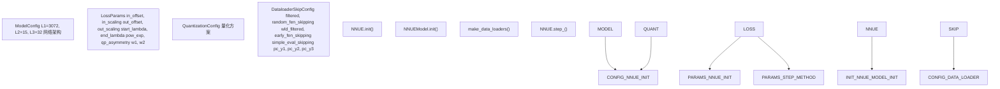
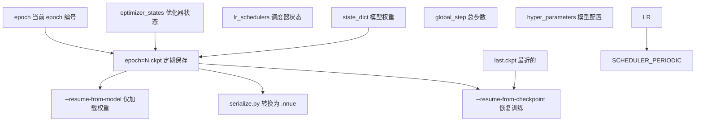
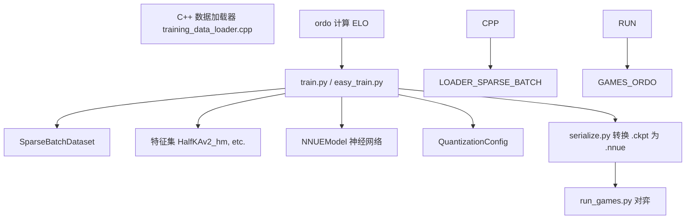

# 训练系统

-   [data\_loader/\_\_init\_\_.py](https://github.com/Chesszyh/nnue-pytorch/blob/024b2064/data_loader/__init__.py)
-   [data\_loader/\_native.py](https://github.com/Chesszyh/nnue-pytorch/blob/024b2064/data_loader/_native.py)
-   [data\_loader/config.py](https://github.com/Chesszyh/nnue-pytorch/blob/024b2064/data_loader/config.py)
-   [model/config.py](https://github.com/Chesszyh/nnue-pytorch/blob/024b2064/model/config.py)
-   [model/lightning\_module.py](https://github.com/Chesszyh/nnue-pytorch/blob/024b2064/model/lightning_module.py)
-   [scripts/easy\_train.py](https://github.com/Chesszyh/nnue-pytorch/blob/024b2064/scripts/easy_train.py)
-   [scripts/easy\_train\_example.bat](https://github.com/Chesszyh/nnue-pytorch/blob/024b2064/scripts/easy_train_example.bat)
-   [scripts/easy\_train\_example.sh](https://github.com/Chesszyh/nnue-pytorch/blob/024b2064/scripts/easy_train_example.sh)
-   [train.py](https://github.com/Chesszyh/nnue-pytorch/blob/024b2064/train.py)

## 目的与范围

训练系统提供了训练 NNUE 神经网络的基础设施，涵盖从简单的单 GPU 训练会话到带有自动评估的复杂多 GPU 编排。该系统集成了 PyTorch Lightning 进行训练管理，使用自定义数据加载器进行高效的局面加载，并具备各种监控和检查点功能。

本页面提供了训练架构及组件交互的高层概览。有关特定子系统的详细信息：

-   基础训练脚本的使用和配置：请参阅 [基础训练 (train.py)](#2.1)
-   多运行编排和 TUI 仪表板：请参阅 [高级编排 (easy\_train.py)](#2.2)
-   损失函数实现和参数：请参阅 [损失函数和训练配置](#2.3)
-   优化器配置和调度：请参阅 [优化器和学习率调度](#2.4)
-   数据加载流水线：请参阅 [数据流水线](#3)
-   模型架构细节：请参阅 [模型架构](#4)

## 三层训练架构

训练系统组织为三个不同的层级，每一层都有特定的职责：

```mermaid
flowchart TD
    CLI["命令行参数 --features, --lambda, --gpus, etc."]
    USER["用户/研究员"]
    EASY_TRAIN["easy_train.py 多运行管理"]
    ENV_CHECK["环境验证 Python/CMake/GCC 版本"]
    DEP_SETUP["依赖项设置 ordo, c-chess-cli, stockfish"]
    MULTI_RUN["TrainingRun 线程 GPU 分配 超参数变体"]
    TUI["TUI 仪表板 实时监控"]
    NET_TEST["NetworkTesting 线程 自动 ELO 评估"]
    TRAIN_PY["train.py 训练配置"]
    ARG_PARSE["参数解析 特征集选择"]
    LOADER_SETUP["数据加载器设置 SparseBatchDataset FixedNumBatchesDataset"]
    MODEL_INIT["模型初始化 NNUE(feature_set, config)"]
    TRAINER_SETUP["Lightning Trainer 回调 + Logger"]
    FIT["trainer.fit() 训练执行"]
    LIGHTNING["NNUE Lightning 模块 model/lightning_module.py"]
    TRAIN_STEP["training_step() 前向 + 损失"]
    VAL_STEP["validation_step() 验证指标"]
    OPT_STEP["configure_optimizers() Ranger21 + StepLR"]
    CALLBACKS["回调 WeightClippingCallback ModelCheckpoint TimeLimitAfterCheckpoint"]

    USER --> CLI
    CLI --> EASY_TRAIN
    CLI --> TRAIN_PY
    EASY --> TRAIN_ENV_CHECK
    ENV --> CHECK_DEP_SETUP
    DEP --> SETUP_MULTI_RUN
    MULTI --> RUN_TUI
    MULTI --> RUN_NET_TEST
    MULTI --> RUN_TRAIN_PY
    TRAIN --> PY_ARG_PARSE
    ARG --> PARSE_LOADER_SETUP
    ARG --> PARSE_MODEL_INIT
    LOADER --> SETUP_TRAINER_SETUP
    MODEL --> INIT_TRAINER_SETUP
    TRAINER --> SETUP_FIT
    FIT --> LIGHTNING
    LIGHTNING --> TRAIN_STEP
    LIGHTNING --> VAL_STEP
    LIGHTNING --> OPT_STEP
    LIGHTNING --> CALLBACKS
```


**来源：** [train.py1-550](https://github.com/Chesszyh/nnue-pytorch/blob/024b2064/train.py#L1-L550) [scripts/easy\_train.py709-967](https://github.com/Chesszyh/nnue-pytorch/blob/024b2064/scripts/easy_train.py#L709-L967) [model/lightning\_module.py16-162](https://github.com/Chesszyh/nnue-pytorch/blob/024b2064/model/lightning_module.py#L16-L162)

## 训练执行流程

下图显示了从训练启动到创建检查点的完整流程：

```mermaid
flowchart TD
    ARGS["命令行参数"]
    DATASETS["训练数据集 .binpack 文件"]
    VAL_DATASETS["验证数据集（可选）"]
    PARSE["main() 参数解析"]
    FEATURE_SET["get_feature_set_from_name() 特征选择"]
    LOSS_PARAMS["LossParams 损失配置"]
    DATA_CONFIG["DataloaderSkipConfig 过滤规则"]
    MAKE_LOADERS["make_data_loaders()"]
    TRAIN_DS["SparseBatchDataset (训练)"]
    VAL_DS["SparseBatchDataset (验证)"]
    FIXED_TRAIN["FixedNumBatchesDataset (epoch_size 批次)"]
    FIXED_VAL["FixedNumBatchesDataset (validation_size 批次)"]
    CREATE_NNUE["NNUE() Lightning 模块"]
    NNUE_MODEL["NNUEModel 神经网络"]
    COMPILE["torch.compile() JIT 优化"]
    TRAINER["L.Trainer()"]
    TB_LOGGER["TensorBoardLogger"]
    CKPT_CB["ModelCheckpoint 回调"]
    TIME_CB["TimeLimitAfterCheckpoint"]
    CLIP_CB["WeightClippingCallback"]
    TRAINER_FIT["trainer.fit(nnue, train, val)"]
    EPOCH_LOOP["对于每个 epoch"]
    BATCH_LOOP["对于每个 batch"]
    TRAIN_STEP_CALL["nnue.training_step()"]
    LOSS_CALC["损失计算"]
    BACKWARD["反向传播"]
    OPT_UPDATE["优化器步骤"]
    CKPT_SAVE["检查点保存"]
    CKPT_FILES["检查点文件 epoch=N.ckpt"]
    LOGS["TensorBoard 日志"]
    FINISHED["training_finished 标记"]

    ARGS --> PARSE
    DATASETS --> PARSE
    VAL --> DATASETS_PARSE
    PARSE --> FEATURE_SET
    PARSE --> LOSS_PARAMS
    PARSE --> DATA_CONFIG
    FEATURE --> SET_MAKE_LOADERS
    DATA --> CONFIG_MAKE_LOADERS
    MAKE --> LOADERS_TRAIN_DS
    MAKE --> LOADERS_VAL_DS
    TRAIN --> DS_FIXED_TRAIN
    VAL --> DS_FIXED_VAL
    FEATURE --> SET_CREATE_NNUE
    LOSS --> PARAMS_CREATE_NNUE
    CREATE --> NNUE_NNUE_MODEL
    CREATE --> NNUE_COMPILE
    COMPILE --> TRAINER
    TRAINER --> TB_LOGGER
    TRAINER --> CKPT_CB
    TRAINER --> TIME_CB
    TRAINER --> CLIP_CB
    TRAINER --> TRAINER_FIT
    FIXED --> TRAIN_TRAINER_FIT
    FIXED --> VAL_TRAINER_FIT
    TRAINER --> FIT_EPOCH_LOOP
    EPOCH --> LOOP_BATCH_LOOP
    BATCH --> LOOP_TRAIN_STEP_CALL
    TRAIN --> STEP_CALL_LOSS_CALC
    LOSS --> CALC_BACKWARD
    BACKWARD --> OPT_UPDATE
    OPT --> UPDATE_BATCH_LOOP
    EPOCH --> LOOP_CKPT_SAVE
    CKPT --> SAVE_CKPT_FILES
    TRAIN --> STEP_CALL_LOGS
    EPOCH --> LOOP_FINISHED
```


**来源：** [train.py107-550](https://github.com/Chesszyh/nnue-pytorch/blob/024b2064/train.py#L107-L550) [train.py44-89](https://github.com/Chesszyh/nnue-pytorch/blob/024b2064/train.py#L44-L89) [model/lightning\_module.py29-162](https://github.com/Chesszyh/nnue-pytorch/blob/024b2064/model/lightning_module.py#L29-L162)

## 核心组件

### train.py - 主训练脚本

`train.py` 脚本作为训练的主要入口点。主要职责：

| 职责 | 实现 | 行引用 |
| --- | --- | --- |
| 参数解析 | 带有 30+ 个训练参数的 `argparse.ArgumentParser` | [train.py108-378](https://github.com/Chesszyh/nnue-pytorch/blob/024b2064/train.py#L108-L378) |
| 数据加载器创建 | `make_data_loaders()` 函数 | [train.py44-89](https://github.com/Chesszyh/nnue-pytorch/blob/024b2064/train.py#L44-L89) |
| 模型初始化 | `NNUE()` Lightning 模块实例化 | [train.py428-438](https://github.com/Chesszyh/nnue-pytorch/blob/024b2064/train.py#L428-L438) |
| 训练编排 | `L.Trainer.fit()` | [train.py541-543](https://github.com/Chesszyh/nnue-pytorch/blob/024b2064/train.py#L541-L543) |
| 检查点管理 | `ModelCheckpoint` 回调 | [train.py490-494](https://github.com/Chesszyh/nnue-pytorch/blob/024b2064/train.py#L490-L494) |

**关键函数：**

-   `make_data_loaders(train_filenames, val_filenames, feature_set, num_workers, batch_size, config, epoch_size, val_size)`：创建包装了 C++ 数据加载器的 PyTorch DataLoader，使用 `SparseBatchDataset` 和 `FixedNumBatchesDataset` [train.py44-89](https://github.com/Chesszyh/nnue-pytorch/blob/024b2064/train.py#L44-L89)
-   `main()`：编排整个训练设置和执行 [train.py107-547](https://github.com/Chesszyh/nnue-pytorch/blob/024b2064/train.py#L107-L547)

**来源：** [train.py1-553](https://github.com/Chesszyh/nnue-pytorch/blob/024b2064/train.py#L1-L553)

### NNUE Lightning 模块

`NNUE` 类（位于 `model/lightning_module.py`）是一个封装了神经网络和训练逻辑的 PyTorch Lightning 模块：

```mermaid
flowchart TD
    MODEL["self.model: NNUEModel 实际的神经网络"]
    LOSS_PARAMS["self.loss_params: LossParams 损失配置"]
    LR_PARAMS["self.lr, self.gamma 学习率参数"]
    MAX_EPOCH["self.max_epoch 训练时长"]
    FORWARD["forward(*args, **kwargs) 委托给 self.model"]
    TRAIN_STEP["training_step(batch, batch_idx) 计算训练损失"]
    VAL_STEP["validation_step(batch, batch_idx) 计算验证损失"]
    STEP_["step_(batch, batch_idx, loss_type) 共享损失计算"]
    CONFIG_OPT["configure_optimizers() 设置 Ranger21 + StepLR"]
    UNPACK["解包 batch 元组 us, them, indices, values, etc."]
    MODEL_FWD["scorenet = self.model(...) 前向传播"]
    Q_CALC["q = (scorenet - offset) / scaling 网络胜率"]
    P_CALC["p = (score - offset) / scaling 搜索胜率"]
    BLEND["pt = p * lambda + outcome * (1-lambda) 混合评估和结果"]
    LOSS_CALC["loss = pow(abs(pt - q), pow_exp) 幂损失函数"]
    WEIGHTS["应用局面权重 基于 p 距离 0.5 的程度"]

    MODEL --> FORWARD
    MODEL --> TRAIN_STEP
    MODEL --> VAL_STEP
    LOSS --> PARAMS_STEP_
    LR --> PARAMS_CONFIG_OPT
    TRAIN --> STEP_STEP_
    VAL --> STEP_STEP_
    STEP --> _UNPACK
    UNPACK --> MODEL_FWD
    MODEL --> FWD_Q_CALC
    MODEL --> FWD_P_CALC
    P --> CALC_BLEND
    Q --> CALC_BLEND
    BLEND --> LOSS_CALC
    LOSS --> CALC_WEIGHTS
```


**来源：** [model/lightning\_module.py16-162](https://github.com/Chesszyh/nnue-pytorch/blob/024b2064/model/lightning_module.py#L16-L162)

`step_()` 中的损失计算实现了一种复杂的基于胜-平-负 (WDL) 的训练方法：

1.  **网络评估转胜率**：使用 sigmoid 变换将网络的厘兵分数转换为胜率 [model/lightning\_module.py90-92](https://github.com/Chesszyh/nnue-pytorch/blob/024b2064/model/lightning_module.py#L90-L92)
2.  **搜索评估转胜率**：将搜索分数（来自训练数据）转换为胜率 [model/lightning\_module.py94-96](https://github.com/Chesszyh/nnue-pytorch/blob/024b2064/model/lightning_module.py#L94-L96)
3.  **Lambda 插值**：根据随 epoch 插值的 `lambda` 参数，混合基于搜索的概率和实际游戏结果 [model/lightning\_module.py98-103](https://github.com/Chesszyh/nnue-pytorch/blob/024b2064/model/lightning_module.py#L98-L103)
4.  **幂损失 (Power loss)**：应用幂律损失函数（默认指数 2.5）[model/lightning\_module.py106](https://github.com/Chesszyh/nnue-pytorch/blob/024b2064/model/lightning_module.py#L106-L106)
5.  **局面加权**：根据局面的搜索评估进行加权，强调关键局面 [model/lightning\_module.py110-111](https://github.com/Chesszyh/nnue-pytorch/blob/024b2064/model/lightning_module.py#L110-L111)

**来源：** [model/lightning\_module.py57-115](https://github.com/Chesszyh/nnue-pytorch/blob/024b2064/model/lightning_module.py#L57-L115)

### 配置对象

训练系统使用几个配置数据类 (dataclasses)：


**来源：** [model/config.py1-25](https://github.com/Chesszyh/nnue-pytorch/blob/024b2064/model/config.py#L1-L25) [data\_loader/config.py1-43](https://github.com/Chesszyh/nnue-pytorch/blob/024b2064/data_loader/config.py#L1-L43)

| 配置类 | 目的 | 关键参数 | 文件 |
| --- | --- | --- | --- |
| `ModelConfig` | 网络架构维度 | `L1` (特征变换器大小), `L2`, `L3` (层堆栈大小) | [model/config.py5-10](https://github.com/Chesszyh/nnue-pytorch/blob/024b2064/model/config.py#L5-L10) |
| `LossParams` | 损失函数行为 | `in_offset`, `in_scaling`, `out_offset`, `out_scaling`, `start_lambda`, `end_lambda`, `pow_exp` | [model/config.py13-25](https://github.com/Chesszyh/nnue-pytorch/blob/024b2064/model/config.py#L13-L25) |
| `QuantizationConfig` | 量化设置 | 权重和偏置的量化方案 | 在导入中引用 |
| `DataloaderSkipConfig` | 数据过滤 | `filtered`, `random_fen_skipping`, `wld_filtered`, `early_fen_skipping`, `pc_y1/y2/y3` | [data\_loader/config.py5-43](https://github.com/Chesszyh/nnue-pytorch/blob/024b2064/data_loader/config.py#L5-L43) |

**来源：** [model/config.py1-25](https://github.com/Chesszyh/nnue-pytorch/blob/024b2064/model/config.py#L1-L25) [data\_loader/config.py1-43](https://github.com/Chesszyh/nnue-pytorch/blob/024b2064/data_loader/config.py#L1-L43)

### 训练回调

PyTorch Lightning 回调在训练循环中提供了扩展点：


**来源：** [train.py21-42](https://github.com/Chesszyh/nnue-pytorch/blob/024b2064/train.py#L21-L42) [train.py504-509](https://github.com/Chesszyh/nnue-pytorch/blob/024b2064/train.py#L504-L509)

`TimeLimitAfterCheckpoint` 回调对于长时间运行的训练尤为重要：

-   接受 `DD:HH:MM:SS` 格式的时间限制 [train.py23-29](https://github.com/Chesszyh/nnue-pytorch/blob/024b2064/train.py#L23-L29)
-   在训练开始时记录开始时间 [train.py32-33](https://github.com/Chesszyh/nnue-pytorch/blob/024b2064/train.py#L32-L33)
-   在每个 epoch 后检查经过的时间并优雅地停止训练 [train.py35-41](https://github.com/Chesszyh/nnue-pytorch/blob/024b2064/train.py#L35-L41)

**来源：** [train.py21-42](https://github.com/Chesszyh/nnue-pytorch/blob/024b2064/train.py#L21-L42)

## 使用 easy\_train.py 进行多 GPU 编排

`easy_train.py` 脚本为复杂的训练场景提供了高层编排：

```mermaid
flowchart TD
    MAIN["main() 函数 解析参数 设置工作区"]
    ENV_VAL["validate_environment_requirements() 检查 Python, CMake, GCC 检查包"]
    DEP_SETUP["设置依赖项 ordo, c-chess-cli 构建或下载"]
    TRAINING_RUN["TrainingRun 类 每个训练运行一个线程"]
    RUN_THREAD["run() 方法 生成 train.py 子进程"]
    STATUS_PARSE["解析训练输出 提取 epoch, loss, speed"]
    ITERATION_PATTERN["ITERATION_PATTERN 正则表达式 提取进度"]
    TUI_DASHBOARD["TUI 仪表板 asciimatics 框架"]
    RESOURCE_MON["SystemResourcesMonitor GPU/CPU/RAM 使用率"]
    NET_TESTING["NetworkTesting 线程 使用 c-chess-cli 对弈 使用 ordo 计算 ELO"]
    GPU_ASSIGN["GPU 分配 runs-per-gpu 参数"]
    HYPERPARAMS["超参数变体 不同的 seed, lambda 值"]
    CONCURRENT["并发执行 多个 TrainingRun 线程"]

    MAIN --> ENV_VAL
    ENV --> VAL_DEP_SETUP
    DEP --> SETUP_TRAINING_RUN
    TRAINING --> RUN_RUN_THREAD
    RUN --> THREAD_STATUS_PARSE
    STATUS --> PARSE_ITERATION_PATTERN
    TRAINING --> RUN_TUI_DASHBOARD
    TUI --> DASHBOARD_RESOURCE_MON
    TUI --> DASHBOARD_NET_TESTING
    TRAINING --> RUN_GPU_ASSIGN
    GPU --> ASSIGN_HYPERPARAMS
    HYPERPARAMS --> CONCURRENT
```


**来源：** [scripts/easy\_train.py1-2300](https://github.com/Chesszyh/nnue-pytorch/blob/024b2064/scripts/easy_train.py#L1-L2300)

### TrainingRun 类

`TrainingRun` 类管理单独的训练进程：

| 方法/属性 | 目的 | 行引用 |
| --- | --- | --- |
| `__init__()` | 初始化训练参数，GPU 分配 | [scripts/easy\_train.py722-802](https://github.com/Chesszyh/nnue-pytorch/blob/024b2064/scripts/easy_train.py#L722-L802) |
| `run()` | 作为子进程执行 train.py，解析输出 | [scripts/easy\_train.py859-967](https://github.com/Chesszyh/nnue-pytorch/blob/024b2064/scripts/easy_train.py#L859-L967) |
| `_get_stringified_args()` | 将参数转换为命令行参数 | [scripts/easy\_train.py803-857](https://github.com/Chesszyh/nnue-pytorch/blob/024b2064/scripts/easy_train.py#L803-L857) |
| `ITERATION_PATTERN` | 用于解析 PyTorch Lightning 输出的正则表达式 | [scripts/easy\_train.py718-720](https://github.com/Chesszyh/nnue-pytorch/blob/024b2064/scripts/easy_train.py#L718-L720) |
| `current_epoch`, `current_loss` | 训练进度跟踪 | [scripts/easy\_train.py788-789](https://github.com/Chesszyh/nnue-pytorch/blob/024b2064/scripts/easy_train.py#L788-L789) |
| `smooth_iterations_per_second` | 训练速度的衰减平均值 | [scripts/easy\_train.py791](https://github.com/Chesszyh/nnue-pytorch/blob/024b2064/scripts/easy_train.py#L791-L791) |

**来源：** [scripts/easy\_train.py709-1034](https://github.com/Chesszyh/nnue-pytorch/blob/024b2064/scripts/easy_train.py#L709-L1034)

### easy\_train.py 的关键特性

1.  **环境验证**：检查所需的 Python (≥3.7), CMake (≥3.4), GCC (≥9.2) 和包 (torch, lightning, cupy, GPUtil) 版本 [scripts/easy\_train.py26-261](https://github.com/Chesszyh/nnue-pytorch/blob/024b2064/scripts/easy_train.py#L26-L261)

2.  **依赖管理**：如果不存在，自动下载和构建 ordo 和 c-chess-cli [scripts/easy\_train.py296-301](https://github.com/Chesszyh/nnue-pytorch/blob/024b2064/scripts/easy_train.py#L296-L301)

3.  **多运行执行**：使用不同的 GPU 分配和超参数生成多个训练运行 [scripts/easy\_train.py709-1034](https://github.com/Chesszyh/nnue-pytorch/blob/024b2064/scripts/easy_train.py#L709-L1034)

4.  **实时 TUI 仪表板**：使用 asciimatics 显示训练进度、资源使用情况和网络排名 [scripts/easy\_train.py268-284](https://github.com/Chesszyh/nnue-pytorch/blob/024b2064/scripts/easy_train.py#L268-L284)

5.  **自动网络测试**：定期通过对弈和计算 ELO 评分来评估训练好的网络 [参考架构](https://github.com/Chesszyh/nnue-pytorch/blob/024b2064/Referenced in architecture)

6.  **恢复训练**：可以自动从最新的检查点恢复 [scripts/easy\_train.py839-843](https://github.com/Chesszyh/nnue-pytorch/blob/024b2064/scripts/easy_train.py#L839-L843)


**来源：** [scripts/easy\_train.py1-2300](https://github.com/Chesszyh/nnue-pytorch/blob/024b2064/scripts/easy_train.py#L1-L2300)

## 训练参数

### train.py 的必要命令行参数

| 参数 | 类型 | 默认值 | 描述 |
| --- | --- | --- | --- |
| `datasets` | list\[str\] | required | 训练数据集文件 (.binpack) |
| `--validation-data` | list\[str\] | None | 单独的验证数据集 |
| `--features` | str | required | 特征集名称 (例如 "HalfKAv2\_hm^") |
| `--gpus` | str | None | 要使用的 GPU ID (例如 "0,1,2") |
| `--batch-size` | int | 16384 | 每批次局面数 |
| `--max-epochs` | int | 800 | 最大训练 epoch 数 |
| `--lr` | float | 8.75e-4 | 初始学习率 |
| `--gamma` | float | 0.992 | 每个 epoch 的 LR 衰减 |
| `--lambda` | float | 1.0 | 评估与结果的权重 (1.0 = 纯评估) |
| `--start-lambda` | float | None | 第一个 epoch 的 Lambda |
| `--end-lambda` | float | None | 最后一个 epoch 的 Lambda |
| `--l1` | int | 3072 | 特征变换器输出大小 |
| `--epoch-size` | int | 100M | 每个 epoch 的局面数 |
| `--validation-size` | int | 0 | 验证的局面数 |
| `--num-workers` | int | 1 | 数据加载器线程数 |
| `--threads` | int | auto | PyTorch 线程数 |
| `--random-fen-skipping` | int | 3 | 随机跳过 N 个局面 |
| `--no-smart-fen-skipping` | flag | False | 禁用智能局面过滤 |
| `--no-wld-fen-skipping` | flag | False | 禁用 WLD 过滤 |
| `--network-save-period` | int | 20 | 检查点之间的 epoch 数 |
| `--resume-from-checkpoint` | str | None | 从 .ckpt 文件恢复 |

**来源：** [train.py108-375](https://github.com/Chesszyh/nnue-pytorch/blob/024b2064/train.py#L108-L375)

### 数据过滤参数

`DataloaderSkipConfig` 控制用于训练的局面：

| 参数 | 类型 | 默认值 | 目的 |
| --- | --- | --- | --- |
| `filtered` | bool | True | 启用智能 FEN 过滤 |
| `random_fen_skipping` | int | 3 | 使用前随机跳过 N 个局面 |
| `wld_filtered` | bool | True | 基于胜/平/负分布过滤 |
| `early_fen_skipping` | int | \-1 | 跳过游戏的前 N 个 ply |
| `simple_eval_skipping` | int | \-1 | 跳过 abs(eval) < N 的局面 |
| `param_index` | int | 0 | 参数扫描索引 |
| `pc_y1`, `pc_y2`, `pc_y3` | float | 1.0, 2.0, 1.0 | 棋子数量分布控制 |

**来源：** [data\_loader/config.py5-15](https://github.com/Chesszyh/nnue-pytorch/blob/024b2064/data_loader/config.py#L5-L15) [train.py257-280](https://github.com/Chesszyh/nnue-pytorch/blob/024b2064/train.py#L257-L280) [train.py327-376](https://github.com/Chesszyh/nnue-pytorch/blob/024b2064/train.py#L327-L376)

## 训练工作流

### 基础训练会话

一个典型的训练会话流程如下：

> **[Mermaid sequence]**
> *(图表结构无法解析)*

**来源：** [train.py107-547](https://github.com/Chesszyh/nnue-pytorch/blob/024b2064/train.py#L107-L547) [model/lightning\_module.py57-161](https://github.com/Chesszyh/nnue-pytorch/blob/024b2064/model/lightning_module.py#L57-L161)

### 使用 easy\_train.py 进行多次运行训练

对于具有多个并发运行的高级训练场景：

> **[Mermaid sequence]**
> *(图表结构无法解析)*

**来源：** [scripts/easy\_train.py709-967](https://github.com/Chesszyh/nnue-pytorch/blob/024b2064/scripts/easy_train.py#L709-L967)

## 检查点管理

### 检查点文件

PyTorch Lightning 自动保存具有以下结构的检查点：


**来源：** [train.py490-494](https://github.com/Chesszyh/nnue-pytorch/blob/024b2064/train.py#L490-L494) [train.py282-290](https://github.com/Chesszyh/nnue-pytorch/blob/024b2064/train.py#L282-L290) [scripts/easy\_train.py596-698](https://github.com/Chesszyh/nnue-pytorch/blob/024b2064/scripts/easy_train.py#L596-L698)

`ModelCheckpoint` 回调配置：

-   `save_last=True`：始终将最近的检查点保存为 `last.ckpt` [train.py491](https://github.com/Chesszyh/nnue-pytorch/blob/024b2064/train.py#L491-L491)
-   `every_n_epochs=network_save_period`：保存定期检查点（默认：每 20 个 epoch）[train.py492](https://github.com/Chesszyh/nnue-pytorch/blob/024b2064/train.py#L492-L492)
-   `save_top_k=-1`：保存所有定期检查点（不删除）[train.py493](https://github.com/Chesszyh/nnue-pytorch/blob/024b2064/train.py#L493-L493)

**来源：** [train.py490-494](https://github.com/Chesszyh/nnue-pytorch/blob/024b2064/train.py#L490-L494)

### 检查点工具

`easy_train.py` 中的两个实用函数协助检查点管理：

```
# 通过创建时间查找最近的检查点
def find_latest_checkpoint(root_dir):
    """Returns path to .ckpt with latest creation date"""
    # Implementation: <FileRef file-url="https://github.com/Chesszyh/nnue-pytorch/blob/024b2064/scripts/easy_train.py#L596-L605" min=596 max=605 file-path="scripts/easy_train.py">Hii</FileRef>

# 基于 ELO 评分查找最佳检查点
def find_best_checkpoint(root_dir):
    """Returns path to .ckpt with highest ELO from ordo.out"""
    # Implementation: <FileRef file-url="https://github.com/Chesszyh/nnue-pytorch/blob/024b2064/scripts/easy_train.py#L661-L698" min=661 max=698 file-path="scripts/easy_train.py">Hii</FileRef>
```
**来源：** [scripts/easy\_train.py596-698](https://github.com/Chesszyh/nnue-pytorch/blob/024b2064/scripts/easy_train.py#L596-L698)

## 训练性能考量

### 批次大小选择

批次大小显著影响训练性能和内存使用：

| 批次大小 | GPU 内存 | 训练速度 | 梯度噪声 |
| --- | --- | --- | --- |
| 1024-2048 | 低 (~2GB) | 每个 epoch 较慢 | 较高噪声 |
| 8192 | 中 (~4GB) | 均衡 | 中等噪声 |
| 16384 | 高 (~8GB) | 每个 epoch 较快 | 较低噪声 |
| 32768+ | 极高 | 每个 epoch 最快 | 最低噪声 |

默认值：GPU 训练为 16384 [train.py404-407](https://github.com/Chesszyh/nnue-pytorch/blob/024b2064/train.py#L404-L407)

**来源：** [train.py232-237](https://github.com/Chesszyh/nnue-pytorch/blob/024b2064/train.py#L232-L237)

### 线程配置

系统使用多个线程参数：

| 参数 | 目的 | 默认值 | 配置 |
| --- | --- | --- | --- |
| `--num-workers` | C++ 数据加载器线程 | 1 | [train.py225-230](https://github.com/Chesszyh/nnue-pytorch/blob/024b2064/train.py#L225-L230) |
| `--threads` | PyTorch 线程 | auto (CPU 核心数) | [train.py239-244](https://github.com/Chesszyh/nnue-pytorch/blob/024b2064/train.py#L239-L244) |
| GPU streams | CUDA 内核并行 | auto | 由 PyTorch 管理 |

**来源：** [train.py225-244](https://github.com/Chesszyh/nnue-pytorch/blob/024b2064/train.py#L225-L244) [train.py480-482](https://github.com/Chesszyh/nnue-pytorch/blob/024b2064/train.py#L480-L482)

### Epoch 大小

`--epoch-size` 参数控制每个 epoch 的局面数（默认：100M）：

-   较大的 epoch 大小：检查点之间有更多局面，反馈较慢
-   较小的 epoch 大小：更频繁的检查点，反馈较快
-   典型范围：100万 到 1亿 局面 [train.py306-311](https://github.com/Chesszyh/nnue-pytorch/blob/024b2064/train.py#L306-L311)

每个 epoch 的实际批次数计算为：`(epoch_size + batch_size - 1) // batch_size` [train.py73](https://github.com/Chesszyh/nnue-pytorch/blob/024b2064/train.py#L73-L73)

**来源：** [train.py306-311](https://github.com/Chesszyh/nnue-pytorch/blob/024b2064/train.py#L306-L311) [train.py72-74](https://github.com/Chesszyh/nnue-pytorch/blob/024b2064/train.py#L72-L74)

## 与其他系统的集成

训练系统与几个其他子系统集成：


有关连接系统的详细信息：

-   **从 .binpack 文件加载数据：** [数据流水线](#3)
-   **特征提取和网络架构：** [模型架构](#4)
-   **将检查点转换为可部署格式：** [模型序列化](#5)
-   **对弈和计算 ELO：** [评估和测试](#7)

**来源：** [train.py1-553](https://github.com/Chesszyh/nnue-pytorch/blob/024b2064/train.py#L1-L553) [scripts/easy\_train.py1-2300](https://github.com/Chesszyh/nnue-pytorch/blob/024b2064/scripts/easy_train.py#L1-L2300)