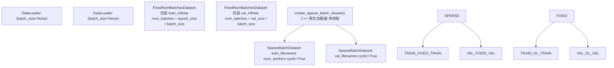
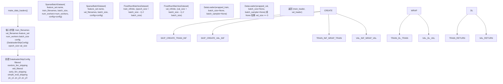
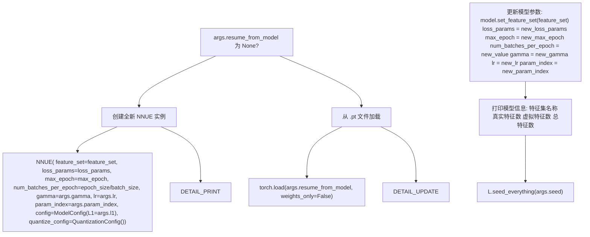
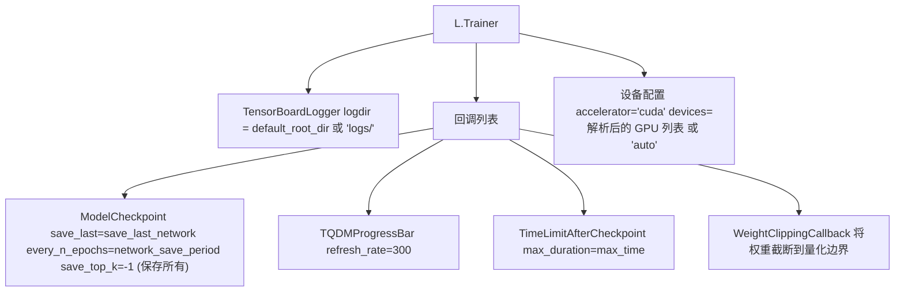
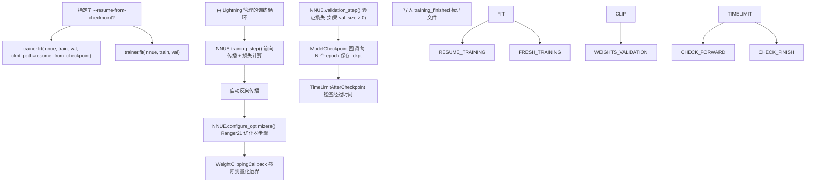

# 基础训练 (train.py)

-   [data_loader/__init__.py](https://github.com/Chesszyh/nnue-pytorch/blob/024b2064/data_loader/__init__.py)
-   [data_loader/_native.py](https://github.com/Chesszyh/nnue-pytorch/blob/024b2064/data_loader/_native.py)
-   [data_loader/config.py](https://github.com/Chesszyh/nnue-pytorch/blob/024b2064/data_loader/config.py)
-   [model/config.py](https://github.com/Chesszyh/nnue-pytorch/blob/024b2064/model/config.py)
-   [model/lightning_module.py](https://github.com/Chesszyh/nnue-pytorch/blob/024b2064/model/lightning_module.py)
-   [train.py](https://github.com/Chesszyh/nnue-pytorch/blob/024b2064/train.py)

## 目的与范围

本文档描述了 `train.py`，这是训练 NNUE 神经网络的主要脚本。该脚本提供了一个命令行接口，用于使用 PyTorch Lightning 配置和执行单次训练运行。它处理数据加载、模型初始化、训练循环编排和检查点管理。

有关带有自动评估的多 GPU 编排，请参阅 [高级编排 (easy_train.py)](#2.2)。有关损失计算和超参数的详细信息，请参阅 [损失函数和训练配置](#2.3)。有关优化器详情，请参阅 [优化器和学习率调度](#2.4)。

**来源：** [train.py1-553](https://github.com/Chesszyh/nnue-pytorch/blob/024b2064/train.py#L1-L553)

## 概览

`train.py` 脚本通过以下方式编排整个训练过程：

1.  解析命令行参数以配置训练运行
2.  创建用于训练和验证数据的数据加载器
3.  初始化或恢复 NNUE 模型
4.  配置带有回调和日志记录器的 PyTorch Lightning Trainer
5.  通过 `trainer.fit()` 执行训练循环

```mermaid
flowchart TD
    START["main() 入口点"]
    PARSE["解析命令行参数 argparse (108-378 行)"]
    VALIDATE["验证数据集存在 检查文件路径"]
    CREATE_FEATURE["创建 FeatureSet get_feature_set_from_name()"]
    CREATE_LOSS["创建 LossParams 从 CLI 参数"]
    INIT_DECISION["从检查点恢复?"]
    INIT_FRESH["初始化全新 NNUE NNUE(feature_set, loss_params, ...)"]
    INIT_RESUME["从 .pt 文件加载 torch.load(resume_from_model)"]
    SEED["设置随机种子 L.seed_everything(args.seed)"]
    CREATE_LOADERS["创建数据加载器 make_data_loaders()"]
    SETUP_TRAINER["配置 Lightning Trainer 回调, logger, devices"]
    COMPILE["编译模型 torch.compile(nnue, backend)"]
    FIT_DECISION["从 .ckpt 恢复?"]
    FIT_RESUME["trainer.fit(nnue, train, val, ckpt_path=resume_from_checkpoint)"]
    FIT_FRESH["trainer.fit(nnue, train, val)"]
    FINISH["写入 training_finished 标记"]

    START --> PARSE
    PARSE --> VALIDATE
    VALIDATE --> CREATE_FEATURE
    CREATE --> FEATURE_CREATE_LOSS
    CREATE --> LOSS_INIT_DECISION
    INIT --> DECISION_INIT_RESUME
    INIT --> DECISION_INIT_FRESH
    INIT --> RESUME_SEED
    INIT --> FRESH_SEED
    SEED --> CREATE_LOADERS
    CREATE --> LOADERS_SETUP_TRAINER
    SETUP --> TRAINER_COMPILE
    COMPILE --> FIT_DECISION
    FIT --> DECISION_FIT_RESUME
    FIT --> DECISION_FIT_FRESH
    FIT --> RESUME_FINISH
    FIT --> FRESH_FINISH
```


**train.py 的执行流程**

**来源：** [train.py107-550](https://github.com/Chesszyh/nnue-pytorch/blob/024b2064/train.py#L107-L550)

## 命令行接口

脚本接受一组全面的命令行参数，分为几个类别：

### 数据参数

| 参数 | 类型 | 默认值 | 描述 |
| --- | --- | --- | --- |
| `datasets` | paths | *必须* | 训练数据集 (.bin/.binpack)。多个文件将在 chunk 级别交错 |
| `--validation-data` | paths | None | 单独的验证数据集。如果未指定，将重用训练数据 |
| `--num-workers` | int | 1 | 数据加载工作线程（C++ 加载器） |
| `--batch-size` | int | 16384 | 每批次局面数。如果未指定，自动设置为 16384 |

### 训练控制参数

| 参数 | 类型 | 默认值 | 描述 |
| --- | --- | --- | --- |
| `--max-epochs` | int | 800 | 最大训练 epoch 数 |
| `--max-time` | str | "30:00:00:00" | DD:HH:MM:SS 格式的时间限制 |
| `--epoch-size` | int | 100000000 | 每个 epoch 的局面数 |
| `--validation-size` | int | 0 | 每次验证步骤的局面数（0 = 无验证） |
| `--seed` | int | 42 | 用于可复现性的随机种子 |

### 模型架构参数

| 参数 | 类型 | 默认值 | 描述 |
| --- | --- | --- | --- |
| `--features` | str | varies | 特征集名称（例如 "HalfKAv2_hm^"） |
| `--l1` | int | 3072 | 特征变换器输出大小（L1 层大小） |

### 损失函数参数

| 参数 | 类型 | 默认值 | 描述 |
| --- | --- | --- | --- |
| `--lambda` | float | 1.0 | 评估 (1.0) 和游戏结果 (0.0) 之间的混合 |
| `--start-lambda` | float | None | 初始 lambda 值（启用 lambda 调度） |
| `--end-lambda` | float | None | 最终 lambda 值（启用 lambda 调度） |
| `--pow-exp` | float | 2.5 | 损失计算中幂律的指数 |
| `--qp-asymmetry` | float | 0.0 | 当 q > p 时非对称损失调整 |
| `--in-offset` | float | 270 | 输入分数到 WDL 转换的偏移量 |
| `--out-offset` | float | 270 | 输出分数到 WDL 转换的偏移量 |
| `--in-scaling` | float | 340 | 输入分数到 WDL 转换的缩放 |
| `--out-scaling` | float | 380 | 输出分数到 WDL 转换的缩放 |
| `--w1` | float | 0.0 | 权重提升参数 1 |
| `--w2` | float | 0.5 | 权重提升参数 2 |

### 优化器参数

| 参数 | 类型 | 默认值 | 描述 |
| --- | --- | --- | --- |
| `--lr` | float | 8.75e-4 | 初始学习率 |
| `--gamma` | float | 0.992 | 每个 epoch 的 LR 衰减因子 |

### 数据过滤参数

| 参数 | 类型 | 默认值 | 描述 |
| --- | --- | --- | --- |
| `--no-smart-fen-skipping` | flag | False | 禁用智能 FEN 过滤 |
| `--no-wld-fen-skipping` | flag | False | 禁用基于 WDL 的过滤 |
| `--random-fen-skipping` | int | 3 | 平均随机跳过 N 个局面 |
| `--early-fen-skipping` | int | -1 | 跳过游戏的前 N 个 ply（-1 = 禁用） |
| `--simple-eval-skipping` | int | -1 | 跳过 |eval| < N 的局面（-1 = 禁用） |
| `--pc-y1`, `--pc-y2`, `--pc-y3` | float | 1.0, 2.0, 1.0 | 棋子数量分布参数 |

### 检查点和日志参数

| 参数 | 类型 | 默认值 | 描述 |
| --- | --- | --- | --- |
| `--default-root-dir` | path | "logs/" | 日志和检查点的根目录 |
| `--gpus` | str | "auto" | GPU 设备 ID（例如 "0,1,2"） |
| `--resume-from-model` | path | None | 从 .pt 模型文件初始化 |
| `--resume-from-checkpoint` | path | None | 从 .ckpt 文件恢复训练 |
| `--network-save-period` | int | 20 | 每 N 个 epoch 保存一次检查点 |
| `--save-last-network` | bool | True | 始终保存最近的检查点 |

### 性能参数

| 参数 | 类型 | 默认值 | 描述 |
| --- | --- | --- | --- |
| `--threads` | int | -1 | PyTorch CPU 线程数（-1 = 自动） |
| `--compile-backend` | str | "inductor" | torch.compile 后端（"inductor" 或 "cudagraphs"） |

**来源：** [train.py108-378](https://github.com/Chesszyh/nnue-pytorch/blob/024b2064/train.py#L108-L378)

## 数据加载器创建

`make_data_loaders()` 函数创建用于训练和验证的 PyTorch DataLoader 实例。数据加载架构使用双层包装系统：


**数据加载器架构**

该函数实现此结构：

1.  **SparseBatchDataset**: C++ 数据加载器流的无限迭代器
2.  **FixedNumBatchesDataset**: 将无限流限制为每个 epoch 固定数量的批次
3.  **DataLoader**: PyTorch 包装器（使用 `batch_size=None`，因为批处理在 C++ 中完成）

**来源：** [train.py44-89](https://github.com/Chesszyh/nnue-pytorch/blob/024b2064/train.py#L44-L89)

### 数据加载器配置


**make_data_loaders() 函数流程**

**重要提示：** DataLoader 使用 `batch_size=None`，因为批处理完全由 C++ 数据加载器执行。Python DataLoader 仅迭代预先形成的批次。

**来源：** [train.py44-89](https://github.com/Chesszyh/nnue-pytorch/blob/024b2064/train.py#L44-L89) [data_loader/__init__.py1-19](https://github.com/Chesszyh/nnue-pytorch/blob/024b2064/data_loader/__init__.py#L1-L19)

## 模型初始化

脚本支持两种初始化模式：创建新模型或从保存的模型文件恢复。


**模型初始化路径**

### 全新模型初始化

当开始新的训练运行（无 `--resume-from-model`）时，脚本创建一个全新的 `NNUE` Lightning 模块：

-   **feature_set**：通过 `get_feature_set_from_name()` 从 `--features` 参数创建
-   **loss_params**：从损失相关的 CLI 参数构建（lambda, 偏移量, 缩放等）
-   **config**：带有来自 `--l1` 的 L1 大小的 `ModelConfig`
-   **quantize_config**：默认的 `QuantizationConfig` 实例
-   **训练超参数**：lr, gamma, max_epoch, num_batches_per_epoch

**来源：** [train.py427-438](https://github.com/Chesszyh/nnue-pytorch/blob/024b2064/train.py#L427-L438)

### 从模型恢复

当指定 `--resume-from-model` 时，脚本加载保存的 `.pt` 文件并更新特定参数：

-   **保留**：模型架构和学习到的权重
-   **更新**：特征集、损失参数、训练超参数 (lr, gamma, max_epoch)
-   **优化器**：训练开始时从头重新创建

这允许使用不同的超参数或损失配置进行微调。

**来源：** [train.py440-455](https://github.com/Chesszyh/nnue-pytorch/blob/024b2064/train.py#L440-L455)

## 训练器配置

PyTorch Lightning `Trainer` 配置了特定的回调、日志记录器和设备设置：


**训练器配置组件**

### 回调

训练器使用四个回调：

1.  **ModelCheckpoint** [train.py490-494](https://github.com/Chesszyh/nnue-pytorch/blob/024b2064/train.py#L490-L494)

    -   每 `--network-save-period` 个 epoch 保存一次检查点
    -   如果 `--save-last-network=True`，始终保存最后一个检查点
    -   `save_top_k=-1` 确保保留所有检查点
2.  **TQDMProgressBar** [train.py506](https://github.com/Chesszyh/nnue-pytorch/blob/024b2064/train.py#L506-L506)

    -   以 300ms 的刷新率显示训练进度
    -   显示损失和其他指标
3.  **TimeLimitAfterCheckpoint** [train.py21-41](https://github.com/Chesszyh/nnue-pytorch/blob/024b2064/train.py#L21-L41) [train.py507](https://github.com/Chesszyh/nnue-pytorch/blob/024b2064/train.py#L507-L507)

    -   监控已过的训练时间
    -   如果超过时间限制，在完成检查点后优雅地停止训练
    -   防止在训练结束时出现不完整的 epoch
4.  **WeightClippingCallback** [train.py508](https://github.com/Chesszyh/nnue-pytorch/blob/024b2064/train.py#L508-L508)

    -   将模型权重截断到有效的量化范围
    -   确保与量化推理的兼容性
    -   详情请参阅 [量化系统](#4.5)

**来源：** [train.py490-514](https://github.com/Chesszyh/nnue-pytorch/blob/024b2064/train.py#L490-L514) [train.py21-41](https://github.com/Chesszyh/nnue-pytorch/blob/024b2064/train.py#L21-L41)

### TensorBoard 日志记录器

训练指标记录到 TensorBoard：

-   **日志目录**：`<default_root_dir>/lightning_logs/version_N/`
-   **指标**：train_loss, val_loss, learning rate
-   **访问**：`tensorboard --logdir=logs/` 查看训练曲线

**来源：** [train.py486-488](https://github.com/Chesszyh/nnue-pytorch/blob/024b2064/train.py#L486-L488)

### 设备配置

GPU 设备选择：

-   **--gpus 参数**：逗号分隔的设备 ID（例如 "0,1,2"）
-   **默认**："auto"（使用所有可用 GPU）
-   **单 GPU**："0"
-   **仅 CPU**：未显式支持（需要修改代码）

**来源：** [train.py499-502](https://github.com/Chesszyh/nnue-pytorch/blob/024b2064/train.py#L499-L502)

## 模型编译

在训练开始之前，使用 PyTorch 2.0 的 `torch.compile()` 编译模型：

```
nnue = torch.compile(nnue, backend=args.compile_backend)
```
-   **后端选项**："inductor"（默认）或 "cudagraphs"
-   **inductor**：更适合大型网络，更灵活
-   **cudagraphs**：更适合小型网络，开销更低
-   **效果**：优化模型的前向传播以加快执行速度

**来源：** [train.py516](https://github.com/Chesszyh/nnue-pytorch/blob/024b2064/train.py#L516-L516)

## 训练执行

实际训练通过 Lightning Trainer 的 `fit()` 方法执行：


**训练执行流程**

### 从检查点恢复

当提供 `--resume-from-checkpoint` 时：

-   从 `.ckpt` 文件加载完整的训练状态
-   恢复模型权重、优化器状态和 epoch 计数器
-   从保存的 epoch 继续训练
-   用于从中断中恢复

**来源：** [train.py540-543](https://github.com/Chesszyh/nnue-pytorch/blob/024b2064/train.py#L540-L543)

### 训练循环细节

Lightning Trainer 管理训练循环，其中包括：

1.  **训练步骤 (Training Step)** (每批次)：

    -   调用 `NNUE.training_step()` [model/lightning_module.py117-118](https://github.com/Chesszyh/nnue-pytorch/blob/024b2064/model/lightning_module.py#L117-L118)
    -   计算通过模型的前向传播
    -   使用 WDL 插值损失函数计算损失
    -   Lightning 自动反向传播
2.  **优化器步骤 (Optimizer Step)**：

    -   Ranger21 优化器更新参数
    -   通过 StepLR 进行学习率调度
    -   请参阅 [优化器和学习率调度](#2.4)
3.  **权重截断 (Weight Clipping)**：

    -   `WeightClippingCallback` 在每个优化器步骤后截断权重
    -   保持量化边界
4.  **验证 (Validation)** (如果提供验证数据)：

    -   调用 `NNUE.validation_step()` [model/lightning_module.py120-121](https://github.com/Chesszyh/nnue-pytorch/blob/024b2064/model/lightning_module.py#L120-L121)
    -   计算验证损失，不进行梯度更新
5.  **检查点 (Checkpointing)**：

    -   每 `--network-save-period` 个 epoch 保存检查点
    -   如果启用，始终保存最后一个检查点
6.  **时间限制检查 (Time Limit Check)**：

    -   每次检查点后，检查是否超过 `--max-time`
    -   如果达到限制，优雅地停止训练

**来源：** [train.py496-543](https://github.com/Chesszyh/nnue-pytorch/blob/024b2064/train.py#L496-L543) [model/lightning_module.py16-162](https://github.com/Chesszyh/nnue-pytorch/blob/024b2064/model/lightning_module.py#L16-L162)

## 输出文件

训练产生几个输出文件：

### 检查点文件

位置：`<default_root_dir>/lightning_logs/version_N/checkpoints/`

| 文件模式 | 描述 |
| --- | --- |
| `epoch=N.ckpt` | 每 `--network-save-period` 个 epoch 保存的检查点 |
| `last.ckpt` | 最近的检查点（如果 `--save-last-network=True`） |

检查点内容：

-   模型权重和偏置
-   优化器状态（动量、方差估计）
-   学习率调度器状态
-   当前 epoch 编号
-   随机状态

### TensorBoard 日志

位置：`<default_root_dir>/lightning_logs/version_N/`

| 文件 | 描述 |
| --- | --- |
| `events.out.tfevents.*` | 包含指标的 TensorBoard 事件文件 |
| `hparams.yaml` | 超参数配置 |

### 训练完成标记

位置：`<default_root_dir>/training_finished`

训练成功完成时创建的空文件。由自动化脚本用于检测完成。

**来源：** [train.py484-546](https://github.com/Chesszyh/nnue-pytorch/blob/024b2064/train.py#L484-L546)

## 示例用法

### 基础训练

```
python train.py \
  train_data.binpack \
  --gpus 0 \
  --default_root_dir my_training \
  --features HalfKAv2_hm^ \
  --lambda 1.0 \
  --max-epochs 400
```
### 带验证数据的训练

```
python train.py \
  train1.binpack train2.binpack \
  --validation-data val.binpack \
  --gpus 0,1 \
  --batch-size 16384 \
  --epoch-size 100000000 \
  --validation-size 10000000
```
### 从检查点恢复

```
python train.py \
  train_data.binpack \
  --resume-from-checkpoint logs/lightning_logs/version_0/checkpoints/epoch=100.ckpt \
  --gpus 0 \
  --max-epochs 800
```
### 使用不同的损失参数进行微调

```
python train.py \
  train_data.binpack \
  --resume-from-model logs/lightning_logs/version_0/checkpoints/last.ckpt \
  --start-lambda 1.0 \
  --end-lambda 0.0 \
  --lr 1e-4 \
  --max-epochs 100
```
### 带数据过滤的训练

```
python train.py \
  train_data.binpack \
  --random-fen-skipping 5 \
  --early-fen-skipping 16 \
  --simple-eval-skipping 10 \
  --gpus 0
```
**来源：** [train.py1-553](https://github.com/Chesszyh/nnue-pytorch/blob/024b2064/train.py#L1-L553)

## 与其他组件的集成

`train.py` 脚本与几个其他系统组件集成：

-   **特征集**：通过 `--features` 选择，从 [model/features/](https://github.com/Chesszyh/nnue-pytorch/blob/024b2064/model/features/) 加载
-   **数据加载**：通过 [data_loader/](https://github.com/Chesszyh/nnue-pytorch/blob/024b2064/data_loader/) 包使用 C++ 数据加载器
-   **模型架构**：从 [model/model.py](https://github.com/Chesszyh/nnue-pytorch/blob/024b2064/model/model.py) 构建 `NNUEModel`
-   **Lightning 模块**：[model/lightning_module.py](https://github.com/Chesszyh/nnue-pytorch/blob/024b2064/model/lightning_module.py) 中的训练逻辑
-   **优化器**：来自 [ranger21.py](https://github.com/Chesszyh/nnue-pytorch/blob/024b2064/ranger21.py) 的 Ranger21
-   **回调**：来自 [model/model.py](https://github.com/Chesszyh/nnue-pytorch/blob/024b2064/model/model.py) 的权重截断
-   **序列化**：检查点可以使用 [serialize.py](https://github.com/Chesszyh/nnue-pytorch/blob/024b2064/serialize.py) 进行转换
-   **评估**：检查点可以使用 [run_games.py](https://github.com/Chesszyh/nnue-pytorch/blob/024b2064/run_games.py) 进行评估

**来源：** [train.py1-553](https://github.com/Chesszyh/nnue-pytorch/blob/024b2064/train.py#L1-L553)
