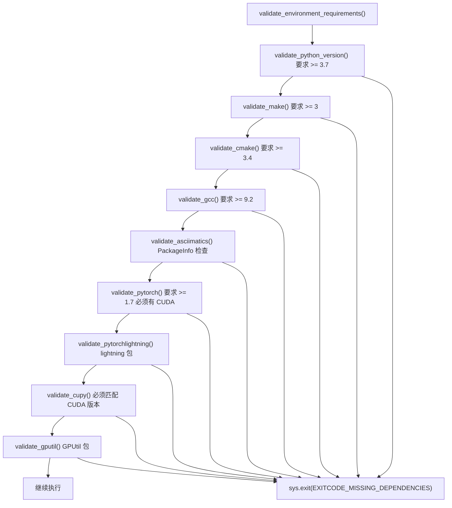
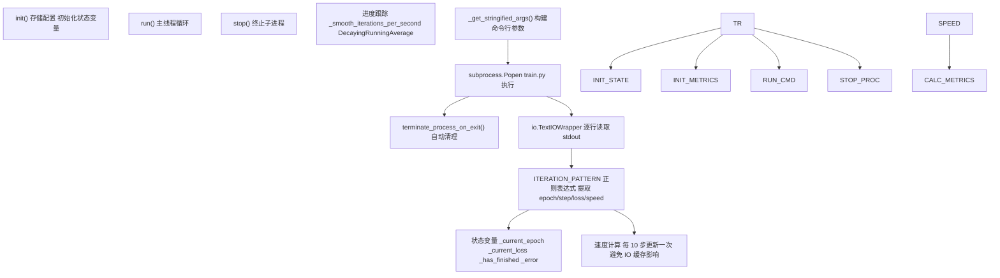
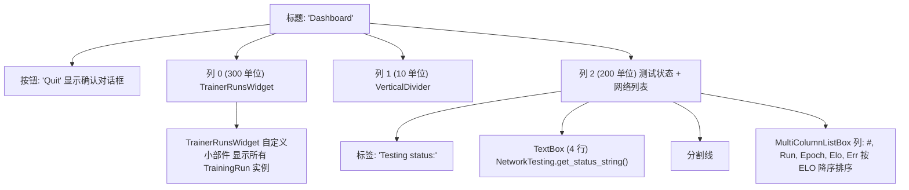
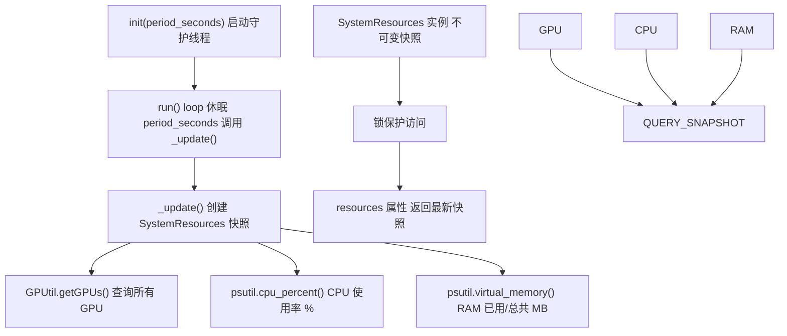
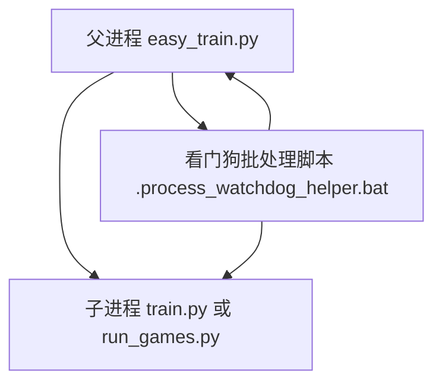

# 高级编排 (easy_train.py)

-   [scripts/easy_train.py](https://github.com/Chesszyh/nnue-pytorch/blob/024b2064/scripts/easy_train.py)
-   [scripts/easy_train_example.bat](https://github.com/Chesszyh/nnue-pytorch/blob/024b2064/scripts/easy_train_example.bat)
-   [scripts/easy_train_example.sh](https://github.com/Chesszyh/nnue-pytorch/blob/024b2064/scripts/easy_train_example.sh)

## 目的与范围

本页面记录了 `easy_train.py`，这是一个高级训练编排器，为训练和评估 NNUE 网络提供了一个自动化的、生产级的系统。它管理跨 GPU 的多个并发训练运行，通过国际象棋对弈自动评估生成的网络，并通过终端用户界面 (TUI) 提供实时监控。

对于基础的单次训练执行，请参阅 [基础训练 (train.py)](#2.1)。对于 `easy_train.py` 使用的底层评估系统，请参阅 [运行对弈 (run_games.py)](#7.1) 和 [使用 Ordo 计算 ELO](#7.2)。

**来源：** [scripts/easy_train.py1-30](https://github.com/Chesszyh/nnue-pytorch/blob/024b2064/scripts/easy_train.py#L1-L30)

## 概览

`easy_train.py` 脚本作为一个完整的训练编排框架，自动化了整个 NNUE 开发工作流：

1.  **环境验证** - 验证所有必需的依赖项（Python 包，系统工具）
2.  **自动依赖设置** - 下载并构建外部工具（ordo, c-chess-cli, stockfish）
3.  **多 GPU 训练编排** - 使用不同配置生成多个 `train.py` 进程
4.  **自动网络评估** - 通过国际象棋对弈持续测试网络
5.  **实时监控** - 提供显示训练进度、GPU 使用率和 ELO 排名的 TUI 仪表板

该脚本专为运行广泛的超参数搜索或长时间训练实验的研究人员设计，在这些场景中，自动评估和监控至关重要。

**来源：** [scripts/easy_train.py1-2952](https://github.com/Chesszyh/nnue-pytorch/blob/024b2064/scripts/easy_train.py#L1-L2952)

## 系统架构

下图展示了 `easy_train.py` 的主要组件及其关系：

```mermaid
flowchart TD
    MAIN["main() 参数解析 编排设置"]
    ENV_VAL["validate_environment_requirements() 检查 Python/GCC/CMake"]
    DEP_SETUP["依赖项设置函数 setup_ordo() setup_c_chess_cli() setup_stockfish() setup_nnue_pytorch()"]
    RES_MON["SystemResourcesMonitor 守护线程 定期轮询"]
    RES["SystemResources GPU/CPU/RAM 快照"]
    TR_THREAD1["TrainingRun 线程 1 GPU 0, Run ID 0"]
    TR_THREAD2["TrainingRun 线程 2 GPU 0, Run ID 1"]
    TR_THREADN["TrainingRun 线程 N GPU 1, Run ID 2"]
    TR_PROC1["train.py 子进程 PyTorch Lightning"]
    TR_PROC2["train.py 子进程 PyTorch Lightning"]
    TR_PROCN["train.py 子进程 PyTorch Lightning"]
    NT_THREAD["NetworkTesting 线程 持续评估"]
    NT_PROC["run_games.py 子进程 c-chess-cli 集成"]
    ORDO_FILE["ordo.out ELO 排名"]
    TUI_MAIN["MainView (asciimatics) TUI 仪表板"]
    TR_WIDGET["TrainerRunsWidget 训练进度显示"]
    NET_WIDGET["Network List Widget ELO 排名显示"]

    MAIN --> ENV_VAL
    ENV --> VAL_DEP_SETUP
    DEP --> SETUP_RES_MON
    RES --> MON_RES
    MAIN --> TR_THREAD1
    MAIN --> TR_THREAD2
    MAIN --> TR_THREADN
    TR --> THREAD1_TR_PROC1
    TR --> THREAD2_TR_PROC2
    TR --> THREADN_TR_PROCN
    TR --> PROC1_NT_THREAD
    TR --> PROC2_NT_THREAD
    TR --> PROCN_NT_THREAD
    MAIN --> NT_THREAD
    NT --> THREAD_NT_PROC
    NT --> PROC_ORDO_FILE
    MAIN --> TUI_MAIN
    TUI --> MAIN_TR_WIDGET
    TUI --> MAIN_NET_WIDGET
    TR --> WIDGET_TR_THREAD1
    TR --> WIDGET_TR_THREAD2
    TR --> WIDGET_TR_THREADN
    TR --> WIDGET_RES_MON
    NET --> WIDGET_NT_THREAD
    NET --> WIDGET_ORDO_FILE
```


**来源：** [scripts/easy_train.py1890-1905](https://github.com/Chesszyh/nnue-pytorch/blob/024b2064/scripts/easy_train.py#L1890-L1905) [scripts/easy_train.py709-1035](https://github.com/Chesszyh/nnue-pytorch/blob/024b2064/scripts/easy_train.py#L709-L1035) [scripts/easy_train.py1315-1566](https://github.com/Chesszyh/nnue-pytorch/blob/024b2064/scripts/easy_train.py#L1315-L1566) [scripts/easy_train.py1790-1888](https://github.com/Chesszyh/nnue-pytorch/blob/024b2064/scripts/easy_train.py#L1790-L1888)

## 环境验证系统

在任何训练开始之前，`easy_train.py` 执行全面的环境验证，以确保所有依赖项可用并满足最低版本要求。

### 验证流程


### PackageInfo 类

`PackageInfo` 类提供了一个统一的接口，用于检查 Python 包的可用性和版本：

| 方法 | 目的 |
| --- | --- |
| `exists` | 如果包已安装返回 `True` |
| `is_version_at_least(desired)` | 检查是否 version >= desired tuple |
| `version` | 返回版本字符串 |

验证中的用法示例：

```
pkg = PackageInfo("torch")
if pkg.exists and pkg.is_version_at_least((1, 7)):
    # 检查 CUDA 可用性
    from torch import cuda
    if cuda.is_available():
        return True
```
**来源：** [scripts/easy_train.py26-261](https://github.com/Chesszyh/nnue-pytorch/blob/024b2064/scripts/easy_train.py#L26-L261) [scripts/easy_train.py132-160](https://github.com/Chesszyh/nnue-pytorch/blob/024b2064/scripts/easy_train.py#L132-L160) [scripts/easy_train.py165-246](https://github.com/Chesszyh/nnue-pytorch/blob/024b2064/scripts/easy_train.py#L165-L246)

## 依赖管理

编排器自动下载、编译和配置网络评估所需的外部依赖项。这消除了手动设置并确保版本一致性。

### 托管依赖项

| 依赖项 | 目的 | 仓库 | 提交 (Commit) |
| --- | --- | --- | --- |
| **ordo** | 贝叶斯 ELO 计算 | michiguel/Ordo | 17eec774f2e4b9fdd2b1b38739f55ea221fb851a |
| **c-chess-cli** | 并行对弈的锦标赛管理器 | lucasart/c-chess-cli | 6d08fee2e95b259c486b21a886f6911b61f676af |
| **stockfish** | 国际象棋引擎（基础和测试） | 用户可配置 | 用户可配置 |
| **nnue-pytorch** | 训练框架 | 用户可配置 | 用户可配置 |

### 依赖项设置流程

```mermaid
flowchart TD
    GIT_DL["git_download_branch_or_commit() 从 GitHub API 下载 ZIP"]
    EXTRACT["zipfile 提取 去除公共前缀"]
    ORDO_PATCH["修补 Makefile 在 Windows 上添加 -DMINGW"]
    ORDO_MAKE["在 ordo 目录中执行 make"]
    ORDO_TEST["is_ordo_setup() 测试 --help 执行"]
    CCC_PATCH["修补 make.py 设置自定义版本字符串"]
    CCC_BUILD["python make.py -c gcc"]
    CCC_TEST["is_c_chess_cli_setup() 测试 -version 执行"]
    SF_MAKE["make build ARCH=... -j..."]
    SF_TEST["is_stockfish_setup() 测试编译器命令"]
    NNUE_COMPILE["compile_data_loader.bat CMake + Make"]
    NNUE_TEST["is_nnue_pytorch_setup() 测试 data_loader/init.py"]

    GIT --> DL_EXTRACT
    EXTRACT --> ORDO_PATCH
    ORDO --> PATCH_ORDO_MAKE
    ORDO --> MAKE_ORDO_TEST
    EXTRACT --> CCC_PATCH
    CCC --> PATCH_CCC_BUILD
    CCC --> BUILD_CCC_TEST
    EXTRACT --> SF_MAKE
    SF --> MAKE_SF_TEST
    EXTRACT --> NNUE_COMPILE
    NNUE --> COMPILE_NNUE_TEST
```


### 设置函数

每个依赖项都有一个对应的设置函数来处理完整的构建过程：

-   **`setup_ordo(directory)`** - [scripts/easy_train.py1098-1124](https://github.com/Chesszyh/nnue-pytorch/blob/024b2064/scripts/easy_train.py#L1098-L1124)

    -   从 GitHub 下载
    -   修补 Makefile 以兼容 Windows（添加 `-DMINGW`）
    -   使用 `make` 编译
    -   使用 `--help` 测试验证可执行文件
-   **`setup_c_chess_cli(directory)`** - [scripts/easy_train.py1144-1169](https://github.com/Chesszyh/nnue-pytorch/blob/024b2064/scripts/easy_train.py#L1144-L1169)

    -   从 GitHub 下载
    -   修改 `make.py` 中的版本字符串以标识自定义构建
    -   使用 Python 构建脚本编译
    -   使用 `-version` 测试验证可执行文件
-   **`setup_stockfish(directory, repo, branch_or_commit, arch, threads)`** - [scripts/easy_train.py1189-1210](https://github.com/Chesszyh/nnue-pytorch/blob/024b2064/scripts/easy_train.py#L1189-L1210)

    -   下载指定的分支/提交
    -   使用 `make build ARCH=... -j...` 编译
    -   支持架构规范（例如 `x86-64-modern`）
    -   在 Windows 上设置 `MSYSTEM=MINGW64` 环境变量
-   **`setup_nnue_pytorch(directory, repo, branch_or_commit)`** - [scripts/easy_train.py1224-1246](https://github.com/Chesszyh/nnue-pytorch/blob/024b2064/scripts/easy_train.py#L1224-L1246)

    -   下载指定的分支/提交
    -   运行 `compile_data_loader.bat`（在 Linux 上使用 `sh` 前缀工作）
    -   通过导入 data_loader 模块进行验证

**来源：** [scripts/easy_train.py296-301](https://github.com/Chesszyh/nnue-pytorch/blob/024b2064/scripts/easy_train.py#L296-L301) [scripts/easy_train.py1062-1246](https://github.com/Chesszyh/nnue-pytorch/blob/024b2064/scripts/easy_train.py#L1062-L1246)

## 训练运行管理

`TrainingRun` 类将单独的训练进程作为单独的线程进行管理，每个线程运行具有特定配置的 `train.py` 子进程。

### TrainingRun 类架构


### 配置参数

`TrainingRun.__init__()` 接受广泛的配置（参见 [scripts/easy_train.py722-783](https://github.com/Chesszyh/nnue-pytorch/blob/024b2064/scripts/easy_train.py#L722-L783)）：

| 参数组 | 关键参数 |
| --- | --- |
| **GPU 分配** | `gpu_id`, `run_id` |
| **数据** | `training_datasets`, `validation_datasets` |
| **性能** | `num_data_loader_threads`, `num_pytorch_threads`, `batch_size` |
| **训练** | `num_epochs`, `lr`, `gamma`, `lambda_`, `features` |
| **数据过滤** | `random_fen_skipping`, `smart_fen_skipping`, `wld_fen_skipping`, `early_fen_skipping` |
| **检查点** | `network_save_period`, `save_last_network`, `resume_training`, `start_from_model` |
| **Lambda 调度** | `start_lambda`, `end_lambda` |

### 进度跟踪

正则表达式模式 `ITERATION_PATTERN` 从 PyTorch Lightning 的 tqdm 输出中提取训练进度：

```
Pattern: Epoch (\d+).*?(\d+)/(\d+).*?([0-9.eE+-]+)it/s, loss=([0-9.eE+-]+)
Example: Epoch 5: 100%|██| 1000/1000 [01:23<00:00, 12.0it/s, loss=0.234]
```
提取的字段：

1.  当前 epoch
2.  当前 epoch 中的步数
3.  当前 epoch 中的总步数
4.  每秒迭代次数（原始值，来自 Lightning）
5.  当前损失值

该类计算自己的速度指标，以避免从检查点恢复时 PyTorch Lightning 出现的负速度 bug [scripts/easy_train.py900-924](https://github.com/Chesszyh/nnue-pytorch/blob/024b2064/scripts/easy_train.py#L900-L924)：

```
if curr_step % 10 == 0:
    self._momentary_iterations_per_second = (
        curr_step - self._last_step
    ) / ((curr_time - self._last_time) / 1e9)
    self._smooth_iterations_per_second.update(
        self._momentary_iterations_per_second
    )
```
### 检查点恢复逻辑

如果 `resume_training=True`，恢复机制会自动查找最新的检查点 [scripts/easy_train.py838-846](https://github.com/Chesszyh/nnue-pytorch/blob/024b2064/scripts/easy_train.py#L838-L846)：

```
resumed = False
if self._resume_training:
    ckpt_path = find_latest_checkpoint(self._root_dir)
    if ckpt_path:
        args.append(f"--resume_from_checkpoint={ckpt_path}")
        resumed = True
if self._start_from_model and not resumed:
    args.append(f"--resume-from-model={self._start_from_model}")
```
`find_latest_checkpoint()` 函数按创建时间递归搜索 `.ckpt` 文件 [scripts/easy_train.py596-606](https://github.com/Chesszyh/nnue-pytorch/blob/024b2064/scripts/easy_train.py#L596-L606)

**来源：** [scripts/easy_train.py709-1035](https://github.com/Chesszyh/nnue-pytorch/blob/024b2064/scripts/easy_train.py#L709-L1035) [scripts/easy_train.py718-721](https://github.com/Chesszyh/nnue-pytorch/blob/024b2064/scripts/easy_train.py#L718-L721) [scripts/easy_train.py803-857](https://github.com/Chesszyh/nnue-pytorch/blob/024b2064/scripts/easy_train.py#L803-L857) [scripts/easy_train.py859-967](https://github.com/Chesszyh/nnue-pytorch/blob/024b2064/scripts/easy_train.py#L859-L967)

## 网络测试系统

`NetworkTesting` 类通过一个单独的线程管理自动网络评估，该线程持续将检查点转换为 `.nnue` 格式并与基准进行对弈。

### NetworkTesting 架构


### 测试参数

| 参数 | 目的 | 默认值 / 备注 |
| --- | --- | --- |
| `num_parallel_games` | 并发对弈线程 | 通常 4-24 |
| `explore_factor` | 网络选择策略 | 1.5 (类 UCB 探索) |
| `book_file_path` | 开局库 URL/路径 | UHO_Lichess_4852_v1.epd.zip |
| `nodes_per_move` | 固定节点搜索 | 1000-20000 典型值 |
| `time_per_game` | 时间控制（秒） | 节点的替代方案 |
| `hash` | 哈希表大小 (MB) | 8 MB 典型值 |
| `games_per_round` | ordo 重新计算前的对局数 | 200 |
| `ordo_exe` | ordo 可执行文件路径 | 自动设置 |
| `c_chess_cli_exe` | c-chess-cli 路径 | 自动设置 |
| `stockfish_base_exe` | 基准引擎 | 从源码构建 |
| `stockfish_test_exe` | 测试引擎 (加载 .nnue) | 从源码构建 |

### 运行测试条目解析

`CChessCliRunningTestEntry` 类解析来自 c-chess-cli 输出的实时对弈结果 [scripts/easy_train.py1248-1313](https://github.com/Chesszyh/nnue-pytorch/blob/024b2064/scripts/easy_train.py#L1248-L1313)：

```
Pattern: Score.*?run_(\d+).*?nn-epoch(\d+)\.nnue:\s*(\d+)\s*-\s*(\d+)\s*-\s*(\d+)
Example: Score of run_0/nn-epoch5.nnue: 45 - 30 - 125 [0.475] 200
```
该条目计算：

-   **表现 (Performance)**：`(wins + draws * 0.5) / total_games`
-   **ELO 估计**：`-400 * log10(1 / performance - 1)`
-   **95% 置信误差**：`400 / sqrt(total_games)`

### Ordo 结果管理

当测试子进程完成 ordo 计算时，线程通过解析 `ordo.out` 更新其结果 [scripts/easy_train.py1530-1551](https://github.com/Chesszyh/nnue-pytorch/blob/024b2064/scripts/easy_train.py#L1530-L1551)：

```
def _update_results_from_ordo_file(self, ordo_file_path):
    new_results = []
    with open(ordo_file_path, "r") as ordo_file:
        lines = ordo_file.readlines()
        for line in lines:
            if "nn-epoch" in line:
                try:
                    entries.append(OrdoEntry(line=line))
                except:
                    pass
    self._results = new_results
```
`OrdoEntry` 类提取 [scripts/easy_train.py608-659](https://github.com/Chesszyh/nnue-pytorch/blob/024b2064/scripts/easy_train.py#L608-L659)：

-   网络路径
-   运行 ID（来自文件名模式）
-   Epoch 编号（来自文件名模式）
-   ELO 评分
-   ELO 误差条

**来源：** [scripts/easy_train.py1315-1566](https://github.com/Chesszyh/nnue-pytorch/blob/024b2064/scripts/easy_train.py#L1315-L1566) [scripts/easy_train.py1325-1363](https://github.com/Chesszyh/nnue-pytorch/blob/024b2064/scripts/easy_train.py#L1325-L1363) [scripts/easy_train.py1377-1406](https://github.com/Chesszyh/nnue-pytorch/blob/024b2064/scripts/easy_train.py#L1377-L1406) [scripts/easy_train.py1444-1523](https://github.com/Chesszyh/nnue-pytorch/blob/024b2064/scripts/easy_train.py#L1444-L1523)

## TUI 仪表板

当 `--tui=True` 时，编排器启动一个基于 asciimatics 的终端用户界面，提供所有训练运行和网络测试的实时监控。

### MainView 布局


### TrainerRunsWidget 显示

`TrainerRunsWidget` 自定义小部件渲染按 GPU 分组的训练进度 [scripts/easy_train.py1587-1788](https://github.com/Chesszyh/nnue-pytorch/blob/024b2064/scripts/easy_train.py#L1587-L1788)：

**显示格式：**

```
GPU 0 - Usage: 95% 8450MB/11019MB
  Run 0 - 45.23% [ETA ~2h]
    Speed: 12.3it/s; 12582kpos/s
    Epoch: 5/9; Step: 450/1000
    Loss: 0.234567
  Run 1 - 23.45% [ETA ~5h]
    Speed: 11.8it/s; 12058kpos/s
    Epoch: 2/9; Step: 234/1000
    Loss: 0.345678

GPU 1 - Usage: 92% 7890MB/11019MB
  Run 2 - 78.90% [ETA ~30m]
    Speed: 13.1it/s; 13414kpos/s
    Epoch: 7/9; Step: 890/1000
    Loss: 0.123456
```
**ETA 计算** [scripts/easy_train.py1669-1673](https://github.com/Chesszyh/nnue-pytorch/blob/024b2064/scripts/easy_train.py#L1669-L1673)：

```
total_steps = run.num_epochs * run.num_steps_in_epoch
step = epoch * run.num_steps_in_epoch + step_in_epoch
complete_pct = step / total_steps * 100
eta_seconds = (total_steps - step) / speed
```
### GPU 使用监控

该小部件查询全局 `RESOURCE_MONITOR`（一个 `SystemResourcesMonitor` 守护线程）以获取当前 GPU 统计信息 [scripts/easy_train.py1626-1637](https://github.com/Chesszyh/nnue-pytorch/blob/024b2064/scripts/easy_train.py#L1626-L1637)：

| 指标 | 来源 |
| --- | --- |
| 计算 % | `gpu.load * 100` |
| 已用内存 | `gpu.memoryUsed` (MB) |
| 总内存 | `gpu.memoryTotal` (MB) |

`SystemResourcesMonitor` 每 2 秒通过 GPUtil 轮询一次 [scripts/easy_train.py549-594](https://github.com/Chesszyh/nnue-pytorch/blob/024b2064/scripts/easy_train.py#L549-L594) [scripts/easy_train.py703](https://github.com/Chesszyh/nnue-pytorch/blob/024b2064/scripts/easy_train.py#L703-L703)

### 网络列表更新

网络列表显示 ordo 排名，并在每一帧更新 [scripts/easy_train.py1842-1857](https://github.com/Chesszyh/nnue-pytorch/blob/024b2064/scripts/easy_train.py#L1842-L1857)：

```
def _update_network_list(self):
    self._networks_view.options.clear()
    for i, entry in enumerate(self._network_testing.get_ordered_results()):
        self._networks_view.options.append((
            [
                str(i + 1),           # 排名
                str(entry.run_id),    # Run ID
                str(entry.epoch),     # Epoch
                "",                   # 间隔符
                f"{entry.elo:0.1f}",  # ELO 评分
                f"±{entry.elo_error:0.1f}",  # 误差条
            ],
            i,
        ))
```
**来源：** [scripts/easy_train.py1790-1888](https://github.com/Chesszyh/nnue-pytorch/blob/024b2064/scripts/easy_train.py#L1790-L1888) [scripts/easy_train.py1587-1788](https://github.com/Chesszyh/nnue-pytorch/blob/024b2064/scripts/easy_train.py#L1587-L1788) [scripts/easy_train.py549-594](https://github.com/Chesszyh/nnue-pytorch/blob/024b2064/scripts/easy_train.py#L549-L594)

## 系统资源监控

`SystemResourcesMonitor` 守护线程持续轮询系统资源，为 TUI 仪表板和日志记录提供实时指标。

### 监控架构


### SystemResources 类

`SystemResources` 类捕获某个时间点的快照 [scripts/easy_train.py517-547](https://github.com/Chesszyh/nnue-pytorch/blob/024b2064/scripts/easy_train.py#L517-L547)：

| 属性 | 来源 | 格式 |
| --- | --- | --- |
| `gpus` | `GPUtil.getGPUs()` | Dict[gpu_id → gpu_object] |
| `cpu_usage` | `psutil.cpu_percent() / 100.0` | Float 0.0-1.0 |
| `ram_usage_mb` | `psutil.virtual_memory()[3] // (1024*1024)` | Integer (MB) |
| `ram_max_mb` | `psutil.virtual_memory()[0] // (1024*1024)` | Integer (MB) |

每个 GPU 对象（来自 GPUtil）提供：

-   `gpu.id` - GPU 索引
-   `gpu.load` - 计算利用率 (0.0-1.0)
-   `gpu.memoryUsed` - VRAM 已用 (MB)
-   `gpu.memoryTotal` - 总 VRAM (MB)

### 线程安全

访问最新快照受互斥锁保护 [scripts/easy_train.py580-589](https://github.com/Chesszyh/nnue-pytorch/blob/024b2064/scripts/easy_train.py#L580-L589)：

```python
@property
def resources(self):
    """
    返回最近的系统资源测量值。
    """
    self._mutex.acquire()
    try:
        return self._resources
    finally:
        self._mutex.release()
```
全局实例在模块级别创建：

```python
RESOURCE_MONITOR = SystemResourcesMonitor(2)  # 每 2 秒轮询一次
```
**来源：** [scripts/easy_train.py549-594](https://github.com/Chesszyh/nnue-pytorch/blob/024b2064/scripts/easy_train.py#L549-L594) [scripts/easy_train.py517-547](https://github.com/Chesszyh/nnue-pytorch/blob/024b2064/scripts/easy_train.py#L517-L547) [scripts/easy_train.py703](https://github.com/Chesszyh/nnue-pytorch/blob/024b2064/scripts/easy_train.py#L703-L703)

## 跨平台进程管理

编排器包含用于跨平台子进程管理和同步的实用程序。

### 进程看门狗 (Windows)

在 Windows 上，`terminate_process_on_exit()` 函数创建一个看门狗，如果父进程意外死亡，它会自动终止子进程 [scripts/easy_train.py304-342](https://github.com/Chesszyh/nnue-pytorch/blob/024b2064/scripts/easy_train.py#L304-L342)：


看门狗使用批处理脚本循环：

```batch
:waitforpid
tasklist /nh /fi "pid eq %1" 2>nul | find "%1" >nul
if %ERRORLEVEL%==0 (
    timeout /t 5 /nobreak >nul
    goto :waitforpid
) else (
    wmic process where processid="%2" call terminate >nul
)
```
**注意：** 这使用了 Windows 10 上已弃用的 `wmic`，在 Windows 11 上可能无法工作。

### 系统级互斥锁

`SystemWideMutex` 类提供跨进程的基于文件的锁定 [scripts/easy_train.py398-483](https://github.com/Chesszyh/nnue-pytorch/blob/024b2064/scripts/easy_train.py#L398-L483)：

| 平台 | 实现 |
| --- | --- |
| **Windows** | Win32 Mutex API via ctypes |
| **Linux/Unix** | `fcntl.lockf()` 文件锁定 |

Windows 实现使用：

-   `CreateMutexA` - 创建命名互斥锁
-   `WaitForSingleObject` - 获取锁（阻塞）
-   `ReleaseMutex` - 释放锁
-   `CloseHandle` - 清理

Linux 实现使用：

-   `fcntl.lockf(file, fcntl.LOCK_EX)` - 独占锁
-   `fcntl.lockf(file, fcntl.LOCK_UN)` - 解锁

使用模式：

```python
with SystemWideMutex(mutex_name):
    # 临界区 - 只有一个进程可以执行
    pass
```
**来源：** [scripts/easy_train.py304-342](https://github.com/Chesszyh/nnue-pytorch/blob/024b2064/scripts/easy_train.py#L304-L342) [scripts/easy_train.py372-483](https://github.com/Chesszyh/nnue-pytorch/blob/024b2064/scripts/easy_train.py#L372-L483)

## 实用程序类和函数

### DecayingRunningAverage

用于平滑训练速度等嘈杂指标 [scripts/easy_train.py485-515](https://github.com/Chesszyh/nnue-pytorch/blob/024b2064/scripts/easy_train.py#L485-L515)：

```python
avg = DecayingRunningAverage(decay=0.995)
avg.update(12.3)  # 添加新值
avg.update(11.8)
print(avg.value)  # 获取平滑平均值
```
公式：

```
total = total * decay + value
count = count * decay + 1.0
average = total / count
```
### 检查点查找

**`find_latest_checkpoint(root_dir)`** [scripts/easy_train.py596-606](https://github.com/Chesszyh/nnue-pytorch/blob/024b2064/scripts/easy_train.py#L596-L606)

-   递归搜索 `*.ckpt` 文件
-   返回具有最新 `st_ctime_ns`（创建时间）的路径
-   如果没有找到检查点则返回 `None`

**`find_best_checkpoint(root_dir)`** [scripts/easy_train.py661-699](https://github.com/Chesszyh/nnue-pytorch/blob/024b2064/scripts/easy_train.py#L661-L699)

-   读取 `ordo.out` 以查找 ELO 最高的网络
-   通过 run_id 和 epoch 匹配检查点文件
-   如果未找到 `.ckpt`，则回退到 `.nnue` 文件
-   如果 ordo 文件丢失或无匹配则返回 `None`

### 持续时间格式化

**`duration_string_from_seconds(seconds)`** [scripts/easy_train.py1568-1572](https://github.com/Chesszyh/nnue-pytorch/blob/024b2064/scripts/easy_train.py#L1568-L1572)

-   格式：`"H:MM:SS"`
-   示例：`"2:34:56"`

**`duration_string_from_seconds_compact(seconds)`** [scripts/easy_train.py1575-1585](https://github.com/Chesszyh/nnue-pytorch/blob/024b2064/scripts/easy_train.py#L1575-L1585)

-   格式：`"~Xh"`, `"~Xm"`, 或 `"~Xs"`
-   示例：`"~2h"`, `"~34m"`, `"~12s"`

**来源：** [scripts/easy_train.py485-515](https://github.com/Chesszyh/nnue-pytorch/blob/024b2064/scripts/easy_train.py#L485-L515) [scripts/easy_train.py596-699](https://github.com/Chesszyh/nnue-pytorch/blob/024b2064/scripts/easy_train.py#L596-L699) [scripts/easy_train.py1568-1585](https://github.com/Chesszyh/nnue-pytorch/blob/024b2064/scripts/easy_train.py#L1568-L1585)

## 命令行接口

编排器接受广泛的命令行参数，以完全控制训练和测试。完整示例请参见 [scripts/easy_train_example.bat](https://github.com/Chesszyh/nnue-pytorch/blob/024b2064/scripts/easy_train_example.bat) 和 [scripts/easy_train_example.sh](https://github.com/Chesszyh/nnue-pytorch/blob/024b2064/scripts/easy_train_example.sh)。

### 关键参数组

**训练配置：**

```
--training-dataset=path/to/data.binpack       # 可重复
--validation-dataset=path/to/data.binpack     # 可重复
--features="HalfKAv2_hm^"                     # 特征集
--batch-size=16384
--max_epoch=10
--epoch-size=1638400                          # 每 epoch 局面数
--validation-size=16384
--lr=0.001
--gamma=0.995
--start-lambda=1.0
--end-lambda=0.75
```
**GPU/线程：**

```
--gpus="0,"                                   # GPU ID (尾随逗号很重要)
--runs-per-gpu=2                              # 每个 GPU 的训练运行数
--num-workers=4                               # 每个运行的数据加载器线程数
--threads=2                                   # 每个运行的 PyTorch 线程数
```
**数据过滤：**

```
--random-fen-skipping=3                       # 每 N 个局面跳过 1 个
--smart-fen-skipping                          # 跳过重复局面
--wld-fen-skipping                            # 跳过有偏差的 W/D/L 分布
--early-fen-skipping=16                       # 跳过前 N 个 plies
```
**网络测试：**

```
--do-network-testing=True
--network-testing-threads=24                  # c-chess-cli 并发数
--network-testing-nodes-per-move=20000        # 固定节点搜索
--network-testing-hash-mb=8                   # 哈希表大小
--network-testing-games-per-round=200         # ordo 更新前的对局数
--network-testing-explore-factor=1.5          # 选择策略
--network-testing-book="https://..."          # 开局库 URL
```
**依赖配置：**

```
--engine-base-branch=official-stockfish/Stockfish/master
--engine-test-branch=official-stockfish/Stockfish/master
--nnue-pytorch-branch=Sopel97/nnue-pytorch/easy_train
--build-engine-arch=x86-64-modern             # Stockfish ARCH 参数
--build-threads=2                              # 并行编译
```
**工作区：**

```
--workspace-path=./easy_train_data            # 工作目录
--experiment-name=test                        # 实验子目录
--fail-on-experiment-exists=False             # 允许恢复
--resume-training=True                        # 从最新检查点恢复
```
**UI：**

```
--tui=True                                    # 启动 TUI 仪表板
--do-network-training=True                    # 启用训练
```
**附加参数：**

```
--additional-training-arg="--auto_lr_find=False"
--additional-training-arg="--detect_anomaly=False"
```
### 工作区目录结构

```
workspace-path/
├── experiment-name/
│   ├── run_0/
│   │   ├── checkpoints/
│   │   │   ├── epoch=0.ckpt
│   │   │   ├── epoch=1.ckpt
│   │   │   └── ...
│   │   ├── nn-epoch0.nnue
│   │   ├── nn-epoch1.nnue
│   │   └── ...
│   ├── run_1/
│   │   └── ...
│   ├── ordo.out                   # ELO 排名
│   ├── out.pgn                    # 对弈结果
│   └── training_finished          # 标记文件
├── ordo/                          # ordo 可执行文件
├── c-chess-cli/                   # c-chess-cli 可执行文件
├── stockfish_base/                # 基准引擎
├── stockfish_test/                # 测试引擎
└── nnue-pytorch/                  # 训练框架
```
**来源：** [scripts/easy_train_example.bat1-38](https://github.com/Chesszyh/nnue-pytorch/blob/024b2064/scripts/easy_train_example.bat#L1-L38) [scripts/easy_train_example.sh1-36](https://github.com/Chesszyh/nnue-pytorch/blob/024b2064/scripts/easy_train_example.sh#L1-L36)

## 示例工作流

### 基础多 GPU 训练

```python
python easy_train.py \
    --training-dataset=/data/training.binpack \
    --validation-dataset=/data/validation.binpack \
    --gpus="0,1," \
    --runs-per-gpu=1 \
    --batch-size=16384 \
    --max_epoch=100 \
    --features="HalfKAv2_hm^" \
    --workspace-path=./experiments \
    --experiment-name=baseline \
    --tui=True
```
此配置：

-   总共训练 2 个运行（每个 GPU 1 个）
-   使用交互式 TUI
-   自动设置所有依赖项
-   保存检查点到 `./experiments/baseline/run_0/` 和 `run_1/`

### 带有自动评估的超参数搜索

```python
python easy_train.py \
    --training-dataset=/data/large.binpack \
    --gpus="0," \
    --runs-per-gpu=3 \
    --batch-size=8192 \
    --max_epoch=50 \
    --do-network-testing=True \
    --network-testing-nodes-per-move=5000 \
    --network-testing-games-per-round=100 \
    --additional-training-arg="--lr=0.001"
    --additional-training-arg="--lr=0.002"
    --additional-training-arg="--lr=0.003"
```
**注意：** `--additional-training-arg` 机制不会自动在运行之间改变参数。对于真正的超参数扫描，您需要：

1.  使用不同的 `--experiment-name` 值多次运行 `easy_train.py`
2.  修改脚本以按 run_id 生成不同的参数
3.  使用外部编排（shell 脚本，网格搜索工具）

### 中断后恢复训练

```python
python easy_train.py \
    --training-dataset=/data/training.binpack \
    --workspace-path=./experiments \
    --experiment-name=baseline \
    --resume-training=True \
    --fail-on-experiment-exists=False \
    --gpus="0," \
    --runs-per-gpu=1 \
    --max_epoch=100
```
编排器将：

1.  在每个 `run_N/` 目录中找到最新的检查点
2.  从该检查点恢复训练
3.  继续直到达到 `max_epoch`

### 仅网络测试（不训练）

```python
python easy_train.py \
    --workspace-path=./experiments \
    --experiment-name=completed_run \
    --do-network-training=False \
    --do-network-testing=True \
    --network-testing-games-per-round=500 \
    --tui=True
```
此模式：

-   跳过训练运行生成
-   仅运行 `NetworkTesting` 线程
-   测试工作区中发现的任何 `.ckpt` 文件
-   用于评估已训练的网络

**来源：** [scripts/easy_train_example.bat1-38](https://github.com/Chesszyh/nnue-pytorch/blob/024b2064/scripts/easy_train_example.bat#L1-L38) [scripts/easy_train_example.sh1-36](https://github.com/Chesszyh/nnue-pytorch/blob/024b2064/scripts/easy_train_example.sh#L1-L36)

## 错误处理和退出代码

脚本使用特定的退出代码来传达失败原因 [scripts/easy_train.py14-17](https://github.com/Chesszyh/nnue-pytorch/blob/024b2064/scripts/easy_train.py#L14-L17)：

| 退出代码 | 常量 | 含义 |
| --- | --- | --- |
| 0 | `EXITCODE_OK` | 成功 |
| 2 | `EXITCODE_MISSING_DEPENDENCIES` | 环境验证失败 |
| 3 | `EXITCODE_TRAINING_LIKELY_NOT_FINISHED` | 训练提前退出（启发式） |
| 4 | `EXITCODE_TRAINING_NOT_FINISHED` | 训练明确未完成 |

### 训练完成检测

由于 PyTorch Lightning 在完成训练后静默退出，编排器使用启发式方法检测完成 [scripts/easy_train.py944-956](https://github.com/Chesszyh/nnue-pytorch/blob/024b2064/scripts/easy_train.py#L944-L956)：

```python
# Training is considered finished if:
# - Has started (received at least one progress update)
# - Current epoch equals max_epoch - 1
# - Current step >= 90% of expected steps
if (
    self._has_started
    and self._current_epoch == self._num_epochs - 1
    and self._current_step_in_epoch >= self._num_steps_in_epoch * 0.9
):
    self._has_finished = True
```
90% 的阈值考虑了：

-   进度正则表达式未捕获的验证步骤
-   epoch 大小的轻微变化
-   最终检查点保存时间

### 计划退出

`schedule_exit(timeout_seconds, errcode)` 函数在超时后强制终止 [scripts/easy_train.py348-370](https://github.com/Chesszyh/nnue-pytorch/blob/024b2064/scripts/easy_train.py#L348-L370)：

```python
def schedule_exit(timeout_seconds, errcode):
    def f():
        time.sleep(timeout_seconds)
        LOGGER.info("Performing a scheduled exit.")
        if TUI_SCREEN:
            # Properly close TUI
            TUI_SCREEN.close(restore=True)  # Windows
            # Or manual cleanup for Linux
        os._exit(errcode)
    
    thread = Thread(target=f)
    thread.daemon = True
    thread.start()
```
这确保了如果子进程无响应，脚本不会无限期挂起。

**来源：** [scripts/easy_train.py14-17](https://github.com/Chesszyh/nnue-pytorch/blob/024b2064/scripts/easy_train.py#L14-L17) [scripts/easy_train.py944-967](https://github.com/Chesszyh/nnue-pytorch/blob/024b2064/scripts/easy_train.py#L944-L967) [scripts/easy_train.py348-370](https://github.com/Chesszyh/nnue-pytorch/blob/024b2064/scripts/easy_train.py#L348-L370)

## 日志记录和调试

所有组件使用 Python `logging` 模块和一致的日志记录器 [scripts/easy_train.py19-23](https://github.com/Chesszyh/nnue-pytorch/blob/024b2064/scripts/easy_train.py#L19-L23)：

```python
logging.basicConfig()
LOGGER = logging.getLogger(__name__)
LOGGER.setLevel(logging.DEBUG)
LOGGER.addHandler(logging.StreamHandler(stream=sys.stdout))
LOGGER.propagate = False
```
### 关键日志点

**依赖验证：**

```python
LOGGER.info(f"Found python version {sys.version}. OK.")
LOGGER.info(f"Found torch version {pkg.version}. OK.")
LOGGER.error("No cmake executable found. Exiting.")
```
**训练运行：**

```python
LOGGER.info(f"Running training with command: {cmd}")
LOGGER.info(f"Running in working directory: {self._nnue_pytorch_directory}")
LOGGER.info(line)  # Forward stdout from train.py
LOGGER.warning(f"Training run {self._run_id} exited unexpectedly.")
```
**网络测试：**

```python
LOGGER.info(f"Running network testing with command: {cmd}")
LOGGER.info(f"Converting network epoch {epoch}, run id {run_id}")
LOGGER.info(self._current_test.line)  # Game results every 100 games
LOGGER.info(line.strip())  # First 7 lines of ordo output
```
在运行 TUI 时，日志会写入 stdout 但在屏幕上不可见。在不带 `--tui` 的情况下运行以实时查看所有输出。

**来源：** [scripts/easy_train.py19-23](https://github.com/Chesszyh/nnue-pytorch/blob/024b2064/scripts/easy_train.py#L19-L23) [scripts/easy_train.py871-937](https://github.com/Chesszyh/nnue-pytorch/blob/024b2064/scripts/easy_train.py#L871-L937) [scripts/easy_train.py1452-1522](https://github.com/Chesszyh/nnue-pytorch/blob/024b2064/scripts/easy_train.py#L1452-L1522)
