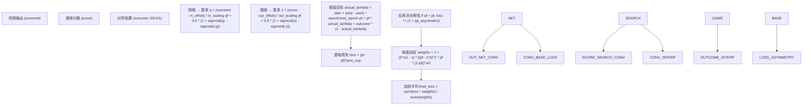
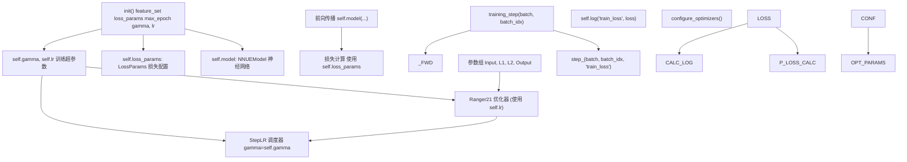
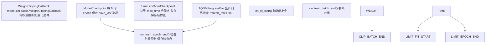

# 损失函数和训练配置

-   [data_loader/__init__.py](https://github.com/Chesszyh/nnue-pytorch/blob/024b2064/data_loader/__init__.py)
-   [data_loader/_native.py](https://github.com/Chesszyh/nnue-pytorch/blob/024b2064/data_loader/_native.py)
-   [data_loader/config.py](https://github.com/Chesszyh/nnue-pytorch/blob/024b2064/data_loader/config.py)
-   [model/config.py](https://github.com/Chesszyh/nnue-pytorch/blob/024b2064/model/config.py)
-   [model/lightning_module.py](https://github.com/Chesszyh/nnue-pytorch/blob/024b2064/model/lightning_module.py)
-   [train.py](https://github.com/Chesszyh/nnue-pytorch/blob/024b2064/train.py)

## 目的与范围

本文档解释了用于训练 NNUE 网络的损失函数以及相关的训练配置参数。该系统使用基于 WDL (胜-平-负) 概率的复杂损失函数，该函数在搜索评估分数和实际对弈结果之间进行插值。

有关优化器配置的信息，请参阅 [优化器和学习率调度](#2.4)。有关数据过滤和局面选择，请参阅 [数据过滤和跳过配置](#3.4)。

---

## 概览

NNUE 训练系统采用自定义损失函数，将网络输出和搜索分数都转换为胜率，然后测量它们的差异。这种方法允许网络从以下两方面学习：

-   **搜索分数** (λ = 1.0)：由国际象棋引擎评估的局面
-   **对弈结果** (λ = 0.0)：实际的胜/平/负结果
-   **插值** (0.0 < λ < 1.0)：两种信号的混合

损失计算在 `step_` 方法中实现，并由 `LossParams` 配置对象控制。

**来源：** [model/lightning_module.py57-115](https://github.com/Chesszyh/nnue-pytorch/blob/024b2064/model/lightning_module.py#L57-L115) [model/config.py12-24](https://github.com/Chesszyh/nnue-pytorch/blob/024b2064/model/config.py#L12-L24)

---

## 损失计算流水线

损失计算遵循以下流程：


**图表：损失计算数据流**

**来源：** [model/lightning_module.py87-111](https://github.com/Chesszyh/nnue-pytorch/blob/024b2064/model/lightning_module.py#L87-L111)

---

## 胜率转换

系统使用基于 sigmoid 的公式将网络输出和搜索分数都转换为胜率，该公式考虑了双方的视角（从白方和黑方的角度）：

### 网络输出转换

```
q = (scorenet - in_offset) / in_scaling
qm = (-scorenet - in_offset) / in_scaling
qf = 0.5 * (1.0 + q.sigmoid() - qm.sigmoid())
```
### 搜索分数转换

```
s = (score - out_offset) / out_scaling
sm = (-score - out_offset) / out_scaling
pf = 0.5 * (1.0 + s.sigmoid() - sm.sigmoid())
```
这种双向 sigmoid 方法确保胜率具有适当的对称性，并能正确处理正负评估。偏移量 (offset) 参数使 sigmoid 曲线居中，而缩放 (scaling) 参数控制其陡度。

**来源：** [model/lightning_module.py88-96](https://github.com/Chesszyh/nnue-pytorch/blob/024b2064/model/lightning_module.py#L88-L96)

---

## LossParams 配置

`LossParams` 数据类定义了所有控制损失函数行为的参数：

| 参数 | 默认值 | 描述 |
| --- | --- | --- |
| `in_offset` | 270.0 | 网络输出转换的偏移量（使 sigmoid 居中） |
| `in_scaling` | 340.0 | 网络输出转换的缩放（控制 sigmoid 陡度） |
| `out_offset` | 270.0 | 搜索分数转换的偏移量 |
| `out_scaling` | 380.0 | 搜索分数转换的缩放 |
| `start_lambda` | 1.0 | 第一个 epoch 的 Lambda 值 |
| `end_lambda` | 1.0 | 最后一个 epoch 的 Lambda 值 |
| `pow_exp` | 2.5 | 损失计算中幂律的指数 |
| `qp_asymmetry` | 0.0 | 当网络高估 (qf > pt) 时的非对称因子 |
| `w1` | 0.0 | 局面权重提升参数 1 |
| `w2` | 0.5 | 局面权重提升参数 2 |

**表：LossParams 配置字段**

### 参数作用

**偏移量和缩放参数：**

-   这些参数将评估分数（以厘兵为单位）映射到胜率
-   `in_offset` 和 `in_scaling` 适用于网络输出
-   `out_offset` 和 `out_scaling` 适用于参考搜索分数
-   不同的值允许网络学习与搜索引擎不同的评估尺度

**Lambda 调度：**

-   控制搜索分数 (λ=1) 和对弈结果 (λ=0) 之间的插值
-   可以安排从基于搜索到基于结果的训练的逐渐转变
-   `actual_lambda = start_lambda + (end_lambda - start_lambda) * (epoch / max_epoch)`
-   常见模式：以 λ=1.0（纯搜索）开始，以 λ=1.0（纯搜索）结束，或进行插值

**幂指数 (Power Exponent)：**

-   `pow_exp` 控制损失函数对误差的敏感度
-   默认值 2.5 产生的损失介于平方误差 (2.0) 和立方误差 (3.0) 之间
-   较高的值会更严厉地惩罚大误差

**非对称性 (Asymmetry)：**

-   `qp_asymmetry` 在网络高估局面价值时增加惩罚
-   如果 `qf > pt`，损失乘以 `(1 + qp_asymmetry)`
-   有助于鼓励保守的评估

**来源：** [model/config.py12-24](https://github.com/Chesszyh/nnue-pytorch/blob/024b2064/model/config.py#L12-L24) [model/lightning_module.py87-108](https://github.com/Chesszyh/nnue-pytorch/blob/024b2064/model/lightning_module.py#L87-L108)

---

## 局面加权

损失函数包含由 `w1` 和 `w2` 控制的复杂局面加权机制：

```
weights = 1 + (2.0**w1 - 1) * torch.pow((pf - 0.5) ** 2 * pf * (1 - pf), w2)
loss = (loss * weights).sum() / weights.sum()
```
此加权公式：

1.  计算 `(pf - 0.5)^2 * pf * (1 - pf)`，该值在胜率接近 50% 的局面时达到峰值
2.  将其提升到 `w2` 次幂以控制锐度
3.  按 `(2^w1 - 1)` 缩放以控制提升幅度
4.  加 1 作为基准权重

**参数的影响：**

-   `w1 = 0`：无加权（所有局面权重相等）
-   `w1 > 0`：提升接近决定性结果的局面
-   `w2 < 1`：在胜率范围内更广泛的提升
-   `w2 > 1`：更敏锐地关注特定胜率范围

**来源：** [model/lightning_module.py110-111](https://github.com/Chesszyh/nnue-pytorch/blob/024b2064/model/lightning_module.py#L110-L111) [train.py362-374](https://github.com/Chesszyh/nnue-pytorch/blob/024b2064/train.py#L362-L374)

---

## 训练配置

```mermaid
flowchart TD
    CLI_LOSS["损失参数 --lambda, --start-lambda, --end-lambda --in-offset, --in-scaling --out-offset, --out-scaling --pow-exp, --qp-asymmetry --w1, --w2"]
    CLI_TRAIN["训练参数 --lr, --gamma --batch-size --epoch-size --validation-size --max-epochs"]
    LOSS_PARAMS["LossParams model/config.py:LossParams"]
    MODEL_CONFIG["ModelConfig L1, L2, L3 大小"]
    QUANT_CONFIG["QuantizationConfig int8/int16 设置"]
    NNUE_MODULE["NNUE model/lightning_module.py:NNUE"]
    TRAIN_STEP["training_step() 调用带损失计算的 step_()"]
    CONFIG_OPT["configure_optimizers() 设置 Ranger21 + 调度器"]

    CLI --> LOSS_LOSS_PARAMS
    CLI --> TRAIN_NNUE_MODULE
    LOSS --> PARAMS_NNUE_MODULE
    MODEL --> CONFIG_NNUE_MODULE
    QUANT --> CONFIG_NNUE_MODULE
    NNUE --> MODULE_TRAIN_STEP
    NNUE --> MODULE_CONFIG_OPT
```


**图表：从 CLI 到训练循环的训练配置流程**

**来源：** [train.py107-543](https://github.com/Chesszyh/nnue-pytorch/blob/024b2064/train.py#L107-L543) [model/lightning_module.py16-161](https://github.com/Chesszyh/nnue-pytorch/blob/024b2064/model/lightning_module.py#L16-L161)

---

## 命令行配置

### 损失函数参数

```
# Lambda 插值
python train.py data.binpack --lambda 1.0               # 纯基于搜索
python train.py data.binpack --lambda 0.5               # 50/50 搜索/结果
python train.py data.binpack --start-lambda 1.0     \
                                        --end-lambda 0.0         # 从搜索到结果的调度

# Sigmoid 转换参数
python train.py data.binpack --in-offset 270     \
                                        --in-scaling 340     \
                                        --out-offset 270     \
                                        --out-scaling 380

# 损失形状参数
python train.py data.binpack --pow-exp 2.5               # 损失指数
python train.py data.binpack --qp-asymmetry 0.5         # 惩罚高估

# 局面加权
python train.py data.binpack --w1 0.0 --w2 0.5         # 默认加权
```
### 训练配置参数

```
# 学习率和调度
python train.py data.binpack --lr 8.75e-4               # 初始学习率
python train.py data.binpack --gamma 0.992               # 每个 epoch 的 LR 衰减

# 批次和 epoch 配置
python train.py data.binpack --batch-size 16384         # 每批次局面数
python train.py data.binpack --epoch-size 100000000     # 每 epoch 局面数
python train.py data.binpack --validation-size 0         # 验证局面数

# 训练时长
python train.py data.binpack --max-epochs 800           # 最大 epoch 数
python train.py data.binpack --max-time 30:00:00:00     # 最大时间 (DD:HH:MM:SS)
```
**来源：** [train.py152-224](https://github.com/Chesszyh/nnue-pytorch/blob/024b2064/train.py#L152-L224) [train.py306-318](https://github.com/Chesszyh/nnue-pytorch/blob/024b2064/train.py#L306-L318)

---

## 与 Lightning 模块的集成

`NNUE` Lightning 模块集成了所有配置：


**图表：NNUE Lightning 模块结构**

### 关键方法

**`__init__()`** [model/lightning_module.py29-52](https://github.com/Chesszyh/nnue-pytorch/blob/024b2064/model/lightning_module.py#L29-L52)

-   使用特征集和配置初始化 `NNUEModel`
-   存储 `loss_params`, `max_epoch`, `gamma`, `lr` 和其他超参数
-   这些参数在训练和检查点期间持久存在

**`step_()`** [model/lightning_module.py57-115](https://github.com/Chesszyh/nnue-pytorch/blob/024b2064/model/lightning_module.py#L57-L115)

-   训练、验证和测试的核心损失计算
-   解包批次数据（局面、结果、分数）
-   执行通过 `self.model` 的前向传播
-   使用 `self.loss_params` 计算损失
-   记录损失值

**`configure_optimizers()`** [model/lightning_module.py126-161](https://github.com/Chesszyh/nnue-pytorch/blob/024b2064/model/lightning_module.py#L126-L161)

-   创建具有不同学习率的参数组
-   使用存储的超参数初始化 Ranger21 优化器
-   使用 `gamma` 设置用于学习率衰减的 StepLR 调度器
-   将优化器和调度器返回给 Lightning trainer

**来源：** [model/lightning_module.py16-161](https://github.com/Chesszyh/nnue-pytorch/blob/024b2064/model/lightning_module.py#L16-L161)

---

## Lambda 调度

Lambda 调度允许在训练信号之间逐渐过渡：

### 实现

```
actual_lambda = p.start_lambda + (p.end_lambda - p.start_lambda) * (
    self.current_epoch / self.max_epoch)
pt = pf * actual_lambda + t * (1.0 - actual_lambda)
```
### 常见策略

| 策略 | `start_lambda` | `end_lambda` | 目的 |
| --- | --- | --- | --- |
| 纯搜索 | 1.0 | 1.0 | 仅从搜索分数学习 |
| 纯结果 | 0.0 | 0.0 | 仅从游戏结果学习 |
| 搜索到结果 | 1.0 | 0.0 | 从搜索开始，过渡到结果 |
| 结果到搜索 | 0.0 | 1.0 | 从结果开始，用搜索微调 |
| 混合 | 0.5 | 0.5 | 始终使用 50/50 混合 |

跨 epoch 的线性插值提供了平滑的调度，无需复杂的学习率预热/冷却协调。

**来源：** [model/lightning_module.py100-103](https://github.com/Chesszyh/nnue-pytorch/blob/024b2064/model/lightning_module.py#L100-L103) [train.py152-170](https://github.com/Chesszyh/nnue-pytorch/blob/024b2064/train.py#L152-L170) [train.py399-402](https://github.com/Chesszyh/nnue-pytorch/blob/024b2064/train.py#L399-L402)

---

## 回调和训练控制

训练循环使用几个回调来控制训练行为：


**图表：训练回调及其生命周期钩子**

### 回调细节

**WeightClippingCallback:**

-   确保权重保持在量化兼容范围内
-   在每次训练批次后截断
-   对于保持 int8/int16 兼容性至关重要

**ModelCheckpoint:**

-   通过 `--network-save-period` 配置（默认：20 epochs）
-   `--save-last-network` 控制是否始终保存最终检查点
-   检查点包含完整的模型状态、优化器状态和超参数

**TimeLimitAfterCheckpoint:**

-   解析格式为 `DD:HH:MM:SS` 的 `--max-time`
-   仅在保存检查点后停止训练
-   防止因提前终止而丢失训练进度

**来源：** [train.py21-41](https://github.com/Chesszyh/nnue-pytorch/blob/024b2064/train.py#L21-L41) [train.py490-514](https://github.com/Chesszyh/nnue-pytorch/blob/024b2064/train.py#L490-L514)

---

## 示例配置

### 标准训练（默认）

```
python train.py data.binpack \
    --lambda 1.0 \
    --in-offset 270 --in-scaling 340 \
    --out-offset 270 --out-scaling 380 \
    --pow-exp 2.5 \
    --lr 8.75e-4 --gamma 0.992 \
    --batch-size 16384 \
    --epoch-size 100000000 \
    --max-epochs 800
```
### Lambda 调度

```
# 从基于搜索过渡到基于结果
python train.py data.binpack \
    --start-lambda 1.0 \
    --end-lambda 0.0 \
    --max-epochs 800
```
### 自定义损失形状

```
# 保守网络（惩罚高估）
python train.py data.binpack \
    --qp-asymmetry 0.3 \
    --pow-exp 3.0
```
### 局面加权

```
# 强调决定性局面
python train.py data.binpack \
    --w1 1.0 \
    --w2 0.5
```
**来源：** [train.py411-422](https://github.com/Chesszyh/nnue-pytorch/blob/024b2064/train.py#L411-L422) [train.py428-455](https://github.com/Chesszyh/nnue-pytorch/blob/024b2064/train.py#L428-L455)

---

## 总结

损失函数配置系统提供了对以下方面的细粒度控制：

-   通过 lambda 调度进行 **目标插值**
-   通过偏移量/缩放参数进行 **胜率转换**
-   通过幂指数和非对称性控制 **损失形状**
-   通过 w1/w2 参数进行 **局面加权**

这些参数通过命令行参数指定，打包到 `LossParams` 中，并在整个训练过程中在 `NNUE` Lightning 模块中使用。这种模块化设计允许在保持与量化推理格式兼容的同时，尝试不同的训练目标。

**来源：** [train.py107-543](https://github.com/Chesszyh/nnue-pytorch/blob/024b2064/train.py#L107-L543) [model/lightning_module.py16-161](https://github.com/Chesszyh/nnue-pytorch/blob/024b2064/model/lightning_module.py#L16-L161) [model/config.py12-24](https://github.com/Chesszyh/nnue-pytorch/blob/024b2064/model/config.py#L12-L24)
