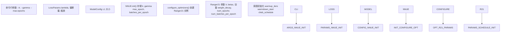
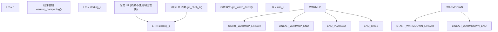
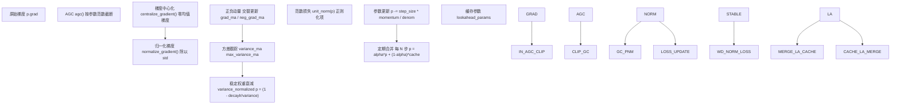
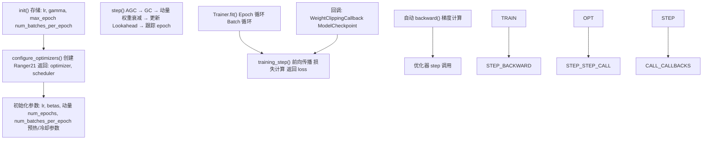

# 优化器和学习率调度

-   [ranger21.py](https://github.com/Chesszyh/nnue-pytorch/blob/024b2064/ranger21.py)
-   [ruff.toml](https://github.com/Chesszyh/nnue-pytorch/blob/024b2064/ruff.toml)
-   [train.py](https://github.com/Chesszyh/nnue-pytorch/blob/024b2064/train.py)

## 目的与范围

本页面记录了 NNUE 训练中使用的优化策略，重点介绍 Ranger21 优化器及其全面的学习率调度系统。内容涵盖优化器配置、预热/冷却策略、切比雪夫分形调度、自适应梯度截断，以及 Lookahead 和梯度中心化等高级特性。

有关损失计算和训练配置的信息，请参阅 [损失函数和训练配置](#2.3)。有关整体训练工作流，请参阅 [基础训练 (train.py)](#2.1)。

## Ranger21 优化器概览

训练系统使用 **Ranger21**，这是一个复杂的优化器，将多种最先进的优化技术结合到一个统一的框架中。Ranger21 对 AdamW 优化器进行了扩展，增加了许多增强功能，旨在提高训练稳定性、收敛速度和最终模型质量。

**核心组件：**

| 组件 | 目的 | 关键论文 |
| --- | --- | --- |
| 基础引擎 | AdamW 或 MadGrad 梯度下降 | \- |
| 预热 (Warmup) | 开始时逐渐增加学习率 | Ma/Yarats 2019 |
| 冷却 (Warmdown) | 结束时线性衰减学习率 | \- |
| 切比雪夫步骤 | 分形 LR 调度以改善收敛 | \- |
| Lookahead (前瞻) | 慢速和快速权重探索 | Zhang et al. 2019 |
| AGC (自适应梯度截断) | 用于稳定性的自适应梯度截断 | Brock et al. 2021 |
| 梯度中心化 | 零均值梯度以加快收敛 | Yong et al. 2020 |
| 正负动量 | 增强的动量计算 | Gitman et al. 2021 |
| 稳定权重衰减 | 方差归一化的正则化 | Loshchilov/Hutter 2017 |
| 范数损失 | 用于权重正则化的辅助损失 | Georgiou et al. 2021 |

优化器在 [ranger21.py107-953](https://github.com/Chesszyh/nnue-pytorch/blob/024b2064/ranger21.py#L107-L953) 中实现，主要优化步骤在 [ranger21.py574-927](https://github.com/Chesszyh/nnue-pytorch/blob/024b2064/ranger21.py#L574-L927) 中。

**来源：** [ranger21.py1-36](https://github.com/Chesszyh/nnue-pytorch/blob/024b2064/ranger21.py#L1-L36) [ranger21.py107-152](https://github.com/Chesszyh/nnue-pytorch/blob/024b2064/ranger21.py#L107-L152)

## 训练中的优化器初始化


**图表：优化器初始化流程**

训练脚本 [train.py428-438](https://github.com/Chesszyh/nnue-pytorch/blob/024b2064/train.py#L428-L438) 创建带有基本优化器参数 (`lr`, `gamma`, `max_epoch`, `num_batches_per_epoch`) 的 `NNUE` Lightning 模块。模块的 `configure_optimizers()` 方法随后实例化带有完整配置的 Ranger21。

**来源：** [train.py218-223](https://github.com/Chesszyh/nnue-pytorch/blob/024b2064/train.py#L218-L223) [train.py428-438](https://github.com/Chesszyh/nnue-pytorch/blob/024b2064/train.py#L428-L438) [ranger21.py107-152](https://github.com/Chesszyh/nnue-pytorch/blob/024b2064/ranger21.py#L107-L152)

## 基础优化器参数

### 学习率和 Gamma

初始学习率和衰减因子通过命令行参数指定：

```
--lr 8.75e-4        # 初始学习率（默认）
--gamma 0.992       # 每个 epoch 的 LR 乘性衰减（默认）
```
这些参数在 [train.py433-434](https://github.com/Chesszyh/nnue-pytorch/blob/024b2064/train.py#L433-L434) 传递给 NNUE 模块：

-   **`lr`**：任何预热或调度之前的起始学习率
-   **`gamma`**：每个 epoch 后应用的乘性因子（当不使用切比雪夫调度时）
-   **`num_batches_per_epoch`**：在 [train.py432](https://github.com/Chesszyh/nnue-pytorch/blob/024b2064/train.py#L432-L432) 由 `epoch_size / batch_size` 派生，用于在优化器内跟踪 epoch

**来源：** [train.py218-223](https://github.com/Chesszyh/nnue-pytorch/blob/024b2064/train.py#L218-L223) [train.py433-434](https://github.com/Chesszyh/nnue-pytorch/blob/024b2064/train.py#L433-L434)

### Betas, 动量和权重衰减

Ranger21 使用以下默认超参数（硬编码在 [ranger21.py128-150](https://github.com/Chesszyh/nnue-pytorch/blob/024b2064/ranger21.py#L128-L150)）：

| 参数 | 默认值 | 描述 |
| --- | --- | --- |
| `betas` | `(0.9, 0.999)` | 动量和方差的指数衰减率 |
| `momentum` | `0.9` | MadGrad 引擎的动量因子 |
| `eps` | `1e-8` | 数值稳定性常数 |
| `weight_decay` | `1e-4` | 稳定权重衰减系数 |
| `decay_type` | `"stable"` | 方差归一化的权重衰减 |

Beta 值控制指数移动平均：

-   **beta1 = 0.9**：一阶矩（梯度）移动平均衰减
-   **beta2 = 0.999**：二阶矩（方差）移动平均衰减

**来源：** [ranger21.py128-142](https://github.com/Chesszyh/nnue-pytorch/blob/024b2064/ranger21.py#L128-L142) [ranger21.py149-151](https://github.com/Chesszyh/nnue-pytorch/blob/024b2064/ranger21.py#L149-L151)

## 学习率调度

Ranger21 实现了复杂的三阶段学习率调度：预热 (warmup) → 平台/切比雪夫 (plateau/Chebyshev) → 冷却 (warmdown)。


**图表：学习率调度阶段**

**来源：** [ranger21.py215-264](https://github.com/Chesszyh/nnue-pytorch/blob/024b2064/ranger21.py#L215-L264) [ranger21.py435-521](https://github.com/Chesszyh/nnue-pytorch/blob/024b2064/ranger21.py#L435-L521) [ranger21.py539-561](https://github.com/Chesszyh/nnue-pytorch/blob/024b2064/ranger21.py#L539-L561)

### 预热阶段 (Warmup Phase)

预热在指定的迭代次数内逐渐将学习率从零增加到目标值。这防止了因初始梯度更新过大而导致的训练不稳定。

**配置参数：**

| 参数 | 默认计算 | 描述 |
| --- | --- | --- |
| `use_warmup` | `True` | 启用预热阶段 |
| `warmup_type` | `"linear"` | 线性或指数预热 |
| `num_warmup_iterations` | 自动计算 | 预热的迭代次数 |
| `warmup_pct_default` | `0.22` | 回退：总迭代次数的 22% |

**预热持续时间计算** [ranger21.py222-238](https://github.com/Chesszyh/nnue-pytorch/blob/024b2064/ranger21.py#L222-L238)：

```
if num_warmup_iterations is None:
    beta_warmup_iters = math.ceil(2 / (1 - betas[1]))  # 对于 beta2=0.999 约 2000 次迭代
    beta_pct = beta_warmup_iters / total_iterations
    
    if beta_pct > 0.45:
        # 对于短训练运行使用基于百分比的预热
        num_warmup_iters = int(warmup_pct_default * total_iterations)
    else:
        # 对于较长的运行使用基于 beta 的预热
        num_warmup_iters = beta_warmup_iters
```
公式 `2 / (1 - beta2)` 源自 Ma/Yarats (2019) 关于 Adam 预热的论文，确保指数移动平均在应用全学习率之前稳定下来。

**线性预热实现** [ranger21.py435-465](https://github.com/Chesszyh/nnue-pytorch/blob/024b2064/ranger21.py#L435-L465)：

在预热期间的每一步：

```
warmup_pct = min(1.0, step / num_warmup_iters)
new_lr = starting_lr * warmup_pct
```
一旦 `step > num_warmup_iters`，预热被标记为完成并使用全学习率。

**来源：** [ranger21.py217-238](https://github.com/Chesszyh/nnue-pytorch/blob/024b2064/ranger21.py#L217-L238) [ranger21.py435-465](https://github.com/Chesszyh/nnue-pytorch/blob/024b2064/ranger21.py#L435-L465)

### 冷却阶段 (Warmdown Phase)

冷却在训练的最后部分将学习率从当前值线性降低到最小值。这有助于模型收敛到更尖锐的极小值。

**配置参数：**

| 参数 | 默认值 | 描述 |
| --- | --- | --- |
| `warmdown_active` | `True` | 启用冷却阶段 |
| `warmdown_start_pct` | `0.72` | 在训练的 72% 处开始冷却 |
| `warmdown_min_lr` | `3e-5` | 结束时的最小学习率 |

**冷却计算** [ranger21.py240-264](https://github.com/Chesszyh/nnue-pytorch/blob/024b2064/ranger21.py#L240-L264) [ranger21.py467-521](https://github.com/Chesszyh/nnue-pytorch/blob/024b2064/ranger21.py#L467-L521)：

```
# 在初始化期间：
start_warm_down = int(warmdown_start_pct * num_epochs * num_batches_per_epoch)
warmdown_total_iterations = total_iterations - start_warm_down
warmdown_lr_delta = starting_lr - min_lr

# 在训练步骤期间：
if iteration >= start_warm_down:
    warmdown_iteration = (iteration + 1) - start_warm_down
    warmdown_pct = warmdown_iteration / (warmdown_total_iterations + 1)
    reduction = warmdown_lr_delta * warmdown_pct
    new_lr = starting_lr - reduction
```
线性衰减确保平滑过渡到最小学习率。`+1` 偏移处理 1 索引的迭代计数。

**来源：** [ranger21.py240-264](https://github.com/Chesszyh/nnue-pytorch/blob/024b2064/ranger21.py#L240-L264) [ranger21.py467-521](https://github.com/Chesszyh/nnue-pytorch/blob/024b2064/ranger21.py#L467-L521)

### 切比雪夫分形步骤

切比雪夫调度应用分形学习率模式，根据切比雪夫多项式节点成倍地改变 LR。这创建了一个具有周期性增加和减少的调度，有助于逃离局部极小值。

**配置：**

```
use_cheb=True          # 启用切比雪夫调度
num_epochs=800         # 调度生成所需
```
**切比雪夫调度生成** [ranger21.py54-73](https://github.com/Chesszyh/nnue-pytorch/blob/024b2064/ranger21.py#L54-L73)：

```
def cheb_steps(m, M, T):
    # m=0.1 (min), M=1.0 (max), T=num_epochs-2
    C, R = (M + m) / 2.0, (M - m) / 2.0
    thetas = (np.arange(T) + 0.5) / T * np.pi
    return 1.0 / (C - R * np.cos(thetas))

def cheb_perm(T):
    # 分形排列模式
    perm = np.array([0])
    while len(perm) < T:
        perm = np.vstack([perm, 2 * len(perm) - 1 - perm]).T.flatten()
    return perm

def get_chebs(num_epochs):
    steps = cheb_steps(0.1, 1, num_epochs - 2)
    perm = cheb_perm(num_epochs - 2)
    return steps[perm]
```
调度在预热完成后应用 [ranger21.py748-751](https://github.com/Chesszyh/nnue-pytorch/blob/024b2064/ranger21.py#L748-L751)：

```
if self.use_cheb and self.warmup_complete:
    lr = self.get_cheb_lr(lr, step)
```
`get_cheb_lr()` 方法 [ranger21.py539-561](https://github.com/Chesszyh/nnue-pytorch/blob/024b2064/ranger21.py#L539-L561) 查找当前 epoch 的乘数并应用它：`new_lr = base_lr * cheb_value`。

**来源：** [ranger21.py54-73](https://github.com/Chesszyh/nnue-pytorch/blob/024b2064/ranger21.py#L54-L73) [ranger21.py195-203](https://github.com/Chesszyh/nnue-pytorch/blob/024b2064/ranger21.py#L195-L203) [ranger21.py539-561](https://github.com/Chesszyh/nnue-pytorch/blob/024b2064/ranger21.py#L539-L561) [ranger21.py748-751](https://github.com/Chesszyh/nnue-pytorch/blob/024b2064/ranger21.py#L748-L751)

## 自适应梯度截断 (AGC)

自适应梯度截断 (Adaptive Gradient Clipping) 相对于参数幅度归一化梯度更新，防止梯度爆炸，同时允许不同层以适当的比例更新。

**配置：**

| 参数 | 默认值 | 描述 |
| --- | --- | --- |
| `use_adaptive_gradient_clipping` | `True` | 启用 AGC |
| `agc_clipping_value` | `1e-2` | 截断阈值（相对于参数范数） |
| `agc_eps` | `1e-3` | 最小参数范数 |

**AGC 算法** [ranger21.py415-433](https://github.com/Chesszyh/nnue-pytorch/blob/024b2064/ranger21.py#L415-L433)：

```
def agc(self, p):
    # 计算参数 unitwise 范数
    p_norm = self.unit_norm(p).clamp_(self.agc_eps)
    
    # 计算梯度 unitwise 范数
    g_norm = self.unit_norm(p.grad)
    
    # 最大允许梯度范数
    max_norm = p_norm * self.agc_clip_val
    
    # 如果超过 max_norm 则截断梯度
    clipped_grad = p.grad * (max_norm / g_norm.clamp(min=1e-6))
    new_grads = torch.where(g_norm > max_norm, clipped_grad, p.grad)
    p.grad.detach().copy_(new_grads)
```
**Unitwise 范数计算** [ranger21.py393-413](https://github.com/Chesszyh/nnue-pytorch/blob/024b2064/ranger21.py#L393-L413)：

`unit_norm()` 方法沿适当维度计算范数：

-   1D 参数：全局范数
-   2D/3D (线性层)：沿维度 1 的范数
-   4D (卷积核)：沿维度 (1,2,3) 的范数

AGC 在优化步骤的早期应用 [ranger21.py595-597](https://github.com/Chesszyh/nnue-pytorch/blob/024b2064/ranger21.py#L595-L597)，在任何其他梯度变换之前。

**来源：** [ranger21.py125-127](https://github.com/Chesszyh/nnue-pytorch/blob/024b2064/ranger21.py#L125-L127) [ranger21.py190-193](https://github.com/Chesszyh/nnue-pytorch/blob/024b2064/ranger21.py#L190-L193) [ranger21.py393-433](https://github.com/Chesszyh/nnue-pytorch/blob/024b2064/ranger21.py#L393-L433) [ranger21.py595-597](https://github.com/Chesszyh/nnue-pytorch/blob/024b2064/ranger21.py#L595-L597)

## 高级优化特性


**图表：Ranger21 优化步骤流水线**

**来源：** [ranger21.py574-953](https://github.com/Chesszyh/nnue-pytorch/blob/024b2064/ranger21.py#L574-L953)

### Lookahead (前瞻)

Lookahead 维护两组权重：每步更新的“快速”权重，和通过与快速权重插值定期更新的“慢速”权重。这能更彻底地探索损失景观。

**配置：**

| 参数 | 默认值 | 描述 |
| --- | --- | --- |
| `lookahead_active` | `True` | 启用 lookahead |
| `lookahead_mergetime` | `5` | 慢速权重更新之间的步数 |
| `lookahead_blending_alpha` | `0.5` | 快速权重插值因子 |
| `lookahead_load_at_validation` | `False` | 验证时使用慢速权重 |

**Lookahead 过程** [ranger21.py930-953](https://github.com/Chesszyh/nnue-pytorch/blob/024b2064/ranger21.py#L930-L953)：

每 `lookahead_mergetime` 步：

```
p.data = alpha * p.data + (1 - alpha) * lookahead_params
lookahead_params = p.data  # 保存用于下次合并
```
慢速权重 (`lookahead_params`) 被初始化为匹配当前权重 [ranger21.py620-622](https://github.com/Chesszyh/nnue-pytorch/blob/024b2064/ranger21.py#L620-L622) 并缓存在优化器状态中。

**来源：** [ranger21.py112-115](https://github.com/Chesszyh/nnue-pytorch/blob/024b2064/ranger21.py#L112-L115) [ranger21.py182-188](https://github.com/Chesszyh/nnue-pytorch/blob/024b2064/ranger21.py#L182-L188) [ranger21.py620-622](https://github.com/Chesszyh/nnue-pytorch/blob/024b2064/ranger21.py#L620-L622) [ranger21.py930-953](https://github.com/Chesszyh/nnue-pytorch/blob/024b2064/ranger21.py#L930-L953)

### 梯度中心化

梯度中心化将梯度的均值设为零，这已被证明可以加速收敛并提高泛化能力。

**配置：**

| 参数 | 默认值 | 描述 |
| --- | --- | --- |
| `using_gc` | `True` | 启用梯度中心化 |
| `using_normgc` | `True` | 用 std 归一化梯度 |
| `gc_conv_only` | `False` | 仅应用于卷积层 |

**实现** [ranger21.py92-104](https://github.com/Chesszyh/nnue-pytorch/blob/024b2064/ranger21.py#L92-L104)：

```
def centralize_gradient(x, gc_conv_only=False):
    size = x.dim()
    if gc_conv_only:
        if size > 3:  # 卷积层
            x.add_(-x.mean(dim=tuple(range(1, size)), keepdim=True))
    else:
        if size > 1:  # 所有多维参数
            x.add_(-x.mean(dim=tuple(range(1, size)), keepdim=True))
    return x
```
**梯度归一化** [ranger21.py76-89](https://github.com/Chesszyh/nnue-pytorch/blob/024b2064/ranger21.py#L76-L89)：

```
def normalize_gradient(x, use_channels=False, epsilon=1e-8):
    size = x.dim()
    if (size > 1) and use_channels:
        s = x.std(dim=tuple(range(1, size)), keepdim=True) + epsilon
        x.div_(s)
    elif torch.numel(x) > 2:
        s = x.std() + epsilon
        x.div_(s)
    return x
```
这两种变换都在动量计算之前应用于梯度 [ranger21.py643-650](https://github.com/Chesszyh/nnue-pytorch/blob/024b2064/ranger21.py#L643-L650) 和 [ranger21.py883-889](https://github.com/Chesszyh/nnue-pytorch/blob/024b2064/ranger21.py#L883-L889)。

**来源：** [ranger21.py76-104](https://github.com/Chesszyh/nnue-pytorch/blob/024b2064/ranger21.py#L76-L104) [ranger21.py268-270](https://github.com/Chesszyh/nnue-pytorch/blob/024b2064/ranger21.py#L268-L270) [ranger21.py643-650](https://github.com/Chesszyh/nnue-pytorch/blob/024b2064/ranger21.py#L643-L650) [ranger21.py883-889](https://github.com/Chesszyh/nnue-pytorch/blob/024b2064/ranger21.py#L883-L889)

### 正负动量 (PNM)

PNM 在奇/偶步数上交替使用正负动量累加器，这提供了对损失景观更好的探索。

**配置：**

| 参数 | 默认值 | 描述 |
| --- | --- | --- |
| `momentum_type` | `"pnm"` | 使用正负动量 |
| `pnm_momentum_factor` | `1.0` | PNM 缩放因子 |

**PNM 更新逻辑** [ranger21.py856-909](https://github.com/Chesszyh/nnue-pytorch/blob/024b2064/ranger21.py#L856-L909)：

```
if state["step"] % 2 == 1:
    grad_ma, neg_grad_ma = state["grad_ma"], state["neg_grad_ma"]
else:
    grad_ma, neg_grad_ma = state["neg_grad_ma"], state["grad_ma"]

# 使用 PNM 计算动量
noise_norm = math.sqrt((1 + beta2) ** 2 + beta2 ** 2)
pnmomentum = (grad_ma * (1 + pnm_factor) - neg_grad_ma * pnm_factor) / noise_norm
```
交替分配确保一个累加器获得当前梯度，而另一个充当负动量项。

**来源：** [ranger21.py129-130](https://github.com/Chesszyh/nnue-pytorch/blob/024b2064/ranger21.py#L129-L130) [ranger21.py276-278](https://github.com/Chesszyh/nnue-pytorch/blob/024b2064/ranger21.py#L276-L278) [ranger21.py628-631](https://github.com/Chesszyh/nnue-pytorch/blob/024b2064/ranger21.py#L628-L631) [ranger21.py856-909](https://github.com/Chesszyh/nnue-pytorch/blob/024b2064/ranger21.py#L856-L909)

### 稳定权重衰减

稳定权重衰减通过所有参数的方差对衰减项进行归一化，使正则化具有尺度不变性。

**方差计算** [ranger21.py582-720](https://github.com/Chesszyh/nnue-pytorch/blob/024b2064/ranger21.py#L582-L720)：

```
# 第一阶段：累积所有参数的方差
variance_ma_sum = 0.0
for group in param_groups:
    for p in group["params"]:
        variance_ma = state["variance_ma"]
        variance_ma.mul_(beta2).addcmul_(grad, grad, value=1 - beta2)
        variance_ma_debiased = variance_ma / (1 - beta2 ** step)
        variance_ma_sum += variance_ma_debiased.sum()

# 归一化
variance_normalized = math.sqrt(variance_ma_sum / param_size)
```
**衰减应用** [ranger21.py767-772](https://github.com/Chesszyh/nnue-pytorch/blob/024b2064/ranger21.py#L767-L772)：

```
if decay:
    if not use_madgrad:
        p.data *= (1 - decay * lr / variance_normalized)
    else:
        p.data *= (1 - decay * lamb / variance_normalized)
```
方差归一化确保权重衰减强度适应整个训练过程中的梯度幅度。

**来源：** [ranger21.py141-142](https://github.com/Chesszyh/nnue-pytorch/blob/024b2064/ranger21.py#L141-L142) [ranger21.py281-282](https://github.com/Chesszyh/nnue-pytorch/blob/024b2064/ranger21.py#L281-L282) [ranger21.py582-720](https://github.com/Chesszyh/nnue-pytorch/blob/024b2064/ranger21.py#L582-L720) [ranger21.py767-772](https://github.com/Chesszyh/nnue-pytorch/blob/024b2064/ranger21.py#L767-L772)

### 范数损失 (Norm Loss)

范数损失增加了一个辅助正则化项，惩罚范数远离 1 的参数，鼓励层间平衡的权重幅度。

**配置：**

| 参数 | 默认值 | 描述 |
| --- | --- | --- |
| `normloss_active` | `True` | 启用范数损失正则化 |
| `normloss_factor` | `1e-4` | 范数损失系数 |

**实现** [ranger21.py774-780](https://github.com/Chesszyh/nnue-pytorch/blob/024b2064/ranger21.py#L774-L780)：

```
if self.normloss_active:
    unorm = self.unit_norm(p.data)
    correction = 2 * normloss_factor * (1 - torch.div(1, unorm + eps))
    p.mul_(1 - lr * correction)
```
校正项通过按其当前范数成反比缩放参数，将参数范数推向 1。

**来源：** [ranger21.py123-124](https://github.com/Chesszyh/nnue-pytorch/blob/024b2064/ranger21.py#L123-L124) [ranger21.py178-180](https://github.com/Chesszyh/nnue-pytorch/blob/024b2064/ranger21.py#L178-L180) [ranger21.py774-780](https://github.com/Chesszyh/nnue-pytorch/blob/024b2064/ranger21.py#L774-L780)

### 核心引擎选择

Ranger21 支持两种基础优化算法：

**AdamW (默认)** [ranger21.py844-916](https://github.com/Chesszyh/nnue-pytorch/blob/024b2064/ranger21.py#L844-L916)：

-   带动量的自适应学习率
-   单独的方差跟踪 (`variance_ma`)
-   移动平均的偏差校正
-   可选 AdaBelief 方差计算

**MadGrad** [ranger21.py790-842](https://github.com/Chesszyh/nnue-pytorch/blob/024b2064/ranger21.py#L790-L842)：

-   基于动量的梯度下降
-   方差的立方根用于学习率自适应
-   无需偏差校正
-   Adam 家族的替代方案

引擎在初始化时选择 [ranger21.py158-166](https://github.com/Chesszyh/nnue-pytorch/blob/024b2064/ranger21.py#L158-L166)：

```
use_madgrad=False  # 默认使用 AdamW
```
两种引擎使用相同的预热/冷却/AGC 基础设施，但在计算参数更新的方式上有所不同。

**来源：** [ranger21.py116-117](https://github.com/Chesszyh/nnue-pytorch/blob/024b2064/ranger21.py#L116-L117) [ranger21.py158-166](https://github.com/Chesszyh/nnue-pytorch/blob/024b2064/ranger21.py#L158-L166) [ranger21.py790-916](https://github.com/Chesszyh/nnue-pytorch/blob/024b2064/ranger21.py#L790-L916)

## 与 NNUE 训练的集成


**图表：训练循环中的优化器集成**

NNUE Lightning 模块的 `configure_optimizers()` 方法创建带有所有必要参数的 Ranger21 实例。Lightning 的 `Trainer` 在每次反向传播后自动调用优化器的 `step()` 方法，处理完整的优化流水线，包括梯度截断、动量更新、权重衰减和 Lookahead。

优化器在内部 [ranger21.py527-538](https://github.com/Chesszyh/nnue-pytorch/blob/024b2064/ranger21.py#L527-L538) 通过计算步数并使用 `num_batches_per_epoch` 来确定新 epoch 何时开始来跟踪 epoch。这启用了依赖于 epoch 的特性，如学习率日志记录和用于验证的可选 Lookahead 缓存加载。

**来源：** [train.py428-438](https://github.com/Chesszyh/nnue-pytorch/blob/024b2064/train.py#L428-L438) [train.py496-514](https://github.com/Chesszyh/nnue-pytorch/blob/024b2064/train.py#L496-L514) [ranger21.py107-152](https://github.com/Chesszyh/nnue-pytorch/blob/024b2064/ranger21.py#L107-L152) [ranger21.py527-538](https://github.com/Chesszyh/nnue-pytorch/blob/024b2064/ranger21.py#L527-L538) [ranger21.py574-927](https://github.com/Chesszyh/nnue-pytorch/blob/024b2064/ranger21.py#L574-L927)

## 配置总结

### 推荐默认设置

NNUE 训练系统使用这些 Ranger21 默认值：

```
# 基础参数 (来自 train.py)
lr = 8.75e-4
gamma = 0.992
max_epochs = 800
batch_size = 16384

# Ranger21 硬编码默认值 (ranger21.py)
betas = (0.9, 0.999)
momentum = 0.9
weight_decay = 1e-4
eps = 1e-8

# 预热/冷却
use_warmup = True
warmup_type = "linear"
warmup_pct_default = 0.22
warmdown_active = True
warmdown_start_pct = 0.72
warmdown_min_lr = 3e-5

# 高级特性
use_adaptive_gradient_clipping = True
agc_clipping_value = 1e-2
lookahead_active = True
lookahead_mergetime = 5
lookahead_blending_alpha = 0.5
using_gc = True
using_normgc = True
normloss_active = True
normloss_factor = 1e-4
momentum_type = "pnm"
use_cheb = False  # 可以启用以获得分形 LR 调度
```
这些设置经过调整，可高效训练大型 NNUE 网络，同时在 800 个 epoch 的默认训练运行中保持稳定性。

**来源：** [train.py218-223](https://github.com/Chesszyh/nnue-pytorch/blob/024b2064/train.py#L218-L223) [ranger21.py108-146](https://github.com/Chesszyh/nnue-pytorch/blob/024b2064/ranger21.py#L108-L146)