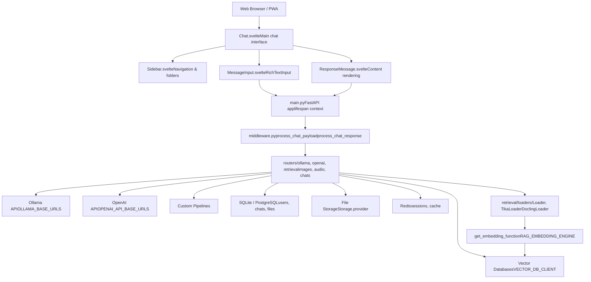
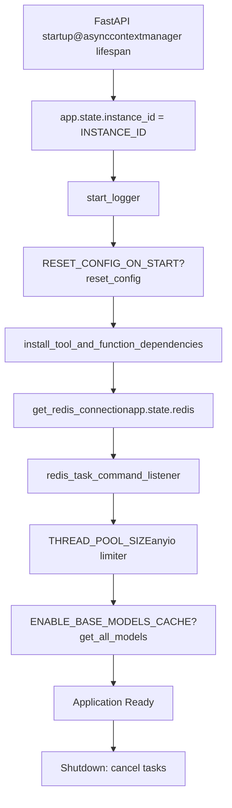
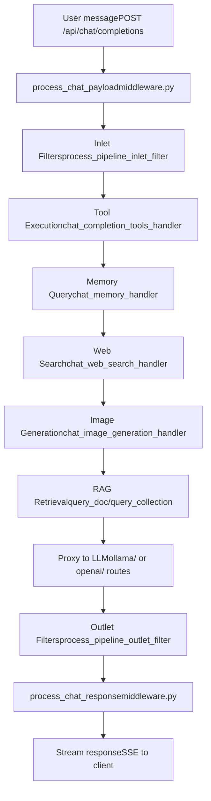
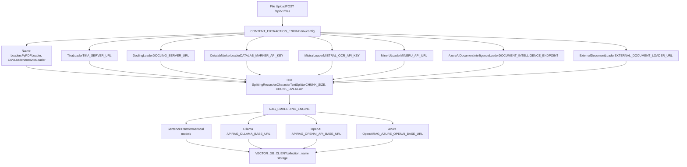
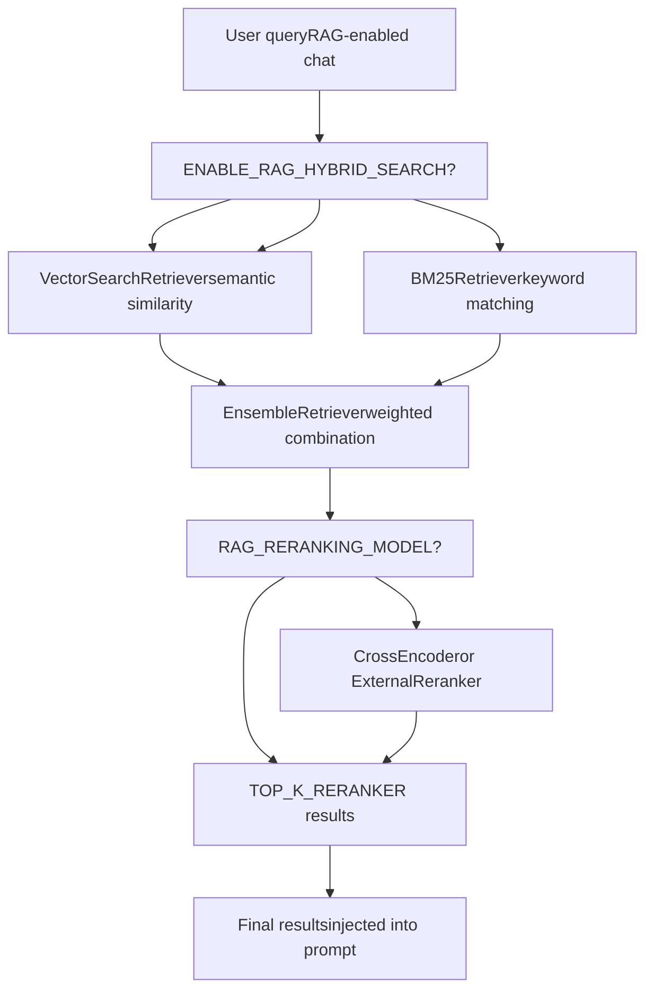
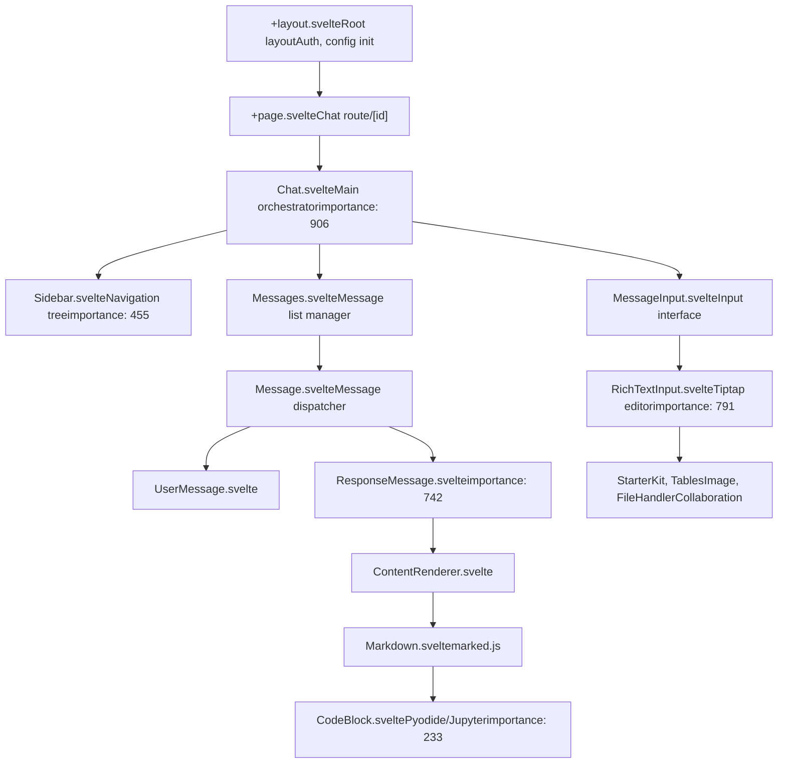
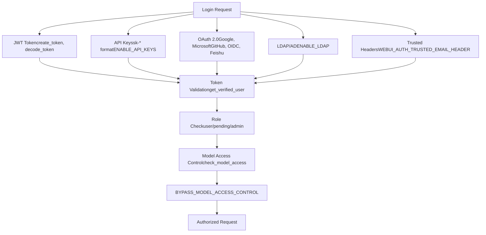

# Overview

Relevant source files

-   [LICENSE](https://github.com/open-webui/open-webui/blob/a7271532/LICENSE)
-   [README.md](https://github.com/open-webui/open-webui/blob/a7271532/README.md)
-   [TROUBLESHOOTING.md](https://github.com/open-webui/open-webui/blob/a7271532/TROUBLESHOOTING.md)
-   [backend/open\_webui/config.py](https://github.com/open-webui/open-webui/blob/a7271532/backend/open_webui/config.py)
-   [backend/open\_webui/main.py](https://github.com/open-webui/open-webui/blob/a7271532/backend/open_webui/main.py)
-   [backend/open\_webui/retrieval/loaders/datalab\_marker.py](https://github.com/open-webui/open-webui/blob/a7271532/backend/open_webui/retrieval/loaders/datalab_marker.py)
-   [backend/open\_webui/retrieval/loaders/external\_document.py](https://github.com/open-webui/open-webui/blob/a7271532/backend/open_webui/retrieval/loaders/external_document.py)
-   [backend/open\_webui/retrieval/loaders/external\_web.py](https://github.com/open-webui/open-webui/blob/a7271532/backend/open_webui/retrieval/loaders/external_web.py)
-   [backend/open\_webui/retrieval/loaders/main.py](https://github.com/open-webui/open-webui/blob/a7271532/backend/open_webui/retrieval/loaders/main.py)
-   [backend/open\_webui/retrieval/loaders/mineru.py](https://github.com/open-webui/open-webui/blob/a7271532/backend/open_webui/retrieval/loaders/mineru.py)
-   [backend/open\_webui/retrieval/loaders/mistral.py](https://github.com/open-webui/open-webui/blob/a7271532/backend/open_webui/retrieval/loaders/mistral.py)
-   [backend/open\_webui/retrieval/utils.py](https://github.com/open-webui/open-webui/blob/a7271532/backend/open_webui/retrieval/utils.py)
-   [backend/open\_webui/routers/retrieval.py](https://github.com/open-webui/open-webui/blob/a7271532/backend/open_webui/routers/retrieval.py)
-   [backend/open\_webui/utils/middleware.py](https://github.com/open-webui/open-webui/blob/a7271532/backend/open_webui/utils/middleware.py)
-   [docs/apache.md](https://github.com/open-webui/open-webui/blob/a7271532/docs/apache.md)
-   [src/lib/apis/retrieval/index.ts](https://github.com/open-webui/open-webui/blob/a7271532/src/lib/apis/retrieval/index.ts)
-   [src/lib/components/admin/Settings/Documents.svelte](https://github.com/open-webui/open-webui/blob/a7271532/src/lib/components/admin/Settings/Documents.svelte)
-   [src/lib/components/admin/Settings/WebSearch.svelte](https://github.com/open-webui/open-webui/blob/a7271532/src/lib/components/admin/Settings/WebSearch.svelte)
-   [src/lib/components/chat/Settings/About.svelte](https://github.com/open-webui/open-webui/blob/a7271532/src/lib/components/chat/Settings/About.svelte)
-   [src/lib/constants.ts](https://github.com/open-webui/open-webui/blob/a7271532/src/lib/constants.ts)

Open WebUI is an extensible, self-hosted AI chat platform designed to operate entirely offline. It provides a web-based interface for interacting with Large Language Models (LLMs) through various providers including Ollama, OpenAI-compatible APIs, and custom pipelines. The platform includes built-in Retrieval-Augmented Generation (RAG), multi-model conversations, web search integration, authentication systems, and enterprise-grade features for production deployments.

This document covers the high-level architecture, core components, and deployment options. For detailed information about specific subsystems, see: [Architecture Overview](/open-webui/open-webui/2-architecture-overview), [Chat System](/open-webui/open-webui/4-chat-system), [RAG and Knowledge System](/open-webui/open-webui/7-rag-and-knowledge-system), [Authentication and Security](/open-webui/open-webui/10-authentication-and-security).

**Sources:** [README.md1-240](https://github.com/open-webui/open-webui/blob/a7271532/README.md#L1-L240) [backend/open\_webui/main.py553-640](https://github.com/open-webui/open-webui/blob/a7271532/backend/open_webui/main.py#L553-L640)

## Purpose and Scope

Open WebUI serves as an intelligent proxy layer between users and LLM providers, augmenting chat requests with:

-   Document retrieval and semantic search
-   Web search results from 24+ providers
-   Function calling and tool execution
-   Memory and context personalization
-   Image generation and editing
-   Real-time collaboration features

The platform supports deployment scenarios ranging from single-user Docker containers to horizontally-scaled Kubernetes clusters with Redis-backed session management.

**Sources:** [README.md15-81](https://github.com/open-webui/open-webui/blob/a7271532/README.md#L15-L81) [backend/open\_webui/main.py1-96](https://github.com/open-webui/open-webui/blob/a7271532/backend/open_webui/main.py#L1-L96)

## System Architecture

Open WebUI follows a three-tier architecture with clear separation between presentation (SvelteKit frontend), application logic (FastAPI backend), and data persistence (multiple database backends).

### High-Level Component Diagram


**Sources:** [backend/open\_webui/main.py633-672](https://github.com/open-webui/open-webui/blob/a7271532/backend/open_webui/main.py#L633-L672) [backend/open\_webui/utils/middleware.py1-127](https://github.com/open-webui/open-webui/blob/a7271532/backend/open_webui/utils/middleware.py#L1-L127) [src/lib/constants.ts1-104](https://github.com/open-webui/open-webui/blob/a7271532/src/lib/constants.ts#L1-L104)

## Core Technology Stack

| Layer | Technology | Key Files |
| --- | --- | --- |
| **Frontend Framework** | SvelteKit 5 | `src/routes/`, `src/lib/components/` |
| **Backend Framework** | FastAPI 0.115+ | `backend/open_webui/main.py` |
| **Database (RDBMS)** | SQLite / PostgreSQL | `backend/open_webui/internal/db.py` |
| **Vector Database** | ChromaDB / Qdrant / Milvus / 6 others | `backend/open_webui/retrieval/vector/` |
| **Session Store** | Redis (optional) | `backend/open_webui/utils/redis.py` |
| **File Storage** | Local / S3 / GCS / Azure Blob | `backend/open_webui/storage/provider.py` |
| **Text Processing** | LangChain, Sentence Transformers | `backend/open_webui/retrieval/` |
| **Rich Text Editing** | Tiptap + marked.js | `src/lib/components/chat/MessageInput/` |

**Sources:** [backend/open\_webui/main.py1-97](https://github.com/open-webui/open-webui/blob/a7271532/backend/open_webui/main.py#L1-L97) [backend/open\_webui/config.py1-289](https://github.com/open-webui/open-webui/blob/a7271532/backend/open_webui/config.py#L1-L289) [src/lib/constants.ts1-20](https://github.com/open-webui/open-webui/blob/a7271532/src/lib/constants.ts#L1-L20)

## Application Initialization and Lifespan

The FastAPI application initializes through a structured lifespan context manager that sets up critical services before accepting requests:


**Sources:** [backend/open\_webui/main.py570-631](https://github.com/open-webui/open-webui/blob/a7271532/backend/open_webui/main.py#L570-L631) [backend/open\_webui/config.py53-70](https://github.com/open-webui/open-webui/blob/a7271532/backend/open_webui/config.py#L53-L70)

### Configuration System

Open WebUI uses a two-tier configuration system:

1.  **Environment variables** loaded at startup via `backend/open_webui/env.py`
2.  **Persistent configuration** stored in database via `AppConfig` class in `backend/open_webui/config.py`

The `PersistentConfig` generic class automatically syncs environment variables with database storage and optionally caches them in Redis for multi-instance deployments.

```
# Example from config.py
class PersistentConfig(Generic[T]):
    def __init__(self, env_name: str, config_path: str, env_value: T)
    # Automatically loads from database if available
    # Falls back to environment variable
```
**Sources:** [backend/open\_webui/config.py165-223](https://github.com/open-webui/open-webui/blob/a7271532/backend/open_webui/config.py#L165-L223) [backend/open\_webui/config.py224-284](https://github.com/open-webui/open-webui/blob/a7271532/backend/open_webui/config.py#L224-L284)

## Request Processing Pipeline

Chat requests flow through a sophisticated middleware pipeline that augments the base LLM request with RAG, web search, tool execution, and memory:

### Backend Chat Pipeline


**Sources:** [backend/open\_webui/utils/middleware.py488-513](https://github.com/open-webui/open-webui/blob/a7271532/backend/open_webui/utils/middleware.py#L488-L513) [backend/open\_webui/utils/middleware.py286-514](https://github.com/open-webui/open-webui/blob/a7271532/backend/open_webui/utils/middleware.py#L286-L514) [backend/open\_webui/utils/middleware.py516-552](https://github.com/open-webui/open-webui/blob/a7271532/backend/open_webui/utils/middleware.py#L516-L552)

### Key Middleware Functions

| Function | Location | Purpose |
| --- | --- | --- |
| `process_chat_payload` | `utils/middleware.py:494` | Augments request with RAG, tools, web search before LLM |
| `process_chat_response` | `utils/middleware.py:494` | Processes LLM response, applies outlet filters |
| `chat_completion_tools_handler` | `utils/middleware.py:286-514` | Executes function calls and tool invocations |
| `chat_memory_handler` | `utils/middleware.py:516-552` | Queries user memory for context personalization |
| `chat_web_search_handler` | `utils/middleware.py:555-715` | Performs web search and injects results |
| `chat_image_generation_handler` | `utils/middleware.py:755-954` | Generates or edits images via DALL-E/ComfyUI |

**Sources:** [backend/open\_webui/utils/middleware.py1-1300](https://github.com/open-webui/open-webui/blob/a7271532/backend/open_webui/utils/middleware.py#L1-L1300)

## RAG Document Processing Architecture

The Retrieval-Augmented Generation system processes documents through multiple configurable engines before storing them in vector databases:


**Sources:** [backend/open\_webui/retrieval/loaders/main.py184-330](https://github.com/open-webui/open-webui/blob/a7271532/backend/open_webui/retrieval/loaders/main.py#L184-L330) [backend/open\_webui/routers/retrieval.py126-224](https://github.com/open-webui/open-webui/blob/a7271532/backend/open_webui/routers/retrieval.py#L126-L224) [backend/open\_webui/retrieval/utils.py55-88](https://github.com/open-webui/open-webui/blob/a7271532/backend/open_webui/retrieval/utils.py#L55-L88)

### Content Extraction Engines

| Engine | Loader Class | Configuration | Use Case |
| --- | --- | --- | --- |
| **Default** | `TextLoader`, `PyPDFLoader`, `CSVLoader` | Built-in | Code files, simple PDFs, structured data |
| **Tika** | `TikaLoader` | `TIKA_SERVER_URL` | Apache Tika server for broad format support |
| **Docling** | `DoclingLoader` | `DOCLING_SERVER_URL`, `DOCLING_API_KEY` | Advanced document understanding |
| **Datalab Marker** | `DatalabMarkerLoader` | `DATALAB_MARKER_API_KEY` | LLM-enhanced OCR for complex layouts |
| **Mistral OCR** | `MistralLoader` | `MISTRAL_OCR_API_KEY` | Mistral AI's OCR service |
| **MinerU** | `MinerULoader` | `MINERU_API_URL`, `MINERU_API_MODE` | Cloud or local document parsing |
| **Azure Doc Intelligence** | `AzureAIDocumentIntelligenceLoader` | `DOCUMENT_INTELLIGENCE_ENDPOINT` | Azure AI Document Intelligence |
| **External** | `ExternalDocumentLoader` | `EXTERNAL_DOCUMENT_LOADER_URL` | Custom loader API endpoint |

**Sources:** [backend/open\_webui/retrieval/loaders/main.py184-330](https://github.com/open-webui/open-webui/blob/a7271532/backend/open_webui/retrieval/loaders/main.py#L184-L330) [backend/open\_webui/retrieval/loaders/tika.py92-131](https://github.com/open-webui/open-webui/blob/a7271532/backend/open_webui/retrieval/loaders/tika.py#L92-L131) [backend/open\_webui/retrieval/loaders/datalab\_marker.py14-200](https://github.com/open-webui/open-webui/blob/a7271532/backend/open_webui/retrieval/loaders/datalab_marker.py#L14-L200)

### Vector Database Support

The `VECTOR_DB_CLIENT` factory in `backend/open_webui/retrieval/vector/factory.py` supports 9 vector database backends based on the `VECTOR_DB` environment variable:

-   **chromadb** (default)
-   **qdrant**
-   **milvus**
-   **weaviate**
-   **opensearch**
-   **pgvector** (PostgreSQL with pgvector extension)
-   **pinecone**
-   **s3vector**
-   **oracle23ai**

**Sources:** [backend/open\_webui/config.py22](https://github.com/open-webui/open-webui/blob/a7271532/backend/open_webui/config.py#L22-L22) [backend/open\_webui/retrieval/vector/factory.py](https://github.com/open-webui/open-webui/blob/a7271532/backend/open_webui/retrieval/vector/factory.py)

### Hybrid Search and Reranking

For enhanced retrieval accuracy, Open WebUI supports hybrid search combining vector similarity with BM25 keyword matching:


**Sources:** [backend/open\_webui/retrieval/utils.py208-315](https://github.com/open-webui/open-webui/blob/a7271532/backend/open_webui/retrieval/utils.py#L208-L315) [backend/open\_webui/routers/retrieval.py149-224](https://github.com/open-webui/open-webui/blob/a7271532/backend/open_webui/routers/retrieval.py#L149-L224)

## Frontend Architecture

The SvelteKit frontend is organized around a component hierarchy with the `Chat.svelte` component serving as the main orchestrator:

### Frontend Component Hierarchy


**Sources:** [src/lib/constants.ts1-20](https://github.com/open-webui/open-webui/blob/a7271532/src/lib/constants.ts#L1-L20) Component structure inferred from architectural diagrams

### State Management

Open WebUI uses Svelte stores for global state management:

| Store | File | Purpose |
| --- | --- | --- |
| `config` | `src/lib/stores/index.ts` | Global configuration from backend |
| `user` | `src/lib/stores/index.ts` | Authenticated user data |
| `models` | `src/lib/stores/index.ts` | Available LLM models |
| `settings` | `src/lib/stores/index.ts` | User preferences |
| `showSidebar` | `src/lib/stores/index.ts` | UI state |

**Sources:** Store structure inferred from typical SvelteKit patterns

## Authentication and Authorization

Open WebUI implements multiple authentication methods with role-based access control:

### Authentication Methods


**Sources:** [backend/open\_webui/config.py290-331](https://github.com/open-webui/open-webui/blob/a7271532/backend/open_webui/config.py#L290-L331) [backend/open\_webui/config.py639-821](https://github.com/open-webui/open-webui/blob/a7271532/backend/open_webui/config.py#L639-L821)

### OAuth Configuration

OAuth providers are dynamically registered in `load_oauth_providers()` function. Supported providers:

-   **Google**: `GOOGLE_CLIENT_ID`, `GOOGLE_CLIENT_SECRET`
-   **Microsoft**: `MICROSOFT_CLIENT_ID`, `MICROSOFT_CLIENT_SECRET`, `MICROSOFT_CLIENT_TENANT_ID`
-   **GitHub**: `GITHUB_CLIENT_ID`, `GITHUB_CLIENT_SECRET`
-   **OIDC Generic**: `OAUTH_CLIENT_ID`, `OAUTH_CLIENT_SECRET`, `OPENID_PROVIDER_URL`
-   **Feishu**: `FEISHU_CLIENT_ID`, `FEISHU_CLIENT_SECRET`

**Sources:** [backend/open\_webui/config.py639-821](https://github.com/open-webui/open-webui/blob/a7271532/backend/open_webui/config.py#L639-L821) [backend/open\_webui/main.py641-647](https://github.com/open-webui/open-webui/blob/a7271532/backend/open_webui/main.py#L641-L647)

## Deployment Architecture

Open WebUI supports multiple deployment topologies from single-container development to production Kubernetes clusters:

### Deployment Options

| Topology | Use Case | Key Configuration |
| --- | --- | --- |
| **All-in-One Docker** | Single-user, quick start | `ghcr.io/open-webui/open-webui:ollama` |
| **Separate Containers** | UI + external Ollama | `OLLAMA_BASE_URL=http://host:11434` |
| **Cloud LLM Only** | No local models | `OPENAI_API_KEY` set, no Ollama |
| **Kubernetes** | Production, scaling | StatefulSets for Ollama/Redis/PostgreSQL |
| **Reverse Proxy** | Enterprise with SSL | Apache/Nginx → Open WebUI backend |
| **Development** | Local development | Vite dev server `:5173` + backend `:8080` |

**Sources:** [README.md86-213](https://github.com/open-webui/open-webui/blob/a7271532/README.md#L86-L213) [TROUBLESHOOTING.md1-37](https://github.com/open-webui/open-webui/blob/a7271532/TROUBLESHOOTING.md#L1-L37) [docs/apache.md1-200](https://github.com/open-webui/open-webui/blob/a7271532/docs/apache.md#L1-L200)

### Docker Compose Minimal Example

```
# Separate UI and Ollama containers
services:
  open-webui:
    image: ghcr.io/open-webui/open-webui:main
    ports:
      - "3000:8080"
    volumes:
      - open-webui:/app/backend/data
    environment:
      - OLLAMA_BASE_URL=http://ollama:11434
    depends_on:
      - ollama

  ollama:
    image: ollama/ollama:latest
    ports:
      - "11434:11434"
    volumes:
      - ollama:/root/.ollama
```
**Sources:** [README.md109-170](https://github.com/open-webui/open-webui/blob/a7271532/README.md#L109-L170) Docker Compose pattern inferred from documentation

### Production Considerations

For production deployments, key configurations include:

1.  **Database**: Switch from SQLite to PostgreSQL via `DATABASE_URL`
2.  **Redis**: Enable for session management with `REDIS_URL`
3.  **File Storage**: Configure cloud storage with `STORAGE_PROVIDER` (s3/gcs/azure)
4.  **Vector Database**: Select appropriate vector DB via `VECTOR_DB`
5.  **Sessions**: Use `WEBUI_SECRET_KEY` for session encryption
6.  **Scaling**: Enable `ENABLE_WEBSOCKET_SUPPORT` for multi-worker deployments

**Sources:** [backend/open\_webui/config.py1-100](https://github.com/open-webui/open-webui/blob/a7271532/backend/open_webui/config.py#L1-L100) [backend/open\_webui/main.py633-656](https://github.com/open-webui/open-webui/blob/a7271532/backend/open_webui/main.py#L633-L656)

## Key Routers and API Endpoints

The FastAPI backend organizes API endpoints into logical routers:

| Router | File | Key Endpoints |
| --- | --- | --- |
| **ollama** | `routers/ollama.py` | `/ollama/api/*` - Proxy to Ollama |
| **openai** | `routers/openai.py` | `/openai/v1/*` - OpenAI-compatible API |
| **retrieval** | `routers/retrieval.py` | `/api/v1/retrieval/*` - RAG config & query |
| **chats** | `routers/chats.py` | `/api/v1/chats/*` - Chat CRUD operations |
| **files** | `routers/files.py` | `/api/v1/files/*` - File upload & management |
| **users** | `routers/users.py` | `/api/v1/users/*` - User management |
| **auths** | `routers/auths.py` | `/api/v1/auths/*` - Authentication |
| **models** | `routers/models.py` | `/api/v1/models/*` - Model management |
| **images** | `routers/images.py` | `/api/v1/images/*` - Image generation |
| **audio** | `routers/audio.py` | `/api/v1/audio/*` - TTS/STT |

**Sources:** [backend/open\_webui/main.py70-96](https://github.com/open-webui/open-webui/blob/a7271532/backend/open_webui/main.py#L70-L96) [src/lib/constants.ts6-14](https://github.com/open-webui/open-webui/blob/a7271532/src/lib/constants.ts#L6-L14)

## Environment Configuration

Critical environment variables are loaded through `backend/open_webui/env.py` and `backend/open_webui/config.py`:

### Core Configuration Variables

| Category | Variable | Default | Purpose |
| --- | --- | --- | --- |
| **Database** | `DATABASE_URL` | SQLite in `DATA_DIR` | Database connection string |
| **LLM Providers** | `OLLAMA_BASE_URLS` | `["http://localhost:11434"]` | Ollama API endpoints |
|  | `OPENAI_API_BASE_URLS` | `["https://api.openai.com/v1"]` | OpenAI endpoints |
|  | `OPENAI_API_KEYS` | `[]` | OpenAI API keys |
| **RAG** | `RAG_EMBEDDING_ENGINE` | `""` (local) | Embedding provider |
|  | `RAG_EMBEDDING_MODEL` | \- | Model for embeddings |
|  | `CONTENT_EXTRACTION_ENGINE` | `""` (default) | Document loader |
|  | `CHUNK_SIZE` | 1500 | Text chunk size |
|  | `CHUNK_OVERLAP` | 100 | Chunk overlap |
| **Storage** | `STORAGE_PROVIDER` | `local` | File storage backend |
|  | `UPLOAD_DIR` | `{DATA_DIR}/uploads` | Local file storage |
| **Cache** | `REDIS_URL` | `None` | Redis connection string |
| **Auth** | `WEBUI_SECRET_KEY` | Auto-generated | Session encryption key |
|  | `JWT_EXPIRES_IN` | `4w` | JWT token expiration |
|  | `ENABLE_OAUTH_SIGNUP` | `False` | Allow OAuth registration |

**Sources:** [backend/open\_webui/config.py113-440](https://github.com/open-webui/open-webui/blob/a7271532/backend/open_webui/config.py#L113-L440) [backend/open\_webui/env.py](https://github.com/open-webui/open-webui/blob/a7271532/backend/open_webui/env.py)

## Summary

Open WebUI is a comprehensive AI chat platform that:

1.  **Proxies LLM requests** through FastAPI backend to multiple providers (Ollama, OpenAI, custom)
2.  **Augments conversations** with RAG, web search, tool execution, memory, and image generation
3.  **Supports enterprise features** including OAuth/LDAP authentication, RBAC, Redis-backed scaling
4.  **Processes documents** through 8 configurable extraction engines and stores in 9 vector databases
5.  **Provides rich UI** with Tiptap editor, code execution, Markdown rendering, and responsive design
6.  **Deploys flexibly** from single Docker container to Kubernetes with horizontal scaling

For deeper exploration of specific subsystems, see the related wiki pages listed at the beginning of this document.

**Sources:** [README.md1-240](https://github.com/open-webui/open-webui/blob/a7271532/README.md#L1-L240) [backend/open\_webui/main.py553-672](https://github.com/open-webui/open-webui/blob/a7271532/backend/open_webui/main.py#L553-L672) [backend/open\_webui/utils/middleware.py1-127](https://github.com/open-webui/open-webui/blob/a7271532/backend/open_webui/utils/middleware.py#L1-L127)
