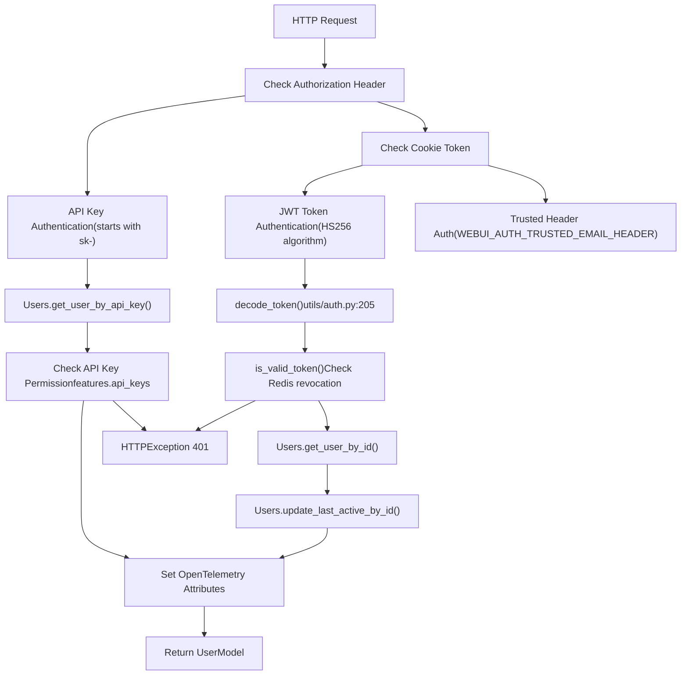
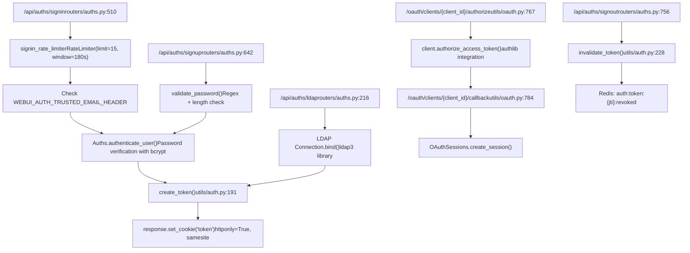
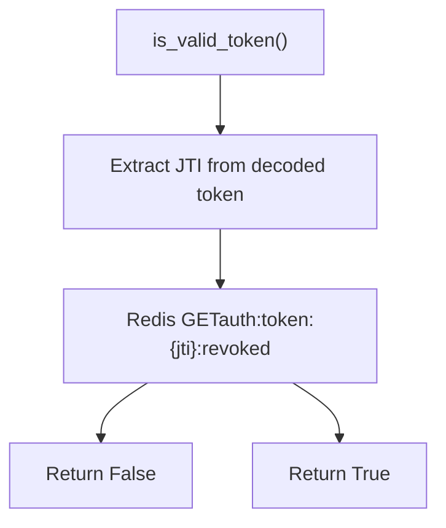
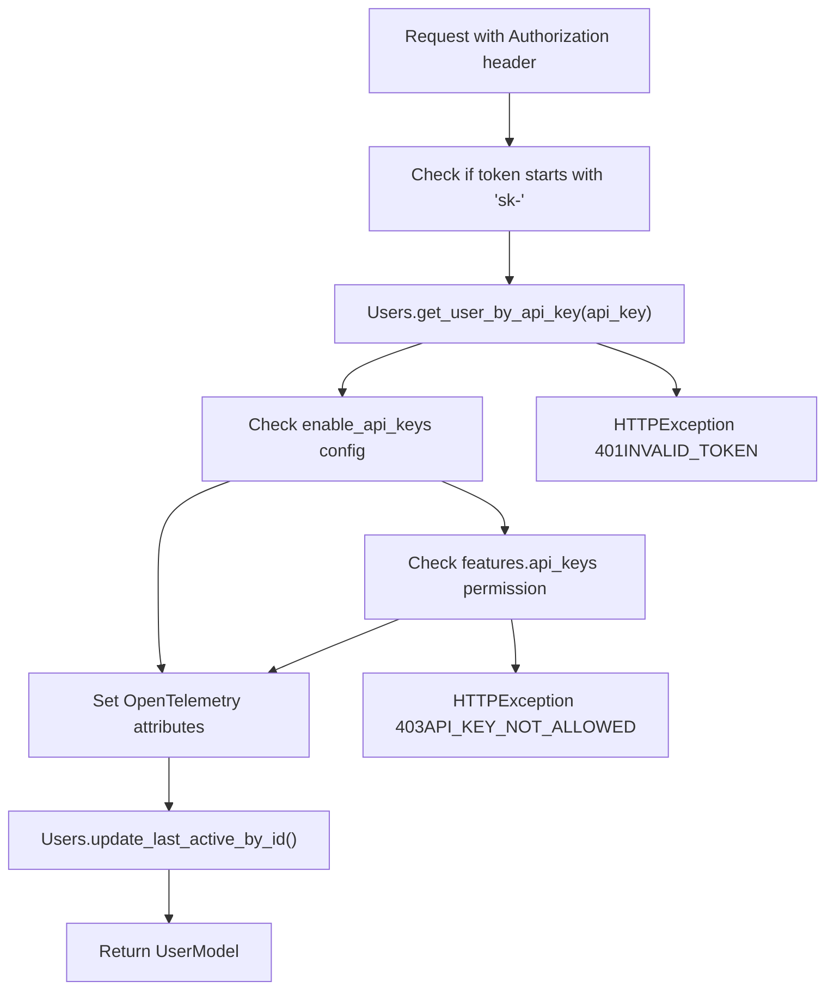
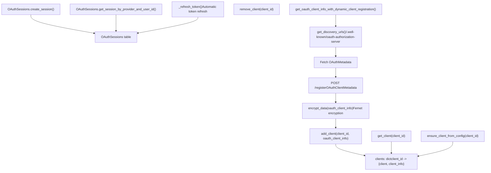
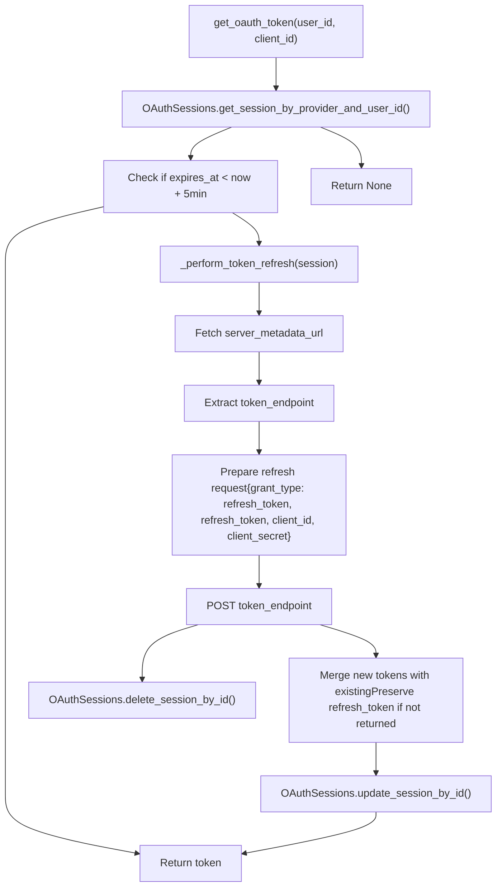
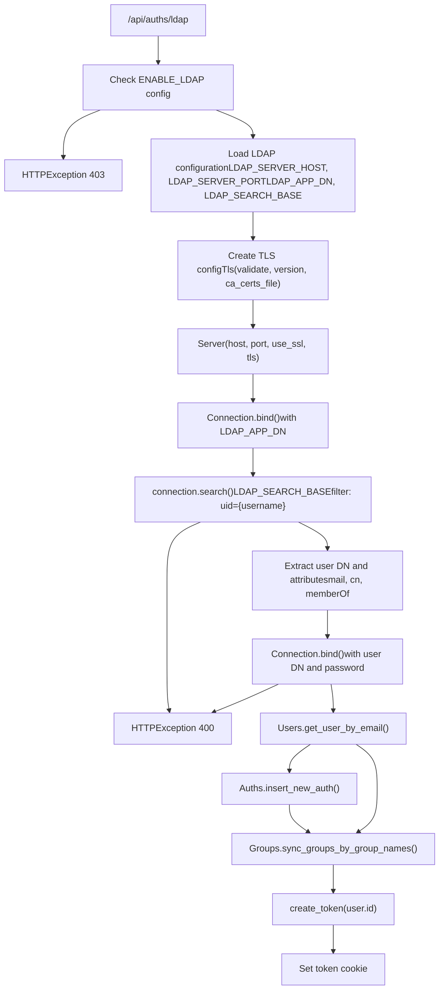
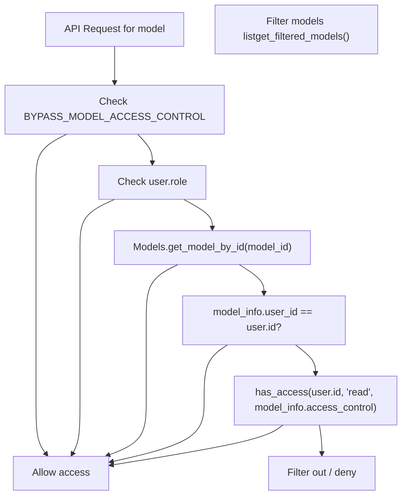
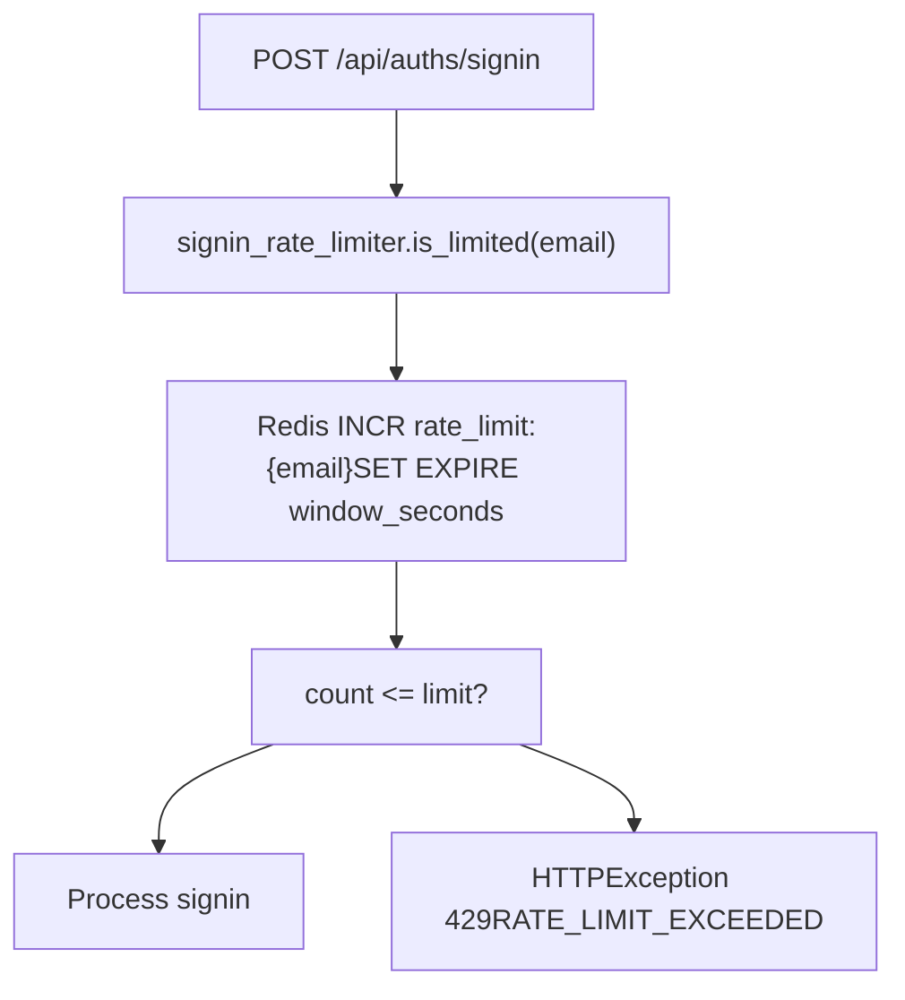

# Authentication and Security

Relevant source files

-   [backend/open\_webui/env.py](https://github.com/open-webui/open-webui/blob/a7271532/backend/open_webui/env.py)
-   [backend/open\_webui/routers/audio.py](https://github.com/open-webui/open-webui/blob/a7271532/backend/open_webui/routers/audio.py)
-   [backend/open\_webui/routers/auths.py](https://github.com/open-webui/open-webui/blob/a7271532/backend/open_webui/routers/auths.py)
-   [backend/open\_webui/routers/ollama.py](https://github.com/open-webui/open-webui/blob/a7271532/backend/open_webui/routers/ollama.py)
-   [backend/open\_webui/routers/openai.py](https://github.com/open-webui/open-webui/blob/a7271532/backend/open_webui/routers/openai.py)
-   [backend/open\_webui/utils/auth.py](https://github.com/open-webui/open-webui/blob/a7271532/backend/open_webui/utils/auth.py)
-   [backend/open\_webui/utils/embeddings.py](https://github.com/open-webui/open-webui/blob/a7271532/backend/open_webui/utils/embeddings.py)
-   [backend/open\_webui/utils/misc.py](https://github.com/open-webui/open-webui/blob/a7271532/backend/open_webui/utils/misc.py)
-   [backend/open\_webui/utils/oauth.py](https://github.com/open-webui/open-webui/blob/a7271532/backend/open_webui/utils/oauth.py)
-   [backend/open\_webui/utils/response.py](https://github.com/open-webui/open-webui/blob/a7271532/backend/open_webui/utils/response.py)

This document describes the authentication and security systems in Open WebUI, including authentication methods, token management, access control, and security features. For specific implementation details of individual authentication methods, see [Authentication Methods](/open-webui/open-webui/10.1-authentication-methods). For OAuth-specific configuration, see [OAuth Integration](/open-webui/open-webui/10.2-oauth-integration). For LDAP setup, see [LDAP Integration](/open-webui/open-webui/10.3-ldap-integration). For role-based permissions, see [Access Control and RBAC](/open-webui/open-webui/10.4-access-control-and-rbac). For session handling, see [Token and Session Management](/open-webui/open-webui/10.5-token-and-session-management).

## Overview

Open WebUI implements a multi-layered security architecture supporting five distinct authentication methods with comprehensive token management, role-based access control, and distributed session handling. The system uses JWT tokens as the primary authentication mechanism with optional Redis-backed revocation, bcrypt password hashing, and configurable security policies.

**Core Security Components:**

| Component | Purpose | Key Files |
| --- | --- | --- |
| JWT Authentication | Primary token-based authentication | `utils/auth.py` |
| API Key Authentication | Programmatic access with `sk-*` format | `utils/auth.py` |
| OAuth 2.0 Manager | SSO integration with dynamic client registration | `utils/oauth.py` |
| LDAP Connector | Active Directory integration | `routers/auths.py` |
| Trusted Header Auth | Reverse proxy authentication | `routers/auths.py` |
| Token Revocation | Redis-backed blacklist | `utils/auth.py` |
| Password Security | bcrypt hashing with validation | `utils/auth.py` |
| Rate Limiting | Redis-backed request throttling | `routers/auths.py` |

Sources: [backend/open\_webui/utils/auth.py1-416](https://github.com/open-webui/open-webui/blob/a7271532/backend/open_webui/utils/auth.py#L1-L416) [backend/open\_webui/utils/oauth.py1-1463](https://github.com/open-webui/open-webui/blob/a7271532/backend/open_webui/utils/oauth.py#L1-L1463) [backend/open\_webui/routers/auths.py1-1000](https://github.com/open-webui/open-webui/blob/a7271532/backend/open_webui/routers/auths.py#L1-L1000) [backend/open\_webui/env.py400-476](https://github.com/open-webui/open-webui/blob/a7271532/backend/open_webui/env.py#L400-L476)

## Authentication Architecture

### Authentication Method Selection Flow


Sources: [backend/open\_webui/utils/auth.py269-365](https://github.com/open-webui/open-webui/blob/a7271532/backend/open_webui/utils/auth.py#L269-L365) [backend/open\_webui/utils/auth.py367-398](https://github.com/open-webui/open-webui/blob/a7271532/backend/open_webui/utils/auth.py#L367-L398)

### Authentication Endpoint Architecture


Sources: [backend/open\_webui/routers/auths.py510-635](https://github.com/open-webui/open-webui/blob/a7271532/backend/open_webui/routers/auths.py#L510-L635) [backend/open\_webui/routers/auths.py642-754](https://github.com/open-webui/open-webui/blob/a7271532/backend/open_webui/routers/auths.py#L642-L754) [backend/open\_webui/routers/auths.py216-503](https://github.com/open-webui/open-webui/blob/a7271532/backend/open_webui/routers/auths.py#L216-L503) [backend/open\_webui/routers/auths.py756-855](https://github.com/open-webui/open-webui/blob/a7271532/backend/open_webui/routers/auths.py#L756-L855)

## JWT Token Management

### Token Structure and Lifecycle

Open WebUI uses JWT tokens with the HS256 signing algorithm. Each token contains a unique JTI (JWT ID) for revocation tracking.

**Token Creation:**

```
# Token structure from utils/auth.py:191-202
{
    "id": user.id,          # User identifier
    "exp": expire_timestamp, # Expiration time
    "jti": uuid4_string     # Unique token ID for revocation
}
```
**Token Configuration:**

| Environment Variable | Default | Purpose |
| --- | --- | --- |
| `WEBUI_SECRET_KEY` | `"t0p-s3cr3t"` | JWT signing secret (HS256) |
| `JWT_EXPIRES_IN` | Config value | Token expiration duration (e.g., `"7d"`, `"24h"`) |
| `WEBUI_AUTH_COOKIE_SAME_SITE` | `"lax"` | Cookie SameSite policy |
| `WEBUI_AUTH_COOKIE_SECURE` | `false` | Require HTTPS for cookies |

Sources: [backend/open\_webui/env.py450-473](https://github.com/open-webui/open-webui/blob/a7271532/backend/open_webui/env.py#L450-L473) [backend/open\_webui/utils/auth.py49-50](https://github.com/open-webui/open-webui/blob/a7271532/backend/open_webui/utils/auth.py#L49-L50) [backend/open\_webui/utils/auth.py191-202](https://github.com/open-webui/open-webui/blob/a7271532/backend/open_webui/utils/auth.py#L191-L202)

### Token Revocation System

> **[Mermaid sequence]**
> *(图表结构无法解析)*

**Token Validation Flow:**


Sources: [backend/open\_webui/utils/auth.py213-226](https://github.com/open-webui/open-webui/blob/a7271532/backend/open_webui/utils/auth.py#L213-L226) [backend/open\_webui/utils/auth.py228-248](https://github.com/open-webui/open-webui/blob/a7271532/backend/open_webui/utils/auth.py#L228-L248) [backend/open\_webui/routers/auths.py756-855](https://github.com/open-webui/open-webui/blob/a7271532/backend/open_webui/routers/auths.py#L756-L855)

## Password Security

### Password Hashing and Validation

Open WebUI uses bcrypt for password hashing with automatic salt generation. Password validation is optional and configurable via regex patterns.

**Hashing Implementation:**

```
# From utils/auth.py:160-162
def get_password_hash(password: str) -> str:
    """Hash a password using bcrypt"""
    return bcrypt.hashpw(password.encode("utf-8"), bcrypt.gensalt()).decode("utf-8")

# From utils/auth.py:179-188
def verify_password(plain_password: str, hashed_password: str) -> bool:
    """Verify a password against its hash"""
    return bcrypt.checkpw(
        plain_password.encode("utf-8"),
        hashed_password.encode("utf-8")
    )
```
**Password Validation Configuration:**

| Environment Variable | Default | Purpose |
| --- | --- | --- |
| `ENABLE_PASSWORD_VALIDATION` | `false` | Enable regex validation |
| `PASSWORD_VALIDATION_REGEX_PATTERN` | `^(?=.*[a-z])(?=.*[A-Z])(?=.*\d)(?=.*[^\w\s]).{8,}$` | Requires: lowercase, uppercase, digit, special char, 8+ length |

**Password Length Constraints:**

-   Maximum: 72 bytes (bcrypt limitation)
-   Passwords exceeding 72 bytes are truncated at UTF-8 boundaries during signin
-   Validation enforces maximum during signup/password change

Sources: [backend/open\_webui/utils/auth.py160-188](https://github.com/open-webui/open-webui/blob/a7271532/backend/open_webui/utils/auth.py#L160-L188) [backend/open\_webui/env.py421-436](https://github.com/open-webui/open-webui/blob/a7271532/backend/open_webui/env.py#L421-L436) [backend/open\_webui/routers/auths.py577-585](https://github.com/open-webui/open-webui/blob/a7271532/backend/open_webui/routers/auths.py#L577-L585)

## API Key Authentication

### API Key Format and Validation

API keys use the format `sk-{uuid_without_hyphens}` where the UUID provides 128 bits of randomness.

**API Key Creation:**

```
# From utils/auth.py:254-256
def create_api_key():
    key = str(uuid.uuid4()).replace("-", "")
    return f"sk-{key}"
```
**API Key Authentication Flow:**


**API Key Permission Requirements:**

| User Role | Requirement |
| --- | --- |
| `admin` | Always allowed |
| `user` | Requires `features.api_keys` permission OR `enable_api_keys` config flag |

Sources: [backend/open\_webui/utils/auth.py254-256](https://github.com/open-webui/open-webui/blob/a7271532/backend/open_webui/utils/auth.py#L254-L256) [backend/open\_webui/utils/auth.py367-398](https://github.com/open-webui/open-webui/blob/a7271532/backend/open_webui/utils/auth.py#L367-L398)

## OAuth 2.0 Architecture

### OAuth Client Management

Open WebUI implements OAuth 2.0 with dynamic client registration (DCR) following RFC 7591, supporting automatic client registration with authorization servers.


**OAuth Client Metadata Structure:**

```
# From utils/oauth.py:86-102
class OAuthClientInformationFull:
    issuer: Optional[str]                    # OAuth server metadata URL
    client_id: str                           # Client identifier
    client_secret: str | None                # Client secret (if applicable)
    client_id_issued_at: int | None         # Unix timestamp
    client_secret_expires_at: int | None    # Unix timestamp
    server_metadata: Optional[OAuthMetadata] # Fetched metadata
    redirect_uris: list[str]                # Callback URLs
    grant_types: list[str]                  # ["authorization_code", "refresh_token"]
    token_endpoint_auth_method: str         # "client_secret_post" (default)
```
Sources: [backend/open\_webui/utils/oauth.py403-511](https://github.com/open-webui/open-webui/blob/a7271532/backend/open_webui/utils/oauth.py#L403-L511) [backend/open\_webui/utils/oauth.py86-102](https://github.com/open-webui/open-webui/blob/a7271532/backend/open_webui/utils/oauth.py#L86-L102) [backend/open\_webui/utils/oauth.py284-401](https://github.com/open-webui/open-webui/blob/a7271532/backend/open_webui/utils/oauth.py#L284-L401)

### OAuth Authorization Flow

> **[Mermaid sequence]**
> *(图表结构无法解析)*

**OAuth Token Storage:**

Tokens are stored in the `OAuthSessions` table with automatic expiration tracking:

```
# Token structure stored in database
{
    "access_token": "...",
    "refresh_token": "...",  # Optional
    "expires_in": 3600,
    "expires_at": 1704067200,  # Unix timestamp
    "issued_at": 1704063600,   # Unix timestamp
    "token_type": "Bearer"
}
```
Sources: [backend/open\_webui/utils/oauth.py767-782](https://github.com/open-webui/open-webui/blob/a7271532/backend/open_webui/utils/oauth.py#L767-L782) [backend/open\_webui/utils/oauth.py784-863](https://github.com/open-webui/open-webui/blob/a7271532/backend/open_webui/utils/oauth.py#L784-L863) [backend/open\_webui/utils/oauth.py809-830](https://github.com/open-webui/open-webui/blob/a7271532/backend/open_webui/utils/oauth.py#L809-L830)

### OAuth Token Refresh


**Token Refresh Configuration:**

-   Tokens are refreshed automatically when `expires_at < now + 5 minutes`
-   Original `refresh_token` is preserved if not returned in new token response
-   Failed refresh attempts result in session deletion
-   Token refresh can be forced via `force_refresh=True` parameter

Sources: [backend/open\_webui/utils/oauth.py601-646](https://github.com/open-webui/open-webui/blob/a7271532/backend/open_webui/utils/oauth.py#L601-L646) [backend/open\_webui/utils/oauth.py647-675](https://github.com/open-webui/open-webui/blob/a7271532/backend/open_webui/utils/oauth.py#L647-L675) [backend/open\_webui/utils/oauth.py676-765](https://github.com/open-webui/open-webui/blob/a7271532/backend/open_webui/utils/oauth.py#L676-L765)

## LDAP Authentication

### LDAP Connection Flow


**LDAP Configuration Variables:**

| Environment Variable | Purpose |
| --- | --- |
| `LDAP_SERVER_HOST` | LDAP server hostname |
| `LDAP_SERVER_PORT` | LDAP server port (389 or 636) |
| `LDAP_USE_TLS` | Enable TLS/SSL connection |
| `LDAP_APP_DN` | Application bind DN |
| `LDAP_APP_PASSWORD` | Application bind password |
| `LDAP_SEARCH_BASE` | Base DN for user search |
| `LDAP_SEARCH_FILTERS` | Additional LDAP filters |
| `LDAP_ATTRIBUTE_FOR_USERNAME` | Attribute for username (e.g., `uid`, `sAMAccountName`) |
| `LDAP_ATTRIBUTE_FOR_MAIL` | Attribute for email (e.g., `mail`) |
| `LDAP_ATTRIBUTE_FOR_GROUPS` | Attribute for groups (e.g., `memberOf`) |

**LDAP Group Synchronization:**

When `ENABLE_LDAP_GROUP_MANAGEMENT` is enabled:

1.  Extract group DNs from `memberOf` attribute
2.  Parse CN (Common Name) from each DN: `CN=GroupName,OU=Groups,DC=example,DC=com` → `GroupName`
3.  Optionally create groups via `Groups.create_groups_by_group_names()` if `ENABLE_LDAP_GROUP_CREATION` is enabled
4.  Sync user's group memberships via `Groups.sync_groups_by_group_names()`

Sources: [backend/open\_webui/routers/auths.py216-503](https://github.com/open-webui/open-webui/blob/a7271532/backend/open_webui/routers/auths.py#L216-L503) [backend/open\_webui/routers/auths.py278-390](https://github.com/open-webui/open-webui/blob/a7271532/backend/open_webui/routers/auths.py#L278-L390) [backend/open\_webui/routers/auths.py470-484](https://github.com/open-webui/open-webui/blob/a7271532/backend/open_webui/routers/auths.py#L470-L484)

## Access Control and Model Permissions

### Role-Based Access Control (RBAC)

Open WebUI implements three user roles with hierarchical permissions:

| Role | Description | Default Assignment |
| --- | --- | --- |
| `admin` | Full system access, configuration management | First user only |
| `user` | Standard access with model restrictions | Subsequent users |
| `pending` | Restricted access, requires approval | Not used by default |

**Role Enforcement Points:**

```
# Admin-only endpoint protection (utils/auth.py:409-415)
def get_admin_user(user=Depends(get_current_user)):
    if user.role != "admin":
        raise HTTPException(status_code=401, detail=ERROR_MESSAGES.ACCESS_PROHIBITED)
    return user

# Verified user endpoint protection (utils/auth.py:400-406)
def get_verified_user(user=Depends(get_current_user)):
    if user.role not in {"user", "admin"}:
        raise HTTPException(status_code=401, detail=ERROR_MESSAGES.ACCESS_PROHIBITED)
    return user
```
Sources: [backend/open\_webui/utils/auth.py400-415](https://github.com/open-webui/open-webui/blob/a7271532/backend/open_webui/utils/auth.py#L400-L415) [backend/open\_webui/routers/auths.py677-684](https://github.com/open-webui/open-webui/blob/a7271532/backend/open_webui/routers/auths.py#L677-L684)

### Model Access Control


**Model Access Control Bypass:**

The `BYPASS_MODEL_ACCESS_CONTROL` environment variable disables all model-level access control checks, granting all users access to all models regardless of ownership or ACL settings.

**Model Filtering Implementation:**

```
# From routers/openai.py:456-466 and routers/ollama.py:424-434
async def get_filtered_models(models, user):
    filtered_models = []
    for model in models.get("models", []):  # or models.get("data", []) for OpenAI
        model_info = Models.get_model_by_id(model["id"])
        if model_info:
            if user.id == model_info.user_id or has_access(
                user.id, type="read", access_control=model_info.access_control
            ):
                filtered_models.append(model)
    return filtered_models
```
Sources: [backend/open\_webui/env.py438-440](https://github.com/open-webui/open-webui/blob/a7271532/backend/open_webui/env.py#L438-L440) [backend/open\_webui/routers/openai.py456-466](https://github.com/open-webui/open-webui/blob/a7271532/backend/open_webui/routers/openai.py#L456-L466) [backend/open\_webui/routers/ollama.py424-434](https://github.com/open-webui/open-webui/blob/a7271532/backend/open_webui/routers/ollama.py#L424-L434)

## Rate Limiting

### Rate Limiter Implementation

Rate limiting is implemented using Redis for distributed state tracking with configurable limits and windows.

**Signin Rate Limiter Configuration:**

```
# From routers/auths.py:84-86
signin_rate_limiter = RateLimiter(
    redis_client=get_redis_client(),
    limit=5 * 3,    # 15 requests
    window=60 * 3   # 180 seconds (3 minutes)
)
```
**Rate Limiting Flow:**


**Rate Limiting Scope:**

-   Applied per email address for signin attempts
-   Requires Redis connection for state storage
-   Sliding window implementation (count resets after window expires)
-   Returns HTTP 429 (Too Many Requests) when limit exceeded

Sources: [backend/open\_webui/routers/auths.py84-86](https://github.com/open-webui/open-webui/blob/a7271532/backend/open_webui/routers/auths.py#L84-L86) [backend/open\_webui/routers/auths.py571-576](https://github.com/open-webui/open-webui/blob/a7271532/backend/open_webui/routers/auths.py#L571-L576)

## Trusted Header Authentication

Trusted header authentication allows reverse proxies to handle authentication, passing user identity via HTTP headers.

**Configuration:**

| Environment Variable | Purpose |
| --- | --- |
| `WEBUI_AUTH_TRUSTED_EMAIL_HEADER` | Header name for user email (e.g., `X-Forwarded-Email`) |
| `WEBUI_AUTH_TRUSTED_NAME_HEADER` | Header name for user display name |
| `WEBUI_AUTH_TRUSTED_GROUPS_HEADER` | Header name for group memberships (comma-separated) |

**Trusted Header Flow:**

> **[Mermaid sequence]**
> *(图表结构无法解析)*

**Security Considerations:**

-   Trusted header authentication **must** be used behind a properly configured reverse proxy
-   The proxy must strip/override these headers from client requests
-   Never expose trusted header endpoints directly to the internet
-   User passwords are set to random UUIDs (authentication is delegated to proxy)

Sources: [backend/open\_webui/env.py412-418](https://github.com/open-webui/open-webui/blob/a7271532/backend/open_webui/env.py#L412-L418) [backend/open\_webui/routers/auths.py518-548](https://github.com/open-webui/open-webui/blob/a7271532/backend/open_webui/routers/auths.py#L518-L548)

## Security Features

### Cookie Security Configuration

All authentication cookies are configured with security flags based on environment variables:

| Cookie Name | Purpose | Configuration |
| --- | --- | --- |
| `token` | JWT authentication token | `httponly=True`, `samesite=WEBUI_AUTH_COOKIE_SAME_SITE`, `secure=WEBUI_AUTH_COOKIE_SECURE` |
| `oui-session` | Session tracking | Same as `token` |
| `oauth_id_token` | OAuth ID token (optional) | Controlled by `ENABLE_OAUTH_ID_TOKEN_COOKIE` |
| `oauth_session_id` | OAuth session identifier | Same as `token` |

**Cookie Flags:**

-   `httponly=True`: Prevents JavaScript access, mitigating XSS attacks
-   `samesite`: Controls cross-site request behavior (`"lax"`, `"strict"`, or `"none"`)
-   `secure`: Requires HTTPS when set to `true`
-   `expires`: Set to JWT expiration timestamp

Sources: [backend/open\_webui/env.py457-473](https://github.com/open-webui/open-webui/blob/a7271532/backend/open_webui/env.py#L457-L473) [backend/open\_webui/routers/auths.py126-137](https://github.com/open-webui/open-webui/blob/a7271532/backend/open_webui/routers/auths.py#L126-L137) [backend/open\_webui/routers/auths.py609-616](https://github.com/open-webui/open-webui/blob/a7271532/backend/open_webui/routers/auths.py#L609-L616)

### Encryption for Sensitive Data

**OAuth Client Credentials Encryption:**

OAuth client information (including `client_secret`) is encrypted using Fernet (symmetric encryption) before storage:

```
# From utils/oauth.py:134-145
FERNET = None
if len(OAUTH_CLIENT_INFO_ENCRYPTION_KEY) != 44:
    key_bytes = hashlib.sha256(OAUTH_CLIENT_INFO_ENCRYPTION_KEY.encode()).digest()
    OAUTH_CLIENT_INFO_ENCRYPTION_KEY = base64.urlsafe_b64encode(key_bytes)
else:
    OAUTH_CLIENT_INFO_ENCRYPTION_KEY = OAUTH_CLIENT_INFO_ENCRYPTION_KEY.encode()

try:
    FERNET = Fernet(OAUTH_CLIENT_INFO_ENCRYPTION_KEY)
except Exception as e:
    log.error(f"Error initializing Fernet with provided key: {e}")
    raise
```
**Encryption Functions:**

```
# From utils/oauth.py:147-165
def encrypt_data(data) -> str:
    """Encrypt data for storage"""
    data_json = json.dumps(data)
    encrypted = FERNET.encrypt(data_json.encode()).decode()
    return encrypted

def decrypt_data(data: str):
    """Decrypt data from storage"""
    decrypted = FERNET.decrypt(data.encode()).decode()
    return json.loads(decrypted)
```
**Encryption Keys:**

| Environment Variable | Purpose | Default |
| --- | --- | --- |
| `OAUTH_CLIENT_INFO_ENCRYPTION_KEY` | Key for OAuth client data | `WEBUI_SECRET_KEY` |
| `OAUTH_SESSION_TOKEN_ENCRYPTION_KEY` | Key for OAuth session tokens | `WEBUI_SECRET_KEY` |

Sources: [backend/open\_webui/utils/oauth.py134-165](https://github.com/open-webui/open-webui/blob/a7271532/backend/open_webui/utils/oauth.py#L134-L165) [backend/open\_webui/env.py493-499](https://github.com/open-webui/open-webui/blob/a7271532/backend/open_webui/env.py#L493-L499)

### Audit Logging

Audit logging captures authentication and authorization events for security monitoring and compliance.

**Audit Log Levels:**

| Level | Events Captured |
| --- | --- |
| `NONE` | Disabled |
| `METADATA` | User ID, endpoint, timestamp |
| `REQUEST` | Metadata + request body (truncated to `MAX_BODY_LOG_SIZE`) |
| `REQUEST_RESPONSE` | Metadata + request + response |

**Configuration:**

| Environment Variable | Default | Purpose |
| --- | --- | --- |
| `AUDIT_LOG_LEVEL` | `"NONE"` | Log verbosity |
| `AUDIT_LOGS_FILE_PATH` | `{DATA_DIR}/audit.log` | Log file location |
| `AUDIT_LOG_FILE_ROTATION_SIZE` | `"10MB"` | Rotation threshold |
| `MAX_BODY_LOG_SIZE` | `2048` | Maximum body bytes to log |
| `AUDIT_EXCLUDED_PATHS` | `"/chats,/chat,/folders"` | Paths to exclude from audit |

Sources: [backend/open\_webui/env.py778-806](https://github.com/open-webui/open-webui/blob/a7271532/backend/open_webui/env.py#L778-L806)

### OpenTelemetry Integration

Authentication events are traced using OpenTelemetry for observability:

**Span Attributes Set During Authentication:**

```
# From utils/auth.py:290-296
current_span = trace.get_current_span()
if current_span:
    current_span.set_attribute("client.user.id", user.id)
    current_span.set_attribute("client.user.email", user.email)
    current_span.set_attribute("client.user.role", user.role)
    current_span.set_attribute("client.auth.type", "api_key")  # or "jwt"
```
**Tracing Configuration:**

OpenTelemetry tracing is enabled via environment variables defined in [backend/open\_webui/env.py812-875](https://github.com/open-webui/open-webui/blob/a7271532/backend/open_webui/env.py#L812-L875) including:

-   `ENABLE_OTEL_TRACES`
-   `OTEL_EXPORTER_OTLP_ENDPOINT`
-   `OTEL_SERVICE_NAME`
-   `OTEL_TRACES_SAMPLER`

Sources: [backend/open\_webui/utils/auth.py290-296](https://github.com/open-webui/open-webui/blob/a7271532/backend/open_webui/utils/auth.py#L290-L296) [backend/open\_webui/utils/auth.py334-340](https://github.com/open-webui/open-webui/blob/a7271532/backend/open_webui/utils/auth.py#L334-L340) [backend/open\_webui/env.py812-875](https://github.com/open-webui/open-webui/blob/a7271532/backend/open_webui/env.py#L812-L875)

## Session Management

### Last Active Tracking

User activity is tracked asynchronously via background tasks to avoid blocking request processing:

```
# From utils/auth.py:342-345
if background_tasks:
    background_tasks.add_task(Users.update_last_active_by_id, user.id)
```
**Update Interval Configuration:**

The `DATABASE_USER_ACTIVE_STATUS_UPDATE_INTERVAL` environment variable controls the minimum interval (in seconds) between last active timestamp updates. Setting this to a higher value reduces database write load in high-traffic scenarios.

Sources: [backend/open\_webui/utils/auth.py342-345](https://github.com/open-webui/open-webui/blob/a7271532/backend/open_webui/utils/auth.py#L342-L345) [backend/open\_webui/env.py331-341](https://github.com/open-webui/open-webui/blob/a7271532/backend/open_webui/env.py#L331-L341)

### Session Persistence

Sessions are persisted through multiple mechanisms:

1.  **JWT Tokens**: Stateless authentication with optional Redis revocation
2.  **OAuth Sessions**: Database-backed sessions in `OAuthSessions` table
3.  **Cookies**: HTTP-only cookies for web browser clients
4.  **Redis**: Optional session state for distributed deployments (via `REDIS_URL`)

**Session Expiration:**

-   JWT tokens expire based on `JWT_EXPIRES_IN` configuration
-   OAuth access tokens expire based on `expires_in` from token response
-   Cookies expire when JWT expires
-   Redis revocation entries expire when token expires (automatic TTL)

Sources: [backend/open\_webui/utils/auth.py191-202](https://github.com/open-webui/open-webui/blob/a7271532/backend/open_webui/utils/auth.py#L191-L202) [backend/open\_webui/env.py361-377](https://github.com/open-webui/open-webui/blob/a7271532/backend/open_webui/env.py#L361-L377)
