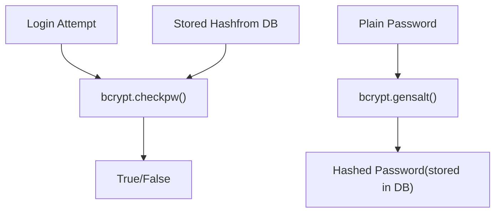
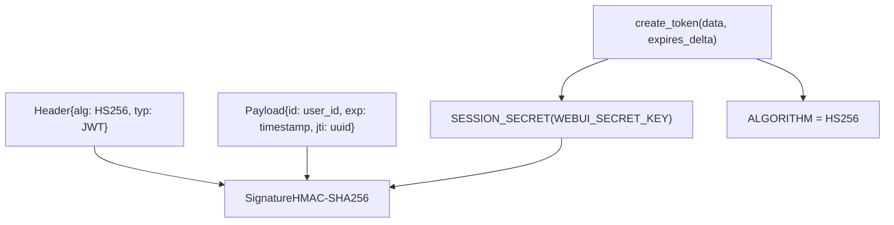
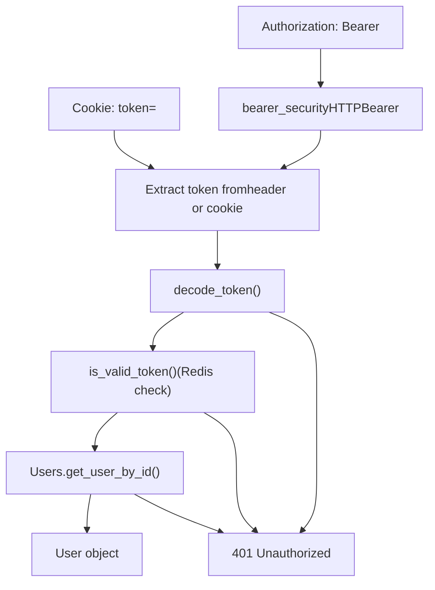
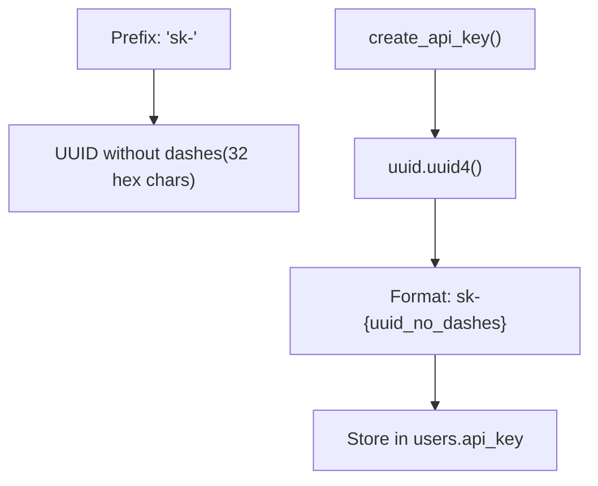
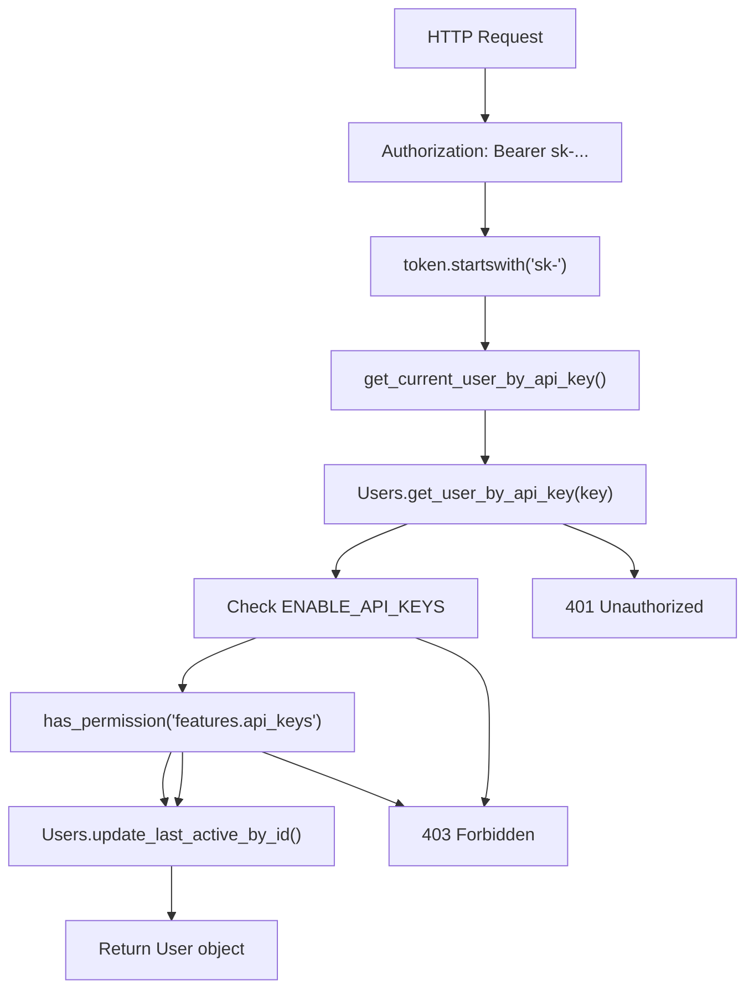
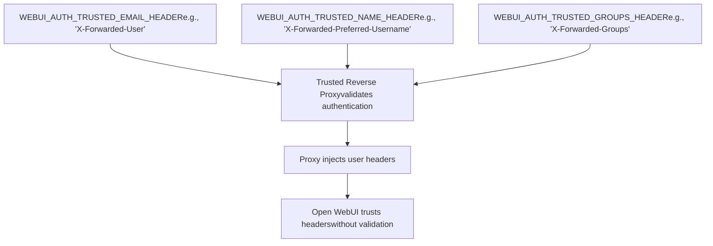
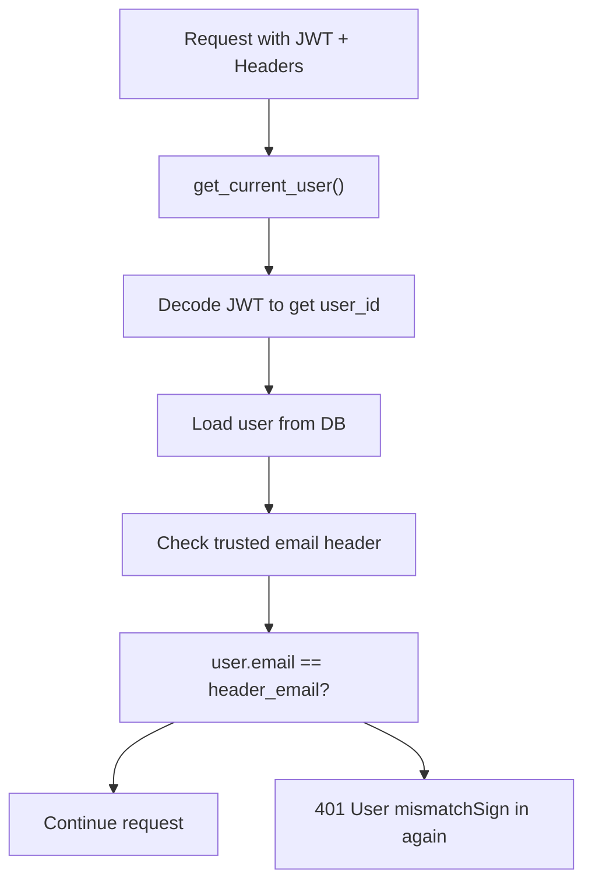
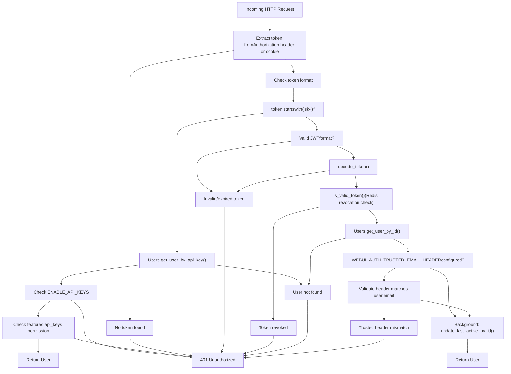

# Authentication Methods

Relevant source files

-   [backend/open\_webui/env.py](https://github.com/open-webui/open-webui/blob/a7271532/backend/open_webui/env.py)
-   [backend/open\_webui/routers/audio.py](https://github.com/open-webui/open-webui/blob/a7271532/backend/open_webui/routers/audio.py)
-   [backend/open\_webui/routers/auths.py](https://github.com/open-webui/open-webui/blob/a7271532/backend/open_webui/routers/auths.py)
-   [backend/open\_webui/routers/ollama.py](https://github.com/open-webui/open-webui/blob/a7271532/backend/open_webui/routers/ollama.py)
-   [backend/open\_webui/routers/openai.py](https://github.com/open-webui/open-webui/blob/a7271532/backend/open_webui/routers/openai.py)
-   [backend/open\_webui/utils/auth.py](https://github.com/open-webui/open-webui/blob/a7271532/backend/open_webui/utils/auth.py)
-   [backend/open\_webui/utils/embeddings.py](https://github.com/open-webui/open-webui/blob/a7271532/backend/open_webui/utils/embeddings.py)
-   [backend/open\_webui/utils/misc.py](https://github.com/open-webui/open-webui/blob/a7271532/backend/open_webui/utils/misc.py)
-   [backend/open\_webui/utils/oauth.py](https://github.com/open-webui/open-webui/blob/a7271532/backend/open_webui/utils/oauth.py)
-   [backend/open\_webui/utils/response.py](https://github.com/open-webui/open-webui/blob/a7271532/backend/open_webui/utils/response.py)

This page documents the core authentication methods available in Open WebUI for verifying user identity. It covers local password authentication, JWT token lifecycle, API key authentication, and trusted header authentication for reverse proxy deployments.

For OAuth/OIDC integration, see [OAuth Integration](/open-webui/open-webui/10.2-oauth-integration). For LDAP authentication, see [LDAP Integration](/open-webui/open-webui/10.3-ldap-integration). For authorization and permissions, see [Permissions and RBAC](/open-webui/open-webui/10.4-access-control-and-rbac). For detailed token management implementation, see [Session and Token Management](/open-webui/open-webui/10.5-token-and-session-management).

## Overview of Authentication Methods

Open WebUI supports four primary authentication methods that can be used independently or in combination:

| Authentication Method | Use Case | Token Format | Configuration |
| --- | --- | --- | --- |
| **Local Password** | Standard user login via web UI | JWT in cookie or `Authorization` header | `WEBUI_AUTH=true` (default) |
| **JWT Token** | Session-based authentication after any login method | `Bearer <token>` | `WEBUI_SECRET_KEY` |
| **API Key** | Programmatic access for scripts/applications | `sk-<uuid>` in `Authorization` header | `ENABLE_API_KEYS=true` |
| **Trusted Header** | Reverse proxy authentication (SSO) | Email in custom header | `WEBUI_AUTH_TRUSTED_EMAIL_HEADER` |

**Sources:** [backend/open\_webui/env.py413-428](https://github.com/open-webui/open-webui/blob/a7271532/backend/open_webui/env.py#L413-L428) [backend/open\_webui/utils/auth.py159-418](https://github.com/open-webui/open-webui/blob/a7271532/backend/open_webui/utils/auth.py#L159-L418) [backend/open\_webui/routers/auths.py507-632](https://github.com/open-webui/open-webui/blob/a7271532/backend/open_webui/routers/auths.py#L507-L632)

## Authentication Configuration

### Global Authentication Settings

```mermaid
flowchart TD
    WEBUI_AUTH["WEBUI_AUTH(enable/disable auth)"]
    WEBUI_SECRET_KEY["WEBUI_SECRET_KEY(JWT signing key)"]
    ENABLE_PASSWORD_AUTH["ENABLE_PASSWORD_AUTH(allow password login)"]
    ENABLE_API_KEYS["ENABLE_API_KEYS(allow API keys)"]
    TRUSTED_EMAIL["WEBUI_AUTH_TRUSTED_EMAIL_HEADER(reverse proxy header)"]
    AuthRouter["/auth routesauths.py"]
    AuthUtils["auth.py utilitiesget_current_user()"]

    WEBUI --> AUTH_AuthRouter
    WEBUI --> SECRET_KEY_AuthUtils
    ENABLE --> PASSWORD_AUTH_AuthRouter
    ENABLE --> API_KEYS_AuthUtils
    TRUSTED --> EMAIL_AuthRouter
```


**Sources:** [backend/open\_webui/env.py413-428](https://github.com/open-webui/open-webui/blob/a7271532/backend/open_webui/env.py#L413-L428) [backend/open\_webui/routers/auths.py32-49](https://github.com/open-webui/open-webui/blob/a7271532/backend/open_webui/routers/auths.py#L32-L49)

### Key Configuration Variables

| Variable | Type | Default | Description |
| --- | --- | --- | --- |
| `WEBUI_AUTH` | boolean | `true` | Master toggle for authentication system |
| `WEBUI_SECRET_KEY` | string | `"t0p-s3cr3t"` | Secret key for JWT signing (must be changed in production) |
| `ENABLE_PASSWORD_AUTH` | boolean | `true` | Allow local password authentication |
| `ENABLE_API_KEYS` | boolean | configurable | Allow API key creation and usage |
| `ENABLE_PASSWORD_VALIDATION` | boolean | `false` | Enforce password complexity requirements |
| `PASSWORD_VALIDATION_REGEX_PATTERN` | regex | complex pattern | Regex pattern for password validation |
| `WEBUI_AUTH_COOKIE_SAME_SITE` | string | `"lax"` | SameSite attribute for auth cookies |
| `WEBUI_AUTH_COOKIE_SECURE` | boolean | `false` | Require HTTPS for auth cookies |

**Sources:** [backend/open\_webui/env.py413-481](https://github.com/open-webui/open-webui/blob/a7271532/backend/open_webui/env.py#L413-L481)

## Local Password Authentication

Local password authentication provides traditional username/password login functionality with bcrypt password hashing and JWT token issuance.

### Password Storage and Verification


The system uses bcrypt for password hashing with automatic salt generation:

-   **Hashing**: `get_password_hash()` uses `bcrypt.hashpw()` with `bcrypt.gensalt()`
-   **Verification**: `verify_password()` uses `bcrypt.checkpw()` for constant-time comparison
-   **Length Limit**: bcrypt enforces a 72-byte maximum; longer passwords are truncated with UTF-8 error handling

**Sources:** [backend/open\_webui/utils/auth.py162-190](https://github.com/open-webui/open-webui/blob/a7271532/backend/open_webui/utils/auth.py#L162-L190) [backend/open\_webui/routers/auths.py574-585](https://github.com/open-webui/open-webui/blob/a7271532/backend/open_webui/routers/auths.py#L574-L585)

### Password Validation

When `ENABLE_PASSWORD_VALIDATION=true`, passwords must match the configured regex pattern:

```
# Default pattern (from env.py:437-442)
PASSWORD_VALIDATION_REGEX_PATTERN = "^(?=.*[a-z])(?=.*[A-Z])(?=.*\d)(?=.*[^\w\s]).{8,}$"
```
This default requires:

-   At least 8 characters
-   One lowercase letter
-   One uppercase letter
-   One digit
-   One special character

The validation occurs in `validate_password()` at [backend/open\_webui/utils/auth.py167-178](https://github.com/open-webui/open-webui/blob/a7271532/backend/open_webui/utils/auth.py#L167-L178)

**Sources:** [backend/open\_webui/env.py434-442](https://github.com/open-webui/open-webui/blob/a7271532/backend/open_webui/env.py#L434-L442) [backend/open\_webui/utils/auth.py167-178](https://github.com/open-webui/open-webui/blob/a7271532/backend/open_webui/utils/auth.py#L167-L178)

### Sign In Flow

> **[Mermaid sequence]**
> *(图表结构无法解析)*

**Key Implementation Details:**

1.  **Rate Limiting**: The `signin_rate_limiter` allows 15 attempts per 3 minutes per email
2.  **Password Truncation**: Passwords longer than 72 bytes are truncated for bcrypt compatibility
3.  **Cookie Setting**: Token is set in HTTP-only cookie with configurable SameSite and Secure attributes
4.  **Response**: Returns JWT token, user info, and permissions

**Sources:** [backend/open\_webui/routers/auths.py507-632](https://github.com/open-webui/open-webui/blob/a7271532/backend/open_webui/routers/auths.py#L507-L632) [backend/open\_webui/routers/auths.py86-88](https://github.com/open-webui/open-webui/blob/a7271532/backend/open_webui/routers/auths.py#L86-L88)

### Sign Up Flow

> **[Mermaid sequence]**
> *(图表结构无法解析)*

**Key Implementation Details:**

1.  **First User**: The first user automatically becomes admin; `ENABLE_SIGNUP` is disabled after first signup
2.  **Email Validation**: Uses `validate_email_format()` to check email structure
3.  **Password Validation**: Enforces complexity rules if `ENABLE_PASSWORD_VALIDATION=true`
4.  **Default Groups**: Automatically assigns user to `DEFAULT_GROUP_ID` if configured
5.  **Webhook**: Fires webhook notification if `WEBHOOK_URL` is configured

**Sources:** [backend/open\_webui/routers/auths.py639-751](https://github.com/open-webui/open-webui/blob/a7271532/backend/open_webui/routers/auths.py#L639-L751)

## JWT Token Authentication

JWT (JSON Web Token) is the primary session mechanism after any authentication method. All authentication methods ultimately issue a JWT token for subsequent requests.

### Token Structure and Claims


**Token Claims:**

| Claim | Type | Description |
| --- | --- | --- |
| `id` | string | User ID (primary identifier) |
| `exp` | int | Expiration timestamp (Unix epoch) |
| `jti` | string | JWT ID (UUID v4 for revocation tracking) |

**Sources:** [backend/open\_webui/utils/auth.py51-52](https://github.com/open-webui/open-webui/blob/a7271532/backend/open_webui/utils/auth.py#L51-L52) [backend/open\_webui/utils/auth.py193-204](https://github.com/open-webui/open-webui/blob/a7271532/backend/open_webui/utils/auth.py#L193-L204)

### Token Lifecycle

> **[Mermaid stateDiagram]**
> *(图表结构无法解析)*

**Token Expiration:**

The token expiration is controlled by `JWT_EXPIRES_IN` configuration, parsed by `parse_duration()`:

-   **Format**: `-1` (never), `0` (session), or duration string (`30s`, `5m`, `1h`, `7d`, `1w`)
-   **Default Behavior**: Configurable per deployment
-   **Cookie Expiry**: Set to match JWT `exp` claim for automatic cleanup

**Token Revocation:**

When Redis is available, tokens can be revoked before expiration:

1.  Extract `jti` (JWT ID) from token
2.  Store in Redis: `{REDIS_KEY_PREFIX}:auth:token:{jti}:revoked` = `"1"`
3.  Set TTL equal to remaining token lifetime
4.  Subsequent requests check Redis before accepting token

**Sources:** [backend/open\_webui/utils/auth.py193-250](https://github.com/open-webui/open-webui/blob/a7271532/backend/open_webui/utils/auth.py#L193-L250) [backend/open\_webui/routers/auths.py589-597](https://github.com/open-webui/open-webui/blob/a7271532/backend/open_webui/routers/auths.py#L589-L597)

### Token Transmission and Validation


**Validation Steps in `get_current_user()`:**

1.  **Extract**: Token from `Authorization: Bearer` header or `token` cookie
2.  **Decode**: JWT using `SESSION_SECRET` and `HS256` algorithm
3.  **Check Revocation**: Query Redis for revoked JTI (if Redis available)
4.  **Verify User**: Load user from database using `id` claim
5.  **Update Activity**: Background task updates `last_active` timestamp
6.  **Add Telemetry**: Set OpenTelemetry span attributes with user info

**Sources:** [backend/open\_webui/utils/auth.py271-367](https://github.com/open-webui/open-webui/blob/a7271532/backend/open_webui/utils/auth.py#L271-L367)

### Cookie Configuration

JWT tokens are transmitted via HTTP-only cookies with security attributes:

```
response.set_cookie(
    key="token",
    value=token,
    expires=datetime_expires_at,
    httponly=True,                            # Not accessible via JavaScript
    samesite=WEBUI_AUTH_COOKIE_SAME_SITE,    # Default: "lax"
    secure=WEBUI_AUTH_COOKIE_SECURE          # Default: false
)
```
| Attribute | Value | Purpose |
| --- | --- | --- |
| `httponly` | `True` | Prevents XSS attacks by blocking JavaScript access |
| `samesite` | `lax`/`strict`/`none` | CSRF protection; `lax` allows navigation |
| `secure` | `true`/`false` | Requires HTTPS; set to `true` in production |
| `expires` | ISO timestamp | Matches JWT `exp` for automatic cleanup |

**Sources:** [backend/open\_webui/env.py464-480](https://github.com/open-webui/open-webui/blob/a7271532/backend/open_webui/env.py#L464-L480) [backend/open\_webui/routers/auths.py605-613](https://github.com/open-webui/open-webui/blob/a7271532/backend/open_webui/routers/auths.py#L605-L613)

## API Key Authentication

API keys provide long-lived authentication tokens for programmatic access to Open WebUI APIs. They are designed for scripts, CI/CD pipelines, and integrations.

### API Key Format and Generation


**Format:** `sk-<32_hex_characters>`

**Example:** `sk-a1b2c3d4e5f6g7h8i9j0k1l2m3n4o5p6`

The `sk-` prefix identifies the token as an API key (distinguishing it from JWT tokens) and follows common API key conventions.

**Sources:** [backend/open\_webui/utils/auth.py256-258](https://github.com/open-webui/open-webui/blob/a7271532/backend/open_webui/utils/auth.py#L256-L258)

### API Key Management Endpoints

| Endpoint | Method | Description | Permission Required |
| --- | --- | --- | --- |
| `/auth/api_key` | POST | Generate new API key | `features.api_keys` or admin |
| `/auth/api_key` | GET | Retrieve current API key | User authenticated |
| `/auth/api_key` | DELETE | Delete API key | User authenticated |

**Key Management Flow:**

> **[Mermaid sequence]**
> *(图表结构无法解析)*

**Sources:** [backend/open\_webui/routers/auths.py1148-1185](https://github.com/open-webui/open-webui/blob/a7271532/backend/open_webui/routers/auths.py#L1148-L1185)

### API Key Authentication Flow


**Validation Steps:**

1.  **Prefix Check**: Token starts with `sk-` to route to API key authentication
2.  **Lookup**: Query `users.api_key` for matching key
3.  **Configuration Check**: Verify `ENABLE_API_KEYS` is enabled at app level
4.  **Permission Check**: User must be admin OR have `features.api_keys` permission
5.  **Activity Update**: Update `last_active` timestamp (synchronous, not background)
6.  **Telemetry**: Add `client.auth.type="api_key"` to OpenTelemetry span

**Sources:** [backend/open\_webui/utils/auth.py288-300](https://github.com/open-webui/open-webui/blob/a7271532/backend/open_webui/utils/auth.py#L288-L300) [backend/open\_webui/utils/auth.py369-399](https://github.com/open-webui/open-webui/blob/a7271532/backend/open_webui/utils/auth.py#L369-L399)

### API Key Security Considerations

| Aspect | Implementation | Security Benefit |
| --- | --- | --- |
| **Storage** | Stored in plaintext in `users.api_key` | Allows lookup; users must protect keys |
| **One Per User** | Single API key per user | Limits attack surface |
| **Permission Gating** | Requires `features.api_keys` permission | Admin control over who can use API keys |
| **Global Toggle** | `ENABLE_API_KEYS` configuration | Can disable entirely if not needed |
| **No Expiration** | Keys don't expire automatically | Must be manually rotated/deleted |
| **Rate Limiting** | Not implemented for API keys | Consider adding in reverse proxy |

**Best Practices:**

-   Rotate API keys periodically
-   Use environment variables to store keys in client applications
-   Delete unused API keys
-   Monitor API key usage via activity logs
-   Consider disabling API keys if only OAuth is needed

**Sources:** [backend/open\_webui/routers/auths.py1148-1185](https://github.com/open-webui/open-webui/blob/a7271532/backend/open_webui/routers/auths.py#L1148-L1185)

## Trusted Header Authentication

Trusted header authentication enables Single Sign-On (SSO) integration through reverse proxies like Nginx, Apache, or authentication gateways like Authelia, Authentik, or Keycloak Gatekeeper.

### Configuration


**⚠️ Security Warning:** Trusted header authentication assumes headers are injected by a trusted reverse proxy. Direct exposure to the internet without a proxy will allow header spoofing and authentication bypass.

**Configuration Variables:**

| Variable | Required | Example | Description |
| --- | --- | --- | --- |
| `WEBUI_AUTH_TRUSTED_EMAIL_HEADER` | Yes | `X-Forwarded-User` | Header containing user's email |
| `WEBUI_AUTH_TRUSTED_NAME_HEADER` | No | `X-Forwarded-Preferred-Username` | Header containing user's display name |
| `WEBUI_AUTH_TRUSTED_GROUPS_HEADER` | No | `X-Forwarded-Groups` | Comma-separated list of group names |

**Sources:** [backend/open\_webui/env.py425-431](https://github.com/open-webui/open-webui/blob/a7271532/backend/open_webui/env.py#L425-L431) [backend/open\_webui/routers/auths.py515-545](https://github.com/open-webui/open-webui/blob/a7271532/backend/open_webui/routers/auths.py#L515-L545)

### Trusted Header Authentication Flow

> **[Mermaid sequence]**
> *(图表结构无法解析)*

**Key Implementation Details:**

1.  **Header Requirement**: `WEBUI_AUTH_TRUSTED_EMAIL_HEADER` must be present in all requests
2.  **Auto-Provisioning**: Users are automatically created on first access with a random UUID password
3.  **Name Decoding**: URL-encoded names are decoded with UTF-8 handling
4.  **Group Sync**: Groups are synchronized on every login if `WEBUI_AUTH_TRUSTED_GROUPS_HEADER` is configured
5.  **Admin Exemption**: Admin users skip group synchronization
6.  **Disabled Actions**: Password changes are prohibited when trusted headers are enabled

**Sources:** [backend/open\_webui/routers/auths.py515-545](https://github.com/open-webui/open-webui/blob/a7271532/backend/open_webui/routers/auths.py#L515-L545) [backend/open\_webui/routers/auths.py195-196](https://github.com/open-webui/open-webui/blob/a7271532/backend/open_webui/routers/auths.py#L195-L196)

### Reverse Proxy Configuration Example

**Nginx with Authelia:**

```
location / {
    proxy_pass http://open-webui:8080;

    # Forward authentication headers from Authelia
    proxy_set_header X-Forwarded-User $remote_user;
    proxy_set_header X-Forwarded-Preferred-Username $http_remote_name;
    proxy_set_header X-Forwarded-Groups $http_remote_groups;

    # Standard proxy headers
    proxy_set_header Host $host;
    proxy_set_header X-Real-IP $remote_addr;
    proxy_set_header X-Forwarded-For $proxy_add_x_forwarded_for;
    proxy_set_header X-Forwarded-Proto $scheme;
}
```
**Open WebUI Environment:**

```
WEBUI_AUTH_TRUSTED_EMAIL_HEADER=X-Forwarded-User
WEBUI_AUTH_TRUSTED_NAME_HEADER=X-Forwarded-Preferred-Username
WEBUI_AUTH_TRUSTED_GROUPS_HEADER=X-Forwarded-Groups
```
**Sources:** [backend/open\_webui/routers/auths.py515-545](https://github.com/open-webui/open-webui/blob/a7271532/backend/open_webui/routers/auths.py#L515-L545)

### Trusted Header + JWT Validation

When trusted headers are configured, Open WebUI still issues JWT tokens but adds additional validation:


This additional check at [backend/open\_webui/utils/auth.py326-334](https://github.com/open-webui/open-webui/blob/a7271532/backend/open_webui/utils/auth.py#L326-L334) prevents session hijacking if the proxy's authentication changes but the JWT cookie remains valid.

**Sources:** [backend/open\_webui/utils/auth.py326-334](https://github.com/open-webui/open-webui/blob/a7271532/backend/open_webui/utils/auth.py#L326-L334)

## Request Authentication Flow

The complete authentication flow for incoming requests integrates all authentication methods:


**Sources:** [backend/open\_webui/utils/auth.py271-367](https://github.com/open-webui/open-webui/blob/a7271532/backend/open_webui/utils/auth.py#L271-L367) [backend/open\_webui/utils/auth.py369-399](https://github.com/open-webui/open-webui/blob/a7271532/backend/open_webui/utils/auth.py#L369-L399)

## Authentication Middleware and Dependencies

### FastAPI Dependency Injection

Open WebUI uses FastAPI's dependency injection for authentication in route handlers:

| Dependency | Required Role | Usage |
| --- | --- | --- |
| `get_current_user` | Any authenticated user | Base authentication check |
| `get_verified_user` | `user` or `admin` | Excludes `pending` users |
| `get_admin_user` | `admin` | Admin-only endpoints |

**Example Usage:**

```
# From auths.py
@router.get("/admin/config")
async def get_admin_config(request: Request, user=Depends(get_admin_user)):
    # Only admins can access
    return {"config": ...}

@router.post("/update/profile")
async def update_profile(form_data: UpdateProfileForm, session_user=Depends(get_verified_user)):
    # Verified users only (not pending)
    return Users.update_user_by_id(session_user.id, form_data)
```
**Sources:** [backend/open\_webui/utils/auth.py402-418](https://github.com/open-webui/open-webui/blob/a7271532/backend/open_webui/utils/auth.py#L402-L418) [backend/open\_webui/routers/auths.py169-184](https://github.com/open-webui/open-webui/blob/a7271532/backend/open_webui/routers/auths.py#L169-L184)

### HTTPBearer Security Scheme

The `bearer_security` object handles HTTP Bearer token extraction:

```
bearer_security = HTTPBearer(auto_error=False)
```
-   **Auto-error disabled**: Returns `None` instead of raising exception when no token present
-   **Fallback to cookies**: `get_current_user()` checks cookies if bearer token is absent
-   **OpenAPI integration**: Automatically documents authentication requirements

**Sources:** [backend/open\_webui/utils/auth.py159](https://github.com/open-webui/open-webui/blob/a7271532/backend/open_webui/utils/auth.py#L159-L159) [backend/open\_webui/utils/auth.py275-283](https://github.com/open-webui/open-webui/blob/a7271532/backend/open_webui/utils/auth.py#L275-L283)

## Authentication State and Telemetry

### OpenTelemetry Integration

All authentication methods add telemetry attributes to the current span:

```
current_span = trace.get_current_span()
if current_span:
    current_span.set_attribute("client.user.id", user.id)
    current_span.set_attribute("client.user.email", user.email)
    current_span.set_attribute("client.user.role", user.role)
    current_span.set_attribute("client.auth.type", "jwt" | "api_key")
```
This enables authentication tracking in distributed tracing systems like Jaeger or Honeycomb.

**Sources:** [backend/open\_webui/utils/auth.py293-298](https://github.com/open-webui/open-webui/blob/a7271532/backend/open_webui/utils/auth.py#L293-L298) [backend/open\_webui/utils/auth.py337-342](https://github.com/open-webui/open-webui/blob/a7271532/backend/open_webui/utils/auth.py#L337-L342)

### Rate Limiting

The signin endpoint implements rate limiting to prevent brute force attacks:

```
signin_rate_limiter = RateLimiter(
    redis_client=get_redis_client(),
    limit=5 * 3,      # 15 attempts
    window=60 * 3     # 3 minutes
)
```
-   **Limit**: 15 attempts per 3-minute window
-   **Key**: Hashed by email address
-   **Requires Redis**: Falls back to no rate limiting if Redis unavailable
-   **Response**: 429 Too Many Requests when exceeded

**Sources:** [backend/open\_webui/routers/auths.py86-88](https://github.com/open-webui/open-webui/blob/a7271532/backend/open_webui/routers/auths.py#L86-L88) [backend/open\_webui/routers/auths.py568-572](https://github.com/open-webui/open-webui/blob/a7271532/backend/open_webui/routers/auths.py#L568-L572)

## Summary of Authentication Methods

This table summarizes when to use each authentication method:

| Method | Best For | Security Level | Expiration | Revocable |
| --- | --- | --- | --- | --- |
| **Local Password** | End users via web UI | High (bcrypt + JWT) | Configurable | Yes (via JWT) |
| **JWT Token** | Session management after any auth | High (HMAC-SHA256) | Configurable | Yes (with Redis) |
| **API Key** | Scripts, CI/CD, integrations | Medium (no expiry) | Never | Only via deletion |
| **Trusted Header** | SSO with reverse proxy | Depends on proxy | Session-based | Via proxy |

For OAuth integration with external providers, see [OAuth Integration](/open-webui/open-webui/10.2-oauth-integration). For LDAP enterprise directory authentication, see [LDAP Integration](/open-webui/open-webui/10.3-ldap-integration).
