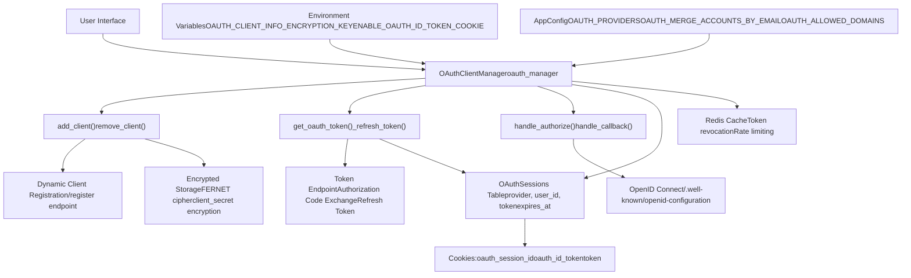
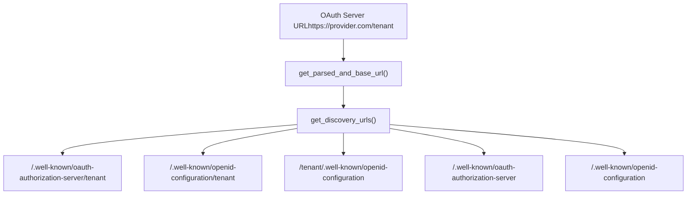
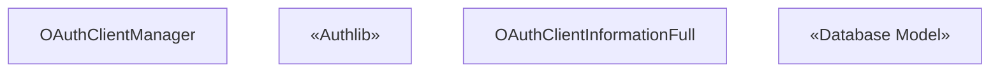
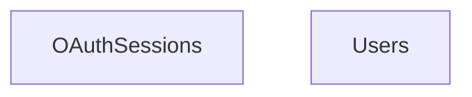
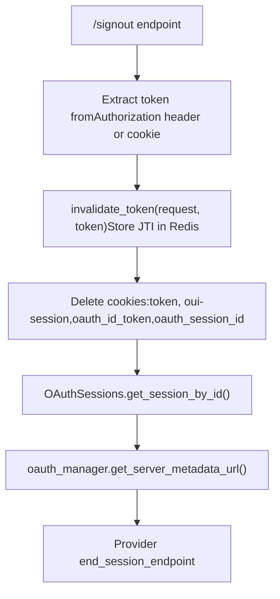
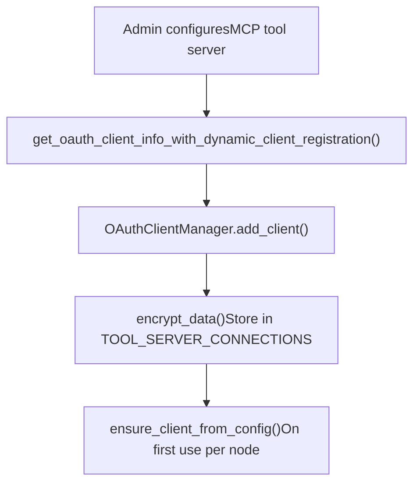

# OAuth Integration

Relevant source files

-   [backend/open\_webui/env.py](https://github.com/open-webui/open-webui/blob/a7271532/backend/open_webui/env.py)
-   [backend/open\_webui/routers/audio.py](https://github.com/open-webui/open-webui/blob/a7271532/backend/open_webui/routers/audio.py)
-   [backend/open\_webui/routers/auths.py](https://github.com/open-webui/open-webui/blob/a7271532/backend/open_webui/routers/auths.py)
-   [backend/open\_webui/routers/ollama.py](https://github.com/open-webui/open-webui/blob/a7271532/backend/open_webui/routers/ollama.py)
-   [backend/open\_webui/routers/openai.py](https://github.com/open-webui/open-webui/blob/a7271532/backend/open_webui/routers/openai.py)
-   [backend/open\_webui/utils/auth.py](https://github.com/open-webui/open-webui/blob/a7271532/backend/open_webui/utils/auth.py)
-   [backend/open\_webui/utils/embeddings.py](https://github.com/open-webui/open-webui/blob/a7271532/backend/open_webui/utils/embeddings.py)
-   [backend/open\_webui/utils/misc.py](https://github.com/open-webui/open-webui/blob/a7271532/backend/open_webui/utils/misc.py)
-   [backend/open\_webui/utils/oauth.py](https://github.com/open-webui/open-webui/blob/a7271532/backend/open_webui/utils/oauth.py)
-   [backend/open\_webui/utils/response.py](https://github.com/open-webui/open-webui/blob/a7271532/backend/open_webui/utils/response.py)

This document describes the OAuth 2.0/2.1 authentication system in Open WebUI, covering dynamic client registration, token management, session handling, and integration with LLM provider requests.

For general authentication methods (JWT, API keys, LDAP), see [Authentication Methods](/open-webui/open-webui/10.1-authentication-methods). For access control and role-based permissions, see [Access Control and RBAC](/open-webui/open-webui/10.4-access-control-and-rbac).

---

## Purpose and Architecture

Open WebUI implements OAuth 2.0/2.1 for enterprise single sign-on (SSO) and secure integration with external services. The system supports:

-   **Dynamic Client Registration (DCR)** following OAuth 2.0 specification
-   **Multi-provider support** (Google, Microsoft, GitHub, OpenID Connect, Feishu, custom OIDC)
-   **Automatic token refresh** with server-side session storage
-   **MCP (Model Context Protocol) OAuth** for tool server authentication
-   **System OAuth mode** for forwarding user tokens to LLM APIs

The OAuth implementation is primarily contained in `OAuthClientManager` class which handles client registration, token lifecycle, and provider metadata discovery.

**Sources:** [backend/open\_webui/utils/oauth.py403-511](https://github.com/open-webui/open-webui/blob/a7271532/backend/open_webui/utils/oauth.py#L403-L511) [backend/open\_webui/env.py483-499](https://github.com/open-webui/open-webui/blob/a7271532/backend/open_webui/env.py#L483-L499)

---

## System Architecture


**Sources:** [backend/open\_webui/utils/oauth.py403-511](https://github.com/open-webui/open-webui/blob/a7271532/backend/open_webui/utils/oauth.py#L403-L511) [backend/open\_webui/models/oauth\_sessions.py](https://github.com/open-webui/open-webui/blob/a7271532/backend/open_webui/models/oauth_sessions.py) [backend/open\_webui/env.py483-499](https://github.com/open-webui/open-webui/blob/a7271532/backend/open_webui/env.py#L483-L499)

---

## Dynamic Client Registration

Open WebUI automatically registers as an OAuth client with providers using OAuth 2.0 Dynamic Client Registration (RFC 7591). This eliminates manual client ID/secret configuration for MCP tool servers.

### Registration Flow

> **[Mermaid sequence]**
> *(图表结构无法解析)*

### Discovery URL Generation

The system tries multiple discovery endpoints per the MCP specification and OpenID Connect standards:


**Key Function:** `get_oauth_client_info_with_dynamic_client_registration(request, client_id, oauth_server_url, oauth_server_key)` performs the complete registration workflow.

**Sources:** [backend/open\_webui/utils/oauth.py243-280](https://github.com/open-webui/open-webui/blob/a7271532/backend/open_webui/utils/oauth.py#L243-L280) [backend/open\_webui/utils/oauth.py284-401](https://github.com/open-webui/open-webui/blob/a7271532/backend/open_webui/utils/oauth.py#L284-L401)

### Client Metadata Structure

| Class | Fields | Purpose |
| --- | --- | --- |
| `OAuthClientMetadata` | `client_name`, `redirect_uris`, `grant_types`, `response_types`, `scope`, `token_endpoint_auth_method` | Sent during registration |
| `OAuthClientInformationFull` | `client_id`, `client_secret`, `client_id_issued_at`, `client_secret_expires_at`, `issuer`, `server_metadata` | Received from provider + stored locally |
| `OAuthMetadata` (from MCP) | `authorization_endpoint`, `token_endpoint`, `registration_endpoint`, `scopes_supported`, `code_challenge_methods_supported` | Provider capabilities |

**Sources:** [backend/open\_webui/utils/oauth.py86-102](https://github.com/open-webui/open-webui/blob/a7271532/backend/open_webui/utils/oauth.py#L86-L102)

---

## OAuthClientManager

The `OAuthClientManager` class orchestrates all OAuth operations. One instance is created per application and stored in `app.state.oauth_manager`.


### Client Lazy Loading

`ensure_client_from_config(client_id)` implements lazy loading for OAuth clients from persistent configuration:

1.  Check if `client_id` already registered in `self.clients`
2.  If not, search `TOOL_SERVER_CONNECTIONS` for matching MCP server
3.  Decrypt `oauth_client_info` from configuration
4.  Call `add_client()` to register with Authlib
5.  Return the client instance

This allows OAuth clients to work across multi-node deployments without requiring initialization on every node at startup.

**Sources:** [backend/open\_webui/utils/oauth.py453-495](https://github.com/open-webui/open-webui/blob/a7271532/backend/open_webui/utils/oauth.py#L453-L495)

---

## Token Management and Refresh

OAuth tokens are stored server-side in the `OAuthSessions` database table with automatic refresh before expiration.

### Token Storage Schema


The `token` JSON field contains:

-   `access_token` - Current access token
-   `refresh_token` - Token for renewal
-   `expires_in` - Seconds until expiration
-   `expires_at` - Unix timestamp (calculated)
-   `issued_at` - Unix timestamp (recorded)
-   `token_type` - Usually "Bearer"
-   `scope` - Granted scopes
-   `id_token` - Optional OpenID Connect ID token

**Sources:** [backend/open\_webui/models/oauth\_sessions.py](https://github.com/open-webui/open-webui/blob/a7271532/backend/open_webui/models/oauth_sessions.py)

### Automatic Token Refresh

> **[Mermaid sequence]**
> *(图表结构无法解析)*

**Key Logic:**

-   Refresh triggered when `expires_at - now < 5 minutes`
-   If new `refresh_token` not returned, preserve old one
-   Failed refresh deletes the session (user must re-authorize)
-   Concurrency-safe through database transaction isolation

**Sources:** [backend/open\_webui/utils/oauth.py601-675](https://github.com/open-webui/open-webui/blob/a7271532/backend/open_webui/utils/oauth.py#L601-L675) [backend/open\_webui/utils/oauth.py676-765](https://github.com/open-webui/open-webui/blob/a7271532/backend/open_webui/utils/oauth.py#L676-L765)

### Token Refresh Implementation

The `_perform_token_refresh(session)` function:

1.  Retrieves `client` from `get_client(client_id)`
2.  Fetches `token_endpoint` from server metadata URL
3.  Constructs refresh request with `grant_type=refresh_token`
4.  Includes `client_secret` if available (depends on `token_endpoint_auth_method`)
5.  Merges response with existing token data
6.  Recalculates `expires_at` from `expires_in`

**Sources:** [backend/open\_webui/utils/oauth.py676-765](https://github.com/open-webui/open-webui/blob/a7271532/backend/open_webui/utils/oauth.py#L676-L765)

---

## Authorization Flow

### User-Initiated OAuth Login

> **[Mermaid sequence]**
> *(图表结构无法解析)*

**Important:** The `authorize_access_token(request)` call must NOT include `client_id`/`client_secret` explicitly, as Authlib already has these configured. Passing them again causes concatenation bugs (e.g., "ID1,ID1").

**Sources:** [backend/open\_webui/utils/oauth.py767-782](https://github.com/open-webui/open-webui/blob/a7271532/backend/open_webui/utils/oauth.py#L767-L782) [backend/open\_webui/utils/oauth.py784-892](https://github.com/open-webui/open-webui/blob/a7271532/backend/open_webui/utils/oauth.py#L784-L892)

### Callback Error Handling

The `_build_oauth_callback_error_message(e)` function provides user-friendly error messages:

```
# Error types handled:
- OAuth2Error: Extracts error and error_description
- HTTPException: Extracts detail
- aiohttp.ClientResponseError: Shows upstream status
- KeyError (state): Indicates session expiration
- Generic Exception: Shows exception message
```
Error messages are sanitized (newlines removed, max 200 chars) for safe redirect usage.

**Sources:** [backend/open\_webui/utils/oauth.py168-196](https://github.com/open-webui/open-webui/blob/a7271532/backend/open_webui/utils/oauth.py#L168-L196)

---

## Session Management

### Cookie-Based Session Tracking

Three cookies are used for OAuth sessions:

| Cookie | Type | Purpose | Set By |
| --- | --- | --- | --- |
| `token` | JWT | User authentication token | All auth methods |
| `oauth_session_id` | String | Links to `OAuthSessions.id` | `handle_callback()` |
| `oauth_id_token` | JWT | OpenID Connect ID token (optional) | `handle_callback()` when `ENABLE_OAUTH_ID_TOKEN_COOKIE=True` |

**Configuration:**

-   `WEBUI_AUTH_COOKIE_SAME_SITE` - SameSite policy (default: "lax")
-   `WEBUI_AUTH_COOKIE_SECURE` - Require HTTPS (default: false)

**Sources:** [backend/open\_webui/env.py457-473](https://github.com/open-webui/open-webui/blob/a7271532/backend/open_webui/env.py#L457-L473)

### Signout Process


If the provider supports RP-initiated logout (OpenID Connect `end_session_endpoint`), the user is redirected there with `id_token_hint` and `post_logout_redirect_uri`.

**Sources:** [backend/open\_webui/routers/auths.py756-823](https://github.com/open-webui/open-webui/blob/a7271532/backend/open_webui/routers/auths.py#L756-L823)

---

## Integration with API Requests

### System OAuth Authentication Mode

When an API endpoint is configured with `auth_type: "system_oauth"`, user OAuth tokens are forwarded to the LLM provider:

> **[Mermaid sequence]**
> *(图表结构无法解析)*

**Implementation:**

```
elif auth_type == "system_oauth":
    cookies = request.cookies
    oauth_token = None
    try:
        if request.cookies.get("oauth_session_id", None):
            oauth_token = await request.app.state.oauth_manager.get_oauth_token(
                user.id,
                request.cookies.get("oauth_session_id", None),
            )
    except Exception as e:
        log.error(f"Error getting OAuth token: {e}")

    if oauth_token:
        token = f"{oauth_token.get('access_token', '')}"
```
**Sources:** [backend/open\_webui/routers/openai.py155-169](https://github.com/open-webui/open-webui/blob/a7271532/backend/open_webui/routers/openai.py#L155-L169)

### MCP Tool Server OAuth

For Model Context Protocol tool servers, the client ID format is `mcp:{server_id}`. These clients are lazy-loaded from `TOOL_SERVER_CONNECTIONS` configuration.

**Sources:** [backend/open\_webui/utils/oauth.py453-495](https://github.com/open-webui/open-webui/blob/a7271532/backend/open_webui/utils/oauth.py#L453-L495)

---

## Security Features

### Client Secret Encryption

All OAuth client credentials are encrypted at rest using Fernet symmetric encryption:

```
# Key derivation if not 44 bytes
if len(OAUTH_CLIENT_INFO_ENCRYPTION_KEY) != 44:
    key_bytes = hashlib.sha256(OAUTH_CLIENT_INFO_ENCRYPTION_KEY.encode()).digest()
    OAUTH_CLIENT_INFO_ENCRYPTION_KEY = base64.urlsafe_b64encode(key_bytes)

FERNET = Fernet(OAUTH_CLIENT_INFO_ENCRYPTION_KEY)

def encrypt_data(data) -> str:
    data_json = json.dumps(data)
    encrypted = FERNET.encrypt(data_json.encode()).decode()
    return encrypted

def decrypt_data(data: str):
    decrypted = FERNET.decrypt(data.encode()).decode()
    return json.loads(decrypted)
```
**Configuration:**

-   `OAUTH_CLIENT_INFO_ENCRYPTION_KEY` - Encryption key (defaults to `WEBUI_SECRET_KEY`)
-   `OAUTH_SESSION_TOKEN_ENCRYPTION_KEY` - Separate key for session tokens (future use)

**Sources:** [backend/open\_webui/utils/oauth.py132-165](https://github.com/open-webui/open-webui/blob/a7271532/backend/open_webui/utils/oauth.py#L132-L165) [backend/open\_webui/env.py493-499](https://github.com/open-webui/open-webui/blob/a7271532/backend/open_webui/env.py#L493-L499)

### PKCE Support

Proof Key for Code Exchange (PKCE, RFC 7636) is automatically enabled when the provider advertises support:

```
if (
    oauth_client_info.server_metadata
    and oauth_client_info.server_metadata.code_challenge_methods_supported
):
    if "S256" in oauth_client_info.server_metadata.code_challenge_methods_supported:
        kwargs["code_challenge_method"] = "S256"
```
**Sources:** [backend/open\_webui/utils/oauth.py434-445](https://github.com/open-webui/open-webui/blob/a7271532/backend/open_webui/utils/oauth.py#L434-L445)

### Group-Based Access Control

OAuth providers can supply group membership via claims, enabling automatic role assignment:

```
# Group filtering with wildcards and regex
def is_in_blocked_groups(group_name: str, groups: list) -> bool:
    """
    Check if a group name matches any blocked pattern.
    Supports exact matches, shell-style wildcards (*, ?), and regex patterns.
    """
    for group_pattern in groups:
        # Exact match
        if group_name == group_pattern:
            return True

        # Regex match
        if any(char in group_pattern for char in ["^", "$", "[", "]", "(", ")"]):
            try:
                if re.search(group_pattern, group_name):
                    return True
            except re.error:
                pass

        # Wildcard match
        if "*" in group_pattern or "?" in group_pattern:
            if fnmatch.fnmatch(group_name, group_pattern):
                return True

    return False
```
**Configuration:**

-   `OAUTH_GROUPS_CLAIM` - Claim name containing groups (default: "groups")
-   `OAUTH_BLOCKED_GROUPS` - Patterns for denied groups
-   `OAUTH_ALLOWED_ROLES` - Required roles for access
-   `OAUTH_ADMIN_ROLES` - Roles that grant admin access

**Sources:** [backend/open\_webui/utils/oauth.py199-240](https://github.com/open-webui/open-webui/blob/a7271532/backend/open_webui/utils/oauth.py#L199-L240)

### Preflight Authorization Check

Before storing a registered client, the system optionally validates it by testing the authorization endpoint:

```
async def _preflight_authorization_url(self, client, client_info) -> bool:
    redirect_uri = str(client_info.redirect_uris[0]) if client_info.redirect_uris else None

    try:
        auth_data = await client.create_authorization_url(redirect_uri=redirect_uri)
        authorization_url = auth_data.get("url")

        async with aiohttp.ClientSession(trust_env=True) as session:
            async with session.get(authorization_url, allow_redirects=False) as resp:
                if resp.status < 400:
                    return True

                # Check for invalid_client errors
                error_message = await resp.text()
                if "invalid_client" in error_message.lower():
                    return False
    except Exception as e:
        log.debug(f"Skipping OAuth preflight: {e}")

    return True
```
This detects registration failures early (e.g., invalid redirect URIs, expired client secrets).

**Sources:** [backend/open\_webui/utils/oauth.py512-577](https://github.com/open-webui/open-webui/blob/a7271532/backend/open_webui/utils/oauth.py#L512-L577)

---

## Configuration Reference

### Environment Variables

| Variable | Default | Description |
| --- | --- | --- |
| `ENABLE_OAUTH_EMAIL_FALLBACK` | `False` | Use email claim if username claim missing |
| `ENABLE_OAUTH_ID_TOKEN_COOKIE` | `True` | Store ID token in cookie for SSO logout |
| `OAUTH_CLIENT_INFO_ENCRYPTION_KEY` | `WEBUI_SECRET_KEY` | Fernet key for client secret encryption |
| `OAUTH_SESSION_TOKEN_ENCRYPTION_KEY` | `WEBUI_SECRET_KEY` | Reserved for future session encryption |
| `WEBUI_AUTH_COOKIE_SAME_SITE` | `"lax"` | Cookie SameSite attribute |
| `WEBUI_AUTH_COOKIE_SECURE` | `False` | Require HTTPS for cookies |

**Sources:** [backend/open\_webui/env.py483-499](https://github.com/open-webui/open-webui/blob/a7271532/backend/open_webui/env.py#L483-L499)

### AppConfig OAuth Settings

These are stored in the database via `PersistentConfig` and accessible through `request.app.state.config`:

| Setting | Type | Purpose |
| --- | --- | --- |
| `ENABLE_OAUTH_SIGNUP` | `bool` | Allow new user creation via OAuth |
| `OAUTH_MERGE_ACCOUNTS_BY_EMAIL` | `bool` | Link OAuth logins to existing accounts |
| `ENABLE_OAUTH_ROLE_MANAGEMENT` | `bool` | Update user roles from OAuth claims |
| `ENABLE_OAUTH_GROUP_MANAGEMENT` | `bool` | Sync group membership from OAuth |
| `ENABLE_OAUTH_GROUP_CREATION` | `bool` | Auto-create groups from OAuth claims |
| `OAUTH_BLOCKED_GROUPS` | `list[str]` | Group patterns to deny access |
| `OAUTH_ROLES_CLAIM` | `str` | Claim containing role information |
| `OAUTH_SUB_CLAIM` | `str` | Claim for unique user identifier |
| `OAUTH_GROUPS_CLAIM` | `str` | Claim containing group list |
| `OAUTH_EMAIL_CLAIM` | `str` | Claim containing email address |
| `OAUTH_PICTURE_CLAIM` | `str` | Claim containing profile picture URL |
| `OAUTH_USERNAME_CLAIM` | `str` | Claim containing username |
| `OAUTH_ALLOWED_ROLES` | `list[str]` | Required roles for access |
| `OAUTH_ADMIN_ROLES` | `list[str]` | Roles that grant admin privileges |
| `OAUTH_ALLOWED_DOMAINS` | `list[str]` | Email domain whitelist |
| `OAUTH_UPDATE_PICTURE_ON_LOGIN` | `bool` | Update profile pic from OAuth claim |
| `OAUTH_ACCESS_TOKEN_REQUEST_INCLUDE_CLIENT_ID` | `bool` | Include client\_id in token request body |
| `OAUTH_AUDIENCE` | `str` | OAuth audience parameter |
| `OAUTH_GROUPS_SEPARATOR` | `str` | Separator for group claim parsing |
| `OAUTH_ROLES_SEPARATOR` | `str` | Separator for role claim parsing |

**Sources:** [backend/open\_webui/utils/oauth.py109-129](https://github.com/open-webui/open-webui/blob/a7271532/backend/open_webui/utils/oauth.py#L109-L129)

---

## API Endpoints

### OAuth Authentication Routes

| Endpoint | Method | Purpose | Handler |
| --- | --- | --- | --- |
| `/oauth/{provider}/authorize` | GET | Initiate OAuth flow | `handle_authorize()` |
| `/oauth/clients/{client_id}/callback` | GET | Handle provider callback | `handle_callback()` |
| `/signout` | GET | Logout and cleanup sessions | `signout()` |

**Sources:** [backend/open\_webui/routers/auths.py756-823](https://github.com/open-webui/open-webui/blob/a7271532/backend/open_webui/routers/auths.py#L756-L823)

### Dynamic Registration Flow


**Sources:** [backend/open\_webui/utils/oauth.py284-401](https://github.com/open-webui/open-webui/blob/a7271532/backend/open_webui/utils/oauth.py#L284-L401)

---

## Error Handling

### Common OAuth Errors

| Error Pattern | Cause | Resolution |
| --- | --- | --- |
| `invalid_client` | Client ID/secret incorrect or expired | Re-register via dynamic client registration |
| `invalid_grant` | Authorization code expired or already used | Retry authorization flow |
| `unauthorized_client` | Redirect URI mismatch | Verify `redirect_uris` in registration |
| `access_denied` | User denied consent | Cannot be fixed programmatically |
| `Missing state parameter` | Session expired during OAuth flow | User must re-initiate login |
| `Token exchange failed` | Provider returned error instead of token | Check provider logs, verify credentials |

**Error Message Construction:** All OAuth callback errors are sanitized through `_build_oauth_callback_error_message(e)` to produce concise, user-facing messages without stack traces or internal details.

**Sources:** [backend/open\_webui/utils/oauth.py168-196](https://github.com/open-webui/open-webui/blob/a7271532/backend/open_webui/utils/oauth.py#L168-L196)

### Token Refresh Failure Handling

When `_perform_token_refresh(session)` fails:

1.  Function returns `None`
2.  Calling code in `get_oauth_token()` detects failure
3.  Session is deleted via `OAuthSessions.delete_session_by_id(session.id)`
4.  User receives `None` token, triggering re-authentication

**Sources:** [backend/open\_webui/utils/oauth.py636-640](https://github.com/open-webui/open-webui/blob/a7271532/backend/open_webui/utils/oauth.py#L636-L640)

---

## Multi-Node Deployment Considerations

### Client Registration Persistence

OAuth client credentials must be stored in persistent configuration (database-backed `TOOL_SERVER_CONNECTIONS`) rather than in-memory, because:

1.  Dynamic registration happens once on one node
2.  Other nodes need the same `client_id`/`client_secret` to refresh tokens
3.  `ensure_client_from_config()` lazy-loads clients on each node

### Session Storage

The `OAuthSessions` database table provides cross-node session access:

-   All nodes can query and update the same session
-   Token refresh on one node updates the database for all nodes
-   No Redis requirement for session sharing (Redis only used for token revocation)

**Sources:** [backend/open\_webui/utils/oauth.py453-495](https://github.com/open-webui/open-webui/blob/a7271532/backend/open_webui/utils/oauth.py#L453-L495)

---

## Implementation Notes

### Why Server-Side Session Storage?

Unlike the standard OAuth pattern of storing tokens client-side, Open WebUI stores them server-side in `OAuthSessions` because:

1.  **Security**: Refresh tokens never exposed to browser
2.  **Automatic refresh**: Backend handles token lifecycle without frontend involvement
3.  **Multi-device support**: Same session accessible from multiple devices via `oauth_session_id` cookie
4.  **Auditability**: Database tracks token usage and expiration

### Token Endpoint Authentication Methods

The `token_endpoint_auth_method` field in `OAuthClientMetadata` supports:

-   `client_secret_post` (default) - Credentials in POST body
-   `client_secret_basic` - Credentials in Authorization header (HTTP Basic)
-   `none` - Public clients without secrets

The system automatically selects the method based on provider's `token_endpoint_auth_methods_supported` metadata.

**Sources:** [backend/open\_webui/utils/oauth.py86-90](https://github.com/open-webui/open-webui/blob/a7271532/backend/open_webui/utils/oauth.py#L86-L90) [backend/open\_webui/utils/oauth.py326-334](https://github.com/open-webui/open-webui/blob/a7271532/backend/open_webui/utils/oauth.py#L326-L334)

### Authlib Integration

Open WebUI uses the Authlib library's Starlette integration:

```
from authlib.integrations.starlette_client import OAuth
from authlib.oidc.core import UserInfo

self.oauth = OAuth()
client = self.oauth.register(
    name=client_id,
    client_id=oauth_client_info.client_id,
    client_secret=oauth_client_info.client_secret,
    client_kwargs={...},
    server_metadata_url=oauth_client_info.issuer
)
```
**Key Methods:**

-   `client.authorize_redirect(request, redirect_uri)` - Generate authorization URL
-   `client.authorize_access_token(request)` - Exchange code for token
-   `client.parse_id_token(request, token)` - Validate and parse ID token

**Sources:** [backend/open\_webui/utils/oauth.py405-451](https://github.com/open-webui/open-webui/blob/a7271532/backend/open_webui/utils/oauth.py#L405-L451)
