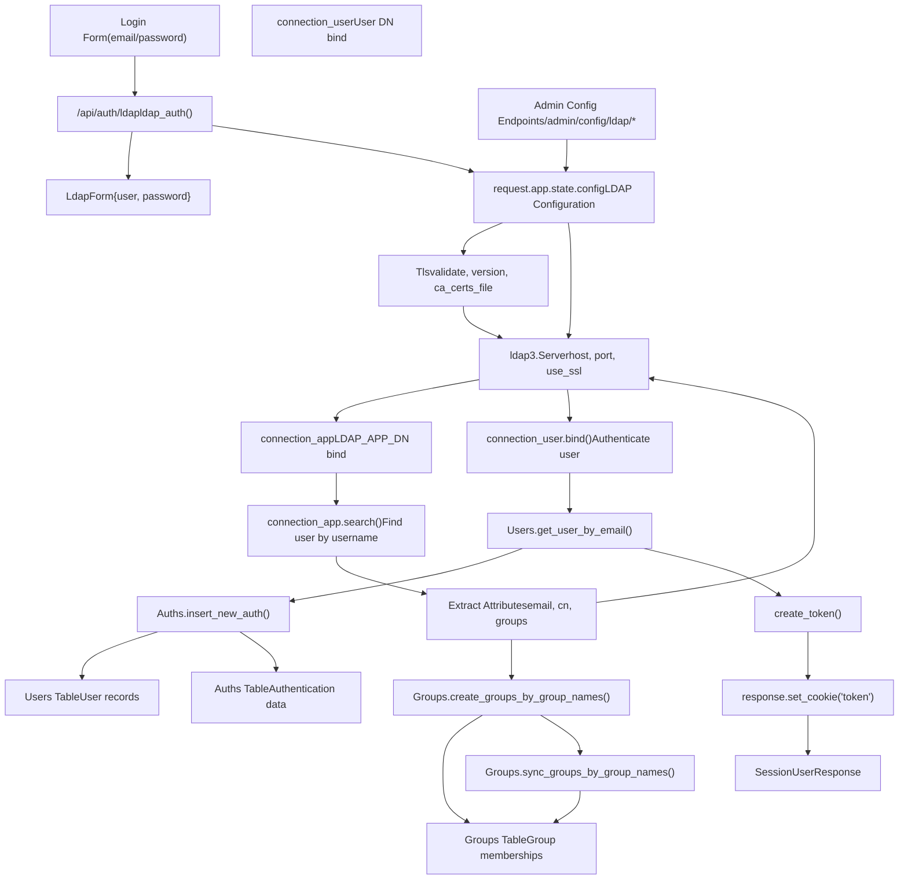
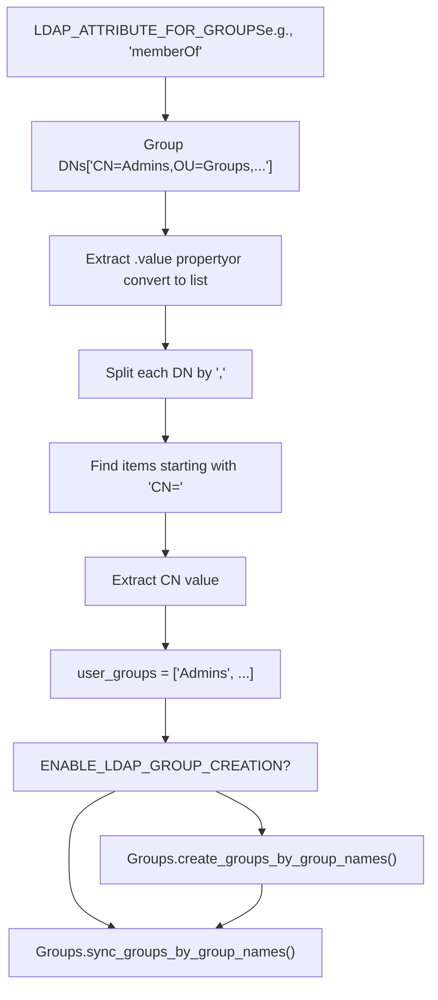

# LDAP Integration

Relevant source files

-   [backend/open\_webui/env.py](https://github.com/open-webui/open-webui/blob/a7271532/backend/open_webui/env.py)
-   [backend/open\_webui/routers/audio.py](https://github.com/open-webui/open-webui/blob/a7271532/backend/open_webui/routers/audio.py)
-   [backend/open\_webui/routers/auths.py](https://github.com/open-webui/open-webui/blob/a7271532/backend/open_webui/routers/auths.py)
-   [backend/open\_webui/routers/ollama.py](https://github.com/open-webui/open-webui/blob/a7271532/backend/open_webui/routers/ollama.py)
-   [backend/open\_webui/routers/openai.py](https://github.com/open-webui/open-webui/blob/a7271532/backend/open_webui/routers/openai.py)
-   [backend/open\_webui/utils/auth.py](https://github.com/open-webui/open-webui/blob/a7271532/backend/open_webui/utils/auth.py)
-   [backend/open\_webui/utils/embeddings.py](https://github.com/open-webui/open-webui/blob/a7271532/backend/open_webui/utils/embeddings.py)
-   [backend/open\_webui/utils/misc.py](https://github.com/open-webui/open-webui/blob/a7271532/backend/open_webui/utils/misc.py)
-   [backend/open\_webui/utils/oauth.py](https://github.com/open-webui/open-webui/blob/a7271532/backend/open_webui/utils/oauth.py)
-   [backend/open\_webui/utils/response.py](https://github.com/open-webui/open-webui/blob/a7271532/backend/open_webui/utils/response.py)

This document covers the LDAP (Lightweight Directory Access Protocol) authentication integration in Open WebUI, including configuration, authentication flow, user provisioning, and group synchronization. For OAuth-based authentication, see [OAuth Integration](/open-webui/open-webui/10.2-oauth-integration). For general authentication concepts and JWT token management, see [Authentication Methods](/open-webui/open-webui/10.1-authentication-methods).

## Overview

Open WebUI supports LDAP authentication to integrate with Active Directory or other LDAP servers. The integration allows users to authenticate using their directory credentials, automatically provisions users on first login, and optionally synchronizes group memberships from the LDAP directory.

The LDAP implementation uses the `ldap3` Python library and supports:

-   TLS/SSL encrypted connections
-   Custom certificate validation
-   Flexible attribute mapping
-   Search filters for user access control
-   Automatic user provisioning
-   LDAP group-to-Open WebUI group synchronization
-   Automatic group creation

## Architecture


**Sources:** [backend/open\_webui/routers/auths.py218-500](https://github.com/open-webui/open-webui/blob/a7271532/backend/open_webui/routers/auths.py#L218-L500) [backend/open\_webui/routers/auths.py1055-1140](https://github.com/open-webui/open-webui/blob/a7271532/backend/open_webui/routers/auths.py#L1055-L1140)

## Configuration

### LDAP Server Configuration

LDAP server settings are stored in the application's dynamic configuration system and can be managed through admin API endpoints or environment variables.

| Configuration Parameter | Type | Description | Default |
| --- | --- | --- | --- |
| `ENABLE_LDAP` | bool | Master switch to enable/disable LDAP authentication | `false` |
| `LDAP_SERVER_LABEL` | string | Display name for the LDAP server | Required |
| `LDAP_SERVER_HOST` | string | LDAP server hostname or IP address | Required |
| `LDAP_SERVER_PORT` | int | LDAP server port | `389` (plain), `636` (TLS) |
| `LDAP_ATTRIBUTE_FOR_MAIL` | string | LDAP attribute containing email address | `"mail"` |
| `LDAP_ATTRIBUTE_FOR_USERNAME` | string | LDAP attribute containing username | `"uid"` |
| `LDAP_APP_DN` | string | Distinguished Name for application bind | Required |
| `LDAP_APP_PASSWORD` | string | Password for application DN | Required |
| `LDAP_SEARCH_BASE` | string | Base DN for user searches | Required |
| `LDAP_SEARCH_FILTERS` | string | Additional LDAP filters to restrict access | `""` |
| `LDAP_USE_TLS` | bool | Enable TLS/SSL encryption | `true` |
| `LDAP_CA_CERT_FILE` | string | Path to CA certificate file | `None` |
| `LDAP_VALIDATE_CERT` | bool | Validate server certificate | `true` |
| `LDAP_CIPHERS` | string | TLS cipher suite specification | `"ALL"` |

**Sources:** [backend/open\_webui/routers/auths.py1039-1053](https://github.com/open-webui/open-webui/blob/a7271532/backend/open_webui/routers/auths.py#L1039-L1053) [backend/open\_webui/routers/auths.py1055-1072](https://github.com/open-webui/open-webui/blob/a7271532/backend/open_webui/routers/auths.py#L1055-L1072)

### Configuration API Endpoints

#### Get LDAP Enable Status

```
GET /api/auth/admin/config/ldap
```
Returns `{"ENABLE_LDAP": bool}`

#### Update LDAP Enable Status

```
POST /api/auth/admin/config/ldap
Body: {"enable_ldap": bool}
```
#### Get LDAP Server Configuration

```
GET /api/auth/admin/config/ldap/server
```
Returns a `LdapServerConfig` object with all server settings.

#### Update LDAP Server Configuration

```
POST /api/auth/admin/config/ldap/server
Body: LdapServerConfig
```
Validates required fields and updates the configuration. Required fields: `label`, `host`, `attribute_for_mail`, `attribute_for_username`, `app_dn`, `app_dn_password`, `search_base`.

**Sources:** [backend/open\_webui/routers/auths.py1125-1140](https://github.com/open-webui/open-webui/blob/a7271532/backend/open_webui/routers/auths.py#L1125-L1140) [backend/open\_webui/routers/auths.py1074-1122](https://github.com/open-webui/open-webui/blob/a7271532/backend/open_webui/routers/auths.py#L1074-L1122)

## Authentication Flow

> **[Mermaid sequence]**
> *(图表结构无法解析)*

**Sources:** [backend/open\_webui/routers/auths.py218-500](https://github.com/open-webui/open-webui/blob/a7271532/backend/open_webui/routers/auths.py#L218-L500)

### Step-by-Step Process

1.  **Security Validation** [backend/open\_webui/routers/auths.py220-228](https://github.com/open-webui/open-webui/blob/a7271532/backend/open_webui/routers/auths.py#L220-L228)

    -   Verify `ENABLE_LDAP` is enabled
    -   Verify `ENABLE_PASSWORD_AUTH` is enabled (LDAP requires password authentication)
2.  **Configuration Loading** [backend/open\_webui/routers/auths.py230-249](https://github.com/open-webui/open-webui/blob/a7271532/backend/open_webui/routers/auths.py#L230-L249)

    -   Load all LDAP configuration parameters from `request.app.state.config`
    -   Configure TLS settings including certificate validation
3.  **TLS Configuration** [backend/open\_webui/routers/auths.py251-260](https://github.com/open-webui/open-webui/blob/a7271532/backend/open_webui/routers/auths.py#L251-L260)

    ```
    tls = Tls(
        validate=LDAP_VALIDATE_CERT,
        version=PROTOCOL_TLS,
        ca_certs_file=LDAP_CA_CERT_FILE,
        ciphers=LDAP_CIPHERS,
    )
    ```

4.  **Server Connection** [backend/open\_webui/routers/auths.py262-278](https://github.com/open-webui/open-webui/blob/a7271532/backend/open_webui/routers/auths.py#L262-L278)

    -   Create `ldap3.Server` instance with host, port, and TLS settings
    -   Create `connection_app` with application DN credentials
    -   Bind with application account (used for user searches)
5.  **User Search** [backend/open\_webui/routers/auths.py280-308](https://github.com/open-webui/open-webui/blob/a7271532/backend/open_webui/routers/auths.py#L280-L308)

    -   Build search attributes list including username, email, cn
    -   If group management enabled, add group attribute to search
    -   Execute LDAP search with filter: `(&(uid={username}){LDAP_SEARCH_FILTERS})`
    -   Extract user entry from search results
6.  **Attribute Extraction** [backend/open\_webui/routers/auths.py309-324](https://github.com/open-webui/open-webui/blob/a7271532/backend/open_webui/routers/auths.py#L309-L324)

    -   Extract `username` from configured username attribute
    -   Extract and normalize `email` (handle string, list, or attribute value)
    -   Extract `cn` (common name)
    -   Extract `user_dn` (distinguished name for authentication)
7.  **User Authentication** [backend/open\_webui/routers/auths.py389-398](https://github.com/open-webui/open-webui/blob/a7271532/backend/open_webui/routers/auths.py#L389-L398)

    -   Create new LDAP connection with user's DN
    -   Attempt to bind with user's password
    -   If bind fails, authentication fails
8.  **User Provisioning** [backend/open\_webui/routers/auths.py400-432](https://github.com/open-webui/open-webui/blob/a7271532/backend/open_webui/routers/auths.py#L400-L432)

    -   Check if user exists locally: `Users.get_user_by_email(email)`
    -   If new user:
        -   Assign "admin" role if first user, otherwise use `DEFAULT_USER_ROLE`
        -   Create auth entry: `Auths.insert_new_auth(email, uuid, cn, role)`
        -   Apply default group assignment
9.  **Session Creation** [backend/open\_webui/routers/auths.py434-465](https://github.com/open-webui/open-webui/blob/a7271532/backend/open_webui/routers/auths.py#L434-L465)

    -   Authenticate user: `Auths.authenticate_user_by_email(email)`
    -   Calculate token expiration from `JWT_EXPIRES_IN`
    -   Create JWT token: `create_token(data={"id": user.id}, expires_delta)`
    -   Set HTTP-only cookie with token
    -   Get user permissions
10.  **Return Response** [backend/open\_webui/routers/auths.py482-492](https://github.com/open-webui/open-webui/blob/a7271532/backend/open_webui/routers/auths.py#L482-L492)

    -   Return `SessionUserResponse` with token, user details, and permissions

**Sources:** [backend/open\_webui/routers/auths.py218-500](https://github.com/open-webui/open-webui/blob/a7271532/backend/open_webui/routers/auths.py#L218-L500)

## Group Synchronization

### Configuration

LDAP group management is controlled by additional configuration parameters:

| Parameter | Type | Description |
| --- | --- | --- |
| `ENABLE_LDAP_GROUP_MANAGEMENT` | bool | Enable group synchronization from LDAP |
| `ENABLE_LDAP_GROUP_CREATION` | bool | Automatically create groups that don't exist |
| `LDAP_ATTRIBUTE_FOR_GROUPS` | string | LDAP attribute containing group memberships |

**Sources:** [backend/open\_webui/routers/auths.py280-296](https://github.com/open-webui/open-webui/blob/a7271532/backend/open_webui/routers/auths.py#L280-L296)

### Group Extraction Process


**Sources:** [backend/open\_webui/routers/auths.py326-387](https://github.com/open-webui/open-webui/blob/a7271532/backend/open_webui/routers/auths.py#L326-L387) [backend/open\_webui/routers/auths.py467-480](https://github.com/open-webui/open-webui/blob/a7271532/backend/open_webui/routers/auths.py#L467-L480)

### Group DN Parsing

The system extracts group names from LDAP distinguished names (DNs):

1.  **Retrieve Group Attribute** [backend/open\_webui/routers/auths.py327-338](https://github.com/open-webui/open-webui/blob/a7271532/backend/open_webui/routers/auths.py#L327-L338)

    -   Access the configured group attribute from the LDAP entry
    -   Handle different data types: attribute value, iterable, or string
2.  **Normalize to List** [backend/open\_webui/routers/auths.py335-352](https://github.com/open-webui/open-webui/blob/a7271532/backend/open_webui/routers/auths.py#L335-L352)

    ```
    if hasattr(group_dns, "value"):
        group_dns = group_dns.value
    elif hasattr(group_dns, "__iter__") and not isinstance(group_dns, (str, bytes)):
        group_dns = list(group_dns)

    if isinstance(group_dns, list):
        group_dns = [str(item) for item in group_dns]
    else:
        group_dns = [str(group_dns)]
    ```

3.  **Extract CN from Each DN** [backend/open\_webui/routers/auths.py354-377](https://github.com/open-webui/open-webui/blob/a7271532/backend/open_webui/routers/auths.py#L354-L377)

    -   Split DN by commas: `"CN=Admins,OU=Groups,DC=example,DC=com"`
    -   Find component starting with `"CN="`
    -   Extract the CN value after `"CN="`
    -   Handle parsing errors gracefully with logging
4.  **Build Group List** [backend/open\_webui/routers/auths.py368-380](https://github.com/open-webui/open-webui/blob/a7271532/backend/open_webui/routers/auths.py#L368-L380)

    -   Append extracted CNs to `user_groups` list
    -   Log the final group list for debugging

**Sources:** [backend/open\_webui/routers/auths.py326-387](https://github.com/open-webui/open-webui/blob/a7271532/backend/open_webui/routers/auths.py#L326-L387)

### Group Creation

When `ENABLE_LDAP_GROUP_CREATION` is enabled:

```
Groups.create_groups_by_group_names(user.id, user_groups)
```
This creates any groups that don't already exist in the local database before synchronizing memberships.

**Sources:** [backend/open\_webui/routers/auths.py472-473](https://github.com/open-webui/open-webui/blob/a7271532/backend/open_webui/routers/auths.py#L472-L473)

### Group Synchronization

After authentication, if the user is not an admin and group management is enabled:

```
Groups.sync_groups_by_group_names(user.id, user_groups)
```
This synchronizes the user's group memberships with the groups extracted from LDAP, adding the user to new groups and removing them from groups they no longer belong to.

**Sources:** [backend/open\_webui/routers/auths.py475-480](https://github.com/open-webui/open-webui/blob/a7271532/backend/open_webui/routers/auths.py#L475-L480)

## Data Models

### LdapForm

Request model for LDAP authentication:

```
class LdapForm(BaseModel):
    user: str      # Username to authenticate
    password: str  # User's password
```
**Sources:** [backend/open\_webui/models/auths.py](https://github.com/open-webui/open-webui/blob/a7271532/backend/open_webui/models/auths.py) (referenced in [backend/open\_webui/routers/auths.py219](https://github.com/open-webui/open-webui/blob/a7271532/backend/open_webui/routers/auths.py#L219-L219))

### LdapServerConfig

Configuration model for LDAP server settings:

```
class LdapServerConfig(BaseModel):
    label: str
    host: str
    port: Optional[int] = None
    attribute_for_mail: str = "mail"
    attribute_for_username: str = "uid"
    app_dn: str
    app_dn_password: str
    search_base: str
    search_filters: str = ""
    use_tls: bool = True
    certificate_path: Optional[str] = None
    validate_cert: bool = True
    ciphers: Optional[str] = "ALL"
```
**Sources:** [backend/open\_webui/routers/auths.py1039-1053](https://github.com/open-webui/open-webui/blob/a7271532/backend/open_webui/routers/auths.py#L1039-L1053)

### LdapConfigForm

Simple model for enabling/disabling LDAP:

```
class LdapConfigForm(BaseModel):
    enable_ldap: Optional[bool] = None
```
**Sources:** [backend/open\_webui/routers/auths.py1130-1132](https://github.com/open-webui/open-webui/blob/a7271532/backend/open_webui/routers/auths.py#L1130-L1132)

## Security Considerations

### TLS/SSL Configuration

The LDAP integration supports TLS encryption to protect credentials in transit:

1.  **TLS Validation** [backend/open\_webui/routers/auths.py242-244](https://github.com/open-webui/open-webui/blob/a7271532/backend/open_webui/routers/auths.py#L242-L244)

    -   `LDAP_VALIDATE_CERT`: Controls certificate validation
    -   Maps to `CERT_REQUIRED` (validate) or `CERT_NONE` (skip validation)
2.  **Certificate Authority** [backend/open\_webui/routers/auths.py241](https://github.com/open-webui/open-webui/blob/a7271532/backend/open_webui/routers/auths.py#L241-L241)

    -   `LDAP_CA_CERT_FILE`: Path to CA certificate file for custom CAs
3.  **Cipher Configuration** [backend/open\_webui/routers/auths.py245-249](https://github.com/open-webui/open-webui/blob/a7271532/backend/open_webui/routers/auths.py#L245-L249)

    -   `LDAP_CIPHERS`: Allows specification of TLS cipher suite
    -   Defaults to "ALL" if not configured
4.  **TLS Object Creation** [backend/open\_webui/routers/auths.py252-257](https://github.com/open-webui/open-webui/blob/a7271532/backend/open_webui/routers/auths.py#L252-L257)

    ```
    tls = Tls(
        validate=LDAP_VALIDATE_CERT,
        version=PROTOCOL_TLS,
        ca_certs_file=LDAP_CA_CERT_FILE,
        ciphers=LDAP_CIPHERS,
    )
    ```


**Sources:** [backend/open\_webui/routers/auths.py251-260](https://github.com/open-webui/open-webui/blob/a7271532/backend/open_webui/routers/auths.py#L251-L260)

### Application DN

The LDAP integration uses two types of connections:

1.  **Application Connection** [backend/open\_webui/routers/auths.py270-278](https://github.com/open-webui/open-webui/blob/a7271532/backend/open_webui/routers/auths.py#L270-L278)

    -   Binds with `LDAP_APP_DN` and `LDAP_APP_PASSWORD`
    -   Used for searching the directory
    -   Should have read access to user entries and group attributes
    -   Authentication type: `"SIMPLE"` or `"ANONYMOUS"` (if no DN provided)
2.  **User Connection** [backend/open\_webui/routers/auths.py390-398](https://github.com/open-webui/open-webui/blob/a7271532/backend/open_webui/routers/auths.py#L390-L398)

    -   Binds with user's DN and provided password
    -   Used to verify user credentials
    -   Authentication type: `"SIMPLE"`

**Sources:** [backend/open\_webui/routers/auths.py270-278](https://github.com/open-webui/open-webui/blob/a7271532/backend/open_webui/routers/auths.py#L270-L278) [backend/open\_webui/routers/auths.py390-398](https://github.com/open-webui/open-webui/blob/a7271532/backend/open_webui/routers/auths.py#L390-L398)

### Password Handling

-   Passwords are never stored from LDAP
-   User records are created with random UUIDs as password hashes [backend/open\_webui/routers/auths.py411](https://github.com/open-webui/open-webui/blob/a7271532/backend/open_webui/routers/auths.py#L411-L411)
-   Password validation occurs via LDAP bind operation
-   Passwords are limited to 72 bytes for bcrypt compatibility in local auth [backend/open\_webui/routers/auths.py574-581](https://github.com/open-webui/open-webui/blob/a7271532/backend/open_webui/routers/auths.py#L574-L581)

**Sources:** [backend/open\_webui/routers/auths.py409-413](https://github.com/open-webui/open-webui/blob/a7271532/backend/open_webui/routers/auths.py#L409-L413)

### Search Filters

The `LDAP_SEARCH_FILTERS` parameter allows restricting which LDAP users can authenticate:

```
search_filter=f"(&({LDAP_ATTRIBUTE_FOR_USERNAME}={escape_filter_chars(form_data.user.lower())}){LDAP_SEARCH_FILTERS})"
```
Example filters:

-   `"(objectClass=person)"` - Only person objects
-   `"(memberOf=CN=WebUIUsers,OU=Groups,DC=example,DC=com)"` - Only members of specific group
-   `"(&(objectClass=user)(!(userAccountControl:1.2.840.113556.1.4.803:=2)))"` - Active Directory enabled accounts

**Sources:** [backend/open\_webui/routers/auths.py300-304](https://github.com/open-webui/open-webui/blob/a7271532/backend/open_webui/routers/auths.py#L300-L304)

## Error Handling

The LDAP authentication flow includes comprehensive error handling:

| Error Condition | HTTP Status | Error Message |
| --- | --- | --- |
| LDAP not enabled | 400 | "LDAP authentication is not enabled" |
| Password auth disabled | 403 | ERROR\_MESSAGES.ACTION\_PROHIBITED |
| TLS configuration error | 400 | "Failed to configure TLS for LDAP connection." |
| Application bind failed | 400 | "Application account bind failed" |
| User not found in LDAP | 400 | "User not found in the LDAP server" |
| No email attribute | 400 | "User does not have a valid email address." |
| User authentication failed | 400 | "Authentication failed." |
| Username mismatch | 400 | "User record mismatch." |
| General LDAP error | 400 | "LDAP authentication failed." |
| User creation error | 500 | ERROR\_MESSAGES.CREATE\_USER\_ERROR |

**Sources:** [backend/open\_webui/routers/auths.py221-222](https://github.com/open-webui/open-webui/blob/a7271532/backend/open_webui/routers/auths.py#L221-L222) [backend/open\_webui/routers/auths.py224-228](https://github.com/open-webui/open-webui/blob/a7271532/backend/open_webui/routers/auths.py#L224-L228) [backend/open\_webui/routers/auths.py258-260](https://github.com/open-webui/open-webui/blob/a7271532/backend/open_webui/routers/auths.py#L258-L260) [backend/open\_webui/routers/auths.py277-278](https://github.com/open-webui/open-webui/blob/a7271532/backend/open_webui/routers/auths.py#L277-L278) [backend/open\_webui/routers/auths.py306-307](https://github.com/open-webui/open-webui/blob/a7271532/backend/open_webui/routers/auths.py#L306-L307) [backend/open\_webui/routers/auths.py314-315](https://github.com/open-webui/open-webui/blob/a7271532/backend/open_webui/routers/auths.py#L314-L315) [backend/open\_webui/routers/auths.py397-398](https://github.com/open-webui/open-webui/blob/a7271532/backend/open_webui/routers/auths.py#L397-L398) [backend/open\_webui/routers/auths.py496](https://github.com/open-webui/open-webui/blob/a7271532/backend/open_webui/routers/auths.py#L496-L496) [backend/open\_webui/routers/auths.py494](https://github.com/open-webui/open-webui/blob/a7271532/backend/open_webui/routers/auths.py#L494-L494) [backend/open\_webui/routers/auths.py497-499](https://github.com/open-webui/open-webui/blob/a7271532/backend/open_webui/routers/auths.py#L497-L499)

## Integration with Other Systems

### User Provisioning

LDAP authentication integrates with the standard user provisioning flow:

1.  **User Creation** [backend/open\_webui/routers/auths.py408-420](https://github.com/open-webui/open-webui/blob/a7271532/backend/open_webui/routers/auths.py#L408-L420)

    -   Uses `Auths.insert_new_auth()` to create user record
    -   First user becomes admin, subsequent users get `DEFAULT_USER_ROLE`
    -   Random UUID assigned as password hash (not used for authentication)
2.  **Default Group Assignment** [backend/open\_webui/routers/auths.py421-424](https://github.com/open-webui/open-webui/blob/a7271532/backend/open_webui/routers/auths.py#L421-L424)

    -   Calls `apply_default_group_assignment()` with `DEFAULT_GROUP_ID`
    -   Ensures all users are added to the default group on first login

**Sources:** [backend/open\_webui/routers/auths.py400-432](https://github.com/open-webui/open-webui/blob/a7271532/backend/open_webui/routers/auths.py#L400-L432)

### JWT Token Generation

After successful LDAP authentication, the system follows the standard JWT token flow:

1.  **Token Expiration** [backend/open\_webui/routers/auths.py437-440](https://github.com/open-webui/open-webui/blob/a7271532/backend/open_webui/routers/auths.py#L437-L440)

    -   Parse `JWT_EXPIRES_IN` configuration
    -   Calculate expiration timestamp
2.  **Token Creation** [backend/open\_webui/routers/auths.py442-445](https://github.com/open-webui/open-webui/blob/a7271532/backend/open_webui/routers/auths.py#L442-L445)

    -   Call `create_token(data={"id": user.id}, expires_delta)`
    -   Token contains user ID and expiration
3.  **Cookie Configuration** [backend/open\_webui/routers/auths.py448-461](https://github.com/open-webui/open-webui/blob/a7271532/backend/open_webui/routers/auths.py#L448-L461)

    -   Set HTTP-only cookie to prevent JavaScript access
    -   Use configured `WEBUI_AUTH_COOKIE_SAME_SITE` and `WEBUI_AUTH_COOKIE_SECURE`
    -   Set cookie expiration to match token expiration

**Sources:** [backend/open\_webui/routers/auths.py437-461](https://github.com/open-webui/open-webui/blob/a7271532/backend/open_webui/routers/auths.py#L437-L461)

### Permission System

LDAP-authenticated users receive permissions through the same system as local users:

```
user_permissions = get_permissions(
    user.id, request.app.state.config.USER_PERMISSIONS
)
```
The response includes permissions in the `SessionUserResponse` object.

**Sources:** [backend/open\_webui/routers/auths.py463-465](https://github.com/open-webui/open-webui/blob/a7271532/backend/open_webui/routers/auths.py#L463-L465)

## Logging

The LDAP integration includes detailed logging for debugging:

```
log.info(f"LDAP search attributes: {search_attributes}")
log.info(f"LDAP raw group DNs for user {username}: {group_dns}")
log.info(f"LDAP groups for user {username}: {user_groups} (total: {len(user_groups)})")
log.info(f"Successfully synced groups for user {user.id}: {user_groups}")
log.error(f"TLS configuration error: {str(e)}")
log.error(f"LDAP user creation error: {str(err)}")
log.error(f"Failed to sync groups for user {user.id}: {e}")
log.error(f"LDAP authentication error: {str(e)}")
```
Log level is controlled by the `MAIN` log source level configuration.

**Sources:** [backend/open\_webui/routers/auths.py83-84](https://github.com/open-webui/open-webui/blob/a7271532/backend/open_webui/routers/auths.py#L83-L84) [backend/open\_webui/routers/auths.py259](https://github.com/open-webui/open-webui/blob/a7271532/backend/open_webui/routers/auths.py#L259-L259) [backend/open\_webui/routers/auths.py294-298](https://github.com/open-webui/open-webui/blob/a7271532/backend/open_webui/routers/auths.py#L294-L298) [backend/open\_webui/routers/auths.py329-380](https://github.com/open-webui/open-webui/blob/a7271532/backend/open_webui/routers/auths.py#L329-L380) [backend/open\_webui/routers/auths.py429-430](https://github.com/open-webui/open-webui/blob/a7271532/backend/open_webui/routers/auths.py#L429-L430) [backend/open\_webui/routers/auths.py476-480](https://github.com/open-webui/open-webui/blob/a7271532/backend/open_webui/routers/auths.py#L476-L480) [backend/open\_webui/routers/auths.py498-499](https://github.com/open-webui/open-webui/blob/a7271532/backend/open_webui/routers/auths.py#L498-L499)
