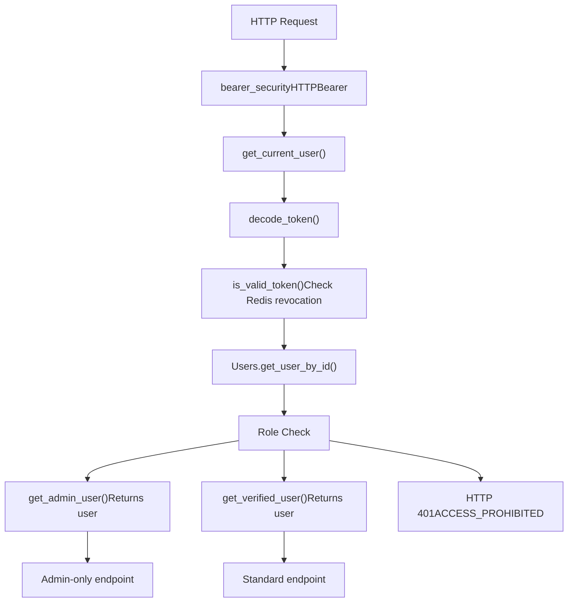
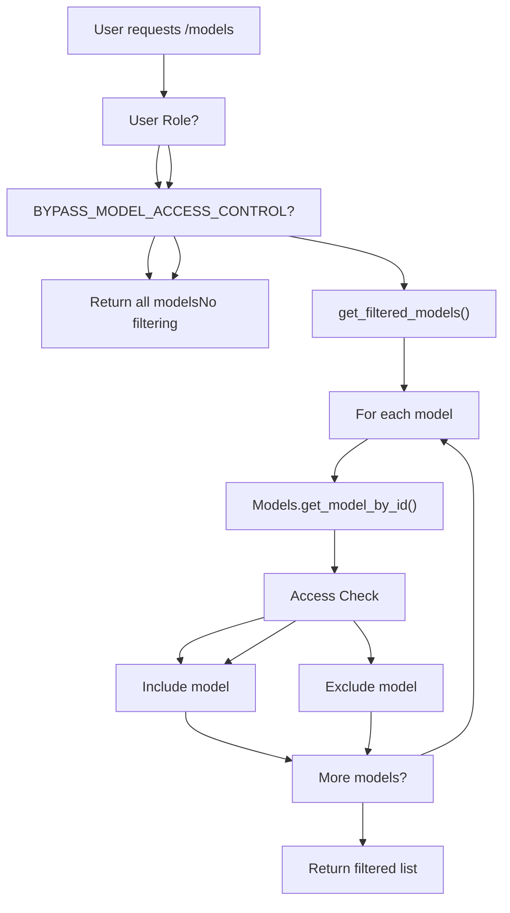
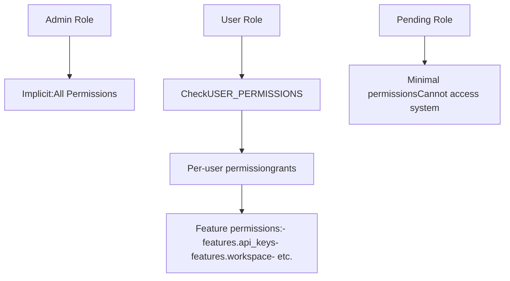
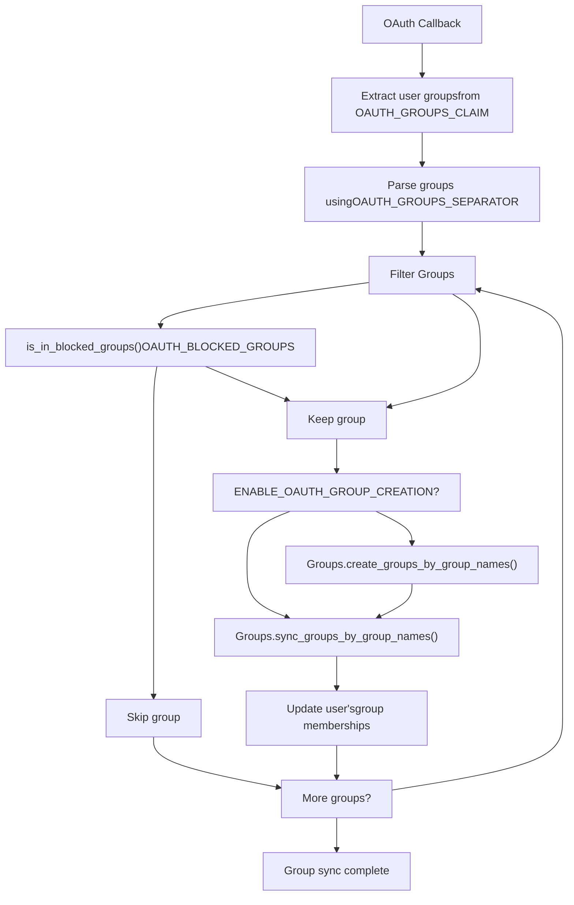
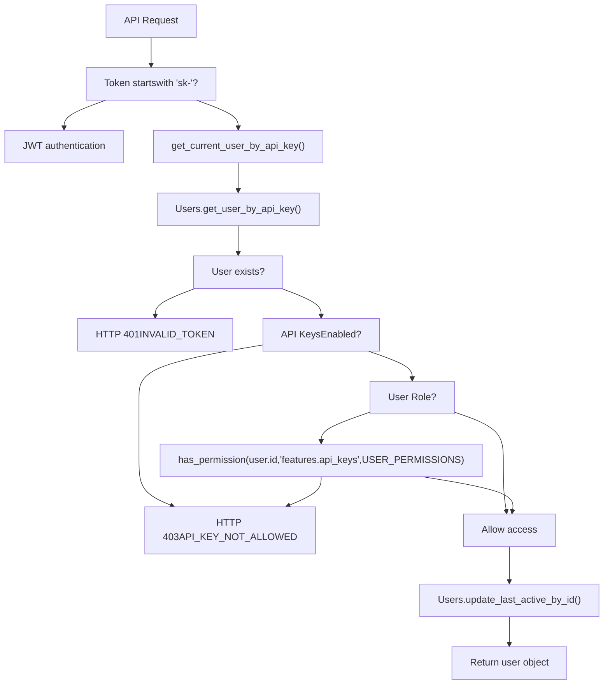
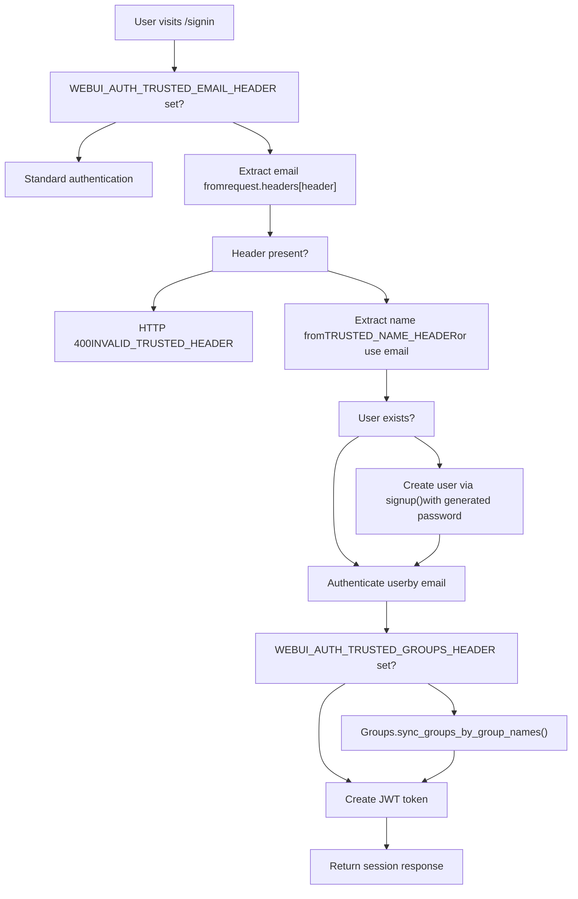

# Access Control and RBAC

Relevant source files

-   [backend/open\_webui/env.py](https://github.com/open-webui/open-webui/blob/a7271532/backend/open_webui/env.py)
-   [backend/open\_webui/routers/audio.py](https://github.com/open-webui/open-webui/blob/a7271532/backend/open_webui/routers/audio.py)
-   [backend/open\_webui/routers/auths.py](https://github.com/open-webui/open-webui/blob/a7271532/backend/open_webui/routers/auths.py)
-   [backend/open\_webui/routers/ollama.py](https://github.com/open-webui/open-webui/blob/a7271532/backend/open_webui/routers/ollama.py)
-   [backend/open\_webui/routers/openai.py](https://github.com/open-webui/open-webui/blob/a7271532/backend/open_webui/routers/openai.py)
-   [backend/open\_webui/utils/auth.py](https://github.com/open-webui/open-webui/blob/a7271532/backend/open_webui/utils/auth.py)
-   [backend/open\_webui/utils/embeddings.py](https://github.com/open-webui/open-webui/blob/a7271532/backend/open_webui/utils/embeddings.py)
-   [backend/open\_webui/utils/misc.py](https://github.com/open-webui/open-webui/blob/a7271532/backend/open_webui/utils/misc.py)
-   [backend/open\_webui/utils/oauth.py](https://github.com/open-webui/open-webui/blob/a7271532/backend/open_webui/utils/oauth.py)
-   [backend/open\_webui/utils/response.py](https://github.com/open-webui/open-webui/blob/a7271532/backend/open_webui/utils/response.py)

This document describes the access control and role-based access control (RBAC) mechanisms in Open WebUI. It covers user roles, model permissions, group management, and the permission system. For authentication methods (JWT, OAuth, LDAP, API keys), see [Authentication Methods](/open-webui/open-webui/10.1-authentication-methods). For token management and sessions, see [Token and Session Management](/open-webui/open-webui/10.5-token-and-session-management).

---

## User Roles

Open WebUI implements a three-tier role system that controls access to administrative functions and system features.

### Role Definitions

| Role | Description | Access Level |
| --- | --- | --- |
| `admin` | Full system access | Can access all endpoints, manage users, configure system settings |
| `user` | Standard verified user | Can use chat features, access permitted models, limited configuration |
| `pending` | Unverified user | Limited or no access, awaiting approval |

### Role Assignment

Users are assigned roles at creation time through multiple mechanisms:

**Initial Admin Creation**: The first user to sign up automatically receives the `admin` role ([backend/open\_webui/routers/auths.py677](https://github.com/open-webui/open-webui/blob/a7271532/backend/open_webui/routers/auths.py#L677-L677)):

```
role = "admin" if not has_users else request.app.state.config.DEFAULT_USER_ROLE
```
**Default Role Configuration**: Subsequent users receive the role specified in `DEFAULT_USER_ROLE` configuration ([backend/open\_webui/routers/auths.py409-410](https://github.com/open-webui/open-webui/blob/a7271532/backend/open_webui/routers/auths.py#L409-L410)).

**OAuth Role Management**: When `ENABLE_OAUTH_ROLE_MANAGEMENT` is enabled, roles are determined from OAuth provider claims based on `OAUTH_ROLES_CLAIM`, `OAUTH_ALLOWED_ROLES`, and `OAUTH_ADMIN_ROLES` configurations ([backend/open\_webui/utils/oauth.py113-124](https://github.com/open-webui/open-webui/blob/a7271532/backend/open_webui/utils/oauth.py#L113-L124)).

**LDAP Authentication**: LDAP users are assigned roles similar to standard signup, with the first user becoming admin ([backend/open\_webui/routers/auths.py406-410](https://github.com/open-webui/open-webui/blob/a7271532/backend/open_webui/routers/auths.py#L406-L410)).

**Sources**: [backend/open\_webui/routers/auths.py642-754](https://github.com/open-webui/open-webui/blob/a7271532/backend/open_webui/routers/auths.py#L642-L754) [backend/open\_webui/utils/oauth.py109-130](https://github.com/open-webui/open-webui/blob/a7271532/backend/open_webui/utils/oauth.py#L109-L130)

---

## Role-Based Endpoint Protection

### Dependency Injection Pattern

Open WebUI uses FastAPI dependency injection to enforce role requirements at the endpoint level:


**Title**: Role-Based Endpoint Access Control Flow

**Sources**: [backend/open\_webui/utils/auth.py269-416](https://github.com/open-webui/open-webui/blob/a7271532/backend/open_webui/utils/auth.py#L269-L416)

### Access Control Functions

**`get_current_user()`** ([backend/open\_webui/utils/auth.py269-365](https://github.com/open-webui/open-webui/blob/a7271532/backend/open_webui/utils/auth.py#L269-L365)): Validates authentication credentials (JWT token or API key) and returns the user object. Does not enforce role requirements.

**`get_verified_user()`** ([backend/open\_webui/utils/auth.py400-406](https://github.com/open-webui/open-webui/blob/a7271532/backend/open_webui/utils/auth.py#L400-L406)): Ensures the user has `user` or `admin` role. Rejects `pending` users with HTTP 401.

**`get_admin_user()`** ([backend/open\_webui/utils/auth.py409-415](https://github.com/open-webui/open-webui/blob/a7271532/backend/open_webui/utils/auth.py#L409-L415)): Ensures the user has `admin` role exclusively. Rejects non-admin users with HTTP 401.

### Example Usage

Configuration endpoints require admin access:

```
@router.get("/config")
async def get_config(request: Request, user=Depends(get_admin_user)):
    return {
        "ENABLE_OPENAI_API": request.app.state.config.ENABLE_OPENAI_API,
        # ...
    }
```
Chat endpoints require verified user access:

```
@router.get("/models")
async def get_models(request: Request, user=Depends(get_verified_user)):
    # ...
```
**Sources**: [backend/open\_webui/routers/openai.py207-214](https://github.com/open-webui/open-webui/blob/a7271532/backend/open_webui/routers/openai.py#L207-L214) [backend/open\_webui/routers/ollama.py267-273](https://github.com/open-webui/open-webui/blob/a7271532/backend/open_webui/routers/ollama.py#L267-L273) [backend/open\_webui/routers/audio.py192-226](https://github.com/open-webui/open-webui/blob/a7271532/backend/open_webui/routers/audio.py#L192-L226)

---

## Model Access Control

Model access control restricts which users can use specific models. This system operates independently of user roles, allowing fine-grained control over model usage.

### Access Control Data Structure

Each model stored in the `Models` database table has an `access_control` field containing permission data:

-   **Owner**: The `user_id` of the model creator has implicit full access
-   **Access Control List**: Defines read/write permissions for other users and groups

### Model Filtering Process


**Title**: Model Access Control Filtering

**Sources**: [backend/open\_webui/routers/openai.py456-625](https://github.com/open-webui/open-webui/blob/a7271532/backend/open_webui/routers/openai.py#L456-L625) [backend/open\_webui/routers/ollama.py424-486](https://github.com/open-webui/open-webui/blob/a7271532/backend/open_webui/routers/ollama.py#L424-L486)

### Bypass Model Access Control

The `BYPASS_MODEL_ACCESS_CONTROL` environment variable ([backend/open\_webui/env.py438-440](https://github.com/open-webui/open-webui/blob/a7271532/backend/open_webui/env.py#L438-L440)) disables all model filtering when set to `true`. This is useful for:

-   Development environments
-   Small teams where all users should access all models
-   Simplified deployments without per-model permissions

When enabled:

-   `get_filtered_models()` is skipped entirely
-   All models are returned to all users regardless of access control settings
-   Admin users always bypass filtering regardless of this flag

**Sources**: [backend/open\_webui/env.py438-440](https://github.com/open-webui/open-webui/blob/a7271532/backend/open_webui/env.py#L438-L440) [backend/open\_webui/routers/openai.py622-625](https://github.com/open-webui/open-webui/blob/a7271532/backend/open_webui/routers/openai.py#L622-L625) [backend/open\_webui/routers/ollama.py484-486](https://github.com/open-webui/open-webui/blob/a7271532/backend/open_webui/routers/ollama.py#L484-L486) [backend/open\_webui/utils/embeddings.py43-44](https://github.com/open-webui/open-webui/blob/a7271532/backend/open_webui/utils/embeddings.py#L43-L44)

### Access Control Functions

**`has_access(user_id, type, access_control)`** ([backend/open\_webui/utils/access\_control.py](https://github.com/open-webui/open-webui/blob/a7271532/backend/open_webui/utils/access_control.py)): Checks if a user has the specified permission type (`read`, `write`) based on the model's access control configuration. Referenced in model filtering logic.

**`check_model_access(user, model)`** ([backend/open\_webui/utils/models.py](https://github.com/open-webui/open-webui/blob/a7271532/backend/open_webui/utils/models.py)): Validates user access to a specific model and raises an exception if access is denied. Used during model selection for chat/embedding requests.

**Sources**: [backend/open\_webui/routers/openai.py50-462](https://github.com/open-webui/open-webui/blob/a7271532/backend/open_webui/routers/openai.py#L50-L462) [backend/open\_webui/routers/ollama.py53-430](https://github.com/open-webui/open-webui/blob/a7271532/backend/open_webui/routers/ollama.py#L53-L430)

---

## Permission System

Beyond role-based access, Open WebUI implements a granular permission system that controls feature access for individual users.

### Permission Storage and Retrieval

Permissions are stored in the `USER_PERMISSIONS` configuration and retrieved using the `get_permissions()` function ([backend/open\_webui/utils/access\_control.py](https://github.com/open-webui/open-webui/blob/a7271532/backend/open_webui/utils/access_control.py)):

```
user_permissions = get_permissions(
    user.id, request.app.state.config.USER_PERMISSIONS
)
```
The permission object is returned in session responses ([backend/open\_webui/routers/auths.py139-159](https://github.com/open-webui/open-webui/blob/a7271532/backend/open_webui/routers/auths.py#L139-L159)):

```
return {
    "token": token,
    "id": user.id,
    "role": user.role,
    "permissions": user_permissions,
    # ...
}
```
### Permission Checks

**`has_permission(user_id, permission_key, user_permissions_config)`** ([backend/open\_webui/utils/access\_control.py](https://github.com/open-webui/open-webui/blob/a7271532/backend/open_webui/utils/access_control.py)): Checks if a user has a specific permission. Used for feature gates.

**Example**: API key feature access check ([backend/open\_webui/utils/auth.py376-386](https://github.com/open-webui/open-webui/blob/a7271532/backend/open_webui/utils/auth.py#L376-L386)):

```
if not request.state.enable_api_keys or (
    user.role != "admin"
    and not has_permission(
        user.id,
        "features.api_keys",
        request.app.state.config.USER_PERMISSIONS,
    )
):
    raise HTTPException(
        status.HTTP_403_FORBIDDEN, detail=ERROR_MESSAGES.API_KEY_NOT_ALLOWED
    )
```
### Permission Hierarchy


**Title**: Permission Hierarchy by Role

**Sources**: [backend/open\_webui/utils/auth.py376-386](https://github.com/open-webui/open-webui/blob/a7271532/backend/open_webui/utils/auth.py#L376-L386) [backend/open\_webui/routers/auths.py139-620](https://github.com/open-webui/open-webui/blob/a7271532/backend/open_webui/routers/auths.py#L139-L620)

---

## Group Management

Groups provide a way to organize users and apply bulk permissions. Groups can be managed manually or synchronized from external providers (OAuth, LDAP).

### OAuth Group Management

When `ENABLE_OAUTH_GROUP_MANAGEMENT` is enabled, groups are synchronized from OAuth provider claims during authentication.


**Title**: OAuth Group Synchronization Flow

**Configuration Variables**:

-   `ENABLE_OAUTH_GROUP_MANAGEMENT` ([backend/open\_webui/utils/oauth.py114](https://github.com/open-webui/open-webui/blob/a7271532/backend/open_webui/utils/oauth.py#L114-L114)): Enables group sync
-   `ENABLE_OAUTH_GROUP_CREATION` ([backend/open\_webui/utils/oauth.py115](https://github.com/open-webui/open-webui/blob/a7271532/backend/open_webui/utils/oauth.py#L115-L115)): Allows creating new groups
-   `OAUTH_GROUPS_CLAIM` ([backend/open\_webui/utils/oauth.py119](https://github.com/open-webui/open-webui/blob/a7271532/backend/open_webui/utils/oauth.py#L119-L119)): JWT claim containing groups
-   `OAUTH_GROUPS_SEPARATOR` ([backend/open\_webui/utils/oauth.py45](https://github.com/open-webui/open-webui/blob/a7271532/backend/open_webui/utils/oauth.py#L45-L45)): Delimiter for group names
-   `OAUTH_BLOCKED_GROUPS` ([backend/open\_webui/utils/oauth.py116](https://github.com/open-webui/open-webui/blob/a7271532/backend/open_webui/utils/oauth.py#L116-L116)): Groups to exclude

**Sources**: [backend/open\_webui/utils/oauth.py42-241](https://github.com/open-webui/open-webui/blob/a7271532/backend/open_webui/utils/oauth.py#L42-L241)

### LDAP Group Management

LDAP authentication can extract and sync groups from directory attributes.

**Group Extraction** ([backend/open\_webui/routers/auths.py329-391](https://github.com/open-webui/open-webui/blob/a7271532/backend/open_webui/routers/auths.py#L329-L391)):

1.  Search LDAP with configured `LDAP_ATTRIBUTE_FOR_GROUPS` attribute
2.  Parse distinguished names (DN) to extract common names (CN)
3.  Build list of group names for the user

**Group Synchronization** ([backend/open\_webui/routers/auths.py470-484](https://github.com/open-webui/open-webui/blob/a7271532/backend/open_webui/routers/auths.py#L470-L484)):

```
if ENABLE_LDAP_GROUP_MANAGEMENT and user_groups:
    if ENABLE_LDAP_GROUP_CREATION:
        Groups.create_groups_by_group_names(user.id, user_groups)
    try:
        Groups.sync_groups_by_group_names(user.id, user_groups)
    except Exception as e:
        log.error(f"Failed to sync groups for user {user.id}: {e}")
```
**Configuration Variables**:

-   `ENABLE_LDAP_GROUP_MANAGEMENT` ([backend/open\_webui/routers/auths.py278-279](https://github.com/open-webui/open-webui/blob/a7271532/backend/open_webui/routers/auths.py#L278-L279))
-   `ENABLE_LDAP_GROUP_CREATION` ([backend/open\_webui/routers/auths.py281](https://github.com/open-webui/open-webui/blob/a7271532/backend/open_webui/routers/auths.py#L281-L281))
-   `LDAP_ATTRIBUTE_FOR_GROUPS` ([backend/open\_webui/routers/auths.py282](https://github.com/open-webui/open-webui/blob/a7271532/backend/open_webui/routers/auths.py#L282-L282))

**Sources**: [backend/open\_webui/routers/auths.py278-484](https://github.com/open-webui/open-webui/blob/a7271532/backend/open_webui/routers/auths.py#L278-L484)

### Trusted Header Group Management

For reverse proxy deployments, groups can be provided via trusted HTTP headers ([backend/open\_webui/routers/auths.py540-548](https://github.com/open-webui/open-webui/blob/a7271532/backend/open_webui/routers/auths.py#L540-L548)):

```
if WEBUI_AUTH_TRUSTED_GROUPS_HEADER and user and user.role != "admin":
    group_names = request.headers.get(
        WEBUI_AUTH_TRUSTED_GROUPS_HEADER, ""
    ).split(",")
    group_names = [name.strip() for name in group_names if name.strip()]

    if group_names:
        Groups.sync_groups_by_group_names(user.id, group_names)
```
**Configuration**: `WEBUI_AUTH_TRUSTED_GROUPS_HEADER` ([backend/open\_webui/env.py416-418](https://github.com/open-webui/open-webui/blob/a7271532/backend/open_webui/env.py#L416-L418))

**Sources**: [backend/open\_webui/env.py416-418](https://github.com/open-webui/open-webui/blob/a7271532/backend/open_webui/env.py#L416-L418) [backend/open\_webui/routers/auths.py540-548](https://github.com/open-webui/open-webui/blob/a7271532/backend/open_webui/routers/auths.py#L540-L548)

### Group Blocking Patterns

The `is_in_blocked_groups()` function ([backend/open\_webui/utils/oauth.py199-241](https://github.com/open-webui/open-webui/blob/a7271532/backend/open_webui/utils/oauth.py#L199-L241)) supports three pattern types for blocking groups:

| Pattern Type | Example | Description |
| --- | --- | --- |
| Exact match | `"admin-group"` | Blocks exact group name |
| Shell wildcard | `"temp-*"` | Blocks groups matching wildcard (\*, ?) |
| Regex | `"^test-.*-dev$"` | Blocks groups matching regex pattern |

**Sources**: [backend/open\_webui/utils/oauth.py199-241](https://github.com/open-webui/open-webui/blob/a7271532/backend/open_webui/utils/oauth.py#L199-L241)

---

## API Key Authorization

API keys provide programmatic access to Open WebUI without requiring user credentials. They follow the `sk-*` format.

### API Key Validation Flow


**Title**: API Key Authorization Flow

**Key Generation**: API keys are generated using `create_api_key()` ([backend/open\_webui/utils/auth.py254-256](https://github.com/open-webui/open-webui/blob/a7271532/backend/open_webui/utils/auth.py#L254-L256)):

```
def create_api_key():
    key = str(uuid.uuid4()).replace("-", "")
    return f"sk-{key}"
```
**Authorization Check** ([backend/open\_webui/utils/auth.py367-397](https://github.com/open-webui/open-webui/blob/a7271532/backend/open_webui/utils/auth.py#L367-L397)):

1.  Verify API key exists in database
2.  Check if API keys are enabled globally (`enable_api_keys`)
3.  For non-admin users, check `features.api_keys` permission
4.  Update user's last active timestamp
5.  Return user object

**Sources**: [backend/open\_webui/utils/auth.py254-397](https://github.com/open-webui/open-webui/blob/a7271532/backend/open_webui/utils/auth.py#L254-L397)

---

## Trusted Header Authentication

Trusted header authentication allows reverse proxies (Apache, Nginx) to handle authentication and pass user information via HTTP headers. This is useful for SSO integrations.

### Configuration

Three environment variables control trusted header authentication:

| Variable | Purpose | Example |
| --- | --- | --- |
| `WEBUI_AUTH_TRUSTED_EMAIL_HEADER` | Header containing user email | `X-Forwarded-User` |
| `WEBUI_AUTH_TRUSTED_NAME_HEADER` | Header containing user name | `X-Forwarded-Name` |
| `WEBUI_AUTH_TRUSTED_GROUPS_HEADER` | Header containing user groups (comma-separated) | `X-Forwarded-Groups` |

**Sources**: [backend/open\_webui/env.py412-418](https://github.com/open-webui/open-webui/blob/a7271532/backend/open_webui/env.py#L412-L418)

### Authentication Flow


**Title**: Trusted Header Authentication Flow

**Implementation** ([backend/open\_webui/routers/auths.py518-548](https://github.com/open-webui/open-webui/blob/a7271532/backend/open_webui/routers/auths.py#L518-L548)):

1.  Check for presence of `WEBUI_AUTH_TRUSTED_EMAIL_HEADER`
2.  Extract email from header (required)
3.  Extract name from `WEBUI_AUTH_TRUSTED_NAME_HEADER` if configured
4.  Auto-create user if they don't exist
5.  Extract and sync groups from `WEBUI_AUTH_TRUSTED_GROUPS_HEADER` if configured
6.  Generate JWT token and return session

**Security Note**: This authentication method bypasses password checks entirely. The reverse proxy must be configured securely to prevent header spoofing.

**Sources**: [backend/open\_webui/env.py412-418](https://github.com/open-webui/open-webui/blob/a7271532/backend/open_webui/env.py#L412-L418) [backend/open\_webui/routers/auths.py518-548](https://github.com/open-webui/open-webui/blob/a7271532/backend/open_webui/routers/auths.py#L518-L548) [backend/open\_webui/utils/auth.py324-332](https://github.com/open-webui/open-webui/blob/a7271532/backend/open_webui/utils/auth.py#L324-L332)

---

## Access Control Configuration Reference

### Environment Variables

| Variable | Type | Default | Description |
| --- | --- | --- | --- |
| `BYPASS_MODEL_ACCESS_CONTROL` | boolean | `false` | Disable model access control filtering |
| `WEBUI_AUTH_TRUSTED_EMAIL_HEADER` | string | `null` | HTTP header for trusted email |
| `WEBUI_AUTH_TRUSTED_NAME_HEADER` | string | `null` | HTTP header for trusted name |
| `WEBUI_AUTH_TRUSTED_GROUPS_HEADER` | string | `null` | HTTP header for trusted groups |
| `ENABLE_OAUTH_ROLE_MANAGEMENT` | boolean | varies | Enable OAuth role assignment |
| `ENABLE_OAUTH_GROUP_MANAGEMENT` | boolean | varies | Enable OAuth group sync |
| `ENABLE_OAUTH_GROUP_CREATION` | boolean | varies | Allow creating groups from OAuth |
| `ENABLE_LDAP_GROUP_MANAGEMENT` | boolean | varies | Enable LDAP group sync |
| `ENABLE_LDAP_GROUP_CREATION` | boolean | varies | Allow creating groups from LDAP |

**Sources**: [backend/open\_webui/env.py412-440](https://github.com/open-webui/open-webui/blob/a7271532/backend/open_webui/env.py#L412-L440)

### OAuth Configuration

| Variable | Purpose |
| --- | --- |
| `OAUTH_ROLES_CLAIM` | JWT claim containing user roles |
| `OAUTH_GROUPS_CLAIM` | JWT claim containing user groups |
| `OAUTH_ALLOWED_ROLES` | Whitelist of permitted roles |
| `OAUTH_ADMIN_ROLES` | Roles that grant admin access |
| `OAUTH_BLOCKED_GROUPS` | Groups to exclude from sync |
| `OAUTH_GROUPS_SEPARATOR` | Delimiter for parsing group lists |
| `OAUTH_ROLES_SEPARATOR` | Delimiter for parsing role lists |

**Sources**: [backend/open\_webui/utils/oauth.py42-54](https://github.com/open-webui/open-webui/blob/a7271532/backend/open_webui/utils/oauth.py#L42-L54)

### Default Behavior

-   **First user**: Automatically assigned `admin` role
-   **Subsequent users**: Assigned `DEFAULT_USER_ROLE` (configurable)
-   **Model access**: Filtered by default for non-admin users
-   **API keys**: Require explicit permission grant for non-admin users
-   **Groups**: Not synced unless OAuth/LDAP group management is enabled

**Sources**: [backend/open\_webui/routers/auths.py677](https://github.com/open-webui/open-webui/blob/a7271532/backend/open_webui/routers/auths.py#L677-L677) [backend/open\_webui/config.py](https://github.com/open-webui/open-webui/blob/a7271532/backend/open_webui/config.py)

---

## Integration Points

### Session Response Format

User permissions and role information are returned in authentication responses ([backend/open\_webui/routers/auths.py143-632](https://github.com/open-webui/open-webui/blob/a7271532/backend/open_webui/routers/auths.py#L143-L632)):

```
{
    "token": "eyJ...",
    "token_type": "Bearer",
    "expires_at": 1234567890,
    "id": "user-id",
    "email": "user@example.com",
    "name": "User Name",
    "role": "user",
    "profile_image_url": "...",
    "permissions": {
        "features.api_keys": true,
        "features.workspace": true,
        # ...
    }
}
```
### Model Response Filtering

Model list endpoints (`/models`, `/api/tags`) filter results based on:

1.  User role (`admin` bypasses filtering)
2.  `BYPASS_MODEL_ACCESS_CONTROL` flag
3.  Model ownership (`user_id`)
4.  Access control list (`has_access()` check)

**Sources**: [backend/open\_webui/routers/openai.py456-625](https://github.com/open-webui/open-webui/blob/a7271532/backend/open_webui/routers/openai.py#L456-L625) [backend/open\_webui/routers/ollama.py424-487](https://github.com/open-webui/open-webui/blob/a7271532/backend/open_webui/routers/ollama.py#L424-L487)

### Forward User Info Headers

When `ENABLE_FORWARD_USER_INFO_HEADERS` is enabled, user information is included in requests to external services via `include_user_info_headers()` function. This allows backend services to perform their own access control or logging based on the authenticated user.

**Sources**: [backend/open\_webui/env.py191-193](https://github.com/open-webui/open-webui/blob/a7271532/backend/open_webui/env.py#L191-L193) [backend/open\_webui/utils/headers.py](https://github.com/open-webui/open-webui/blob/a7271532/backend/open_webui/utils/headers.py) [backend/open\_webui/routers/openai.py72-142](https://github.com/open-webui/open-webui/blob/a7271532/backend/open_webui/routers/openai.py#L72-L142) [backend/open\_webui/routers/ollama.py88-137](https://github.com/open-webui/open-webui/blob/a7271532/backend/open_webui/routers/ollama.py#L88-L137)

---

**Sources**: All sections above include inline source citations.
