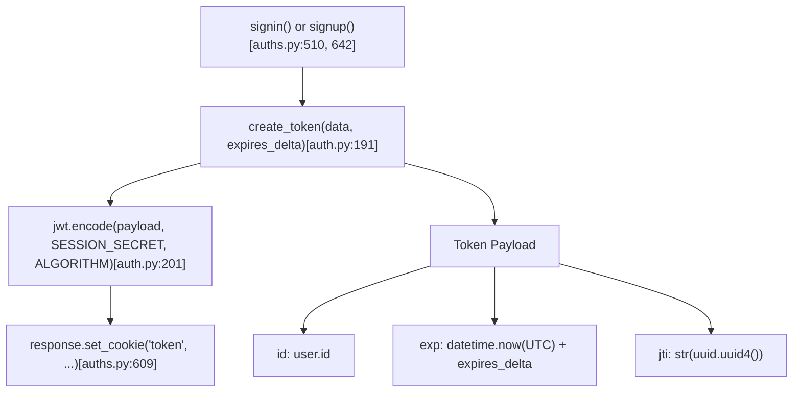
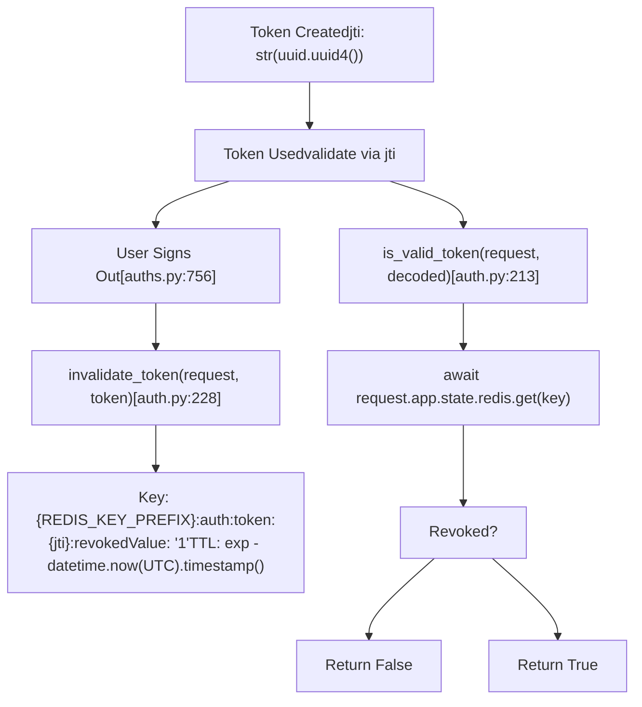
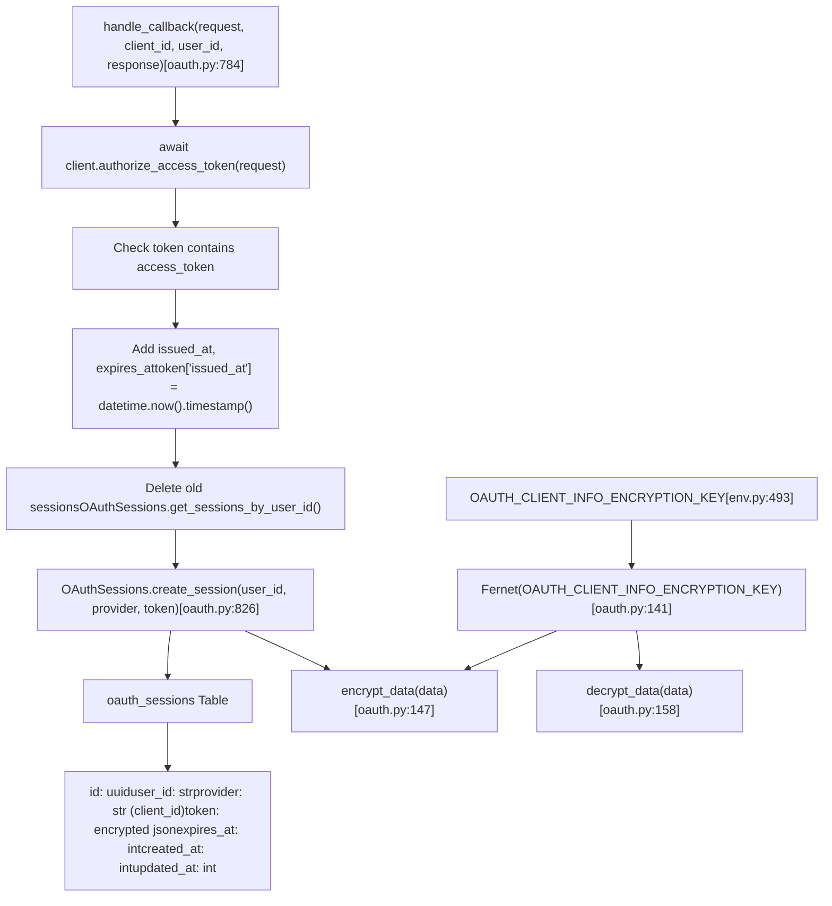
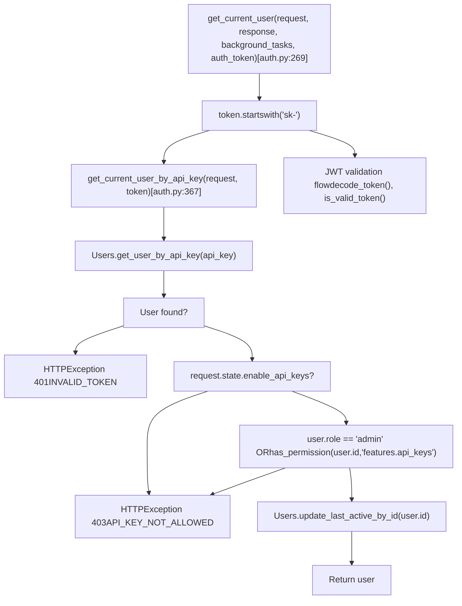

# Session and Token Management

Relevant source files

-   [backend/open\_webui/env.py](https://github.com/open-webui/open-webui/blob/a7271532/backend/open_webui/env.py)
-   [backend/open\_webui/routers/audio.py](https://github.com/open-webui/open-webui/blob/a7271532/backend/open_webui/routers/audio.py)
-   [backend/open\_webui/routers/auths.py](https://github.com/open-webui/open-webui/blob/a7271532/backend/open_webui/routers/auths.py)
-   [backend/open\_webui/routers/ollama.py](https://github.com/open-webui/open-webui/blob/a7271532/backend/open_webui/routers/ollama.py)
-   [backend/open\_webui/routers/openai.py](https://github.com/open-webui/open-webui/blob/a7271532/backend/open_webui/routers/openai.py)
-   [backend/open\_webui/utils/auth.py](https://github.com/open-webui/open-webui/blob/a7271532/backend/open_webui/utils/auth.py)
-   [backend/open\_webui/utils/embeddings.py](https://github.com/open-webui/open-webui/blob/a7271532/backend/open_webui/utils/embeddings.py)
-   [backend/open\_webui/utils/misc.py](https://github.com/open-webui/open-webui/blob/a7271532/backend/open_webui/utils/misc.py)
-   [backend/open\_webui/utils/oauth.py](https://github.com/open-webui/open-webui/blob/a7271532/backend/open_webui/utils/oauth.py)
-   [backend/open\_webui/utils/response.py](https://github.com/open-webui/open-webui/blob/a7271532/backend/open_webui/utils/response.py)

This document covers the session and token management system in Open WebUI, including JWT token creation and validation, Redis-based token revocation, OAuth session storage, and cookie configuration. This page focuses on the technical implementation of token lifecycles and session persistence.

For information about authentication methods (password, LDAP, OAuth), see [Authentication Methods](/open-webui/open-webui/10.1-authentication-methods). For OAuth provider configuration and user provisioning, see [OAuth Integration](/open-webui/open-webui/10.2-oauth-integration).

---

## Overview

Open WebUI implements a multi-layered authentication system with:

-   **JWT tokens** for stateless authentication with optional Redis-based revocation
-   **API keys** for programmatic access (format: `sk-{uuid}`)
-   **HTTP cookies** for browser-based session persistence
-   **OAuth sessions** stored server-side with encrypted token data

The system supports both stateless (JWT) and stateful (Redis revocation, OAuth sessions) authentication patterns.

---

## JWT Token System

### Token Creation

JWT tokens are created using the `create_token()` function in [backend/open\_webui/utils/auth.py191-202](https://github.com/open-webui/open-webui/blob/a7271532/backend/open_webui/utils/auth.py#L191-L202)

**Token Creation Flow**


**Sources:** [backend/open\_webui/utils/auth.py191-202](https://github.com/open-webui/open-webui/blob/a7271532/backend/open_webui/utils/auth.py#L191-L202) [backend/open\_webui/routers/auths.py597-616](https://github.com/open-webui/open-webui/blob/a7271532/backend/open_webui/routers/auths.py#L597-L616)

### Token Structure

Each JWT token contains:

| Claim | Description | Source |
| --- | --- | --- |
| `id` | User identifier | Passed in `data` parameter |
| `exp` | Expiration timestamp (Unix epoch) | Calculated from `JWT_EXPIRES_IN` config |
| `jti` | JWT ID (UUID v4) | Generated for revocation tracking |

The token is signed using the **HS256** algorithm with `WEBUI_SECRET_KEY` from [backend/open\_webui/env.py457-462](https://github.com/open-webui/open-webui/blob/a7271532/backend/open_webui/env.py#L457-L462)

**Sources:** [backend/open\_webui/utils/auth.py191-202](https://github.com/open-webui/open-webui/blob/a7271532/backend/open_webui/utils/auth.py#L191-L202) [backend/open\_webui/env.py450-455](https://github.com/open-webui/open-webui/blob/a7271532/backend/open_webui/env.py#L450-L455)

### Token Validation

Token validation occurs in `get_current_user()` at [backend/open\_webui/utils/auth.py269-364](https://github.com/open-webui/open-webui/blob/a7271532/backend/open_webui/utils/auth.py#L269-L364)

**Token Validation Sequence**

> **[Mermaid sequence]**
> *(图表结构无法解析)*

**Sources:** [backend/open\_webui/utils/auth.py269-364](https://github.com/open-webui/open-webui/blob/a7271532/backend/open_webui/utils/auth.py#L269-L364) [backend/open\_webui/utils/auth.py205-210](https://github.com/open-webui/open-webui/blob/a7271532/backend/open_webui/utils/auth.py#L205-L210) [backend/open\_webui/utils/auth.py213-225](https://github.com/open-webui/open-webui/blob/a7271532/backend/open_webui/utils/auth.py#L213-L225)

### Token Expiration Configuration

Token expiration is controlled by the `JWT_EXPIRES_IN` configuration parameter, which supports duration formats:

-   `-1` or `0`: No expiration
-   Numeric with unit: `30d`, `12h`, `60m`, `3600s`, `500ms`, `2w`

The value is parsed by `parse_duration()` at [backend/open\_webui/utils/misc.py428-456](https://github.com/open-webui/open-webui/blob/a7271532/backend/open_webui/utils/misc.py#L428-L456) and converted to a `timedelta` object. During authentication, this is calculated at [backend/open\_webui/routers/auths.py592-595](https://github.com/open-webui/open-webui/blob/a7271532/backend/open_webui/routers/auths.py#L592-L595)

**Sources:** [backend/open\_webui/routers/auths.py592-595](https://github.com/open-webui/open-webui/blob/a7271532/backend/open_webui/routers/auths.py#L592-L595) [backend/open\_webui/utils/misc.py428-456](https://github.com/open-webui/open-webui/blob/a7271532/backend/open_webui/utils/misc.py#L428-L456)

---

## Token Revocation

Open WebUI implements an optional Redis-based token revocation system using the JWT ID (`jti`) claim.

### Redis-Based Revocation Architecture

**Redis-Based Revocation Architecture**


**Sources:** [backend/open\_webui/utils/auth.py213-247](https://github.com/open-webui/open-webui/blob/a7271532/backend/open_webui/utils/auth.py#L213-L247) [backend/open\_webui/env.py361-377](https://github.com/open-webui/open-webui/blob/a7271532/backend/open_webui/env.py#L361-L377)

### Revocation Implementation

The `invalidate_token()` function at [backend/open\_webui/utils/auth.py228-247](https://github.com/open-webui/open-webui/blob/a7271532/backend/open_webui/utils/auth.py#L228-L247) performs revocation:

1.  Decode the token using `decode_token(token)` to extract `jti` and `exp`
2.  Calculate TTL: `ttl = exp - int(datetime.now(UTC).timestamp())`
3.  If TTL > 0, store in Redis: `await redis.set(key, "1", ex=ttl)`
    -   Key format: `{REDIS_KEY_PREFIX}:auth:token:{jti}:revoked`
    -   Value: `"1"`
    -   Expiration: TTL seconds

During validation, `is_valid_token()` at [backend/open\_webui/utils/auth.py213-225](https://github.com/open-webui/open-webui/blob/a7271532/backend/open_webui/utils/auth.py#L213-L225) checks if the key exists in Redis. If present, the token is rejected.

**Note:** Revocation requires Redis to be configured via `REDIS_URL` in [backend/open\_webui/env.py361](https://github.com/open-webui/open-webui/blob/a7271532/backend/open_webui/env.py#L361-L361)

**Sources:** [backend/open\_webui/utils/auth.py228-247](https://github.com/open-webui/open-webui/blob/a7271532/backend/open_webui/utils/auth.py#L228-L247) [backend/open\_webui/utils/auth.py213-225](https://github.com/open-webui/open-webui/blob/a7271532/backend/open_webui/utils/auth.py#L213-L225) [backend/open\_webui/env.py361-364](https://github.com/open-webui/open-webui/blob/a7271532/backend/open_webui/env.py#L361-L364)

---

## Cookie Configuration

### Cookie Settings Overview

Open WebUI sets authentication cookies with configurable security attributes:

| Environment Variable | Default | Purpose |
| --- | --- | --- |
| `WEBUI_SESSION_COOKIE_SAME_SITE` | `lax` | SameSite attribute for session cookie |
| `WEBUI_SESSION_COOKIE_SECURE` | `false` | Secure flag for session cookie |
| `WEBUI_AUTH_COOKIE_SAME_SITE` | (inherits session) | SameSite for auth-specific cookie |
| `WEBUI_AUTH_COOKIE_SECURE` | (inherits session) | Secure flag for auth-specific cookie |

Configuration is loaded in [backend/open\_webui/env.py457-473](https://github.com/open-webui/open-webui/blob/a7271532/backend/open_webui/env.py#L457-L473)

**Sources:** [backend/open\_webui/env.py457-473](https://github.com/open-webui/open-webui/blob/a7271532/backend/open_webui/env.py#L457-L473)

### Cookie Setting Implementation

Cookies are set during authentication flows at signin, signup, and LDAP authentication:

```
# Pattern used in auths.py
response.set_cookie(
    key="token",
    value=token,
    expires=datetime_expires_at,
    httponly=True,  # Not accessible via JavaScript
    samesite=WEBUI_AUTH_COOKIE_SAME_SITE,
    secure=WEBUI_AUTH_COOKIE_SECURE,
)
```
Cookie setting locations:

-   Signin: [backend/open\_webui/routers/auths.py609-616](https://github.com/open-webui/open-webui/blob/a7271532/backend/open_webui/routers/auths.py#L609-L616)
-   Signup: [backend/open\_webui/routers/auths.py704-711](https://github.com/open-webui/open-webui/blob/a7271532/backend/open_webui/routers/auths.py#L704-L711)
-   LDAP: [backend/open\_webui/routers/auths.py451-464](https://github.com/open-webui/open-webui/blob/a7271532/backend/open_webui/routers/auths.py#L451-L464)
-   Session user: [backend/open\_webui/routers/auths.py126-137](https://github.com/open-webui/open-webui/blob/a7271532/backend/open_webui/routers/auths.py#L126-L137)

**Sources:** [backend/open\_webui/routers/auths.py609-616](https://github.com/open-webui/open-webui/blob/a7271532/backend/open_webui/routers/auths.py#L609-L616) [backend/open\_webui/routers/auths.py704-711](https://github.com/open-webui/open-webui/blob/a7271532/backend/open_webui/routers/auths.py#L704-L711) [backend/open\_webui/routers/auths.py451-464](https://github.com/open-webui/open-webui/blob/a7271532/backend/open_webui/routers/auths.py#L451-L464)

### Cookie Types

The system manages multiple cookie types:

| Cookie Name | Purpose | Set By | Deleted On Signout |
| --- | --- | --- | --- |
| `token` | JWT authentication token | signin/signup | Yes |
| `oui-session` | Session identifier | (socket.io) | Yes |
| `oauth_id_token` | OAuth ID token | OAuth callback | Yes |
| `oauth_session_id` | OAuth session reference | OAuth callback | Yes |

Signout at [backend/open\_webui/routers/auths.py756-829](https://github.com/open-webui/open-webui/blob/a7271532/backend/open_webui/routers/auths.py#L756-L829) deletes all cookies and invalidates the token:

```
# Extract token from Authorization header or cookies
token = auth_cred.credentials if auth_header else request.cookies.get("token")

# Invalidate token in Redis if available
if token:
    await invalidate_token(request, token)

# Delete all authentication cookies
response.delete_cookie("token")
response.delete_cookie("oui-session")
response.delete_cookie("oauth_id_token")
```
**Sources:** [backend/open\_webui/routers/auths.py756-829](https://github.com/open-webui/open-webui/blob/a7271532/backend/open_webui/routers/auths.py#L756-L829)

---

## OAuth Session Management

OAuth sessions are stored server-side with encrypted token data, separate from JWT authentication.

### OAuth Session Storage

**OAuth Session Storage Architecture**


**Sources:** [backend/open\_webui/utils/oauth.py784-836](https://github.com/open-webui/open-webui/blob/a7271532/backend/open_webui/utils/oauth.py#L784-L836) [backend/open\_webui/utils/oauth.py147-165](https://github.com/open-webui/open-webui/blob/a7271532/backend/open_webui/utils/oauth.py#L147-L165) [backend/open\_webui/env.py493-499](https://github.com/open-webui/open-webui/blob/a7271532/backend/open_webui/env.py#L493-L499)

### Token Encryption

OAuth tokens are encrypted before database storage using the `encrypt_data()` function at [backend/open\_webui/utils/oauth.py147-155](https://github.com/open-webui/open-webui/blob/a7271532/backend/open_webui/utils/oauth.py#L147-L155):

1.  Token data is serialized to JSON using `json.dumps(data)`
2.  Fernet cipher encrypts the JSON string: `FERNET.encrypt(data_json.encode())`
3.  Encrypted string (bytes decoded to string) is stored in the `token` column

The encryption key is initialized at module load from `OAUTH_CLIENT_INFO_ENCRYPTION_KEY`:

-   If key length ≠ 44 bytes: SHA256 hash is computed and base64url-encoded
-   If key length = 44 bytes: Used directly
-   Default value: `WEBUI_SECRET_KEY` from [backend/open\_webui/env.py493-499](https://github.com/open-webui/open-webui/blob/a7271532/backend/open_webui/env.py#L493-L499)

The Fernet instance is created at [backend/open\_webui/utils/oauth.py134-144](https://github.com/open-webui/open-webui/blob/a7271532/backend/open_webui/utils/oauth.py#L134-L144)

**Sources:** [backend/open\_webui/utils/oauth.py147-165](https://github.com/open-webui/open-webui/blob/a7271532/backend/open_webui/utils/oauth.py#L147-L165) [backend/open\_webui/utils/oauth.py134-144](https://github.com/open-webui/open-webui/blob/a7271532/backend/open_webui/utils/oauth.py#L134-L144) [backend/open\_webui/env.py493-499](https://github.com/open-webui/open-webui/blob/a7271532/backend/open_webui/env.py#L493-L499)

### Token Refresh Mechanism

OAuth tokens are automatically refreshed when needed by `get_oauth_token()`:

**OAuth Token Refresh Sequence**

> **[Mermaid sequence]**
> *(图表结构无法解析)*

**Sources:** [backend/open\_webui/utils/oauth.py601-645](https://github.com/open-webui/open-webui/blob/a7271532/backend/open_webui/utils/oauth.py#L601-L645) [backend/open\_webui/utils/oauth.py647-674](https://github.com/open-webui/open-webui/blob/a7271532/backend/open_webui/utils/oauth.py#L647-L674) [backend/open\_webui/utils/oauth.py676-765](https://github.com/open-webui/open-webui/blob/a7271532/backend/open_webui/utils/oauth.py#L676-L765)

Token refresh logic at [backend/open\_webui/utils/oauth.py601-765](https://github.com/open-webui/open-webui/blob/a7271532/backend/open_webui/utils/oauth.py#L601-L765):

1.  **Check expiration:** `datetime.now() + timedelta(minutes=5) >= datetime.fromtimestamp(session.expires_at)` or `force_refresh=True`
2.  **Fetch token endpoint:** GET `server_metadata_url` to retrieve `token_endpoint`
3.  **Request new token:** POST to `token_endpoint` with:
    -   `grant_type=refresh_token`
    -   `refresh_token=token["refresh_token"]`
    -   `client_id` and optionally `client_secret`
4.  **Process response:**
    -   Preserve `refresh_token` if not included in response
    -   Add `issued_at = datetime.now().timestamp()`
    -   Calculate `expires_at = datetime.now().timestamp() + expires_in`
5.  **Update session:** Call `OAuthSessions.update_session_by_id(session.id, new_token_data)`

**Sources:** [backend/open\_webui/utils/oauth.py601-645](https://github.com/open-webui/open-webui/blob/a7271532/backend/open_webui/utils/oauth.py#L601-L645) [backend/open\_webui/utils/oauth.py676-765](https://github.com/open-webui/open-webui/blob/a7271532/backend/open_webui/utils/oauth.py#L676-L765)

---

## API Key Authentication

API keys provide an alternative authentication mechanism for programmatic access.

### API Key Format and Storage

-   **Format:** `sk-{uuid}` where uuid is generated without hyphens using `str(uuid.uuid4()).replace("-", "")`
-   **Generation:** `create_api_key()` at [backend/open\_webui/utils/auth.py254-256](https://github.com/open-webui/open-webui/blob/a7271532/backend/open_webui/utils/auth.py#L254-L256)
-   **Storage:** Stored in `users` table `api_key` column
-   **Creation endpoint:** `POST /api/v1/auths/api_key` (requires admin or `features.api_keys` permission)

**Sources:** [backend/open\_webui/utils/auth.py254-256](https://github.com/open-webui/open-webui/blob/a7271532/backend/open_webui/utils/auth.py#L254-L256) [backend/open\_webui/routers/auths.py](https://github.com/open-webui/open-webui/blob/a7271532/backend/open_webui/routers/auths.py)

### API Key Validation

**API Key Validation Flow**


**Sources:** [backend/open\_webui/utils/auth.py269-298](https://github.com/open-webui/open-webui/blob/a7271532/backend/open_webui/utils/auth.py#L269-L298) [backend/open\_webui/utils/auth.py367-397](https://github.com/open-webui/open-webui/blob/a7271532/backend/open_webui/utils/auth.py#L367-L397)

API key validation at [backend/open\_webui/utils/auth.py367-397](https://github.com/open-webui/open-webui/blob/a7271532/backend/open_webui/utils/auth.py#L367-L397) checks:

1.  User exists with matching API key via `Users.get_user_by_api_key(api_key)`
2.  `request.state.enable_api_keys` is true (controlled by backend configuration)
3.  User is admin OR has `features.api_keys` permission via `has_permission(user.id, "features.api_keys", request.app.state.config.USER_PERMISSIONS)`

If validation succeeds, the user's last active timestamp is updated synchronously via `Users.update_last_active_by_id(user.id)`.

**Sources:** [backend/open\_webui/utils/auth.py367-397](https://github.com/open-webui/open-webui/blob/a7271532/backend/open_webui/utils/auth.py#L367-L397)

---

## Session Lifecycle Diagram

**Session Lifecycle State Diagram**

**Sources:** [backend/open\_webui/routers/auths.py510-829](https://github.com/open-webui/open-webui/blob/a7271532/backend/open_webui/routers/auths.py#L510-L829) [backend/open\_webui/utils/oauth.py601-765](https://github.com/open-webui/open-webui/blob/a7271532/backend/open_webui/utils/oauth.py#L601-L765) [backend/open\_webui/utils/auth.py191-247](https://github.com/open-webui/open-webui/blob/a7271532/backend/open_webui/utils/auth.py#L191-L247)

---

## Configuration Reference

### Environment Variables

| Variable | Type | Default | Description |
| --- | --- | --- | --- |
| `WEBUI_SECRET_KEY` | string | `"t0p-s3cr3t"` | JWT signing key (HS256 algorithm) - stored as `SESSION_SECRET` constant |
| `JWT_EXPIRES_IN` | duration | (config-dependent) | Token expiration time (e.g., `"30d"`, `"12h"`) |
| `WEBUI_SESSION_COOKIE_SAME_SITE` | string | `"lax"` | Cookie SameSite attribute (`"lax"`, `"strict"`, or `"none"`) |
| `WEBUI_SESSION_COOKIE_SECURE` | bool | `false` | Cookie Secure flag (set to `true` for HTTPS) |
| `WEBUI_AUTH_COOKIE_SAME_SITE` | string | (inherits session value) | Auth cookie SameSite attribute |
| `WEBUI_AUTH_COOKIE_SECURE` | bool | (inherits session value) | Auth cookie Secure flag |
| `REDIS_URL` | string | `""` | Redis connection URL for token revocation |
| `REDIS_KEY_PREFIX` | string | `"open-webui"` | Prefix for all Redis keys |
| `OAUTH_CLIENT_INFO_ENCRYPTION_KEY` | string | (defaults to `WEBUI_SECRET_KEY`) | Fernet key for encrypting OAuth tokens in database |
| `OAUTH_SESSION_TOKEN_ENCRYPTION_KEY` | string | (defaults to `WEBUI_SECRET_KEY`) | Alternative encryption key for OAuth session tokens |
| `ENABLE_OAUTH_ID_TOKEN_COOKIE` | bool | `true` | Store OAuth ID token in cookie for client access |

**Sources:** [backend/open\_webui/env.py450-499](https://github.com/open-webui/open-webui/blob/a7271532/backend/open_webui/env.py#L450-L499) [backend/open\_webui/utils/auth.py49-50](https://github.com/open-webui/open-webui/blob/a7271532/backend/open_webui/utils/auth.py#L49-L50)

### Redis Key Schema

| Key Pattern | Purpose | TTL |
| --- | --- | --- |
| `{prefix}:auth:token:{jti}:revoked` | Revoked JWT token | Token expiration |

**Sources:** [backend/open\_webui/utils/auth.py219-243](https://github.com/open-webui/open-webui/blob/a7271532/backend/open_webui/utils/auth.py#L219-L243)

### Database Tables

**oauth\_sessions table:**

-   `id`: UUID primary key
-   `user_id`: Foreign key to users table
-   `provider`: OAuth provider identifier (e.g., `"google"`, `"github"`)
-   `token`: Encrypted JSON containing access\_token, refresh\_token, expires\_at
-   `expires_at`: Token expiration timestamp
-   `created_at`: Session creation timestamp
-   `updated_at`: Last update timestamp

**Sources:** [backend/open\_webui/models/oauth\_sessions.py](https://github.com/open-webui/open-webui/blob/a7271532/backend/open_webui/models/oauth_sessions.py)

---

## Security Considerations

1.  **JWT Secret:** Change `WEBUI_SECRET_KEY` from default in production
2.  **Cookie Security:** Enable `WEBUI_AUTH_COOKIE_SECURE=true` when using HTTPS
3.  **SameSite:** Use `strict` or `lax` for SameSite attribute
4.  **Token Revocation:** Configure Redis for immediate token invalidation on signout
5.  **API Keys:** Restrict with `ENABLE_API_KEYS_ENDPOINT_RESTRICTIONS`
6.  **OAuth Encryption:** Use a unique `OAUTH_CLIENT_INFO_ENCRYPTION_KEY` separate from JWT secret

**Sources:** [backend/open\_webui/env.py457-506](https://github.com/open-webui/open-webui/blob/a7271532/backend/open_webui/env.py#L457-L506) [backend/open\_webui/utils/auth.py52-53](https://github.com/open-webui/open-webui/blob/a7271532/backend/open_webui/utils/auth.py#L52-L53)
