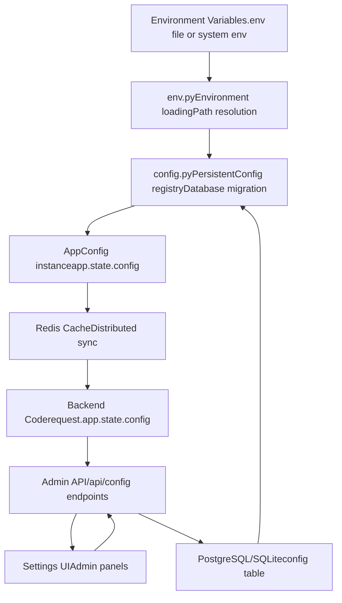
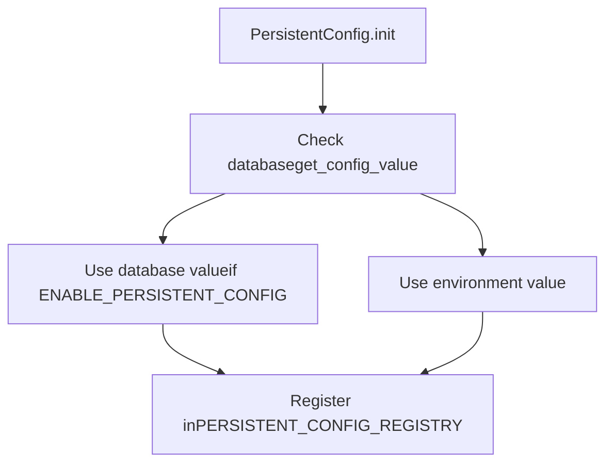
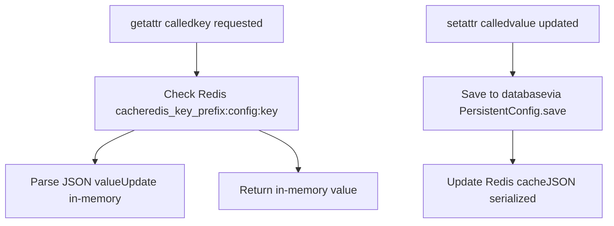
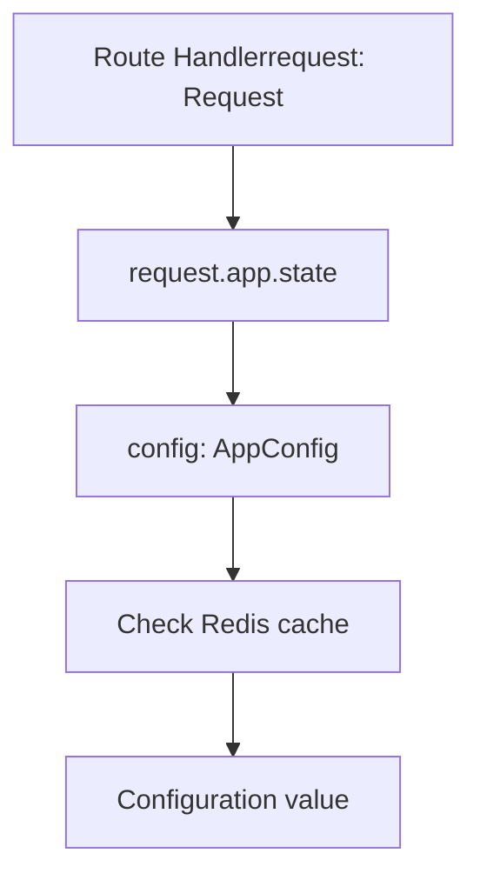
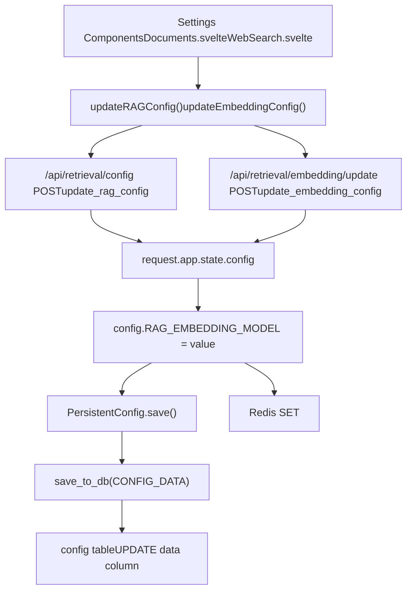
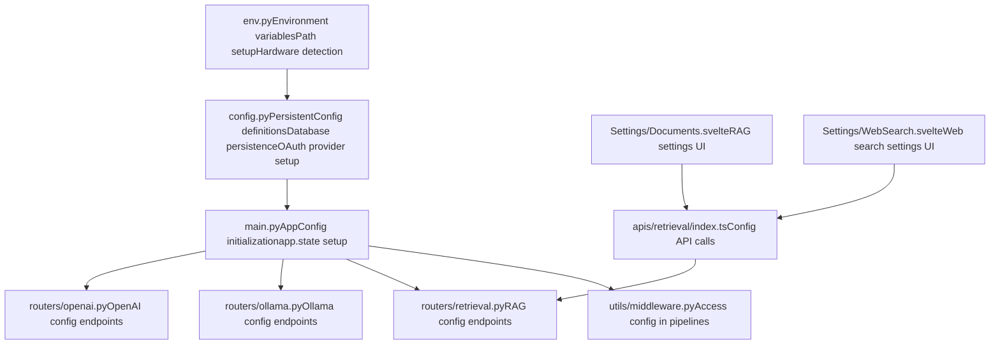
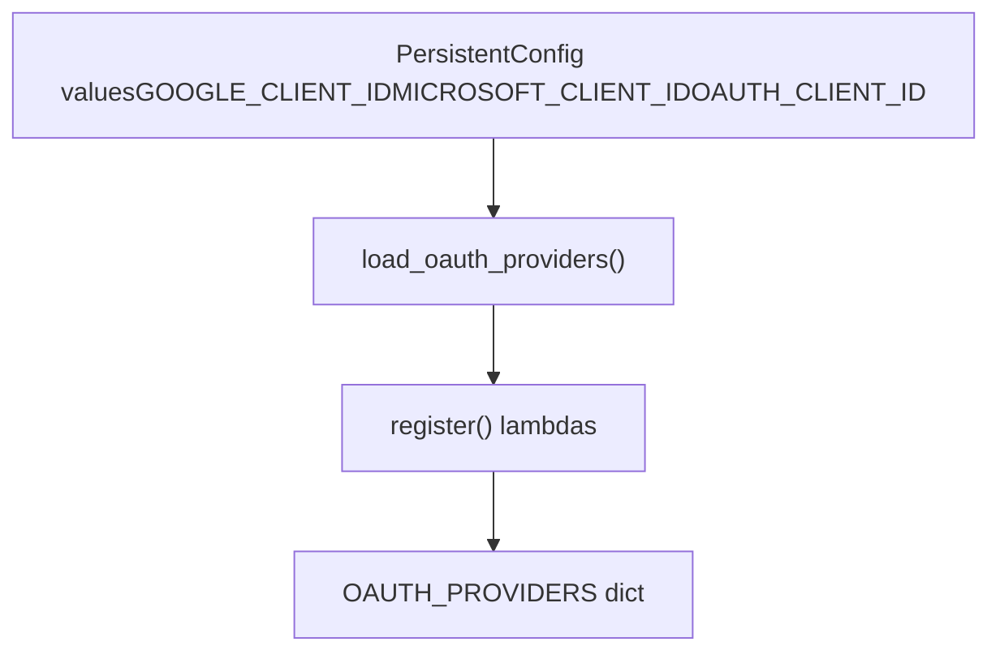

# Configuration Management

Relevant source files

-   [backend/open\_webui/config.py](https://github.com/open-webui/open-webui/blob/a7271532/backend/open_webui/config.py)
-   [backend/open\_webui/env.py](https://github.com/open-webui/open-webui/blob/a7271532/backend/open_webui/env.py)
-   [backend/open\_webui/main.py](https://github.com/open-webui/open-webui/blob/a7271532/backend/open_webui/main.py)
-   [backend/open\_webui/retrieval/loaders/datalab\_marker.py](https://github.com/open-webui/open-webui/blob/a7271532/backend/open_webui/retrieval/loaders/datalab_marker.py)
-   [backend/open\_webui/retrieval/loaders/external\_document.py](https://github.com/open-webui/open-webui/blob/a7271532/backend/open_webui/retrieval/loaders/external_document.py)
-   [backend/open\_webui/retrieval/loaders/external\_web.py](https://github.com/open-webui/open-webui/blob/a7271532/backend/open_webui/retrieval/loaders/external_web.py)
-   [backend/open\_webui/retrieval/loaders/main.py](https://github.com/open-webui/open-webui/blob/a7271532/backend/open_webui/retrieval/loaders/main.py)
-   [backend/open\_webui/retrieval/loaders/mineru.py](https://github.com/open-webui/open-webui/blob/a7271532/backend/open_webui/retrieval/loaders/mineru.py)
-   [backend/open\_webui/retrieval/loaders/mistral.py](https://github.com/open-webui/open-webui/blob/a7271532/backend/open_webui/retrieval/loaders/mistral.py)
-   [backend/open\_webui/retrieval/utils.py](https://github.com/open-webui/open-webui/blob/a7271532/backend/open_webui/retrieval/utils.py)
-   [backend/open\_webui/routers/audio.py](https://github.com/open-webui/open-webui/blob/a7271532/backend/open_webui/routers/audio.py)
-   [backend/open\_webui/routers/auths.py](https://github.com/open-webui/open-webui/blob/a7271532/backend/open_webui/routers/auths.py)
-   [backend/open\_webui/routers/ollama.py](https://github.com/open-webui/open-webui/blob/a7271532/backend/open_webui/routers/ollama.py)
-   [backend/open\_webui/routers/openai.py](https://github.com/open-webui/open-webui/blob/a7271532/backend/open_webui/routers/openai.py)
-   [backend/open\_webui/routers/retrieval.py](https://github.com/open-webui/open-webui/blob/a7271532/backend/open_webui/routers/retrieval.py)
-   [backend/open\_webui/utils/auth.py](https://github.com/open-webui/open-webui/blob/a7271532/backend/open_webui/utils/auth.py)
-   [backend/open\_webui/utils/embeddings.py](https://github.com/open-webui/open-webui/blob/a7271532/backend/open_webui/utils/embeddings.py)
-   [backend/open\_webui/utils/middleware.py](https://github.com/open-webui/open-webui/blob/a7271532/backend/open_webui/utils/middleware.py)
-   [backend/open\_webui/utils/misc.py](https://github.com/open-webui/open-webui/blob/a7271532/backend/open_webui/utils/misc.py)
-   [backend/open\_webui/utils/oauth.py](https://github.com/open-webui/open-webui/blob/a7271532/backend/open_webui/utils/oauth.py)
-   [backend/open\_webui/utils/response.py](https://github.com/open-webui/open-webui/blob/a7271532/backend/open_webui/utils/response.py)
-   [src/lib/apis/retrieval/index.ts](https://github.com/open-webui/open-webui/blob/a7271532/src/lib/apis/retrieval/index.ts)
-   [src/lib/components/admin/Settings/Documents.svelte](https://github.com/open-webui/open-webui/blob/a7271532/src/lib/components/admin/Settings/Documents.svelte)
-   [src/lib/components/admin/Settings/WebSearch.svelte](https://github.com/open-webui/open-webui/blob/a7271532/src/lib/components/admin/Settings/WebSearch.svelte)

## Purpose and Scope

This document explains Open WebUI's two-tier configuration management system, which combines environment variables with persistent database storage. The system allows runtime configuration updates while maintaining backwards compatibility with environment-based configuration.

For initial deployment setup and environment variable reference, see [Environment Configuration](/open-webui/open-webui/3.3-environment-configuration). For database setup details, see [Data and Storage Layer](/open-webui/open-webui/2.4-data-and-storage-layer).

## Configuration Architecture Overview

Open WebUI uses a hybrid configuration approach that merges static environment variables with dynamic database-persisted settings:


**Sources:** [backend/open\_webui/env.py1-100](https://github.com/open-webui/open-webui/blob/a7271532/backend/open_webui/env.py#L1-L100) [backend/open\_webui/config.py1-150](https://github.com/open-webui/open-webui/blob/a7271532/backend/open_webui/config.py#L1-L150) [backend/open\_webui/main.py638-656](https://github.com/open-webui/open-webui/blob/a7271532/backend/open_webui/main.py#L638-L656)

## Core Configuration Classes

### Config Database Model

The `Config` SQLAlchemy model stores all persistent configuration in a single JSON column:

| Column | Type | Description |
| --- | --- | --- |
| `id` | Integer | Primary key |
| `data` | JSON | All configuration key-value pairs |
| `version` | Integer | Configuration version number |
| `created_at` | DateTime | Creation timestamp |
| `updated_at` | DateTime | Last update timestamp |

Configuration is stored as nested JSON with dot-notation paths (e.g., `oauth.google.client_id`).

**Sources:** [backend/open\_webui/config.py73-81](https://github.com/open-webui/open-webui/blob/a7271532/backend/open_webui/config.py#L73-L81)

### PersistentConfig Class

`PersistentConfig` is a generic class that manages individual configuration values with automatic environment/database fallback:


Key methods and attributes:

-   **`__init__(env_name, config_path, env_value)`** - Initializes with environment variable name, database path, and default value
-   **`value`** - Current configuration value (from DB if available, otherwise from env)
-   **`update()`** - Refreshes value from database when `save_config()` is called globally
-   **`save()`** - Persists current value to database

**Sources:** [backend/open\_webui/config.py165-222](https://github.com/open-webui/open-webui/blob/a7271532/backend/open_webui/config.py#L165-L222)

Example configuration declaration:

```
ENABLE_SIGNUP = PersistentConfig(
    "ENABLE_SIGNUP",
    "auth.enable_signup",
    os.environ.get("ENABLE_SIGNUP", "True").lower() == "true"
)
```
**Sources:** [backend/open\_webui/config.py742-743](https://github.com/open-webui/open-webui/blob/a7271532/backend/open_webui/config.py#L742-L743)

### AppConfig Class

`AppConfig` provides runtime access to configuration with Redis-based distributed caching:


Key features:

-   **`_state`** - Dictionary mapping config keys to `PersistentConfig` instances
-   **`_redis`** - Redis connection for distributed synchronization
-   **`__getattr__`** - Checks Redis for updates before returning values
-   **`__setattr__`** - Saves to database and broadcasts to Redis

**Sources:** [backend/open\_webui/config.py224-284](https://github.com/open-webui/open-webui/blob/a7271532/backend/open_webui/config.py#L224-L284)

## Configuration Initialization Flow

The configuration system initializes in three phases during application startup:

> **[Mermaid sequence]**
> *(图表结构无法解析)*

**Sources:** [backend/open\_webui/env.py34-70](https://github.com/open-webui/open-webui/blob/a7271532/backend/open_webui/env.py#L34-L70) [backend/open\_webui/config.py53-70](https://github.com/open-webui/open-webui/blob/a7271532/backend/open_webui/config.py#L53-L70) [backend/open\_webui/config.py107-125](https://github.com/open-webui/open-webui/blob/a7271532/backend/open_webui/config.py#L107-L125) [backend/open\_webui/main.py570-656](https://github.com/open-webui/open-webui/blob/a7271532/backend/open_webui/main.py#L570-L656)

Configuration files are processed in this order:

1.  **env.py** - Loads environment variables and sets up paths
2.  **config.py** - Runs migrations, loads database config, creates `PersistentConfig` instances
3.  **main.py** - Creates `AppConfig` instance and initializes `app.state.config`

**Sources:** [backend/open\_webui/main.py441-479](https://github.com/open-webui/open-webui/blob/a7271532/backend/open_webui/main.py#L441-L479) [backend/open\_webui/config.py1-50](https://github.com/open-webui/open-webui/blob/a7271532/backend/open_webui/config.py#L1-L50)

## Configuration Access Patterns

### Backend Access Pattern

Backend code accesses configuration through the FastAPI request object:


Example access patterns:

```
# In route handlers
embedding_model = request.app.state.config.RAG_EMBEDDING_MODEL

# In middleware
if request.app.state.config.ENABLE_WEB_SEARCH:
    # ... web search logic
```
**Sources:** [backend/open\_webui/utils/middleware.py555-625](https://github.com/open-webui/open-webui/blob/a7271532/backend/open_webui/utils/middleware.py#L555-L625) [backend/open\_webui/routers/retrieval.py249-261](https://github.com/open-webui/open-webui/blob/a7271532/backend/open_webui/routers/retrieval.py#L249-L261)

### Redis-Based Distributed Caching

When Redis is configured, `AppConfig` automatically synchronizes configuration updates across multiple instances:

> **[Mermaid sequence]**
> *(图表结构无法解析)*

Redis keys use the format: `{REDIS_KEY_PREFIX}:config:{CONFIG_KEY}`

**Sources:** [backend/open\_webui/config.py251-283](https://github.com/open-webui/open-webui/blob/a7271532/backend/open_webui/config.py#L251-L283) [backend/open\_webui/env.py361-367](https://github.com/open-webui/open-webui/blob/a7271532/backend/open_webui/env.py#L361-L367)

## Configuration Update Flow

Configuration can be updated at runtime through admin API endpoints:


**Sources:** [src/lib/components/admin/Settings/Documents.svelte141-234](https://github.com/open-webui/open-webui/blob/a7271532/src/lib/components/admin/Settings/Documents.svelte#L141-L234) [backend/open\_webui/routers/retrieval.py329-441](https://github.com/open-webui/open-webui/blob/a7271532/backend/open_webui/routers/retrieval.py#L329-L441) [backend/open\_webui/config.py251-261](https://github.com/open-webui/open-webui/blob/a7271532/backend/open_webui/config.py#L251-L261)

### Update API Endpoints

Key configuration endpoints:

| Endpoint | Method | Purpose | Admin Only |
| --- | --- | --- | --- |
| `/api/retrieval/config` | GET | Get RAG configuration | Yes |
| `/api/retrieval/config` | POST | Update RAG configuration | Yes |
| `/api/retrieval/embedding` | GET | Get embedding configuration | Yes |
| `/api/retrieval/embedding/update` | POST | Update embedding model | Yes |
| `/api/openai/config` | GET | Get OpenAI configuration | Yes |
| `/api/openai/config/update` | POST | Update OpenAI configuration | Yes |
| `/api/ollama/config` | GET | Get Ollama configuration | Yes |
| `/api/ollama/config/update` | POST | Update Ollama configuration | Yes |

**Sources:** [backend/open\_webui/routers/retrieval.py443-522](https://github.com/open-webui/open-webui/blob/a7271532/backend/open_webui/routers/retrieval.py#L443-L522) [backend/open\_webui/routers/openai.py207-231](https://github.com/open-webui/open-webui/blob/a7271532/backend/open_webui/routers/openai.py#L207-L231) [backend/open\_webui/routers/ollama.py235-259](https://github.com/open-webui/open-webui/blob/a7271532/backend/open_webui/routers/ollama.py#L235-L259)

## Key Configuration Categories

Open WebUI manages configuration across multiple functional domains:

| Category | Key Configs | Location in DB | Source File |
| --- | --- | --- | --- |
| **Authentication** | `ENABLE_SIGNUP`, `JWT_EXPIRES_IN`, `ENABLE_API_KEYS` | `auth.*` | config.py:290-316 |
| **OAuth** | `GOOGLE_CLIENT_ID`, `OAUTH_MERGE_ACCOUNTS_BY_EMAIL`, `ENABLE_OAUTH_SIGNUP` | `oauth.*` | config.py:327-800 |
| **LDAP** | `ENABLE_LDAP`, `LDAP_SERVER_HOST`, `LDAP_SEARCH_BASE` | `ldap.*` | config.py:795-813 |
| **RAG/Embedding** | `RAG_EMBEDDING_MODEL`, `RAG_EMBEDDING_ENGINE`, `CHUNK_SIZE` | `rag.*` | config.py:836-916 |
| **Web Search** | `ENABLE_WEB_SEARCH`, `WEB_SEARCH_ENGINE`, `SEARXNG_QUERY_URL` | `web.*` | config.py:923-983 |
| **Image Generation** | `ENABLE_IMAGE_GENERATION`, `IMAGE_GENERATION_ENGINE`, `COMFYUI_BASE_URL` | `image.*` | config.py:1088-1112 |
| **Audio** | `AUDIO_TTS_ENGINE`, `AUDIO_STT_ENGINE`, `WHISPER_MODEL` | `audio.*` | config.py:1126-1202 |
| **Ollama** | `ENABLE_OLLAMA_API`, `OLLAMA_BASE_URLS`, `OLLAMA_API_CONFIGS` | `ollama.*` | config.py:681-683 |
| **OpenAI** | `ENABLE_OPENAI_API`, `OPENAI_API_BASE_URLS`, `OPENAI_API_KEYS` | `openai.*` | config.py:693-696 |

**Sources:** [backend/open\_webui/config.py286-1202](https://github.com/open-webui/open-webui/blob/a7271532/backend/open_webui/config.py#L286-L1202)

### Non-Persistent Environment Variables

Some configuration values remain environment-only and do not support database persistence:

| Variable | Purpose | Defined In |
| --- | --- | --- |
| `DATA_DIR` | Data storage directory | env.py:210-233 |
| `DATABASE_URL` | Database connection string | env.py:257-286 |
| `REDIS_URL` | Redis connection string | env.py:361 |
| `WEBUI_SECRET_KEY` | JWT signing key | env.py:450-455 |
| `DEVICE_TYPE` | Hardware acceleration (cpu/cuda/mps) | env.py:44-69 |
| `ENABLE_PERSISTENT_CONFIG` | Enable/disable DB persistence | config.py:160-162 |
| `ENABLE_OAUTH_PERSISTENT_CONFIG` | Enable/disable OAuth DB persistence | config.py:328-330 |

**Sources:** [backend/open\_webui/env.py210-455](https://github.com/open-webui/open-webui/blob/a7271532/backend/open_webui/env.py#L210-L455) [backend/open\_webui/config.py160-330](https://github.com/open-webui/open-webui/blob/a7271532/backend/open_webui/config.py#L160-L330)

## Configuration File Organization

The configuration system spans multiple files with distinct responsibilities:


**File Responsibilities:**

-   **env.py** - Environment variable loading, path resolution, hardware detection
-   **config.py** - Configuration persistence, `PersistentConfig` registry, OAuth setup
-   **main.py** - Application initialization, `AppConfig` instantiation
-   **routers/retrieval.py** - RAG and embedding configuration API
-   **routers/ollama.py** - Ollama connection configuration API
-   **routers/openai.py** - OpenAI connection configuration API
-   **Settings/\*.svelte** - Admin UI components for configuration

**Sources:** [backend/open\_webui/env.py1-50](https://github.com/open-webui/open-webui/blob/a7271532/backend/open_webui/env.py#L1-L50) [backend/open\_webui/config.py1-100](https://github.com/open-webui/open-webui/blob/a7271532/backend/open_webui/config.py#L1-L100) [backend/open\_webui/main.py1-100](https://github.com/open-webui/open-webui/blob/a7271532/backend/open_webui/main.py#L1-L100) [backend/open\_webui/routers/retrieval.py1-50](https://github.com/open-webui/open-webui/blob/a7271532/backend/open_webui/routers/retrieval.py#L1-L50) [src/lib/components/admin/Settings/Documents.svelte1-50](https://github.com/open-webui/open-webui/blob/a7271532/src/lib/components/admin/Settings/Documents.svelte#L1-L50)

## Special Configuration Features

### OAuth Dynamic Configuration

OAuth providers can be configured at runtime through the database. The `load_oauth_providers()` function rebuilds the `OAUTH_PROVIDERS` dictionary from `PersistentConfig` values:


When OAuth config is updated, `load_oauth_providers()` must be called to rebuild the provider registry.

**Sources:** [backend/open\_webui/config.py639-821](https://github.com/open-webui/open-webui/blob/a7271532/backend/open_webui/config.py#L639-L821)

### Configuration Reset

The `RESET_CONFIG_ON_START` environment variable triggers `reset_config()` during startup, which deletes all rows from the `config` table, forcing all configuration to fall back to environment variables:

```
if RESET_CONFIG_ON_START:
    reset_config()
```
**Sources:** [backend/open\_webui/main.py575-576](https://github.com/open-webui/open-webui/blob/a7271532/backend/open_webui/main.py#L575-L576) [backend/open\_webui/config.py101-105](https://github.com/open-webui/open-webui/blob/a7271532/backend/open_webui/config.py#L101-L105)

### Legacy config.json Migration

During initialization, if `{DATA_DIR}/config.json` exists, it's automatically migrated to the database:

```
if os.path.exists(f"{DATA_DIR}/config.json"):
    data = load_json_config()
    save_to_db(data)
    os.rename(f"{DATA_DIR}/config.json", f"{DATA_DIR}/old_config.json")
```
**Sources:** [backend/open\_webui/config.py108-112](https://github.com/open-webui/open-webui/blob/a7271532/backend/open_webui/config.py#L108-L112)

## Configuration Access Control

All configuration update endpoints require admin authentication:

```
@router.post("/config/update")
async def update_config(
    request: Request,
    form_data: ConfigForm,
    user=Depends(get_admin_user)  # Admin only
):
```
Regular users can only read their own permitted configuration through endpoints that use `get_verified_user` instead.

**Sources:** [backend/open\_webui/routers/retrieval.py443-444](https://github.com/open-webui/open-webui/blob/a7271532/backend/open_webui/routers/retrieval.py#L443-L444) [backend/open\_webui/utils/auth.py225-285](https://github.com/open-webui/open-webui/blob/a7271532/backend/open_webui/utils/auth.py#L225-L285)
