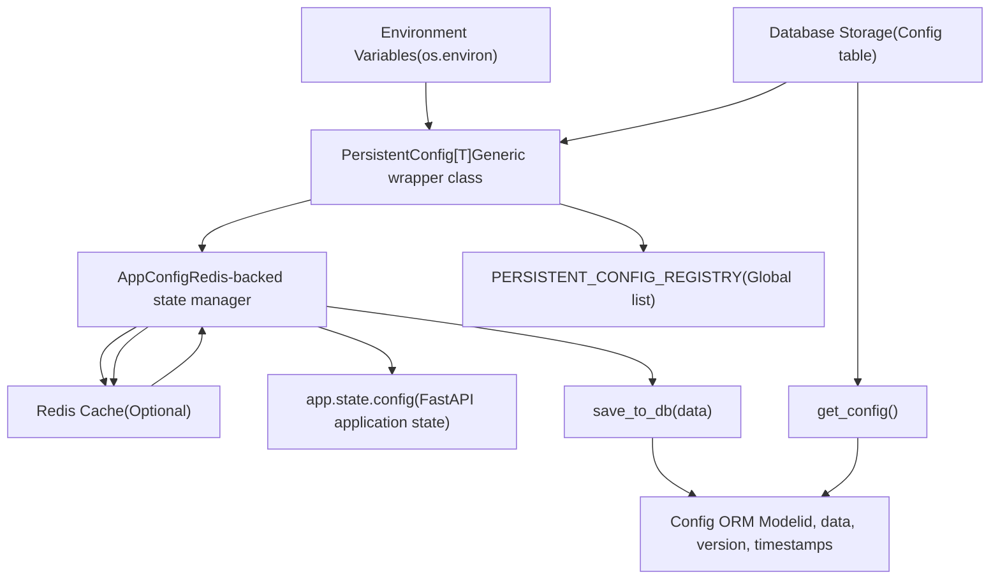
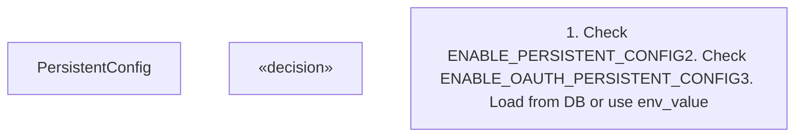
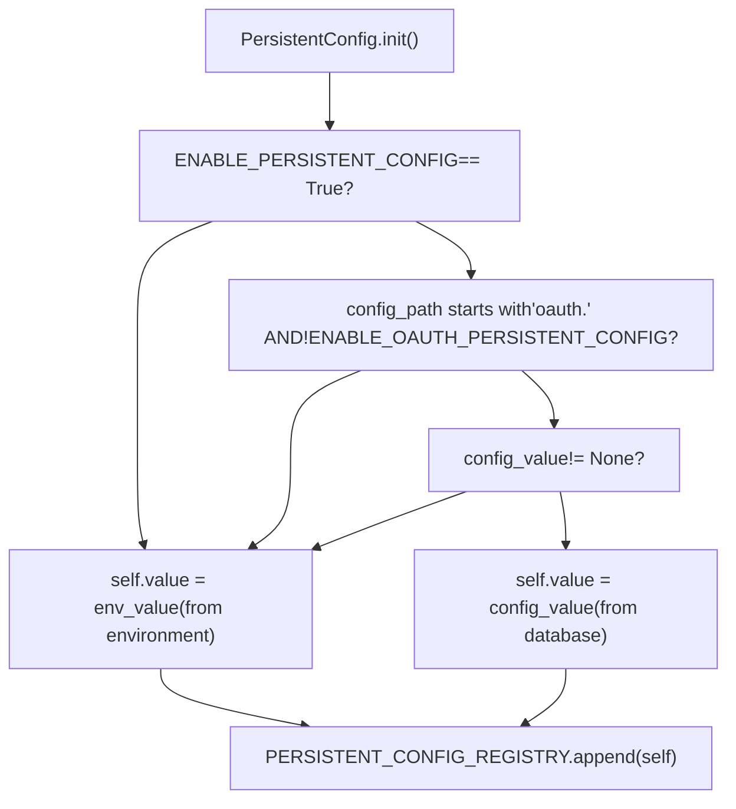
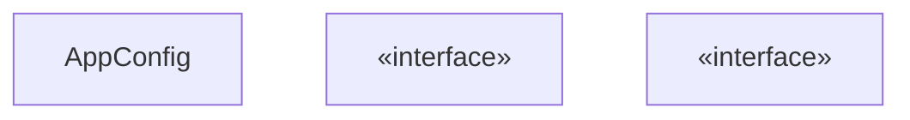
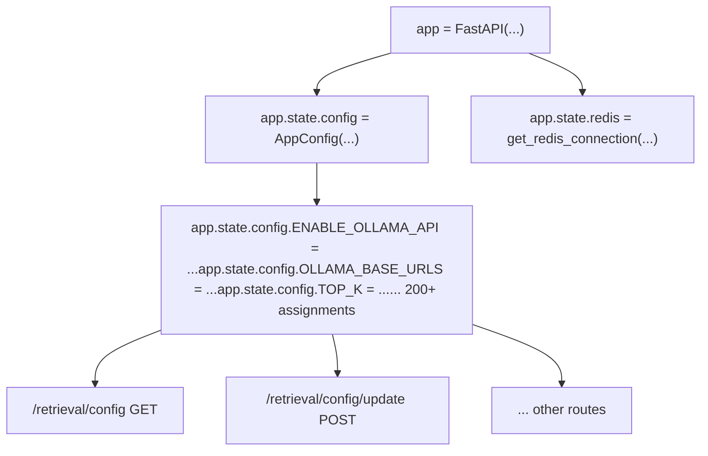
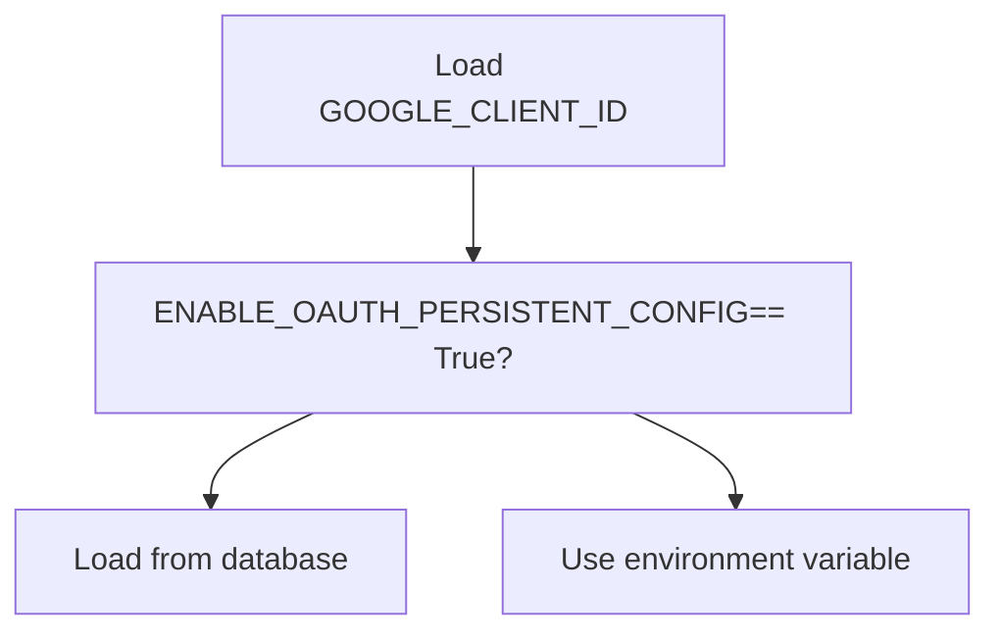
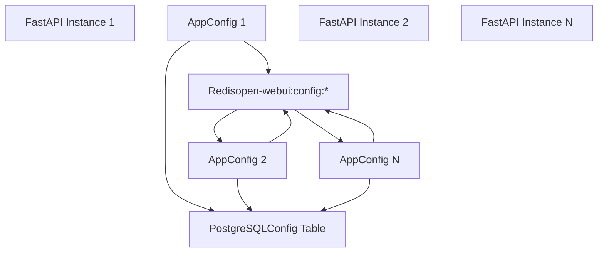
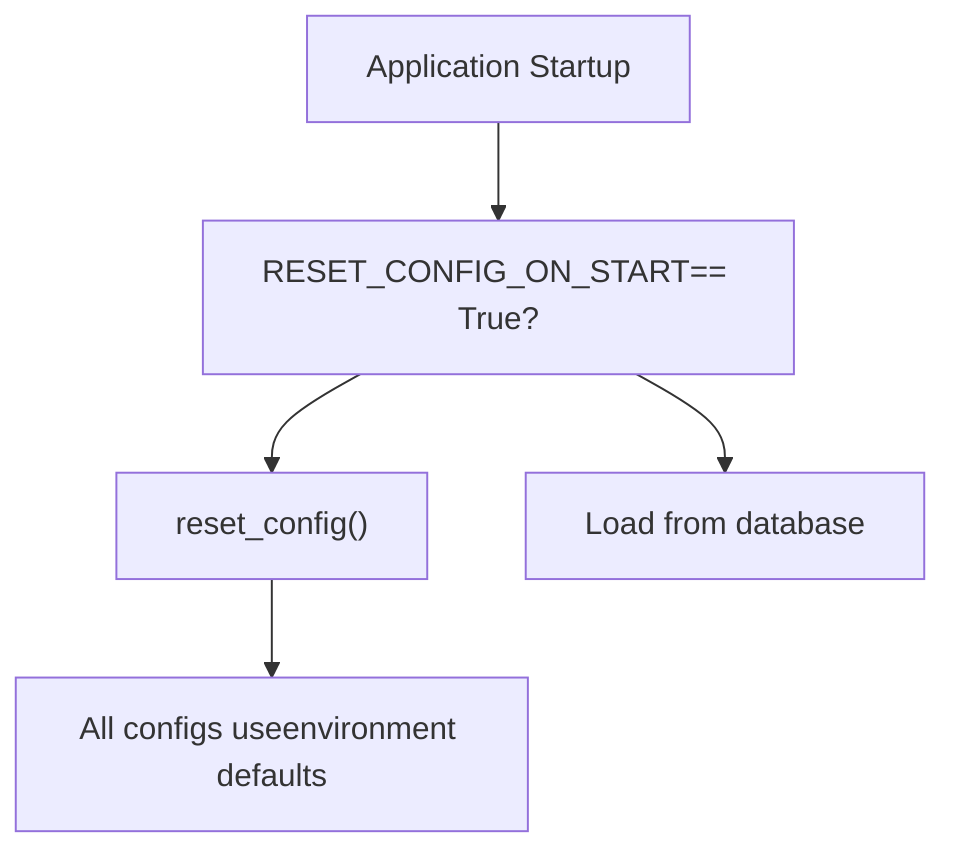
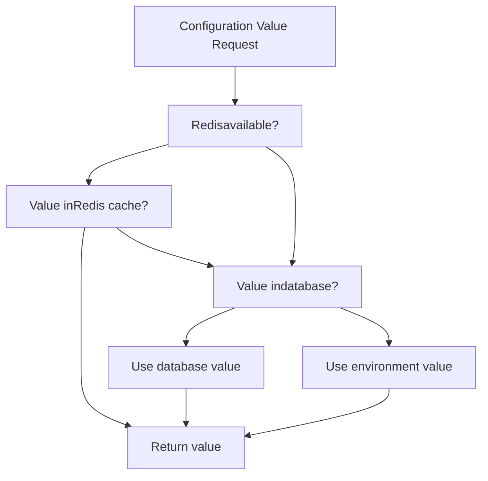

# Persistent Configuration System

Relevant source files

-   [backend/open\_webui/config.py](https://github.com/open-webui/open-webui/blob/a7271532/backend/open_webui/config.py)
-   [backend/open\_webui/main.py](https://github.com/open-webui/open-webui/blob/a7271532/backend/open_webui/main.py)
-   [backend/open\_webui/retrieval/loaders/datalab\_marker.py](https://github.com/open-webui/open-webui/blob/a7271532/backend/open_webui/retrieval/loaders/datalab_marker.py)
-   [backend/open\_webui/retrieval/loaders/external\_document.py](https://github.com/open-webui/open-webui/blob/a7271532/backend/open_webui/retrieval/loaders/external_document.py)
-   [backend/open\_webui/retrieval/loaders/external\_web.py](https://github.com/open-webui/open-webui/blob/a7271532/backend/open_webui/retrieval/loaders/external_web.py)
-   [backend/open\_webui/retrieval/loaders/main.py](https://github.com/open-webui/open-webui/blob/a7271532/backend/open_webui/retrieval/loaders/main.py)
-   [backend/open\_webui/retrieval/loaders/mineru.py](https://github.com/open-webui/open-webui/blob/a7271532/backend/open_webui/retrieval/loaders/mineru.py)
-   [backend/open\_webui/retrieval/loaders/mistral.py](https://github.com/open-webui/open-webui/blob/a7271532/backend/open_webui/retrieval/loaders/mistral.py)
-   [backend/open\_webui/retrieval/utils.py](https://github.com/open-webui/open-webui/blob/a7271532/backend/open_webui/retrieval/utils.py)
-   [backend/open\_webui/routers/retrieval.py](https://github.com/open-webui/open-webui/blob/a7271532/backend/open_webui/routers/retrieval.py)
-   [backend/open\_webui/utils/middleware.py](https://github.com/open-webui/open-webui/blob/a7271532/backend/open_webui/utils/middleware.py)
-   [src/lib/apis/retrieval/index.ts](https://github.com/open-webui/open-webui/blob/a7271532/src/lib/apis/retrieval/index.ts)
-   [src/lib/components/admin/Settings/Documents.svelte](https://github.com/open-webui/open-webui/blob/a7271532/src/lib/components/admin/Settings/Documents.svelte)
-   [src/lib/components/admin/Settings/WebSearch.svelte](https://github.com/open-webui/open-webui/blob/a7271532/src/lib/components/admin/Settings/WebSearch.svelte)

## Purpose and Scope

The Persistent Configuration System provides a two-tier configuration management layer that combines environment variables with database-backed persistent storage. This system allows configuration values to be updated at runtime and persisted across application restarts, with optional Redis-based caching for distributed deployments.

For information about environment variable initialization and hardware detection, see [Environment Configuration](/open-webui/open-webui/11.1-environment-configuration). For the user interface for managing these settings, see [Settings UI](/open-webui/open-webui/11.3-settings-ui).

## System Architecture


**Sources:** [backend/open\_webui/config.py1-285](https://github.com/open-webui/open-webui/blob/a7271532/backend/open_webui/config.py#L1-L285)

## Database Storage Layer

### Config ORM Model

The `Config` table stores configuration data as a JSON blob with versioning and timestamps:


The configuration data is stored as a nested JSON structure where paths like `"oauth.google.client_id"` map to nested dictionaries:

```
{
  "version": 0,
  "ui": {},
  "oauth": {
    "google": {
      "client_id": "...",
      "client_secret": "..."
    }
  }
}
```
**Sources:** [backend/open\_webui/config.py73-155](https://github.com/open-webui/open-webui/blob/a7271532/backend/open_webui/config.py#L73-L155)

### Configuration Migration

On startup, if a legacy `config.json` file exists in `DATA_DIR`, it is automatically migrated to the database:

| Operation | Function | Description |
| --- | --- | --- |
| Load JSON | `load_json_config()` | Reads config.json from DATA\_DIR |
| Save to DB | `save_to_db(data)` | Inserts or updates Config table |
| Migration | Automatic on startup | Renames config.json to old\_config.json |

**Sources:** [backend/open\_webui/config.py83-111](https://github.com/open-webui/open-webui/blob/a7271532/backend/open_webui/config.py#L83-L111)

## PersistentConfig Class

### Type-Safe Configuration Wrapper

`PersistentConfig[T]` is a generic class that wraps individual configuration values, providing type safety and automatic synchronization between environment variables and database storage:


**Sources:** [backend/open\_webui/config.py165-222](https://github.com/open-webui/open-webui/blob/a7271532/backend/open_webui/config.py#L165-L222)

### Initialization Logic

When a `PersistentConfig` instance is created, it follows this priority chain:


**Sources:** [backend/open\_webui/config.py166-187](https://github.com/open-webui/open-webui/blob/a7271532/backend/open_webui/config.py#L166-L187)

### Configuration Update Mechanism

The `update()` method is called when the global configuration is saved, allowing all registered instances to refresh their values:

| Method | Purpose | Triggers |
| --- | --- | --- |
| `update()` | Refresh value from database | Called by `save_config()` |
| `save()` | Write value to database | Called by `AppConfig.__setattr__` |

**Sources:** [backend/open\_webui/config.py205-221](https://github.com/open-webui/open-webui/blob/a7271532/backend/open_webui/config.py#L205-L221)

## AppConfig Class

### Redis-Backed State Manager

`AppConfig` provides a dictionary-like interface with automatic persistence and optional Redis caching:


**Sources:** [backend/open\_webui/config.py224-283](https://github.com/open-webui/open-webui/blob/a7271532/backend/open_webui/config.py#L224-L283)

### Attribute Access Flow

#### Read Operation (`__getattr__`)

> **[Mermaid sequence]**
> *(图表结构无法解析)*

**Sources:** [backend/open\_webui/config.py262-283](https://github.com/open-webui/open-webui/blob/a7271532/backend/open_webui/config.py#L262-L283)

#### Write Operation (`__setattr__`)

> **[Mermaid sequence]**
> *(图表结构无法解析)*

**Sources:** [backend/open\_webui/config.py251-260](https://github.com/open-webui/open-webui/blob/a7271532/backend/open_webui/config.py#L251-L260)

## Configuration Registry

### Global Registry Pattern

All `PersistentConfig` instances are automatically registered in a global list, enabling bulk updates:

**Sources:** [backend/open\_webui/config.py139-155](https://github.com/open-webui/open-webui/blob/a7271532/backend/open_webui/config.py#L139-L155)

### Registry Usage Examples

The registry is used in `save_config()` to propagate changes to all configuration instances:

| Step | Operation | Effect |
| --- | --- | --- |
| 1 | `save_to_db(config)` | Persist to database |
| 2 | `CONFIG_DATA = config` | Update global state |
| 3 | `for config_item in PERSISTENT_CONFIG_REGISTRY` | Iterate registry |
| 4 | `config_item.update()` | Refresh each instance from DB |

**Sources:** [backend/open\_webui/config.py142-155](https://github.com/open-webui/open-webui/blob/a7271532/backend/open_webui/config.py#L142-L155)

## Application Integration

### FastAPI Application State

The `AppConfig` instance is attached to the FastAPI application state during startup:


**Sources:** [backend/open\_webui/main.py633-656](https://github.com/open-webui/open-webui/blob/a7271532/backend/open_webui/main.py#L633-L656) [backend/open\_webui/main.py681-1200](https://github.com/open-webui/open-webui/blob/a7271532/backend/open_webui/main.py#L681-L1200)

### Configuration Usage in Routes

Routes access configuration through `request.app.state.config`:

```
# Example from retrieval router
@router.get("/config")
async def get_rag_config(request: Request, user=Depends(get_admin_user)):
    return {
        "RAG_TEMPLATE": request.app.state.config.RAG_TEMPLATE,
        "TOP_K": request.app.state.config.TOP_K,
        "CHUNK_SIZE": request.app.state.config.CHUNK_SIZE,
        # ... more config values
    }
```
**Sources:** [backend/open\_webui/routers/retrieval.py443-527](https://github.com/open-webui/open-webui/blob/a7271532/backend/open_webui/routers/retrieval.py#L443-L527)

## Configuration Update Flow

### End-to-End Update Process

> **[Mermaid sequence]**
> *(图表结构无法解析)*

**Sources:** [backend/open\_webui/config.py142-155](https://github.com/open-webui/open-webui/blob/a7271532/backend/open_webui/config.py#L142-L155) [backend/open\_webui/config.py251-283](https://github.com/open-webui/open-webui/blob/a7271532/backend/open_webui/config.py#L251-L283) [backend/open\_webui/routers/retrieval.py824-921](https://github.com/open-webui/open-webui/blob/a7271532/backend/open_webui/routers/retrieval.py#L824-L921)

## Configuration Categories

### Major Configuration Groups

The system manages configuration across multiple domains:

| Category | Example Configs | Config Path Prefix |
| --- | --- | --- |
| Authentication | `JWT_EXPIRES_IN`, `ENABLE_API_KEYS` | `auth.*` |
| OAuth | `GOOGLE_CLIENT_ID`, `OAUTH_SCOPES` | `oauth.*` |
| RAG | `RAG_EMBEDDING_MODEL`, `CHUNK_SIZE` | Various |
| LLM Providers | `OLLAMA_BASE_URLS`, `OPENAI_API_KEYS` | Various |
| Web UI | `ENABLE_SIGNUP`, `DEFAULT_MODELS` | Various |
| Web Search | `WEB_SEARCH_ENGINE`, `BRAVE_SEARCH_API_KEY` | `web.*` |

**Sources:** [backend/open\_webui/config.py290-821](https://github.com/open-webui/open-webui/blob/a7271532/backend/open_webui/config.py#L290-L821)

### OAuth Configuration Special Handling

OAuth configurations have a special flag `ENABLE_OAUTH_PERSISTENT_CONFIG` that controls whether they load from the database:


This allows administrators to choose between managing OAuth settings via environment variables (for security) or database (for convenience).

**Sources:** [backend/open\_webui/config.py173-180](https://github.com/open-webui/open-webui/blob/a7271532/backend/open_webui/config.py#L173-L180) [backend/open\_webui/config.py328-330](https://github.com/open-webui/open-webui/blob/a7271532/backend/open_webui/config.py#L328-L330)

## Redis Distribution Layer

### Multi-Instance Synchronization

When Redis is configured, the system supports distributed deployments where multiple Open WebUI instances share configuration state:


The Redis key pattern is `{redis_key_prefix}:config:{config_key}`, defaulting to `open-webui:config:{config_key}`.

**Sources:** [backend/open\_webui/config.py224-283](https://github.com/open-webui/open-webui/blob/a7271532/backend/open_webui/config.py#L224-L283) [backend/open\_webui/main.py649-655](https://github.com/open-webui/open-webui/blob/a7271532/backend/open_webui/main.py#L649-L655)

## Configuration Reset

### Reset Mechanism

The system provides a `reset_config()` function to clear all persisted configuration:

```
def reset_config():
    with get_db() as db:
        db.query(Config).delete()
        db.commit()
```
This is triggered by the `RESET_CONFIG_ON_START` environment variable:


**Sources:** [backend/open\_webui/config.py101-105](https://github.com/open-webui/open-webui/blob/a7271532/backend/open_webui/config.py#L101-L105) [backend/open\_webui/main.py575-576](https://github.com/open-webui/open-webui/blob/a7271532/backend/open_webui/main.py#L575-L576)

## Configuration Priority

### Value Resolution Order

The system resolves configuration values using this priority order (highest to lowest):

1.  **Runtime updates** via API (persisted to database and Redis)
2.  **Database storage** (Config table)
3.  **Environment variables** (initial values)


**Sources:** [backend/open\_webui/config.py165-222](https://github.com/open-webui/open-webui/blob/a7271532/backend/open_webui/config.py#L165-L222) [backend/open\_webui/config.py262-283](https://github.com/open-webui/open-webui/blob/a7271532/backend/open_webui/config.py#L262-L283)
